# Which branch moved

Week 1, Day 2. Half one.

Kicker: WEEK 1  ·  TUESDAY  ·  HALF ONE
Quote: Are we losing customers, or are the ones we have buying less? Marketing says more customers. Prove it or disprove it.
Who: Meera Raghavan, CEO, Kalpa Retail, replying to Monday's numbers

```notes
LIVE, one minute. Read Meera's reply aloud and leave it on screen while the room settles. Monday
drew the tree; today the tree meets two quarters of orders, and the question is which branch moved.
The morning runs the ask and five chapters, each about 30 minutes and each paired with one notebook.
```

---

## S1. Meera wants to know which branch moved
*Q2 came in below Q1, and she names the two branches she suspects.*

**The client asks.** "So revenue is customers, times how often they buy, times basket, times price. Now: which of those moved? Q2 was Rs 1.9 crore, Q1 was 2.1. Are we losing customers, or are the ones we have buying less? Marketing says more customers. Prove it or disprove it."

```stats
value: Rs 2.1 cr | label: Q1, April to June | note: as Meera remembers it
value: Rs 1.9 cr | label: Q2, July to September | note: as Meera remembers it
value: Rs 12 cr | label: waiting on the answer | note: Marketing's acquisition ask
```

Kalpa Retail India's financial year opens in April, so Q1 is April to June and Q2 is July to September of 2026-27.

```notes
LIVE, 3 minutes. Read the message aloud. Meera says Monday's tree back to us. Her figures are
rounded and from memory; the file gives exact ones. The retail story behind her words, how a store
chain earns and who owns which lever, is in Monday's domain dossier; point at it, do not retell it.
Ask which number worries her most. The Rs 12 crore: it is about to be spent on an unchecked branch.
```

---

## S2. Three voices, three incentives, one set of numbers
*Each stakeholder owns a lever, so the decomposition decides whose problem the fall is.*

```cards
icon: user-round | eyebrow: The CEO | title: Meera Raghavan | body: Owns the budget. Wants the branch that moved before she funds any lever, and a sentence she can repeat to the board.
icon: crown | eyebrow: The paid tier | title: The head of Retail-Plus | body: Owns member renewals. Forwards a complaint that the app's reorder feature has been broken for six weeks, and asks whether his tier is slipping.
icon: megaphone | eyebrow: Acquisition | title: The marketing lead | body: Owns new customers. Has a slide showing revenue falling by a quarter, and an answer already: more customers. | tone: dark
```

**Your role.** The team works for the number, and each voice gets the same one. A branch that moved hands the problem to the person who owns that lever; a branch that stayed flat takes a budget off the table.

```notes
LIVE, 2 minutes. Name the incentive behind each voice without judging it. Marketing is paid to
acquire, so it reads every fall as an acquisition problem; that is how the role is paid and says
nothing about good faith. The head of Retail-Plus wants a verdict on his tier; he gets a number in
chapter 3 and a test of his cause in chapter 6. Anand Iyer, Finance, is listening too.
```

---

## S3. What each branch costs to move, and who pays
*Every branch has a lever, an owner and a price, and they are not the same price.*

| Branch | The lever | Who owns it | What moving it costs |
|---|---|---|---|
| Customers | Acquisition campaigns | The marketing lead | Marketing spend, before any repeat order |
| Orders per customer | Retention, reminders, reorder | Tier and product owners | Service and product work on people already won |
| Revenue per order | Range, bundles, basket | Merchandising | Assortment and margin decisions |
| Price and discounts | Price lists, offers | Finance with Marketing | Volume at risk, or margin given away |

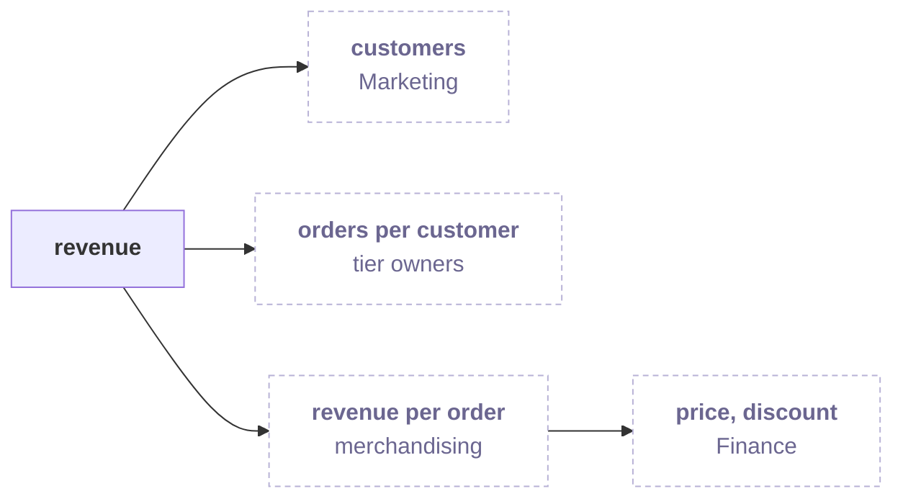
```mermaid
flowchart LR
    R["<b>revenue</b>"] --> C["<b>customers</b><br/>Marketing"]
    R --> F["<b>orders per customer</b><br/>tier owners"]
    R --> V["<b>revenue per order</b><br/>merchandising"]
    V --> P["<b>price, discount</b><br/>Finance"]
    classDef unknown fill:#FFFFFF,stroke:#B8B2D6,color:#6B6690,stroke-dasharray:4 3
    class C,F,V,P unknown
```

```notes
LIVE, 3 minutes. The cost list is the curriculum row's own. Its use today: if the fall sits in
frequency, a cheaper lever is on the table and the Rs 12 crore is aimed at the wrong branch. That is
why every chapter puts rupees on a branch. Chapter 5 brings the published estimates of acquisition
against retention cost.
```

---

## S4. Question: what could manufacture a drop?
*Before anyone explains a fall, list what could make one appear when the business had none.*

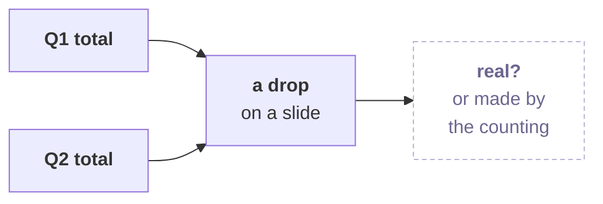
```mermaid
flowchart LR
    A["<b>Q1 total</b>"] --> D["<b>a drop</b><br/>on a slide"]
    B["<b>Q2 total</b>"] --> D
    D --> Q["<b>real?</b><br/>or made by<br/>the counting"]
    classDef unknown fill:#FFFFFF,stroke:#B8B2D6,color:#6B6690,stroke-dasharray:4 3
    class Q unknown
```

**Question.** In pairs, two minutes: name three places between a customer's checkout and a dashboard tile where a fall could be created that the business never had.

```notes
LIVE, 3 minutes. Two minutes in pairs, then collect answers on the board. Expect "different lengths
of time", "different definition of sales", "missing values", "one huge order". Push for places in
the system as well as in the arithmetic. Keep every answer; the next slide places them on the map.
```

---

## S5. Answer: a fake drop has an address in the pipeline
*Every number on a dashboard passed through four hands, and each hand can manufacture a fall.*

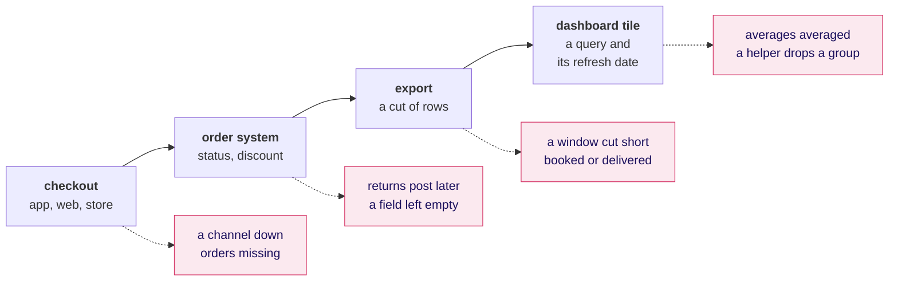
```mermaid
flowchart LR
    C["<b>checkout</b><br/>app, web, store"] --> O["<b>order system</b><br/>status, discount"]
    O --> E["<b>export</b><br/>a cut of rows"]
    E --> T["<b>dashboard tile</b><br/>a query and<br/>its refresh date"]
    C -.-> F1["a channel down<br/>orders missing"]
    O -.-> F2["returns post later<br/>a field left empty"]
    E -.-> F3["a window cut short<br/>booked or delivered"]
    T -.-> F4["averages averaged<br/>a helper drops a group"]
    classDef bad fill:#FBE9EF,stroke:#D63A6A,color:#1A0F5C
    class F1,F2,F3,F4 bad
```

**The rule.** Find the hop a number came through before you explain it. Today's traps live at these addresses: the window, the empty field, the roll-up and the helper.

```notes
LIVE, 2 minutes. Place the room's answers on the four hops. Chapter 1 is the export and the tile;
chapter 2 is the order system's empty field; chapter 3 is the dashboard's roll-up; chapter 5 is a
summary script. Checking the pipeline first is the cheapest investigation there is.
```

---

## S6. The ladder, six chapters, one case
*Each chapter answers a harder question, and each has a trap waiting in it.*

| Chapter | The question | Who asks | The trap it guards |
|---|---|---|---|
| 1 | Is the drop real? | Meera, against Marketing's slide | Quarters of unequal length |
| 2 | Which branch moved? | Meera | A missing discount read as zero |
| 3 | Which segment? | The head of Retail-Plus | Averages averaged |
| 4 | Mix or rate? | Marketing, on price | A blended rate read as a price rise |
| 5 | Marketing's hypothesis | Marketing | A helper that drops a segment |
| 6 | The memo and its evidence | The tier and Meera | A cause blamed for the whole fall |

**The rule.** Confirm, compare like with like, decompose, isolate, then hypothesise. Every chapter weighs two to four ways to answer its question, sizes them, picks one, and reaches the same number a second way.

```notes
LIVE, 3 minutes. Draw the ladder on the board, top to bottom, and leave it there all day. Chapters 1
to 5 run this morning, chapter 6 opens the afternoon. This table is also the answer shape for
interview question 1. Source for the ladder's order: britinstitute.uk, data analyst case study
questions, verified 29 Sep 2026.
```

---

## S7. Monday's tree, where changes multiply
*The branches multiply into revenue, so their changes multiply too, and never simply add.*

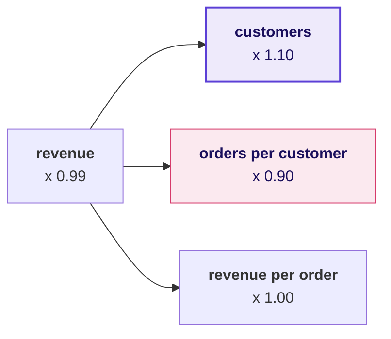
```mermaid
flowchart LR
    R["<b>revenue</b><br/>x 0.99"] --> C["<b>customers</b><br/>x 1.10"]
    R --> F["<b>orders per customer</b><br/>x 0.90"]
    R --> O["<b>revenue per order</b><br/>x 1.00"]
    classDef known fill:#EEEAFB,stroke:#5B3FD6,color:#1A0F5C,stroke-width:2px
    classDef bad fill:#FBE9EF,stroke:#D63A6A,color:#1A0F5C
    class C known
    class F bad
```

**The rule.** Invented numbers: ten percent more customers and ten percent less frequency is 1.10 times 0.90, which is 0.99, a one percent fall, where adding them says flat.

```notes
LIVE, 3 minutes. These numbers are invented to show the rule. Every chapter uses it: a decomposition
is proved by multiplying the branches back to the revenue ratio. Items per order and price per item
fold into revenue per order today, because the file has no order lines.
Transition: before filling any box, check that the two totals deserve comparing.
```

---

## SECTION 1: Is the drop real
*Marketing's slide says revenue fell by a quarter; the first chapter checks the windows before the story.*

```notes
LIVE. Chapter 1 runs 30 minutes: 4 on the need and the company, 5 on the options, 8 on the build and
the prediction, 7 on the trap, 4 on rates and the second route, 2 on Kavya. Open
notebooks/C2_W01_D02_01_is_the_drop_real_STUDENT.ipynb now.
```

---

## S8. Marketing's slide says revenue fell 25.9 percent
*Its Q2 figure is the dashboard tile, the arithmetic on the slide is correct, and Rs 12 crore rides on it.*

```stats
value: Rs 2,10,00,000 | label: Q1 on Marketing's slide | note: 1 April to 30 June
value: Rs 1,55,59,950 | label: Q2 on Marketing's slide | note: the dashboard tile
value: -25.9% | label: the headline | note: "revenue fell by a quarter"
```

**The client asks.** If revenue fell by a quarter in one quarter, Marketing says, the acquisition budget cannot wait.

```notes
LIVE, 2 minutes. The metric at stake is the change in booked revenue, every order placed before
any cancellation or return, between two closed quarters.
Put the claim up exactly as Marketing would: 1,55,59,950 over 2,10,00,000 is 0.741, a fall of 25.9
percent, and the division is right. Overstate the fall and crores move in a hurry; understate it
and a leak runs another quarter. Ask whether anything is wrong; most of the room will not see it yet.
```

---

## S9. Retailers compare like with like on purpose
*A store chain reports growth only on periods and stores that match, because a mismatch reads as growth or loss.*

```cards
icon: store | eyebrow: India | title: DMart | body: Like-for-like growth counts only stores open at least 24 months at the year's end; 8.1 percent in FY26.
icon: calendar | eyebrow: United States | title: Target | body: Comparable sales use a prior period of equivalent length; its 53-week fiscal 2023 carried an extra week worth $1,715 million.
icon: ruler | eyebrow: The convention | title: NRF 4-5-4 calendar | body: Comparable months hold the same number of weeks and weekends, so a quarter is 13 whole weeks.
```

**The claim.** Two windows of different length never compare as totals; the retail industry built its calendars around that.

```notes
LIVE, 3 minutes. Sources, all checked 30 Sep 2026: Avenue Supermarts investor presentation filed
2 May 2026 (LFL definition and FY26 8.1 percent); Target fourth quarter and full year 2023 results
(53 weeks, the extra week $1,715 million) and its 10-K on "equivalent length"; nrf.com 4-5-4 calendar.
The link to Kalpa: Q2's tile had two fewer weeks than Q1.
```

---

## S10. Four ways to size the fall, and the call
*Each option answers a slightly different question; the one that fits depends on whether Q2 has closed.*

| Option | Rows read | Answer | Controls for |
|---|---|---|---|
| A. Closed quarters as totals | 200 | -11.0% | Length, once both closed |
| B. The same 11 weeks of each | 167 | -17.0% | Length and position, while open |
| C. Per day, closed quarters | 200 | -11.9% | Length, whatever the windows |
| D. Same quarter last year | 0 | cannot run | The season; needs last year's rows |

**The call.** A, because both quarters closed on 30 September at 13 weeks each. **What would change it:** Q2 still open means B; a question about the monsoon means D and a data request.

```notes
LIVE, 5 minutes. What separates the options is the question each answers and what each leaves
out: B reads 167 rows because it drops the last two weeks of each quarter, and D leaves out
everything until last year's export arrives. Write "A: closed quarters" on the board beside rung 1. The notebook's sizing cell
computes this table; run it now.
```

---

## S11. Question: how many weeks does each side cover?
*Q1 is the closed quarter; Q2 is the tile as it was cut.*

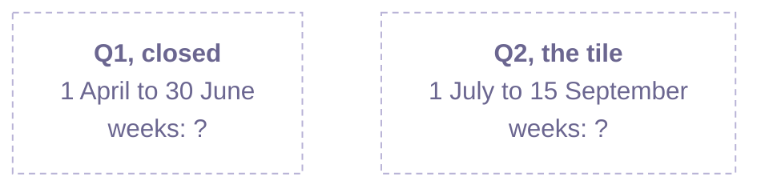
```mermaid
flowchart TB
    Q1["<b>Q1, closed</b><br/>1 April to 30 June<br/>weeks: ?"]
    Q2["<b>Q2, the tile</b><br/>1 July to 15 September<br/>weeks: ?"]
    classDef unknown fill:#FFFFFF,stroke:#B8B2D6,color:#6B6690,stroke-dasharray:4 3
    class Q1,Q2 unknown
```

**Question.** Predict before the loop prints: a) 13 weeks against 13; b) 13 weeks against 11; c) 12 weeks against 12; d) 13 weeks against 9.

```notes
LIVE, 3 minutes. Take letters. Some count months and say three against two and a half; the count
in weeks is the one a rate per week needs.
```

---

## S12. Answer: 13 weeks against 11
*The two totals never measured the same stretch of time, and the cumulative lines show where the tile stopped.*

```mermaid
%%{init: {"xyChart": {"showLegend": true}}}%%
xychart-beta
    title "Revenue to date by week of quarter, Rs lakh"
    x-axis "Week of quarter; the tile stops at week 11" [1, 2, 3, 4, 5, 6, 7, 8, 9, 10, 11, 12, 13]
    y-axis "Rs lakh" 0 --> 230
    line "Q1" [37.7, 42.0, 64.9, 84.8, 107.2, 110.9, 138.6, 152.7, 152.8, 152.9, 187.5, 209.9, 210.0 "Q1 210.0"]
    line "Q2" [23.5, 43.0, 46.0, 61.2, 67.6, 119.4, 133.8, 142.2, 142.3, 142.3, 155.6 "tile stops, 155.6", 172.2, 187.0 "Q2 187.0"]
```

The line that ends at Rs 210.0 lakh is Q1. The other is Q2: Rs 155.6 lakh at week 11, which is the tile, and Rs 187.0 lakh at the close.

```notes
LIVE, 3 minutes. The answer is b: Q1 is 13 weeks and 91 days, the tile 11 weeks. Point at the flat
stretches: revenue arrives in lumps, and weeks without a large order barely move.
```

---

## S13. The plausible wrong answer: a 25.9 percent crisis
*Two missing weeks look exactly like lost customers, and the decision they mislead is the largest on Meera's desk.*

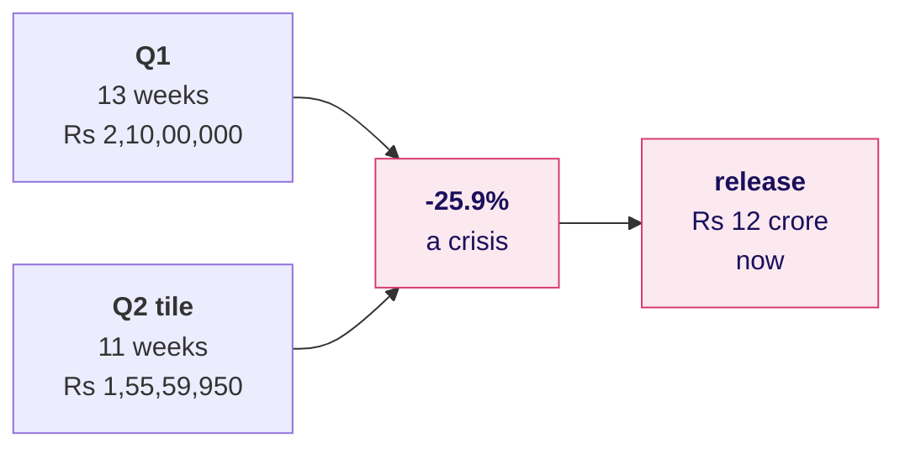
```mermaid
flowchart LR
    A["<b>Q1</b><br/>13 weeks<br/>Rs 2,10,00,000"] --> W["<b>-25.9%</b><br/>a crisis"]
    B["<b>Q2 tile</b><br/>11 weeks<br/>Rs 1,55,59,950"] --> W
    W --> D["<b>release</b><br/>Rs 12 crore<br/>now"]
    classDef bad fill:#FBE9EF,stroke:#D63A6A,color:#1A0F5C
    class W,D bad
```

**Why it is wrong.** The tile stopped on 15 September, so it holds 11 weeks of trading against 13. **The check** that catches it in a minute: the first and last order date of each window, and the weeks between them.

```notes
LIVE, 4 minutes. This is the chapter's trap, and it is a plausible wrong number with correct
arithmetic. Say the business cost out loud: a crisis read rushes the acquisition budget. The check
is cheap and nobody runs it, because a tile shows a number without its window.
```

---

## S14. The fix: closed quarters, and what changed
*The two weeks the tile never saw hold Rs 31,40,050, and the real fall is Rs 23,00,000.*

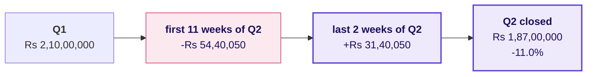
```mermaid
flowchart LR
    A["<b>Q1</b><br/>Rs 2,10,00,000"] --> B["<b>first 11 weeks of Q2</b><br/>-Rs 54,40,050"]
    B --> C["<b>last 2 weeks of Q2</b><br/>+Rs 31,40,050"]
    C --> D["<b>Q2 closed</b><br/>Rs 1,87,00,000<br/>-11.0%"]
    classDef bad fill:#FBE9EF,stroke:#D63A6A,color:#1A0F5C
    classDef known fill:#EEEAFB,stroke:#5B3FD6,color:#1A0F5C,stroke-width:2px
    class B bad
    class C,D known
```

| Fair reading | Q1 | Q2 | Change |
|---|---|---|---|
| Closed quarters, 13 weeks each | Rs 2,10,00,000 | Rs 1,87,00,000 | -11.0% |
| Per week, Q1 against the tile | Rs 16,15,385 | Rs 14,14,541 | -12.4% |

```notes
LIVE, 4 minutes. What changed: the fall Meera acts on shrank from Rs 54,40,050 to Rs 23,00,000, from
25.9 to 11.0 percent; sixteen orders had not happened yet when the tile was read. The per-week row
is a rate with its numerator, denominator and window. The notebook also runs option B, the same 11
weeks of each, at -17.0 percent: lumpy business orders make short windows jumpy, so once a quarter
closes, compare closed quarters.
```

---

## S15. A second route: the same fall, added by month
*Key the accumulator by the month in the date instead of the quarter field, and the answer must not move.*

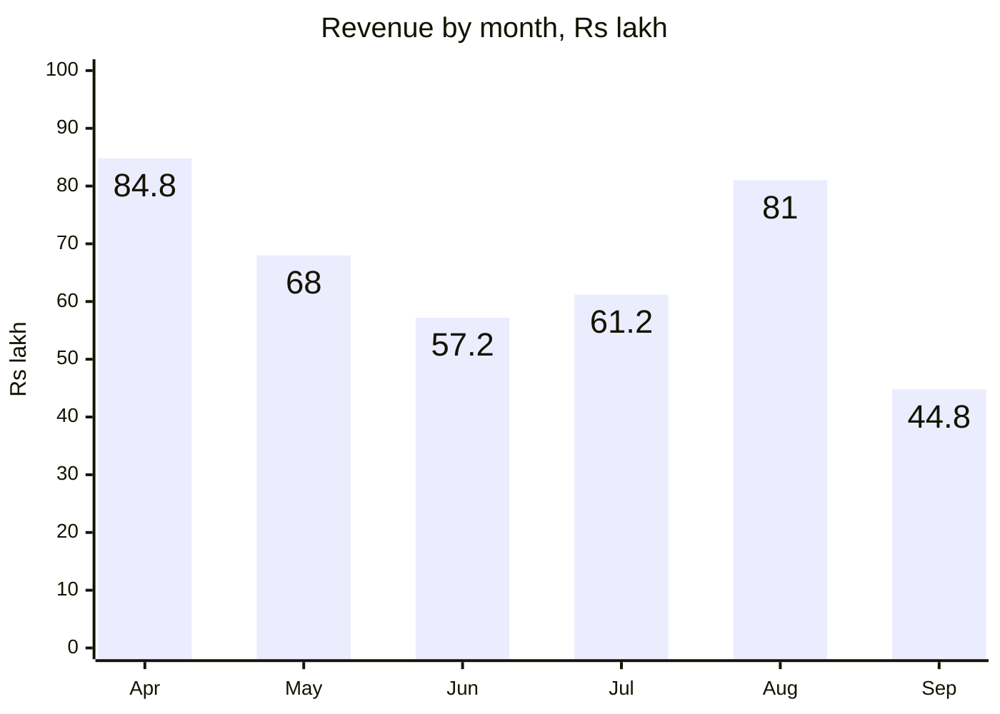
```mermaid
%%{init: {"xyChart": {"showDataLabel": true}}}%%
xychart-beta
    title "Revenue by month, Rs lakh"
    x-axis ["Apr", "May", "Jun", "Jul", "Aug", "Sep"]
    y-axis "Rs lakh" 0 --> 100
    bar [84.8, 68.0, 57.2, 61.2, 81.0, 44.8]
```

**The check.** April to June add to Rs 2,10,00,000 and July to September to Rs 1,87,00,000: minus 11.0 percent both ways. **When to switch:** keep the quarter key for the headline, and use the month key once a question moves inside the quarter, as chapter 6's will.

```notes
LIVE, 4 minutes. The second route ignores the quarter field and trusts only the dates, so if the
two routes disagreed, one would be reading the file wrongly. The notebook asserts they are equal.
```

---

## S16. Kavya's review of chapter 1
*The drop is real, it is 11.0 percent, and one comparison is still missing.*

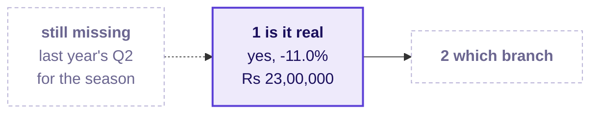
```mermaid
flowchart LR
    R1["<b>1 is it real</b><br/>yes, -11.0%<br/>Rs 23,00,000"] --> R2["<b>2 which branch</b>"]
    X["<b>still missing</b><br/>last year's Q2<br/>for the season"] -.-> R1
    classDef known fill:#EEEAFB,stroke:#5B3FD6,color:#1A0F5C,stroke-width:2px
    classDef unknown fill:#FFFFFF,stroke:#B8B2D6,color:#6B6690,stroke-dasharray:4 3
    class R1 known
    class R2,X unknown
```

**Kavya's review.** "Say both windows out loud with their dates before you say a percentage, and say which option you picked and what would make you pick another."

**In the interview.** [F] What has to match before a quarter-on-quarter comparison is fair? And the design question: Q2 is still open; which comparison do you send?

```notes
LIVE, 2 minutes. One breath: window length and dates, the definition, the population, the
denominator, and the export's completeness. The design answer: the same weeks of both, with a rate
per week beside it, switching to closed quarters at the close. Transition: the drop is real, so
which branch moved?
```

---

## SECTION 2: Which branch moved
*The tree meets both quarters, rupees go on each branch, and the price branch hides a blank.*

```notes
LIVE. Chapter 2 runs 30 minutes: 3 on the need, 5 on the options, 8 on customers, leaves and the
bridge, 10 on the discount trap with its two-minute KeyError, 2 on the second route, 2 on Kavya.
Switch to notebooks/C2_W01_D02_02_which_branch_STUDENT.ipynb.
```

---

## S17. Who owns a Rs 23,00,000 problem
*Each branch has an owner and a price tag, so the split decides who acts and whether Rs 12 crore is aimed right.*

**The client asks.** "Are we losing customers, or are the ones we have buying less? Marketing says more customers. Prove it or disprove it."

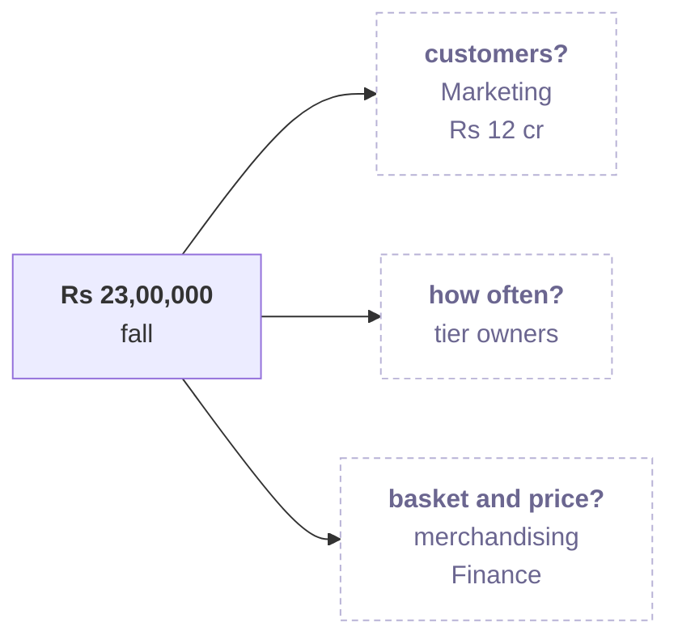
```mermaid
flowchart LR
    R["<b>Rs 23,00,000</b><br/>fall"] --> C["<b>customers?</b><br/>Marketing<br/>Rs 12 cr"]
    R --> F["<b>how often?</b><br/>tier owners"]
    R --> V["<b>basket and price?</b><br/>merchandising<br/>Finance"]
    classDef unknown fill:#FFFFFF,stroke:#B8B2D6,color:#6B6690,stroke-dasharray:4 3
    class C,F,V unknown
```

```notes
LIVE, 3 minutes. Merchandising is the team that picks the range and the pack sizes. The metric at
stake is the rupees each branch carries. A wrong split sends crores to
the wrong owner for a quarter. Remind the room that price and basket fold into revenue per order on
this file.
```

---

## S18. Blinkit and Walmart report the same two branches
*Visits and basket, orders and order value: companies publish the split because investors ask Meera's question.*

```stats
value: 273.9 m | label: Blinkit orders, Q4 FY26 | note: Rs 525 an order, after discounts
value: Rs 14,386 cr | label: Blinkit net order value | note: orders times order value
value: +1.5% / +1.1% | label: Walmart U.S. transactions / ticket | note: ticket is spend per visit
```

**The claim.** A quick-commerce app and the world's largest store chain both answer "more visits or bigger baskets?" every quarter.

```notes
LIVE, 2 minutes. Sources checked 30 Sep 2026: Eternal shareholders' letter of 28 April 2026, Blinkit
operating metrics (net order value and net average order value, which are net figures); Walmart
earnings release for the second quarter of fiscal 2027, comparable sales excluding fuel up 2.6
percent, transactions 1.5, average ticket 1.1.
```

---

## S19. Four ways to split the fall, and the call
*The order in which the branches move changes each branch's rupees, and never which branch is guilty.*

| Option | Frequency is charged | Depends on order? |
|---|---|---|
| A. Leaf percentages only | no rupees: percentages do not add | no |
| B. Bridge in the tree's order | -Rs 51,57,895 | yes |
| B. Bridge, order reversed | -Rs 60,88,372 | yes |
| C. Symmetric (log-mean) split | -Rs 55,88,480 | no |
| D. Customer by customer | 69 rows before any total | no |

**The call.** B, with its order written beside it: it adds exactly and a CEO can follow it. **What would change it:** a split Finance rebuilds monthly goes symmetric; "which customers?" goes to D, in chapter 5.

```notes
LIVE, 5 minutes. Only B and C put rupees on each branch that add to the fall, and only C is free of
an order. The spread between orders is about Rs 9.3 lakh, the part where two branches moved together; whichever goes second is charged for
it. The symmetric split follows Ang (2005), "The LMDI approach to decomposition analysis", Energy
Policy, checked through Crossref 29 Sep 2026.
```

---

## S20. Question: how many customers bought in Q2?
*Orders fell from 114 to 86, and Marketing says customers are the problem.*

```stats
value: 69 | label: Q1 customers | note: distinct ids, April to June
value: 114 to 86 | label: orders | note: down 24.6 percent
```

**Question.** Predict Q2's customer count: a) 52, since orders fell by a quarter; b) 69; c) 81; d) 86.

```notes
LIVE, 2 minutes. Option d is Monday's rows-as-customers trap. Option a is Marketing's story carried
through. Take letters, then run the cell.
```

---

## S21. Answer: 69 customers, and the tree filled in
*The branch Marketing wants to fund did not move, and the other two multiply back to the fall.*

| Branch | Q1 | Q2 | Ratio |
|---|---|---|---|
| Customers | 69 | 69 | 1.000 |
| Orders per customer | 1.65 (114 over 69) | 1.25 (86 over 69) | 0.754 |
| Revenue per order | Rs 1,84,211 | Rs 2,17,442 | 1.180 |
| Revenue | Rs 2,10,00,000 | Rs 1,87,00,000 | 0.890 |

**The check.** 1.000 times 0.754 times 1.180 is 0.890, the revenue ratio; adding the percentages would have said minus 6.6. The answer is b.

```notes
LIVE, 3 minutes. Let the silence land: Marketing's branch is flat. Whether these are the same 69
people is chapter 5's question. Revenue per order rising is not a price rise until proved; chapter 4
takes it apart. Fill the tree on the board.
```

---

## S22. The bridge: frequency costs Rs 51,57,895
*One leaf at a time in the tree's order, and the moves add exactly to the fall.*

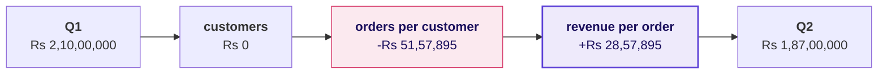
```mermaid
flowchart LR
    A["<b>Q1</b><br/>Rs 2,10,00,000"] --> C["<b>customers</b><br/>Rs 0"]
    C --> B["<b>orders per customer</b><br/>-Rs 51,57,895"]
    B --> V["<b>revenue per order</b><br/>+Rs 28,57,895"]
    V --> D["<b>Q2</b><br/>Rs 1,87,00,000"]
    classDef bad fill:#FBE9EF,stroke:#D63A6A,color:#1A0F5C
    classDef known fill:#EEEAFB,stroke:#5B3FD6,color:#1A0F5C,stroke-width:2px
    class B bad
    class V known
```

**The claim.** The customer branch contributes nothing, so Marketing's case for acquisition has no rupees behind it on this file.

```notes
LIVE, 3 minutes. Customers first at Q1's leaves, then 28 fewer orders at Q1's Rs 1,84,211 each, then
86 orders each Rs 33,231 richer. Transition: Meera's tree had a fourth branch, price, and
Marketing's monsoon plan lives there.
```

---

## S23. A missing key, in two minutes
*The discount branch stops on a KeyError, and each way past it hides a different decision.*

```text
KeyError: 'discount'
```

| Way past it | Python's name for it | The decision it makes quietly |
|---|---|---|
| `if "discount" in order:` | Look before you leap | Orders without it are skipped |
| `try:` ... `except KeyError:` | Easier to ask forgiveness | Whatever the except branch does |
| `order.get("discount", 0)` | A default | Absent becomes zero rupees |

```notes
LIVE, 2 minutes, and no more. Read the last line of the trace: it names the key. The Python glossary
names the first two styles LBYL and EAFP (docs.python.org glossary, verified 29 Sep 2026). The error
is not the trap; what the third way decides is.
```

---

## S24. The plausible wrong answer: half had no discount
*Reading a missing discount as zero gives a share, a story and a decision.*

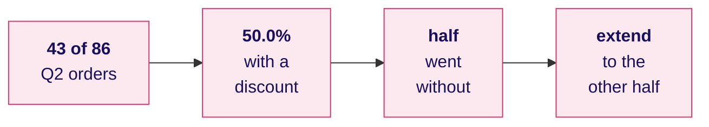
```mermaid
flowchart LR
    A["<b>43 of 86</b><br/>Q2 orders"] --> B["<b>50.0%</b><br/>with a<br/>discount"]
    B --> C["<b>half</b><br/>went<br/>without"] --> D["<b>extend</b><br/>to the<br/>other half"]
    classDef bad fill:#FBE9EF,stroke:#D63A6A,color:#1A0F5C
    class A,B,C,D bad
```

| Invented order | Discount field | Read as zero | Recorded only |
|---|---|---|---|
| A, B | Rs 100, Rs 0 | Rs 100, Rs 0 | Rs 100, Rs 0 |
| C | absent | Rs 0 | left out |
| Share with a discount | | 1 of 3, 33% | 1 of 2, 50% |

```notes
LIVE, 3 minutes. The chapter's trap. The hurried default silences the error, and the share comes out
at 50.0 percent, 43 of 86. Marketing extends the monsoon discount to the other half, spending margin
on orders that may already carry one. The three orders are invented to show the mechanism.
```

---

## S25. Question: what were the 43 "no discount" orders?
*The hurried reading says 43 of Q2's 86 orders went without; predict what they are.*

```stats
value: 42.1% | label: Q1, absent as zero | note: orders with a discount
value: 50.0% | label: Q2, absent as zero | note: orders with a discount
value: 43 | label: Q2, read as none | note: of 86 orders
```

**Question.** Of the 43 Q2 orders read as "no discount", how many record Rs 0? a) all 43; b) 34; c) 17; d) none.

```notes
LIVE, 2 minutes. Each learner first runs the count in the empty your-turn cell of notebook 02: orders
with no discount field, per quarter. Then take letters.
```

---

## S26. Answer: 17 recorded zeros and 26 unknowns
*Where the field is recorded, 71.7 percent of Q2's orders carry a discount, and the branch holds at most Rs 12,900.*

| Share of orders with a discount | Q1 | Q2 |
|---|---|---|
| Blanks read as zero | 42.1%, 48 of 114 | 50.0%, 43 of 86 |
| Over orders that record the field | 58.5%, 48 of 82 | 71.7%, 43 of 60 |
| Range, blanks unknown | 42.1% to 70.2% | 50.0% to 80.2% |

**The fix.** Write the rule down: "absent means not recorded; reported separately; never counted as zero". At Rs 150 on every Q2 order, the most anyone recorded, the discount branch holds at most Rs 12,900 of a Rs 23,00,000 fall.

```notes
LIVE, 3 minutes. The answer is c. What changed: the extension loses its premise, since only 17 of 86
are known to have had no discount, and discounts leave the list of causes. Ask which system wrote
records without the field (Rubin, 1976, "Inference and missing data", Biometrika, is the formal
version). Interview [S]: a field is missing; do you fill it with zero?
```

---

## S27. A second route, and Kavya's review
*A split that chooses no order at all puts the fall on the same branch the bridge did.*

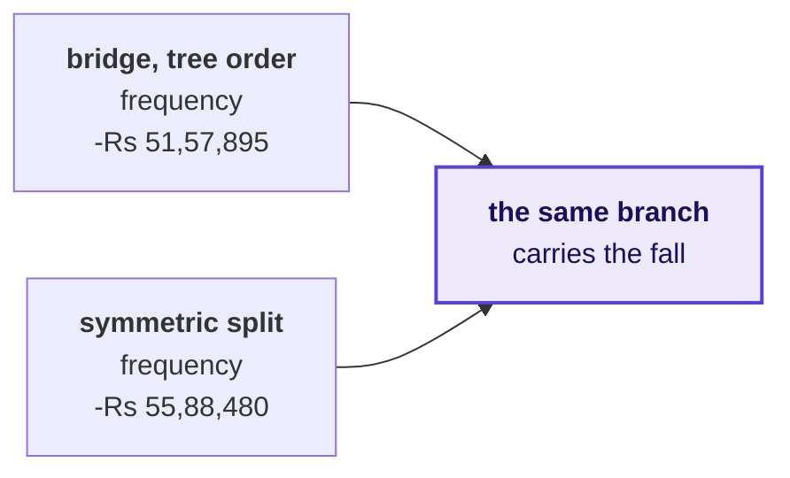
```mermaid
flowchart LR
    A["<b>bridge, tree order</b><br/>frequency<br/>-Rs 51,57,895"] --> C["<b>the same branch</b><br/>carries the fall"]
    B["<b>symmetric split</b><br/>frequency<br/>-Rs 55,88,480"] --> C
    classDef known fill:#EEEAFB,stroke:#5B3FD6,color:#1A0F5C,stroke-width:2px
    class C known
```

**Kavya's review.** "Customers held at 69 and the ones we have bought less often. Put the bridge in front of Meera with its order beside it, and do not call bigger orders good news until you know where they came from."

**In the interview.** [F] How do you split a revenue change between customers, frequency and order value?

```notes
LIVE, 2 minutes. The symmetric split shares the fall by logarithms and chooses no order, so it could
have disagreed with the bridge; the Rs 4,30,585 between them is the part where frequency and order
value moved together. When to switch: keep the bridge for Meera; go symmetric when two branches keep
moving together and someone else rebuilds the split every month. One breath for the interview: tree,
ratios multiply back, one leaf at a time in a fixed order, rupees add.
```

---

## SECTION 3: Which segment
*The same tree for every segment and quarter means writing it once, as a function that returns its answer.*

```notes
LIVE. Chapter 3 runs 30 minutes: 3 on the need and Costco, 5 on the options, 8 on tree_for and
describe, 7 on the roll-up trap, 5 on the second route and the room's run, 2 on Kavya. Switch to
notebooks/C2_W01_D02_03_which_segment_STUDENT.ipynb. The break follows this chapter.
```

---

## S28. The head of Retail-Plus asks if his tier slips
*Four kinds of customer earn money four ways, so each has a different first number to watch.*

**The client asks.** "One of my members says the app's reorder button has been broken for six weeks. Is my tier the one slipping?"

| Segment | How it earns | Watch first |
|---|---|---|
| Retail-Core | Many small orders | Customers active |
| Retail-Plus, the paid tier | Members' repeat buying | Orders per member |
| Business | Few very large accounts | Order timing per account |
| Student | Small discounted baskets | Discount per order |

```notes
LIVE, 2 minutes. His renewals are the metric of his job, so orders per member is his number. A wrong
answer costs a tier nobody protects, or a quarter spent fixing one that was fine. Eight trees are
needed: four segments by two quarters.
```

---

## S29. Costco reports its renewal rate twice
*One blended rate would hide where renewals are weaker, so the segment sits beside the whole.*

```stats
value: 92.3% | label: U.S. and Canada | note: membership renewal rate, fiscal 2025
value: 89.8% | label: worldwide | note: the same measure, all regions
```

**The claim.** A membership business reports its rate by segment because the blend can hide the one that slips.

```notes
LIVE, 1 minute. Source: Costco fourth quarter fiscal 2025 results filed with the SEC (exhibit 99),
checked 30 Sep 2026. The link: the head of Retail-Plus needs his tier's rate, never the company's.
```

---

## S30. Copy, function or group by key: the call
*The same five numbers for eight groups can be pasted, written once, or gathered in one pass.*

| Option | Lines | Places to edit | Rows read |
|---|---|---|---|
| A. Copy the loop per group | 72 | 8 | 1,600 |
| B. A function, `tree_for(rows)` | 21 | 1 | 200 |
| C. Group by a key in one pass | 14 | 1 | 200 |

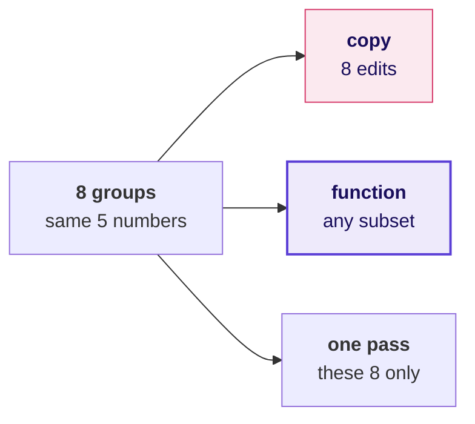
```mermaid
flowchart LR
    Q["<b>8 groups</b><br/>same 5 numbers"] --> A["<b>copy</b><br/>8 edits"]
    Q --> B["<b>function</b><br/>any subset"]
    Q --> C["<b>one pass</b><br/>these 8 only"]
    classDef bad fill:#FBE9EF,stroke:#D63A6A,color:#1A0F5C
    classDef known fill:#EEEAFB,stroke:#5B3FD6,color:#1A0F5C,stroke-width:2px
    class A bad
    class B known
```

**The call.** B: the same numbers will be asked for a channel, a month and delivered orders today. **What would change it:** millions of rows, every group at once, means C, which is `groupby` in Week 2.

```notes
LIVE, 5 minutes. The notebook's sizing cell measures these. Copying reads the export eight times and
creates eight places for Anand's next definition change to be missed once. Ask how many times the
room wants to paste chapter 2's code.
```

---

## S31. tree_for is a metric definition, written once
*One function holds the day's definitions, so every segment and quarter gets the same ones.*

```python
def tree_for(rows):
    """Revenue, orders, customers and the two rates for any group of orders."""
    revenue, seen = 0, {}
    for order in rows:
        revenue += order["amount"]
        seen[order["customer_id"]] = True
    return {"revenue": revenue, "orders": len(rows), "customers": len(seen),
            "orders_per_customer": len(rows) / len(seen),
            "revenue_per_order": revenue / len(rows)}
```

**Test it where the answer is known.** On all of Q1 it returns 114 orders, 69 customers and 1.65; on all of Q2, 86, 69 and 1.25: chapter 2, reproduced.

```notes
LIVE, 3 minutes. Build it line by line: def, the parameter, the body, return. A function returns
rather than prints, so the caller can put its answer in a table, a chart or a check; chapter 5 meets
one that prints. A new function earns trust by reproducing a number proved another way.
```

---

## S32. Question: what did Business orders look like in Q2?
*describe returns a group's median, extremes and range; Q1's median Business order was Rs 9,83,780.*

```stats
value: Rs 9,83,780 | label: Q1 median | note: Business, 20 orders
value: Rs 15,80,940 | label: Q1 range | note: Rs 2,03,060 to Rs 17,84,000
```

**Question.** Predict describe for Business in Q2: a) median and range both fall; b) the median barely moves and the range jumps; c) the median doubles; d) nothing changes.

```notes
LIVE, 2 minutes. describe is Monday's median by hand, inside a function, with the odd and even case.
Retail-Core and Business are the two segments demonstrated; do not run Retail-Plus or Student on the
projector.
```

---

## S33. Answer: one order stretched the range
*The typical Business order barely changed; one large order stretched the extremes.*

| Business | Median | Range | Orders per customer |
|---|---|---|---|
| Q1, 20 orders | Rs 9,83,780 | Rs 15,80,940 | 1.82 |
| Q2, 17 orders | Rs 9,52,000 | Rs 27,28,460 | 1.55 |
| Change | -3.2% | +72.6% | -15.0% |

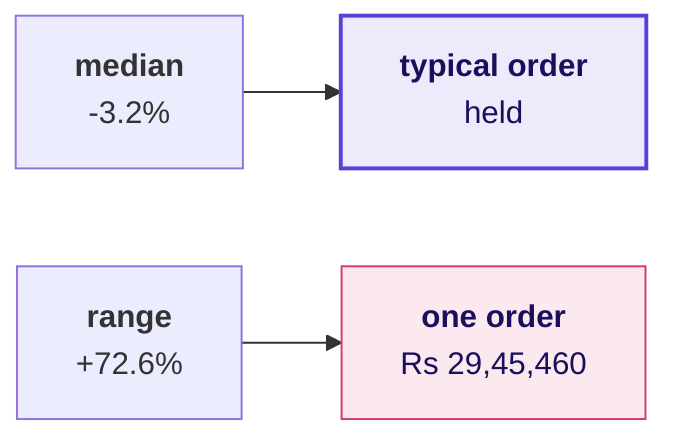
```mermaid
flowchart LR
    M["<b>median</b><br/>-3.2%"] --> T["<b>typical order</b><br/>held"]
    R["<b>range</b><br/>+72.6%"] --> O["<b>one order</b><br/>Rs 29,45,460"]
    classDef known fill:#EEEAFB,stroke:#5B3FD6,color:#1A0F5C,stroke-width:2px
    classDef bad fill:#FBE9EF,stroke:#D63A6A,color:#1A0F5C
    class T known
    class O bad
```

```notes
LIVE, 3 minutes. The answer is b. Retail-Core, for comparison: 1.12 to 1.06 orders per customer,
down 5.3 percent, median Rs 2,325 to Rs 2,080. Neither segment shown falls 24.6 percent, so before
guessing where the rest sits, roll the segments back up.
```

---

## S34. The plausible wrong answer: frequency fell 6.0%
*Averaging the four segments' orders per customer gives a softer story and a different decision.*


```mermaid
%%{init: {"xyChart": {"showDataLabel": true, "showDataLabelOutsideBar": true}, "themeVariables": {"xyChart": {"plotColorPalette": "#D63A6A, #1F8A5B"}}}}%%
xychart-beta
    title "Averaged in pink, the wrong roll-up; weighted in green"
    x-axis ["Averaged Q1", "Averaged Q2", "Weighted Q1", "Weighted Q2"]
    y-axis "Orders per customer" 0 --> 2.2
    bar [1.94, 1.82, 1.65, 1.25]
    bar [-1, -1, 1.65, 1.25]
```

**What breaks.** Averaged, the segments say 1.94 to 1.82, minus 6.0 percent: "frequency is not the branch, so Marketing may be right", and the Rs 12 crore goes back on the table. **The check:** a roll-up must reproduce 1.65 and 1.25.

```notes
LIVE, 4 minutes. The chapter's trap: correct arithmetic, wrong question. Only the averages and the
weighted figures appear; no per-segment rows are shown.
```

---

## S35. The fix: a ratio of totals, never a mean of ratios
*Each segment's rate carries its own denominator, and the roll-up must carry it too.*

| Invented group | Customers | Orders per customer | Orders |
|---|---|---|---|
| Large | 30 | 1.1 | 33 |
| Small | 2 | 3.5 | 7 |
| Mean of the two rates | | 2.30 | |
| Total orders over total customers | 32 | 1.25 | 40 |

**What changed.** Weighted by customers the segments give 114 over 69, then 86 over 69, minus 24.6 percent: frequency stays the branch and the acquisition budget stays shut.

```notes
LIVE, 3 minutes. The invented groups show the mechanism: two customers get the same vote as thirty.
Count groups in and out while rolling up: four segments in, 69 customers back. Interview [F]: why
can't you average four segments' rates?
```

---

## S36. A second route, then your run on all four
*One pass grouped by key must give tree_for's numbers for all eight groups, and then the room runs the segments.*

```timeline
label: Route two | title: One pass by key | body: totals[(quarter, segment)] over 200 orders; all 8 groups agree with tree_for.
label: Step 1 | title: Four segments in | body: Call tree_for on each segment in each quarter.
label: Step 2 | title: Four rows out | body: Count the rows that come back, and check the weighted roll-up.
label: Step 3 | title: One sentence | body: Name the segment whose orders per customer moved most, with its denominator. | tone: dark
```

```notes
LIVE, 5 minutes. The second route's check prints agreement and no segment's numbers. When to switch:
keep the function while groups are asked one at a time; switch to the pass by key for every group at
once on a big file. Then the room types the your-turn cell. Do not run it on the projector and do not
confirm any segment aloud; collect two sentences read aloud without comment.
```

---

## S37. Kavya's review of chapter 3
*Three rungs climbed, and a segment is on your own screen.*

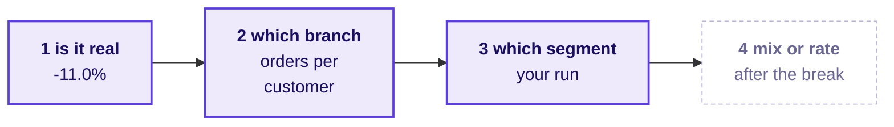
```mermaid
flowchart LR
    R1["<b>1 is it real</b><br/>-11.0%"] --> R2["<b>2 which branch</b><br/>orders per<br/>customer"]
    R2 --> R3["<b>3 which segment</b><br/>your run"]
    R3 --> R4["<b>4 mix or rate</b><br/>after the break"]
    classDef known fill:#EEEAFB,stroke:#5B3FD6,color:#1A0F5C,stroke-width:2px
    classDef unknown fill:#FFFFFF,stroke:#B8B2D6,color:#6B6690,stroke-dasharray:4 3
    class R1,R2,R3 known
    class R4 unknown
```

**Kavya's review.** "Two functions, eight groups, no copied loops. Say the segment on your screen with its denominator before anyone draws a conclusion from it."

**In the interview.** The design question: the same metrics for every segment and quarter; copy, function or group by key?

```notes
LIVE, 2 minutes, then the 10-minute break. One breath: a function when groups are asked one at a
time and definitions change; a pass by key when the file is large and every group is needed.
```

---

## SECTION 4: Mix or rate
*Revenue per order rose 18 percent, and Marketing reads a price signal into a blend.*

```notes
LIVE. Chapter 4 runs 30 minutes after the break: 3 on the need, 3 on Swiggy, 4 on the options, 5 on
the lost orders, 8 on the trap and the split, 5 on the second route, 2 on Kavya. Switch to
notebooks/C2_W01_D02_04_mix_or_rate_STUDENT.ipynb. From here the segment the room found is named.
```

---

## S38. Marketing wants a price rise on an 18% blend
*Revenue per order rose from Rs 1,84,211 to Rs 2,17,442, and the plan is about to raise prices on it.*

**The client asks.** "Revenue per order is up 18 percent. Our customers are happy to pay more, so the premium range is working. Put a price rise into the plan." (the marketing lead)

```stats
value: +18.0% | label: revenue per order | note: all orders, blended
value: 26 of 51 | label: Retail-Plus orders kept | note: the same 22 members
value: 430x | label: order size, Business to consumer | note: lakhs against thousands, Q1
```

```notes
LIVE, 4 minutes. Open by naming what the room found at the end of chapter 3: Retail-Plus, the same
22 members, 51 orders to 26. The metric at stake is a blend across segments whose orders differ
several hundredfold: a Q1 Business order averaged Rs 10,38,559 and a consumer order Rs 2,434. A wrong reading costs volume: a price rise on customers who never paid more.
```

---

## S39. Swiggy: an order value that rose on its mix
*Instamart's average order rose 14 percent in a quarter, and Swiggy put it down to what people bought.*

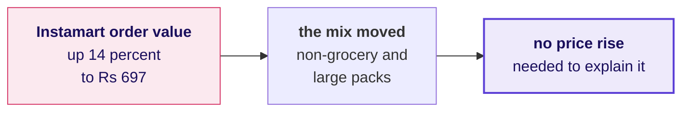
```mermaid
flowchart LR
    U["<b>Instamart order value</b><br/>up 14 percent<br/>to Rs 697"] --> M["<b>the mix moved</b><br/>non-grocery and<br/>large packs"]
    M --> D["<b>no price rise</b><br/>needed to explain it"]
    classDef bad fill:#FBE9EF,stroke:#D63A6A,color:#1A0F5C
    classDef known fill:#EEEAFB,stroke:#5B3FD6,color:#1A0F5C,stroke-width:2px
    class U bad
    class D known
```

**The claim.** When groups differ in order size and their shares move, a blended order value can rise with no customer paying more for the same thing.

```notes
LIVE, 3 minutes. Swiggy, the food and grocery delivery app, Q2 FY2026 shareholder letter, checked 30
Sep 2026: the average order value of Instamart, its quick-commerce store, Rs 697, up 14 percent in
the quarter, put down to non-grocery categories and large packs taking a larger share of gross order
value, the value of orders before discounts; net average order value after discounts Rs 485. The
link to Kalpa: Business's lakh-sized orders took a larger share as small member orders left.
```

---

## S40. Four readings of one rise, and the call
*Only one reading puts rupees on "the mix changed" and on "customers paid more" and makes them add.*

| Option | What it can say |
|---|---|
| A. Read the blended change | The size of the rise, nothing about why |
| B. Each segment's own revenue per order | Whether any segment paid more |
| C. Split into mix and rate | Rupees from each, adding to Rs 33,231 |
| D. Each segment's median order | The typical order, and no rupees |

**The call.** C, built on B's per-segment rates. **What would change it:** segments of similar order size would make mix negligible and B enough; a question about which products' prices moved needs order lines this file lacks.

```notes
LIVE, 4 minutes. The notebook's sizing cell shows that only C puts rupees on a cause, and that only
D is safe from one lakh-sized order. Write "C: mix and rate" beside rung 4.
```

---

## S41. Question: how many lost orders were members?
*Twenty-eight orders were lost between the quarters; predict how many were Retail-Plus.*

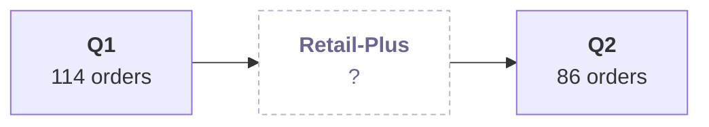
```mermaid
flowchart LR
    A["<b>Q1</b><br/>114 orders"] --> B["<b>Retail-Plus</b><br/>?"] --> C["<b>Q2</b><br/>86 orders"]
    classDef unknown fill:#FFFFFF,stroke:#B8B2D6,color:#6B6690,stroke-dasharray:4 3
    class B unknown
```

**Question.** Of the 28 lost orders: a) about 7; b) about 14; c) 25; d) all 28.

```notes
LIVE, 3 minutes. Take letters, then run the orders bridge in notebook 04.
```

---

## S42. Answer: 25 of the 28 were small member orders
*Retail-Plus lost 25, Business 3, Retail-Core 2, and Student gained 2.*

```mermaid
flowchart LR
    A["<b>Q1</b><br/>114"] --> P["<b>Retail-Plus</b><br/>-25"]
    P --> B["<b>Business</b><br/>-3"]
    B --> C["<b>Retail-Core</b><br/>-2"]
    C --> S["<b>Student</b><br/>+2"]
    S --> D["<b>Q2</b><br/>86"]
    classDef bad fill:#FBE9EF,stroke:#D63A6A,color:#1A0F5C
    class P bad
```

**The claim.** The orders that vanished were about three thousand rupees each, which already hints at why the average order grew.

```notes
LIVE, 3 minutes. The answer is c. Ask the room what happens to an average when its smallest items
leave.
```

---

## S43. The plausible wrong answer: customers pay 18% more
*No segment's own revenue per order rose 18 percent; the blend did.*

| Segment | Q1 revenue per order | Q2 revenue per order | Change |
|---|---|---|---|
| Retail-Core | Rs 2,117 | Rs 2,014 | -4.9% |
| Retail-Plus | Rs 2,815 | Rs 3,012 | +7.0% |
| Business | Rs 10,38,559 | Rs 10,90,674 | +5.0% |
| Student | Rs 962 | Rs 1,104 | +14.8% |
| All orders, blended | Rs 1,84,211 | Rs 2,17,442 | +18.0% |

**Why it is wrong.** A blend rises whenever small orders fall away. **The check** is this table: no segment rose 18 percent.

```notes
LIVE, 4 minutes. The chapter's trap. Say the decision it would have misled: a price rise on the tier
whose orders already halved.
```

---

## S44. The fix: 69 percent of the rise is mix
*At Q2's mix and Q1's prices, revenue per order would already have been Rs 2,07,112.*

```mermaid
flowchart LR
    A["<b>Q1</b><br/>Rs 1,84,211"] --> M["<b>mix</b><br/>+Rs 22,902<br/>fewer small orders"]
    M --> R["<b>rate</b><br/>+Rs 10,330<br/>mostly Business"]
    R --> D["<b>Q2</b><br/>Rs 2,17,442"]
    classDef bad fill:#FBE9EF,stroke:#D63A6A,color:#1A0F5C
    classDef known fill:#EEEAFB,stroke:#5B3FD6,color:#1A0F5C,stroke-width:2px
    class M bad
    class R known
```

**What changed.** "Customers pay 18 percent more, raise prices" became "the mix explains Rs 22,902 of the Rs 33,231 rise; Business's lakh-sized orders carry almost all the rest". The price rise loses its evidence.

```notes
LIVE, 4 minutes. Retail-Plus fell from 44.7 to 30.2 percent of orders. The rate part by segment is
more than nine tenths Business, driven by one large order, as chapter 3's range showed.
```

---

## S45. A second route, and Kavya's review
*Two groups on the back of an envelope, Business and everyone else, put the same share on the mix.*

| Route | What it prices | Mix | Share of the rise |
|---|---|---|---|
| Four segments | Q2's mix at each segment's Q1 rate | Rs 22,902 | 68.9% |
| Two groups | Business's share change times its gap | Rs 23,039 | 69.3% |

**Kavya's review.** "Marketing looked at a blend and saw a price signal. You opened it and found 25 small orders missing. No consumer segment paid meaningfully more; the small orders disappeared, from the tier we are about to ask about."

**In the interview.** [F] Revenue per order rose 18 percent while revenue fell; did prices go up?

```notes
LIVE, 5 minutes. The envelope: Business's share of orders rose from 17.5 to 19.8 percent, times the
Rs 10,36,125 by which a Q1 Business order beat a consumer order, is about Rs 23,000. It uses no
consumer rate, so it could have disagreed. When to switch: report the four-segment split, since it
names each segment; the envelope is the check with no laptop, and it stops agreeing when the consumer
segments' own shares move a lot against each other. One breath for the interview: a blend, a mix
split, a number for each part.
```

---

## SECTION 5: Marketing's hypothesis
*Marketing comes back with three attacks, and each gets a check it can rerun itself.*

```notes
LIVE. Chapter 5 runs 30 minutes: 3 on the need and HBR, 4 on the options, 6 on the overlap and the
customers who slowed, 10 on the summary-script trap, 5 on the consumer business and the second route,
2 on Kavya. Switch to notebooks/C2_W01_D02_05_marketings_hypothesis_STUDENT.ipynb.
```

---

## S46. Marketing: churn is hiding in a flat count
*Rs 12 crore rests on one claim: churn, customers who stop buying, which new ones must replace.*

**The client asks.** "A flat count can hide churn replaced by new customers, which is why we need acquisition. And Retail-Plus is Rs 65,250 out of a Rs 23 lakh fall. Last quarter's summary script says Business fell most." (the marketing lead)

```mermaid
flowchart LR
    A["<b>69 and 69</b><br/>a net count"] --> B["<b>same 69?</b>"]
    A --> C["<b>20 lost,<br/>20 new?</b>"]
    classDef unknown fill:#FFFFFF,stroke:#B8B2D6,color:#6B6690,stroke-dasharray:4 3
    class B,C unknown
```

```notes
LIVE, 3 minutes. The metric at stake is retention, and its mirror, new customers. A wrong answer is
Rs 12 crore spent replacing people who never left. Marketing's first claim is fair; test it.
```

---

## S47. Keeping a customer costs a fraction of winning one
*The published estimates behind every retention argument, which are never Kalpa's own figures.*

```stats
value: 5 to 25x | label: acquisition against retention | note: cost, by study and industry
value: 25 to 95% | label: profit lift | note: from a 5 percent rise in retention
value: +34% / 4.53 to 4.10 | label: Swiggy users / orders per user | note: quarter to Sep 2025
```

**The claim.** If the fall is frequency among customers Kalpa already has, the cheaper lever is on the table; the reply asks Finance for Kalpa's own acquisition cost before comparing rupees.

```notes
LIVE, 2 minutes. Amy Gallo, "The Value of Keeping the Right Customers", Harvard Business Review,
29 October 2014, checked 30 Sep 2026; the retention figure is Frederick Reichheld of Bain, quoted
there. Estimates across industries: say so. Swiggy, Q2 FY2026 shareholder letter, checked 30 Sep 2026:
monthly transacting users up 34.0 percent to 22.9 million while frequency fell 4.53 to 4.10, a growing count beside a falling frequency, which new users alone could produce, so the two are read apart.
```

---

## S48. Four tests of "churn hides in the count"
*A count is net; only a test that names lost and new separately can answer Marketing.*

| Option | Sees lost | Sees new | Sees who slowed |
|---|---|---|---|
| A. Compare the counts | no | no | no |
| B. The id overlap, as sets | yes | yes | no |
| C. Customer by customer | yes | yes | yes |
| D. Marketing's CRM sign-ups | no | yes | no |

**The call.** B, then C: three numbers anyone can rerun, then who slowed. **What would change it:** one person holding two ids, store and app, would make the overlap invent churn, and the CRM would be needed to join them first.

```notes
LIVE, 4 minutes. A, B and C read the export already open; D, Marketing's CRM, its customer
database, is a second system whose ids must match the export's. Write "B, then C" beside rung 5.
```

---

## S49. Question: how many of Q1's 69 are missing?
*Marketing says twenty lost and twenty new would look exactly like 69 and 69.*

```mermaid
flowchart LR
    Q1["<b>Q1 ids</b><br/>69"] --> X["<b>in both?</b><br/>only Q1?<br/>only Q2?"]
    Q2["<b>Q2 ids</b><br/>69"] --> X
    classDef unknown fill:#FFFFFF,stroke:#B8B2D6,color:#6B6690,stroke-dasharray:4 3
    class X unknown
```

**Question.** a) about 20, replaced by 20 new; b) about 5; c) none; d) it cannot be told from one export.

```notes
LIVE, 2 minutes. Take letters, then run the set cell in notebook 05.
```

---

## S50. Answer: none lost, none new, 18 members slowed
*All 69 bought in both quarters; of the 23 customers who ordered less, 18 pay for membership.*

```stats
value: 69 / 0 / 0 | label: both / only Q1 / only Q2 | note: the id overlap
value: 23 | label: customers who slowed | note: 44 ordered as often as before
value: 18 | label: of them in Retail-Plus | note: 7 fell by two orders
```

**The claim.** The flat count hides no churn; the fall is people Kalpa already has, buying less often, and most of them are members.

```notes
LIVE, 4 minutes. The answer is c. Option C, customer by customer, gives the second and third numbers.
Acquisition has nothing to replace on this file.
```

---

## S51. The plausible wrong answer: Business fell most
*Last quarter's summary script runs cleanly and prints a tidy answer.*

```python
def pct_change(before, after):
    change = 100 * (after - before) / before
    if abs(change) > 30:
        print(f"  check by hand: {change:+.1f}%")
    else:
        return round(change, 1)
# summary: {'Retail-Core': -5.3, 'Business': -15.0}
```

**What breaks.** "Orders per customer fell most in Business, 15.0 percent": Meera opens Business accounts first, and the head of Retail-Plus is told his tier is not in the table.

```notes
LIVE, 4 minutes. The chapter's trap. Run the script exactly as it is in notebook 05 and read the
summary aloud. Ask whether anyone trusts it. Most will; it looks tidy.
```

---

## S52. Why it is wrong: two segments came back as None
*A function that prints and returns nothing hands back None, and the filter drops it without a word.*

```mermaid
flowchart LR
    A["<b>4 segments in</b>"] --> B["<b>pct_change</b><br/>prints above 30%"]
    B --> C["<b>2 numbers</b><br/>2 None"]
    C --> D["<b>the filter</b><br/>drops None"]
    D --> E["<b>2 in the summary</b><br/>Retail-Plus gone"]
    classDef bad fill:#FBE9EF,stroke:#D63A6A,color:#1A0F5C
    class B,C,D,E bad
```

**The check.** Count groups in and groups out: four segments went in, two came back with a number.

```notes
LIVE, 3 minutes. The segment the script was written to flag, a 49 percent fall, is the one it
silently lost. Student, which rose, also vanished. Interview [F]: why does a
function that prints instead of returning break a pipeline?
```

---

## S53. The fix: return every change, flag it in a column
*The helper returns the change every time, in the same type, and the flag sits beside it.*

| Segment | Q1 | Q2 | Change | Flag |
|---|---|---|---|---|
| Retail-Core | 1.12 | 1.06 | -5.3% | |
| Retail-Plus | 2.32 | 1.18 | -49.0% | check by hand |
| Business | 1.82 | 1.55 | -15.0% | |
| Student | 2.50 | 3.50 | +40.0% | check by hand |

**What changed.** "Business fell most, 15.0 percent" became "Retail-Plus fell 49.0 percent, 2.32 to 1.18 orders per member; Business 15.0 percent on three orders".

```notes
LIVE, 3 minutes. Point at the flags: large moves are flagged, never dropped. A flag asks for a look
by hand and removes nothing from the table.
```

---

## S54. Too small? A second route, and Kavya's review
*Retail-Plus is 93 percent of the consumer fall, and the order dates alone find nobody lost or new.*

```mermaid
flowchart LR
    A["<b>consumer fall</b><br/>Rs 70,280"] --> D["<b>Retail-Plus</b><br/>Rs 65,250, 93%"]
    F["<b>first orders</b><br/>all in Q1"] --> N["<b>new in Q2: 0</b><br/>lost after Q1: 0"]
    L["<b>last orders</b><br/>all in Q2"] --> N
    classDef bad fill:#FBE9EF,stroke:#D63A6A,color:#1A0F5C
    classDef known fill:#EEEAFB,stroke:#5B3FD6,color:#1A0F5C,stroke-width:2px
    class D bad
    class N known
```

**Kavya's review.** "Three attacks, three checks anyone can rerun. And you nearly shipped a summary that lost the one segment that matters. Count what comes back from every helper you did not write."

**In the interview.** [D] Marketing insists the answer is acquisition and your data says frequency; how do you make the case in the room?

```notes
LIVE, 5 minutes. The consumer business fell from Rs 2,28,820 to Rs 1,58,540, and Retail-Plus is
Rs 65,250 of the Rs 70,280. The second route takes each customer's first and last order date: every
first order falls in Q1 and every last order in Q2, so none new and none lost, from the dates alone
and without the quarter field, which is why it could have disagreed with the overlap. When to switch:
show Marketing the overlap; the dates add that new means new since 1 April. The Business rupees are
three lakh-sized orders out of twenty, which one account's timing can move; say both findings side by
side.
One breath for [D]: test their claim in its own terms, show the overlap, show where the fall is, end
on what would change my mind. Lunch follows.
```
