# Which branch moved from Q1 to Q2?

Week 1, Day 2. Half one.

Kicker: WEEK 1  ·  TUESDAY  ·  HALF ONE
Quote: Are we losing customers, or are the ones we have buying less? Marketing says more customers. Prove it or disprove it.
Who: Meera Raghavan, CEO, Kalpa Retail, replying to Monday's numbers

```notes
LIVE, one minute. Read Meera's reply aloud and leave it on screen while the room settles. Monday
drew the tree; today the tree meets two quarters of orders, and the question is which branch moved.
The morning runs the ask and five chapters, each about 30 minutes and each paired with one notebook.
```

---

## S1. Six questions, each raised by the answer before it
*Q2 came in below Q1: are we losing customers, or are the ones we have buying less?*

```timeline
label: Chapter 1 | title: Is the drop real? | body: Both quarters on the same weeks
label: Chapter 2 | title: Which branch moved? | body: Customers, how often, or order value
label: Chapter 3 | title: Which segment moved? | body: The same numbers for all four
label: Chapter 4 | title: Did customers pay more? | body: A rise in revenue per order
label: Chapter 5 | title: Were customers lost? | body: Marketing's churn claim, tested
label: Chapter 6 | title: Did the button do it? | body: After lunch: the cause and the memo | tone: dark
```

```notes
LIVE, 2 minutes. Read the day's question, then the six chapter questions in order. Each is the
question the answer before it raises, and each chapter closes on its own answer with a number.
Chapters 1 to 5 run this morning and chapter 6 opens the afternoon. Leave the question up while
you set the scene. Then Meera's full message.
```

---

## S2. Meera wants the branch that moved, with proof
*What exactly is Meera asking, and what rides on the answer?*

**The client asks.** "So revenue is customers, times how often they buy, times basket, times price. Now: which of those moved? Q2 was Rs 1.9 crore, Q1 was 2.1. Are we losing customers, or are the ones we have buying less? Marketing says more customers. Prove it or disprove it."

```stats
value: Rs 2.1 cr | label: Q1, April to June | note: as Meera remembers it
value: Rs 1.9 cr | label: Q2, July to September | note: as Meera remembers it
value: Rs 12 cr | label: waiting on the answer | note: Marketing's acquisition ask
```

Kalpa Retail's financial year opens in April, so Q1 is April to June and Q2 is July to September of 2026-27.

```notes
LIVE, 3 minutes. Read the message aloud. Meera says Monday's tree back to us. Her figures are
rounded and from memory; the file gives exact ones. The retail story behind her words, how a store
chain earns and who owns which lever, is in Monday's domain dossier; point at it, do not retell it.
Kalpa Retail sells to four kinds of customer through its app, its website and its stores:
Retail-Core's many small orders, Retail-Plus members' repeat buying, Business's few lakh-sized accounts
and Student's small discounted baskets. Ask which number worries her most. The Rs 12 crore: it is
about to be spent on an unchecked branch. Then the three people waiting on the answer.
```

---

## S3. Each voice owns a lever, so the split names the owner
*Who is waiting on the answer, and what does each of them want from it?*

```cards
icon: user-round | eyebrow: The CEO | title: Meera Raghavan | body: Owns the budget. Wants the branch that moved before she funds any lever, and a sentence she can repeat to the board.
icon: crown | eyebrow: The paid tier | title: The head of Retail-Plus | body: Owns member renewals. Forwards a complaint that the app's reorder feature has been broken for six weeks, and asks whether his tier is slipping.
icon: megaphone | eyebrow: Acquisition | title: The marketing lead | body: Owns new customers. Has a slide showing revenue falling by a quarter, and an answer already: more customers. | tone: dark
```

The team works for the number, and each voice gets the same one. A branch that moved hands the problem to the person who owns that lever; a branch that stayed flat takes a budget off the table. Kavya Nair, the team's senior analyst, reviews every number before it leaves.

```notes
LIVE, 2 minutes. Name the incentive behind each voice without judging it. Marketing is paid to
acquire, so it reads every fall as an acquisition problem. The head of Retail-Plus wants a verdict on his tier; he gets a number in
chapter 3 and a test of his cause in chapter 6. Anand Iyer, Finance, is listening too. Then what
each branch costs to move.
```

---

## S4. Each branch has an owner and a different price
*What does it cost to move each branch, and who pays?*

| Branch | The lever | Who owns it | What moving it costs |
|---|---|---|---|
| Customers | Acquisition campaigns | The marketing lead | Marketing spend, before any repeat order |
| Orders per customer | Retention, reminders, reorder | Tier and product owners | Service and product work on people already won |
| Revenue per order | Range, bundles, basket | Merchandising | Assortment and margin decisions |
| Price and discounts | Price lists, offers | Finance with Marketing | Volume at risk, or margin given away |

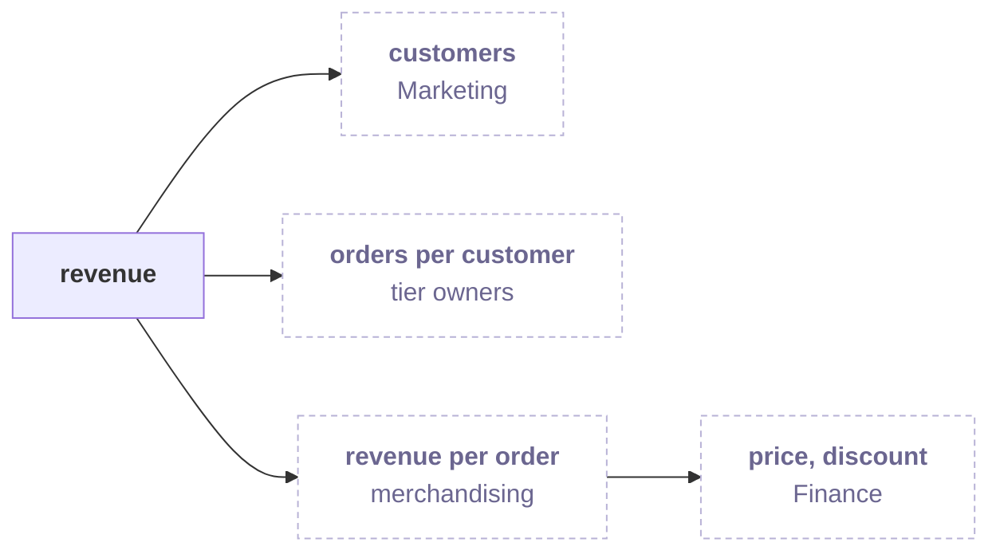
```mermaid
flowchart LR
    R["<b>revenue</b>"] --> C["<b>customers</b><br/>Marketing"]
    R --> F["<b>orders per customer</b><br/>tier owners"]
    R --> V["<b>revenue per order</b><br/>merchandising"]
    V --> P["<b>price, discount</b><br/>Finance"]
    classDef unknown fill:#FFFFFF,stroke:#B8B2D6,color:#6B6690,stroke-dasharray:4 3
    class C,F,V,P unknown
```

```notes
LIVE, 2 minutes. The cost list's use today: if the fall sits in
frequency, a cheaper lever is on the table and the Rs 12 crore is aimed at the wrong branch. That is
why every chapter puts rupees on a branch. Chapter 5 brings the published estimates of acquisition
against retention cost. Then a question before any number.
```

---

## S5. Question: what could manufacture a drop?
*Where between a checkout and a dashboard could a fall appear that the business never had?*

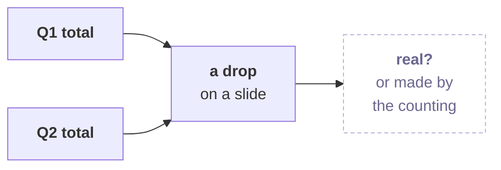
```mermaid
flowchart LR
    A["<b>Q1 total</b>"] --> D["<b>a drop</b><br/>on a slide"]
    B["<b>Q2 total</b>"] --> D
    D --> Q["<b>real?</b><br/>or made by<br/>the counting"]
    classDef unknown fill:#FFFFFF,stroke:#B8B2D6,color:#6B6690,stroke-dasharray:4 3
    class Q unknown
```

**Question.** In pairs, two minutes: name three places between a customer's checkout and a dashboard tile where a fall could be created that the business never had.

```notes
LIVE, 3 minutes. Two minutes in pairs, then collect answers on the board. Expect "different lengths
of time", "different definition of sales", "missing values", "one huge order". Push for places in
the system as well as in the arithmetic. Keep every answer; the next slide places them on the map.
```

---

## S6. Answer: at four hops, from the checkout to the tile
*Where between a checkout and a dashboard could a fall appear that the business never had?*

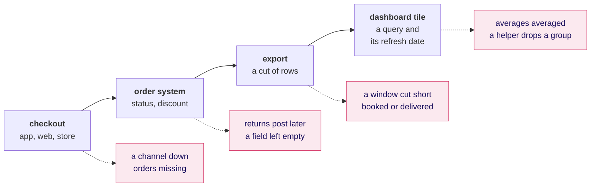
```mermaid
flowchart LR
    C["<b>checkout</b><br/>app, web, store"] --> O["<b>order system</b><br/>status, discount"]
    O --> E["<b>export</b><br/>a cut of rows"]
    E --> T["<b>dashboard tile</b><br/>a query and<br/>its refresh date"]
    C -.-> F1["a channel down<br/>orders missing"]
    O -.-> F2["returns post later<br/>a field left empty"]
    E -.-> F3["a window cut short<br/>booked or delivered"]
    T -.-> F4["averages averaged<br/>a helper drops a group"]
    classDef bad fill:#FBE9EF,stroke:#D63A6A,color:#1A0F5C
    class F1,F2,F3,F4 bad
```

**The rule.** Find the hop a number came through before you explain it. Today's traps sit at these hops: the window, the empty field, the roll-up and the helper.

```notes
LIVE, 2 minutes. Place the room's answers on the four hops. Chapter 1 is the export and the tile;
chapter 2 is the order system's empty field; chapter 3 is the dashboard's roll-up; chapter 5 is a
summary script. Checking the pipeline first is the cheapest investigation there is. Then the order
the investigation runs in.
```

---

## S7. Confirm, compare, decompose, isolate, hypothesise
*In what order does an analyst investigate a drop, and where does each trap wait?*

| Chapter | The question | Who asks | The trap it guards |
|---|---|---|---|
| 1 | Is the drop real? | Meera, against Marketing's slide | Quarters of unequal length |
| 2 | Which branch moved? | Meera | A missing discount read as zero |
| 3 | Which segment moved? | The head of Retail-Plus | Averages averaged |
| 4 | Did customers pay more? | Marketing, on price | A blended rate read as a price rise |
| 5 | Were customers lost? | Marketing | A helper that drops a segment |
| 6 | Did the button do it? | The tier and Meera | A cause blamed for the whole fall |

**The rule.** Confirm, compare like with like, decompose, isolate, then hypothesise. Every chapter weighs two to four ways to answer its question, sizes them, picks one, and reaches the same number a second way.

```notes
LIVE, 2 minutes. Draw the ladder on the board, top to bottom, and leave it there all day. Chapters 1
to 5 run this morning, chapter 6 opens the afternoon. This table is also the answer shape for
interview question 1. Source for the ladder's order: britinstitute.uk, data analyst case study
questions, verified 29 Sep 2026. Then the rule every chapter uses to check itself.
```

---

## S8. Branch changes multiply into the change in revenue
*How do the tree's branches combine into the change in revenue?*

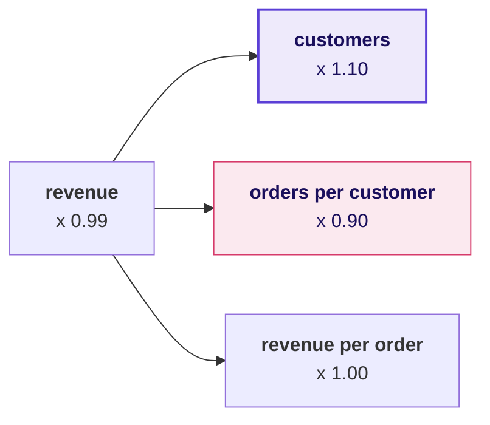
```mermaid
flowchart LR
    R["<b>revenue</b><br/>x 0.99"] --> C["<b>customers</b><br/>x 1.10"]
    R --> F["<b>orders per customer</b><br/>x 0.90"]
    R --> O["<b>revenue per order</b><br/>x 1.00"]
    classDef known fill:#EEEAFB,stroke:#5B3FD6,color:#1A0F5C,stroke-width:2px
    classDef bad fill:#FBE9EF,stroke:#D63A6A,color:#1A0F5C
    class C known
    class F bad
```

**The rule.** Invented numbers: ten percent more customers and ten percent less frequency is 1.10 times 0.90, which is 0.99, a one percent fall, where adding them says flat.

```notes
LIVE, 3 minutes. These numbers are invented to show the rule. Every chapter uses it: a decomposition
is proved by multiplying the branches back to the revenue ratio. Items per order and price per item
fold into revenue per order today, because the file has no order lines.
Transition: before filling any box, check that the two totals deserve comparing.
```

---

## SECTION 1: Is the drop real?
*Did revenue really fall from Q1 to Q2, and by how much, once both sides cover the same weeks?*

```notes
LIVE. Chapter 1 runs 30 minutes: 1 on the map, 4 on the need and the retailers, 5 on the options
and the picture, 6 on the build and its prediction, 6 on the trap, 5 on the fix and the rates, 3 on
the second route and the close. Open notebooks/C2_W01_D02_01_is_the_drop_real_STUDENT.ipynb now;
its six numbered sections are the six questions on the next slide.
```

---

## S9. Answered in six questions, before Meera replies
*Who needs this answer, and which smaller questions lead to it?*

**Who needs the answer.** Meera Raghavan decides whether Marketing's Rs 12 crore acquisition request is urgent. Overstate the fall and crores move in a hurry on a lever nobody has checked; understate it and a real leak runs another quarter.

```timeline
label: 1 | title: Which way sizes the fall? | body: Four options, sized on this file
label: 2 | title: How far did it fall? | body: The two closed quarters
label: 3 | title: Why does the slide say 25.9? | body: The dashboard tile's window
label: 4 | title: What is the fall per week? | body: A rate with its window
label: 5 | title: What do the same 11 weeks say? | body: While a quarter is still open
label: 6 | title: Do the months agree? | body: A second route, by month | tone: dark
```

```notes
LIVE, 1 minute. Read the six questions. Each gets its answer before the next is asked, and the
chapter's last slide answers all six in a line each. Then the slide Marketing sent.
```

---

## S10. Marketing's slide says revenue fell 25.9 percent
*What is Meera being asked to fund, and on what number?*

```stats
value: Rs 2,10,00,000 | label: Q1 on Marketing's slide | note: 1 April to 30 June
value: Rs 1,55,59,950 | label: Q2 on Marketing's slide | note: the dashboard tile
value: -25.9% | label: the headline | note: "revenue fell by a quarter"
```

**The client asks.** If revenue fell by a quarter in one quarter, Marketing says, the acquisition budget cannot wait.

```notes
LIVE, 2 minutes. The metric at stake is the change in booked revenue, every order placed before
any cancellation or return, between two closed quarters.
Put the claim up exactly as Marketing would: 1,55,59,950 over 2,10,00,000 is 0.741, a fall of 25.9
percent, and the division is right. Overstate the fall and crores move in a hurry; understate it
and a leak runs another quarter. Ask whether anything is wrong; most of the room will not see it yet.
Then how retailers avoid this.
```

---

## S11. DMart and Target compare like with like on purpose
*Do real retailers match their windows before they report a change?*

```cards
icon: store | eyebrow: India | title: DMart | body: Like-for-like growth counts only stores open at least 24 months at the year's end; 8.1 percent in FY26.
icon: calendar | eyebrow: United States | title: Target | body: Comparable sales use a prior period of equivalent length; its 53-week fiscal 2023 carried an extra week worth $1,715 million.
icon: ruler | eyebrow: The convention | title: NRF 4-5-4 calendar | body: Comparable months hold the same number of weeks and weekends, so a quarter is 13 whole weeks.
```

**The rule.** Two windows of different length never compare as totals, and retail calendars are built around that.

```notes
LIVE, 2 minutes. Sources, all checked 30 Sep 2026: Avenue Supermarts investor presentation filed
2 May 2026 (LFL definition and FY26 8.1 percent); Target fourth quarter and full year 2023 results
(53 weeks, the extra week $1,715 million) and its 10-K on "equivalent length"; nrf.com 4-5-4 calendar.
The link to Kalpa: Q2's tile had two fewer weeks than Q1. Then the four ways to size the fall.
```

---

## S12. Closed quarters fit, since both quarters have closed
*Which of four ways should size the fall, and what does each leave out?*

| Option | Rows read | Answer | What it leaves out |
|---|---|---|---|
| A. Closed quarters as totals | 200 | -11.0% | Nothing, once both quarters have closed |
| B. The same 11 weeks of each | 167 | -17.0% | The last two weeks of each quarter |
| C. A rate per day or per week | 200 | -11.9% per day | Where the weeks sit, once a quarter is cut |
| D. Same quarter last year | 0 | cannot run | Everything, until last year's rows arrive |

**The call.** A, because both quarters had closed by 30 September, at 13 weeks each. **What would change it:** Q2 still open means B; a question about the monsoon means D and a data request.

```notes
LIVE, 3 minutes. What separates the options is the question each answers and what each leaves
out: B reads 167 rows because it drops the last two weeks of each quarter, and D leaves out
everything until last year's export arrives. Write "A: closed quarters" on the board beside rung 1.
The notebook's first section computes this table; run it now. Then the picture behind the call.
```

---

## S13. Match window, definition, population, denominator
*What has to match before two quarters' totals can be compared?*

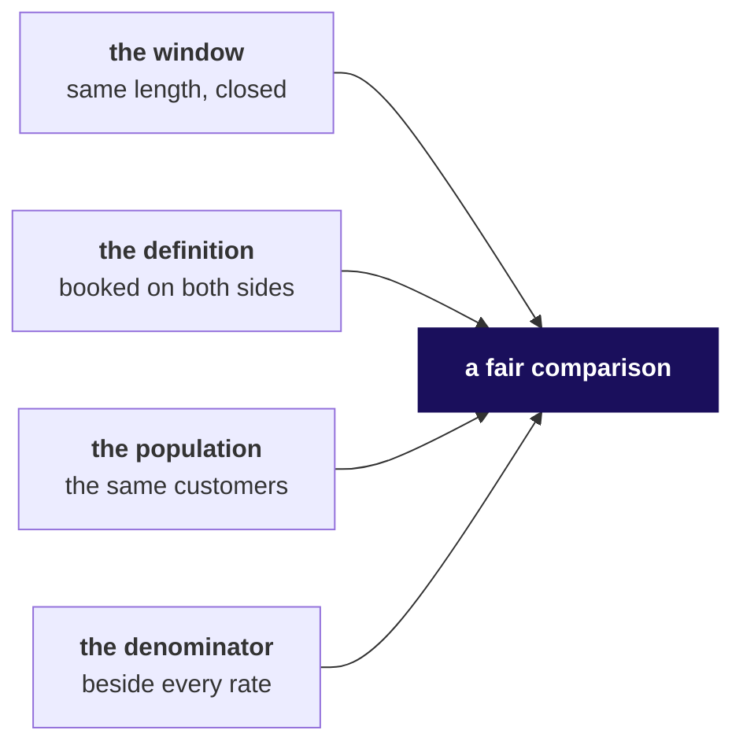
```mermaid
flowchart LR
    W["<b>the window</b><br/>same length, closed"] --> F["<b>a fair comparison</b>"]
    D["<b>the definition</b><br/>booked on both sides"] --> F
    P["<b>the population</b><br/>the same customers"] --> F
    N["<b>the denominator</b><br/>beside every rate"] --> F
    classDef bet fill:#1A0F5C,stroke:#1A0F5C,color:#FFFFFF
    class F bet
```

**The rule.** Check the four before you divide. Booked revenue counts every order placed, before any cancellation or return, on both sides.

```notes
LIVE, 2 minutes. This is the chapter's thinking, and it is also the one-breath answer to interview
question 4. The window is where Marketing's slide breaks; the definition is where the afternoon's
case goes; the population and the denominator come back in chapters 3 and 5. Then the code that
totals each quarter.
```

---

## S14. One dictionary adds revenue up by quarter
*How does one pass over the orders total each quarter?*

```python
# ORDERS: the export, one dictionary per booked order
revenue = {}     # quarter -> rupees booked
orders = {}      # quarter -> number of orders
for order in ORDERS:
    q = order["quarter"]
    if q not in revenue:
        revenue[q] = 0
        orders[q] = 0
    revenue[q] += order["amount"]
    orders[q] += 1
change = (revenue["Q2"] - revenue["Q1"]) / revenue["Q1"] * 100
```

**The rule.** A key seen for the first time starts at zero, and every order adds to its own quarter. This accumulator is the tool the whole day grows.

```notes
LIVE, 2 minutes. Walk the loop line by line and do not run it yet. Ask what the dictionary holds
after the first Q1 order, and after the first Q2 order. Then the prediction.
```

---

## S15. Question: how far did revenue fall?
*Both quarters closed on 13 weeks: what change does the accumulator print?*

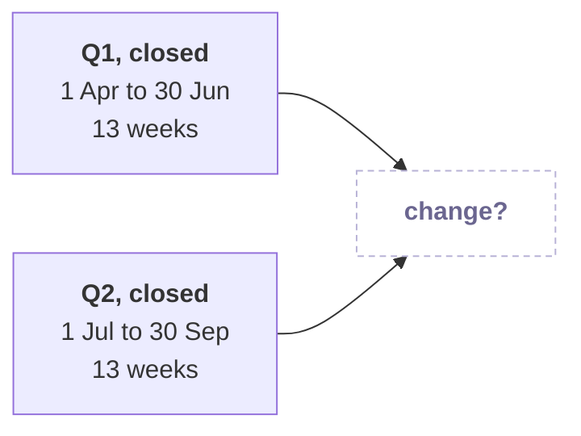
```mermaid
flowchart LR
    Q1["<b>Q1, closed</b><br/>1 Apr to 30 Jun<br/>13 weeks"] --> X["<b>change?</b>"]
    Q2["<b>Q2, closed</b><br/>1 Jul to 30 Sep<br/>13 weeks"] --> X
    classDef unknown fill:#FFFFFF,stroke:#B8B2D6,color:#6B6690,stroke-dasharray:4 3
    class X unknown
```

**Question.** Predict before it runs: a) it fell about 26 percent; b) it fell about 11 percent; c) it fell about 5 percent; d) it rose.

```notes
LIVE, 2 minutes. Take letters. Option a is Marketing's slide carried over; option c is what people
guess from Meera's rounded 2.1 and 1.9 when they divide the wrong way round. Run the cell.
```

---

## S16. Answer: 11.0 percent, Rs 23,00,000 on 13 weeks each
*Both quarters closed on 13 weeks: what change does the accumulator print?*

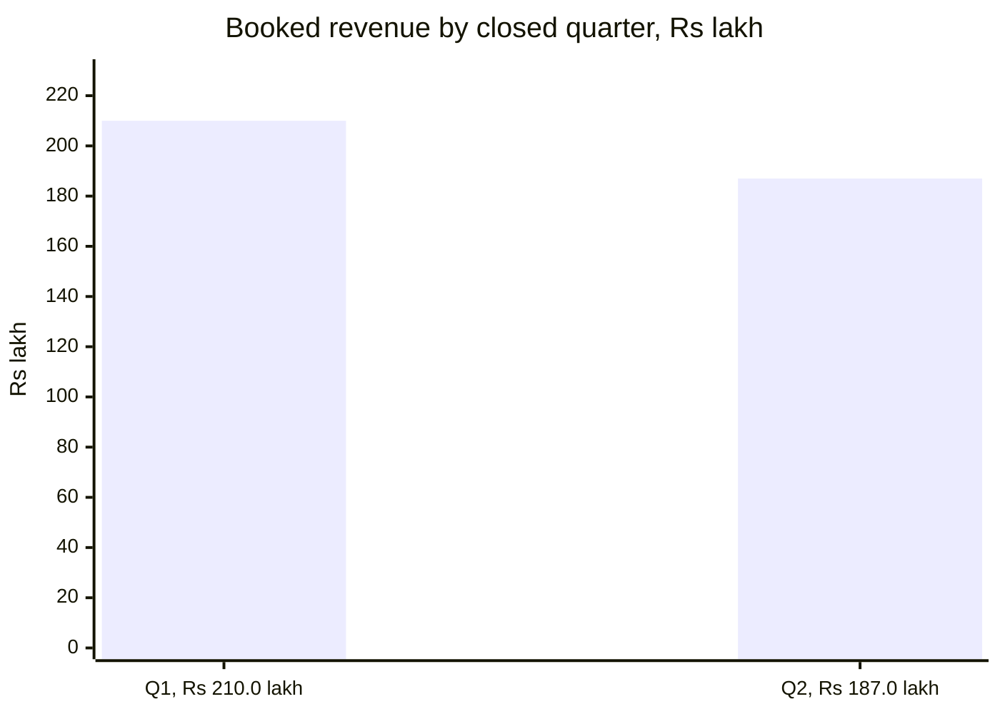
```mermaid
xychart-beta
    title "Booked revenue by closed quarter, Rs lakh"
    x-axis ["Q1, Rs 210.0 lakh", "Q2, Rs 187.0 lakh"]
    y-axis "Rs lakh" 0 --> 230
    bar [210.0, 187.0]
```

**The check.** 114 orders plus 86 is 200, so every order sits in one quarter, and the change rounds to minus 11.0 percent. The answer is b.

```notes
LIVE, 2 minutes. Revenue fell from Rs 2,10,00,000 to Rs 1,87,00,000: Rs 23,00,000 less on two
windows of thirteen weeks. That is the number Meera's question starts from, and it is less than
half the fall on Marketing's slide. Then the number Marketing sent, computed their way.
```

---

## S17. The plausible wrong answer: a 25.9 percent crisis
*What does a hurried analyst send if Q2 is read off the dashboard tile?*

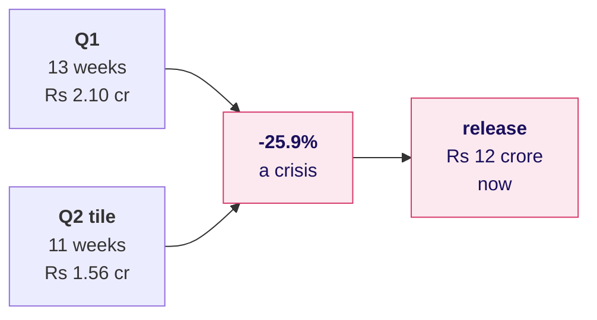
```mermaid
flowchart LR
    A["<b>Q1</b><br/>13 weeks<br/>Rs 2.10 cr"] --> W["<b>-25.9%</b><br/>a crisis"]
    B["<b>Q2 tile</b><br/>11 weeks<br/>Rs 1.56 cr"] --> W
    W --> D["<b>release</b><br/>Rs 12 crore<br/>now"]
    classDef bad fill:#FBE9EF,stroke:#D63A6A,color:#1A0F5C
    class W,D bad
```

**What breaks.** The arithmetic is right and the reading is wrong: a 25.9 percent crisis rushes the Rs 12 crore acquisition budget out of the door.

```notes
LIVE, 2 minutes. The chapter's trap: correct arithmetic on unequal windows, Rs 1,55,59,950 against
Rs 2,10,00,000. Say the business cost out loud: a crisis read rushes the acquisition budget. The check
is cheap and nobody runs it, because a tile shows a number without its window. Then the question
that exposes it.
```

---

## S18. Question: how many weeks does each side cover?
*Q1 is the closed quarter and Q2 is the tile as cut on 15 September: how long is each?*

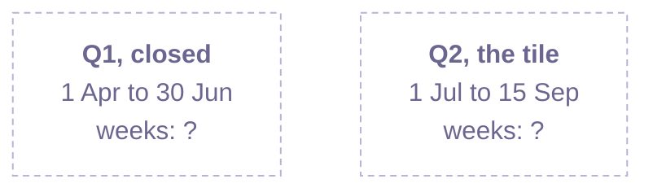
```mermaid
flowchart TB
    Q1["<b>Q1, closed</b><br/>1 Apr to 30 Jun<br/>weeks: ?"]
    Q2["<b>Q2, the tile</b><br/>1 Jul to 15 Sep<br/>weeks: ?"]
    classDef unknown fill:#FFFFFF,stroke:#B8B2D6,color:#6B6690,stroke-dasharray:4 3
    class Q1,Q2 unknown
```

**Question.** Predict before the loop prints: a) 13 weeks against 13; b) 13 weeks against 11; c) 12 weeks against 12; d) 13 weeks against 9.

```notes
LIVE, 2 minutes. Take letters. Some count months and say three against two and a half; the count
in weeks is the one a rate per week needs.
```

---

## S19. Answer: 13 weeks against 11
*Q1 is the closed quarter and Q2 is the tile as cut on 15 September: how long is each?*

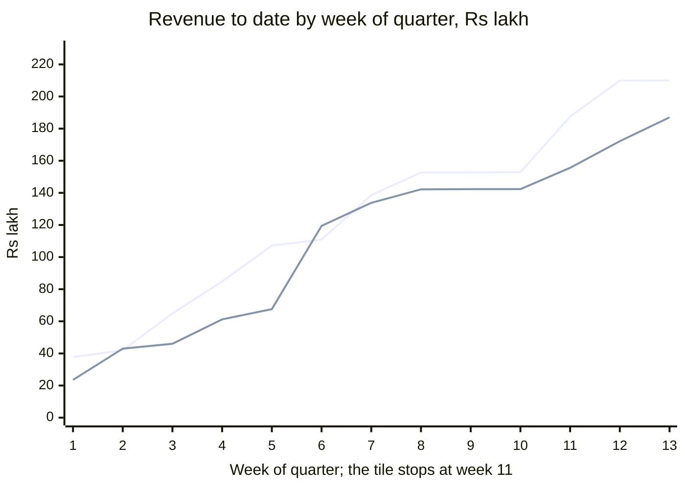
```mermaid
%%{init: {"xyChart": {"showLegend": true}}}%%
xychart-beta
    title "Revenue to date by week of quarter, Rs lakh"
    x-axis "Week of quarter; the tile stops at week 11" [1, 2, 3, 4, 5, 6, 7, 8, 9, 10, 11, 12, 13]
    y-axis "Rs lakh" 0 --> 230
    line "Q1" [37.7, 42.0, 64.9, 84.8, 107.2, 110.9, 138.6, 152.7, 152.8, 152.9, 187.5, 209.9, 210.0]
    line "Q2" [23.5, 43.0, 46.0, 61.2, 67.6, 119.4, 133.8, 142.2, 142.3, 142.3, 155.6, 172.2, 187.0]
```

**Why it is wrong.** The tile stopped on 15 September at Rs 155.6 lakh, week 11, so it holds 11 weeks of trading against 13; Q2 closed at Rs 187.0 lakh and Q1 at Rs 210.0 lakh. **The check:** the first and last order date of each window, and the weeks between them.

```notes
LIVE, 2 minutes. The answer is b: Q1 is 13 weeks and 91 days, the tile 11 weeks. The line that
ends at Rs 210.0 lakh is Q1; the other is Q2, Rs 155.6 lakh at week 11, which is the tile, and
Rs 187.0 lakh at the close. Point at the flat stretches: revenue arrives in lumps, and weeks
without a large order barely move. Then the fix.
```

---

## S20. The fix: closed quarters cut the fall to 11.0 percent
*What changes when both sides cover the same thirteen weeks?*

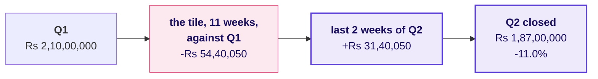
```mermaid
flowchart LR
    A["<b>Q1</b><br/>Rs 2,10,00,000"] --> B["<b>the tile, 11 weeks,<br/>against Q1</b><br/>-Rs 54,40,050"]
    B --> C["<b>last 2 weeks of Q2</b><br/>+Rs 31,40,050"]
    C --> D["<b>Q2 closed</b><br/>Rs 1,87,00,000<br/>-11.0%"]
    classDef bad fill:#FBE9EF,stroke:#D63A6A,color:#1A0F5C
    classDef known fill:#EEEAFB,stroke:#5B3FD6,color:#1A0F5C,stroke-width:2px
    class B bad
    class C,D known
```

**What changed.** The fall Meera acts on shrank from Rs 54,40,050 to Rs 23,00,000, from 25.9 to 11.0 percent; sixteen orders worth Rs 31,40,050 had not happened yet when the tile was read.

```notes
LIVE, 3 minutes. The bridge walks Marketing's gap to the closed quarter: the two weeks the tile
never saw carried Rs 31,40,050, orders booked after the tile was read. Then what a rate
adds when the windows cannot match.
```

---

## S21. Per week the fall is 12.4%; same weeks say 17.0%
*How far apart are the quarters as a rate, and on the same eleven weeks?*

```stats
value: -12.4% | label: per week, the tile against Q1 | note: Rs 14,14,541 against Rs 16,15,385
value: -11.9% | label: per day, closed quarters | note: 92 days against 91
value: -17.0% | label: the same 11 weeks of each | note: 1 Apr to 16 Jun, 1 Jul to 15 Sep
```

**The rule.** A rate names what it counted, what it divided by and over which dates. The same eleven weeks give minus 17.0 percent because a few large business orders make weeks lumpy, so once a quarter closes, compare closed quarters.

```notes
LIVE, 2 minutes. Each figure is honest because it says what it divided and over which dates, and
none of them is 25.9 percent. The per-week rate is option C in action; the same eleven weeks is
option B, what you send while Q2 is still open, with the cut date in the sentence. They disagree,
minus 12.4 against minus 17.0, because a week with three business orders books lakhs and a week
without one books ten or fifteen thousand rupees. Then a route that never reads the quarter field.
```

---

## S22. Added by month, the fall is still 11.0 percent
*Does adding revenue up by month, ignoring the quarter field, give the same fall?*

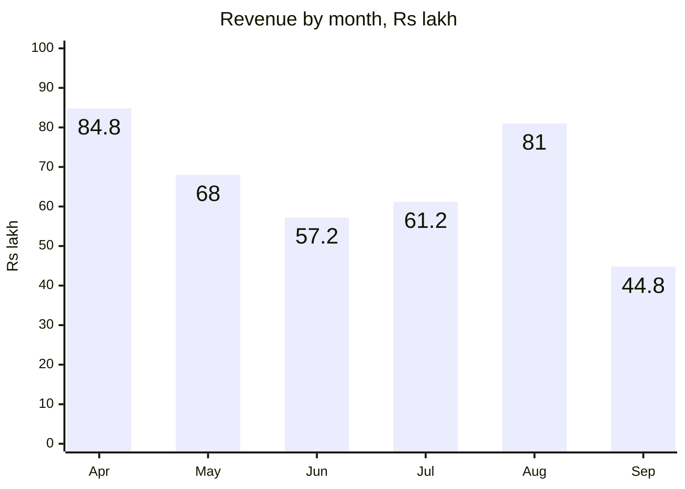
```mermaid
%%{init: {"xyChart": {"showDataLabel": true}}}%%
xychart-beta
    title "Revenue by month, Rs lakh"
    x-axis ["Apr", "May", "Jun", "Jul", "Aug", "Sep"]
    y-axis "Rs lakh" 0 --> 100
    bar [84.8, 68.0, 57.2, 61.2, 81.0, 44.8]
```

**The check.** April to June add to Rs 2,10,00,000 and July to September to Rs 1,87,00,000: minus 11.0 percent both ways. **When to switch:** keep the quarter key for the headline, and use the month key once a question moves inside the quarter, as chapter 6's will.

```notes
LIVE, 2 minutes. The second route ignores the quarter field and trusts only the dates, so if the
two routes disagreed, one would be reading the file wrongly. The notebook asserts they are equal.
Then the chapter's answer.
```

---

## S23. Yes, the drop is real: 11.0 percent, Rs 23,00,000
*Is the drop real, and what did each question on the way answer?*

| Question | Answer |
|---|---|
| 1. Which way sizes the fall? | Closed quarters, since both closed on 13 weeks |
| 2. How far did it fall? | Rs 23,00,000, which is minus 11.0 percent |
| 3. Why does the slide say 25.9? | Its tile saw 11 weeks against Q1's 13 |
| 4. What is the fall per week? | Minus 12.4 percent, with the window named |
| 5. What do the same 11 weeks say? | Minus 17.0 percent, since weeks are lumpy |
| 6. Do the months agree? | Yes: minus 11.0 percent by month too |

**Kavya's review.** "Say both windows out loud with their dates before you say a percentage, and say which option you picked and what would make you pick another."

**In the interview.** [F] What has to match before a quarter-on-quarter comparison is fair? And the design question: Q2 is still open; which comparison do you send?

```notes
LIVE, 1 minute. The interview tags: [S] a staple asked everywhere, [F] frequent in GCC and product
screens, [SV] a service-major screen opener, [D] a differentiator. One breath: window length and
dates, the definition, the population and the denominator, on an export pulled after the later
period closed. The design answer: the same weeks of both, with a rate
per week beside it, switching to closed quarters at the close. One comparison is still missing,
last year's Q2, which only the season question needs. Transition: the drop is real, so which
branch moved?
```

---

## SECTION 2: Which branch moved?
*Which branch of the revenue tree carries the Rs 23,00,000 fall: customers, how often they buy, or what each order is worth?*

```notes
LIVE. Chapter 2 runs 30 minutes: 1 on the map, 4 on the need and the companies, 5 on the options
and the bridge's picture, 5 on counting customers, 2 on the bridge, 8 on the discount trap with its
two-minute KeyError, 4 on the second route and the close. Switch to
notebooks/C2_W01_D02_02_which_branch_STUDENT.ipynb.
```

---

## S24. Answered in six questions, before the budget moves
*Who needs this answer, and which smaller questions lead to it?*

**Who needs the answer.** Meera decides which owner gets the problem: Marketing owns customers, the tier and product owners own how often customers buy, merchandising owns the basket, and Finance with Marketing owns price. A wrong split sends crores to the wrong owner for a quarter.

```timeline
label: 1 | title: Which split of the fall? | body: Four ways, sized in rupees
label: 2 | title: Did customers fall? | body: Distinct ids in each quarter
label: 3 | title: Which leaf moved? | body: The tree with both quarters
label: 4 | title: How many rupees each? | body: One leaf at a time
label: 5 | title: What share had a discount? | body: A field that is sometimes blank
label: 6 | title: Does the symmetric split agree? | body: A second route, with no order | tone: dark
```

```notes
LIVE, 1 minute. Read the six questions. The fifth opens Meera's fourth branch, price, where
Marketing's monsoon plan lives: extending its monsoon discount to the orders that seem to go without
one. Then the owners.
```

---

## S25. The split decides who owns the Rs 23,00,000
*Why does Meera need rupees on each branch before anyone acts?*

**The client asks.** "Are we losing customers, or are the ones we have buying less? Marketing says more customers. Prove it or disprove it."

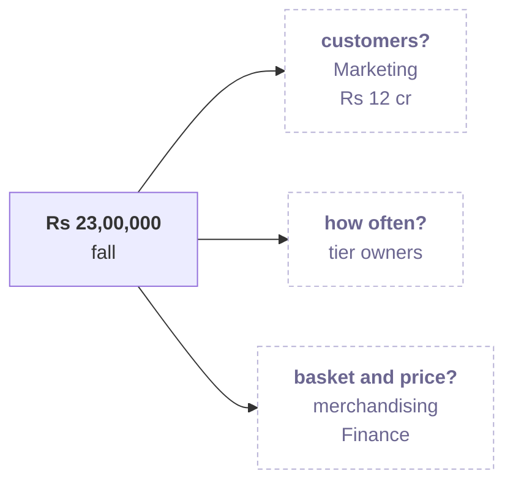
```mermaid
flowchart LR
    R["<b>Rs 23,00,000</b><br/>fall"] --> C["<b>customers?</b><br/>Marketing<br/>Rs 12 cr"]
    R --> F["<b>how often?</b><br/>tier owners"]
    R --> V["<b>basket and price?</b><br/>merchandising<br/>Finance"]
    classDef unknown fill:#FFFFFF,stroke:#B8B2D6,color:#6B6690,stroke-dasharray:4 3
    class C,F,V unknown
```

```notes
LIVE, 2 minutes. Merchandising is the team that picks the range and the pack sizes. The metric at
stake is the rupees each branch carries. A wrong split sends crores to the wrong owner for a
quarter. Remind the room that price and basket fold into revenue per order on this file. Then two
companies that publish this split every quarter.
```

---

## S26. Blinkit and Walmart report the same two branches
*Do real companies split their growth into visits and basket?*

```stats
value: 273.9 m | label: Blinkit orders, Q4 FY26 | note: Rs 525 an order, after discounts
value: Rs 14,386 cr | label: Blinkit net order value | note: orders times order value
value: +1.5% / +1.1% | label: Walmart U.S. transactions / ticket | note: ticket is spend per visit
```

A quick-commerce app and the world's largest store chain both answer "more visits or bigger baskets?" every quarter.

```notes
LIVE, 2 minutes. Sources checked 30 Sep 2026: Eternal shareholders' letter of 28 April 2026, Blinkit
operating metrics (net order value and net average order value, which are net figures); Walmart
earnings release for the second quarter of fiscal 2027, comparable sales excluding fuel up 2.6
percent, transactions 1.5, average ticket 1.1. Then four ways to split Kalpa's fall.
```

---

## S27. A bridge in the tree's order, with the order stated
*Which of four ways should split the fall between the branches?*

| Option | Frequency is charged | Depends on order? |
|---|---|---|
| A. Leaf percentages only | no rupees: percentages do not add | no |
| B. Bridge in the tree's order | -Rs 51,57,895 | yes |
| B. Bridge, order reversed | -Rs 60,88,372 | yes |
| C. Symmetric (log-mean) split | -Rs 55,88,480 | no |
| D. Customer by customer | 69 rows before any total | no |

**The call.** B, with its order written beside it: it adds exactly and a CEO can follow it. **What would change it:** a split Finance rebuilds monthly goes symmetric; "which customers?" goes to D, in chapter 5.

```notes
LIVE, 3 minutes. Only B and C put rupees on each branch that add to the fall, and only C is free of
an order. The spread between orders is about Rs 9.3 lakh, the part where two branches moved
together; whichever goes second is charged for it. The symmetric split follows Ang (2005), "The
LMDI approach to decomposition analysis", Energy Policy, checked through Crossref 29 Sep 2026. Then
the picture of a bridge.
```

---

## S28. A bridge changes one leaf at a time, in order
*How does a bridge put rupees on each branch?*

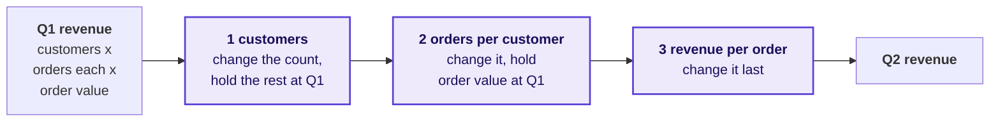
```mermaid
flowchart LR
    A["<b>Q1 revenue</b><br/>customers x<br/>orders each x<br/>order value"] --> C["<b>1 customers</b><br/>change the count,<br/>hold the rest at Q1"]
    C --> F["<b>2 orders per customer</b><br/>change it, hold<br/>order value at Q1"]
    F --> V["<b>3 revenue per order</b><br/>change it last"]
    V --> B["<b>Q2 revenue</b>"]
    classDef known fill:#EEEAFB,stroke:#5B3FD6,color:#1A0F5C,stroke-width:2px
    class C,F,V known
```

**The rule.** Each step moves one leaf to its Q2 value and keeps the leaves not yet moved at Q1, so the steps add exactly to the change in revenue. Write the order beside the bridge.

```notes
LIVE, 2 minutes. In symbols the steps are (c2 - c1) x f1 x v1, then c2 x (f2 - f1) x v1, then
c2 x f2 x (v2 - v1), where c is customers, f orders per customer and v revenue per order. Do not
put the symbols on the board unless someone asks; the three boxes carry it. Then the first leaf,
counted.
```

---

## S29. A dictionary of ids counts each customer once
*How does the code count each customer once?*

```python
# by_quarter: each quarter's list of orders, from chapter 1's accumulator
orders_by_customer = {"Q1": {}, "Q2": {}}   # quarter -> {customer_id: orders}
for q in by_quarter:
    for order in by_quarter[q]:
        cid = order["customer_id"]
        # a customer not seen yet this quarter has placed no orders in it so far
        orders_by_customer[q][cid] = orders_by_customer[q].get(cid, 0) + 1
customers = {"Q1": len(orders_by_customer["Q1"]), "Q2": len(orders_by_customer["Q2"])}
```

**The rule.** `.get(cid, 0)` supplies a default, and this default is right for a reason worth writing down: an id not seen yet has placed no orders so far. Monday counted rows as customers; the keys of this dictionary are the customers.

```notes
LIVE, 2 minutes. Read the default aloud with its reason. The same method, .get with a default, is
the one that goes wrong in fifteen minutes on the discount field, where the default has no such
reason behind it. Then the prediction.
```

---

## S30. Question: how many customers bought in Q2?
*Orders fell from 114 to 86 while Marketing says customers are the problem: how many bought in Q2?*

```stats
value: 69 | label: Q1 customers | note: distinct ids, April to June
value: 114 to 86 | label: orders | note: down 24.6 percent
```

**Question.** Predict Q2's customer count: a) 52, since orders fell by a quarter; b) 69; c) 81; d) 86.

```notes
LIVE, 1 minute. Option d is Monday's rows-as-customers trap. Option a is Marketing's story carried
through. Take letters, then run the cell.
```

---

## S31. Answer: 69 customers, and the tree filled in
*Orders fell from 114 to 86 while Marketing says customers are the problem: how many bought in Q2?*

| Branch | Q1 | Q2 | Ratio |
|---|---|---|---|
| Customers | 69 | 69 | 1.000 |
| Orders per customer | 1.65 (114 over 69) | 1.25 (86 over 69) | 0.754 |
| Revenue per order | Rs 1,84,211 | Rs 2,17,442 | 1.180 |
| Revenue | Rs 2,10,00,000 | Rs 1,87,00,000 | 0.890 |

**The check.** 1.000 times 0.754 times 1.180 is 0.890, the revenue ratio; adding the percentages would have said minus 6.6. The answer is b.

```notes
LIVE, 2 minutes. Let the silence land: Marketing's branch is flat, and orders per customer is the
leaf that moved, down 24.6 percent. Whether these are the same 69 people is chapter 5's question.
Revenue per order rising is no price rise until proved; chapter 4 takes it apart. Fill the tree on
the board. Then the rupees.
```

---

## S32. Frequency costs Rs 51,57,895; order value adds back
*How many rupees does each branch carry, one leaf at a time?*

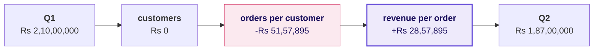
```mermaid
flowchart LR
    A["<b>Q1</b><br/>Rs 2,10,00,000"] --> C["<b>customers</b><br/>Rs 0"]
    C --> B["<b>orders per customer</b><br/>-Rs 51,57,895"]
    B --> V["<b>revenue per order</b><br/>+Rs 28,57,895"]
    V --> D["<b>Q2</b><br/>Rs 1,87,00,000"]
    classDef bad fill:#FBE9EF,stroke:#D63A6A,color:#1A0F5C
    classDef known fill:#EEEAFB,stroke:#5B3FD6,color:#1A0F5C,stroke-width:2px
    class B bad
    class V known
```

**The check.** Rs 0 less Rs 51,57,895 plus Rs 28,57,895 is minus Rs 23,00,000, the fall to the rupee. The customer branch contributes nothing, so Marketing's case for acquisition has no rupees behind it on this file.

```notes
LIVE, 2 minutes. Customers first at Q1's leaves, then 28 fewer orders at Q1's Rs 1,84,211 each, then
86 orders each Rs 33,231 richer. Transition: Meera's tree had a fourth branch, price, and
Marketing's monsoon plan lives there.
```

---

## S33. Each way past the KeyError decides what a blank means
*What does the KeyError on "discount" say, and what does each way past it decide?*

```text
KeyError: 'discount'
```

| Way past it | Python's name for it | The decision it makes without saying so |
|---|---|---|
| `if "discount" in order:` | Look before you leap | Orders without it are skipped |
| `try:` ... `except KeyError:` | Easier to ask forgiveness | Whatever the except branch does |
| `order.get("discount", 0)` | A default | Absent becomes zero rupees |

```notes
LIVE, 2 minutes, and no more. Read the last line of the trace: it names the key. The Python glossary
names the first two styles LBYL and EAFP (docs.python.org glossary, verified 29 Sep 2026). The trap
is what the third way decides: a blank becomes zero rupees. Then the number it produces.
```

---

## S34. The plausible wrong answer: half had no discount
*What share of orders carried a discount if a blank is read as zero?*

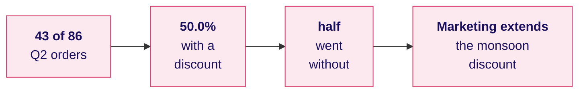
```mermaid
flowchart LR
    A["<b>43 of 86</b><br/>Q2 orders"] --> B["<b>50.0%</b><br/>with a<br/>discount"]
    B --> C["<b>half</b><br/>went<br/>without"] --> D["<b>Marketing extends</b><br/>the monsoon<br/>discount"]
    classDef bad fill:#FBE9EF,stroke:#D63A6A,color:#1A0F5C
    class A,B,C,D bad
```

| Invented order | Discount field | Read as zero | Recorded only |
|---|---|---|---|
| A, B | Rs 100, Rs 0 | Rs 100, Rs 0 | Rs 100, Rs 0 |
| C | absent | Rs 0 | left out |
| Share with a discount | | 1 of 3, 33% | 1 of 2, 50% |

```notes
LIVE, 2 minutes. The chapter's trap. The hurried default silences the error, and the share comes out
at 50.0 percent, 43 of 86. Marketing extends the monsoon discount to the other half, spending margin
on orders that may already carry one. The three orders are invented to show the mechanism. Then the
question that splits the 43.
```

---

## S35. Question: what were the 43 "no discount" orders?
*The hurried reading says 43 of Q2's 86 orders went without: how many of them record Rs 0?*

```stats
value: 42.1% | label: Q1, absent as zero | note: orders with a discount
value: 50.0% | label: Q2, absent as zero | note: orders with a discount
value: 43 | label: Q2, read as none | note: of 86 orders
```

**Question.** Of the 43 Q2 orders read as "no discount", how many record Rs 0? a) all 43; b) 34; c) 17; d) none.

```notes
LIVE, 2 minutes. Each learner first runs the count in the empty your-turn cell of notebook 02: orders
with no discount field, per quarter. Then take letters.
```

---

## S36. Answer: 17 recorded zeros and 26 unknowns
*The hurried reading says 43 of Q2's 86 orders went without: how many of them record Rs 0?*

| Share of orders with a discount | Q1 | Q2 |
|---|---|---|
| Blanks read as zero | 42.1%, 48 of 114 | 50.0%, 43 of 86 |
| Over orders that record the field | 58.5%, 48 of 82 | 71.7%, 43 of 60 |
| Range, blanks unknown | 42.1% to 70.2% | 50.0% to 80.2% |

**The fix.** Write the rule down: "absent means not recorded; reported separately; never counted as zero". At Rs 150 on every Q2 order, the most anyone recorded, the discount branch holds at most Rs 12,900 of a Rs 23,00,000 fall.

```notes
LIVE, 3 minutes. The answer is c. What changed: the extension loses its premise, since only 17 of 86
are known to have had no discount, and discounts leave the list of causes. Ask which system wrote
records without the field (Rubin, 1976, "Inference and missing data", Biometrika, is the formal
version). Interview [S]: a field is missing; do you fill it with zero? Then a split that chooses no
order.
```

---

## S37. Symmetric split: Rs 55,88,480 on the same branch
*Does a split that chooses no order put the fall on the same branch?*

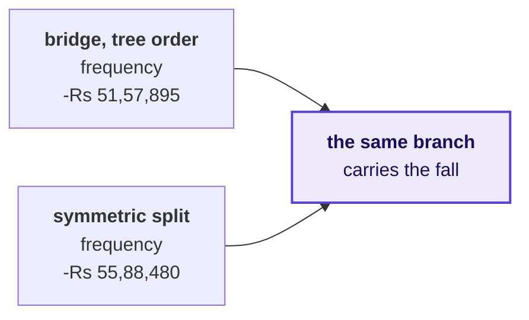
```mermaid
flowchart LR
    A["<b>bridge, tree order</b><br/>frequency<br/>-Rs 51,57,895"] --> C["<b>the same branch</b><br/>carries the fall"]
    B["<b>symmetric split</b><br/>frequency<br/>-Rs 55,88,480"] --> C
    classDef known fill:#EEEAFB,stroke:#5B3FD6,color:#1A0F5C,stroke-width:2px
    class C known
```

**When to switch.** Keep the bridge for Meera, with its order beside it; go symmetric when two branches keep moving together and someone else rebuilds the split every month.

```notes
LIVE, 2 minutes. The symmetric split shares the fall by logarithms and chooses no order, so it could
have disagreed with the bridge; the Rs 4,30,585 between them is the part where frequency and order
value moved together. Then the chapter's answer.
```

---

## S38. Orders per customer moved: Rs 51,57,895 of the fall
*Which branch moved, and what did each question on the way answer?*

| Question | Answer |
|---|---|
| 1. Which split of the fall? | The bridge in the tree's order, order stated |
| 2. Did customers fall? | No: 69 in each quarter |
| 3. Which leaf moved? | Orders per customer, 1.65 to 1.25 |
| 4. How many rupees each? | Frequency -Rs 51,57,895, order value +Rs 28,57,895 |
| 5. What share had a discount? | 71.7% of recorded Q2 orders; the branch holds Rs 12,900 at most |
| 6. Does the symmetric split agree? | Yes: the same branch, Rs 55,88,480 |

**Kavya's review.** "Customers held at 69 and the ones we have bought less often. Put the bridge in front of Meera with its order beside it, and do not call bigger orders good news until you know where they came from."

**In the interview.** [F] How do you split a revenue change between customers, frequency and order value?

```notes
LIVE, 2 minutes. One breath for the interview: tree, ratios multiply back, one leaf at a time in a
fixed order, rupees add. Transition: the tier's head asked about his tier, so the same numbers are
needed for every segment.
```

---

## SECTION 3: Which segment moved?
*Which of the four customer segments carries the fall in orders per customer, measured the same way for every segment and quarter?*

```notes
LIVE. Chapter 3 runs 30 minutes: 1 on the map, 3 on the need and Costco, 5 on the options and the
picture, 5 on tree_for and its test, 5 on Retail-Core and Business, 5 on the roll-up trap, 5 on the
second route and the room's run, 1 on the close. Switch to
notebooks/C2_W01_D02_03_which_segment_STUDENT.ipynb. The break follows this chapter.
```

---

## S39. Answered in six questions, for the tier's head
*Who needs this answer, and which smaller questions lead to it?*

**Who needs the answer.** The head of Retail-Plus, the paid membership tier, decides whether his tier needs rescuing, and orders per member is his number. A wrong answer costs a tier nobody protects, or a quarter spent fixing one that was fine.

```timeline
label: 1 | title: Copy, function or one pass? | body: Eight groups, one definition
label: 2 | title: Does tree_for agree? | body: Chapter 2's numbers, reproduced
label: 3 | title: How did Retail-Core move? | body: Rate and typical order
label: 4 | title: What did Business do? | body: The median against the range
label: 5 | title: What does the roll-up say? | body: Four segments back into one
label: 6 | title: Does one pass agree? | body: A second route, by key | tone: dark
```

```notes
LIVE, 1 minute. Read the six questions. The segment itself is found by each learner in their own
cell at the end of the chapter, never on the projector. Then the tier's question.
```

---

## S40. The head of Retail-Plus asks if his tier slips
*What does the tier's head need to know, and how does each segment earn?*

**The client asks.** "One of my members says the app's reorder button has been broken for six weeks. Is my tier the one slipping?"

| Segment | How it earns | Watch first |
|---|---|---|
| Retail-Core | Many small orders | Customers active |
| Retail-Plus, the paid tier | Members' repeat buying | Orders per member |
| Business | Few very large accounts | Order timing per account |
| Student | Small discounted baskets | Discount per order |

```notes
LIVE, 2 minutes. His renewals are the metric of his job, so orders per member is his number. A wrong
answer costs a tier nobody protects, or a quarter spent fixing one that was fine. Eight trees are
needed: four segments by two quarters. Then a membership business that reports its segment.
```

---

## S41. Costco reports its renewal rate twice
*Does a real membership business report its segment beside the whole?*

```stats
value: 92.3% | label: U.S. and Canada | note: membership renewal rate, fiscal 2025
value: 89.8% | label: worldwide | note: the same measure, all regions
```

Costco reports the rate by region beside the worldwide figure, because a blend can hide the region that slips.

```notes
LIVE, 1 minute. Source: Costco fourth quarter fiscal 2025 results filed with the SEC (exhibit 99),
checked 30 Sep 2026. The link: the head of Retail-Plus needs his tier's own rate, beside the company's.
Then three ways to get eight groups' numbers.
```

---

## S42. A function fits: one definition, any subset
*Which way should compute the same numbers for eight groups?*

| Option | Lines | Places to edit | Rows read |
|---|---|---|---|
| A. Copy the loop per group | 72 | 8 | 1,600 |
| B. A function, `tree_for(rows)` | 21 | 1 | 200 |
| C. Group by a key in one pass | 14 | 1 | 200 |

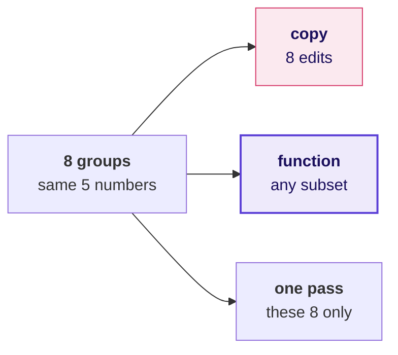
```mermaid
flowchart LR
    Q["<b>8 groups</b><br/>same 5 numbers"] --> A["<b>copy</b><br/>8 edits"]
    Q --> B["<b>function</b><br/>any subset"]
    Q --> C["<b>one pass</b><br/>these 8 only"]
    classDef bad fill:#FBE9EF,stroke:#D63A6A,color:#1A0F5C
    classDef known fill:#EEEAFB,stroke:#5B3FD6,color:#1A0F5C,stroke-width:2px
    class A bad
    class B known
```

**The call.** B: the same numbers will be asked for a channel, a month and delivered orders today. **What would change it:** millions of rows, every group at once, means C, which is `groupby` in Week 2.

```notes
LIVE, 3 minutes. The notebook's first section sizes these. Copying reads the export eight times and
creates eight places for Anand's next definition change to be missed once. Ask how many times the
room wants to paste chapter 2's code. Then the picture of a function.
```

---

## S43. A function takes any orders and returns five numbers
*What does a function do that a copied loop cannot?*

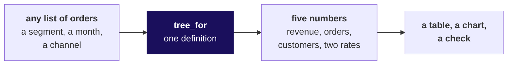
```mermaid
flowchart LR
    R["<b>any list of orders</b><br/>a segment, a month,<br/>a channel"] --> T["<b>tree_for</b><br/>one definition"]
    T --> O["<b>five numbers</b><br/>revenue, orders,<br/>customers, two rates"]
    O --> U["<b>a table, a chart,<br/>a check</b>"]
    classDef bet fill:#1A0F5C,stroke:#1A0F5C,color:#FFFFFF
    class T bet
```

**The rule.** A function returns its answer, so the caller can put it in a table, a chart or a check; a function that only prints hands back nothing.

```notes
LIVE, 2 minutes. The definitions live in one place, so Anand's next change to what counts as an
order is made once. Chapter 5 meets a colleague's function that prints instead of returning. Then
the function itself.
```

---

## S44. tree_for, written once and tested on chapter 2
*How is tree_for written, and how do we know it is right?*

```python
def tree_for(rows):
    """Revenue, orders, customers and the two rates for any group of orders."""
    revenue, seen = 0, {}
    for order in rows:
        revenue += order["amount"]
        seen[order["customer_id"]] = True
    return {"revenue": revenue, "orders": len(rows), "customers": len(seen),
            "orders_per_customer": len(rows) / len(seen),
            "revenue_per_order": revenue / len(rows)}
```

**The check.** A new function earns trust by reproducing a number proved another way, so it runs first on all of each quarter, where chapter 2 already found 1.65 and 1.25.

```notes
LIVE, 2 minutes. Build it line by line: def, the parameter, the body, return. The seen dictionary is
chapter 2's customer count again. Then the prediction.
```

---

## S45. Question: what does tree_for give for all of Q1?
*Called on every Q1 order, what orders per customer should the function return?*

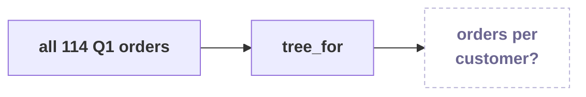
```mermaid
flowchart LR
    R["<b>all 114 Q1 orders</b>"] --> T["<b>tree_for</b>"] --> O["<b>orders per<br/>customer?</b>"]
    classDef unknown fill:#FFFFFF,stroke:#B8B2D6,color:#6B6690,stroke-dasharray:4 3
    class O unknown
```

**Question.** a) 1.65; b) 1.25; c) None; d) 114.

```notes
LIVE, 1 minute. Option c is what a function hands back when it prints its answer and returns
nothing; option d is the order count. Take letters, then run the cell.
```

---

## S46. Answer: 1.65 and 1.25, chapter 2 reproduced
*Called on every Q1 order, what orders per customer should the function return?*

```stats
value: 114 / 69 / 1.65 | label: Q1 orders / customers / rate | note: all of Q1
value: 86 / 69 / 1.25 | label: Q2 orders / customers / rate | note: all of Q2
value: Rs 1,84,211 to Rs 2,17,442 | label: revenue per order | note: Q1 to Q2
```

**The check.** The function reproduces chapter 2's leaves exactly, so it can be trusted on a group nobody has counted yet. The answer is a.

```notes
LIVE, 2 minutes. Now call it on a segment. Retail-Core and Business are the two segments
demonstrated; do not run Retail-Plus or Student on the projector. Then Retail-Core.
```

---

## S47. Retail-Core: 1.12 to 1.06, minus 5.3 percent
*How did Retail-Core's orders per customer and typical order move?*

```stats
value: 34 and 34 | label: Retail-Core customers | note: the same count in both quarters
value: 38 to 36 | label: orders | note: 1.12 to 1.06 per customer, -5.3%
value: Rs 2,325 to Rs 2,080 | label: median order | note: the typical order
```

Retail-Core slipped a little, far short of the company's 24.6 percent.

```notes
LIVE, 2 minutes. describe is Monday's median by hand, inside a function, with the odd and even case:
it returns a group's median, extremes and range. Retail-Core's typical order fell about Rs 245.
Then Business, where the orders are lakh-sized.
```

---

## S48. Question: what did Business orders look like in Q2?
*describe returns a group's median, extremes and range: how did Business's move from Q1?*

```stats
value: Rs 9,83,780 | label: Q1 median | note: Business, 20 orders
value: Rs 15,80,940 | label: Q1 range | note: Rs 2,03,060 to Rs 17,84,000
```

**Question.** Predict describe for Business in Q2: a) median and range both fall; b) the median barely moves and the range jumps; c) the median doubles; d) nothing changes.

```notes
LIVE, 1 minute. Business revenue fell from Rs 2,07,71,180 to Rs 1,85,41,460. Take letters.
```

---

## S49. Answer: one order stretched the range
*describe returns a group's median, extremes and range: how did Business's move from Q1?*

| Business | Median | Range | Orders per customer |
|---|---|---|---|
| Q1, 20 orders | Rs 9,83,780 | Rs 15,80,940 | 1.82 |
| Q2, 17 orders | Rs 9,52,000 | Rs 27,28,460 | 1.55 |
| Change | -3.2% | +72.6% | -15.0% |

```mermaid
flowchart LR
    M["<b>median</b><br/>-3.2%"] --> T["<b>typical order</b><br/>held"]
    R["<b>range</b><br/>+72.6%"] --> O["<b>one order</b><br/>Rs 29,45,460"]
    classDef known fill:#EEEAFB,stroke:#5B3FD6,color:#1A0F5C,stroke-width:2px
    classDef bad fill:#FBE9EF,stroke:#D63A6A,color:#1A0F5C
    class T known
    class O bad
```

```notes
LIVE, 2 minutes. The answer is b. The eleven Business customers placed 17 orders against 20, down
15.0 percent per customer, on three orders. Neither segment shown falls 24.6 percent, so before
guessing where the rest sits, roll the segments back up.
```

---

## S50. The plausible wrong answer: frequency fell 6.0%
*How far did orders per customer fall if the four segments' rates are averaged?*

```mermaid
%%{init: {"xyChart": {"showDataLabel": true, "showDataLabelOutsideBar": true}, "themeVariables": {"xyChart": {"plotColorPalette": "#D63A6A, #1F8A5B"}}}}%%
xychart-beta
    title "Averaged in pink, the wrong roll-up; weighted in green"
    x-axis ["Averaged Q1", "Averaged Q2", "Weighted Q1", "Weighted Q2"]
    y-axis "Orders per customer" 0 --> 2.2
    bar [1.94, 1.82, 1.65, 1.25]
    bar [-1, -1, 1.65, 1.25]
```

**What breaks.** Averaged, the segments say 1.94 to 1.82, minus 6.0 percent on the unrounded figures: "frequency is not the branch, so Marketing may be right", and the Rs 12 crore goes back on the table. **The check:** a roll-up must reproduce 1.65 and 1.25.

```notes
LIVE, 3 minutes. The chapter's trap: the arithmetic is right and answers a different question. The
unrounded averages are 1.9385 and 1.8215. Only the averages and the
weighted figures appear; no per-segment rows are shown. Then the fix.
```

---

## S51. The fix: a ratio of totals, never a mean of ratios
*Why does averaging four rates mislead, and what does the roll-up do instead?*

| Invented group | Customers | Orders per customer | Orders |
|---|---|---|---|
| Large | 30 | 1.1 | 33 |
| Small | 2 | 3.5 | 7 |
| Mean of the two rates | | 2.30 | |
| Total orders over total customers | 32 | 1.25 | 40 |

**What changed.** Weighted by customers the segments give 114 over 69, then 86 over 69, minus 24.6 percent: frequency stays the branch and the acquisition budget stays shut.

```notes
LIVE, 2 minutes. The invented groups show the mechanism: two customers get the same vote as thirty.
Count groups in and out while rolling up: four segments in, 69 customers back. Interview [F]: why
can't you average four segments' rates? Then the second route and the room's own run.
```

---

## S52. One pass by key agrees, then your run on all four
*Does one pass grouped by key agree with tree_for for all eight groups?*

```timeline
label: Route two | title: One pass by key | body: totals[(quarter, segment)] over 200 orders; all 8 groups agree with tree_for.
label: Step 1 | title: Four segments in | body: Call tree_for on each segment in each quarter.
label: Step 2 | title: Four rows out | body: Count the rows that come back, and check the weighted roll-up.
label: Step 3 | title: One sentence | body: Name the segment whose orders per customer moved most, with its denominator. | tone: dark
```

**When to switch.** Keep the function while groups are asked for one at a time; switch to the pass by key when every group is needed at once on a large file, which is Week 2's `groupby`.

```notes
LIVE, 5 minutes. The second route's check prints agreement and no segment's numbers. Then the room
types the your-turn cell. Do not run it on the projector and do not confirm any segment aloud;
collect two sentences read aloud without comment.
```

---

## S53. Your own run names the segment that moved
*Which segment moved, and what did each question on the way answer?*

| Question | Answer |
|---|---|
| 1. Copy, function or one pass? | A function: 21 lines and one place to edit |
| 2. Does tree_for agree? | Yes: 1.65 and 1.25 on 69 customers |
| 3. How did Retail-Core move? | 1.12 to 1.06, minus 5.3 percent |
| 4. What did Business do? | Median minus 3.2 percent; range up 72.6 percent on one Rs 29,45,460 order |
| 5. What does the roll-up say? | Weighted, minus 24.6 percent; averaged, a false 6.0 |
| 6. Does one pass agree? | Yes, for all eight groups |

**Kavya's review.** "You wrote two functions for eight groups and copied no loops. Say the segment on your screen with its denominator before anyone draws a conclusion from it."

**In the interview.** The design question: the same metrics for every segment and quarter; copy, function or group by key?

```notes
LIVE, 1 minute, then the 10-minute break. Neither segment shown explains 24.6 percent, so the
weighted roll-up puts the rest in the two segments each learner's own run opens. One breath for the
design question: a function when groups are asked one at a time and definitions change; a pass by
key when the file is large and every group is needed.
```

---

## SECTION 4: Did customers pay more?
*Revenue per order rose 18 percent while revenue fell: did customers pay more, or did the mix of orders change?*

```notes
LIVE. Chapter 4 runs 30 minutes after the break: 1 on the map, 4 on the need and Swiggy, 5 on the
options and the picture, 6 on the lost orders and the segments' own rates, 4 on the trap and the
code, 5 on the split and its rate part, 3 on the second route, 2 on the close. Switch to
notebooks/C2_W01_D02_04_mix_or_rate_STUDENT.ipynb. From here the segment the room found is named.
```

---

## S54. Answered in six questions, before a price rise
*Who needs this answer, and which smaller questions lead to it?*

**Who needs the answer.** Meera and Finance decide whether a price rise goes into the plan, on Marketing's reading of the 18 percent. A wrong reading raises prices on customers who never paid more, and costs volume in the tier whose orders already halved.

```timeline
label: 1 | title: Which reading of the rise? | body: Four readings, one that adds
label: 2 | title: Whose orders were lost? | body: The 28 orders, by segment
label: 3 | title: Did any segment rise 18%? | body: Each segment's own rate
label: 4 | title: Price or mix? | body: Marketing's reading, tested
label: 5 | title: What is the rate part? | body: Segment by segment
label: 6 | title: Does a two-group split agree? | body: Business against everyone else | tone: dark
```

```notes
LIVE, 1 minute. Open by naming what the room found at the end of chapter 3: Retail-Plus, the same
22 members, 51 orders to 26. Read the six questions. Then Marketing's new ask.
```

---

## S55. Marketing wants a price rise on an 18% blend
*What is Marketing asking for, and what would a wrong reading cost?*

**The client asks.** "Revenue per order is up 18 percent. Our customers are happy to pay more, so the premium range is working. Put a price rise into the plan." (the marketing lead)

```stats
value: +18.0% | label: revenue per order | note: all orders, blended
value: 26 of 51 | label: Retail-Plus orders kept | note: the same 22 members
value: 430x | label: order size, Business to consumer | note: lakhs against thousands, Q1
```

```notes
LIVE, 2 minutes. The metric at stake is a blend across segments whose orders differ several
hundredfold: a Q1 Business order averaged Rs 10,38,559 and a consumer order Rs 2,434. A wrong
reading costs volume: a price rise on customers who never paid more. Then a real company whose order
value rose the same way.
```

---

## S56. Swiggy: an order value that rose on its mix
*Has a real company seen its average order rise on its mix alone?*

```mermaid
flowchart LR
    U["<b>Instamart order value</b><br/>up 14 percent<br/>to Rs 697"] --> M["<b>the mix moved</b><br/>non-grocery and<br/>large packs"]
    M --> D["<b>no price rise</b><br/>needed to explain it"]
    classDef bad fill:#FBE9EF,stroke:#D63A6A,color:#1A0F5C
    classDef known fill:#EEEAFB,stroke:#5B3FD6,color:#1A0F5C,stroke-width:2px
    class U bad
    class D known
```

**The rule.** When groups differ in order size and their shares move, a blended order value can rise with no customer paying more for the same thing.

```notes
LIVE, 2 minutes. Swiggy, the food and grocery delivery app, Q2 FY2026 shareholder letter, checked 30
Sep 2026: the average order value of Instamart, its quick-commerce store, Rs 697, up 14 percent in
the quarter, put down to non-grocery categories and large packs taking a larger share of gross order
value, the value of orders before discounts; net average order value after discounts Rs 485. The
link to Kalpa: Business's lakh-sized orders took a larger share as small member orders left. Then
four readings of Kalpa's rise.
```

---

## S57. Split into mix and rate: the only reading that adds
*Which of four readings can put rupees on "customers paid more" and on "the mix changed"?*

| Option | Rupees of the Rs 33,231 it explains | Can one lakh-sized order move it? | What it leaves open |
|---|---|---|---|
| A. Read the blended change | None: it is the rise | Yes | Why it rose |
| B. Each segment's own revenue per order | None: a direction per segment | Yes, inside Business | How the segments add up |
| C. Split into mix and rate | All of it, split in two | The rate part, yes | Which prices moved, if any |
| D. Each segment's median order | None: the typical order | No | The rupees |

**The call.** C, built on B's per-segment rates. **What would change it:** segments of similar order size would make mix negligible and B enough; a question about which products' prices moved needs order lines this file lacks.

```notes
LIVE, 3 minutes. Only C puts rupees on a cause, and only D is safe from one lakh-sized order. Write "C: mix and rate" beside rung 4. Then the picture of
a blend.
```

---

## S58. A blend moves with its shares or with its rates
*What can move a blended revenue per order?*

```mermaid
flowchart LR
    B["<b>revenue per order</b><br/>the blend"] --> M["<b>the mix</b><br/>each segment's<br/>share of orders"]
    B --> R["<b>the rate</b><br/>revenue per order<br/>inside each segment"]
    M --> X["small orders leave:<br/>the blend rises<br/>at the same prices"]
    R --> Y["a segment's orders<br/>grow: a possible<br/>price signal"]
    classDef bad fill:#FBE9EF,stroke:#D63A6A,color:#1A0F5C
    classDef known fill:#EEEAFB,stroke:#5B3FD6,color:#1A0F5C,stroke-width:2px
    class X known
    class Y bad
```

**The rule.** The blend is each segment's share of orders times its own revenue per order, added up, so it can rise because the shares moved while every segment's own figure held.

```notes
LIVE, 2 minutes. Draw it on the board beside the tree: revenue per order was one leaf; inside it sit
four shares and four rates. Then the first number: where did the 28 lost orders come from?
```

---

## S59. Question: how many lost orders were members?
*Twenty-eight orders were lost between the quarters: how many were Retail-Plus?*

```mermaid
flowchart LR
    A["<b>Q1</b><br/>114 orders"] --> B["<b>Retail-Plus</b><br/>?"] --> C["<b>Q2</b><br/>86 orders"]
    classDef unknown fill:#FFFFFF,stroke:#B8B2D6,color:#6B6690,stroke-dasharray:4 3
    class B unknown
```

**Question.** Of the 28 lost orders: a) about 7; b) about 14; c) 25; d) all 28.

```notes
LIVE, 1 minute. Take letters, then run the orders bridge in notebook 04.
```

---

## S60. Answer: 25 of the 28 were small member orders
*Twenty-eight orders were lost between the quarters: how many were Retail-Plus?*

```mermaid
flowchart LR
    A["<b>Q1</b><br/>114"] --> P["<b>Retail-Plus</b><br/>-25"]
    P --> B["<b>Business</b><br/>-3"]
    B --> C["<b>Retail-Core</b><br/>-2"]
    C --> S["<b>Student</b><br/>+2"]
    S --> D["<b>Q2</b><br/>86"]
    classDef bad fill:#FBE9EF,stroke:#D63A6A,color:#1A0F5C
    class P bad
```

The orders that vanished were about three thousand rupees each, which already hints at why the average order grew.

```notes
LIVE, 2 minutes. The answer is c. Ask the room what happens to an average when its smallest items
leave. Then each segment's own revenue per order.
```

---

## S61. Question: did any segment's rate rise 18 percent?
*The blend rose 18.0 percent: which segment's own revenue per order rose that far?*

```stats
value: Rs 1,84,211 | label: Q1, all orders | note: revenue per order
value: Rs 2,17,442 | label: Q2, all orders | note: up 18.0 percent
```

**Question.** a) Business; b) Retail-Plus; c) Student; d) none of them.

```notes
LIVE, 1 minute. Take letters. Most pick Business, since its orders are the largest.
```

---

## S62. Answer: none; the largest own rise is 14.8 percent
*The blend rose 18.0 percent: which segment's own revenue per order rose that far?*

| Segment | Q1 revenue per order | Q2 revenue per order | Change |
|---|---|---|---|
| Retail-Core | Rs 2,117 | Rs 2,014 | -4.9% |
| Retail-Plus | Rs 2,815 | Rs 3,012 | +7.0% |
| Business | Rs 10,38,559 | Rs 10,90,674 | +5.0% |
| Student | Rs 962 | Rs 1,104 | +14.8% |
| All orders, blended | Rs 1,84,211 | Rs 2,17,442 | +18.0% |

**The check.** No segment rose 18 percent, so the blend rose because the mix of orders moved. The answer is d.

```notes
LIVE, 2 minutes. Student's 14.8 percent is Rs 142 more an order, and Retail-Plus's 7.0 percent is
Rs 197: the consumer segments moved by a few hundred rupees at most. Then Marketing's reading, as
Marketing wrote it.
```

---

## S63. The plausible wrong answer: customers pay 18% more
*What does Marketing read into the 18 percent, and what would it decide?*

```mermaid
flowchart LR
    A["<b>+18.0%</b><br/>revenue per order"] --> B["<b>customers pay more</b><br/>the premium works"]
    B --> C["<b>raise prices</b><br/>in the plan"]
    classDef bad fill:#FBE9EF,stroke:#D63A6A,color:#1A0F5C
    class A,B,C bad
```

**Why it is wrong.** A blend rises whenever small orders fall away, and no segment's own figure rose 18 percent. **The check.** Each segment's own revenue per order, where the largest rise is Student's 14.8 percent.

```notes
LIVE, 2 minutes. The chapter's trap. Say the decision it would have misled: a price rise on the tier
whose orders already halved. Then the code that prices the mix.
```

---

## S64. Q2's mix at Q1's rates prices the mix alone
*How is the Rs 33,231 rise split into a mix part and a rate part?*

```python
mix_only = 0
for seg in SEGMENTS:
    share_q2 = orders_q2[seg] / 86           # each segment's share of Q2's orders
    mix_only += share_q2 * rate_q1[seg]      # priced at Q1's revenue per order
mix = mix_only - 184211                      # the mix part
rate = 217442 - mix_only                     # the rate part
```

**The rule.** Hold every segment at Q1's revenue per order and move only the shares: what the blend does then is the mix, and the rest is the rate.

```notes
LIVE, 2 minutes. Ask the room to predict mix_only before the fix slide: above or below Q1's
Rs 1,84,211? Above, since the small orders left. Then the numbers.
```

---

## S65. The fix: 69 percent of the rise is mix
*At Q2's mix and Q1's rates, what would revenue per order have been?*

```mermaid
flowchart LR
    A["<b>Q1</b><br/>Rs 1,84,211"] --> M["<b>mix</b><br/>+Rs 22,902<br/>fewer small orders"]
    M --> R["<b>rate</b><br/>+Rs 10,330<br/>mostly Business"]
    R --> D["<b>Q2</b><br/>Rs 2,17,442"]
    classDef bad fill:#FBE9EF,stroke:#D63A6A,color:#1A0F5C
    classDef known fill:#EEEAFB,stroke:#5B3FD6,color:#1A0F5C,stroke-width:2px
    class M bad
    class R known
```

**What changed.** At Q2's mix and Q1's rates revenue per order would already be Rs 2,07,112. "Customers pay 18 percent more, raise prices" became "the mix explains Rs 22,902 of the Rs 33,231 rise", which leaves the price rise without the evidence it rested on.

```notes
LIVE, 3 minutes. Retail-Plus fell from 44.7 to 30.2 percent of orders. Then what the Rs 10,330 of
rate is made of.
```

---

## S66. The rate part is almost all Business
*What is the Rs 10,330 rate part made of, segment by segment?*

```stats
value: Rs 10,302 | label: Business | note: 17 orders, each about Rs 52,000 larger
value: Rs 60 | label: Retail-Plus | note: Rs 2,815 to Rs 3,012 an order
value: Rs 12 and -Rs 43 | label: Student and Retail-Core | note: a hundred rupees or less
```

Business's lakh-sized orders carry almost all of the rate part, driven by one large order, as chapter 3's range showed; the consumer segments' own revenue per order moved by a few hundred rupees at most.

```notes
LIVE, 2 minutes. Each segment's rate part is its share of Q2's orders times the change in its own
revenue per order; the four add back to Rs 10,330. Then a check a senior can run with no laptop.
```

---

## S67. Two groups on an envelope give 69.3 percent
*Does a back-of-envelope split, Business against everyone else, put the same share of the rise on the mix?*

| Route | What it prices | Mix | Share of the rise |
|---|---|---|---|
| Four segments | Q2's mix at each segment's Q1 rate | Rs 22,902 | 68.9% |
| Two groups | Business's share change times its gap | Rs 23,039 | 69.3% |

**When to switch.** Report the four-segment split, since it names each segment's part; the envelope is the check with no laptop, and it stops agreeing when the consumer segments' own shares move a lot against each other.

```notes
LIVE, 3 minutes. The envelope: Business's share of orders rose from 17.5 to 19.8 percent, times the
Rs 10,36,125 by which a Q1 Business order beat a consumer order, is about Rs 23,000. It uses no
consumer rate, so it could have disagreed. Then the chapter's answer.
```

---

## S68. No price signal: 69 percent of the rise is mix
*Did customers pay more, and what did each question on the way answer?*

| Question | Answer |
|---|---|
| 1. Which reading of the rise? | The split into mix and rate |
| 2. Whose orders were lost? | Retail-Plus lost 25 of the 28 |
| 3. Did any segment rise 18%? | No; Student's 14.8 was the most |
| 4. Price or mix? | Mix: Rs 22,902 of the Rs 33,231 rise |
| 5. What is the rate part? | Business, Rs 10,302 of Rs 10,330 |
| 6. Does a two-group split agree? | Yes: 69.3 against 68.9 percent |

**Kavya's review.** "Marketing looked at a blend and saw a price signal. You opened it and found 25 small orders missing. No consumer segment paid meaningfully more; the small orders disappeared, from the tier we are about to ask about."

**In the interview.** [F] Revenue per order rose 18 percent while revenue fell; did prices go up?

```notes
LIVE, 2 minutes. One breath for the interview: a blend, a mix split, a number for each part.
Transition: Marketing is not done; it comes back with churn.
```

---

## SECTION 5: Were customers lost?
*Marketing says the flat count hides customers lost and replaced: were any lost, who slowed instead, and which segment fell most?*

```notes
LIVE. Chapter 5 runs 30 minutes: 1 on the map, 4 on the need and the published estimates, 5 on the
options and the picture, 6 on the sets and who slowed, 7 on the summary-script trap, 3 on the
consumer business, 4 on the second route and the close. Switch to
notebooks/C2_W01_D02_05_marketings_hypothesis_STUDENT.ipynb.
```

---

## S69. Answered in six questions, before Rs 12 crore moves
*Who needs this answer, and which smaller questions lead to it?*

**Who needs the answer.** Meera decides whether to release the Rs 12 crore acquisition budget, which Marketing now rests on churn hiding in a flat count. A wrong answer spends crores replacing customers who never left, while the ones who slowed keep slowing.

```timeline
label: 1 | title: Which test sees churn? | body: Four tests, sized
label: 2 | title: How many are missing? | body: Q1's 69 against Q2's ids
label: 3 | title: Who slowed down? | body: Customer by customer
label: 4 | title: Which segment fell most? | body: Last quarter's summary script
label: 5 | title: Too small to matter? | body: Retail-Plus in rupees
label: 6 | title: Do the dates agree? | body: A second route, first and last orders | tone: dark
```

```notes
LIVE, 1 minute. Read the six questions. Then Marketing's three attacks.
```

---

## S70. Marketing: churn is hiding in a flat count
*What does Marketing claim now, and what would a wrong answer cost?*

**The client asks.** "A flat count can hide churn replaced by new customers, which is why we need acquisition. And Retail-Plus is Rs 65,250 out of a Rs 23 lakh fall. Last quarter's summary script says Business fell most." (the marketing lead)

```mermaid
flowchart LR
    A["<b>69 and 69</b><br/>a net count"] --> B["<b>same 69?</b>"]
    A --> C["<b>20 lost,<br/>20 new?</b>"]
    classDef unknown fill:#FFFFFF,stroke:#B8B2D6,color:#6B6690,stroke-dasharray:4 3
    class B,C unknown
```

```notes
LIVE, 2 minutes. Churn means customers who stop buying, which new ones must replace. The metric at
stake is retention, and its mirror, new customers. A wrong answer is Rs 12 crore spent replacing
people who never left. Marketing's first claim is fair; test it. Then what the published studies
say about the two levers.
```

---

## S71. Keeping a customer costs a fraction of winning one
*What do published figures say about keeping customers, and can a count and a frequency move apart?*

```stats
value: 5 to 25x | label: acquisition against retention | note: cost, by study and industry
value: 25 to 95% | label: profit lift | note: from a 5 percent rise in retention
value: +34% / 4.53 to 4.10 | label: Swiggy users / orders per user | note: quarter to Sep 2025
```

If the fall is frequency among customers Kalpa already has, the cheaper lever is on the table; the reply asks Finance for Kalpa's own acquisition cost before comparing rupees.

```notes
LIVE, 2 minutes. Amy Gallo, "The Value of Keeping the Right Customers", Harvard Business Review,
29 October 2014, checked 30 Sep 2026; the retention figure is Frederick Reichheld of Bain, quoted
there. They are estimates across industries and say nothing about Kalpa's own costs: say so. Swiggy, Q2 FY2026 shareholder letter, checked 30 Sep 2026:
monthly transacting users up 34.0 percent to 22.9 million while frequency fell 4.53 to 4.10, a
growing count beside a falling frequency, which new users alone could produce, so the two are read
apart. Then four tests of Marketing's claim.
```

---

## S72. Id overlap, then each customer, tests the churn claim
*Which of four tests can see customers lost and customers new?*

| Option | Output to read | Sees lost and new? | What it assumes |
|---|---|---|---|
| A. Compare the counts | 2 numbers | No | Nothing: a count is net |
| B. The id overlap, as sets | 3 numbers | Yes | One id per person |
| C. Customer by customer | 69 rows | Yes, and who slowed | One id per person |
| D. Marketing's CRM sign-ups | Sign-ups by month | New only | The CRM and the export share their ids |

**The call.** B, then C: three numbers anyone can rerun, then who slowed. **What would change it:** one person holding two ids, store and app, would make the overlap invent churn, and the CRM would be needed to join them first.

```notes
LIVE, 3 minutes. A, B and C read the export already open; D, Marketing's CRM, its customer
database, is a second system whose ids must match the export's. Write "B, then C" beside rung 5.
Then the picture of an overlap.
```

---

## S73. Two sets of ids split into kept, lost and new
*What does a net count hide, and what do two sets of ids show?*

```mermaid
flowchart LR
    Q1["<b>Q1 ids</b><br/>69"] --> L["<b>only in Q1</b><br/>lost"]
    Q1 --> K["<b>in both</b><br/>kept"]
    Q2["<b>Q2 ids</b><br/>69"] --> K
    Q2 --> N["<b>only in Q2</b><br/>new"]
    classDef unknown fill:#FFFFFF,stroke:#B8B2D6,color:#6B6690,stroke-dasharray:4 3
    class K,L,N unknown
```

**The rule.** A count is net: twenty lost and twenty new leave it where it was. Only the ids themselves separate the three groups.

```notes
LIVE, 2 minutes. Leave the three boxes empty on the board; the next two slides fill them. Then the
code.
```

---

## S74. Three set operations answer Marketing's claim
*How does the code find who is kept, lost and new?*

```python
ids = {"Q1": set(), "Q2": set()}
for order in ORDERS:
    ids[order["quarter"]].add(order["customer_id"])
both = ids["Q1"] & ids["Q2"]    # bought in both quarters
lost = ids["Q1"] - ids["Q2"]    # bought in Q1 only
new = ids["Q2"] - ids["Q1"]     # bought in Q2 only
```

**The rule.** A set holds each id once; the & operator keeps what both sets share, and the minus operator keeps what the first set has and the second lacks.

```notes
LIVE, 2 minutes. Sets are chapter 2's dictionary of ids without the counts. Source for the
operators: docs.python.org, data structures, sets, checked 30 Sep 2026. Then the prediction.
```

---

## S75. Question: how many of Q1's 69 are missing?
*Marketing says twenty lost and twenty new would look exactly like 69 and 69: how many are missing?*

```mermaid
flowchart LR
    Q1["<b>Q1 ids</b><br/>69"] --> X["<b>in both?</b><br/>only Q1?<br/>only Q2?"]
    Q2["<b>Q2 ids</b><br/>69"] --> X
    classDef unknown fill:#FFFFFF,stroke:#B8B2D6,color:#6B6690,stroke-dasharray:4 3
    class X unknown
```

**Question.** a) about 20, replaced by 20 new; b) about 5; c) none; d) it cannot be told from one export.

```notes
LIVE, 1 minute. Take letters, then run the set cell in notebook 05.
```

---

## S76. Answer: none lost, none new, 18 members slowed
*Marketing says twenty lost and twenty new would look exactly like 69 and 69: how many are missing?*

```stats
value: 69 / 0 / 0 | label: both / only Q1 / only Q2 | note: the id overlap
value: 23 | label: customers who slowed | note: 44 ordered as often as before
value: 18 | label: of them in Retail-Plus | note: 7 fell by two orders
```

The flat count hides no churn: the fall is people Kalpa already has, buying less often, and most of them are members.

```notes
LIVE, 3 minutes. The answer is c. Option C, customer by customer, gives the second and third numbers.
Acquisition has nothing to replace on this file. Then Marketing's third attack, the summary script.
```

---

## S77. The plausible wrong answer: Business fell most
*Which segment fell most, according to last quarter's summary script?*

```python
def pct_change(before, after):
    change = 100 * (after - before) / before
    if abs(change) > 30:
        print(f"  check by hand: {change:+.1f}%")
    else:
        return round(change, 1)
# summary: {'Retail-Core': -5.3, 'Business': -15.0}
```

**What breaks.** "Orders per customer fell most in Business, 15.0 percent": Meera opens Business accounts first, and the head of Retail-Plus is told his tier is not in the table.

```notes
LIVE, 3 minutes. The chapter's trap. Run the script exactly as it is in notebook 05 and read the
summary aloud. Ask whether anyone trusts it. Most will; it looks tidy. Then why it is wrong.
```

---

## S78. Why it is wrong: two segments came back as None
*Why does a tidy summary hold two segments when four went in?*

```mermaid
flowchart LR
    A["<b>4 segments in</b>"] --> B["<b>pct_change</b><br/>prints above 30%"]
    B --> C["<b>2 numbers</b><br/>2 None"]
    C --> D["<b>the filter</b><br/>drops None"]
    D --> E["<b>2 in the summary</b><br/>Retail-Plus gone"]
    classDef bad fill:#FBE9EF,stroke:#D63A6A,color:#1A0F5C
    class B,C,D,E bad
```

**The check.** Count groups in and groups out: four segments went in, two came back with a number.

```notes
LIVE, 2 minutes. A function that prints and returns nothing hands back None, and the filter drops it
without a word. The segment the script was written to flag, a 49 percent fall, is the one it
silently lost. Student, which rose, also vanished. Interview [F]: why does a function that prints
instead of returning break a pipeline? Then the fix.
```

---

## S79. The fix: return every change, flag it in a column
*What should the helper hand back, and where does the flag go?*

| Segment | Q1 | Q2 | Change | Flag |
|---|---|---|---|---|
| Retail-Core | 1.12 | 1.06 | -5.3% | |
| Retail-Plus | 2.32 | 1.18 | -49.0% | check by hand |
| Business | 1.82 | 1.55 | -15.0% | |
| Student | 2.50 | 3.50 | +40.0% | check by hand |

**What changed.** "Business fell most, 15.0 percent" became "Retail-Plus fell 49.0 percent, 2.32 to 1.18 orders per member; Business 15.0 percent on three orders".

```notes
LIVE, 2 minutes. The helper returns the change every time, in the same type, and the flag sits
beside it. Point at the flags: large moves are flagged, never dropped. A flag asks for a look by
hand and removes nothing from the table. Then Marketing's second attack: too small to matter.
```

---

## S80. Retail-Plus is 93 percent of the consumer fall
*Is Retail-Plus too small to matter at Rs 65,250 of a Rs 23 lakh fall?*

```mermaid
flowchart LR
    A["<b>consumer fall</b><br/>Rs 2,28,820 to<br/>Rs 1,58,540"] --> D["<b>Retail-Plus</b><br/>Rs 65,250 of<br/>Rs 70,280, 93%"]
    A --> O["<b>25 of 28</b><br/>lost orders"]
    B["<b>Business</b><br/>Rs 22,29,720"] --> T["<b>three orders</b><br/>each worth lakhs"]
    classDef bad fill:#FBE9EF,stroke:#D63A6A,color:#1A0F5C
    classDef unknown fill:#FFFFFF,stroke:#B8B2D6,color:#6B6690,stroke-dasharray:4 3
    class D,O bad
    class T unknown
```

In the consumer business, Retail-Plus is Rs 65,250 of the Rs 70,280 fall. The Business rupees are three lakh-sized orders out of twenty, which one account's timing can move, so both findings go to Meera side by side.

```notes
LIVE, 3 minutes. The consumer business fell from Rs 2,28,820 to Rs 1,58,540, and Retail-Plus is
Rs 65,250 of the Rs 70,280. The rupee fall in Business is three orders, each worth lakhs, so one
account ordering early or late moves it by lakhs. Say both findings side by side: the rupees in
Business, with their caveat, and the behaviour in Retail-Plus, with its count. Then a second route
to "nobody lost".
```

---

## S81. First and last order dates find nobody lost or new
*Do each customer's first and last order dates agree with the overlap?*

```mermaid
flowchart LR
    F["<b>first orders</b><br/>all in Q1"] --> N["<b>new in Q2: 0</b><br/>lost after Q1: 0"]
    L["<b>last orders</b><br/>all in Q2"] --> N
    classDef known fill:#EEEAFB,stroke:#5B3FD6,color:#1A0F5C,stroke-width:2px
    class N known
```

**When to switch.** Show Marketing the overlap, since it names lost and new in three numbers; the dates add that "new" means new since 1 April, so a longer question needs each customer's whole history, which the CRM holds.

```notes
LIVE, 2 minutes. The second route takes each customer's first and last order date: every first
order falls in Q1 and every last order in Q2, so none new and none lost, from the dates alone and
without the quarter field, which is why it could have disagreed with the overlap. Then the chapter's
answer.
```

---

## S82. None lost, none new: 23 customers slowed down
*Were customers lost, and what did each question on the way answer?*

| Question | Answer |
|---|---|
| 1. Which test sees churn? | The id overlap, then customer by customer |
| 2. How many are missing? | None: 69 in both, 0 lost, 0 new |
| 3. Who slowed down? | 23 customers, 18 of them members |
| 4. Which segment fell most? | Retail-Plus, minus 49.0 percent per member |
| 5. Too small to matter? | No: 93 percent of the consumer fall |
| 6. Do the dates agree? | Yes: first orders in Q1, last in Q2 |

**Kavya's review.** "Marketing made three attacks and you answered each with a check anyone can rerun. You nearly shipped a summary that lost the one segment that matters, so count what comes back from every helper you did not write."

**In the interview.** [D] Marketing insists the answer is acquisition and your data says frequency; how do you make the case in the room?

```notes
LIVE, 2 minutes. One breath for [D]: test their claim in its own terms, show the overlap, show where
the fall is, end on what would change my mind. Lunch follows.
```
