# Which branch moved

Week 1, Day 2. Half one.

Kicker: WEEK 1  ·  TUESDAY  ·  HALF ONE
Quote: Are we losing customers, or are the ones we have buying less? Marketing says more customers. Prove it or disprove it.
Who: Meera Raghavan, CEO, Kalpa Retail, replying to Monday's numbers

```notes
LIVE, one minute. Read Meera's reply aloud and leave it on screen while the room settles. Monday
drew the tree; today the tree meets two quarters of orders, and the question is which branch moved.
The morning runs three rounds on one case, each harder than the last. The afternoon escalates it.
```

---

## SECTION 1: The ask and the thinking
*Three voices reach the team with one drop between them, and the thinking is drawn before any code.*

```notes
LIVE. This chapter runs 20 minutes and opens no notebook. Its job is to put the question, the
voices and the ladder on the board, so every round after it has a rung to stand on.
```

---

## S1. Meera wants to know which branch moved
*Q2 came in below Q1, and she names the two branches she suspects.*

**The client asks.** "So revenue is customers, times how often they buy, times basket, times price. Now: which of those moved? Q2 was Rs 1.9 crore, Q1 was 2.1. Are we losing customers, or are the ones we have buying less? Marketing says more customers. Prove it or disprove it."

```stats
value: Rs 2.1 cr | label: Q1 revenue | note: as Meera remembers it
value: Rs 1.9 cr | label: Q2 revenue | note: as Meera remembers it
value: 2 | label: suspects | note: fewer customers, or less buying each
value: Rs 12 cr | label: still on the table | note: Marketing's acquisition budget
```

```notes
LIVE, 3 minutes. Read the message aloud. Point out that Meera has already done Monday's work in
her head: she says the tree back to us. Her figures are rounded and from memory; the file will
give exact ones. Ask which of the four stats worries her most. The budget, again: it is still
waiting on this answer.
Transition: two more voices land on the same thread.
```

---

## S2. Two more voices land on the same thread
*A tier head forwards a complaint, and Marketing already has its answer.*

```cards
icon: user-round | eyebrow: The CEO | title: Meera Raghavan | body: Wants to know which branch of the tree moved, and whether acquisition is the one to fund.
icon: crown | eyebrow: The paid tier | title: The head of Retail-Plus | body: Forwards a member's complaint that the app's reorder feature has been broken for six weeks, and asks whether his tier is the one slipping.
icon: megaphone | eyebrow: Marketing | title: The marketing lead | body: Says the answer is more customers, and has a slide that shows revenue falling by a quarter. | tone: dark
```

**Your role.** Present the decomposition to all three, name a cause as a hypothesis, and say what evidence would prove it. Marketing will push back.

```notes
LIVE, 3 minutes. Three stakeholders, one set of numbers, three different wishes. The head of
Retail-Plus wants a verdict on his tier; Marketing wants a budget; Meera wants the truth before
she signs. Say plainly that the team works for the truth, and that each voice gets the same
numbers. Do not answer the head of Retail-Plus today in the morning; his question comes back
after lunch.
```

---

## S3. Question: what makes a drop look real when it is not
*Before anyone explains a fall, the room lists what could manufacture one.*

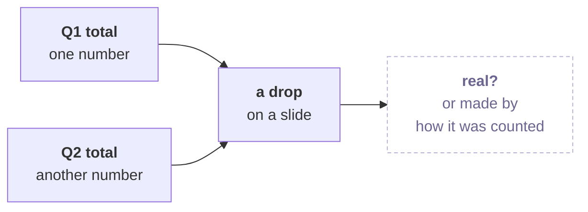
```mermaid
flowchart LR
    A["<b>Q1 total</b><br/>one number"] --> D["<b>a drop</b><br/>on a slide"]
    B["<b>Q2 total</b><br/>another number"] --> D
    D --> Q["<b>real?</b><br/>or made by<br/>how it was counted"]
    classDef unknown fill:#FFFFFF,stroke:#B8B2D6,color:#6B6690,stroke-dasharray:4 3
    class Q unknown
```

**Question.** In pairs, two minutes: write down three ways a comparison of two totals could show a fall that the business never had.

```notes
LIVE, 4 minutes. Two minutes in pairs, then collect answers on the board in two columns: things
about the window and things about the counting. Expect "different lengths of time", "a different
definition of sales", "missing values", "one huge order". Keep every answer; the next slide sorts
them. Do not lead the room towards any one.
```

---

## S4. Answer: five ways a drop can be made by the counting
*Each one is a check that runs before any explanation is offered.*

| What differs | How it fakes a drop | The check |
|---|---|---|
| The window | One side covers fewer weeks than the other | First and last date, and weeks covered |
| The definition | Booked on one side, delivered on the other | The status filter written beside each total |
| A missing field | Read as zero, it drags a total or an average down | Count the records that carry the field |
| The weights | Averages of groups averaged as if the groups were equal | The roll-up reproduces the company total |
| A few large orders | Three orders move a total more than a hundred small ones | The typical value and the spread, per group |

```notes
LIVE, 4 minutes. Map the room's board answers onto these five rows. Every row returns today as a
trap: the window in round 1, the missing field in round 2, the weights in round 3, the large
orders in rounds 1 and 3. Tell the room the list is the day's checklist. A row the room did not
think of gets one sentence now and its full treatment when it arrives.
```

---

## S5. A drop is investigated in a fixed order
*Five rungs, climbed in order, so no explanation is offered for a fall that is not there.*

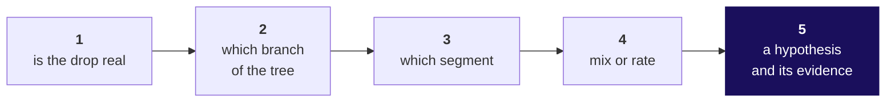
```mermaid
flowchart LR
    R1["<b>1</b><br/>is the drop real"] --> R2["<b>2</b><br/>which branch<br/>of the tree"]
    R2 --> R3["<b>3</b><br/>which segment"]
    R3 --> R4["<b>4</b><br/>mix or rate"]
    R4 --> R5["<b>5</b><br/>a hypothesis<br/>and its evidence"]
    classDef bet fill:#1A0F5C,stroke:#1A0F5C,color:#FFFFFF
    class R5 bet
```

**The rule.** Confirm, compare like with like, decompose, isolate, then hypothesise. A rung skipped is a question someone in the meeting will ask you.

```notes
LIVE, 3 minutes. Draw the ladder on the board, left to right, and leave it there all day. The
morning climbs rungs 1 to 3, one per round. Rung 4 is the escalated case after lunch, and rung 5
is the second case, where Marketing attacks your hypothesis. This is also the answer shape for
interview question 1: sales dropped 15 percent, how would you investigate. Say that once.
```

---

## S6. Monday's tree, with two empty columns
*The same tree, a Q1 column and a Q2 column, and nothing filled in yet.*

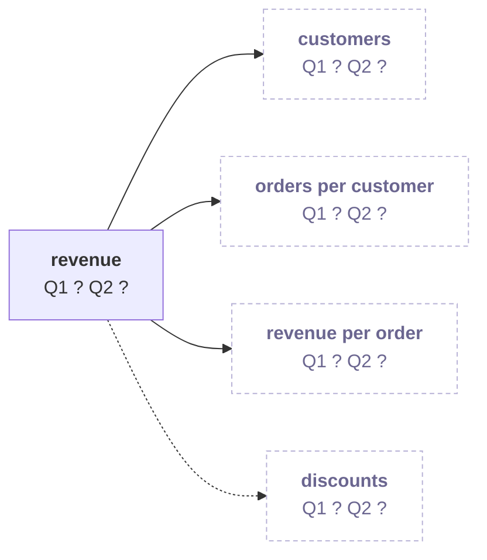
```mermaid
flowchart LR
    R["<b>revenue</b><br/>Q1 ? Q2 ?"] --> C["<b>customers</b><br/>Q1 ? Q2 ?"]
    R --> F["<b>orders per customer</b><br/>Q1 ? Q2 ?"]
    R --> O["<b>revenue per order</b><br/>Q1 ? Q2 ?"]
    R -.-> D["<b>discounts</b><br/>Q1 ? Q2 ?"]
    classDef unknown fill:#FFFFFF,stroke:#B8B2D6,color:#6B6690,stroke-dasharray:4 3
    class C,F,O,D unknown
```

**The formula.** Revenue equals customers, times orders per customer, times revenue per order, and the discounts sit beside it as the branch Marketing does not mention.

```notes
LIVE, 3 minutes. Redraw Monday's tree with two empty columns under every branch. Items per order
and price per item are folded into revenue per order today, because the file has no line items.
Every round fills some of these blanks. Ask: if customers is flat and revenue fell, which
branch must have moved? One of the other two, which is round 2.
Transition to round 1: before filling any box, check that the two totals deserve comparing.
```

---

## SECTION 2: Round 1, is the drop real
*Marketing's slide says revenue fell by a quarter, and the first rung checks the windows before the story.*

```notes
LIVE. Round 1 runs 50 minutes. Open notebooks/C2_W01_D02_01_is_the_drop_real_STUDENT.ipynb on the
projector now; the trainer drives and the room follows in its own Codespace.
```

---

## S7. Marketing's slide says revenue fell 25.9 percent
*Its Q2 figure comes from the dashboard tile, cut on 15 September.*

```stats
value: Rs 2,10,00,000 | label: Q1 on Marketing's slide | note: 1 April to 30 June
value: Rs 1,55,59,950 | label: Q2 on Marketing's slide | note: the dashboard tile, cut 15 September
value: -25.9% | label: the headline | note: "revenue fell by a quarter"
```

**The client asks.** If revenue fell by a quarter in one quarter, Marketing says, the acquisition budget cannot wait.

```notes
LIVE, 3 minutes. Put Marketing's claim up exactly as they would show it. The arithmetic on the slide
is correct: 1,55,59,950 over 2,10,00,000 is 0.741, a fall of 25.9 percent. Ask: is there anything
wrong here? Most of the room will not see it yet. That is the point of the round.
```

---

## S8. Like with like means the same window and definition
*Two totals compare only when their windows, their definitions and their records match.*

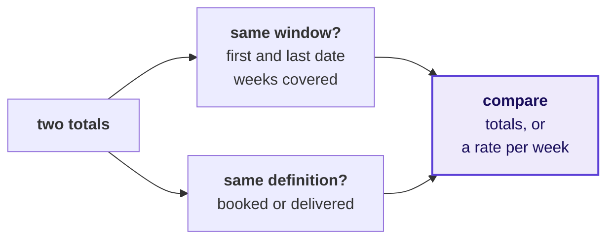
```mermaid
flowchart LR
    T["<b>two totals</b>"] --> W["<b>same window?</b><br/>first and last date<br/>weeks covered"]
    T --> S["<b>same definition?</b><br/>booked or delivered"]
    W --> OK["<b>compare</b><br/>totals, or<br/>a rate per week"]
    S --> OK
    classDef known fill:#EEEAFB,stroke:#5B3FD6,color:#1A0F5C,stroke-width:2px
    class OK known
```

**The rule.** When the windows differ, compare the same weeks of each, or a rate per week or per day, and write the window beside the number.

```notes
LIVE, 3 minutes. Draw this before any code. The window question is always first because it is the
cheapest: two dates per side. The definition is Monday's lesson, and today both sides are booked
orders as exported. Say that a rate per week is the same idea as orders per customer: a numerator,
a denominator and the window it covers.
```

---

## S9. Step 1: read each window's first and last date
*A loop keeps the earliest and the latest date it has seen, one quarter at a time.*

```python
first, last = "9999-12-31", "0000-01-01"
for order in ORDERS:
    if order["quarter"] == "Q1":
        first = min(first, order["order_date"])
        last = max(last, order["order_date"])
print(first, last)
```

Dates written as year, month, day sort as text in date order, so `min` and `max` work on them directly.

```notes
LIVE, 5 minutes. Type it in notebook 01 with the room. The starting values are chosen so any real
date beats them. Run it for Q1, then change the filter to the dashboard's Q2 window: quarter Q2 and
order_date on or before 2026-09-15. Do not read out the results yet; the next slide asks for a
prediction first.
```

---

## S10. Question: how many weeks does each side cover
*Q1 is the closed quarter; Q2 is the tile as cut on 15 September.*

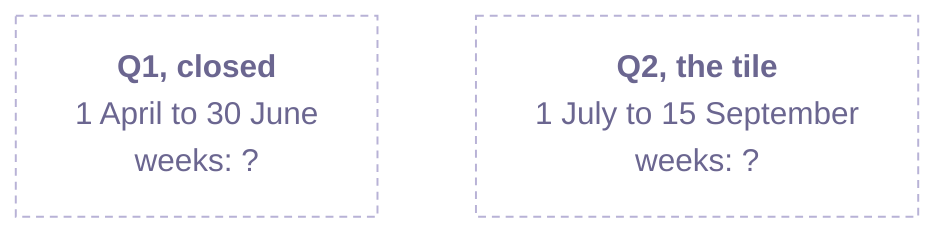
```mermaid
flowchart TB
    Q1["<b>Q1, closed</b><br/>1 April to 30 June<br/>weeks: ?"]
    Q2["<b>Q2, the tile</b><br/>1 July to 15 September<br/>weeks: ?"]
    classDef unknown fill:#FFFFFF,stroke:#B8B2D6,color:#6B6690,stroke-dasharray:4 3
    class Q1,Q2 unknown
```

**Question.** Predict before the loop prints: a) 13 weeks against 13; b) 13 weeks against 11; c) 12 weeks against 12; d) 13 weeks against 9.

```notes
LIVE, 2 minutes. Take letters. Some will count months and say three against two and a half. The
count in weeks is the one a rate per week needs.
```

---

## S11. Answer: 13 weeks against 11
*The two totals were never measuring the same stretch of time.*

| Window | First order | Last order | Weeks covered | Orders | Revenue |
|---|---|---|---|---|---|
| Q1, closed | 1 Apr | 27 Jun | 13 | 114 | Rs 2,10,00,000 |
| Q2 tile, cut 15 Sep | 2 Jul | 15 Sep | 11 | 70 | Rs 1,55,59,950 |
| Q2, closed | 2 Jul | 28 Sep | 13 | 86 | Rs 1,87,00,000 |

**The check.** First and last order date of each window, and the weeks each one covers, before any total is compared.

```notes
LIVE, 3 minutes. The answer is b. Q1 runs 1 April to 30 June, 13 weeks and 91 days. The tile runs
1 July to 15 September, 11 weeks. The last row is the closed quarter, which ended on 30 September
and is now in the export. Show the three rows and let the room say what went wrong before the
next slide names it.
```

---

## S12. The wrong answer: revenue fell 25.9 percent
*A two-week gap reads as a crisis, and a crisis rushes a budget.*

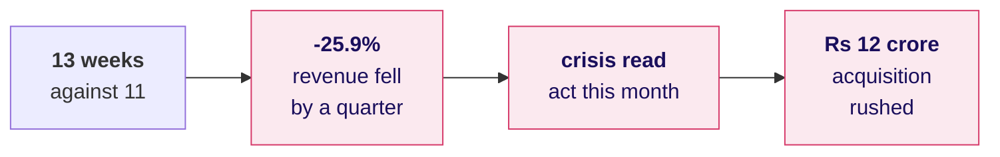
```mermaid
flowchart LR
    A["<b>13 weeks</b><br/>against 11"] --> B["<b>-25.9%</b><br/>revenue fell<br/>by a quarter"]
    B --> C["<b>crisis read</b><br/>act this month"]
    C --> D["<b>Rs 12 crore</b><br/>acquisition<br/>rushed"]
    classDef bad fill:#FBE9EF,stroke:#D63A6A,color:#1A0F5C
    class B,C,D bad
```

**What breaks.** Two missing weeks look exactly like lost customers, and the decision they would mislead is the largest one on Meera's desk.

```notes
LIVE, 3 minutes. This is the round's trap, shown exactly. The number is correct arithmetic on the
wrong windows. Name the decision it would have misled: a crisis read that rushes the Rs 12 crore
budget. Ask how many people in the room would have checked the dates before the total.
```

---

## S13. Cumulative revenue shows where the tile stopped
*Q1 reaches Rs 210.0 lakh at week 13; the tile stopped Q2 at week 11, at Rs 155.6 lakh.*

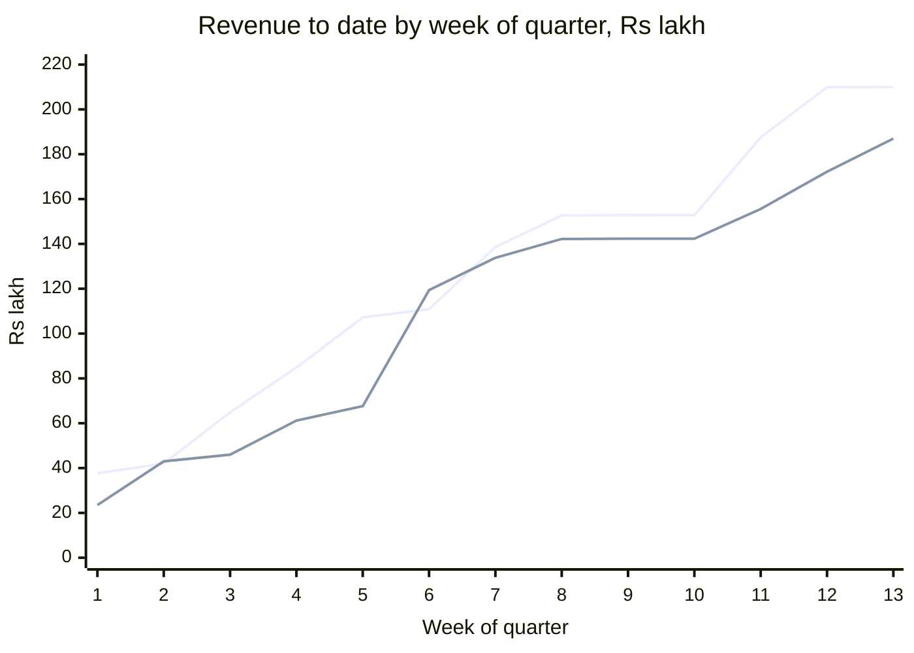
```mermaid
xychart-beta
    title "Revenue to date by week of quarter, Rs lakh"
    x-axis "Week of quarter" [1, 2, 3, 4, 5, 6, 7, 8, 9, 10, 11, 12, 13]
    y-axis "Rs lakh" 0 --> 220
    line [37.7, 42.0, 64.9, 84.8, 107.2, 110.9, 138.6, 152.7, 152.8, 152.9, 187.5, 209.9, 210.0]
    line [23.5, 43.0, 46.0, 61.2, 67.6, 119.4, 133.8, 142.2, 142.3, 142.3, 155.6, 172.2, 187.0]
```

Q1 ends at Rs 210.0 lakh and Q2 at Rs 187.0 lakh. At week 11, Q2 stood at Rs 155.6 lakh, which is the tile.

```notes
LIVE, 4 minutes. The notebook draws the same picture with kit.line and shows the cut. The first
line is Q1 and the second is Q2. The steps show that revenue arrives in lumps: weeks where a large
order lands jump, and weeks without one are flat. That lumpiness is why the harder variant later
gives a different number from the per-week rate.
```

---

## S14. Question: the fair change between the quarters
*Both quarters have now closed, so both can be compared whole.*

```stats
value: Rs 2,10,00,000 | label: Q1, closed | note: 13 weeks, 114 orders
value: Rs 1,87,00,000 | label: Q2, closed | note: 13 weeks, 86 orders
```

**Question.** Predict the change: a) down 25.9 percent; b) down 11.0 percent; c) down 24.6 percent; d) flat, once the weeks match.

```notes
LIVE, 2 minutes. Option c is the fall in orders, 114 to 86, which a hurried learner reads as the
fall in revenue. Take letters and run the cell.
```

---

## S15. Answer: down 11.0 percent, Rs 23,00,000 less
*The drop is real, and it is less than half of what the tile said.*

| Comparison | Q1 | Q2 | Change |
|---|---|---|---|
| Closed quarters, totals | Rs 2,10,00,000 | Rs 1,87,00,000 | -11.0% |
| Per day, 91 against 92 days | Rs 2,30,769 | Rs 2,03,261 | -11.9% |
| Per week, Q1 against the tile | Rs 16,15,385 | Rs 14,14,541 | -12.4% |

**The fix.** Once a quarter has closed, compare closed quarters. A rate per week rescues a cut window, and it carries its numerator, its denominator and its window.

```notes
LIVE, 4 minutes. The answer is b. Say the fix in rupees: the real fall is Rs 23,00,000, and the tile
said Rs 54,40,050. Walk the per-week row as a rate: Rs 2,10,00,000 over 13 weeks, Rs 1,55,59,950
over 11 weeks. A rate without its denominator is a rumour; write "per week, 13 weeks" beside it.
Say once: every number today is on the export as it stands, and tomorrow's work checks that export.
```

---

## S16. Question: the same 11 weeks of each quarter
*Q1 up to 16 June against Q2 up to 15 September, both 11 weeks long.*

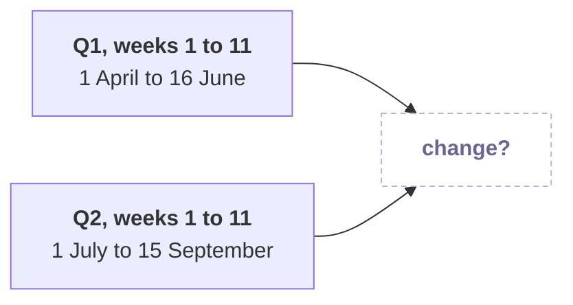
```mermaid
flowchart LR
    A["<b>Q1, weeks 1 to 11</b><br/>1 April to 16 June"] --> C["<b>change?</b>"]
    B["<b>Q2, weeks 1 to 11</b><br/>1 July to 15 September"] --> C
    classDef unknown fill:#FFFFFF,stroke:#B8B2D6,color:#6B6690,stroke-dasharray:4 3
    class C unknown
```

**Question.** The room runs it in notebook 01. Before you run it, predict: a) down 12.4 percent, the same as per week; b) down 17.0 percent; c) down 11.0 percent; d) down 25.9 percent.

```notes
LIVE, 10 minutes: 8 for the room to run it, 2 to collect letters. This is the harder variant, the
room's own run. Pairs filter Q1 to order_date on or before 2026-06-16 and total it. Circulate and
listen for pairs who reuse the per-week figure without running anything.
```

---

## S17. Answer: down 17.0 percent over the same 11 weeks
*Matched weeks and the per-week rate disagree, because large orders land unevenly.*

| Window | Revenue | Orders |
|---|---|---|
| Q1, weeks 1 to 11 | Rs 1,87,51,440 | 97 |
| Q2, weeks 1 to 11 | Rs 1,55,59,950 | 70 |
| Change | -17.0% | -27.8% |

**The rule.** A quarter-to-date comparison uses the same weeks of both quarters. Once the quarter closes, the closed quarters replace it, because a few large Business orders can land in week 12 as easily as in week 3.

```notes
LIVE, 4 minutes. The answer is b. The per-week rate assumes revenue arrives evenly, and the
cumulative chart showed it does not: Q1 jumps from Rs 152.9 lakh to Rs 187.5 lakh in week 11
alone. Three numbers now describe one drop: -11.0, -12.4 and -17.0 percent. The honest one for
Meera is the closed quarters, because both are complete.
```

---

## S18. Kavya's review of round 1
*Rung 1 holds: the drop is real, and it is 11.0 percent.*

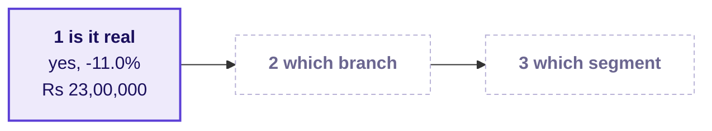
```mermaid
flowchart LR
    R1["<b>1 is it real</b><br/>yes, -11.0%<br/>Rs 23,00,000"] --> R2["<b>2 which branch</b>"]
    R2 --> R3["<b>3 which segment</b>"]
    classDef known fill:#EEEAFB,stroke:#5B3FD6,color:#1A0F5C,stroke-width:2px
    classDef unknown fill:#FFFFFF,stroke:#B8B2D6,color:#6B6690,stroke-dasharray:4 3
    class R1 known
    class R2,R3 unknown
```

**Kavya's review.** "Before you explain a fall, prove it with matching windows. Put the dates next to the number, every time."

**In the interview.** [F] What has to match before a quarter-on-quarter comparison is fair?

```notes
LIVE, 3 minutes. One breath for the interview answer: the window's length and its dates, the
definition of the metric, and the population counted; then say you would compare closed quarters
or a rate over the same weeks. Transition: the drop is real, so which branch of the tree moved?
```

---

## SECTION 3: Round 2, which branch moved
*The tree meets both quarters, and one branch carries the fall while the one Marketing wants to fund stays flat.*

```notes
LIVE. Round 2 runs 50 minutes. Switch to notebooks/C2_W01_D02_02_which_branch_STUDENT.ipynb.
```

---

## S19. Marketing bets on customers; Meera wants proof
*Three branches, one of them already funded in Marketing's head.*

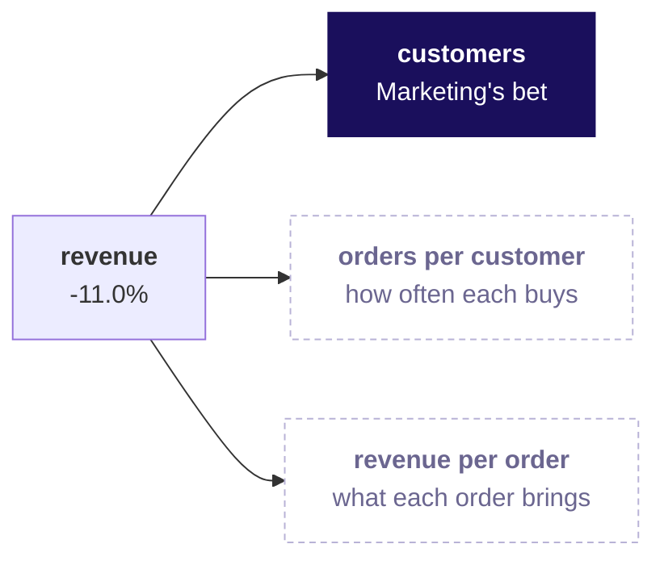
```mermaid
flowchart LR
    R["<b>revenue</b><br/>-11.0%"] --> C["<b>customers</b><br/>Marketing's bet"]
    R --> F["<b>orders per customer</b><br/>how often each buys"]
    R --> O["<b>revenue per order</b><br/>what each order brings"]
    classDef bet fill:#1A0F5C,stroke:#1A0F5C,color:#FFFFFF
    classDef unknown fill:#FFFFFF,stroke:#B8B2D6,color:#6B6690,stroke-dasharray:4 3
    class C bet
    class F,O unknown
```

**The client asks.** "Are we losing customers, or are the ones we have buying less?"

```notes
LIVE, 3 minutes. The round's question is Meera's, word for word. Ask the room to predict which
branch moved before any code runs, and write the guesses on the board. They come back at the end
of the round.
```

---

## S20. Group by key with a dictionary accumulator
*One pass over the orders fills a total for every quarter at once.*

```python
revenue_by_q = {}
for order in ORDERS:
    q = order["quarter"]
    revenue_by_q[q] = revenue_by_q.get(q, 0) + order["amount"]
print(revenue_by_q)   # {'Q1': 21000000, 'Q2': 18700000}
```

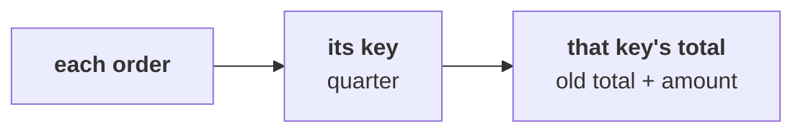
```mermaid
flowchart LR
    O["<b>each order</b>"] --> K["<b>its key</b><br/>quarter"] --> T["<b>that key's total</b><br/>old total + amount"]
```

```notes
LIVE, 5 minutes. Monday's accumulator, with one change: a dictionary holds one total per key.
get(q, 0) is a decision, and here it is the right one: a quarter with no orders yet has summed to
zero. Keep that sentence; the discount branch will test whether zero is always the right default.
Have the room type it, then change the key to segment and back.
```

---

## S21. Step 2: count orders and customers per quarter
*Orders are rows; customers are distinct ids, counted with Monday's seen list.*

```python
customers = {"Q1": [], "Q2": []}
for order in ORDERS:
    q, cid = order["quarter"], order["customer_id"]
    if cid not in customers[q]:
        customers[q].append(cid)
print(len(customers["Q1"]), len(customers["Q2"]))
```

| Quarter | Orders | Customers |
|---|---|---|
| Q1 | 114 | 69 |
| Q2 | 86 | ? |

```notes
LIVE, 4 minutes. Type it and run it only for Q1. Q2's customer count is the next slide's
prediction, so cover the output or run the Q1 half alone.
```

---

## S22. Question: how many customers bought in Q2
*Orders fell from 114 to 86, and Marketing says customers are the problem.*

```stats
value: 69 | label: Q1 customers | note: distinct ids, 1 April to 30 June
value: 86 | label: Q2 orders | note: down from 114
```

**Question.** Predict Q2's customer count: a) 52, since orders fell by a quarter; b) 69; c) 81; d) 86.

```notes
LIVE, 2 minutes. Option d is the rows-as-customers trap from Monday. Option a is Marketing's story
carried through. Take letters, then run the cell.
```

---

## S23. Answer: 69 customers in both quarters
*The branch Marketing wants to fund did not move.*

```stats
value: 69 | label: Q1 customers | note: 114 orders
value: 69 | label: Q2 customers | note: 86 orders
value: 0.0% | label: change in customers | note: the acquisition branch
```

**The claim.** Customers held at 69, so the fall sits in how often they buy or in what each order brings.

```notes
LIVE, 3 minutes. The answer is b. Let the silence land: Marketing's branch is flat. Do not go
further than the count today. Whether these are the same 69 people is a sharper question that
the afternoon answers; a flat count alone does not prove nobody left.
```

---

## S24. The tree says frequency moved and order value rose
*Customers flat, orders per customer down a quarter, revenue per order up.*

| Branch | Q1 | Q2 | Change |
|---|---|---|---|
| Customers | 69 | 69 | 0.0% |
| Orders per customer | 1.65 (114 over 69) | 1.25 (86 over 69) | -24.6% |
| Revenue per order | Rs 1,84,211 | Rs 2,17,442 | +18.0% |
| Revenue | Rs 2,10,00,000 | Rs 1,87,00,000 | -11.0% |

**The check.** The branches multiply back to revenue: 1.000 times 0.754 times 1.180 is 0.890, and Rs 1.87 crore over Rs 2.10 crore is 0.890.

```notes
LIVE, 5 minutes. Fill the tree on the board with these numbers. The product check is the proof
that the decomposition is complete: if it does not multiply back, a branch is missing. Revenue per
customer went from Rs 3,04,348 to Rs 2,71,014, which is the two lower branches together.
Leave revenue per order rising for the afternoon: whether prices went up is a trap of its own.
```

---

## S25. In rupees, frequency cost Rs 51.6 lakh
*The revenue bridge moves one branch at a time from Q1 to Q2.*

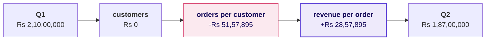
```mermaid
flowchart LR
    A["<b>Q1</b><br/>Rs 2,10,00,000"] --> B["<b>customers</b><br/>Rs 0"]
    B --> C["<b>orders per customer</b><br/>-Rs 51,57,895"]
    C --> D["<b>revenue per order</b><br/>+Rs 28,57,895"]
    D --> E["<b>Q2</b><br/>Rs 1,87,00,000"]
    classDef bad fill:#FBE9EF,stroke:#D63A6A,color:#1A0F5C
    classDef known fill:#EEEAFB,stroke:#5B3FD6,color:#1A0F5C,stroke-width:2px
    class C bad
    class D known
```

Frequency lost 28 orders at Q1's Rs 1,84,211 each; the remaining 86 orders each brought Rs 33,231 more.

```notes
LIVE, 4 minutes. The notebook draws this with kit.bridge. Walk the arithmetic: 69 customers times
the change in orders per customer is 28 fewer orders, times Q1's revenue per order is Rs 51,57,895.
Then 86 orders times Rs 33,231 is Rs 28,57,895. The two sum to the Rs 23,00,000 fall.
```

---

## S26. The discount branch stops on a KeyError
*Some orders carry no discount field, so asking for it by name stops the loop.*

```python
given = 0
for order in ORDERS:
    given += order["discount"]
```

```text
KeyError: 'discount'
```

```notes
LIVE, 2 minutes, and no more. This is a runtime error: read the last line, which names the key,
and move on. The notebook shows it with kit.expect_error. try/except is one way through and
appears in the notebook in passing; the decision that matters is on the next slide, and it is what
to do about the orders without the field.
```

---

## S27. The wrong answer: discounts fell 8.0 percent
*Reading a missing discount as zero gives a total, a story and a decision.*

```python
given = 0
for order in quarter_rows:
    given += order.get("discount", 0)
```

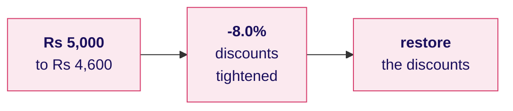
```mermaid
flowchart LR
    A["<b>Rs 5,000</b><br/>to Rs 4,600"] --> B["<b>-8.0%</b><br/>discounts<br/>tightened"]
    B --> C["<b>restore</b><br/>the discounts"]
    classDef bad fill:#FBE9EF,stroke:#D63A6A,color:#1A0F5C
    class A,B,C bad
```

```notes
LIVE, 4 minutes. This is the round's trap. The hurried fix silences the error, and the story
writes itself: discounts fell 8.0 percent, members pulled back, so restore the discounts. Name the
decision it would mislead. Ask what the zero means: did the order get no discount, or did nobody
record one? Nobody in the room can say, and that is the lesson.
```

---

## S28. Why it is wrong: an absent field is unknown
*Three invented orders show what reading absent as zero does to an average.*

| Invented order | Discount field | Read as zero | Recorded only |
|---|---|---|---|
| A | Rs 100 | Rs 100 | Rs 100 |
| B | Rs 0 | Rs 0 | Rs 0 |
| C | absent | Rs 0 | left out |
| Average | | Rs 33 | Rs 50 |

**What breaks.** Read as zero, every unrecorded order pulls the average down, and the total becomes a floor that nobody labelled as one.

```notes
LIVE, 3 minutes. These three orders are invented to show the mechanism. Order B is a real zero:
someone recorded that no discount was given. Order C is unknown. The two are different facts, and
get with a default of zero erases the difference.
```

---

## S29. Question: the average where a discount is recorded
*Q1 averages Rs 60.98 per order that records one; predict Q2.*

```stats
value: Rs 43.86 | label: Q1, absent read as zero | note: per order
value: Rs 53.49 | label: Q2, absent read as zero | note: per order
value: Rs 60.98 | label: Q1, recorded only | note: per order that records it
```

**Question.** Predict Q2's average over orders that record a discount: a) Rs 53.49, the same; b) Rs 46.00, down; c) Rs 60.98, flat; d) Rs 76.67, up.

```notes
LIVE, 3 minutes. Before running, the room counts the orders that record the field in each quarter
in the empty your-turn cell of notebook 02. Nobody reads a count aloud; each learner has their own.
Then take letters.
```

---

## S30. Answer: up 25.7 percent, the opposite direction
*Counted where it is recorded, the average discount rose.*

| Reading | Q1 | Q2 | Change |
|---|---|---|---|
| Total, absent read as zero | Rs 5,000 | Rs 4,600 | -8.0% |
| Average, absent read as zero | Rs 43.86 | Rs 53.49 | up |
| Average, recorded only | Rs 60.98 | Rs 76.67 | +25.7% |

**The check.** Count the orders that record the field, and average only over those; then say how many orders the average rests on.

```notes
LIVE, 3 minutes. The answer is d. The total fell because fewer Q2 orders exist and some carry no
field; where discounts were recorded, they got larger. The story and its decision flipped. Ask a
learner to say the count they found and what it means for how far to trust any discount figure.
```

---

## S31. The fix: write the default, then bound the branch
*The largest recorded discount caps what this branch could possibly explain.*

```stats
value: Rs 150 | label: largest recorded discount | note: on any order in the file
value: Rs 12,900 | label: the most Q2 could give | note: 86 orders at Rs 150 each
value: Rs 23,00,000 | label: the fall to explain | note: Q1 to Q2
```

**The fix.** "Absent means not recorded; reported separately; never summed as zero." Even at Rs 150 on every Q2 order, discounts could explain Rs 12,900 of a Rs 23,00,000 fall, so the discount branch did not move revenue.

```notes
LIVE, 4 minutes. Two moves. First, the decision is written down beside the number, with its
reason. Second, a bound: when a branch is uncertain, ask how large it could possibly be. Here the
worst case is under one percent of the fall, so the branch closes without anyone guessing.
```

---

## S32. Question: the tree on delivered orders only
*Anand counts only delivered orders; does the story survive his definition?*

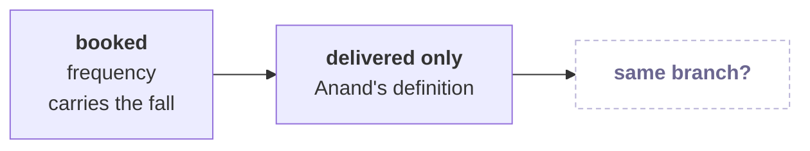
```mermaid
flowchart LR
    A["<b>booked</b><br/>frequency<br/>carries the fall"] --> B["<b>delivered only</b><br/>Anand's definition"]
    B --> C["<b>same branch?</b>"]
    classDef unknown fill:#FFFFFF,stroke:#B8B2D6,color:#6B6690,stroke-dasharray:4 3
    class C unknown
```

**Question.** Run the tree on delivered orders in notebook 02, then say which branch carries the fall: a) customers; b) orders per customer; c) revenue per order; d) no branch, the fall disappears.

```notes
LIVE, 12 minutes: 10 for the room's run, 2 to collect. This is the harder variant. Pairs add one
filter, status equal to delivered, to both quarters and rebuild all three branches. Watch for pairs
who filter one quarter and forget the other.
```

---

## S33. Answer: frequency still carries the fall
*On delivered orders, fewer customers appear, and orders per customer still falls hardest.*

| Branch, delivered only | Q1 | Q2 | Change |
|---|---|---|---|
| Revenue | Rs 1,45,04,970 | Rs 1,28,64,680 | -11.3% |
| Customers | 54 | 50 | -7.4% |
| Orders per customer | 1.50 | 1.14 | -24.0% |
| Revenue per order | Rs 1,79,074 | Rs 2,25,696 | +26.0% |

**Kavya's review.** "The branch that moved is orders per customer, on booked and on delivered. A definition change that leaves the answer standing makes the answer stronger."

```notes
LIVE, 4 minutes. The answer is b. Customers do dip on this definition, and a sharp learner will
say so; the dip is smaller than the fall in frequency, which survives both definitions.
Interview questions for this round: [S] Why is a rate without a denominator meaningless? [S] A
field is missing on some records; do you fill it with zero? One breath each, in the day sheet.
Break for 10 minutes after this slide.
```

---

## SECTION 4: Round 3, every kind of customer
*The same tree for every segment and quarter means writing it once, as a function that returns its answer.*

```notes
LIVE. Round 3 runs 50 minutes after the break. Switch to
notebooks/C2_W01_D02_03_which_segment_STUDENT.ipynb.
```

---

## S34. Is the fall in every kind of customer
*Four segments, two quarters, and the head of Retail-Plus asking about his tier.*

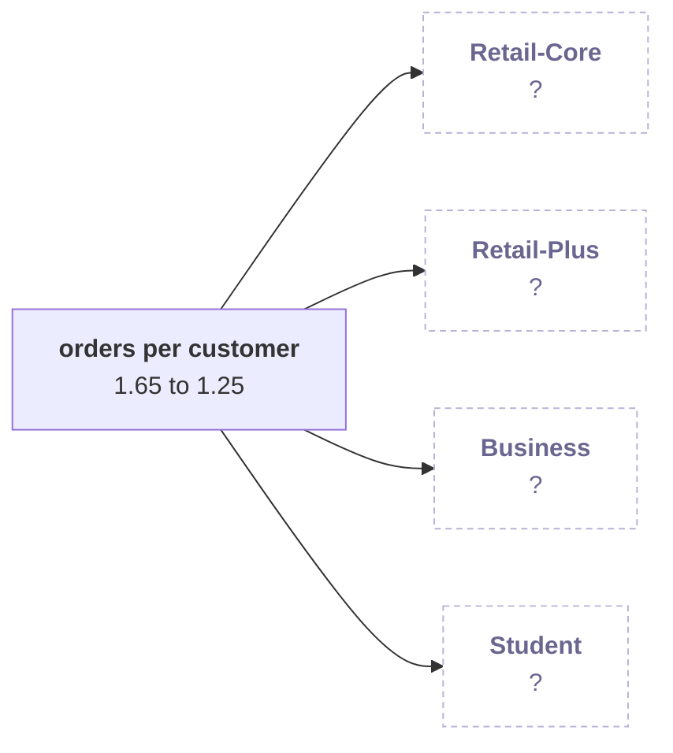
```mermaid
flowchart LR
    T["<b>orders per customer</b><br/>1.65 to 1.25"] --> A["<b>Retail-Core</b><br/>?"]
    T --> B["<b>Retail-Plus</b><br/>?"]
    T --> C["<b>Business</b><br/>?"]
    T --> D["<b>Student</b><br/>?"]
    classDef unknown fill:#FFFFFF,stroke:#B8B2D6,color:#6B6690,stroke-dasharray:4 3
    class A,B,C,D unknown
```

**The client asks.** The head of Retail-Plus wants to know whether his tier is the one slipping, and Meera wants to know whether it is everyone.

```notes
LIVE, 2 minutes. Eight trees are needed: four segments, two quarters. Ask how many times the room
wants to paste the round 2 code. Nobody does, which is why functions arrive now.
```

---

## S35. A function applies one decision everywhere
*tree_for takes any group of orders and returns the whole tree for it.*

```python
def tree_for(rows):
    revenue, ids = 0, []
    for order in rows:
        revenue += order["amount"]
        if order["customer_id"] not in ids:
            ids.append(order["customer_id"])
    return {"revenue": revenue, "orders": len(rows),
            "customers": len(ids),
            "orders_per_customer": len(rows) / len(ids),
            "revenue_per_order": revenue / len(rows)}
```

```notes
LIVE, 6 minutes. Build it line by line with the room. Name the parts: def, the parameter rows, the
body, and return, which hands the dictionary back to whoever called it. One definition of a
customer now lives in one place, so a change to it changes every segment and quarter together.
```

---

## S36. A function that prints hands back None
*Printing shows a number to you; returning hands it to the next line of code.*

```python
def orders_per_customer(rows):
    print(len(rows) / count_customers(rows))

result = orders_per_customer(q1_rows)   # 1.6521739130434783 is printed
print(result)                           # None
```

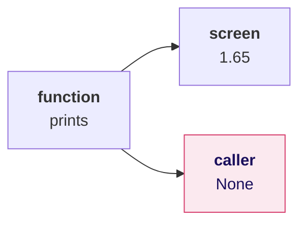
```mermaid
flowchart LR
    F["<b>function</b><br/>prints"] --> S["<b>screen</b><br/>1.65"]
    F --> R["<b>caller</b><br/>None"]
    classDef bad fill:#FBE9EF,stroke:#D63A6A,color:#1A0F5C
    class R bad
```

```notes
LIVE, 3 minutes, in passing. A function with no return hands back None. It looks right on screen
and breaks the next step silently. Keep this in mind for the afternoon: a colleague's helper will
test it. Interview question [F] lives here: why does a function that prints instead of returning
break a pipeline?
```

---

## S37. Step 3: tree_for reproduces round 2
*Before trusting the function on segments, run it where the answer is known.*

| tree_for on | Orders | Customers | Orders per customer | Revenue per order |
|---|---|---|---|---|
| All of Q1 | 114 | 69 | 1.65 | Rs 1,84,211 |
| All of Q2 | 86 | 69 | 1.25 | Rs 2,17,442 |

**The check.** A new function earns trust by reproducing a number you already proved another way.

```notes
LIVE, 3 minutes. The notebook's check cell compares these to round 2's numbers and passes. This is
the habit: test the function where you know the answer, then use it where you do not.
```

---

## S38. describe gives each group a typical value and spread
*The median, the smallest, the largest and the range, returned as one dictionary.*

```python
def describe(amounts):
    s = sorted(amounts)
    n = len(s)
    if n % 2 == 1:
        median = s[n // 2]
    else:
        median = (s[n // 2 - 1] + s[n // 2]) / 2
    return {"median": median, "min": s[0], "max": s[-1],
            "range": s[-1] - s[0]}
```

```notes
LIVE, 4 minutes. Monday's median by hand, now inside a function. Anand's warning returns: one
large Business order can move an average, so each group gets a typical value and its spread,
never a mean alone.
```

---

## S39. Step 4: two segments, both quarters
*Retail-Core and Business, run through tree_for.*

| Segment, quarter | Orders | Customers | Orders per customer | Revenue |
|---|---|---|---|---|
| Retail-Core, Q1 | 38 | 34 | 1.12 | Rs 80,460 |
| Retail-Core, Q2 | 36 | 34 | 1.06 | Rs 72,510 |
| Business, Q1 | 20 | 11 | 1.82 | Rs 2,07,71,180 |
| Business, Q2 | 17 | 11 | 1.55 | Rs 1,85,41,460 |

Two segments run here, and the other two are yours in the last run of the round.

```notes
LIVE, 5 minutes. Two calls per segment, one per quarter. Retail-Core barely moves in frequency;
Business falls from 1.82 to 1.55. Business revenue is almost all of the company's revenue, which
is why its three lost orders matter in rupees. Do not run Retail-Plus or Student on the projector.
```

---

## S40. Question: what did Business orders look like in Q2
*Q1's median Business order was Rs 9,83,780, with a range of Rs 15,80,940.*

```stats
value: Rs 9,83,780 | label: Q1 median | note: Business, 20 orders
value: Rs 15,80,940 | label: Q1 range | note: Rs 2,03,060 to Rs 17,84,000
```

**Question.** Predict describe for Business in Q2: a) the median and the range both fall; b) the median barely moves and the range nearly doubles; c) the median doubles; d) nothing changes.

```notes
LIVE, 2 minutes. Take letters, then run describe on Business Q2.
```

---

## S41. Answer: the median held, one order doubled the range
*A typical Business order barely changed; one large order stretched the spread.*

| describe | Median | Min | Max | Range |
|---|---|---|---|---|
| Retail-Core, Q1 | Rs 2,325 | Rs 860 | Rs 3,000 | Rs 2,140 |
| Retail-Core, Q2 | Rs 2,080 | Rs 890 | Rs 2,950 | Rs 2,060 |
| Business, Q1 | Rs 9,83,780 | Rs 2,03,060 | Rs 17,84,000 | Rs 15,80,940 |
| Business, Q2 | Rs 9,52,000 | Rs 2,17,000 | Rs 29,45,460 | Rs 27,28,460 |

**The claim.** Business orders are the same size as before, and fewer of them; one order of Rs 29,45,460 is the outlier to name.

```notes
LIVE, 3 minutes. The answer is b. A mean would have hidden this: the one large order lifts it
while the typical order fell slightly. Sorted values in the notebook show the order sitting alone
at the top.
```

---

## S42. The wrong answer: frequency fell only 6.0 percent
*Averaging the four segments' orders per customer gives a softer story.*

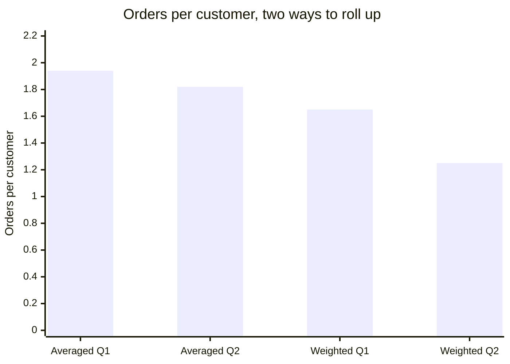
```mermaid
xychart-beta
    title "Orders per customer, two ways to roll up"
    x-axis ["Averaged Q1", "Averaged Q2", "Weighted Q1", "Weighted Q2"]
    y-axis "Orders per customer" 0 --> 2.2
    bar [1.94, 1.82, 1.65, 1.25]
```

**What breaks.** Averaged, the four segments say 1.94 to 1.82, a fall of 6.0 percent: "frequency is not the branch, and Marketing may be right".

```notes
LIVE, 4 minutes. This is the round's trap. The room computes each segment's orders per customer,
adds the four and divides by four. The average is correct arithmetic and the wrong question. Do
not show the per-segment rows; only the two averages and the weighted figures appear. Name the
decision it would mislead: the acquisition budget goes back on the table.
```

---

## S43. Why it is wrong: each group counts once
*Thirty invented customers and two invented customers get the same vote.*

| Invented group | Customers | Orders per customer | Orders |
|---|---|---|---|
| Large | 30 | 1.1 | 33 |
| Small | 2 | 3.5 | 7 |
| Average of the two | | 2.30 | |
| Weighted, 40 over 32 | 32 | 1.25 | 40 |

**The check.** The roll-up must reproduce the company figure from round 2, 1.65 and 1.25, and the averaged one does not.

```notes
LIVE, 3 minutes. The invented example shows the mechanism: two small-group customers pull the
average towards their rate. In the real file Student has 2 customers and Retail-Core has 34, and
each counts once in the average of averages.
```

---

## S44. Question: which roll-up reproduces the company
*Two ways to turn four segments into one orders-per-customer figure.*

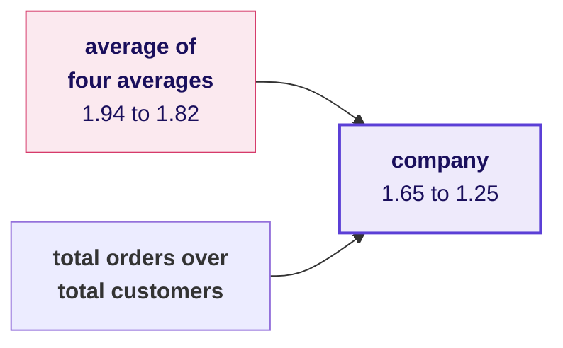
```mermaid
flowchart LR
    A["<b>average of<br/>four averages</b><br/>1.94 to 1.82"] --> Q["<b>company</b><br/>1.65 to 1.25"]
    B["<b>total orders over<br/>total customers</b>"] --> Q
    classDef bad fill:#FBE9EF,stroke:#D63A6A,color:#1A0F5C
    classDef known fill:#EEEAFB,stroke:#5B3FD6,color:#1A0F5C,stroke-width:2px
    class A bad
    class Q known
```

**Question.** Which roll-up reproduces 1.65 and 1.25: a) the average of the four averages; b) total orders over total customers; c) the median of the four; d) the largest segment's figure.

```notes
LIVE, 2 minutes. Take letters. Most rooms are ready for b by now; ask one learner why.
```

---

## S45. Answer: weighted, frequency fell 24.6 percent
*Total orders over total customers gives the company figure back.*

```stats
value: 1.94 to 1.82 | label: averaged averages | note: -6.0%, the wrong roll-up
value: 1.65 to 1.25 | label: weighted by customers | note: -24.6%, the company figure
```

**The fix.** Roll a rate up with its weights: 114 orders over 69 customers, then 86 over 69. The fall is 24.6 percent, and frequency is the branch.

```notes
LIVE, 3 minutes. The answer is b. The weighted figure is round 2's number, which is the proof.
Interview question [F]: you have orders per customer for four segments; why can't you average them
for the company figure? One breath: each segment's rate is weighted by its customers, and an
average gives two customers the same vote as thirty-four.
```

---

## S46. Your run: all four segments, both quarters
*tree_for and describe on every segment, and one sentence to the head of Retail-Plus.*

```timeline
label: Step 1 | title: Four segments in | body: Group the orders by segment and by quarter with a dictionary.
label: Step 2 | title: Four rows out | body: Call tree_for on each group, and count the rows that come back.
label: Step 3 | title: Weighted roll-up | body: Check that the segments reproduce 1.65 and 1.25.
label: Step 4 | title: One sentence | body: Name the segment whose orders per customer moved most, with its numbers. | tone: dark
```

```notes
LIVE, 15 minutes. The room's harder variant, in the empty your-turn cells of notebook 03. The
trainer does not run it on the projector and does not confirm any segment aloud. Walk the room.
Listen for pairs who count four groups in and four rows out; the afternoon's helper tests exactly
that habit. Collect two sentences read aloud without comment; the afternoon opens on them.
```

---

## S47. Kavya's review of round 3
*Three rungs climbed, and the morning ends with a segment in your own notebook.*

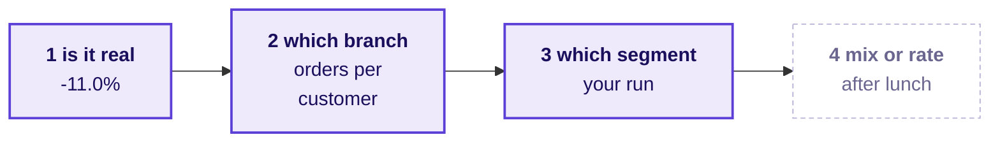
```mermaid
flowchart LR
    R1["<b>1 is it real</b><br/>-11.0%"] --> R2["<b>2 which branch</b><br/>orders per<br/>customer"]
    R2 --> R3["<b>3 which segment</b><br/>your run"]
    R3 --> R4["<b>4 mix or rate</b><br/>after lunch"]
    classDef known fill:#EEEAFB,stroke:#5B3FD6,color:#1A0F5C,stroke-width:2px
    classDef unknown fill:#FFFFFF,stroke:#B8B2D6,color:#6B6690,stroke-dasharray:4 3
    class R1,R2,R3 known
    class R4 unknown
```

**Kavya's review.** "A function returns its answer; count the groups in and the groups out. Roll a rate up with its weights."

**In the interview.** [F] Why does a function that prints instead of returning break a pipeline?

```notes
LIVE, 2 minutes, then lunch. One breath: the caller receives None, the next step either crashes
or silently drops that group, and nobody sees it because the screen looked right. Transition to
the afternoon: Meera escalates the case, and a colleague's helper is waiting in it.
```
