# Which branch moved

Week 1, Day 2. Half one.

Kicker: WEEK 1  ·  TUESDAY  ·  HALF ONE
Quote: Are we losing customers, or are the ones we have buying less? Marketing says more customers. Prove it or disprove it.
Who: Meera Raghavan, CEO, Kalpa Retail, replying to Monday's numbers

```notes
LIVE, one minute. Read Meera's reply aloud and leave it on screen while the room settles. Monday
drew the tree; today the tree meets two quarters of orders, and the question is which branch moved.
The morning runs three rounds on one case, each harder than the last, and the afternoon escalates it.
```

---

## SECTION 1: The ask, the system and the ladder
*Three voices, one drop, and the thinking drawn before any code: what each branch costs, where a fake drop is made, and the order an analyst climbs.*

```notes
LIVE. This chapter runs 20 minutes and opens no notebook. Seven slides at about three minutes
each. Its job is to put the money, the owners, the machinery and the ladder on the board, so every
round after it has something to stand on.
```

---

## S1. Meera wants to know which branch moved
*Q2 came in below Q1, and she names the two branches she suspects.*

**The client asks.** "So revenue is customers, times how often they buy, times basket, times price. Now: which of those moved? Q2 was Rs 1.9 crore, Q1 was 2.1. Are we losing customers, or are the ones we have buying less? Marketing says more customers. Prove it or disprove it."

```stats
value: Rs 2.1 cr | label: Q1, April to June | note: as Meera remembers it
value: Rs 1.9 cr | label: Q2, July to September | note: as Meera remembers it
value: Rs 12 cr | label: waiting on the answer | note: Marketing's acquisition ask
```

Kalpa Retail India's financial year opens in April, so Q1 is April to June and Q2 is July to September of 2026-27.

```notes
LIVE, 3 minutes. Read the message aloud. Meera has done Monday's work in her head: she says the
tree back to us. Her figures are rounded and from memory; the file gives exact ones. The quarters
follow the April-to-March financial year the extract is cut on, so Q1 and Q2 are consecutive
quarters, which matters in round 1: consecutive quarters carry different seasons.
Ask which number worries her most. The Rs 12 crore: it is about to be spent on an unchecked branch.
```

---

## S2. Three voices, three incentives, one set of numbers
*Each stakeholder owns a lever, so the decomposition decides whose problem the fall is.*

```cards
icon: user-round | eyebrow: The CEO | title: Meera Raghavan | body: Owns the budget. Wants the branch that moved before she funds any lever, and a sentence she can repeat to the board.
icon: crown | eyebrow: The paid tier | title: The head of Retail-Plus | body: Owns member experience. Forwards a complaint that the app's reorder feature has been broken for six weeks, and asks whether his tier is slipping.
icon: megaphone | eyebrow: Acquisition | title: The marketing lead | body: Owns new customers. Has a slide showing revenue falling by a quarter, and an answer already: more customers. | tone: dark
```

**Your role.** The team works for the number, and each voice gets the same one. A branch that moved hands the problem to the person who owns that lever; a branch that stayed flat takes a budget off the table.

```notes
LIVE, 3 minutes. Name the incentive behind each voice without judging it. Marketing is paid to
acquire, so it reads every fall as an acquisition problem; that is how the role is paid, and it says nothing about good faith. The
head of Retail-Plus wants a verdict on his tier; do not give him one this morning, his question
returns after lunch. Anand Iyer, Finance, is listening too: he will ask whether our numbers match
his books, and tomorrow he will.
```

---

## S3. What each branch costs to move, and who pays
*The row's economics: every branch has a lever, an owner and a price, and they are not the same price.*

| Branch | The lever | Who owns it | What moving it costs |
|---|---|---|---|
| Customers | Acquisition campaigns | The marketing lead | Marketing spend, before any repeat order |
| Orders per customer | Retention, reminders, reorder | Tier and product owners | Service and product work on people already won |
| Revenue per order | Range, bundles, basket | Merchandising | Assortment and margin decisions |
| Price and discounts | Price lists, offers | Finance with Marketing | Volume at risk, or margin given away |

**The outside view.** Harvard Business Review (Gallo, 2014): depending on the study and the industry, acquiring a new customer costs 5 to 25 times more than retaining one; Bain's Reichheld found a 5 percent rise in retention lifting profits 25 to 95 percent.

```notes
LIVE, 4 minutes. The cost list is the curriculum row's own: acquisition costs marketing, frequency
costs retention, basket costs merchandising, price risks volume, discounts trade margin for
quantity. The HBR figures are published estimates across industries, and Kalpa has none of its own yet; say so.
Their use today: if the fall sits in frequency, the cheaper lever is on the table and the Rs 12
crore is aimed at the wrong branch. That is why the decomposition matters in rupees.
Source: HBR, "The Value of Keeping the Right Customers", Amy Gallo, 29 Oct 2014.
```

---

## S4. Question: what could manufacture a drop?
*Before anyone explains a fall, the room lists what could make one appear when the business had none.*

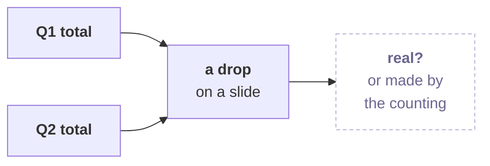
```mermaid
flowchart LR
    A["<b>Q1 total</b>"] --> D["<b>a drop</b><br/>on a slide"]
    B["<b>Q2 total</b>"] --> D
    D --> Q["<b>real?</b><br/>or made by<br/>the counting"]
    classDef unknown fill:#FFFFFF,stroke:#B8B2D6,color:#6B6690,stroke-dasharray:4 3
    class Q unknown
```

**Question.** In pairs, two minutes: name three places between a customer's checkout and a dashboard tile where a fall could be created that the business never had.

```notes
LIVE, 4 minutes. Two minutes in pairs, then collect answers on the board. Expect "different lengths
of time", "different definition of sales", "missing values", "one huge order". Push for places in
the system as well as in the arithmetic: where the data is written, moved and summarised. Keep every
answer; the next slide places them on the map.
```

---

## S5. Answer: a fake drop has an address in the pipeline
*Every number on a dashboard passed through four hands, and each hand can manufacture a fall.*

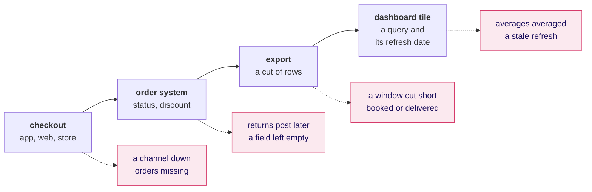
```mermaid
flowchart LR
    C["<b>checkout</b><br/>app, web, store"] --> O["<b>order system</b><br/>status, discount"]
    O --> E["<b>export</b><br/>a cut of rows"]
    E --> T["<b>dashboard tile</b><br/>a query and<br/>its refresh date"]
    C -.-> F1["a channel down<br/>orders missing"]
    O -.-> F2["returns post later<br/>a field left empty"]
    E -.-> F3["a window cut short<br/>booked or delivered"]
    T -.-> F4["averages averaged<br/>a stale refresh"]
    classDef bad fill:#FBE9EF,stroke:#D63A6A,color:#1A0F5C
    class F1,F2,F3,F4 bad
```

**The rule.** Find the hop a number came through before you explain it. Today's traps live at three of these addresses: the window, the empty field and the roll-up.

```notes
LIVE, 3 minutes. Place the room's answers on the four hops. The fifth way, a few very large orders,
is not a system fault at all: it is the business being lumpy, and it returns in rounds 1 and 3.
Round 1 is the export and the tile; round 2 is the order system's empty field; round 3 is the
dashboard's roll-up. Engineers in a GCC are asked this constantly: the drop sat in a
pipeline while the market held. Checking the pipeline first is the cheapest investigation there is.
```

---

## S6. The ladder, and what each rung needs
*Five rungs climbed in order, each with the data it needs and the trap it guards.*

| Rung | The question | What it needs from the data | The trap it guards today |
|---|---|---|---|
| 1 | Is the drop real? | Both windows' dates, one definition | Quarters of unequal length |
| 2 | Which branch moved? | Customers, orders, revenue per quarter | An empty field read as zero |
| 3 | Which segment? | The same tree per segment | Averages averaged |
| 4 | Mix or rate? | Each segment's share and rate | A helper that drops a group |
| 5 | Why? | Data the file does not carry | A cause stated as a fact |

**The rule.** Confirm, compare like with like, decompose, isolate, then hypothesise. Analyst screens ask the same order: clarify the problem, define the metric, check the data, then segment (Brit Institute's case framework).

```notes
LIVE, 3 minutes. Draw the ladder on the board, left to right, and leave it there all day. The
morning climbs rungs 1 to 3; rung 4 is the escalated case after lunch and rung 5 the second case.
Rung 5 is the only one that needs data the file does not carry, which is why it is last: every
cause you propose must say which data would prove it. This table is also the answer shape for
interview question 1. Source: britinstitute.uk, data analyst case study questions, verified 29 Sep 2026.
```

---

## S7. Monday's tree, where changes multiply
*The branches multiply into revenue, so their changes multiply too, and never simply add.*

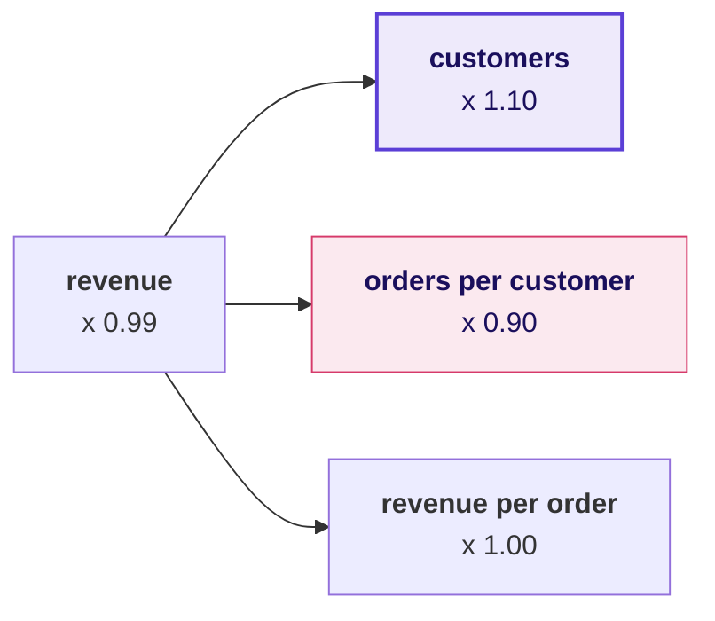
```mermaid
flowchart LR
    R["<b>revenue</b><br/>x 0.99"] --> C["<b>customers</b><br/>x 1.10"]
    R --> F["<b>orders per customer</b><br/>x 0.90"]
    R --> O["<b>revenue per order</b><br/>x 1.00"]
    classDef known fill:#EEEAFB,stroke:#5B3FD6,color:#1A0F5C,stroke-width:2px
    classDef bad fill:#FBE9EF,stroke:#D63A6A,color:#1A0F5C
    class C known
    class F bad
```

**The rule.** Invented numbers: ten percent more customers and ten percent less frequency is 1.10 times 0.90, which is 0.99, a one percent fall, where adding them says flat. Monday's two ten percent lifts made 21 percent for the same reason.

```notes
LIVE, 3 minutes. These numbers are invented to show the rule. Every round today uses it: a
decomposition is proved by multiplying the branches back to the revenue ratio. Items per order and
price per item fold into revenue per order today, because the file has no order lines.
Ask: if customers stayed flat and revenue fell, which branches must have moved? Then move on.
Transition: before filling any box, check that the two totals deserve comparing.
```

---

## SECTION 2: Round 1, is the drop real
*Marketing's slide says revenue fell by a quarter, and the first rung checks the windows before the story.*

```notes
LIVE. Round 1 runs 50 minutes: 5 on the claim and the conventions, 15 in notebook 01, 10 on the
trap, 12 on the room's variant, 5 on Kavya's review. Open
notebooks/C2_W01_D02_01_is_the_drop_real_STUDENT.ipynb now.
```

---

## S8. Marketing's slide says revenue fell 25.9 percent
*Its Q2 figure is the dashboard tile, and the arithmetic on the slide is correct.*

```stats
value: Rs 2,10,00,000 | label: Q1 on Marketing's slide | note: 1 April to 30 June
value: Rs 1,55,59,950 | label: Q2 on Marketing's slide | note: the dashboard tile
value: -25.9% | label: the headline | note: "revenue fell by a quarter"
```

**The client asks.** If revenue fell by a quarter in one quarter, Marketing says, the acquisition budget cannot wait.

```notes
LIVE, 3 minutes. Put the claim up exactly as Marketing would. 1,55,59,950 over 2,10,00,000 is 0.741,
a fall of 25.9 percent: the division is right. Ask whether anything is wrong. Most of the room will
not see it yet, and that is the round.
```

---

## S9. How retailers keep periods comparable
*Retail learned long ago that two totals only compare when their calendars match.*

| Convention | What it holds equal | What it still misses |
|---|---|---|
| Like-for-like, or same-store, sales | The same outlets in both periods | Season and calendar |
| The 4-5-4 retail calendar | Weeks per month, and weekends per comparable month | New channels and events |
| Year on year | The season: this Q2 against last Q2 | Anything that changed within the year |
| Quarter on quarter | Nothing about season | Monsoon, festivals, school terms |

**The outside view.** The US National Retail Federation's 4-5-4 calendar splits each quarter into 13 whole weeks so like days compare with like days; retailers built it in the 1930s because a month with an extra weekend reads as growth.

```notes
LIVE, 5 minutes. This is the business knowledge under rung 1. Same-store or like-for-like sales
compares only outlets open in both periods; the 4-5-4 calendar makes every quarter 13 whole weeks
with the same weekends. Meera's question is quarter on quarter, and Q2 is monsoon while Q1 is
summer, so even perfect windows leave the season in the comparison. The fix for season is last
year's Q2, which this file does not hold; write it down as an ask, round 1 closes on it.
Sources: nrf.com/resources/4-5-4-calendar, verified 29 Sep 2026; the same-store definition is the
standard one used in retail reporting.
```

---

## S10. Read the dates before the totals
*A dashboard tile is a query frozen at its last refresh, so its window is whatever the refresh saw.*

```python
first, last = "9999-12-31", "0000-01-01"
for order in ORDERS:
    if order["quarter"] == "Q2" and order["order_date"] <= "2026-09-15":
        first = min(first, order["order_date"])
        last = max(last, order["order_date"])
print(first, last)
```

Dates written as year, month and day sort as text in date order, so `min` and `max` work on them directly; a date written day first would not.

```notes
LIVE, 5 minutes. Type it in notebook 01 with the room, first for Q1, then for the tile's Q2 window.
The starting values are chosen so any real date beats them. The system point: a tile shows a number
without its window unless someone puts the refresh date on it. Ask the room how often they have
seen a dashboard number with its dates beside it. Do not read out the results yet.
```

---

## S11. Question: how many weeks does each side cover?
*Q1 is the closed quarter; Q2 is the tile as it was cut.*

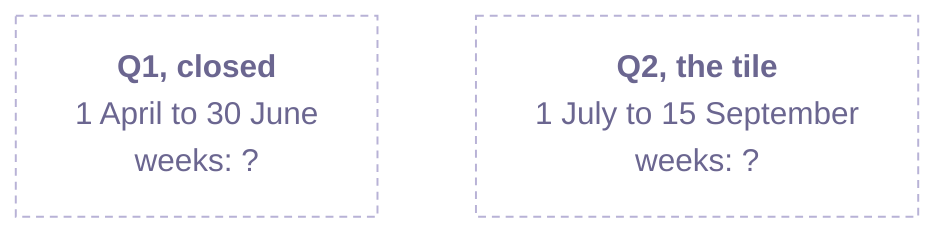
```mermaid
flowchart TB
    Q1["<b>Q1, closed</b><br/>1 April to 30 June<br/>weeks: ?"]
    Q2["<b>Q2, the tile</b><br/>1 July to 15 September<br/>weeks: ?"]
    classDef unknown fill:#FFFFFF,stroke:#B8B2D6,color:#6B6690,stroke-dasharray:4 3
    class Q1,Q2 unknown
```

**Question.** Predict before the loop prints: a) 13 weeks against 13; b) 13 weeks against 11; c) 12 weeks against 12; d) 13 weeks against 9.

```notes
LIVE, 2 minutes. Take letters. Some count months and say three against two and a half; the count
in weeks is the one a rate per week needs.
```

---

## S12. Answer: 13 weeks against 11
*The two totals never measured the same stretch of time, and the cumulative lines show where the tile stopped.*

```mermaid
%%{init: {"xyChart": {"showLegend": true}}}%%
xychart-beta
    title "Revenue to date by week of quarter, Rs lakh"
    x-axis "Week of quarter; the tile stops at week 11" [1, 2, 3, 4, 5, 6, 7, 8, 9, 10, 11, 12, 13]
    y-axis "Rs lakh" 0 --> 230
    line "Q1" [37.7, 42.0, 64.9, 84.8, 107.2, 110.9, 138.6, 152.7, 152.8, 152.9, 187.5, 209.9, 210.0 "Q1 210.0"]
    line "Q2" [23.5, 43.0, 46.0, 61.2, 67.6, 119.4, 133.8, 142.2, 142.3, 142.3, 155.6 "tile stops, 155.6", 172.2, 187.0 "Q2 187.0"]
```

The line that ends at Rs 210.0 lakh is Q1. The other is Q2: Rs 155.6 lakh at week 11, which is the tile, and Rs 187.0 lakh at the close.

```notes
LIVE, 4 minutes. The answer is b: Q1 is 13 weeks and 91 days, the tile 11 weeks. The two weeks the
tile never saw hold 16 orders and Rs 31,40,050. Point at the flat stretches: revenue arrives in
lumps, and weeks without a large order barely move. That lumpiness returns in the room's variant.
The trap in one line: two missing weeks look exactly like lost customers, and the decision they
mislead is the largest one on Meera's desk.
```

---

## S13. The fix: closed quarters, or a rate per week
*Three fair readings sit near 11 percent, and none of them is a crisis.*

| Comparison | Q1 | Q2 | Change |
|---|---|---|---|
| Closed quarters, 13 weeks each | Rs 2,10,00,000 | Rs 1,87,00,000 | -11.0% |
| Per day, 91 against 92 days | Rs 2,30,769 | Rs 2,03,261 | -11.9% |
| Per week, Q1 against the tile | Rs 16,15,385 | Rs 14,14,541 | -12.4% |

**What changes.** The fall is Rs 23,00,000, less than half the Rs 54,40,050 the tile implied. A real fall that size calls for a diagnosis this week; a 25.9 percent fall would have called for the Rs 12 crore now.

```notes
LIVE, 4 minutes. Walk the per-week row as a rate: a numerator, a denominator and a window, the same
anatomy as orders per customer. The per-day row shows even closed quarters differ by a day, which is
the problem the 4-5-4 calendar removes. Say once: every number today is on the export as it stands,
and tomorrow's work checks that export against Finance's books.
```

---

## S14. Question: the same 11 weeks of each quarter?
*Q1 up to 16 June against the tile's Q2 up to 15 September, both 11 weeks long.*

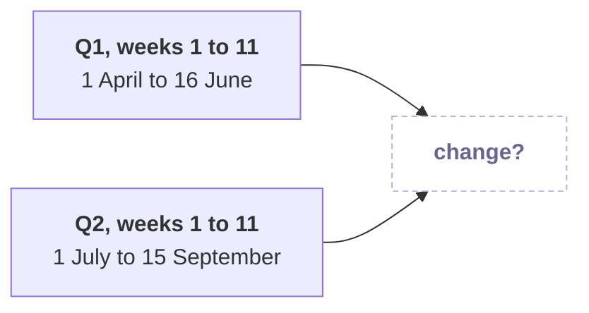
```mermaid
flowchart LR
    A["<b>Q1, weeks 1 to 11</b><br/>1 April to 16 June"] --> C["<b>change?</b>"]
    B["<b>Q2, weeks 1 to 11</b><br/>1 July to 15 September"] --> C
    classDef unknown fill:#FFFFFF,stroke:#B8B2D6,color:#6B6690,stroke-dasharray:4 3
    class C unknown
```

**Question.** The room runs it in notebook 01; predict first: a) down 12.4 percent, as per week; b) down 17.0 percent; c) down 11.0 percent; d) down 25.9 percent.

```notes
LIVE, 10 minutes: 8 for the room's run, 2 for letters. This is the harder variant. Pairs filter Q1
to order_date on or before 2026-06-16 and total it. Watch for pairs who reuse the per-week figure
without running anything.
```

---

## S15. Answer: down 17.0 percent over the same weeks
*Matched weeks and the per-week rate disagree, because a few very large orders land where they land.*

```stats
value: -17.0% | label: same 11 weeks | note: Rs 1,87,51,440 to Rs 1,55,59,950
value: -12.4% | label: per week | note: assumes revenue arrives evenly
value: 98.9% | label: of Q1 revenue | note: from 20 Business orders out of 114
```

**The rule.** The fewer and larger the orders, the more a short window depends on which week they landed in. Once both quarters have closed, compare the closed quarters, and keep quarter-to-date comparisons to the same weeks of both.

```notes
LIVE, 4 minutes. The answer is b. Twenty Business orders carry 98.9 percent of Q1's revenue, so
one of them landing in week 11 instead of week 12 moves a partial window by lakhs. That is Anand's
Monday warning at the level of time instead of averages. Three numbers now describe one drop:
-11.0, -12.4 and -17.0 percent. The honest one for Meera is the closed quarters, because both
windows are complete. Thursday asks how much of any gap such lumpy data can produce by chance.
```

---

## S16. Kavya's review of round 1
*Rung 1 holds: the drop is real, it is 11.0 percent, and one comparison is still missing.*

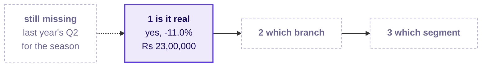
```mermaid
flowchart LR
    R1["<b>1 is it real</b><br/>yes, -11.0%<br/>Rs 23,00,000"] --> R2["<b>2 which branch</b>"]
    R2 --> R3["<b>3 which segment</b>"]
    X["<b>still missing</b><br/>last year's Q2<br/>for the season"] -.-> R1
    classDef known fill:#EEEAFB,stroke:#5B3FD6,color:#1A0F5C,stroke-width:2px
    classDef unknown fill:#FFFFFF,stroke:#B8B2D6,color:#6B6690,stroke-dasharray:4 3
    class R1 known
    class R2,R3,X unknown
```

**Kavya's review.** "Put the window beside the number, every time: booked revenue, closed quarters of 13 weeks, Rs 2.10 crore to Rs 1.87 crore, minus 11.0 percent. Then ask the platform team for last year's Q2, because this comparison still carries the season."

**In the interview.** [F] What has to match before a quarter-on-quarter comparison is fair?

```notes
LIVE, 3 minutes. One breath for the interview answer: the window's length and dates, the metric's
definition, the population counted, and the season, which only a year-on-year comparison removes.
Transition: the drop is real, so which branch of the tree moved?
```

---

## SECTION 3: Round 2, which branch moved
*The tree meets both quarters, and the order of the arithmetic turns out to be a decision too.*

```notes
LIVE. Round 2 runs 50 minutes: 6 on the code, 7 on customers and the tree, 6 on the bridge, 12 on
the discount trap, 12 on the room's variant, 4 on Kavya. Switch to
notebooks/C2_W01_D02_02_which_branch_STUDENT.ipynb.
```

---

## S17. One pass, two dictionaries
*Revenue sums by quarter; customers are dictionary keys, so each person is counted once.*

```python
revenue, orders_by_customer = {}, {"Q1": {}, "Q2": {}}
for order in ORDERS:
    q, cid = order["quarter"], order["customer_id"]
    revenue[q] = revenue.get(q, 0) + order["amount"]
    orders_by_customer[q][cid] = orders_by_customer[q].get(cid, 0) + 1
print(revenue, len(orders_by_customer["Q1"]), len(orders_by_customer["Q2"]))
```

**Why keys.** Monday's list checked every id already seen before adding one, so the work grows with the square of the customers; a dictionary key answers "seen before?" in one step on average, and it keeps each customer's order count for the afternoon.

```notes
LIVE, 6 minutes. get(q, 0) is a decision, and here it is the right one: a quarter with no orders
yet has summed to zero. Keep that sentence; the discount branch will test whether zero is always the
right default. The keys: Python's own performance notes give membership in a list as proportional to
its length and in a set or dictionary as constant on average (wiki.python.org, TimeComplexity,
verified 29 Sep 2026). At 200 rows nobody notices; at a million orders a list-based distinct count
does about half a million million comparisons. Cover the customer output; the next slide predicts it.
```

---

## S18. Question: how many customers bought in Q2?
*Orders fell from 114 to 86, and Marketing says customers are the problem.*

```stats
value: 69 | label: Q1 customers | note: distinct ids, April to June
value: 114 to 86 | label: orders | note: down 24.6 percent
```

**Question.** Predict Q2's customer count: a) 52, since orders fell by a quarter; b) 69; c) 81; d) 86.

```notes
LIVE, 2 minutes. Option d is Monday's rows-as-customers trap. Option a is Marketing's story carried
through. Take letters, then uncover the output.
```

---

## S19. Answer: 69 customers, and the tree filled in
*The branch Marketing wants to fund did not move, and the other two multiply back to the fall.*

| Branch | Q1 | Q2 | Ratio |
|---|---|---|---|
| Customers | 69 | 69 | 1.000 |
| Orders per customer | 1.65 (114 over 69) | 1.25 (86 over 69) | 0.754 |
| Revenue per order | Rs 1,84,211 | Rs 2,17,442 | 1.180 |
| Revenue | Rs 2,10,00,000 | Rs 1,87,00,000 | 0.890 |

**The check.** 1.000 times 0.754 times 1.180 is 0.890, the revenue ratio: the decomposition is complete, and the answer is b. Frequency fell 24.6 percent while revenue per order rose 18.0 percent.

```notes
LIVE, 5 minutes. Let the silence land: Marketing's branch is flat. A flat count alone does not prove
nobody left; whether these are the same 69 people is the afternoon's sharper question. Revenue per
order rising is not a price rise until proved; the afternoon takes that apart as mix against rate.
Fill the tree on the board with these ratios.
```

---

## S20. The bridge, and the order you choose
*Moving one branch at a time into rupees gives a different split depending on which branch moves first.*

| Order of the steps | Orders per customer | Revenue per order |
|---|---|---|
| Frequency first, at Q1's order value | -Rs 51,57,895 | +Rs 28,57,895 |
| Order value first, at Q1's orders | -Rs 60,88,372 | +Rs 37,88,372 |
| Symmetric, the logarithmic split | -Rs 55,88,480 | +Rs 32,88,480 |

**The rule.** Every row sums to the same Rs 23,00,000 fall; what differs is who is charged for the part where both branches moved at once. Say which order you used, or use the symmetric split, so Finance can rebuild your bridge.

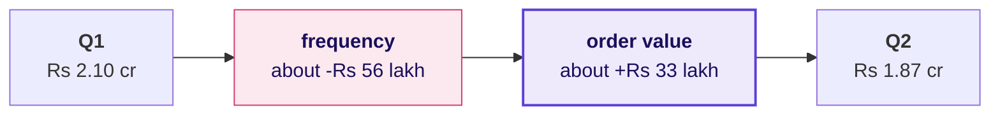
```mermaid
flowchart LR
    A["<b>Q1</b><br/>Rs 2.10 cr"] --> B["<b>frequency</b><br/>about -Rs 56 lakh"] --> C["<b>order value</b><br/>about +Rs 33 lakh"] --> D["<b>Q2</b><br/>Rs 1.87 cr"]
    classDef bad fill:#FBE9EF,stroke:#D63A6A,color:#1A0F5C
    classDef known fill:#EEEAFB,stroke:#5B3FD6,color:#1A0F5C,stroke-width:2px
    class B bad
    class C known
```

```notes
LIVE, 6 minutes. Row one: 28 fewer orders at Q1's Rs 1,84,211 each, then 86 orders each Rs 33,231
richer. Row two moves order value first on 114 orders, then charges the 28 lost orders at Q2's
higher value. The gap between them is the interaction, and finance teams settle it by convention in
their variance bridges. The symmetric split weights each branch's log change by the logarithmic mean
of the two revenues (Ang, 2005, "The LMDI approach to decomposition analysis", Energy Policy), so the
answer no longer depends on the order. Whichever row you use, frequency is the branch that cost
money. The notebook draws row one with kit.bridge.
```

---

## S21. A missing key, in two minutes
*The discount branch stops on a KeyError, and each way past it hides a different decision.*

```text
KeyError: 'discount'
```

| Way past it | Python's name for it | The decision it makes quietly |
|---|---|---|
| `if "discount" in order:` | Look before you leap | Orders without it are skipped |
| `try:` ... `except KeyError:` | Easier to ask forgiveness | Whatever the except branch does |
| `order.get("discount", 0)` | A default | Absent becomes zero rupees |

```notes
LIVE, 2 minutes, and no more. Read the last line of the trace: it names the key. The Python
glossary names the first two styles LBYL and EAFP (docs.python.org glossary, verified 29 Sep 2026).
None of the three is wrong as code; each one decides what an absent discount means, and the next
slide shows what the third one decides.
```

---

## S22. The wrong answer: half the orders had no discount
*Reading a missing discount as zero gives a share, a story and a decision.*

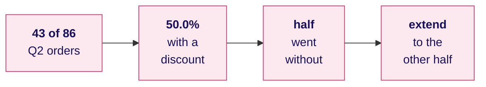
```mermaid
flowchart LR
    A["<b>43 of 86</b><br/>Q2 orders"] --> B["<b>50.0%</b><br/>with a<br/>discount"]
    B --> C["<b>half</b><br/>went<br/>without"] --> D["<b>extend</b><br/>to the<br/>other half"]
    classDef bad fill:#FBE9EF,stroke:#D63A6A,color:#1A0F5C
    class A,B,C,D bad
```

| Invented order | Discount field | Read as zero | Recorded only |
|---|---|---|---|
| A, B | Rs 100, Rs 0 | Rs 100, Rs 0 | Rs 100, Rs 0 |
| C | absent | Rs 0 | left out |
| Share with a discount | | 1 of 3, 33% | 1 of 2, 50% |

```notes
LIVE, 4 minutes. This is the round's trap. The hurried default silences the error, and the share of
Q2 orders with a discount above zero comes out at 50.0 percent, 43 of 86. The story writes itself:
half the orders went without, so Marketing extends the monsoon discount to the other half. The three
orders are invented to show the mechanism: B is a real zero, someone recorded no discount; C is
unknown. The default of zero files C beside B, and the share becomes a floor nobody labelled.
```

---

## S23. Question: what were the 43 "no discount" orders?
*The hurried reading says 43 of Q2's 86 orders went without; predict what they are.*

```stats
value: 42.1% | label: Q1, absent as zero | note: orders with a discount
value: 50.0% | label: Q2, absent as zero | note: orders with a discount
value: 43 | label: Q2, read as none | note: of 86 orders
```

**Question.** Of the 43 Q2 orders read as "no discount", how many record Rs 0? a) all 43; b) 34; c) 17; d) none.

```notes
LIVE, 3 minutes. Before the answer, each learner runs the count in the empty your-turn cell of
notebook 02: orders with no discount field, per quarter. Then take letters. Anyone who says a) has
not yet separated a recorded zero from a field nobody wrote.
```

---

## S24. Answer: 17 recorded zeros and 26 unknowns
*Where the field is recorded, 71.7 percent of Q2's orders carry a discount, and the rest is a range.*

| Share of orders with a discount | Q1 | Q2 |
|---|---|---|
| Blanks read as zero | 42.1%, 48 of 114 | 50.0%, 43 of 86 |
| No discount field (the check) | 32 orders | 26 orders |
| Over orders that record the field | 58.5%, 48 of 82 | 71.7%, 43 of 60 |
| Range, blanks unknown | 42.1% to 70.2% | 50.0% to 80.2% |

**The fix.** Write the default with its reason: "absent means not recorded; reported separately; never counted as zero". Only 17 of Q2's 86 orders are known to have had no discount, so the extension loses its premise; and at Rs 150 on every Q2 order, the most anyone recorded, the branch holds at most Rs 12,900 of a Rs 23,00,000 fall.

```notes
LIVE, 5 minutes. The answer is c: 17 recorded zeros and 26 records with no field. Three moves.
First, the decision goes in writing beside the number. Second, ask who wrote the records without the
field: an older checkout, a channel, a batch. Statisticians separate data missing at random from
data missing for a reason (Rubin, 1976, "Inference and missing data", Biometrika); the business
version is "which system left it empty, and does that system sell differently?". Third, a bound: the
share lies between 50.0 and 80.2 percent, and in rupees the branch is under one percent of the fall.
Interview question [S] lives here: a field is missing on some records; do you fill it with zero?
```

---

## S25. Your run: the tree on Anand's definition
*Finance counts delivered orders only; does the branch that moved survive his definition?*

```timeline
label: Step 1 | title: One filter | body: Keep orders whose status is delivered, in both quarters, never one.
label: Step 2 | title: Three branches | body: Customers, orders per customer and revenue per order for each quarter.
label: Step 3 | title: Multiply back | body: Check that the three ratios give the delivered revenue ratio.
label: Step 4 | title: One sentence | body: Name the branch that carries the fall on Anand's definition, with its change. | tone: dark
```

```notes
LIVE, 12 minutes: 10 for the run, 2 to collect sentences. This is the harder variant. Watch for pairs
who filter one quarter and forget the other, which manufactures a drop of exactly the kind S5 mapped.
The answer goes up on the next slide.
```

---

## S26. Kavya's review of round 2
*Frequency carries the fall on booked and on delivered, and delivered is still moving.*

| Delivered only | Q1 | Q2 | Change |
|---|---|---|---|
| Revenue | Rs 1,45,04,970 | Rs 1,28,64,680 | -11.3% |
| Customers | 54 | 50 | -7.4% |
| Orders per customer | 1.50 | 1.14 | -24.0% |
| Revenue per order | Rs 1,79,074 | Rs 2,25,696 | +26.0% |

**Kavya's review.** "Frequency is the branch on both definitions, which makes it stronger. Delivered revenue for a quarter that has just closed is provisional, because returns keep arriving after it ends; say booked for the headline and delivered with its date."

**In the interview.** [S] Why is a rate without a denominator meaningless?

```notes
LIVE, 4 minutes. Customers dip on this definition, and a sharp learner will say so: the dip is four
people, far smaller than the fall in frequency. The system point: a late return turns a delivered
order into a returned one weeks after the quarter closed, so the newest quarter's delivered figure
can only fall. One breath for the interview answer: "down 20 percent" of what, over which window and
which base is unknown, so nobody can check it or compare it. Break for 10 minutes after this slide.
```

---

## SECTION 4: Round 3, every kind of customer
*The same tree for every segment and quarter means writing it once, as a function that returns its answer.*

```notes
LIVE. Round 3 runs 50 minutes after the break: 3 on the lens, 11 on functions, 9 on describe, 9 on
the roll-up trap, 15 on the room's run, 3 on Kavya. Switch to
notebooks/C2_W01_D02_03_which_segment_STUDENT.ipynb.
```

---

## S27. Each segment's economics says what to watch
*Four kinds of customer earn money in four different ways, so each has a different first number.*

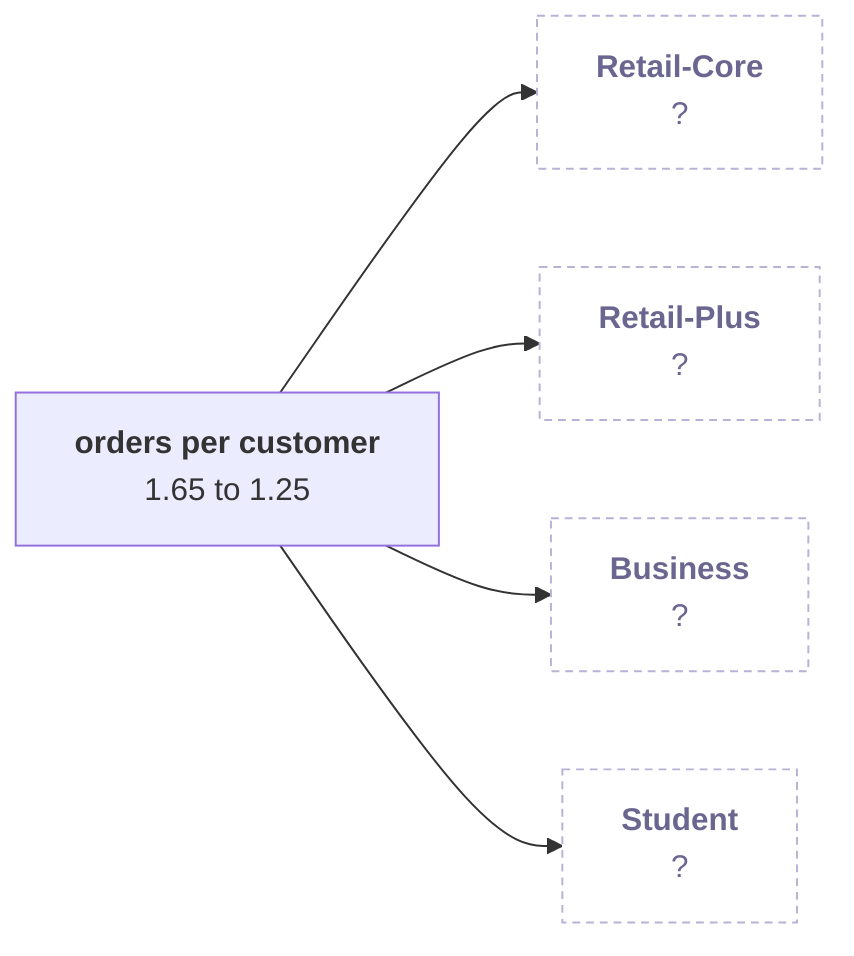
```mermaid
flowchart LR
    T["<b>orders per customer</b><br/>1.65 to 1.25"] --> A["<b>Retail-Core</b><br/>?"]
    T --> B["<b>Retail-Plus</b><br/>?"]
    T --> C["<b>Business</b><br/>?"]
    T --> D["<b>Student</b><br/>?"]
    classDef unknown fill:#FFFFFF,stroke:#B8B2D6,color:#6B6690,stroke-dasharray:4 3
    class A,B,C,D unknown
```

| Segment | How it earns | Watch first |
|---|---|---|
| Retail-Core | Many small orders | Customers active |
| Retail-Plus, the paid tier | Members' repeat buying | Orders per member |
| Business | Few very large accounts | Order timing per account |
| Student | Small baskets, few buyers | How many orders a figure rests on |

```notes
LIVE, 3 minutes. The head of Retail-Plus asked whether his tier is slipping, and Meera asked
whether it is everyone. This table is a lens that points the question: it says which number to read first for
each kind of customer. A paid tier is sold on repeat buying, so its health shows in frequency before
it shows in the member count. Eight trees are needed, four segments by two quarters; ask how many
times the room wants to paste round 2's code.
```

---

## S28. tree_for is a metric definition, written once
*One function holds the day's definitions, so every segment and quarter gets the same ones.*

```python
def tree_for(rows):
    """Revenue, orders, customers and the two rates for any group of orders."""
    revenue, seen = 0, {}
    for order in rows:
        revenue += order["amount"]
        seen[order["customer_id"]] = True
    return {"revenue": revenue, "orders": len(rows), "customers": len(seen),
            "orders_per_customer": len(rows) / len(seen),
            "revenue_per_order": revenue / len(rows)}
```

**Test it where the answer is known.** On all of Q1 it returns 114 orders, 69 customers and 1.65; on all of Q2, 86, 69 and 1.25: round 2, reproduced.

```notes
LIVE, 6 minutes. Build it line by line: def, the parameter, the body, return. The system point: a
definition of "customer" that lives in one function changes everywhere at once, and one that lives
in six pasted copies drifts. Week 2 puts the same definitions in the warehouse as queries every team
shares. A new function earns trust by reproducing a number proved another way; the notebook's check
cell does exactly that before any segment is run.
```

---

## S29. A function that prints hands back None
*Printing shows a number to you; returning hands it to the next line of code.*

```python
def orders_per_customer(rows):
    print(len(rows) / tree_for(rows)["customers"])

result = orders_per_customer(q1_rows)   # prints 1.6521739130434783
print(result)                           # None
```

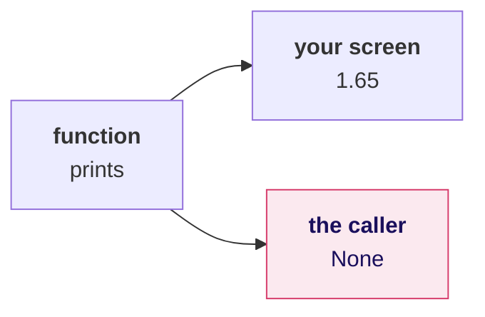
```mermaid
flowchart LR
    F["<b>function</b><br/>prints"] --> S["<b>your screen</b><br/>1.65"]
    F --> R["<b>the caller</b><br/>None"]
    classDef bad fill:#FBE9EF,stroke:#D63A6A,color:#1A0F5C
    class R bad
```

```notes
LIVE, 2 minutes, in passing. A function without return hands back None: it looks right on screen
and breaks the next step silently, either by crashing or by being skipped. The afternoon's helper
tests exactly this. Interview question [F]: why does a function that prints instead of returning
break a pipeline?
```

---

## S30. describe gives a group its typical value and spread
*The median, the smallest, the largest and the range, returned together, because one number never describes a group.*

```python
def describe(amounts):
    """A group's typical value and spread: median, min, max and range."""
    ordered = sorted(amounts)
    n = len(ordered)
    if n % 2 == 1:
        median = ordered[n // 2]
    else:
        median = (ordered[n // 2 - 1] + ordered[n // 2]) / 2
    return {"median": median, "min": ordered[0], "max": ordered[-1],
            "range": ordered[-1] - ordered[0]}
```

**Why these.** The median needs half the orders to move before it moves; the range is made of the two extremes and nothing else. Between them sits the middle half of the sorted orders, the spread a Finance team trusts.

```notes
LIVE, 4 minutes. Monday's median by hand, now inside a function, exactly as notebook 03 writes it.
The statistics module does the same with statistics.median and statistics.quantiles (Python docs,
verified 29 Sep 2026); modules wait, so name it once and move on. The middle half is the stretch
between the first and third quartiles of the sorted list; S32 reads it off for Business. Anand's
warning returns: each group gets a typical value and its spread, never a mean alone.
```

---

## S31. Question: what did Business orders look like in Q2?
*Q1's median Business order was Rs 9,83,780, with a range of Rs 15,80,940.*

```stats
value: Rs 9,83,780 | label: Q1 median | note: Business, 20 orders
value: Rs 15,80,940 | label: Q1 range | note: Rs 2,03,060 to Rs 17,84,000
value: Rs 8,02,750 | label: Q1 middle half | note: between the quartiles
```

**Question.** Predict describe for Business in Q2: a) median, range and middle half all fall; b) the median barely moves, the range jumps and the middle half moves a little; c) the median doubles; d) nothing changes.

```notes
LIVE, 2 minutes. Take letters, then run describe on Business Q2 on the projector. Retail-Core and
Business are the two segments demonstrated; do not run Retail-Plus or Student on the projector.
```

---

## S32. Answer: one order stretched the range; the middle held
*A typical Business order barely changed; one large order stretched the extremes.*

| Business | Median | Middle half | Range | Mean |
|---|---|---|---|---|
| Q1, 20 orders | Rs 9,83,780 | Rs 8,02,750 | Rs 15,80,940 | Rs 10,38,559 |
| Q2, 17 orders | Rs 9,52,000 | Rs 9,08,000 | Rs 27,28,460 | Rs 10,90,674 |
| Change | -3.2% | +13.1% | +72.6% | +5.0% |

**The claim.** The answer is b. One order of Rs 29,45,460 lifts Q2's mean by Rs 1,15,924 and moves the median by Rs 44,500; the Business story is fewer orders of the usual size, and one outsized order to name.

```notes
LIVE, 3 minutes. The mean rose 5 percent and could be sold as "Business orders got bigger": remove
the one order and the mean is Rs 9,74,750, below Q1. This is why the notes say typical value and
spread, and why the middle half is the spread a Finance team trusts. Retail-Core, for comparison:
median Rs 2,325 to Rs 2,080, with a flat spread.
```

---

## S33. The wrong answer: frequency fell only 6.0 percent
*Averaging the four segments' orders per customer gives a softer story and a different decision.*


```mermaid
%%{init: {"xyChart": {"showDataLabel": true, "showDataLabelOutsideBar": true}, "themeVariables": {"xyChart": {"plotColorPalette": "#D63A6A, #1F8A5B"}}}}%%
xychart-beta
    title "Averaged in pink, the wrong roll-up; weighted in green"
    x-axis ["Averaged Q1", "Averaged Q2", "Weighted Q1", "Weighted Q2"]
    y-axis "Orders per customer" 0 --> 2.2
    bar [1.94, 1.82, 1.65, 1.25]
    bar [-1, -1, 1.65, 1.25]
```

**What breaks.** Averaged, the four segments say 1.94 to 1.82, a fall of 6.0 percent: "frequency is not the branch, so Marketing may be right after all", and the Rs 12 crore goes back on the table.

```notes
LIVE, 4 minutes. This is the round's trap. The room computes each segment's orders per customer,
adds the four and divides by four: correct arithmetic, wrong question. Only the averages and the
weighted figures appear; no per-segment rows are shown.
```

---

## S34. The fix: a ratio of totals, never a mean of ratios
*Each segment's rate carries its own denominator, and the roll-up must carry it too.*

| Invented group | Customers | Orders per customer | Orders |
|---|---|---|---|
| Large | 30 | 1.1 | 33 |
| Small | 2 | 3.5 | 7 |
| Mean of the two rates | | 2.30 | |
| Total orders over total customers | 32 | 1.25 | 40 |

**The rule.** Roll a rate up as total numerator over total denominator: 114 over 69, then 86 over 69, a fall of 24.6 percent. A dashboard that averages an already averaged column makes the same mistake, silently, at every level of the hierarchy.

```notes
LIVE, 5 minutes. The invented groups show the mechanism: two customers get the same vote as thirty.
In the real file Student has 2 customers and Retail-Core 34. The check that caught it: the roll-up
must reproduce the company figure from round 2. The system point: a report that stores each
segment's average and later averages those is doing this at scale; store numerators and
denominators, and divide last. Interview question [F]: why can't you average four segments' rates
for the company figure?
```

---

## S35. Your run: all four segments, both quarters
*tree_for and describe on every segment, and one sentence for the head of Retail-Plus.*

```timeline
label: Step 1 | title: Four segments in | body: Group the orders by segment and quarter with a dictionary.
label: Step 2 | title: Four rows out | body: Call tree_for on each group, and count the rows that come back.
label: Step 3 | title: Weighted roll-up | body: Check that the segments reproduce 1.65 and 1.25.
label: Step 4 | title: One sentence | body: Name the segment whose orders per customer moved most, with its numbers. | tone: dark
```

```notes
LIVE, 15 minutes. The room's harder variant, in the empty your-turn cells of notebook 03. Do not run
it on the projector and do not confirm any segment aloud. Walk the room and listen for pairs who
count four groups in and four rows out; the afternoon's helper tests that habit. Collect two
sentences read aloud without comment; the afternoon opens on them.
```

---

## S36. Kavya's review of round 3
*Three rungs climbed, and the morning ends with a segment in your own notebook.*

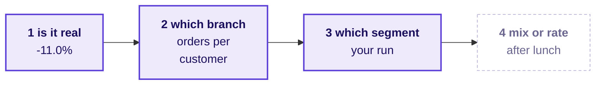
```mermaid
flowchart LR
    R1["<b>1 is it real</b><br/>-11.0%"] --> R2["<b>2 which branch</b><br/>orders per<br/>customer"]
    R2 --> R3["<b>3 which segment</b><br/>your run"]
    R3 --> R4["<b>4 mix or rate</b><br/>after lunch"]
    classDef known fill:#EEEAFB,stroke:#5B3FD6,color:#1A0F5C,stroke-width:2px
    classDef unknown fill:#FFFFFF,stroke:#B8B2D6,color:#6B6690,stroke-dasharray:4 3
    class R1,R2,R3 known
    class R4 unknown
```

**Kavya's review.** "A function returns its answer; count the groups in and the groups out. Roll a rate up with its weights, and describe every group by its middle as well as its edges."

**In the interview.** [F] Why does a function that prints instead of returning break a pipeline?

```notes
LIVE, 3 minutes, then lunch. One breath: the caller receives None, the next step crashes or
silently drops that group, and nobody sees it because the screen looked right. Transition to the
afternoon: Meera escalates the case, and a colleague's helper is waiting in it.
```
