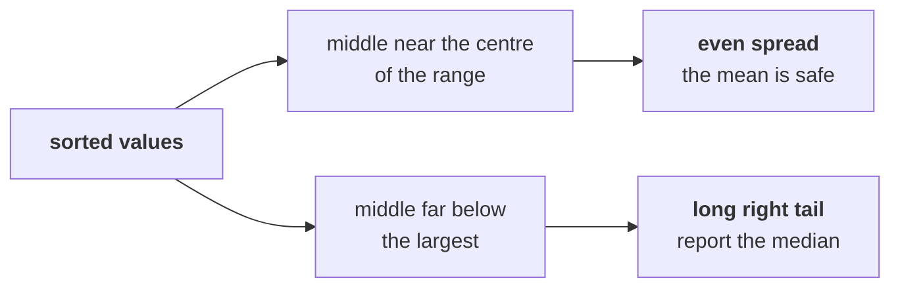
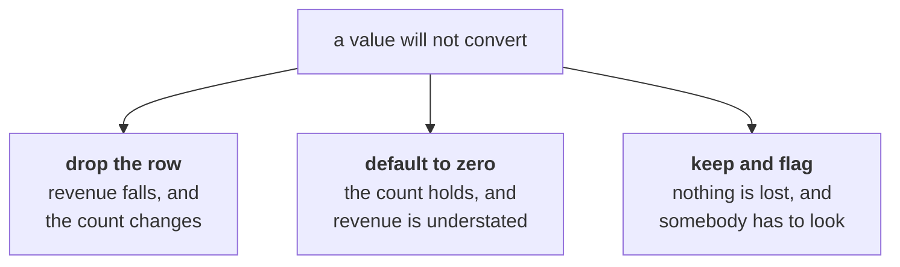
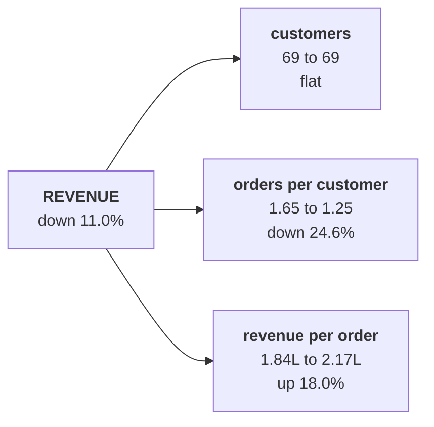
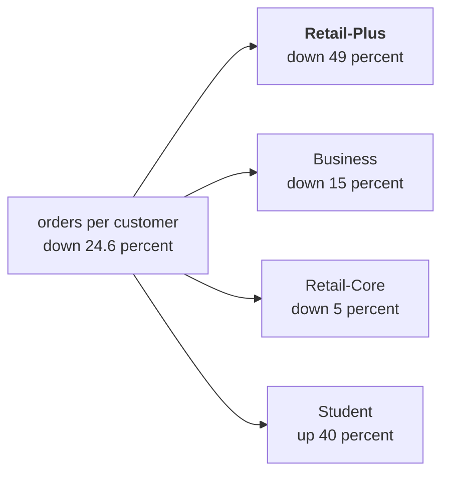
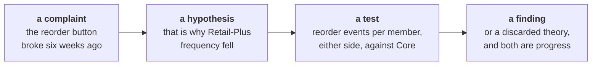

# Half two: describe each segment, then find the one that moved

Week 1, Day 2. Slide source. One idea per slide.

Position bar, repeated at every section boundary:
`[describing a segment] > [write it once] > [the decomposition] > [the hypothesis]`

---

## SECTION A. Describing a segment

---

## S1. An average is not a description
Two segments can share a median and be nothing alike. One number describes where the middle is and says nothing about how spread out the rest are.

A segment is described by a typical value **and** a spread, and usually by the shape as well.

---

## S2. Three numbers from a sorted list
```python
values = sorted(int(o["amount"]) for o in rows)
low, high = values[0], values[-1]
mid = values[len(values) // 2]
```

Sort once and you have the smallest, the largest and the middle. The range is the distance between the first two, and it is the cheapest spread there is.

---

## S3. The four Kalpa segments, described
| Segment | Orders | Median | Smallest | Largest |
|---|---|---|---|---|
| Retail-Core | 83 | Rs 2,230 | Rs 860 | Rs 3,000 |
| Retail-Plus | 68 | Rs 3,050 | Rs 1,230 | Rs 4,460 |
| Student | 12 | Rs 990 | Rs 680 | Rs 1,440 |
| Business | 37 | Rs 9,85,620 | Rs 1,99,380 | Rs 29,45,460 |

One of these four rows is not like the others, and it is the row that decides what the word "average" is worth.

---

## S4. Shape, from the sorted values alone


You do not need a chart to see shape. The gap between the middle and the largest tells you before any picture does.

---

## SECTION B. Write it once

---

## S5. The same four numbers, four times, is the signal
You need orders, revenue, customers and orders per customer for each quarter, and then for each segment inside each quarter.

That is twenty computations of four shapes. Copying them is how three of them end up wrong in a way nobody notices.

---

## S6. A function is one decision applied everywhere
```python
def describe(rows):
    customers = {o["customer_id"] for o in rows}
    revenue = sum(int(o["amount"]) for o in rows)
    return {"orders": len(rows), "revenue": revenue,
            "customers": len(customers),
            "per_customer": len(rows) / len(customers)}
```

Write the decision once and the twenty computations become twenty calls.

---

## D7. What if that last line said `print` and not `return`?
**Question.** The numbers appear on screen either way. What breaks?

---

## D8. Answer: the caller gets `None`
`print` sends text to a screen. `return` hands a value back to whatever asked for it.

```python
result = describe(rows)
print(result["revenue"])
```

With `print` inside the function, `result` is `None` and the next line fails with `TypeError: 'NoneType' object is not subscriptable`. A function that prints cannot be built on.

---

## S9. The conversion that must not stop the loop
```python
def to_amount(value, default=0):
    try:
        return int(value)
    except (TypeError, ValueError):
        return default
```

Yesterday one amount was text and the loop stopped. Over two hundred rows, stopping on the first bad value means you never find out how many there are.

`try` and `except` let the loop finish and count them instead.

---

## S10. Every default is a decision somebody has to defend


There is no free option. Whichever you pick, write the reason next to it, because on Wednesday somebody from Finance asks.

---

## SECTION C. The decomposition

---

## S11. Revenue, as three factors


| Factor | Q1 | Q2 | Change |
|---|---|---|---|
| Customers | 69 | 69 | flat |
| Orders per customer | 1.65 | 1.25 | down 24.6 percent |
| Revenue per order | Rs 1,84,211 | Rs 2,17,442 | up 18.0 percent |
| Revenue | Rs 2.10 crore | Rs 1.87 crore | down 11.0 percent |

---

## S12. The arithmetic has to close
```
1.000 × 0.754 × 1.180 = 0.890
```

Eleven percent down, from three factors, two of which moved. If the product does not land on the revenue change, a factor is missing or double counted, and the decomposition is not finished.

---

## S13. The factor nobody expected
Revenue per order went **up** 18 percent while revenue went down.

One factor moving the right way is hiding how far the other one fell. Report the fall without it and you understate the frequency problem by a third.

---

## SECTION D. The hypothesis

---

## S14. Rung four, where the fall is concentrated


One segment carries almost all of it. That is the sentence somebody can act on.

---

## S15. What you can say, and what you cannot
| Can say | Cannot say |
|---|---|
| Customers are flat at 69 in both quarters | Acquisition is fine, because the window may hide churn and replacement |
| Orders per customer fell 24.6 percent | Customers are unhappy, because the data holds no reason |
| Almost all of it is Retail-Plus | The reorder feature caused it, because nothing here measures the feature |

The third row is the one that gets people into trouble, and it is the one marketing will push on.

---

## S16. The hypothesis, written as a hypothesis


> **Hypothesis.** Retail-Plus frequency fell because the app's reorder feature broke.
>
> **What would settle it.** Reorder-button events per Retail-Plus member per week, before and after the six-week window, against the same measure for Retail-Core, which was unaffected.

A cause with a test beside it is a finding. A cause without one is an opinion with numbers attached.

---

## S17. The sentence you would send both of them
> "Customers are flat at 69 in both quarters, so this is not acquisition. Orders per customer fell
> 24.6 percent, and almost all of that sits in Retail-Plus. The reorder-feature complaint is a
> plausible cause and I have not tested it; reorder events per member either side of the six weeks
> would settle it. Note that revenue per order rose 18 percent, which is masking part of the fall."

Claim, location, hypothesis with its test, and the thing that is hiding the rest.
