# The cause on trial

Week 1, Day 2. Half two.

Kicker: WEEK 1  ·  TUESDAY  ·  HALF TWO
Quote: It is the broken reorder button. One of my members says it has been broken for six weeks.
Who: The head of Retail-Plus, Kalpa's paid membership tier

```notes
LIVE, one minute. The morning climbed five chapters: the drop is real at 11.0 percent, the branch is
orders per customer, the segment is Retail-Plus, the rise in order value is mostly mix, and
Marketing's churn claim fails the overlap. The afternoon opens on chapter 6, the cause the head of
Retail-Plus hands us, then the escalated case, the debrief, the second case, the drill and the close.
```

---

## SECTION 6: The memo and its evidence
*Chapter 6. The tier hands us a cause and Meera wants one page: what we know, what we guess, and what would settle it.*

```notes
LIVE. Chapter 6 runs 30 minutes: 3 on the need and Sonos, 4 on the options, 4 on the monthly line, 8
on the trap and its ceiling, 5 on the season, the channel and the second route, 4 on the memo, 2 on
Kavya. Open notebooks/C2_W01_D02_06_the_memo_STUDENT.ipynb. The chapter opener is numbered 6 on
purpose; it continues the morning's five.
```

---

## S1. The tier blames the button; Meera wants a page
*Engineering's priority and the story Meera tells the board both ride on whether the button explains the fall.*

**The client asks.** "Which branch, which segment, and what you would bet on. Tell me what you know and what you are guessing." (Meera Raghavan)

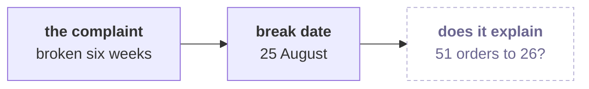
```mermaid
flowchart LR
    C["<b>the complaint</b><br/>broken six weeks"] --> B["<b>break date</b><br/>25 August"]
    B --> Q["<b>does it explain</b><br/>51 orders to 26?"]
    classDef unknown fill:#FFFFFF,stroke:#B8B2D6,color:#6B6690,stroke-dasharray:4 3
    class Q unknown
```

```notes
LIVE, 2 minutes. The metric at stake is Retail-Plus orders per week before and after the break. Six
weeks back from the week of 6 October is 25 August; say it is the complaint taken at its word. A
wrong answer costs a quarter: blame the button for everything, fix it, and the tier keeps falling.
```

---

## S2. Sonos tied its app to revenue with evidence
*A loyal customer base, an app that broke, and a company that cut its guidance only once it had the numbers.*

```stats
value: May 2024 | label: redesigned app shipped | note: customers reported it broken
value: FY2024 | label: guidance reduced | note: the CEO tied it to the app's rollout
value: up to $30 m | label: short-term cost to fix | note: set out in the annual report
```

**The claim.** A company can put a broken app into its numbers, and the head of Retail-Plus is asking whether his tier is the same story.

```notes
LIVE, 1 minute. Sources checked 30 Sep 2026: Sonos third quarter fiscal 2024 results (the chief
executive's statement that the app's rollout required a reduced fiscal 2024 guidance) and the fiscal
2024 annual report on Form 10-K (short-term costs of up to $30 million). No revenue figure for the
app's effect was verified on a primary page, so none is quoted.
```

---

## S3. Four tests of a cause, and the call
*Run the cheap tests in order, timing first, and request the one that settles it.*

| Option | Reads | Can rule out |
|---|---|---|
| A. Before and after the break | Retail-Plus orders, by date | The button as the whole story |
| B. A comparison segment | Retail-Core, same months | A season that hit everyone |
| C. The channel it predicts | Retail-Plus orders by channel | An app-only cause |
| D. The app's reorder logs | A data request | Nothing today; it settles it later |

**The call.** A, B and C now, D requested today. **What would change it:** if the break turned out to be in June, A's verdict flips, and D's release date is how we would learn it.

```notes
LIVE, 4 minutes. A cause cannot come after its effect, so timing leads. Each of A to C reads the
export already open in milliseconds; D is days away.
```

---

## S4. Question: when did the tier drop below Q1?
*Retail-Plus orders by month, with Retail-Core beside it for comparison.*

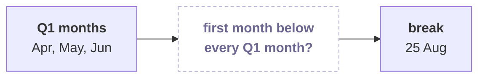
```mermaid
flowchart LR
    Q1["<b>Q1 months</b><br/>Apr, May, Jun"] --> X["<b>first month below<br/>every Q1 month?</b>"]
    X --> B["<b>break</b><br/>25 Aug"]
    classDef unknown fill:#FFFFFF,stroke:#B8B2D6,color:#6B6690,stroke-dasharray:4 3
    class X unknown
```

**Question.** a) September, after the break; b) August, when it broke; c) July, before it broke; d) never.

```notes
LIVE, 2 minutes. Take letters, then run the monthly cell with count_by, chapter 1's accumulator grown
into a function that takes any key.
```

---

## S5. Answer: July, weeks before the button broke
*Retail-Plus stepped down in July while Retail-Core held level through the same months.*

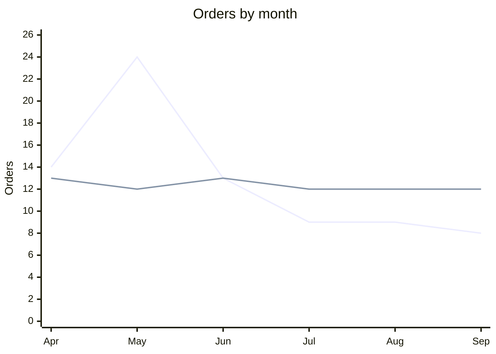
```mermaid
%%{init: {"xyChart": {"showLegend": true}}}%%
xychart-beta
    title "Orders by month"
    x-axis ["Apr", "May", "Jun", "Jul", "Aug", "Sep"]
    y-axis "Orders" 0 --> 26
    line "Retail-Plus" [14, 24, 13, 9, 9, 8]
    line "Retail-Core" [13, 12, 13, 12, 12, 12]
```

The line that falls from 13 to 9 in July is Retail-Plus; the level line is Retail-Core.

```notes
LIVE, 2 minutes. The answer is c. The button may still matter; it cannot be the whole story. If a
learner points at May's 24, write "May, 24?" on the parking board for Wednesday and say nothing more.
```

---

## S6. The plausible wrong answer: the button cost 25
*The hurried memo charges the button with the tier's whole quarter.*

```stats
value: 25 | label: orders the button "cost" | note: 51 in Q1 less 26 in Q2
value: Rs 65,250 | label: rupees the button "cost" | note: the whole tier's fall
value: 0 | label: days checked before the break | note: the missing check
```

**What breaks.** Engineering is told the fix recovers 25 orders a quarter; it ships, recovers a handful, and the tier's real problem has had another quarter to run.

```notes
LIVE, 3 minutes. The chapter's trap. The comparison spans the whole quarter, so it charges the button
with seven weeks of orders lost before it broke.
```

---

## S7. Why it is wrong, and the ceiling: about 4
*Split Q2 at the break and give each side its window; the rate had fallen by more than a third already.*

| Window | Days | Orders | Per week |
|---|---|---|---|
| Q1, 1 Apr to 30 Jun | 91 | 51 | 3.92 |
| Q2, 1 Jul to 24 Aug | 55 | 18 | 2.29 |
| Q2, 25 Aug to 30 Sep | 37 | 8 | 1.51 |

**The fix.** At the pre-break pace, 37 days would have carried about 12.1 orders; the tier placed 8. The button explains at most about 4 orders, about Rs 12,400, and that is a ceiling.

```notes
LIVE, 5 minutes. The check is chapter 1's lesson: a rate with its window. What changed: "the button
cost 25 orders" became "at most about 4; the rest needs another cause". Engineering still fixes it;
the memo stops promising it fixes the tier.
```

---

## S8. The season and the channel, both tested
*A season that hit everyone would move Retail-Core; an app-only cause would leave the web and store alone.*

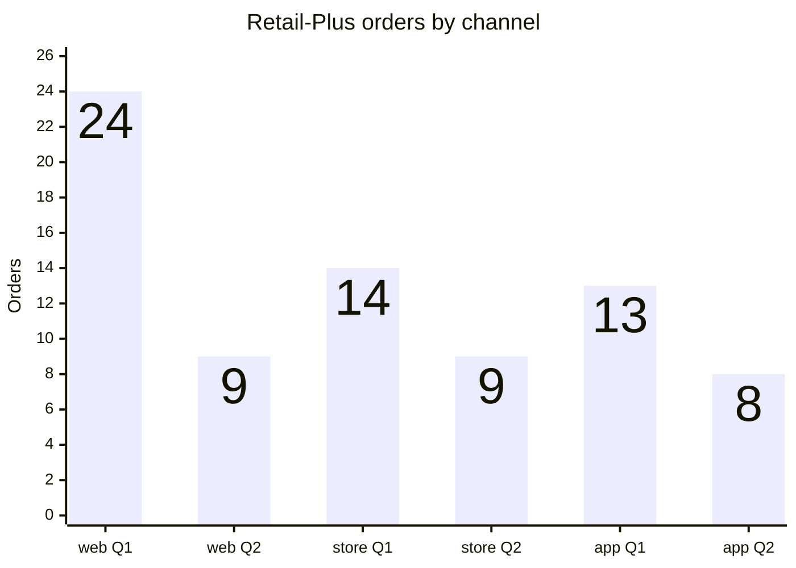
```mermaid
%%{init: {"xyChart": {"showDataLabel": true}}}%%
xychart-beta
    title "Retail-Plus orders by channel"
    x-axis ["web Q1", "web Q2", "store Q1", "store Q2", "app Q1", "app Q2"]
    y-axis "Orders" 0 --> 26
    bar [24, 9, 14, 9, 13, 8]
```

**What it says.** Retail-Core kept 95 percent of its Q1 orders and Retail-Plus 51, so an across-the-board season does not fit; every channel fell, so an app-only cause does not fit. A season that hit members harder still fits, and last year's Q2 by segment settles it.

```notes
LIVE, 3 minutes. Two predictions tested, two rivals capped. Something touched members in every
channel.
```

---

## S9. A second route: the pace the tier had set
*Carry the pre-break pace forward and count the shortfall after the break: the same 4.1 orders.*

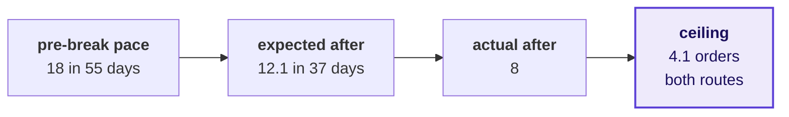
```mermaid
flowchart LR
    P["<b>pre-break pace</b><br/>18 in 55 days"] --> E["<b>expected after</b><br/>12.1 in 37 days"]
    E --> A["<b>actual after</b><br/>8"]
    A --> C["<b>ceiling</b><br/>4.1 orders<br/>both routes"]
    classDef known fill:#EEEAFB,stroke:#5B3FD6,color:#1A0F5C,stroke-width:2px
    class C known
```

**When to switch.** Write the rate route in the memo; draw the counting route, since a line bending away from its own pace is what a room can see.

```notes
LIVE, 2 minutes. The notebook draws the cumulative line against the pace and asserts the two routes
agree.
```

---

## S10. The memo: what we know, what we are guessing
*The claim, two hypotheses with the evidence that settles each, and a rival.*

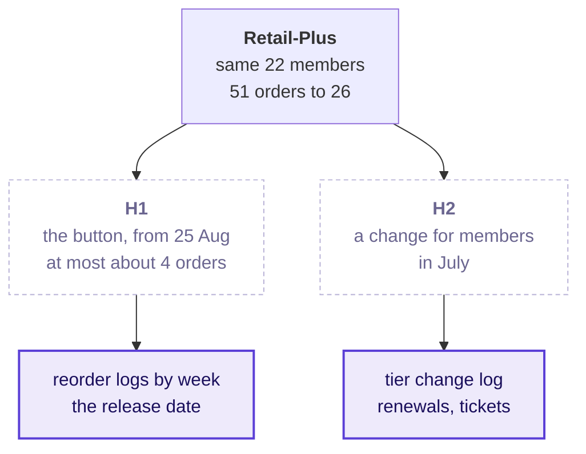
```mermaid
flowchart TB
    F["<b>Retail-Plus</b><br/>same 22 members<br/>51 orders to 26"] --> H1["<b>H1</b><br/>the button, from 25 Aug<br/>at most about 4 orders"]
    F --> H2["<b>H2</b><br/>a change for members<br/>in July"]
    H1 --> E1["reorder logs by week<br/>the release date"]
    H2 --> E2["tier change log<br/>renewals, tickets"]
    classDef unknown fill:#FFFFFF,stroke:#B8B2D6,color:#6B6690,stroke-dasharray:4 3
    classDef known fill:#EEEAFB,stroke:#5B3FD6,color:#1A0F5C,stroke-width:2px
    class H1,H2 unknown
    class E1,E2 known
```

**Kavya's review.** "You gave the tier a number for his cause, a ceiling of about 4 orders, instead of a yes or a no. Say what you know, then what you are guessing, and stop."

**In the interview.** [D] A stakeholder hands you a cause; how do you test it with the data you have and name the data you need?

```notes
LIVE, 4 minutes. The rival, a monsoon dip that hit members harder, goes on the same data request as
last year's Q2 by segment. One breath: restate as a hypothesis, test timing, then the comparison and
the channel, cap it, and name the data that settles it.
```

---

## SECTION 7: The escalated case
*The whole ladder again, alone, on the orders that reached customers.*

```notes
LIVE. The escalated case runs 50 minutes, unguided. Hand out
exercises/unguided/C2_W01_D02_escalated_case_STUDENT.md; learners work in
notebooks/C2_W01_D02_ex1_escalated_case_STUDENT.ipynb. The solution opens after the debrief.
```

---

## S11. Meera asks if the story survives delivery
*The board pack reports what reached customers and stayed, and one branch that held this morning moves.*

**The client asks.** "The board pack reports revenue on orders that reached the customer and stayed there. Does your story survive on delivered orders? Which branch, which segment, and what would you bet on?"

```timeline
label: Part 1 | title: Is the delivered drop real? | body: Filter to delivered orders; compare closed quarters.
label: Part 2 | title: The tree on delivered | body: A bridge in the tree's order; one branch that held now moves.
label: Part 3 | title: Are those lost customers? | body: Compare the delivered and the booked overlap.
label: Part 4 | title: Four segments, rolled up | body: tree_for, the weighted roll-up, every group counted.
label: Part 5 | title: Mix or rate on delivered | body: The split, and the sentence to Meera. | tone: dark
```

```notes
LIVE, 3 minutes to brief, then 47 of silent work. Walk the room from minute 10. The trap in part 3 is
the escalated one: customers with a delivered order fell from 54 to 50, and Marketing would read that
as churn. Do not hint at it.
```

---

## S12. What goes in, and what comes back
*Five parts, seven lettered choices in the notebook, and one line of letters posted at the end.*

```stats
value: 5 | label: parts | note: one item each in the brief
value: 7 | label: lettered TODOs | note: each with a check that says if it holds
value: 1 | label: sentence to Meera | note: branch, segment, hypotheses
```

**The rule.** Every number carries its definition: say "delivered" beside each one, and "booked" beside anything from this morning.

```notes
LIVE, 1 minute before work starts. Remind the room that the notebook stops at the first placeholder
until it is filled, which is intended.
```

---

## SECTION 8: The debrief of wrong answers
*The four wrong answers the room is most likely to have reached, with their exact numbers.*

```notes
LIVE. The debrief runs 15 minutes, before the break. Put each wrong answer up, ask who reached it,
and let a learner who avoided it say the check. Release the solution notebook in
exercises/solutions/ at the end.
```

---

## S13. Wrong answer 1: customers fell, Marketing wins
*On delivered orders customers fell from 54 to 50 and the bridge charges them Rs 10,74,442.*

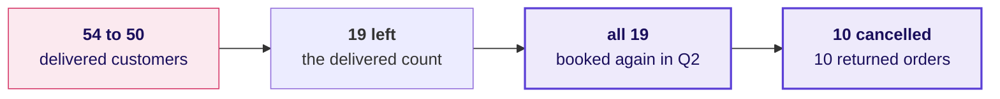
```mermaid
flowchart LR
    A["<b>54 to 50</b><br/>delivered customers"] --> B["<b>19 left</b><br/>the delivered count"]
    B --> C["<b>all 19</b><br/>booked again in Q2"]
    C --> D["<b>10 cancelled</b><br/>10 returned orders"]
    classDef bad fill:#FBE9EF,stroke:#D63A6A,color:#1A0F5C
    classDef known fill:#EEEAFB,stroke:#5B3FD6,color:#1A0F5C,stroke-width:2px
    class A bad
    class C,D known
```

**The check.** The booked overlap is 69, 0 and 0. The branch that moved is fulfilment, owned by operations, and acquisition still has nothing to replace.

```notes
LIVE, 4 minutes. Ask who wrote "customers fell 7.4 percent" in part 2 and stopped there. The part 3
set, (delivered Q1 minus delivered Q2) and booked Q2, finds all 19 still ordering.
```

---

## S14. Wrong answer 2: delivered frequency fell 9.2%
*The average of four delivered segment rates says minus 9.2 percent; the weighted figure says minus 24.0.*

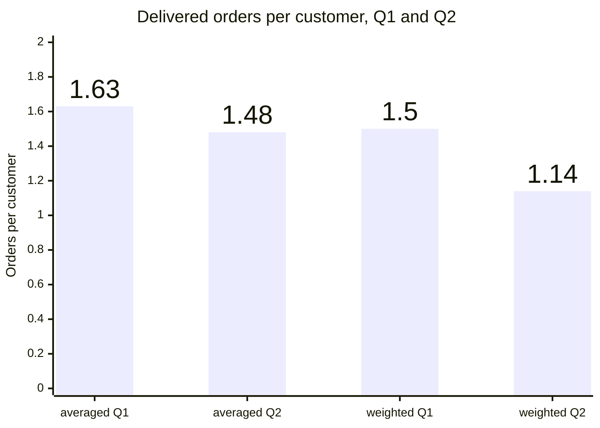
```mermaid
%%{init: {"xyChart": {"showDataLabel": true, "showDataLabelOutsideBar": true}}}%%
xychart-beta
    title "Delivered orders per customer, Q1 and Q2"
    x-axis ["averaged Q1", "averaged Q2", "weighted Q1", "weighted Q2"]
    y-axis "Orders per customer" 0 --> 2
    bar [1.63, 1.48, 1.50, 1.14]
```

**The check.** The roll-up must reproduce 81 orders over 54 customers and 57 over 50: 1.50 and 1.14.

```notes
LIVE, 3 minutes. The morning's trap in a new place. Anyone who averaged has the reason on the board
from chapter 3.
```

---

## S15. Wrong answer 3: mix is 44%, so prices rose
*On delivered orders the mix explains 44 percent of the rise, and some read the rest as a price rise.*

| Definition | Revenue per order rise | Mix share | Rate carried by |
|---|---|---|---|
| Booked | +18.0% | 69% | Business, one large order |
| Delivered | +26.0% | 44% | Business, delivered orders Rs 10,24,651 to Rs 11,60,405 |

**The check.** The rate part is Business's lakh-sized orders; the consumer segments' own delivered order values moved by about a hundred rupees at most, so there is still no consumer price signal.

```notes
LIVE, 4 minutes. The definition moved the split without creating a price rise anyone paid. Ask a
learner to read Retail-Plus delivered revenue per order: Rs 2,748 to Rs 2,806.
```

---

## S16. Wrong answer 4: a sentence with no definition
*"Revenue fell 11 percent" is true on both definitions, at 11.0 and 11.3, and says neither.*

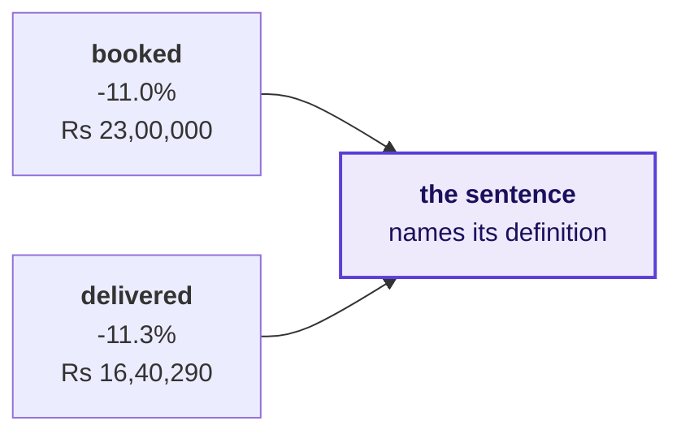
```mermaid
flowchart LR
    B["<b>booked</b><br/>-11.0%<br/>Rs 23,00,000"] --> S["<b>the sentence</b><br/>names its definition"]
    D["<b>delivered</b><br/>-11.3%<br/>Rs 16,40,290"] --> S
    classDef known fill:#EEEAFB,stroke:#5B3FD6,color:#1A0F5C,stroke-width:2px
    class S known
```

**Kavya's review.** "On delivered orders the story held: frequency, Retail-Plus at minus 42.6 percent per member, and the same two hypotheses. The branch that moved was fulfilment. Put the definition beside every number, and the solution is open now."

```notes
LIVE, 4 minutes, then the 10-minute break. Release the solution notebook.
```

---

## SECTION 9: The second case
*In pairs: Marketing's new deck, and the tier asks who to call first.*

```notes
LIVE. The second case runs 40 minutes in pairs: 3 to brief, 30 to work, 7 to hear two replies. Hand
out exercises/unguided/C2_W01_D02_second_case_STUDENT.md; the notebook is
notebooks/C2_W01_D02_ex2_second_case_STUDENT.ipynb.
```

---

## S17. Marketing's new deck, and the tier's call list
*One of each pair answers Marketing, the other the head of Retail-Plus, from the same file.*

```cards
icon: megaphone | eyebrow: Claim 1 | title: Student rose 40 percent | body: "Our campus push worked, so acquisition works."
icon: globe | eyebrow: Claim 2 | title: Web fell hardest | body: "Retail-Plus web orders fell 24 to 9, so it is the website team's problem."
icon: phone | eyebrow: The tier | title: Who do I call first? | body: "Which of my members do I call first?" | tone: dark
```

**The rule.** Find what each number is made of before you agree or disagree.

```notes
LIVE, 3 minutes to brief. Pairs split the roles, then write one reply together, with the one data
request that settles most.
```

---

## S18. What the pairs should reach
*Each claim, taken apart, and the call list with its size.*

| Claim | What it is made of | The reply |
|---|---|---|
| Student +40 percent | The same 2 customers, 5 orders to 7 | No new customer; a rate on 2 moves 50 percent per order |
| Web fell hardest | Retail-Core web held, 13 to 12, same website | A site-wide fault does not fit; members fell on every channel |
| Who to call first | 7 members went from 3 orders to 1 | Call the 7, then the 11 who fell by one |

**The one request.** The tier's July change log, renewals and support tickets, since the fall began in July; the reorder logs second.

```notes
LIVE, 7 minutes after the work. Hear two pairs' replies. Say that every member still ordered, which
fits a broken habit more than a tier people left.
```

---

## SECTION 10: The interview drill
*Twelve questions asked aloud, one breath each, the design question among them.*

```notes
LIVE. The drill runs 20 minutes. Ask each question aloud to a named learner, give one breath, then
read the model answer from the notes. Tags: [S] staple asked everywhere, [F] frequent in GCC and
product screens, [SV] service-major screen opener, [D] differentiator.
```

---

## S19. Questions 1 to 6: the ladder and the tree
*The row's anchors and the decomposition questions, where a plausible number is waiting.*

| Tag | Question |
|---|---|
| [S] | 1. Sales dropped 15 percent last month; how would you investigate? |
| [S] | 2. Why is a rate without a denominator meaningless? |
| [F] | 3. Why does a function that prints instead of returning break a pipeline? |
| [F] | 4. What has to match before a quarter-on-quarter comparison is fair? |
| [D] | 5. Marketing insists the answer is acquisition and your data says frequency; how do you make the case in the room? |
| [F] | 6. Revenue fell 11 percent; how do you split the change between customers, frequency and order value? |

```notes
LIVE, 10 minutes.
1. Confirm on matched windows, decompose into customers, orders per customer and revenue per order,
isolate the segment, split mix from rate, then name a hypothesis with its evidence, timing first.
2. Nobody can check it, compare it or know how many cases it rests on: 40 percent of five orders.
3. The caller gets None, and the next step crashes or silently drops that group.
4. Window length and dates, the definition, the population and the denominator; closed quarters, or
the same weeks of each; the season needs last year.
5. Test their claim in its own terms: the overlap shows none lost and none new; show where the fall
is; end on what would change my mind.
6. A bridge one leaf at a time in a fixed order; say the order, or use the symmetric split.
```

---

## S20. Questions 7 to 12: weights, churn and design
*The case-style follow-ups and the design questions that separate candidates.*

| Tag | Question |
|---|---|
| [F] | 7. Revenue per order rose 18 percent while revenue fell; did prices go up? |
| [S] | 8. A field is missing on some records; do you fill it with zero? |
| [F] | 9. You have orders per customer for four segments; why can't you average them? |
| [SV] | 10. The customer count is flat; does that prove no customers were lost? |
| [D] | 11. The same metrics are needed for every segment and quarter: copy, function or group by key? |
| [D] | 12. A stakeholder hands you a cause; how do you test it and name the data you need? |

```notes
LIVE, 10 minutes.
7. Mostly mix: small orders fell away; 69 percent of the rise on booked orders.
8. No: absent is unknown; count it, report it, write the rule, bound it.
9. Each rate has its own denominator; total over total reproduces the company figure.
10. No: compare ids, lost and new; here 69, 0 and 0.
11. A function when groups are asked one at a time and definitions change; one pass by key when the
file is large and every group is needed at once.
12. Timing first, then a comparison group, then the channel it predicts; cap it; request the data
that settles it.
```

---

## SECTION 11: The close
*The Kahoot, the sentence to Meera, the eight lines to keep, and tomorrow's question.*

```notes
LIVE. The close runs 15 minutes: Kahoot 8, the sentence and the lines 5, tomorrow's question 2.
```

---

## S21. The sentence that goes to Meera
*A claim, its evidence, its caveat and the next step, in the order she needs them.*

> "Revenue fell 11.0 percent between two closed quarters, Rs 2.10 crore to Rs 1.87 crore on the export as it stands. Customers held at 69, every one of them buying in both quarters, so acquisition is not the branch that moved; orders per customer fell from 1.65 to 1.25. In behaviour the fall sits in Retail-Plus, where the same 22 members placed 26 orders against 51, and revenue per order rose mainly because those small orders disappeared. In rupees most of it is three fewer Business orders, which tomorrow's reconciliation checks. The fall began in July, before the reorder button broke, so the button explains at most about 4 orders; we are asking for the tier's July change log and the app's reorder logs." The data and AI team, to Meera Raghavan

```notes
LIVE, 2 minutes after the Kahoot. Read it aloud once, slowly. Ask one learner which part their own
sentence missed; most miss the ceiling or the data to ask for. The Kahoot pack is
kahoot/C2_W01_D02_quiz_STUDENT.md, eight items, ungraded.
```

---

## S22. Eight lines to keep
*The day's rules, word for word as the cheat sheet prints them.*

1. Confirm the drop on matched windows before you explain it.
2. A rate without its denominator is a rumour.
3. Decompose along the tree: customers, orders per customer, revenue per order.
4. Missing means unknown until someone chooses a default and writes down why.
5. Roll a rate up with its weights; never average the averages.
6. A blended rate can move while no segment moves; split mix from rate.
7. A function returns its answer; count the groups in and the groups out.
8. Name the cause as a hypothesis, with its ceiling and the evidence that would settle it.

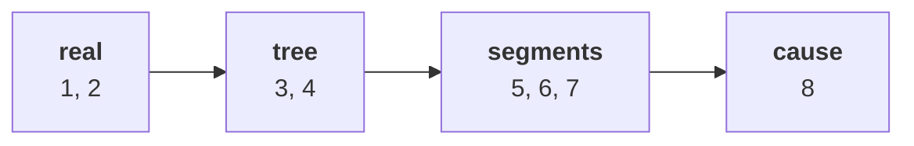
```mermaid
flowchart LR
    A["<b>real</b><br/>1, 2"] --> B["<b>tree</b><br/>3, 4"] --> C["<b>segments</b><br/>5, 6, 7"] --> D["<b>cause</b><br/>8"]
```

```notes
LIVE, 3 minutes. Read the eight lines aloud with the room. The chain maps them onto the chapters.
```

---

## S23. Tomorrow, Anand questions tonight's numbers
*Finance's books and the dashboard disagree about Q1, and the answer waits for Wednesday.*

> "Your dashboard says Q1 was Rs 2.1 crore. Our books say 1.9. Until your numbers match ours, Finance will not act on a drop measured from an ERP export. Send me a reconciliation." Anand Iyer, finance controller, Kalpa Retail

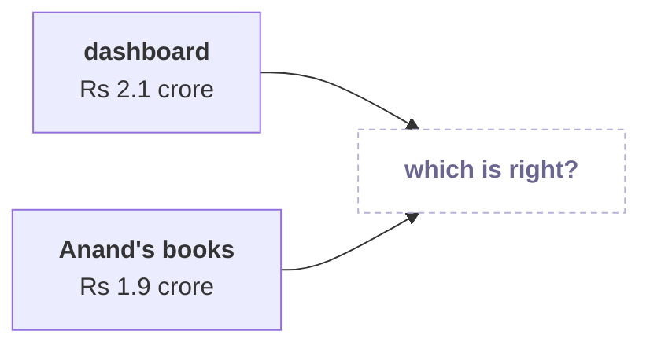
```mermaid
flowchart LR
    D["<b>dashboard</b><br/>Rs 2.1 crore"] --> Q["<b>which is right?</b>"]
    B["<b>Anand's books</b><br/>Rs 1.9 crore"] --> Q
    classDef unknown fill:#FFFFFF,stroke:#B8B2D6,color:#6B6690,stroke-dasharray:4 3
    class Q unknown
```

```notes
LIVE, 2 minutes. Read Anand's line and stop. Do not predict the answer. Every number today was on the
export as it stands; point to the take-home brief. The TA-led practice lab follows.
```
