# Did the reorder button do it?

Week 1, Day 2. Half two.

Kicker: WEEK 1  ·  TUESDAY  ·  HALF TWO
Quote: It is the broken reorder button. One of my members says it has been broken for six weeks.
Who: The head of Retail-Plus, Kalpa's paid membership tier

```notes
LIVE, inside chapter 6's first minute. The afternoon opens on chapter 6, the cause the head of
Retail-Plus hands us, then the escalated case, the debrief, the second case, the drill and the
close. The next slide carries what the morning settled.
```

---

## S1. The morning found the branch, the tier and the mix
*What did the morning settle, and what is still open?*

| Chapter | The question | The answer |
|---|---|---|
| 1 | Is the drop real? | Yes: minus 11.0 percent, Rs 23,00,000, on two closed quarters |
| 2 | Which branch moved? | Orders per customer, 1.65 to 1.25, while customers held at 69 |
| 3 | Which segment moved? | Retail-Plus: the same 22 members, 51 orders to 26 |
| 4 | Did customers pay more? | No: 69 percent of the rise in revenue per order is mix |
| 5 | Were customers lost? | None lost, none new; 23 slowed, 18 of them members |
| 6 | Did the button do it? | Still open, and the afternoon's first chapter |

```notes
LIVE, 1 minute. Read the five answers in one breath each. Revenue here is booked revenue, every
order placed before any cancellation or return. The Business rupees, three fewer lakh-sized orders,
sit beside the Retail-Plus behaviour in every sentence to Meera. Then chapter 6.
```

---

## SECTION 6: Did the button do it?
*How much of the Retail-Plus fall can the broken reorder button explain, and what evidence goes in Meera's memo?*

```notes
LIVE. Chapter 6 runs 30 minutes with the cover and the recap: 1 on the map, 3 on the need and Sonos,
5 on the options and the picture, 2 on count_by, 3 on the monthly line, 7 on the trap, its window
and the ceiling, 3 on the season and the channel, 2 on the second route, 3 on the memo and the
close. Open notebooks/C2_W01_D02_06_the_memo_STUDENT.ipynb. The chapter opener is numbered 6 on
purpose; it continues the morning's five.
```

---

## S2. Answered in six questions, before the memo goes
*Who needs this answer, and which smaller questions lead to it?*

**Who needs the answer.** The head of Retail-Plus and engineering decide what to fix first, and Meera decides what the board hears as the cause. Blame the button for everything and the tier keeps falling for a reason nobody looked for; dismiss it and members keep failing to reorder.

```timeline
label: 1 | title: Which tests, in what order? | body: Four tests of a cause
label: 2 | title: When did orders drop? | body: Retail-Plus, month by month
label: 3 | title: How many did it cost? | body: The hurried memo, tested
label: 4 | title: Was it the season? | body: A segment the button cannot touch
label: 5 | title: Only the app? | body: The channel the cause predicts
label: 6 | title: Does a corrected pace agree? | body: A second route | tone: dark
```

```notes
LIVE, 1 minute. Read the six questions. The memo that closes the chapter answers the chapter's own
question. Then the cause the tier hands us.
```

---

## S3. The tier blames the button; Meera wants a page
*What does the tier claim, and what does Meera need on one page?*

**The client asks.** "Which branch, which segment, and what you would bet on. Tell me what you know and what you are guessing." (Meera Raghavan)

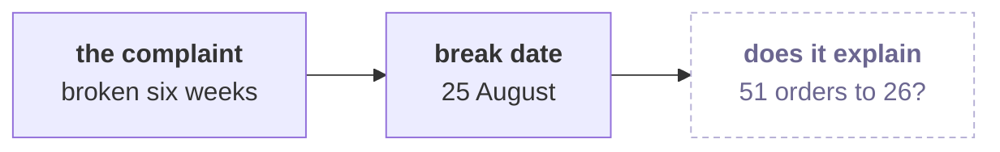
```mermaid
flowchart LR
    C["<b>the complaint</b><br/>broken six weeks"] --> B["<b>break date</b><br/>25 August"]
    B --> Q["<b>does it explain</b><br/>51 orders to 26?"]
    classDef unknown fill:#FFFFFF,stroke:#B8B2D6,color:#6B6690,stroke-dasharray:4 3
    class Q unknown
```

```notes
LIVE, 2 minutes. The metric at stake is Retail-Plus orders per week before and after the break. Six
weeks back from the week of 6 October is 25 August; say it is the complaint taken at its word. A
wrong answer costs a quarter: blame the button for everything, fix it, and the tier keeps falling.
Then a company that put a broken app into its numbers.
```

---

## S4. Sonos tied an app rollout to its guidance
*Has a real company put a broken app into its numbers?*

```stats
value: 2024 | label: redesigned app rolled out | note: the problems it caused
value: FY2024 | label: guidance reduced | note: the CEO tied it to the app's rollout
value: up to $30 m | label: short-term cost to fix | note: set out in the annual report
```

**The claim.** A company can put a broken app into its numbers, and the head of Retail-Plus is asking whether his tier is the same story. Guidance is the revenue a company tells investors to expect.

```notes
LIVE, 1 minute. Sources checked 30 Sep 2026: Sonos third quarter fiscal 2024 results (the chief
executive's statement that the app's rollout required a reduced fiscal 2024 guidance) and the fiscal
2024 annual report on Form 10-K (short-term costs of up to $30 million). No revenue figure for the
app's effect was verified on a primary page, so none is quoted. Then four ways to test a cause.
```

---

## S5. Timing first, then a segment and the channel
*Which of four tests of a cause run today, and in which order?*

| Option | Reads | Can rule out |
|---|---|---|
| A. Before and after the break | Retail-Plus orders, by date | The button as the whole story |
| B. A comparison segment | Retail-Core, same months | A season that hit everyone |
| C. The channel it predicts | Retail-Plus orders by channel | An app-only cause |
| D. The app's reorder logs | A data request | Nothing today; it settles it later |

**The call.** A, B and C now, D requested today. **What would change it:** if the break turned out to be in June, A's verdict flips, and D's release date is how we would learn it.

```notes
LIVE, 3 minutes. A cause cannot come after its effect, so timing leads. Each of A to C reads the
export already open in milliseconds; D is days away. Then what the button predicts.
```

---

## S6. A cause predicts when, where and whom it hits
*What does a broken reorder button predict that the export can test?*

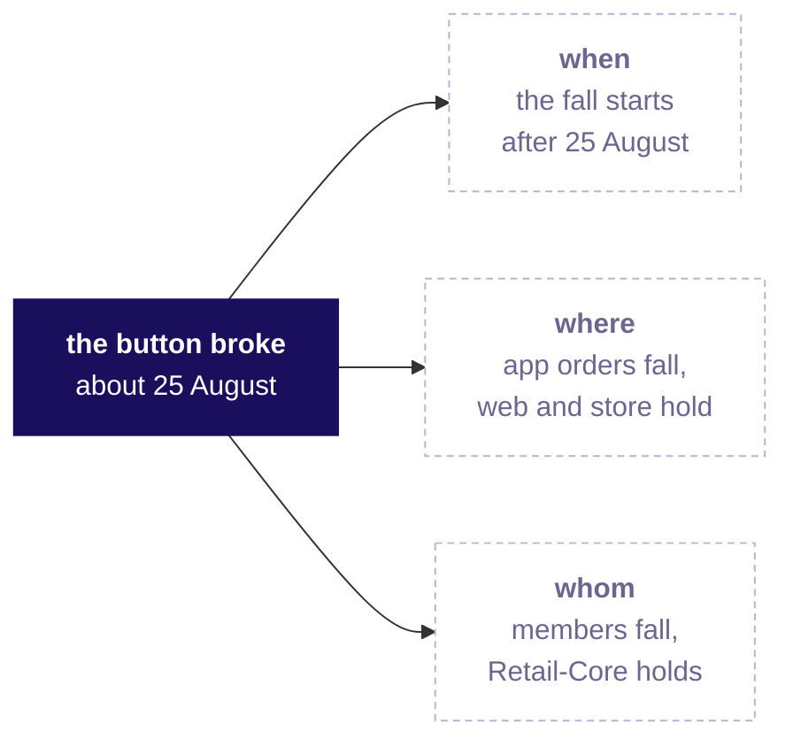
```mermaid
flowchart LR
    B["<b>the button broke</b><br/>about 25 August"] --> T["<b>when</b><br/>the fall starts<br/>after 25 August"]
    B --> W["<b>where</b><br/>app orders fall,<br/>web and store hold"]
    B --> M["<b>whom</b><br/>members fall,<br/>Retail-Core holds"]
    classDef bet fill:#1A0F5C,stroke:#1A0F5C,color:#FFFFFF
    classDef unknown fill:#FFFFFF,stroke:#B8B2D6,color:#6B6690,stroke-dasharray:4 3
    class B bet
    class T,W,M unknown
```

**The rule.** Restate the cause as a mechanism and test each thing it predicts, timing first. A test the data can pass or fail is worth more than an opinion about the cause.

```notes
LIVE, 2 minutes. Draw the three predictions on the board and leave the boxes empty; the next slides
fill them. Then the function that counts by any key.
```

---

## S7. count_by grows chapter 1's accumulator to any key
*How do we count orders by month, or by channel, with one function?*

```python
def count_by(rows, key):
    """Count the rows under whatever key(row) returns."""
    counts = {}
    for row in rows:
        k = key(row)
        counts[k] = counts.get(k, 0) + 1
    return counts

plus_month = count_by(plus, lambda o: o["order_date"][:7])     # "2026-07"
plus_channel = count_by(plus, lambda o: o["channel"])          # "app", "web", "store"
```

**The rule.** The key is handed in as a small function, so the same counter answers "by month" and "by channel" without a second loop.

```notes
LIVE, 2 minutes. lambda o: o["channel"] is a one-line function with no name, handed in as the key.
The dictionary and .get with a default of 0 are chapter 2's; the default is right here for the same
reason: a month not seen yet has no orders so far. Then the prediction.
```

---

## S8. Question: when did the tier drop below Q1?
*Retail-Plus orders by month, with Retail-Core beside it: when did the tier fall below every Q1 month?*

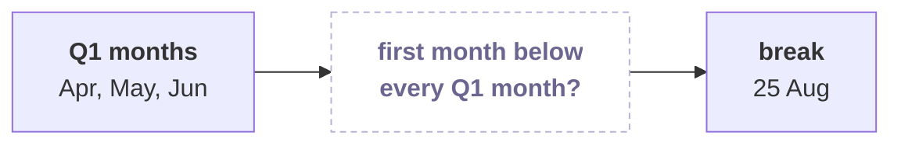
```mermaid
flowchart LR
    Q1["<b>Q1 months</b><br/>Apr, May, Jun"] --> X["<b>first month below<br/>every Q1 month?</b>"]
    X --> B["<b>break</b><br/>25 Aug"]
    classDef unknown fill:#FFFFFF,stroke:#B8B2D6,color:#6B6690,stroke-dasharray:4 3
    class X unknown
```

**Question.** a) September, after the break; b) August, when it broke; c) July, before it broke; d) never.

```notes
LIVE, 1 minute. Take letters, then run the monthly cell with count_by.
```

---

## S9. Answer: July, weeks before the button broke
*Retail-Plus orders by month, with Retail-Core beside it: when did the tier fall below every Q1 month?*

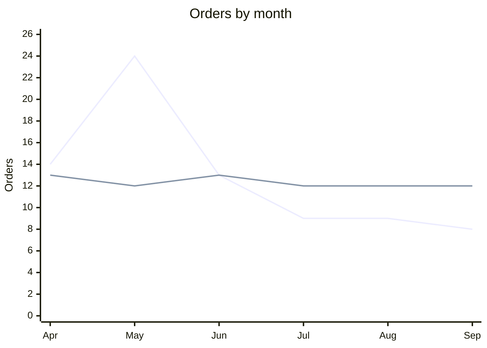
```mermaid
%%{init: {"xyChart": {"showLegend": true}}}%%
xychart-beta
    title "Orders by month"
    x-axis ["Apr", "May", "Jun", "Jul", "Aug", "Sep"]
    y-axis "Orders" 0 --> 26
    line "Retail-Plus" [14, 24, 13, 9, 9, 8]
    line "Retail-Core" [13, 12, 13, 12, 12, 12]
```

**The check.** July's 9 Retail-Plus orders sit below every Q1 month, whose lowest was 13, while Retail-Core held level. The answer is c.

```notes
LIVE, 2 minutes. The line that falls from 13 to 9 in July is Retail-Plus; the level line is
Retail-Core. The button may still matter; it cannot be the whole story. Keep to the Q2 months. Then
the memo a hurried analyst would write anyway.
```

---

## S10. The plausible wrong answer: the button cost 25
*What does a hurried memo charge the button with?*

```stats
value: 25 | label: orders the button "cost" | note: 51 in Q1 less 26 in Q2
value: Rs 65,250 | label: rupees the button "cost" | note: the whole tier's fall
value: 0 | label: days checked before the break | note: the missing check
```

**What breaks.** Engineering is told the fix recovers 25 orders a quarter; it ships, recovers a handful, and the tier's real problem has had another quarter to run.

```notes
LIVE, 2 minutes. The chapter's trap. The comparison spans the whole quarter, so it charges the button
with about eight weeks of orders lost before it broke. Then why it is wrong.
```

---

## S11. Why it is wrong: the pace fell before the break
*What happens to the tier's pace when Q2 is split at the break?*

| Window | Days | Orders | Per week |
|---|---|---|---|
| Q1, 1 Apr to 30 Jun | 91 | 51 | 3.92 |
| Q2, 1 Jul to 24 Aug | 55 | 18 | 2.29 |
| Q2, 25 Aug to 30 Sep | 37 | 8 | 1.51 |

**Why it is wrong.** The tier's pace had fallen by more than a third before the button broke, so the whole-quarter comparison charges the button with orders lost in July and August. **The check** is chapter 1's lesson: a rate with its window.

```notes
LIVE, 2 minutes. Split Q2 at the break and give each side its window. Point at the middle row: 2.29
orders a week against Q1's 3.92, before anything broke. Then the ceiling.
```

---

## S12. The fix: a ceiling of about 4, far below 25
*How many orders can the button have cost, and on which baseline?*

| Pace before the break | Orders | Expected in the 37 days after | Placed | Button's ceiling |
|---|---|---|---|---|
| 55 days, 1 Jul to 24 Aug | 18 | 12.1 | 8 | about 4, about Rs 12,400 |
| 37 days, 19 Jul to 24 Aug | 15 | 15.0 | 8 | 7.0 |
| The hurried memo | | | | 25 |

**What changed.** "The button cost 25 orders" became "at most about 4 on the tier's pace over the 55 days before the break, and 7.0 on the 37 days just before it". Either way the ceiling sits far below 25, so the call holds: the rest needs another cause, and the memo names the baseline it used.

```notes
LIVE, 3 minutes. At the pre-break pace of 18 orders in 55 days, the 37 days after the break would
have carried about 12.1 orders; the tier placed 8, so the button explains at most about 4.1 orders,
about Rs 12,400 at Q2's Retail-Plus revenue per order. It is a ceiling, since anything else that kept
worsening would claim part of it. The ceiling rests on its baseline: over only the 37 days just
before the break, a window as long as the one after it, the tier placed 15 orders, and the ceiling
would be 7.0. The memo keeps the headline of about 4 on the stated 55-day baseline and says so;
either figure is far below the 25 the hurried memo charges. Engineering still fixes the button; the
memo stops promising it fixes the tier. Notebook 06's depth section asks learners to rerun this.
Then two rival causes.
```

---

## S13. Neither a season nor an app-only fault fits
*Could a season that hit everyone, or an app-only fault, explain the fall instead?*

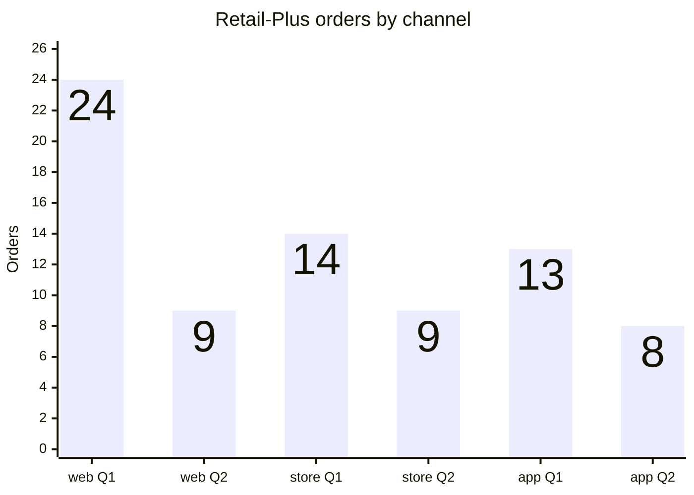
```mermaid
%%{init: {"xyChart": {"showDataLabel": true}}}%%
xychart-beta
    title "Retail-Plus orders by channel"
    x-axis ["web Q1", "web Q2", "store Q1", "store Q2", "app Q1", "app Q2"]
    y-axis "Orders" 0 --> 26
    bar [24, 9, 14, 9, 13, 8]
```

**What it says.** Retail-Core kept 95 percent of its Q1 orders and Retail-Plus 51, so an across-the-board season does not fit; every channel fell, so an app-only cause does not fit. A season that hit members harder still fits, and last year's Q2 by segment tests it.

```notes
LIVE, 3 minutes. Two predictions tested, two rivals capped. July opens the monsoon quarter, so a
seasonal dip would also begin in July, which is why the comparison segment matters. Something
touched members in every channel. Then a second route to the button's share.
```

---

## S14. Corrected by Retail-Core, the button gets about 3.5
*Does the pace corrected by Retail-Core's own change stay inside the ceiling?*

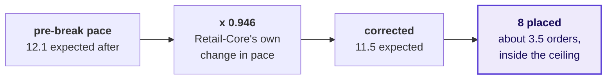
```mermaid
flowchart LR
    P["<b>pre-break pace</b><br/>12.1 expected after"] --> R["<b>x 0.946</b><br/>Retail-Core's own<br/>change in pace"]
    R --> E["<b>corrected</b><br/>11.5 expected"]
    E --> C["<b>8 placed</b><br/>about 3.5 orders,<br/>inside the ceiling"]
    classDef known fill:#EEEAFB,stroke:#5B3FD6,color:#1A0F5C,stroke-width:2px
    class C known
```

**When to switch.** Write the ceiling in the memo, since it assumes nothing about any other segment; bring the corrected route when someone argues for the season.

```notes
LIVE, 2 minutes. Retail-Core placed 22 orders in the 55 days before 25 August and 14 in the 37 after,
a pace 0.946 of what it had been. Scale the tier's expected 12.1 by it: 11.5, against 8 placed, about
3.5 orders. The route could have come out above the ceiling of 4.1 and lands below it, which is what
a ceiling predicts. The notebook also draws the tier's cumulative Q2 orders against the pre-break
pace. Then the memo.
```

---

## S15. Two hypotheses, each with the data that settles it
*What goes in Meera's memo, and what settles each hypothesis?*

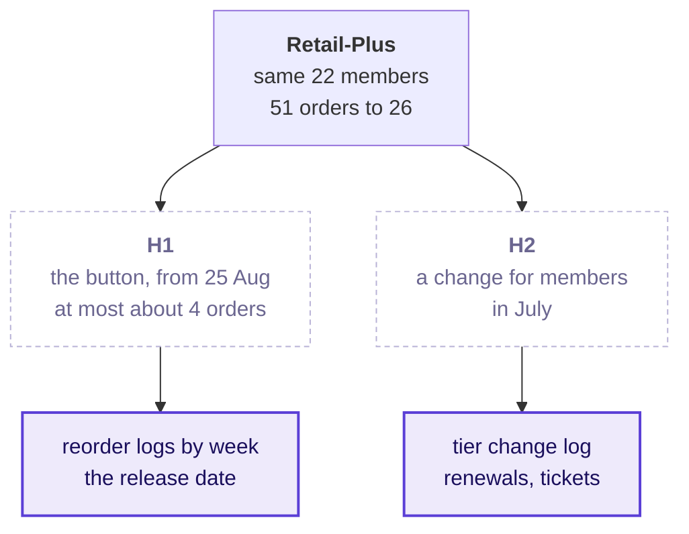
```mermaid
flowchart TB
    F["<b>Retail-Plus</b><br/>same 22 members<br/>51 orders to 26"] --> H1["<b>H1</b><br/>the button, from 25 Aug<br/>at most about 4 orders"]
    F --> H2["<b>H2</b><br/>a change for members<br/>in July"]
    H1 --> E1["reorder logs by week<br/>the release date"]
    H2 --> E2["tier change log<br/>renewals, tickets"]
    classDef unknown fill:#FFFFFF,stroke:#B8B2D6,color:#6B6690,stroke-dasharray:4 3
    classDef known fill:#EEEAFB,stroke:#5B3FD6,color:#1A0F5C,stroke-width:2px
    class H1,H2 unknown
    class E1,E2 known
```

**The rule.** What we know comes first and what we are guessing second, and each guess carries the data that would settle it. The rival, a monsoon dip that hit members harder, goes on the same request as last year's Q2 by segment.

```notes
LIVE, 2 minutes. Neither cause is proved or disproved by this export; each is a hypothesis settled
by data Kalpa holds elsewhere. The memo's claim, which the notebook prints in full, ends on the
request for all three. Then the chapter's answer.
```

---

## S16. At most about 4 orders: the fall began in July
*Did the button do it, and what did each question on the way answer?*

| Question | Answer |
|---|---|
| 1. Which tests, in what order? | Timing, a segment, the channel; the logs requested |
| 2. When did orders drop? | July, weeks before the 25 August break |
| 3. How many did it cost? | At most about 4 orders; 7.0 on the shorter baseline |
| 4. Was it the season? | No: Retail-Core kept 95 percent of its orders |
| 5. Only the app? | No: web, store and app all fell |
| 6. Does a corrected pace agree? | Yes: about 3.5 orders, inside the ceiling |

**Kavya's review.** "You gave the tier a number for his cause, a ceiling of about 4 orders, and named the data that would settle it. Say what you know, then what you are guessing, and stop."

**In the interview.** [D] A stakeholder hands you a cause; how do you test it with the data you have and name the data you need?

```notes
LIVE, 1 minute. One breath: restate as a hypothesis, test timing, then the comparison and the
channel, cap it, and name the data that settles it. The ceiling's baseline goes in the same breath:
about 4 on the 55 days before the break, 7.0 on the 37 just before it, both far below 25.
```

---

## SECTION 7: Does it survive delivery?
*Does the story survive when revenue counts only the orders that reached customers and stayed?*

```notes
LIVE. The escalated case runs 50 minutes, unguided. Hand out
exercises/unguided/C2_W01_D02_escalated_case_STUDENT.md; learners work in
notebooks/C2_W01_D02_ex1_escalated_case_STUDENT.ipynb. The solution opens after the debrief.
```

---

## S17. Answer it in five parts, on delivered orders
*What does Meera ask about delivered orders, and in what order do you answer it?*

**The client asks.** "The board pack reports revenue on orders that reached the customer and stayed there. Does your story survive on delivered orders? Which branch, which segment, and what would you bet on?"

```timeline
label: Part 1 | title: Is the delivered drop real? | body: Filter to delivered orders; compare closed quarters.
label: Part 2 | title: Which branch moves? | body: A bridge in the tree's order, one leaf at a time.
label: Part 3 | title: Are those lost customers? | body: Find out what the customers who left the count did in Q2.
label: Part 4 | title: Which segment moves? | body: tree_for per segment, the rate rolled up, every group counted.
label: Part 5 | title: Mix or rate? | body: The split, and the sentence to Meera. | tone: dark
```

```notes
LIVE, 3 minutes to brief, then 47 of silent work. The board pack is the set of numbers the board
reads. Walk the room from minute 10. The trap in part 3 is the escalated one: customers with a
delivered order fell from 54 to 50, and Marketing would read that as churn. Do not hint at it.
```

---

## S18. Seven lettered choices, each checked, one sentence
*What do you hand in, and how do you know each choice holds?*

```stats
value: 5 | label: parts | note: one item each in the brief
value: 7 | label: lettered TODOs | note: each with a check that says if it holds
value: 1 | label: sentence to Meera | note: branch, segment, hypotheses
```

**The rule.** Every number carries its definition: say "delivered" beside each one, and "booked" beside anything from this morning.

```notes
LIVE, inside the 3-minute brief, before work starts. Remind the room that the notebook stops at the
first placeholder until it is filled, which is intended.
```

---

## SECTION 8: Where did we go wrong?
*Which wrong answers did the room reach on delivered orders, and which check catches each?*

```notes
LIVE. The debrief runs 15 minutes, before the break. Put each wrong answer up, ask who reached it,
and let a learner who avoided it say the check. Release the solution notebook in
exercises/solutions/ at the end.
```

---

## S19. Answer: four wrong answers, four morning checks
*Which wrong answers do most rooms reach on delivered orders, and what catches each?*

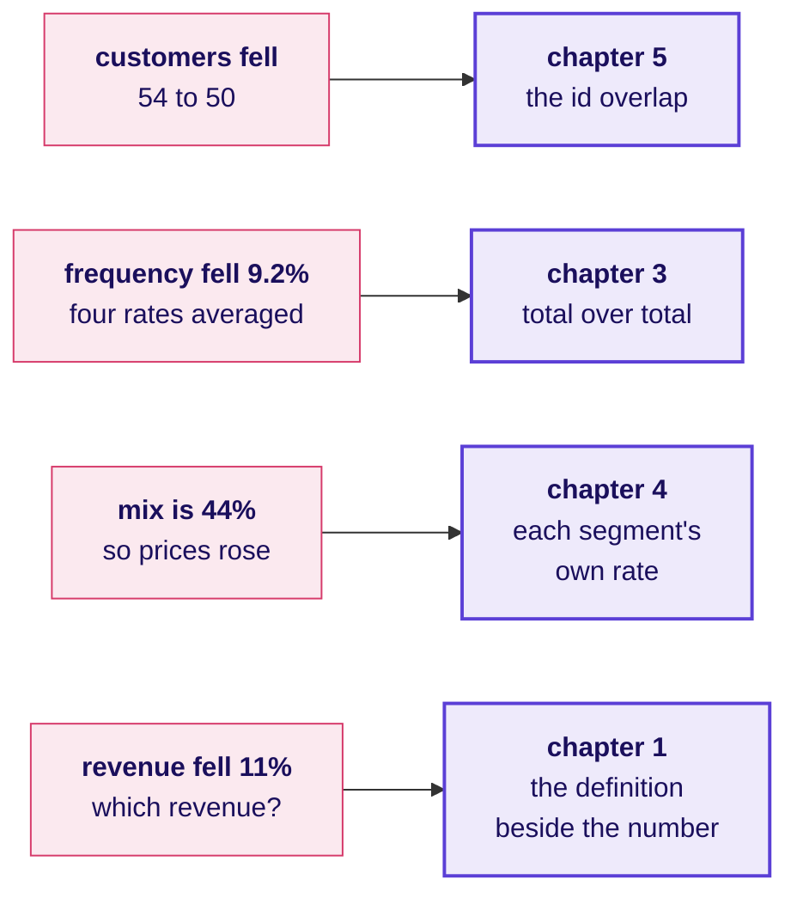
```mermaid
flowchart LR
    W1["<b>customers fell</b><br/>54 to 50"] --> C5["<b>chapter 5</b><br/>the id overlap"]
    W2["<b>frequency fell 9.2%</b><br/>four rates averaged"] --> C3["<b>chapter 3</b><br/>total over total"]
    W3["<b>mix is 44%</b><br/>so prices rose"] --> C4["<b>chapter 4</b><br/>each segment's<br/>own rate"]
    W4["<b>revenue fell 11%</b><br/>which revenue?"] --> C1["<b>chapter 1</b><br/>the definition<br/>beside the number"]
    classDef bad fill:#FBE9EF,stroke:#D63A6A,color:#1A0F5C
    classDef known fill:#EEEAFB,stroke:#5B3FD6,color:#1A0F5C,stroke-width:2px
    class W1,W2,W3,W4 bad
    class C1,C3,C4,C5 known
```

**The rule.** Each wrong answer is a morning trap in a new place, and the morning's check catches it.

```notes
LIVE, 2 minutes. Ask for hands on each box before the detail slides. Then the first.
```

---

## S20. Wrong answer 1: customers fell, Marketing wins
*Did delivered customers really fall from 54 to 50?*

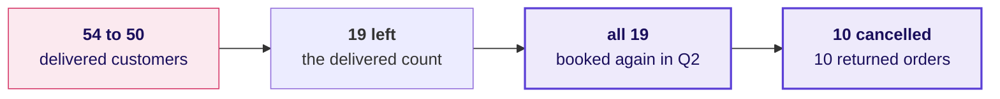
```mermaid
flowchart LR
    A["<b>54 to 50</b><br/>delivered customers"] --> B["<b>19 left</b><br/>the delivered count"]
    B --> C["<b>all 19</b><br/>booked again in Q2"]
    C --> D["<b>10 cancelled</b><br/>10 returned orders"]
    classDef bad fill:#FBE9EF,stroke:#D63A6A,color:#1A0F5C
    classDef known fill:#EEEAFB,stroke:#5B3FD6,color:#1A0F5C,stroke-width:2px
    class A bad
    class C,D known
```

**The check.** The booked overlap is 69, 0 and 0. The branch that moved is cancellations and returns, to be split by reason, and acquisition still has nothing to replace.

```notes
LIVE, 3 minutes. On delivered orders the bridge charges the customers branch Rs 10,74,442. Ask who
wrote "customers fell 7.4 percent" in part 2 and stopped there. The part 3 set, (delivered Q1 minus
delivered Q2) and booked Q2, finds all 19 still ordering.
```

---

## S21. Wrong answer 2: delivered frequency fell 9.2%
*How far did delivered orders per customer fall, weighted by customers?*

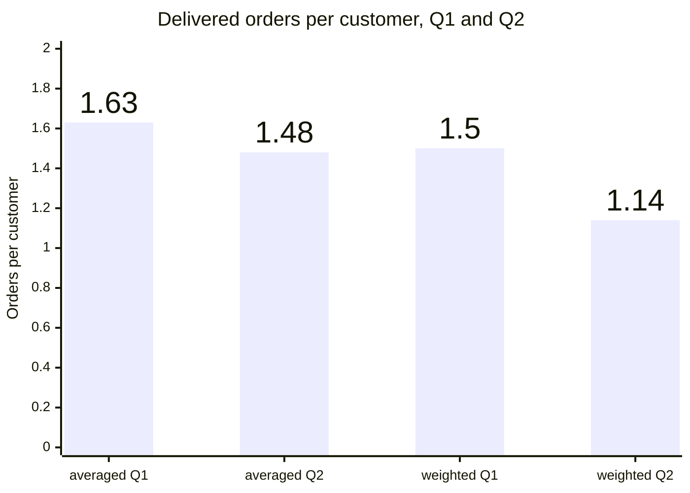
```mermaid
%%{init: {"xyChart": {"showDataLabel": true, "showDataLabelOutsideBar": true}}}%%
xychart-beta
    title "Delivered orders per customer, Q1 and Q2"
    x-axis ["averaged Q1", "averaged Q2", "weighted Q1", "weighted Q2"]
    y-axis "Orders per customer" 0 --> 2
    bar [1.63, 1.48, 1.50, 1.14]
```

**The check.** The roll-up must reproduce 81 orders over 54 customers and 57 over 50: 1.50 and 1.14, minus 24.0 percent, where the average of four segment rates says minus 9.2.

```notes
LIVE, 3 minutes. The morning's trap in a new place. Anyone who averaged has the reason on the board
from chapter 3.
```

---

## S22. Wrong answer 3: mix is 44%, so prices rose
*Does a smaller mix share on delivered orders mean prices rose?*

| Definition | Revenue per order rise | Mix share | Rate carried by |
|---|---|---|---|
| Booked | +18.0% | 69% | Business, one large order |
| Delivered | +26.0% | 44% | Business, delivered orders Rs 10,24,651 to Rs 11,60,405 |

**The check.** The rate part is Business's lakh-sized orders; the consumer segments' own delivered order values moved by about a hundred rupees at most, so there is still no consumer price signal.

```notes
LIVE, 3 minutes. The definition moved the split without creating a price rise anyone paid. Ask a
learner to read Retail-Plus delivered revenue per order: Rs 2,748 to Rs 2,806.
```

---

## S23. Wrong answer 4: a sentence with no definition
*What does "revenue fell 11 percent" leave out?*

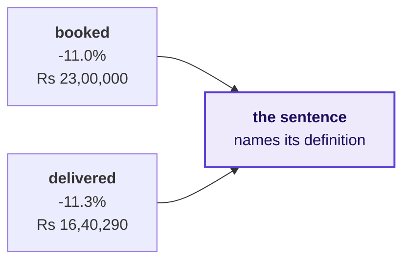
```mermaid
flowchart LR
    B["<b>booked</b><br/>-11.0%<br/>Rs 23,00,000"] --> S["<b>the sentence</b><br/>names its definition"]
    D["<b>delivered</b><br/>-11.3%<br/>Rs 16,40,290"] --> S
    classDef known fill:#EEEAFB,stroke:#5B3FD6,color:#1A0F5C,stroke-width:2px
    class S known
```

**Kavya's review.** "On delivered orders the story held: frequency, Retail-Plus at minus 42.6 percent per member, and the same two hypotheses. The branch that moved was fulfilment, getting orders to customers intact. Put the definition beside every number, and the solution is open now."

```notes
LIVE, 4 minutes, then the 10-minute break. "Revenue fell 11 percent" is true on both definitions, at
11.0 and 11.3, and says neither. Release the solution notebook.
```

---

## SECTION 9: Is the tier healthy?
*Marketing's new deck says members spend 7 percent more per order and the web fell hardest: does either claim hold, and whom does the tier call first?*

```notes
LIVE. The second case runs 40 minutes in pairs: 3 to brief, 30 to work, 7 to hear two replies. Hand
out exercises/unguided/C2_W01_D02_second_case_STUDENT.md; the notebook is
notebooks/C2_W01_D02_ex2_second_case_STUDENT.ipynb.
```

---

## S24. Answer it in pairs: two claims and a call list
*What do Marketing and the tier each claim, from the same file?*

```cards
icon: megaphone | eyebrow: Claim 1 | title: 7 percent more per order | body: "Members spend more each time, so the tier is healthy."
icon: globe | eyebrow: Claim 2 | title: Web fell hardest | body: "Retail-Plus web orders fell 24 to 9, so it is the website team's problem."
icon: phone | eyebrow: The tier | title: Who do I call first? | body: "Which of my members do I call first?" | tone: dark
```

**The rule.** Find what each number is made of before you agree or disagree.

```notes
LIVE, 3 minutes to brief. Pairs split the roles, one answering Marketing and one the head of
Retail-Plus, then write one reply together, with the one data request that tests the most.
```

---

## S25. Tier revenue fell about 45 percent: call 7 first
*What does each claim come to, and whom does the tier call first?*

| Claim | What it is made of | The reply |
|---|---|---|
| 7 percent more per order | The same 22 members at about half the orders: 1.000 x 0.510 x 1.070, about 0.55 | Tier revenue fell about 45 percent; one leaf that rose is not the tier |
| Web fell hardest | Retail-Core web held, 13 to 12, same website | A site-wide fault does not fit; members fell on every channel |
| Who to call first | 7 members went from 3 orders to 1 | Call the 7, then the 11 who fell by one |

**The one request.** The tier's July change log, renewals and support tickets, since the fall began in July; the reorder logs second.

```notes
LIVE, 7 minutes after the work. Hear two pairs' replies. The tier's Q2 revenue over its Q1 revenue,
counted directly, is 0.545; the rounded leaves multiply to about 0.55. Say that every member still
ordered, which fits a broken habit more than a tier people left.
```

---

## SECTION 10: Can you say it aloud?
*Can you answer the day's twelve interview questions in one breath each, the design questions among them?*

```notes
LIVE. The drill runs 20 minutes. Ask each question aloud to a named learner, give one breath, then
read the model answer from the notes. Tags: [S] staple asked everywhere, [F] frequent in GCC and
product screens, [SV] service-major screen opener, [D] differentiator.
```

---

## S26. Answer the ladder and the tree first: six questions
*Which six questions does every analytics screen ask about a sales drop?*

| Tag | Question |
|---|---|
| [S] | 1. Sales dropped 15 percent last month; how would you investigate? |
| [S] | 2. Why is a rate without a denominator meaningless? |
| [F] | 3. Why does a function that prints instead of returning break a pipeline? |
| [F] | 4. What has to match before a quarter-on-quarter comparison is fair? |
| [D] | 5. Marketing insists the answer is acquisition and your data says frequency; how do you make the case in the room? |
| [F] | 6. Revenue fell 11 percent; how do you split the change between customers, frequency and order value? |

```notes
LIVE, 10 minutes.
1. Confirm on matched windows, decompose into customers, orders per customer and revenue per order,
isolate the segment, split mix from rate, then name a hypothesis with its evidence, timing first.
2. Nobody can check it or compare it: orders per customer is 1.25 over 69 booked customers and 1.14
over 50 delivered ones, so the denominator decides the number.
3. The caller gets None, and the next step crashes or silently drops that group.
4. Window length and dates, the definition, the population and the denominator; closed quarters, or
the same weeks of each; the season needs last year.
5. Test their claim in its own terms: the overlap shows none lost and none new; show where the fall
is; end on what would change my mind.
6. A bridge one leaf at a time in a fixed order; say the order, or use the symmetric split.
```

---

## S27. Six follow-ups on weights, churn and design
*Which follow-ups push a candidate past the first answer?*

| Tag | Question |
|---|---|
| [F] | 7. Revenue per order rose 18 percent while revenue fell; did prices go up? |
| [S] | 8. A field is missing on some records; do you fill it with zero? |
| [F] | 9. You have orders per customer for four segments; why can't you average them? |
| [SV] | 10. The customer count is flat; does that prove no customers were lost? |
| [D] | 11. The same metrics are needed for every segment and quarter: copy, function or group by key? |
| [D] | 12. A stakeholder hands you a cause; how do you test it and name the data you need? |

```notes
LIVE, 10 minutes.
7. Mostly mix: small orders fell away; 69 percent of the rise on booked orders.
8. No: absent is unknown; count it, report it, write the rule, bound it.
9. Each rate has its own denominator; total over total reproduces the company figure.
10. No: compare ids, lost and new; here 69, 0 and 0.
11. A function when groups are asked one at a time and definitions change; one pass by key when the
file is large and every group is needed at once.
12. Timing first, then a comparison group, then the channel it predicts; cap it, naming the
baseline; request the data that settles it.
```

---

## SECTION 11: So which branch moved?
*So which branch moved from Q1 to Q2, and what goes to Meera tonight?*

```notes
LIVE. The close runs 15 minutes: Kahoot 8, the sentence and the lines 5, tomorrow's question 2.
```

---

## S28. Answer: the same customers bought less often
*Which branch moved from Q1 to Q2, and what does Meera read tonight?*

> "Revenue fell 11.0 percent between two closed quarters, Rs 2.10 crore to Rs 1.87 crore on the export as it stands. Customers held at 69, every one of them buying in both quarters, so acquisition is not the branch that moved; orders per customer fell from 1.65 to 1.25. In behaviour the fall sits in Retail-Plus, where the same 22 members placed 26 orders against 51, and revenue per order rose mainly because those small orders disappeared. In rupees most of it is three fewer Business orders, each worth lakhs, so one account's timing moves it by lakhs. The fall began in July, before the reorder button broke, so the button explains at most about 4 orders; we are asking for the tier's July change log and the app's reorder logs." The data and AI team, to Meera Raghavan

```notes
LIVE, 2 minutes after the Kahoot. Read it aloud once, slowly. The "at most about 4" is on the tier's
pace over the 55 days before the break; on the 37 days just before it the ceiling is 7.0, and either
way it is far below the 25 a hurried memo charges. Ask one learner which part their own sentence
missed; most miss the ceiling or the data to ask for. The Kahoot pack is
kahoot/C2_W01_D02_quiz_STUDENT.md, eight items, ungraded.
```

---

## S29. Eight lines to keep, word for word
*Which rules from today are worth keeping word for word?*

1. Confirm the drop on matched windows before you explain it.
2. A rate without its denominator is a rumour.
3. Decompose along the tree: customers, orders per customer, revenue per order.
4. Missing means unknown until someone chooses a default and writes down why.
5. Roll a rate up with its weights; never average the averages.
6. A blended rate can move while no segment moves; split mix from rate.
7. A function returns its answer; count the groups in and the groups out.
8. Name the cause as a hypothesis, with its ceiling and the evidence that would settle it.

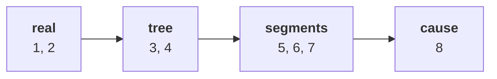
```mermaid
flowchart LR
    A["<b>real</b><br/>1, 2"] --> B["<b>tree</b><br/>3, 4"] --> C["<b>segments</b><br/>5, 6, 7"] --> D["<b>cause</b><br/>8"]
```

```notes
LIVE, 3 minutes. Read the eight lines aloud with the room. The chain maps them onto the chapters.
```

---

## S30. Tomorrow, Anand questions tonight's numbers
*Which Q1 figure is right, the dashboard's Rs 2.1 crore or Finance's Rs 1.9 crore?*

> "Your dashboard says Q1 was Rs 2.1 crore. Our books say 1.9. Until your numbers match ours, Finance will not act on a drop measured from an ERP export. Send me a reconciliation." Anand Iyer, finance controller, Kalpa Retail

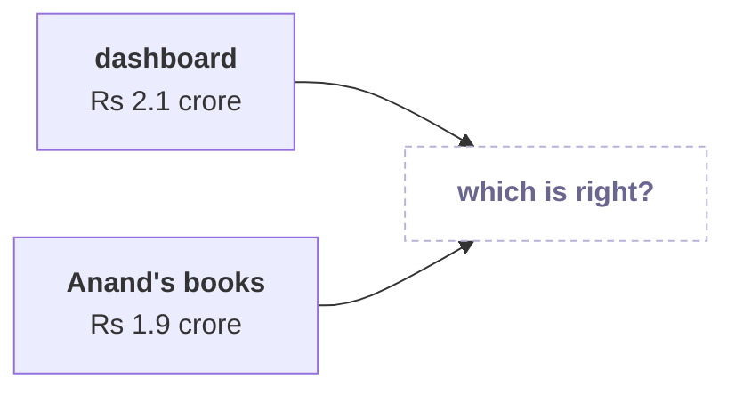
```mermaid
flowchart LR
    D["<b>dashboard</b><br/>Rs 2.1 crore"] --> Q["<b>which is right?</b>"]
    B["<b>Anand's books</b><br/>Rs 1.9 crore"] --> Q
    classDef unknown fill:#FFFFFF,stroke:#B8B2D6,color:#6B6690,stroke-dasharray:4 3
    class Q unknown
```

```notes
LIVE, 2 minutes. Read Anand's line and stop. Do not predict the answer. Every number today was on the
export as it stands; point to the take-home brief. The TA-led practice lab follows.
```
