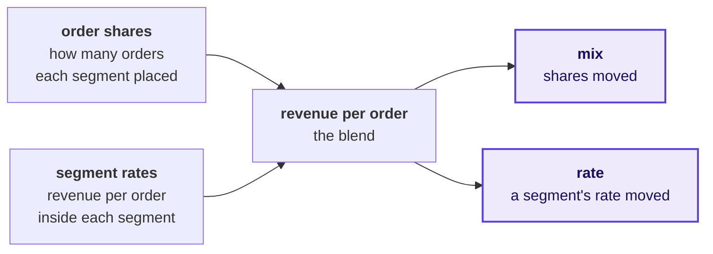
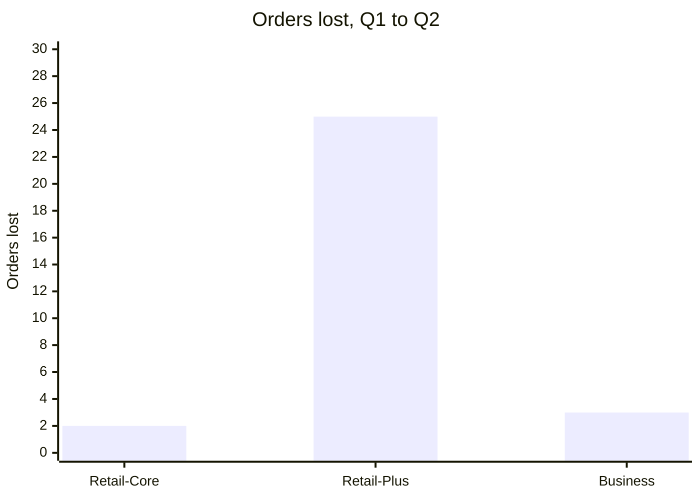
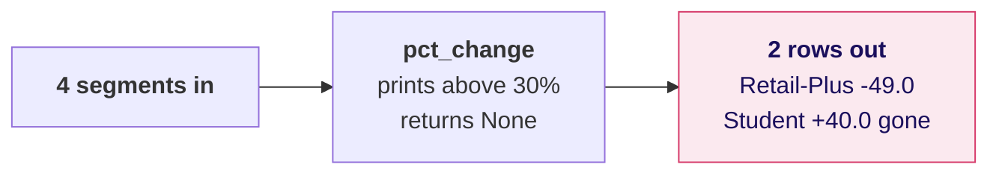
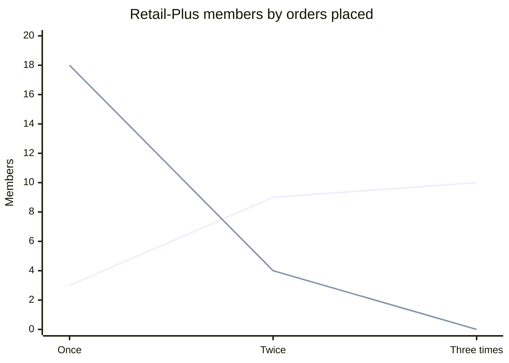
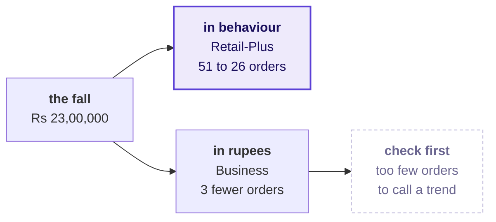
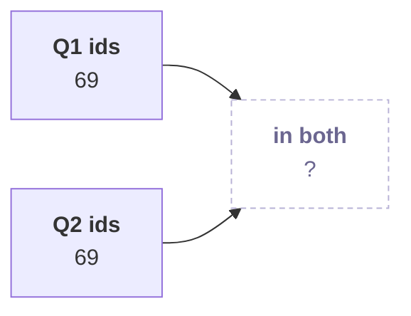
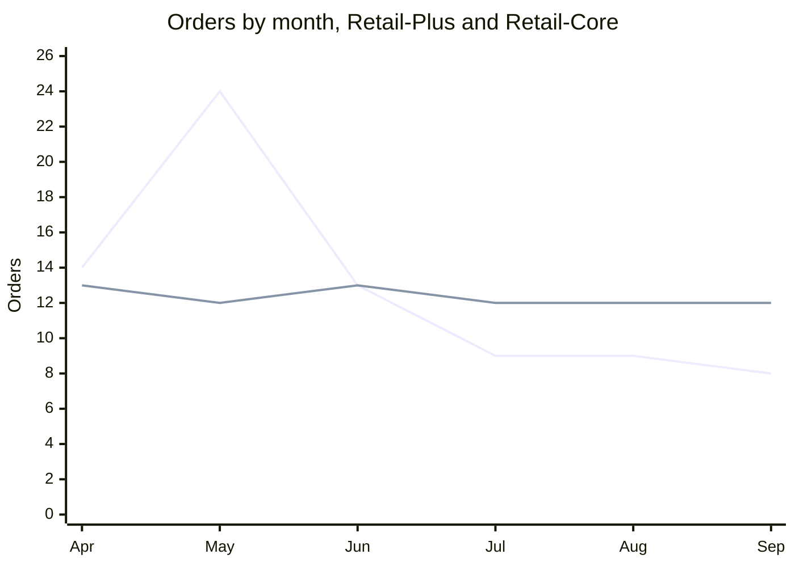
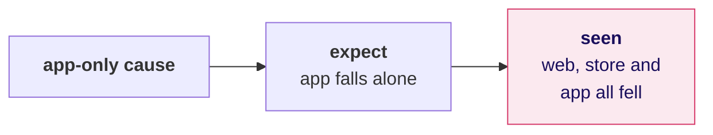
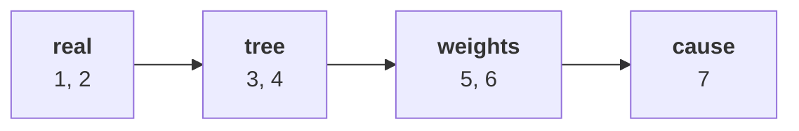
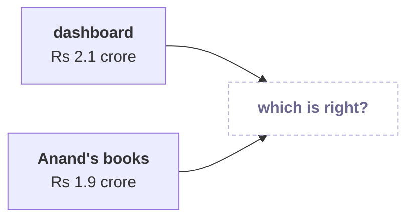

# Mix, rate and the cause on trial

Week 1, Day 2. Half two.

Kicker: WEEK 1  ·  TUESDAY  ·  HALF TWO
Quote: Marketing says more customers. Prove it or disprove it.
Who: Meera Raghavan, CEO, Kalpa Retail, to the data and AI team at Kalpa's Global Capability Centre

```notes
LIVE, one minute. The morning climbed three rungs: the drop is real at 11.0 percent, the branch is
orders per customer, and the room ran the segment split itself. The afternoon climbs rungs 4 and 5:
mix against rate, then a hypothesis that Marketing attacks. From here on, the segment is named.
```

---

## SECTION 1: The escalated case
*Meera asks for the split by segment in rupees and in behaviour, and a colleague's helper comes with it.*

```notes
LIVE. The escalated case runs 60 minutes, unguided: 5 to brief, 50 working in
notebooks/C2_W01_D02_04_escalated_case_STUDENT.ipynb, 5 to collect. The trainer does not teach
during the block; the support TA answers environment problems only.
```

---

## S1. Meera wants rupees and behaviour, per segment
*Rung 4 asks whether revenue per order rose on price or on the mix of orders.*

**The client asks.** "You say frequency fell and order value rose. Show me which segments did it, in rupees and in orders, and tell me whether anyone is paying more."

```timeline
label: Part 1 | title: The tree per segment | body: Customers, orders per customer and revenue per order for four segments and two quarters.
label: Part 2 | title: Two bridges | body: Orders from 114 to 86, and rupees from Rs 2.10 crore to Rs 1.87 crore, segment by segment.
label: Part 3 | title: Mix against rate | body: Revenue per order at Q2's mix and Q1's per-segment rates.
label: Part 4 | title: The summary | body: A percentage change per segment, using the helper a colleague left behind. | tone: dark
```

```notes
LIVE, 3 minutes to brief. Meera's line here restates the case brief in her voice. The case brief in
the exercises folder carries every part in full. Say only that the case is unguided and that the
notebook's checks will tell each learner whether a number is right. Do not warn anyone about the
helper.
```

---

## S2. A colleague's helper from last quarter
*It computed quarter-on-quarter change for the last review, and the brief says to reuse it.*

```python
def pct_change(before, after):
    change = 100 * (after - before) / before
    if abs(change) > 30:
        print(f"  check by hand: {change:+.1f}%")
    else:
        return round(change, 1)
```

**Kavya's review.** "Reuse is good. Know what a function hands back on every path before you trust its output."

```notes
LIVE, 1 minute. Show the helper as the brief hands it over and move on. Kavya's line is the only
hint the room gets. The debrief opens on what this function does to the summary.
```

---

## S3. Revenue per order is a blend of segment rates
*The company's revenue per order is each segment's rate, weighted by its share of orders.*


```mermaid
flowchart LR
    S["<b>order shares</b><br/>how many orders<br/>each segment placed"] --> R["<b>revenue per order</b><br/>the blend"]
    P["<b>segment rates</b><br/>revenue per order<br/>inside each segment"] --> R
    R --> M["<b>mix</b><br/>shares moved"]
    R --> T["<b>rate</b><br/>a segment's rate moved"]
    classDef known fill:#EEEAFB,stroke:#5B3FD6,color:#1A0F5C,stroke-width:2px
    class M,T known
```

**The rule.** Hold one part still and move the other: Q2's shares with Q1's rates isolates the mix, and what is left is the rate.

```notes
LIVE, 1 minute, shown with the brief. The same idea as the morning's weighted roll-up, turned the
other way: a blend moves when its weights move, even if no part of it changed. Then release the
room to the notebook for 50 minutes.
```

---

## SECTION 2: The debrief
*Four wrong answers the room reached, each plausible, each with the check that catches it.*

```notes
LIVE. The debrief runs 15 minutes. Use the room's own wrong answers where you heard them; name no
learner. Each slide shows the wrong answer first and the check second.
```

---

## S4. Wrong answer 1: Business is the whole story
*In rupees Business carries the fall; in orders Retail-Plus carries it.*


```mermaid
xychart-beta
    title "Orders lost, Q1 to Q2"
    x-axis ["Retail-Core", "Retail-Plus", "Business"]
    y-axis "Orders lost" 0 --> 30
    bar [2, 25, 3]
```

In rupees, Business is -Rs 22,29,720 of the Rs 23,00,000 fall, 97 percent of it on three fewer orders; Retail-Plus is -Rs 65,250, which is 93 percent of the consumer fall.

```notes
LIVE, 4 minutes. Student gained 2 orders, which a bar chart of losses cannot show, so say it aloud:
114 to 86 is Retail-Core minus 2, Retail-Plus minus 25, Business minus 3, Student plus 2.
Retail-Plus is 25 of the 28 lost orders, 89 percent. In rupees, Business is Rs 22,29,720 of the
Rs 23,00,000 fall because each Business order is worth lakhs. Both are true; the wrong answer is
picking one lens and calling it the story. Consumer segments fell from Rs 2,28,820 to Rs 1,58,540.
```

---

## S5. Wrong answer 2: two segments vanished from the summary
*The helper printed two changes and returned None for them, and the filter dropped both.*

```python
changes = {seg: pct_change(q1[seg], q2[seg]) for seg in SEGMENTS}
falls = {seg: ch for seg, ch in changes.items() if ch and ch < 0}
print(falls)    # {'Retail-Core': -5.3, 'Business': -15.0}
```


```mermaid
flowchart LR
    I["<b>4 segments in</b>"] --> H["<b>pct_change</b><br/>prints above 30%<br/>returns None"]
    H --> O["<b>2 rows out</b><br/>Retail-Plus -49.0<br/>Student +40.0 gone"]
    classDef bad fill:#FBE9EF,stroke:#D63A6A,color:#1A0F5C
    class O bad
```

```notes
LIVE, 4 minutes. The summary read "orders per customer fell in every segment, most in Business,
15.0 percent". Two lines, "check by hand: -49.0%" and "check by hand: +40.0%", printed above it
with no segment name, and nobody connected them. The decision it misleads: Business accounts
opened first, and the head of Retail-Plus is told his tier is not in the table. The check: four
segments in against two rows out, or None in changes.values(). The fix: return the change on every
path and put the flag in a separate column. The comprehension is the colleague's code; the room
reads it and does not need to write one.
```

---

## S6. Wrong answer 3: frequency fell only 6 percent
*Averaged averages hide one tier that halved its orders per member.*

| Segment | Customers | Per customer, Q1 | Per customer, Q2 | Change |
|---|---|---|---|---|
| Retail-Core | 34 | 1.12 | 1.06 | -5.3% |
| Retail-Plus | 22 | 2.32 | 1.18 | -49.0% |
| Business | 11 | 1.82 | 1.55 | -15.0% |
| Student | 2 | 2.50 | 3.50 | +40.0% |
| Weighted, all | 69 | 1.65 | 1.25 | -24.6% |

**The check.** The average of the four rows says 1.94 to 1.82; the weighted row reproduces the company figure, and the averaged one does not.

```notes
LIVE, 3 minutes. Now the segment rows can be shown. Student's two customers rising to 3.50 pull
the average up as much as Retail-Core's thirty-four. Retail-Plus is the segment the room found at
the end of the morning; say so and credit the room.
```

---

## S7. Wrong answer 4: revenue per order rose, so prices rose
*About 69 percent of the rise is mix: small Retail-Plus orders disappeared.*

| Order share | Q1 | Q2 |
|---|---|---|
| Retail-Core | 33.3% | 41.9% |
| Retail-Plus | 44.7% | 30.2% |
| Business | 17.5% | 19.8% |
| Student | 4.4% | 8.1% |

```stats
value: +Rs 33,231 | label: revenue per order | note: Rs 1,84,211 to Rs 2,17,442
value: +Rs 22,902 | label: from mix | note: about 69 percent
value: +Rs 10,330 | label: from rates | note: inside segments
```

```notes
LIVE, 4 minutes. At Q2's order mix and Q1's per-segment revenue per order, revenue per order would
have been Rs 2,07,112, so the mix alone explains Rs 22,902 of the Rs 33,231 rise. Business took a
larger share of fewer orders and Retail-Plus a smaller one. Nobody has to have paid more for the
average order to grow. Interview question 7 is this slide.
```

---

## S8. Every Retail-Plus member still buys, less often
*The same 22 members placed 26 orders against 51; three-times buyers now buy once.*


```mermaid
xychart-beta
    title "Retail-Plus members by orders placed"
    x-axis ["Once", "Twice", "Three times"]
    y-axis "Members" 0 --> 20
    line [3, 9, 10]
    line [18, 4, 0]
```

In Q1, 10 members ordered three times; in Q2, none did, and 18 of the 22 ordered once.

```notes
LIVE, 2 minutes. The first line is Q1, the second Q2. Nobody left the tier; the whole distribution
slid left. That shape matters for the second case: a cause that hit a few members would leave most
of them where they were, and this one moved nearly all of them.
```

---

## S9. Kavya's review of the escalated case
*Behaviour and rupees point at different segments, and both go to Meera.*


```mermaid
flowchart LR
    F["<b>the fall</b><br/>Rs 23,00,000"] --> B["<b>in behaviour</b><br/>Retail-Plus<br/>51 to 26 orders"]
    F --> R["<b>in rupees</b><br/>Business<br/>3 fewer orders"]
    R --> C["<b>check first</b><br/>too few orders<br/>to call a trend"]
    classDef known fill:#EEEAFB,stroke:#5B3FD6,color:#1A0F5C,stroke-width:2px
    classDef unknown fill:#FFFFFF,stroke:#B8B2D6,color:#6B6690,stroke-dasharray:4 3
    class B known
    class C unknown
```

**Kavya's review.** "Say both lenses and what each rests on: 22 members in one, three orders in the other. Tomorrow's reconciliation and Thursday's test check them before anyone acts."

```notes
LIVE, 2 minutes, then the break for 10 minutes. The honest read: in behaviour the fall is
Retail-Plus, the same 22 members with 51 orders then 26; in rupees most of it is three fewer
Business orders out of twenty, each worth lakhs, too few to call a trend today.
```

---

## SECTION 3: The second case
*The head of Retail-Plus names a cause, Marketing names another, and pairs test both on the same numbers.*

```notes
LIVE. The second case runs 45 minutes in pairs, in
notebooks/C2_W01_D02_05_second_case_STUDENT.ipynb. Brief for 3 minutes, 35 in pairs, 7 to hear
two pairs make their case.
```

---

## S10. Two voices, one set of numbers
*Each stakeholder hands you a cause; your job is to test both.*

```cards
icon: crown | eyebrow: The head of Retail-Plus | title: "It is the broken reorder button" | body: A member's complaint says the app's reorder feature has been broken for six weeks.
icon: megaphone | eyebrow: The marketing lead | title: "A flat count can hide churn" | body: New customers may have replaced lost ones, and Retail-Plus is too small to matter. | tone: dark
```

**Your role.** Name each cause as a hypothesis, say what evidence would settle it, and hold the numbers steady when either voice pushes.

```notes
LIVE, 3 minutes. Pairs split the roles once: one partner defends the numbers, the other plays
Marketing. Switch halfway. The notebook carries four tests: overlap, share of the fall, timing and
channel.
```

---

## S11. Question: how many Q2 customers bought in Q1
*Marketing says a flat count of 69 can hide customers lost and replaced.*


```mermaid
flowchart LR
    A["<b>Q1 ids</b><br/>69"] --> X["<b>in both</b><br/>?"]
    B["<b>Q2 ids</b><br/>69"] --> X
    classDef unknown fill:#FFFFFF,stroke:#B8B2D6,color:#6B6690,stroke-dasharray:4 3
    class X unknown
```

**Question.** Predict the overlap of customer ids: a) all 69; b) 52, with 17 replaced; c) 35, half replaced; d) it cannot be known from order rows.

```notes
LIVE, 2 minutes. Marketing's pushback is a fair one: a flat count does not prove nobody left.
Take letters, then run the overlap cell.
```

---

## S12. Answer: all 69 bought in both quarters
*None lost and none new, so acquisition is not the branch that moved.*

```stats
value: 69 | label: bought in both | note: every Q2 customer bought in Q1
value: 0 | label: lost | note: bought in Q1, not in Q2
value: 0 | label: new | note: bought in Q2, not in Q1
```

**The claim.** The count is flat because the customers are the same people; they bought less often.

```notes
LIVE, 3 minutes. The answer is a. This is interview question 10: a flat count never proves no
churn; the overlap of ids does. Marketing's second pushback comes next.
```

---

## S13. Retail-Plus is small in rupees and large in behaviour
*Marketing says Rs 65,250 of a Rs 23 lakh fall does not matter.*

```stats
value: 93% | label: of the consumer fall | note: Rs 65,250 of Rs 70,280
value: 25 of 28 | label: lost orders | note: 89 percent of them
value: 22 of 22 | label: members bought less | note: the whole tier moved
```

**The reply.** The rupee fall in Business rests on three orders; the Retail-Plus fall rests on every member of a paid tier buying half as often.

```notes
LIVE, 4 minutes. Pairs rehearse this reply aloud. The strength of evidence is part of the answer:
a change carried by 22 people is harder to explain away than one carried by three orders, even
when the rupees are smaller. Interview question 11 is this slide.
```

---

## S14. The fall began before the reorder break
*Retail-Plus orders dropped in July; six weeks back from this week is late August.*


```mermaid
xychart-beta
    title "Orders by month, Retail-Plus and Retail-Core"
    x-axis ["Apr", "May", "Jun", "Jul", "Aug", "Sep"]
    y-axis "Orders" 0 --> 26
    line [14, 24, 13, 9, 9, 8]
    line [13, 12, 13, 12, 12, 12]
```

Retail-Plus placed 18 orders from 1 July to 24 August and 8 from 25 August to 30 September. Retail-Core, the comparison segment, stayed flat.

```notes
LIVE, 5 minutes. The first line is Retail-Plus and the second Retail-Core. The timing test: a
cause cannot come after its effect. The fall began in July, before the break the complaint dates,
so the break cannot be the whole story. Whether it deepened the fall rests on eight orders, which
is Thursday's kind of question. Hold questions about any single month for Wednesday, when the
export is profiled row by row.
```

---

## S15. Every channel fell, the app no faster
*An app-only cause would have shown the app falling first and alone.*

| Retail-Plus orders | Q1 | Q2 | Change |
|---|---|---|---|
| Web | 24 | 9 | -15 |
| Store | 14 | 9 | -5 |
| App | 13 | 8 | -5 |


```mermaid
flowchart LR
    H["<b>app-only cause</b>"] --> E["<b>expect</b><br/>app falls alone"]
    E --> S["<b>seen</b><br/>web, store and<br/>app all fell"]
    classDef bad fill:#FBE9EF,stroke:#D63A6A,color:#1A0F5C
    class S bad
```

```notes
LIVE, 4 minutes. The channel test: where the cause should act, the effect should be largest.
Web fell most. The reorder feature may still have hurt; the file cannot say how much, which is
why the next slide asks for data.
```

---

## S16. Two hypotheses, and the data that settles each
*Neither can be settled from this file, so the answer names the data to ask for.*

```cards
icon: smartphone | eyebrow: Hypothesis 1 | title: The broken reorder feature | body: Settled by the app's reorder events and failures by week, the release that broke it, and whether members who used reorder in Q1 fell more than those who did not.
icon: calendar-clock | eyebrow: Hypothesis 2 | title: Something changed for members in July | body: Settled by the tier's change log for benefits, prices or delivery terms, renewals, and members' support tickets. | tone: dark
```

**Kavya's review.** "A cause is a hypothesis until the evidence that would settle it is in hand. Timing first, then where, then the data you still need."

```notes
LIVE, 5 minutes, then two pairs present in 7 minutes. Listen for pairs who say "the cause is" and
for pairs who say "the evidence would be". Only the second earns Meera's trust. Interview question
12 is this slide.
```

---

## SECTION 4: The interview drill
*Twelve questions asked aloud, one breath each, the way a GCC screen asks them.*

```notes
LIVE. The drill runs 30 minutes. Ask each question aloud to a named pair, give them one breath to
answer, then read the model answer from the notes. Tags: [S] staple asked everywhere, [F] frequent
in GCC and product screens, [SV] service-major screen opener, [D] differentiator.
```

---

## S17. Questions 1 to 4: the ladder and the windows
*Asked aloud, answered in one breath, then compared with the model answer.*

| Tag | Question |
|---|---|
| [S] | 1. Sales dropped 15 percent last month; how would you investigate? |
| [S] | 2. Why is a rate without a denominator meaningless? |
| [F] | 3. Why does a function that prints instead of returning break a pipeline? |
| [F] | 4. What has to match before a quarter-on-quarter comparison is fair? |

```notes
LIVE, 10 minutes.
1. Confirm the drop on matched windows, compare like with like, decompose into customers, orders
per customer and revenue per order, isolate the segment, then name a hypothesis with the evidence
that would settle it, timing first.
2. Without the denominator nobody can check it, compare it or know how many cases it rests on:
40 percent of five orders and of five thousand are different claims.
3. The caller receives None, so the next step either crashes or silently drops that group, and
the screen looked right the whole time.
4. The window's length and dates, the metric's definition, and the population counted; compare
closed quarters, or the same weeks of each.
```

---

## S18. Questions 5 to 8: the tree and the trap
*The decomposition questions, where a plausible number is waiting.*

| Tag | Question |
|---|---|
| [D] | 5. Marketing insists the answer is acquisition and your data says frequency; how do you make the case in the room? |
| [F] | 6. Revenue fell 11 percent; how do you split the change between customers, frequency and order value? |
| [F] | 7. Revenue per order rose 18 percent while revenue fell; did prices go up? |
| [S] | 8. A field is missing on some records; do you fill it with zero? |

```notes
LIVE, 10 minutes.
5. Show the tree for both quarters, show that the same customers bought in both, agree in advance
what evidence would change your mind, and propose a check before the spend rather than a refusal.
6. Move one branch at a time in a bridge: customers at the old rates, then frequency at the old
order value, then order value on the new orders, and check the moves sum to the change.
7. Not necessarily: hold the segment mix still and recompute; here about 69 percent of the rise
was mix, because small orders disappeared.
8. No: absent is unknown; count the records without it, report them separately, write down the
default and why, and bound how much it could matter.
```

---

## S19. Questions 9 to 12: weights, churn and causes
*The case-style follow-ups that separate candidates.*

| Tag | Question |
|---|---|
| [F] | 9. You have orders per customer for four segments; why can't you average them for the company figure? |
| [SV] | 10. The customer count is flat quarter on quarter; does that prove no customers were lost? |
| [D] | 11. The fall is in rupees in one segment and in behaviour in another; which do you put in front of the CEO first? |
| [D] | 12. A stakeholder hands you a cause; how do you test it with the data you have and name the data you need? |

```notes
LIVE, 10 minutes.
9. Each segment's rate carries its own customers as weight; total orders over total customers
reproduces the company figure, and a plain average gives two customers the same vote as
thirty-four.
10. No: churn replaced by new customers keeps a count flat; compare the ids, lost and new.
11. Both, each with what it rests on: the behaviour change covers a whole tier and is the stronger
evidence; the rupee change rests on a few large orders and gets checked before anyone acts.
12. Test timing first, then where the cause should act most, then name the data that would
settle it and what result would disprove it.
```

---

## SECTION 5: The close
*The Kahoot, the sentence to Meera, the seven lines to keep, and tomorrow's question.*

```notes
LIVE. The close runs 20 minutes: Kahoot 10, the sentence and the crux lines 7, tomorrow's question 3.
```

---

## S20. Kahoot: eight questions, ungraded
*One per idea from today, plus Monday's return question.*

```stats
value: 8 | label: questions | note: seven from today, one from Monday
value: 0 | label: scores recorded | note: ungraded, every day this week
value: 10 min | label: to play and discuss | note: answers talked through
```

```notes
LIVE, 10 minutes. Run the pack from the kahoot folder. Pause on any question below 60 percent
correct and ask a learner who got it right to explain it.
```

---

## S21. The sentence that goes to Meera
*A claim, its evidence, its caveat and the next step, in the order she needs them.*

> "Revenue fell 11.0 percent between two closed quarters, Rs 2.10 crore to Rs 1.87 crore on the export as it stands. Customers held at 69, and every one of them bought in both quarters, so acquisition is not the branch that moved; orders per customer fell from 1.65 to 1.25. In behaviour the fall sits in Retail-Plus, where the same 22 members placed 26 orders against 51; in rupees most of it is three fewer Business orders, which tomorrow's reconciliation checks before anyone acts. The broken reorder feature is a hypothesis: the fall began in July, before the break the complaint dates, so we are asking for the app's reorder logs." The data and AI team, to Meera Raghavan

```notes
LIVE, 3 minutes. Read it aloud once, slowly. Ask two learners to compare it with the sentence they
wrote in the escalated case: which part did theirs miss? Most miss the caveat or the data to ask for.
```

---

## S22. Seven lines to keep
*The day's rules, word for word as the cheat sheet prints them.*

1. Confirm the drop on matched windows before you explain it.
2. A rate without its denominator is a rumour.
3. Decompose along the tree: customers, orders per customer, revenue per order.
4. Missing means unknown until someone chooses a default and writes down why.
5. Roll a rate up with its weights; never average the averages.
6. A function returns its answer; count the groups in and the groups out.
7. Name the cause as a hypothesis, with the evidence that would settle it.


```mermaid
flowchart LR
    A["<b>real</b><br/>1, 2"] --> B["<b>tree</b><br/>3, 4"] --> C["<b>weights</b><br/>5, 6"] --> D["<b>cause</b><br/>7"]
```

```notes
LIVE, 4 minutes. Read the seven lines aloud with the room. The small chain maps them onto the
ladder: lines 1 and 2 prove the drop, 3 and 4 decompose it, 5 and 6 keep the roll-up honest, and
7 names the cause.
```

---

## S23. Tomorrow, Anand questions tonight's numbers
*Finance's books and the dashboard disagree about Q1, and the answer waits for Wednesday.*

> "Your dashboard says Rs 2.1 crore for Q1 and my books say 1.9. Reconcile before anyone acts on tonight's numbers." Anand Iyer, finance controller, Kalpa Retail


```mermaid
flowchart LR
    D["<b>dashboard</b><br/>Rs 2.1 crore"] --> Q["<b>which is right?</b>"]
    B["<b>Anand's books</b><br/>Rs 1.9 crore"] --> Q
    classDef unknown fill:#FFFFFF,stroke:#B8B2D6,color:#6B6690,stroke-dasharray:4 3
    class Q unknown
```

```notes
LIVE, 3 minutes. Read Anand's line and stop. Do not predict the answer. Remind the room that every
number today was on the export as it stands, and point to the take-home brief. The TA-led
practice lab follows.
```
