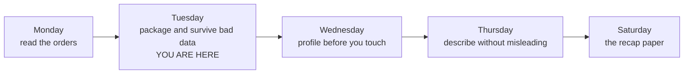
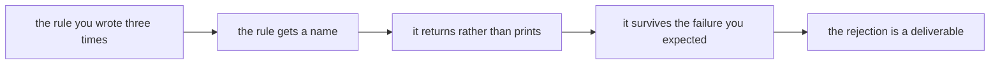

# Study notes: package the logic, survive bad data, cross the file boundary

Week 1, Day 2. Read these after the session, with your notebook open beside them.

These notes are written from the planned session. They are revised against the recording once it arrives, so if something you remember is missing, it is coming.

---

## 0. The world these orders live in

Every order you handled today belongs to Kalpa Retail, one of the five business units of Kalpa Group,
and the Kalpa Retail order book is the dataset this programme returns to for the next nineteen weeks.
The columns you cleaned today, `order_id`, `segment`, `amount`, `status` and `order_date`, are the
same columns you will meet as Postgres tables in Week 2 and as a feature table in Week 5.

## 1. The one sentence

Yesterday's code ran once, on records that were already clean and already in memory. Today it became a named decision you can call again, a failure you read instead of fear, and a file that survives the notebook being closed.

## 2. The map, and where today sat on it

The week's terrain, filling up one column per teaching day.



Today's own five stops:



| Where it sits | What Tuesday covered | Status |
|---|---|---|
| Phase 1, read and clean data | Functions, return against print, tracebacks, named exceptions, the rejects log, CSV and JSON | Worked, with your own hands on the keys |
| Phase 1, read and clean data | Profiling, duplicates, outliers | Named as coming tomorrow, not touched |
| Phase 2 onwards | pandas, SQL | Mentioned once, so you know the same functions get replaced by one call |

The coverage line: Tuesday worked ten of the eleven subtopics on its row and gave the comprehension a single beat as a compact variant of the loop, with no exercise behind it.

**The outcome tie.** Today is the half of the terminal outcome where the file you were handed stops being trustworthy. Everything here is about producing a number somebody else can check.

**What was left out.** Custom exception classes, `*args`, lambdas and encodings beyond one mention. The nearest thing today did not cover is what to do when the whole dataset is dirty rather than two records of it, and that is Wednesday.

## 3. Functions

A function gives one decision a name and one home. That buys you three things: you can say the name out loud to a colleague, you change the rule in one place, and you can run it next week on a file that does not exist yet.

The parameter list is a promise. `def delivered_total(records)` says give me records and I hand back a number. The function sees only what you handed it, which is the whole of scope you need this week.

`print` shows a human. `return` hands a value to the next line of code. A function that only prints returns `None`.

**Worked example**

```
def normalise_amount(raw):
    """Return the amount as an integer, or raise ValueError describing what arrived."""
    return int(raw)


def clean_record(record):
    """Return one record with its amount as a number, or raise ValueError saying what arrived."""
    keeper = dict(record)
    keeper["amount"] = normalise_amount(record["amount"])
    return keeper
```

`normalise_amount` converts and nothing else. `clean_record` is the day's named deliverable and handles one record. Neither decides what a failure means, because a function that both converts and handles failure is two functions wearing one name. The decision lives one level up, in `clean_records`.

You also saw a raise you write yourself, for a value that converts and is still unacceptable:

```
if value < 0:
    raise ValueError(f"amount below zero: {value}")
```

## 4. Errors

A traceback tells you where the interpreter stopped and what it was holding. Read it from the bottom:

| Line | What it gives you |
|---|---|
| Last | The exception type and the value that caused it |
| The one naming your file | Where you go and edit |
| Everything above | How the call got there |

Three questions, in order: what is the exception type, which line is mine, and what value was it holding. The third is the one people skip, and it is the one that names the record.

**The failures you saw, and why each one happened**

| Error | Cause | Fix |
|---|---|---|
| `TypeError: 'NoneType' object is not subscriptable` | A function printed instead of returning, so the caller received `None` | Return the value the caller needs |
| `ValueError: invalid literal for int() with base 10: 'twelve'` | A word arrived where a number was expected | Catch `ValueError` and reject the record with the reason |
| `FileNotFoundError: [Errno 2] No such file or directory: 'data/orderz.csv'` | The path does not exist relative to the running kernel | Read the path in the message before editing anything |
| `json.decoder.JSONDecodeError: Expecting ',' delimiter: line 48 column 1` | The file ends at line 47, part way through a record | Ask for the file again. Do not hand-repair it |

## 5. The argument the whole day rests on

Two cells, same 30 records, same total:

```
Processed 30 records. Total: 53745     <- bare except
Clean 28, rejected 2, total 53745      <- named except with a rejects log
```

The number is identical. The first line claims thirty records went into it and two did not. The lie is in the claim rather than in the arithmetic.

A crash costs you an hour of your own time. A number that looks fine costs a quarter, because nobody goes looking for it. That is why the bare `except` is worse than letting the code stop.

A bare `except` also swallows failures you never considered: a misspelled key, an interrupted run, a bug three functions down.

## 6. The rejection is a deliverable

Three things can happen to a record you cannot use. Fix it silently, drop it silently, or set it aside with a reason. Only the third survives a question from someone who was not in the room.

```
{'order_id': 'KR4210', 'reason': "invalid literal for int() with base 10: 'twelve'"}
```

`str(e)` carries the interpreter's own wording, so nobody has to maintain invented messages and everyone's log reads the same.

**The reconciliation.** Input equals clean plus rejected. When that sum fails, something disappeared and you do not yet know what. You will run this check every day from now on.

## 7. Files

A file format is an agreement about structure. CSV agrees about three things: one row per record, commas between fields, and a first row that names the fields. Nothing in that agreement mentions types, which is why everything you read from a CSV is a string.

Monday's planted defect proves it. One amount stored as text broke a comparison on Monday. Write those records to CSV and the defect vanishes, because now every amount is text. It was never fixed. The format hid it.

| Thing | What it does | The part people forget |
|---|---|---|
| `with open(...)` | Opens the file and guarantees it closes | The guarantee holds when your code raises inside the block |
| `csv.DictReader` | One dictionary per row | The keys come from the header row, so the header is part of the contract |
| `csv.DictWriter` | Writes rows from dictionaries | You state the field names, which is you writing the agreement for the next reader |
| `json.load` | Reads types and nesting | The file parses completely or not at all |

**Nesting and its cost.** JSON can hold a record inside a record. To flatten that into CSV you either drop the nested block or invent a column for it. Either way the shape changes and the person downstream has to be told. That conversation is the cost.

Record KR4214 makes it concrete: its amount was empty in the CSV and your run rejected it, while the JSON still carried the original value one level down. The record was never unrecoverable. The export threw it away.

## 8. From the field

**Knight Capital, 1 August 2012.** About USD 440 million lost in 45 minutes. A deployment reused an old flag. Nothing failed loudly, and the system kept trading at speed on the wrong rule.

**Public Health England, October 2020.** 15,841 COVID cases dropped from reporting when a CSV was converted into an old Excel format with a hard row limit. The rows past the limit were silently discarded and contact tracing never saw them. Nobody wrote bad code. Somebody did not know the format's contract.

Both are the same story at different scales: a system that kept going when it should have stopped.

## 9. Model answers to today's interview questions

**"Why is a bare except worse than letting the code crash?"**

A crash tells you immediately and precisely, and it costs you an hour. A bare except produces a plausible number with no signal attached, and nobody goes looking for a number that looks right. It also swallows failures you never predicted, so the next bug is invisible too. I catch the exception I expected by name and let everything else stop the program.

**"Everything read from a CSV is a string. What breaks, and where do you convert?"**

Comparisons and arithmetic break first, and they break quietly because comparing a string to a number either raises or, worse, compares as text. I convert in one named function, at the point the record enters my code, and every failed conversion becomes a rejection carrying the interpreter's own reason.

**"CSV or JSON for nested records, and what does flattening cost?"**

JSON, when the records are genuinely nested, because CSV has no way to express a record inside a record. Flattening to CSV costs you a decision you then have to communicate: drop the nested block, or invent columns for it. The cost is not technical. It is that the reader downstream now needs telling, and usually nobody tells them.

**"Your cleaning run reported zero rejects on a file you know is dirty. What do you check?"**

Three things, in order. Is the rejects list actually being appended to, or is the append inside a branch that never runs. Is the except narrow enough to be reached at all. Does input equal clean plus rejected, because if it does not, records left through a path I have not found.

## 10. The crux lines to remember

A function is a decision you can call again.

A named exception is a failure you chose to survive.

A rejects log is the difference between a number and a number you can defend.

A file format is an agreement about structure, and everything a CSV agrees to is text.

## 11. Check yourself, with nothing to write

Eight questions. No notebook, no notes. Say each answer out loud; anything you cannot say in ten seconds names the section to re-read.

1. A function calls `print` and nothing else. What does its caller receive? (Section 3)
2. Which line of a traceback do you read first, and what two things does it give you? (Section 4)
3. Both cells printed Rs 53,745. Which one is lying, and about what? (Section 5)
4. Where is a failure decided about, and why not inside the function? (Section 5)
5. What does the rejects file make possible that the clean file cannot? (Section 6)
6. Everything from a CSV is text. Name the two places that bites. (Section 7)
7. A JSON feed stops at line 48 of a 47-line file. How many records can you use? (Section 7)
8. Your run reports zero rejects on a file you know is dirty. What do you check first? (Section 9)

## 12. Read next, in this order

| What | Why it is next | Time |
|---|---|---|
| Corey Schafer, try and except blocks (verified 03 Sep 2026): https://www.youtube.com/watch?v=NIWwJbo-9_8 | The narrow-catch argument at a slower pace than the room allowed | About 10 minutes |
| Real Python, LBYL against EAFP (verified 03 Sep 2026): https://realpython.com/python-lbyl-vs-eafp/ | Names the two defensive stances so you can say which one you took and why | About 15 minutes |
| Official Python tutorial, Errors and Exceptions (verified 03 Sep 2026): https://docs.python.org/3/tutorial/errors.html | The reference for everything today touched, including raising with your own message | About 25 minutes |
| Automate the Boring Stuff, 3rd edition, Ch 10 (verified 03 Sep 2026): https://automatetheboringstuff.com/3e/ | Reading and writing files, at a from-scratch pace, for the weekend | About 40 minutes |

## 13. The words, and where each one starts mattering

| Term | What it means | Where it first bit |
|---|---|---|
| Function | One decision, named, with one home, callable again | The third time you copied the same four lines |
| `return` against `print` | `print` shows a person, `return` hands a value to the next line | The first call whose result you tried to use |
| Traceback | The stack of calls that led to a failure, read from the bottom | The first `ValueError` |
| Named exception | Catching the failure you expected and nothing else | `except:` against `except ValueError:` |
| `raise` | Refusing on purpose, with your own wording and the offending value | `amount below zero: -4500` |
| Rejects log | One row per record you could not use, each with its reason | The moment somebody asked how you know the clean count |
| Reconciliation | Input equals clean plus rejected, asserted every run | The assertion at the end of the pass |
| File format | An agreement about structure, and nothing more than it states | The round trip that changed the amount's type |
| `with` | A promise that the file closes when the block ends, raise or no raise | Reading the first file |
