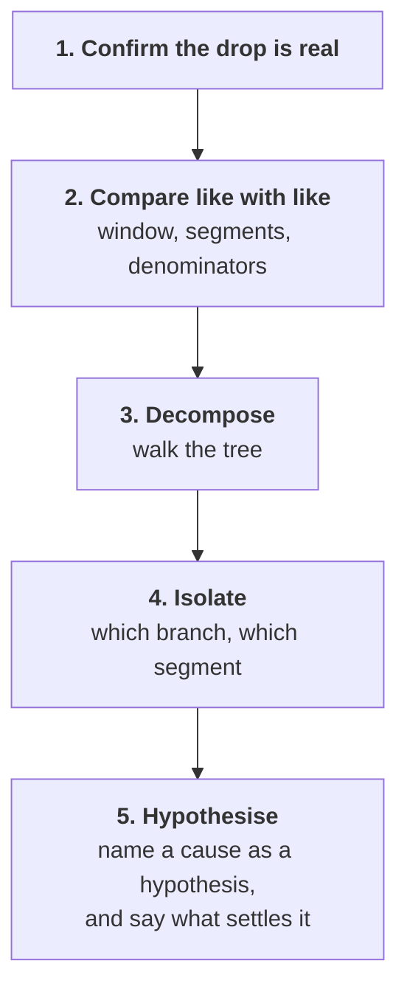

# Day 2: which lever moved?

Kalpa Retail, Week 1 Tuesday. Read this after the session.

---

## The situation

Meera read Monday's tree and replied: "Which of those moved? Q2 was Rs 1.9 crore, Q1 was 2.1. Are
we losing customers, or are the ones we have buying less? Marketing says more customers. Prove it
or disprove it."

At the same time the head of Retail-Plus forwarded a member's complaint that **the app's reorder
button has not worked for six weeks**, and asked whether his tier is the one slipping. That is a
hypothesis handed to you by the person whose tier it would excuse.

---

## The mental model: five rungs, in order



You never climb past a rung you have not done. Most wrong answers to this case are somebody
starting at rung five because they arrived with a theory.

| Rung | Needs from the data | Goes wrong when |
|---|---|---|
| Confirm | Both totals, one definition of revenue | Delivered is compared with booked |
| Like with like | Equal windows, same segment definitions, same denominators | A 13-week quarter meets an 11-week one |
| Decompose | Customers, orders and revenue by quarter | The total is called a finding |
| Isolate | The same split per segment | A blended number hides the segment |
| Hypothesise | Something outside the data | A cause is stated as a fact |

---

## What the two quarters said

| | Q1 | Q2 | Change |
|---|---|---|---|
| Rows in the file | 114 | 86 | |
| Revenue | Rs 2.10 crore | Rs 1.87 crore | down 11.0 percent |
| Distinct customers | 69 | 69 | flat |
| Orders per customer | 1.65 | 1.25 | down 24.6 percent |
| Revenue per order | Rs 1,84,211 | Rs 2,17,442 | up 18.0 percent |

**Marketing's claim is disproved as stated.** The same number of distinct customers bought in both
quarters. That does not prove nobody left; thirty could have gone and thirty arrived. Saying both
halves is what separates a careful answer from a confident one.

### The arithmetic that has to close

```
1.000 × 0.754 × 1.180 = 0.890
```

Three factor changes multiplied land on the revenue change. If they do not, a factor is missing or
double counted and nothing built on the decomposition is safe.

**The factor nobody expects.** Revenue per order went **up** 18 percent while revenue went down. One
factor moving the right way is hiding how far the other one fell. A note that reports only the
revenue change understates the frequency problem by about a third.

---

## Where the fall sits

| Segment | Q1 per customer | Q2 per customer | Change |
|---|---|---|---|
| Retail-Core | 1.12 | 1.06 | down 5.3 percent |
| Retail-Plus | 2.32 | 1.18 | **down 49.0 percent** |
| Business | 1.82 | 1.55 | down 15.0 percent |
| Student | 2.50 | 3.50 | up 40.0 percent |

One segment carries almost all of it. Student's 40 percent rise sits on twelve orders, which is a
number to be careful with and the subject of Thursday.

Cut the same fall by channel and it says something different again: web down 22 percent, store down
8, app flat. Both cuts are true, and the same Retail-Plus members sit inside the web number. Two
cuts of one fall is not a contradiction; it is two departments' languages.

---

## The break: a field that is not always there

```
KeyError: 'discount'
```

The key is not in that record. Python refuses to guess, because a silent zero would make a missing
discount look like a discount of nothing, and those are different facts about the business.

**The move is not to suppress it.** Count the records first:

```python
absent = [o for o in ORDERS if "discount" not in o]
```

Fifty-eight of two hundred, spread across segments. Then choose a default **and write the reason in
the code**, because on Wednesday somebody from Finance asks.

| Choice | What it costs |
|---|---|
| Drop the row | Revenue falls and the row count changes |
| Default to zero | The count holds and revenue is understated |
| Keep and flag | Nothing is lost and somebody has to look |

---

## Functions: one decision, applied everywhere

You need four numbers per quarter, then per segment inside each quarter. That is twenty
computations of four shapes, and copying them is how three end up wrong in a way nobody notices.

```python
def describe(rows):
    people = {o["customer_id"] for o in rows}
    total = sum(int(o["amount"]) for o in rows)
    return {"orders": len(rows), "revenue": total, "customers": len(people),
            "per_customer": len(rows) / len(people),
            "per_order": total / len(rows)}
```

**`return`, never `print`.** `print` draws on a screen and hands back `None`, so the next line fails
with `TypeError: 'NoneType' object is not subscriptable`. A function that prints cannot be built on.

And the conversion that must not stop the loop:

```python
def to_amount(value, default=0):
    try:
        return int(value)
    except (TypeError, ValueError):
        return default
```

Yesterday one bad value stopped the whole total. Across two hundred rows, stopping on the first one
means you never learn how many there are. Counting them is a finding; crashing is not.

---

## The sentence that went out

> "Customers are flat at 69 in both quarters, so this is not acquisition. Orders per customer fell
> 24.6 percent, and almost all of that sits in Retail-Plus, which is down 49 percent against
> Retail-Core's 5. The reorder-feature complaint is a plausible cause and I have not tested it;
> reorder events per member either side of the six weeks, against Retail-Core, would settle it. One
> caveat: revenue per order rose 18 percent, which is masking about a third of the fall."

---

## Glossary

| Term | What it means here |
|---|---|
| Investigation ladder | The fixed order in which a drop is investigated |
| Like with like | Two periods comparable on window, definitions and denominators |
| Decomposition | Revenue rewritten as factors whose changes multiply to the whole change |
| Segment | A customer grouping the business already uses, here four of them |
| Accumulator per key | A dictionary holding one running total for each group |
| Default | The value returned when a key is absent, and a decision somebody has to defend |
| Hypothesis | A stated cause with the evidence that would settle it beside it |
| Return | Handing a value back to the caller, as against printing it to a screen |
| Range | The distance between the smallest and largest value, the cheapest spread |
| Base | How many observations sit behind a percentage |

---

## The questions this day now makes answerable

- Sales dropped 15 percent last month. How would you investigate?
- Why is a rate without a denominator meaningless?
- Why does a function that prints instead of returning break a pipeline?
- What has to match before a quarter-on-quarter comparison is fair?
- Marketing insists the answer is acquisition and your data says frequency. How do you make the
  case in the room?

---

## What tomorrow does with this

Every number above was computed on an ERP export that nobody has profiled. Tomorrow Anand says his
books disagree with your dashboard by Rs 20 lakh, and part of today's answer moves.

---

## Reading, if you want it

- Exponent, data analyst interview questions including the sales-drop investigation
  (verified 13 Sep 2026): https://www.tryexponent.com/blog/top-data-analyst-interview-questions
- Brit Institute, the sales-drop case walkthrough (verified 13 Sep 2026):
  https://britinstitute.uk/blog/data-analyst-case-study-interview-questions
- Corey Schafer, Functions (verified 03 Sep 2026): https://www.youtube.com/watch?v=9Os0o3wzS_I
- Corey Schafer, try/except blocks (verified 03 Sep 2026):
  https://www.youtube.com/watch?v=NIWwJbo-9_8
