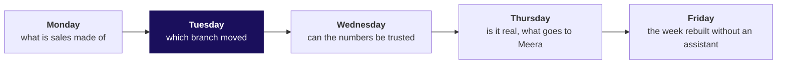
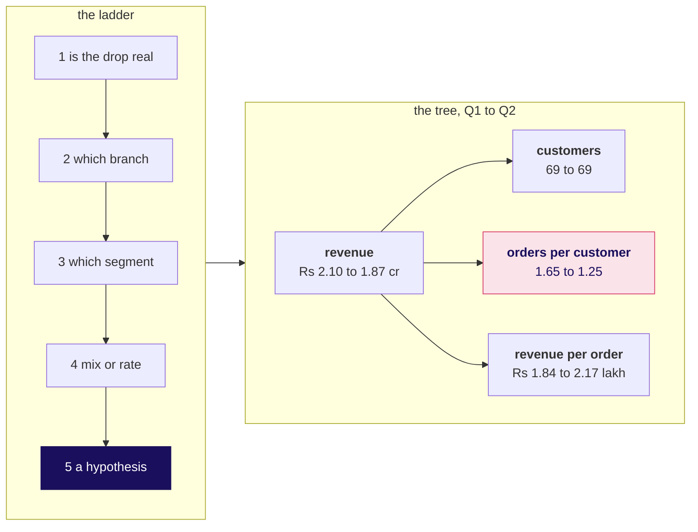
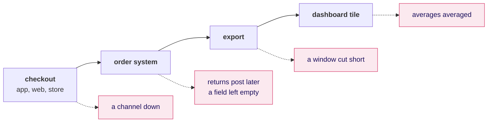

# Which branch moved, and how you would know

**Week 1, Tuesday. Study notes, read after the session.** A drop is investigated on a fixed ladder:
confirm it on matched windows, decompose it along the tree, find the segment, separate mix from
rate, and hand over a cause as a hypothesis with the evidence that would settle it. Reading time:
about 30 minutes.

---

## What you can now do

1. You can check whether a drop is real before explaining it, by comparing two windows of the same
   length or by turning both into a rate per week.
2. You can split a change in revenue into customers, orders per customer and revenue per order, and
   show that the three multiply back to the total.
3. You can group records by a key with a dictionary accumulator and describe each group by its
   median, its smallest and largest values, and its range.
4. You can write a function that returns its answer, apply it to every segment and quarter, and
   count the groups that went in against the groups that came out.
5. You can roll a rate up from segments with its weights, and say how much of a change came from the
   mix of orders and how much from behaviour inside each segment.
6. You can hand a stakeholder a cause as a hypothesis, test it on timing and channel with the data
   you have, and name the data you would ask for.

---

## Where this sits

**What the session covered.** Worked in full: Meera's question about which branch moved, the
five-rung ladder, matched windows and rates per week, the tree decomposed on two closed quarters,
the missing discount field, grouping with a dictionary, `tree_for` and `describe` as functions, the
weighted roll-up, the segment split, mix against rate, a helper that returned nothing, and two
hypotheses tested on timing and channel. Around them, the business and system context: what each
branch costs and who owns it, where in the pipeline a fake drop is made, how retailers keep periods
comparable, why the bridge depends on the order of its steps, three ways past a missing key, and the
middle half of a group against its range. Mentioned only: `try` and `except` as one way to meet a
`KeyError`, and the test of whether a difference could be chance, which is Thursday's work.


```mermaid
flowchart LR
    M["<b>Monday</b><br/>what is sales made of"] --> T["<b>Tuesday</b><br/>which branch moved"]
    T --> W["<b>Wednesday</b><br/>can the numbers be trusted"]
    W --> H["<b>Thursday</b><br/>is it real, what goes to Meera"]
    H --> F["<b>Friday</b><br/>the week rebuilt without an assistant"]
    classDef today fill:#1A0F5C,stroke:#1A0F5C,color:#FFFFFF
    class T today
```

This map of the week is this programme's own construction, drawn from the Week 1 rows.

**The outcome tie.** Thursday's one-page note to Meera names a branch, a segment and a hypothesis,
and today produced all three from the orders file as it was exported.

**What was left out.** Whether the export itself can be trusted waits for Wednesday, when Finance
compares its books with the dashboard, and tomorrow's reconciliation may change tonight's numbers.
Whether a fall on a few dozen orders is larger than chance would produce waits for Thursday.

---

## The picture to remember: the ladder beside the tree


```mermaid
flowchart LR
    subgraph LAD["the ladder"]
        direction TB
        R1["1 is the drop real"] --> R2["2 which branch"]
        R2 --> R3["3 which segment"]
        R3 --> R4["4 mix or rate"]
        R4 --> R5["5 a hypothesis"]
    end
    subgraph TREE["the tree, Q1 to Q2"]
        direction LR
        V["<b>revenue</b><br/>Rs 2.10 to 1.87 cr"] --> C["<b>customers</b><br/>69 to 69"]
        V --> F["<b>orders per customer</b><br/>1.65 to 1.25"]
        V --> O["<b>revenue per order</b><br/>Rs 1.84 to 2.17 lakh"]
    end
    LAD --> TREE
    classDef bet fill:#1A0F5C,stroke:#1A0F5C,color:#FFFFFF
    classDef moved fill:#FBE3EA,stroke:#D63A6A,color:#1A0F5C
    class R5 bet
    class F moved
```

Read the ladder from the top: each rung is a question that must be answered before the next one is
worth asking. The tree beside it is Monday's tree with Tuesday's numbers written in, and the branch
shaded is the one that moved. The running thread through every section below is one sentence to
Meera, which starts as "revenue fell" and ends as a claim with its evidence and its caveat.

The seven lines the day comes down to, in the order the ladder meets them:

1. Confirm the drop on matched windows before you explain it.
2. A rate without its denominator is a rumour.
3. Decompose along the tree: customers, orders per customer, revenue per order.
4. Missing means unknown until someone chooses a default and writes down why.
5. Roll a rate up with its weights; never average the averages.
6. A function returns its answer; count the groups in and the groups out.
7. Name the cause as a hypothesis, with the evidence that would settle it.

---

## Before the ladder: what each branch costs, and where a fake drop is made

**Every branch has a lever, an owner and a price.** Customers move with acquisition campaigns, which
the marketing lead owns and which cost spend before any repeat order. Orders per customer move with
retention, reminders and features such as reorder, which the tier and product owners own. Revenue per
order moves with range and bundles, which merchandising owns. Price and discounts move volume or give
away margin. So the branch that moved decides whose problem the fall is, and a branch that stayed flat
takes a budget off the table.

**IN THE FIELD.** Harvard Business Review summarised the price gap in 2014: depending on the study and
the industry, acquiring a new customer costs 5 to 25 times more than retaining one, and Bain's Frederick
Reichheld found that raising retention by 5 percent lifted profits by 25 to 95 percent (Amy Gallo, "The
Value of Keeping the Right Customers", checked 29 Sep 2026). These are estimates across industries,
never Kalpa's numbers; their use here is to say that a fall in frequency puts the cheaper lever on the
table before the Rs 12 crore.

**A fake drop has an address.** Every number on a dashboard passed through four hands, and each one can
manufacture a fall that the business never had:


```mermaid
flowchart LR
    C["<b>checkout</b><br/>app, web, store"] --> O["<b>order system</b>"]
    O --> E["<b>export</b>"]
    E --> T["<b>dashboard tile</b>"]
    C -.-> F1["a channel down"]
    O -.-> F2["returns post later<br/>a field left empty"]
    E -.-> F3["a window cut short"]
    T -.-> F4["averages averaged"]
    classDef bad fill:#FBE9EF,stroke:#D63A6A,color:#1A0F5C
    class F1,F2,F3,F4 bad
```

Today's three system traps live at three of these addresses: the window at the export and the tile,
the empty field in the order system, and the roll-up at the tile. The fifth way a total misleads, a
few very large orders, is the business being lumpy rather than a fault in the pipeline, and it shows
up in rungs 1 and 3. Checking the pipeline first is the cheapest investigation there is.

---

## Rung 1: a drop is real only when the windows match

**The worked case.** Marketing's deck said revenue fell 25.9 percent. It had set the Q2 dashboard
tile, cut on 15 September, against the whole of Q1: Rs 1,55,59,950 on 70 orders against Rs
2,10,00,000 on 114 orders.

**The trap, and the decision it misleads.** A 25.9 percent fall reads as a crisis, and a crisis
rushes the Rs 12 crore acquisition budget through before anyone asks which branch is short.

**Why it is wrong.** Q1 runs 13 weeks, 1 April to 30 June, and the cut Q2 runs 11 weeks, 1 July to
15 September. Two fewer weeks of trading lower any total, whether or not anything changed.

**The check.** For each window, print the first and last order date and count the weeks covered.
Thirteen against eleven shows in one line of output.

**The fix.** Two fixes are honest. Once Q2 has closed, compare the two closed quarters, both 13
weeks: Rs 2,10,00,000 against Rs 1,87,00,000, a fall of 11.0 percent, or Rs 23,00,000. While a
quarter is still open, turn both into a rate per week: Q1 made Rs 16,15,385 a week and Q2 to 15
September made Rs 14,14,541 a week, a fall of 12.4 percent.

**The harder variant the room ran.** Compare the same eleven weeks of each quarter: Q1 up to 16 June
is Rs 1,87,51,440 on 97 orders, and against Q2 to 15 September that is a fall of 17.0 percent. The
per-week figure said 12.4 percent, because a few large Business orders land unevenly inside a
quarter. The rule: once a quarter has closed, compare closed quarters, and a quarter-to-date
comparison uses the same weeks of both. The sentence to Meera now has its first clause:

> Revenue fell 11.0 percent between two closed quarters, Rs 2.10 crore to Rs 1.87 crore.

**Why the two fair figures disagree.** Twenty Business orders carry 98.9 percent of Q1's revenue, so
one of them landing in week 11 instead of week 12 moves a partial window by lakhs. A rate per week
assumes revenue arrives evenly, and lumpy revenue does not. The fewer and larger the orders, the more a
short window depends on which week they fell in, which is why closed quarters win once both are closed.

**IN THE FIELD.** Retailers settled this long ago. Like-for-like, or same-store, sales compare only the
outlets open in both periods. The US National Retail Federation's 4-5-4 calendar splits every quarter
into 13 whole weeks of 4, 5 and 4 weeks, so comparable months hold the same number of Saturdays and
Sundays; retailers derived it in the 1930s because a month with an extra weekend read as growth (NRF,
4-5-4 calendar, checked 29 Sep 2026). Even perfect windows leave one thing in a quarter-on-quarter
comparison: the season. Q1 is April to June and Q2 is July to September, monsoon, and only last year's
Q2 would remove that. The file does not hold it, so the honest note asks the platform team for it.

**WATCH OUT.** A dashboard tile is a query frozen at its last refresh, it rarely says where it was cut,
and the tell is a last order date weeks before the quarter's last day.

**CALLBACK.** Week 1, Monday said every number leaves with its definition and its window; today the
window was worth 15 percentage points.

---

## A rate carries its numerator, its denominator and its window

Every figure on the tree today is a rate, and a stakeholder can check each of its three parts:
the numerator, the denominator and the window. A rate without its denominator is a rumour. "Orders
per customer fell 24.6 percent" becomes checkable when it says 114 orders over 69 customers against
86 over 69, both over a closed 13-week quarter, and the reader sees at once that customers did not
change, which is half of today's answer.

**IN THE FIELD.** Interview guides for analysts list "Sales dropped last month. How would you
investigate?" among the standard case questions (Brit Institute, analyst case study questions,
checked 29 Sep 2026), and a strong answer asks which window and which denominator before offering a
cause.

---

## Rung 2: decompose along the tree, and let the branches multiply

**The worked case.** Grouping the orders by quarter with a dictionary accumulator gives the three
branches:

| Branch | Q1 | Q2 | Change |
|---|---|---|---|
| Customers | 69 | 69 | The count did not change. |
| Orders per customer | 114 over 69, 1.65 | 86 over 69, 1.25 | It fell 24.6 percent. |
| Revenue per order | Rs 1,84,211 | Rs 2,17,442 | It rose 18.0 percent. |

The dictionary accumulator is Monday's accumulator with a key:

```python
orders_by_quarter = {}
for order in ORDERS:
    q = order["quarter"]
    orders_by_quarter[q] = orders_by_quarter.get(q, 0) + 1
```

Customers are counted the same way, with each `customer_id` as a key: `orders_by_customer[q][cid] =
orders_by_customer[q].get(cid, 0) + 1`, and the number of keys is the number of customers. Monday
checked a list of ids already seen before adding one, which means comparing against every id each
time, so the work grows with the square of the customers. A dictionary key, like a set member, answers
"seen before?" in one step on average (Python wiki, TimeComplexity, checked 29 Sep 2026). At 200 rows
nobody notices; at a million orders a list-based distinct count needs about half a million million
comparisons.

The product check proves the tree is complete: 1.000 times 0.754 times 1.180 is 0.890, and Rs 1.87
crore over Rs 2.10 crore is also 0.890. When the ratios of the branches multiply back to the ratio of
the totals, no branch is missing.

The revenue bridge turns the same finding into rupees. Start at Q1's Rs 2,10,00,000. Customers add
nothing. Orders per customer take away Rs 51,57,895, which is 28 fewer orders at Q1's Rs 1,84,211 each.
Revenue per order adds back Rs 28,57,895, which is 86 orders each worth Rs 33,231 more. The bridge
ends at Q2's Rs 1,87,00,000.

**The order of the steps is a choice.** The bridge above moved frequency first, at Q1's order value.
Moving order value first gives a different split of the same Rs 23,00,000:

| Order of the steps | Orders per customer | Revenue per order |
|---|---|---|
| Frequency first, at Q1's order value | minus Rs 51,57,895 | plus Rs 28,57,895 |
| Order value first, at Q1's orders | minus Rs 60,88,372 | plus Rs 37,88,372 |
| Symmetric, the logarithmic split | minus Rs 55,88,480 | plus Rs 32,88,480 |

Every row lands on the same total. The difference is the part of the change where both branches moved
at once: whichever branch goes second is charged for it. The symmetric row avoids choosing, by giving
each branch its share of the total's logarithmic change: the revenue ratio 0.890 is the product
0.754 times 1.180, so its logarithm, minus 0.116, is the sum of minus 0.282 and plus 0.166, and each
branch takes its part of the rupee change in that proportion (B. W. Ang, "The LMDI approach to
decomposition analysis: a practical guide", Energy Policy, 2005, checked through Crossref 29 Sep 2026).
Whichever row you use, frequency is the branch that cost money; what you owe Finance is the name of
the order you used, so they can rebuild your bridge.

So the customer branch did not move and frequency fell, which is the opposite of Marketing's claim.
The larger revenue per order softened the fall and did not cause it. The sentence to Meera gains its
second clause:

> Customers held at 69, and orders per customer fell from 1.65 to 1.25.

**The harder variant the room ran.** Finance counts only delivered orders. On that definition revenue
went from Rs 1,45,04,970 to Rs 1,28,64,680, a fall of 11.3 percent; customers went from 54 to 50;
orders per customer from 1.50 to 1.14, a fall of 24.0 percent; and revenue per order rose 26.0
percent. Frequency still carries the fall, so the finding does not depend on which definition of
revenue is used. One caution goes with the delivered figure: returns keep arriving after a quarter
closes, so a delivered total for the newest quarter can only fall as they post. Lead with booked and
give delivered with the date it was read.

**CALLBACK.** Week 1, Monday drew the tree with five leaves and said a budget moves only after the
short branch is found; today found it.

---

## Missing is unknown until someone decides what it means

The tree's last branch is discounts, and the file has a discount field on most orders but not all of
them.

**The worked case.** Reading the field with `order["discount"]` stops on the first record that lacks
it with `KeyError: 'discount'`, a runtime error read from its last line in two minutes. The hurried
fix is the dangerous part.

**The trap, and the decision it misleads.** Marketing's monsoon plan starts from one number, the
share of orders that carry a discount. `order.get("discount", 0)` makes the error go away by reading
every absent field as zero, and the count of orders with a discount above zero gives 42.1 percent of
Q1's 114 orders and 50.0 percent of Q2's 86, which is 43 of them. The story writes itself: half of
Q2's orders went without a discount, so extend the monsoon discount to the other half.

**Why it is wrong.** An absent field means nobody recorded a discount, which could be zero or could be
Rs 150. Reading it as zero files every unrecorded order beside the orders where someone wrote Rs 0,
and turns a gap in the record into a fact about the customer. The mechanism is clear on three
invented orders: with discounts of Rs 100, Rs 0 and one with no field, the share with a discount is
1 of 3, 33 percent, when the absent one is read as zero, and 1 of 2, 50 percent, over the two that
recorded it.

**The check.** Split the orders the hurried reading called "no discount" into recorded zeros and
records with no field, quarter by quarter. In Q1, 34 orders record Rs 0 and 32 carry no field; in Q2,
17 record Rs 0 and 26 carry no field. Of the 43 Q2 orders read as "no discount", only 17 are known
to have had none.

**The fix.** Treat a blank as unknown, and write the rule where the next person will read it: absent
means not recorded, it is reported separately, and it is never counted as zero. Over the orders that
record the field, 48 of 82 carried a discount in Q1, 58.5 percent, and 43 of 60 in Q2, 71.7 percent.
Across all orders the blanks allow a range, 42.1 to 70.2 percent in Q1 and 50.0 to 80.2 percent in
Q2, and the hurried figure is the bottom of that range reported as the fact. "The other half" of Q2's
orders does not exist, so the extension goes back to Marketing until someone finds which system left
26 records blank. Then bound the branch in rupees. The largest recorded discount is Rs 150, so even if
every Q2 order carried Rs 150, the discount branch could explain at most Rs 12,900, which is 86 times
150, against a fall of Rs 23,00,000. The discount branch did not move revenue, and the proof needs no
guess about the missing values.

**Three ways past a missing key, and the decision each makes quietly.**

| Way past it | Python's name for the style | What it decides |
|---|---|---|
| `if "discount" in order:` | Look before you leap, LBYL | Orders without the field are skipped |
| `try:` with `except KeyError:` | Easier to ask forgiveness than permission, EAFP | Whatever the `except` branch does |
| `order.get("discount", 0)` | A default | Absent becomes zero rupees |

Both style names come from the Python glossary (checked 29 Sep 2026). None of the three is wrong as
code; each one answers "what does absent mean?", and the answer needs the same written reason wherever
it sits.

**Absence is rarely random.** A field is missing because some system, channel or batch did not write
it, and those records may sell differently from the rest, so the recorded orders may not speak for the
missing ones. Statisticians separate values missing completely at random from values missing for a
reason connected to the data (Donald Rubin, "Inference and missing data", Biometrika, 1976, checked
through Crossref 29 Sep 2026). The working question is plainer: which system left it empty, and does
that system's business look like everyone else's? The bound above is the safe move precisely because
it needs no answer to that question.

**WATCH OUT.** A default of zero is a decision that looks like no decision. The tell is a total that
got smaller when the code was fixed.

---

## Rung 3: functions, and the segment the fall sits in

The same five numbers are now needed for four segments in two quarters, and eight copies of one loop
are eight chances to make a different mistake, so the loop becomes a function.

**The worked case.** `tree_for(rows)` takes a list of orders and returns a dictionary of revenue,
orders, customers, orders per customer and revenue per order. `describe(amounts)` returns the median,
the smallest and largest values and the range. Run on each whole quarter, `tree_for` reproduces
rung 2's figures exactly, which is the test a function must pass before it is trusted on anything
new. Run on two segments, it gives:

| Segment and quarter | Orders | Customers | Per customer | Median order | Range |
|---|---|---|---|---|---|
| Retail-Core, Q1 | 38 | 34 | 1.12 | Rs 2,325 | Rs 860 to Rs 3,000, so Rs 2,140 |
| Retail-Core, Q2 | 36 | 34 | 1.06 | Rs 2,080 | Rs 890 to Rs 2,950, so Rs 2,060 |
| Business, Q1 | 20 | 11 | 1.82 | Rs 9,83,780 | Rs 2,03,060 to Rs 17,84,000, so Rs 15,80,940 |
| Business, Q2 | 17 | 11 | 1.55 | Rs 9,52,000 | Rs 2,17,000 to Rs 29,45,460, so Rs 27,28,460 |

The Business rows show why a group is described by a typical value and a spread:

| Business | Median | Middle half of the sorted orders | Range | Mean |
|---|---|---|---|---|
| Q1, 20 orders | Rs 9,83,780 | Rs 8,02,750 wide | Rs 15,80,940 | Rs 10,38,559 |
| Q2, 17 orders | Rs 9,52,000 | Rs 9,08,000 wide | Rs 27,28,460 | Rs 10,90,674 |
| Change | down 3.2 percent | up 13.1 percent | up 72.6 percent | up 5.0 percent |

The median needs half the orders to move before it moves; the middle half, between the first and third
quartiles, ignores the extremes; the range is built from the two extremes and nothing else. One order
of Rs 29,45,460 stretched the range by 72.6 percent and lifted the mean by Rs 1,15,924; without it, Q2's
mean is Rs 9,74,750, below Q1's. A mean that rose 5 percent could be sold as "Business orders got
bigger", and the middle half says they did not. The statistics module computes the same figures with
`statistics.median` and `statistics.quantiles` (Python documentation, checked 29 Sep 2026).

A function that prints its answer instead of returning it hands back `None`: the screen looks right
and every caller receives nothing. The Python tutorial says a function without a `return` statement
returns `None` (Python documentation, "More Control Flow Tools", checked 29 Sep 2026).

**The trap, and the decision it misleads.** With four segments' orders per customer in hand, the
quick company figure is their plain average: 1.94 in Q1 and 1.82 in Q2, "frequency fell only 6.0
percent, so it is not the branch, and Marketing may be right".

**Why it is wrong.** Each segment counts once in a plain average, whatever its size, so Student with
2 customers weighs as much as Retail-Core with 34. The mechanism on invented numbers: 30 customers
buying 1.1 times each and 2 customers buying 3.5 times each have a plain average of 2.3, while the
32 customers placed 40 orders between them, which is 1.25 each.

**The check.** A roll-up must reproduce the total it came from. Rung 2 said 1.65 and 1.25; the plain
average says 1.94 and 1.82, so it fails the check before anyone argues about it.

**The fix.** Weight by customers, which is the same as total orders over total customers: 1.65 to
1.25, a fall of 24.6 percent, the figure rung 2 already had. The general rule is a ratio of totals,
never a mean of ratios. Its commonest home is a report that stores each segment's average and later
averages those averages at the next level up, silently, at every level of the hierarchy; store the
numerators and denominators, and divide last.

**The finding.** Running `tree_for` on all four segments in both quarters shows where the fall sits:
Retail-Plus, the paid-membership tier, where the same 22 members placed 51 orders in Q1 and 26 in Q2.
Orders per member fell from 2.32 to 1.18, a fall of 49.0 percent. The other segments moved far less.

**ORIGIN.** The admissions case at the University of California, Berkeley, is the standard warning
about rolling rates up: in fall 1973, 44 percent of men and 35 percent of women who applied were
admitted overall, while department by department few units showed a bias against women (Bickel,
Hammel and O'Connell, Science, 1975). The aggregate and the parts told different stories because the
weights differed.

---

## Rung 4: mix against rate, and the helper that returned nothing

**The worked case.** Per segment, Q1 then Q2:

| Segment | Customers | Orders | Orders per customer | Revenue per order |
|---|---|---|---|---|
| Retail-Core | 34, 34 | 38, 36 | 1.12 to 1.06, down 5.3 percent | Rs 2,117 to Rs 2,014 |
| Retail-Plus | 22, 22 | 51, 26 | 2.32 to 1.18, down 49.0 percent | Rs 2,815 to Rs 3,012 |
| Business | 11, 11 | 20, 17 | 1.82 to 1.55, down 15.0 percent | Rs 10,38,559 to Rs 10,90,674 |
| Student | 2, 2 | 5, 7 | 2.50 to 3.50, up 40.0 percent | Rs 962 to Rs 1,104 |

Counted in orders, Retail-Plus is 25 of the 28 orders lost, which is 89 percent. Counted in rupees,
the picture changes: Business accounts for Rs 22,29,720 of the Rs 23,00,000 fall, 97 percent, while
Retail-Plus accounts for Rs 65,250. Among the consumer segments, which fell from Rs 2,28,820 to Rs
1,58,540, Retail-Plus is Rs 65,250 of the Rs 70,280 fall, or 93 percent. Inside Retail-Plus, the
members who ordered three times in Q1 now order once: in Q1, 3 members ordered once, 9 twice and 10
three times; in Q2, 18 ordered once, 4 twice and none three times. Every member still bought.

**Mix against rate.** An overall rate is a weighted blend of the segments' rates, so it moves when the
rates move and also when the weights move. Hold each segment's Q1 revenue per order fixed and apply
Q2's mix of orders, and revenue per order would have been Rs 2,07,112. Mix therefore explains Rs 22,902
of the Rs 33,231 rise, about 69 percent, and the change within segments explains Rs 10,330. The order
shares show why: Retail-Plus fell from 44.7 to 30.2 percent of orders, and Business rose from 17.5 to
19.8 percent. Revenue per order rose mainly because small Retail-Plus orders disappeared, and only about a
third of the rise came from orders getting larger inside a segment.

**The trap, and the decision it misleads.** A colleague's helper from last quarter:

```python
def pct_change(before, after):
    change = 100 * (after - before) / before
    if abs(change) > 30:
        print(f"  check by hand: {change:+.1f}%")
    else:
        return round(change, 1)
```

The summary built on it keeps the segments whose change is negative, and it reports Retail-Core at
minus 5.3 and Business at minus 15.0: "orders per customer fell in every segment, most in Business,
15.0 percent". Business accounts get the attention first, and the head of Retail-Plus is told his
tier is not in the table.

**Why it is wrong.** For any change over 30 percent the helper prints a line and returns `None`, and
the filter drops `None` without complaint. Two lines, "check by hand: -49.0%" and "check by hand:
+40.0%", scroll past with no segment name beside them. Retail-Plus and Student are gone.

**The check.** Count the groups in and the groups out: four segments went in and two rows came out.
`None in changes.values()` answers the question in one line.

**The fix.** Return the change every time, and put the flag in a separate column, so a large change
is reported and marked instead of silently removed.

**WATCH OUT.** A summary shorter than its input is the tell. Any time a table has fewer rows than
the groups that went into it, find out where the missing ones went before reading the rest.

---

## Rung 5: a cause is a hypothesis with its evidence

The second case put two voices against the same numbers, and the job was to say what each claim
would need.

**Marketing's first pushback.** "A flat count can hide churn replaced by new customers, which is why
we need acquisition." This is a fair objection, because 69 and 69 could be 10 lost and 10 new. The
check is the overlap of customer ids: every one of the 69 Q2 customers also bought in Q1, so none
were lost and none were new. The acquisition branch did not move.

**Marketing's second pushback.** "Retail-Plus is Rs 65,250 out of a Rs 23 lakh fall; it does not
matter." The answer puts both measures on the table: Retail-Plus is 93 percent of the consumer fall
and 25 of the 28 lost orders, and every one of its 22 members bought less often, while the rupee fall
in Business rests on three orders out of twenty, each worth lakhs, which is too few orders to call a
trend.

**The head of Retail-Plus.** "It is the broken reorder button." Two tests use data already in the
file. On timing, Retail-Plus placed 14, 24 and 13 orders in April, May and June, and 9, 9 and 8 in
July, August and September. A complaint that the feature has been broken for six weeks dates the break
to late August, and the fall had already begun in July. Retail-Plus placed 18 orders from 1 July to 24
August and 8 from 25 August to 30 September, so whether the break deepened the fall rests on eight
orders, which is Thursday's kind of question. On channel, Retail-Plus orders fell on every channel,
web from 24 to 9, store from 14 to 9 and app from 13 to 8. A cause confined to the app would have shown
the app falling first and alone, and it did not. Retail-Core, the comparison segment, ran 13, 12, 13,
12, 12 and 12 orders a month, flat across both quarters.

**Two hypotheses, each with the evidence that would settle it.**

| Hypothesis | The evidence that would settle it |
|---|---|
| The broken reorder feature cut members' orders. | The app's reorder events and failures by week, the date of the release that broke it, and whether members who used reorder in Q1 fell further than those who did not. |
| Something changed for members in July. | The tier's change log for benefits, prices and delivery terms, the renewal record, and members' support tickets by week. |

Neither can be settled from this file, and saying which data to ask for is part of the answer. The
sentence to Meera is now whole:

> Revenue fell 11.0 percent between two closed quarters, Rs 2.10 crore to Rs 1.87 crore on the export
> as it stands. Customers held at 69, and every one of them bought in both quarters, so acquisition is
> not the branch that moved; orders per customer fell from 1.65 to 1.25. In behaviour the fall sits in
> Retail-Plus, where the same 22 members placed 26 orders against 51; in rupees most of it is three
> fewer Business orders, which tomorrow's reconciliation checks before anyone acts. The broken reorder
> feature is a hypothesis: the fall began in July, before the break the complaint dates, so we are
> asking for the app's reorder logs.

---

## Where this shows up in the work

**A leadership review with a budget waiting on the answer.** A fall is on the first slide and a spend
is proposed to fix it. The first deliverable is the matched comparison and the tree, because a Rs 12
crore bet on the wrong branch costs more than a day of checking.

**A segment owner who wants a yes or a no.** The head of a tier asks whether his tier is slipping.
The answer carries both measures, orders and rupees, and says which one is being quoted, because a
segment can be small in rupees and still be where customer behaviour changed.

**A summary table built by someone else's code.** A table arrives with fewer rows than the segments
that went in. The first move is to count groups in and groups out, and the second is to read any
helper the table depends on for a branch that prints instead of returning.

---

## Try this yourself

No writing: pick a letter for each, then check the key.

1. Q1 covers 13 weeks and the Q2 tile covers 11. The fair comparison is: a) the two totals; b) the
   two totals adjusted by 10 percent; c) closed quarters, or a rate per week on both; d) the two
   medians.
2. Customers are flat and orders per customer fell 24.6 percent. Marketing's acquisition plan targets:
   a) the branch that moved; b) the branch that did not move; c) revenue per order; d) discounts.
3. Four segments average 1.94 orders per customer, and the company figure is 1.65. The difference
   comes from: a) rounding; b) a missing field; c) a bad window; d) weights, since small segments
   count once each.
4. A function prints its result and has no `return`. A variable set to its call holds: a) the printed
   text; b) `None`; c) zero; d) an error.
5. Some orders carry no discount field. In the share of orders with a discount they count as: a) no
   discount; b) the average discount; c) unknown, reported separately; d) the largest discount.
6. From Monday: the mean order doubled and the median did not move. The first check is: a) read the
   top of the sorted list; b) recount the customers; c) change the window; d) drop the largest order.

Key: 1c 2b 3d 4b 5c 6a. If you missed 1, reread rung 1; 2, rung 2; 3, the roll-up in rung 3; 4, the
functions in rung 3; 5, the section on missing values; 6, Monday's notes on the average that lies.

---

## Where this gets tested

**1. [S] Sales dropped 15 percent last month; how would you investigate?** Tested: order before
opinion. Strong: confirm the drop on matched windows and one definition; decompose along the tree into
customers, orders per customer and revenue per order; split by segment and channel; separate mix from
rate; then state a hypothesis with the evidence that would settle it, timing first. Weak: a list of
possible causes before the drop has been confirmed.

**2. [S] Why is a rate without a denominator meaningless?** Tested: whether numbers are read as
claims. Strong: a rate is a numerator over a denominator in a window, and without the denominator no
one can tell whether the top rose or the bottom shrank; "orders per customer fell" means little until
it says 86 over 69 against 114 over 69. Weak: "because it could be misleading", with no example.

**3. [F] Why does a function that prints instead of returning break a pipeline?** Tested: the
difference between showing and handing back. Strong: printing sends text to the screen and returns
`None`, so every caller receives nothing; a later filter can drop `None` silently and a group vanishes
from the summary; return the value and let the caller decide what to print. Weak: "printing is slower".

**4. [F] What has to match before a quarter-on-quarter comparison is fair?** Tested: like with like.
Strong: the same length of window or a rate per week or per day, the same definition of revenue, the
same segments, and the same denominators; once a quarter closes, compare closed quarters; and say that
a quarter-on-quarter comparison still carries the season, which only the same quarter last year
removes. Weak:
comparing whatever totals the dashboard shows.

**5. [D] Marketing insists the answer is acquisition and your data says frequency; how do you make the
case in the room?** Tested: judgement under pressure. Strong: agree the goal, show the tree with
customers flat and the id overlap showing none lost and none new, show frequency falling in one
segment, and offer the cheaper next step of testing the frequency hypothesis before spending on
acquisition. Weak: winning the argument without naming what evidence would change your mind.

**6. [F] Revenue fell 11 percent; how do you split the change between customers, frequency and order
value?** Tested: decomposition. Strong: compute the three branches for both periods, check that their
ratios multiply back to the ratio of the totals, then build a bridge in rupees that moves one branch at
a time from the start value to the end value, saying which branch moved first, or use the symmetric
logarithmic split so the answer does not depend on the order. Weak: three percentage changes added
together.

**7. [F] Revenue per order rose 18 percent while revenue fell; did prices go up?** Tested: mix against
rate. Strong: not necessarily, since an average across segments moves when the mix of orders moves;
hold each segment's rate fixed at the old mix to separate the two, and here about 69 percent of the rise
came from small Retail-Plus orders disappearing. Weak: "yes, prices went up".

**8. [S] A field is missing on some records; do you fill it with zero?** Tested: missing against zero.
Strong: only if absent truly means zero and someone has written that down; otherwise report the count
of absent records separately, compute averages over recorded values, and bound the effect with the
largest plausible value. Weak: "yes, `.get` with a default of zero".

**9. [F] You have orders per customer for four segments; why can't you average them for the company
figure?** Tested: weighted roll-ups. Strong: a plain average counts each segment once regardless of
size; the company figure is total orders over total customers, and the check is that the roll-up
reproduces the known total. Weak: "the average is close enough".

**10. [SV] The customer count is flat quarter on quarter; does that prove no customers were lost?**
Tested: counts against identities. Strong: no, since losses can be replaced by new customers at the
same count; compare the sets of customer ids to count lost, retained and new. Weak: "yes, the number
did not change".

**11. [D] The fall is in rupees in one segment and in behaviour in another; which do you put in front
of the CEO first?** Tested: judging what the decision needs. Strong: put both, each labelled, and
lead with the one that is actionable and stable; a rupee fall resting on three large orders is thin
evidence of a trend, while every member of a tier halving their orders is a pattern, so name each with
its size and its caveat. Weak: choosing the bigger rupee number without saying how many orders it rests
on.

**12. [D] A stakeholder hands you a cause; how do you test it with the data you have and name the data
you need?** Tested: hypothesis discipline. Strong: restate the cause as a hypothesis, test what the
file can test, which is timing against the fall and whether the channel the cause lives in fell first
and alone, and then name the data that would settle it, such as event logs and release dates. Weak:
accepting or rejecting the cause on instinct.

---

## Glossary

| Term | What it means here | Where it appeared | Example |
|---|---|---|---|
| Matched windows | Two periods of the same length compared, or both turned into a rate | Round 1; notebook 01 | Two closed 13-week quarters, a fall of 11.0 percent |
| Rate | A numerator over a denominator in a stated window | Round 1; notebook 01 | Rs 16,15,385 a week in Q1 |
| Like-for-like | A comparison that holds the outlets, the weeks and the weekends equal | Round 1; the retail calendar | Two closed 13-week quarters |
| Decomposition | A change split along the tree into branches that multiply | Round 2; notebook 02 | 1.000 times 0.754 times 1.180 is 0.890 |
| Bridge | A change in rupees moved one branch at a time from start to end | Round 2; notebook 02 | Orders per customer took away Rs 51,57,895 |
| Middle half | The spread between the first and third quartiles of the sorted values | Round 3; `describe` | Business, Rs 8,02,750 wide in Q1 |
| Default | The value used when a field is absent, with its written reason | Round 2; notebook 02 | Absent discount reported separately, never counted as zero |
| Function | A named block that takes inputs and returns one answer | Round 3; notebook 03 | `tree_for(rows)` returns a dictionary of the tree |
| Weighted roll-up | A company rate built from totals, so each group counts by its size | Round 3; notebook 03 | 114 orders over 69 customers is 1.65 |
| Mix against rate | An overall rate split into a change of weights and a change inside groups | Escalated case; notebook 04 | Mix explains about 69 percent of the rise in revenue per order |
| Hypothesis | A named cause stated with the evidence that would settle it | Second case; notebook 05 | The reorder feature, settled by the app's reorder logs |

---

## Go deeper

| Order | What | Time | Why this one |
|---|---|---|---|
| 1 | Brit Institute, analyst case study interview questions, https://britinstitute.uk/blog/data-analyst-case-study-interview-questions (verified 29 Sep 2026) | 15 minutes | The sales-drop question as interviewers ask it |
| 2 | Exponent, data analyst interview questions, https://www.tryexponent.com/blog/top-data-analyst-interview-questions (verified 29 Sep 2026) | 20 minutes | The metric questions that follow it |
| 3 | Khan Academy, summarizing quantitative data, https://www.khanacademy.org/math/statistics-probability/summarizing-quantitative-data (verified 29 Sep 2026) | 25 minutes | A typical value and a spread |
| 4 | Khan Academy, mean, median and mode review, https://www.khanacademy.org/math/statistics-probability/summarizing-quantitative-data/mean-median-basics/a/mean-median-and-mode-review (verified 29 Sep 2026) | 10 minutes | The median by hand, as `describe` computes it |
| 5 | Corey Schafer, "Python Tutorial for Beginners 8: Functions", https://www.youtube.com/watch?v=9Os0o3wzS_I (verified 29 Sep 2026) | 25 minutes | Defining a function that returns |
| 6 | Python documentation, "More Control Flow Tools", the section on defining functions, https://docs.python.org/3/tutorial/controlflow.html (verified 29 Sep 2026) | 15 minutes | Where a function without `return` is shown to give `None` |
| 7 | Python documentation, built-in types, `dict.get`, https://docs.python.org/3/library/stdtypes.html (verified 29 Sep 2026) | 5 minutes | What a default supplies when a key is absent |
| 8 | Corey Schafer, "Python Tutorial: Using Try/Except Blocks for Error Handling", https://www.youtube.com/watch?v=NIWwJbo-9_8 (verified 29 Sep 2026) | 20 minutes | The other way to meet a `KeyError`, and the decision hidden in the `except` |
| 9 | Python documentation, the statistics module, `median`, https://docs.python.org/3/library/statistics.html (verified 29 Sep 2026) | 5 minutes | The library median to check your own against |
| 10 | Harvard Business Review, Amy Gallo, "The Value of Keeping the Right Customers", https://hbr.org/2014/10/the-value-of-keeping-the-right-customers (verified 29 Sep 2026) | 5 minutes | What each branch costs to move |
| 11 | National Retail Federation, the 4-5-4 calendar, https://nrf.com/resources/4-5-4-calendar (verified 29 Sep 2026) | 5 minutes | How retailers keep periods comparable |
| 12 | Python documentation, glossary, EAFP and LBYL, https://docs.python.org/3/glossary.html (verified 29 Sep 2026) | 5 minutes | The two styles for meeting a missing key |
| 13 | Python wiki, TimeComplexity, https://wiki.python.org/moin/TimeComplexity (verified 29 Sep 2026) | 10 minutes | Why a dictionary key beats a list scan |
