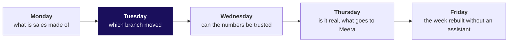
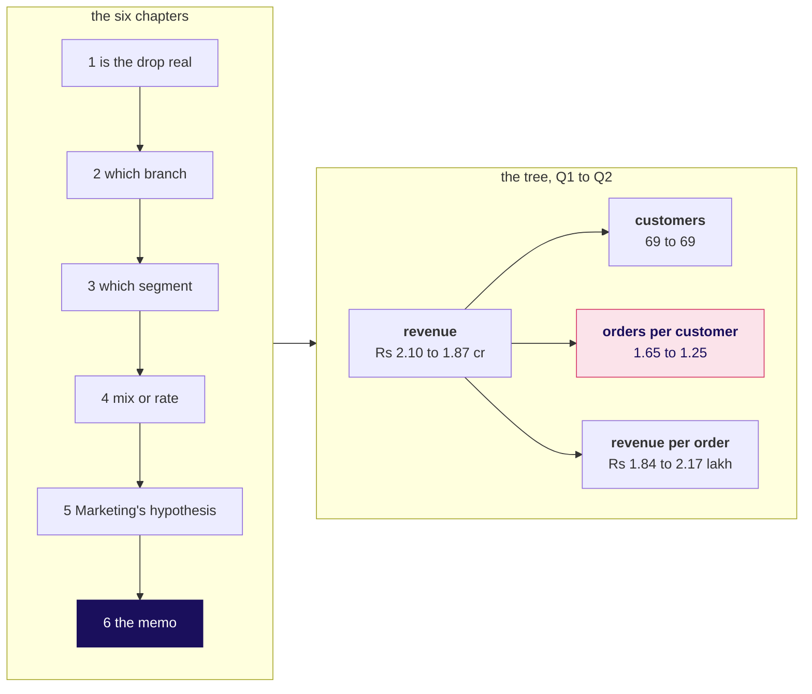

# Which branch moved, and how you would know

**Week 1, Tuesday. Study notes, read after the session.** A drop is investigated on a fixed ladder of
six chapters: confirm it on matched windows, decompose it along the tree, find the segment, separate
mix from rate, test the hypothesis the loudest voice brings, and hand over a cause with its ceiling
and the evidence that would settle it. Every chapter weighs two to four ways of answering, sizes
them, picks one, and reaches the same number a second way. Reading time: about 35 minutes.

---

## What you can now do

1. You can check whether a drop is real before explaining it, and choose between closed quarters,
   the same weeks of each, a rate per week and last year's quarter, saying what would switch you.
2. You can split a change in revenue into customers, orders per customer and revenue per order, show
   that they multiply back, and put rupees on each branch with a bridge whose order you state.
3. You can decide between copying code, writing a function and grouping by a key, and roll a rate up
   from segments with its weights.
4. You can say how much of a blended rate's change came from the mix and how much from behaviour
   inside each segment.
5. You can test a stakeholder's claim in its own terms, catch a helper that drops a group, and judge
   a segment against the business it belongs to.
6. You can hand over a cause as a hypothesis with a ceiling, tested on timing, a comparison segment
   and the channel it predicts, and name the data that would settle it.

---

## Where this sits

**The business behind the numbers.** Kalpa Retail is the first business most of the room has worked
in. How a retailer earns, who owns which lever and why periods are compared like with like is told in
Monday's domain dossier, `content/W01/D1/study-notes/C2_W01_D01_domain_retail_STUDENT.md`, and these
notes lean on it rather than retelling it. Today uses four of its parts: section 2 on Retail-Plus, the
paid tier, and why memberships buy frequency; section 5's revenue tree, average order value (whose
trap is today's chapter 4) and frequency; section 5's same-store sales, which is chapter 1's matched
windows; and section 4 on who asks for which number.

```mermaid
flowchart LR
    M["<b>Monday</b><br/>what is sales made of"] --> T["<b>Tuesday</b><br/>which branch moved"]
    T --> W["<b>Wednesday</b><br/>can the numbers be trusted"]
    W --> H["<b>Thursday</b><br/>is it real, what goes to Meera"]
    H --> F["<b>Friday</b><br/>the week rebuilt without an assistant"]
    classDef today fill:#1A0F5C,stroke:#1A0F5C,color:#FFFFFF
    class T today
```

This map of the week is this programme's own construction, drawn from the Week 1 rows.

**What was left out.** Whether the export itself can be trusted waits for Wednesday, when Finance
compares its books with the dashboard; tomorrow's reconciliation may change tonight's numbers.
Whether the differences found today are real waits for Thursday.

---

## The picture to remember: the ladder beside the tree

```mermaid
flowchart LR
    subgraph LAD["the six chapters"]
        direction TB
        R1["1 is the drop real"] --> R2["2 which branch"]
        R2 --> R3["3 which segment"]
        R3 --> R4["4 mix or rate"]
        R4 --> R5["5 Marketing's hypothesis"]
        R5 --> R6["6 the memo"]
    end
    subgraph TREE["the tree, Q1 to Q2"]
        direction LR
        V["<b>revenue</b><br/>Rs 2.10 to 1.87 cr"] --> C["<b>customers</b><br/>69 to 69"]
        V --> F["<b>orders per customer</b><br/>1.65 to 1.25"]
        V --> O["<b>revenue per order</b><br/>Rs 1.84 to 2.17 lakh"]
    end
    LAD --> TREE
    classDef bet fill:#1A0F5C,stroke:#1A0F5C,color:#FFFFFF
    classDef moved fill:#FBE3EA,stroke:#D63A6A,color:#1A0F5C
    class R6 bet
    class F moved
```

Read the ladder from the top: each chapter answers a question that must be settled before the next
one is worth asking. The tree beside it is Monday's tree with Tuesday's numbers written in, and the
shaded branch is the one that moved. The thread through every chapter is one sentence to Meera,
which starts as "revenue fell" and ends as a claim with its evidence, its caveat and its ceiling.

The eight lines the day comes down to:

1. Confirm the drop on matched windows before you explain it.
2. A rate without its denominator is a rumour.
3. Decompose along the tree: customers, orders per customer, revenue per order.
4. Missing means unknown until someone chooses a default and writes down why.
5. Roll a rate up with its weights; never average the averages.
6. A blended rate can move while no segment moves; split mix from rate.
7. A function returns its answer; count the groups in and the groups out.
8. Name the cause as a hypothesis, with its ceiling and the evidence that would settle it.

---

## Chapter 1: is the drop real

**The need.** Marketing has asked for Rs 12 crore to acquire customers, on a slide that says revenue
fell 25.9 percent. Meera owns the budget, the metric is the change in booked revenue, every order
placed before any cancellation or return, between two quarters, and a wrong number costs in both directions: overstate the fall and crores move in a hurry
on a lever nobody checked; understate it and a leak runs another quarter. Kalpa's financial year
opens in April, so Q1 is April to June and Q2 July to September, and both have closed.

**Who else faces this.** Retailers compare like with like on purpose. DMart reports like-for-like
growth, sales growth counted only on stores open in both periods, and only on stores open at least 24
months, 8.1 percent in FY26; Target defines comparable sales, its own like-for-like measure, against a
prior period of equivalent length, and its 53-week fiscal 2023 carried an extra week worth
$1,715 million; the National Retail Federation's 4-5-4 calendar gives comparable months the same
weeks and weekends.

**The options, sized on this file.**

| Option | Rows read | Answer | Controls for |
|---|---|---|---|
| A. Closed quarters as totals | 200 | minus 11.0 percent | Length, once both have closed |
| B. The same 11 weeks of each | 167 | minus 17.0 percent | Length and position, while a quarter is open |
| C. Per day, closed quarters | 200 | minus 11.9 percent | Length, whatever the windows |
| D. The same quarter last year | 0 | cannot run | The season; needs rows this file lacks |

What separates them is the question each answers and what each leaves out. **The call** is A,
because both quarters closed at 13 weeks each. **What would change it:** Q2 still open means B, and a
question about the monsoon means D and a data request.

**The build.** A dictionary keyed by quarter adds revenue in one pass: Rs 2,10,00,000 to
Rs 1,87,00,000, a fall of Rs 23,00,000 and 11.0 percent.

**The trap.** Marketing's Q2 figure is a dashboard tile read on 15 September: Rs 1,55,59,950 against
all of Q1 gives minus 25.9 percent, with correct arithmetic. The tile holds 11 weeks against 13. The
check that catches it in a minute is the first and last order date of each window. The fix is the
closed quarters, and a bridge shows where the extra fall went: the last two weeks of Q2, which the
tile had not reached, held 16 orders and Rs 31,40,050. The fall Meera acts on shrank from
Rs 54,40,050 to Rs 23,00,000.

A rate per week puts unequal windows on one scale if it says its numerator, denominator and window:
Rs 16,15,385 a week in Q1 against Rs 14,14,541 on the tile, minus 12.4 percent. The same 11 weeks of
each quarter give minus 17.0 percent, because a few lakh-sized Business orders make weeks lumpy, so
which weeks a cut includes moves the answer. Once a quarter closes, compare closed quarters.

**The second route.** Key the accumulator by the month in the order date instead of the quarter
field, and add the months back: April to June give Rs 2,10,00,000 and July to September
Rs 1,87,00,000, the same minus 11.0 percent. Agreement shows that the quarter field and the dates
give each quarter the same total, in aggregate only, since two mislabelled orders of equal value would
cancel out. Use the month key once a question moves inside a quarter.

---

## Chapter 2: which branch moved

**The need.** Meera asks whether Kalpa is losing customers or whether the ones it has buy less.
Each branch has an owner and a price tag: customers belong to Marketing and cost acquisition spend;
orders per customer to the tier and product owners, working on people already won; revenue per order
to merchandising, the team that chooses the range and the pack sizes; price and discounts to
Finance with Marketing. The metric is the rupees each branch
carries of the Rs 23,00,000 fall, and a wrong split sends crores to the wrong owner.

**Who else faces this.** Blinkit, the quick-commerce app, reports orders and net average order
value, the average order after discounts, side by side, 273.9
million orders at Rs 525 in the fourth quarter of FY26, about Rs 14,386 crore of net order value.
Walmart splits U.S. comparable sales into transactions and average ticket, the average spend per
transaction, each quarter: in the
quarter to 31 July 2026, up 2.6 percent, made of transactions up 1.5 and ticket up 1.1.

**The options, sized on this file.**

| Option | Frequency is charged | Depends on order? |
|---|---|---|
| A. Leaf percentages only | no rupees, since percentages do not add | no |
| B. A bridge in the tree's order | minus Rs 51,57,895 | yes |
| B, with the order reversed | minus Rs 60,88,372 | yes |
| C. A symmetric logarithmic split | minus Rs 55,88,480 | no |
| D. Customer by customer | 69 rows to read before any total | no |

**The call** is B with its order written beside it, because it adds exactly and a CEO can follow it,
and in every order frequency carries the fall. **What would change it:** a split that Finance
rebuilds every month goes symmetric, so nobody argues about order; "which customers?" goes to D.

**The build.** A dictionary of customer ids per quarter counts 69 customers in both. The leaves:
orders per customer 1.65 to 1.25, down 24.6 percent; revenue per order Rs 1,84,211 to Rs 2,17,442, up
18.0 percent. They multiply: 1.000 times 0.754 times 1.180 is 0.890, the revenue ratio. Adding the
percentages would have said minus 6.6. The bridge: customers Rs 0, frequency minus Rs 51,57,895,
order value plus Rs 28,57,895. Marketing's branch carries no rupees on this file.

**The trap.** Meera's fourth branch is price, and Marketing's monsoon plan starts from the share of
orders carrying a discount. Indexing the missing field raises `KeyError`, a runtime error that takes
two minutes. The trap is what the quick fix decides: `order.get("discount", 0)` reads every blank as
zero, and 50.0 percent of Q2's orders, 43 of 86, seem to carry no discount, so Marketing extends the
discount to "the other half". The check splits the 43: 17 record Rs 0 and 26 carry no field at all.
The fix writes the rule down, "absent means not recorded; reported separately; never counted as
zero", reports 71.7 percent over the orders that record the field, gives the range the blanks allow,
50.0 to 80.2 percent, and bounds the branch: at Rs 150 on every Q2 order, the largest recorded, it
holds at most Rs 12,900 of a Rs 23,00,000 fall. Discounts leave the list of causes.

**The second route.** Split the fall symmetrically instead, each leaf taking a share in proportion
to its logarithmic change, so that no order is chosen at all: frequency minus Rs 55,88,480, order
value plus Rs 32,88,480, customers nothing. An independent method puts the fall on the same branch,
and the Rs 4,30,585 between the two frequency figures is the part where frequency and order value
moved together. Keep the bridge for Meera; go symmetric when someone rebuilds the split every month.

---

## Chapter 3: which segment

**The need.** The head of Retail-Plus, the paid tier, forwards a member's complaint about the app's
reorder button and asks whether his tier is slipping. His renewals are the metric of his job, so
orders per member is his number. A wrong answer costs a tier nobody protects, or a quarter spent
fixing one that was fine.

**Who else faces this.** Costco reports its renewal rate, the share of members who pay again for
another year, twice, 92.3 percent in the United States and
Canada and 89.8 percent worldwide at the end of fiscal 2025, because a blend would hide where
renewals are weaker.

**The options, sized on this file.** The same five numbers are needed for four segments in two
quarters.

| Option | Lines | Places to edit | Rows read |
|---|---|---|---|
| A. Copy the loop per group | 72 | 8 | 1,600 |
| B. A function, `tree_for(rows)` | 21 | 1 | 200 |
| C. Group by a key in one pass | 14 | 1 | 200 |

**The call** is B, because the same numbers will be asked for a channel, a month and delivered orders
before the day ends, and a function answers each with one line. **What would change it:** millions of
rows with every group needed at once means C, which is `groupby` in Week 2.

**The build.** `tree_for` returns a dictionary rather than printing, so its answer can go into a
table, a chart or a check, and it earns trust by reproducing chapter 2: 1.65 and 1.25 on 69
customers. `describe` returns a group's median, smallest and largest values and range. Retail-Core's
34 customers slipped from 1.12 to 1.06 orders each, minus 5.3 percent, and its median order fell from
Rs 2,325 to Rs 2,080. Business's median barely moved, Rs 9,83,780 to Rs 9,52,000, while one order of
Rs 29,45,460 widened the range by about 73 percent; its 11 customers fell 15.0 percent on three orders.

**The trap.** Averaging the four segments' orders per customer gives 1.94 then 1.82, minus 6.0
percent: "frequency is not the branch, Marketing may be right". A 2-customer segment votes as much as
a 34-customer one. The check is that a roll-up must reproduce the company figure, 1.65 and 1.25, and
this one does not. The fix is total orders over total customers, 114 over 69 then 86 over 69, minus
24.6 percent, counting four groups in and 69 customers back.

**The second route.** One pass over the 200 orders, adding into `totals[(quarter, segment)]`, gives
the same revenue, orders and customers as `tree_for` for all eight groups. It prints agreement and no
segment's numbers; your own run of all four segments is the one that names where orders per member
fell furthest.

---

## Chapter 4: mix or rate

**The need.** Your run showed Retail-Plus: the same 22 members placed 26 orders in Q2 against 51 in
Q1. Marketing reads the 18 percent rise in revenue per order as customers paying more and wants a
price rise in the plan. Revenue per order is a blend across segments whose orders differ several
hundredfold, and a wrong reading costs volume: a price rise on customers who never paid more.

**Who else faces this.** Swiggy reported the average order value of Instamart, its quick-commerce
store, up 14 percent in a quarter to Rs 697 in the quarter to September 2025, and put it down to
non-grocery categories and large packs taking a larger share of gross order value, the value of
orders before discounts. The average order grew because the mix of what people bought moved.

**The options.** A, read the blended change, which gives the size and no cause; B, each segment's
own revenue per order, which says whether any segment paid more; C, split the rise into mix and rate,
which puts rupees on each and makes them add to the Rs 33,231 rise; D, medians per segment, which give
the typical order and no rupees. **The call** is C, built on B. **What would change it:** segments of
similar order size, or shares that held, make mix negligible and B enough.

**The build.** Of the 28 lost orders, 25 were Retail-Plus, 3 Business and 2 Retail-Core, while
Student gained 2. Inside each segment revenue per order moved a little: Retail-Core minus 4.9
percent, Retail-Plus plus 7.0, Business plus 5.0, Student plus 14.8.

**The trap.** "Revenue per order rose 18.0 percent, so customers pay 18 percent more" would put a
price rise on the tier whose orders already halved. The check is the per-segment table: no segment
rose 18 percent. The fix prices Q2's order mix at Q1's segment rates: Rs 2,07,112, so the mix
explains Rs 22,902 of the rise, about 69 percent, and the rate inside segments Rs 10,330, more than
nine tenths of it Business's lakh-sized orders. Retail-Plus fell from 44.7 to 30.2 percent of orders.
The price rise loses its evidence.

**The second route.** Treat Kalpa as two groups on the back of an envelope, Business and everyone
else: Business's share of orders rose from 17.5 to 19.8 percent, and a Q1 Business order was worth
Rs 10,36,125 more than a consumer order, so the mix is about Rs 23,000, 69.3 percent of the rise. It
uses no consumer rate, so it could have disagreed with the four-segment split, and it lands within
one percent. Report the four-segment split, which names each segment.

---

## Chapter 5: Marketing's hypothesis

**The need.** Marketing pushes back three ways: a flat count can hide churn, customers who stop
buying, replaced by new customers; Retail-Plus is Rs 65,250 of a Rs 23 lakh fall; and last quarter's summary script says
Business fell most. The metric is retention and its mirror, new customers, and the Rs 12 crore rides
on it.

**Who else faces this.** Harvard Business Review summarised the studies behind the retention
argument: acquiring a customer costs 5 to 25 times more than retaining one, and Bain's Frederick
Reichheld found a 5 percent rise in retention lifting profits 25 to 95 percent. Those are estimates
across industries, never Kalpa's; the reply asks Finance for Kalpa's own acquisition cost. Swiggy
reports its users and their frequency apart: in the quarter to September 2025 monthly transacting
users, the people who ordered at least once in a month, rose 34.0 percent to 22.9 million while orders per user a month fell from 4.53 to 4.10, a growing count beside a falling frequency, which new users alone could produce, so the two are read apart.

**The options.** A, compare the counts, which cannot see churn because a count is net; B, the
overlap of ids as sets, which names lost and new; C, customer by customer, which also names who
slowed; D, sign-ups from Marketing's CRM, its customer database, which see only new customers from
a second system. **The call**
is B, then C. **What would change it:** one person holding a store id and an app id would make the
overlap invent churn, and the ids would need joining first.

**The build.** The overlap is 69 in both quarters, none only in Q1, none only in Q2. Customer by
customer, 23 placed fewer orders in Q2 and 18 of them are Retail-Plus members; 44 ordered exactly as
often as before.

**The trap.** The summary script runs cleanly and prints `{'Retail-Core': -5.3, 'Business': -15.0}`,
"most in Business". Its helper prints a warning for any change above 30 percent and returns nothing,
so Python hands back `None`, and `if ch and ch < 0` drops every `None` without a word. Retail-Plus,
minus 49.0 percent, is exactly the change the script was written to flag, and it vanished. The check
counts groups in and out: four in, two back. The fix returns the change every time and puts the flag
in its own column: Retail-Plus minus 49.0 percent, Business minus 15.0 on three orders, Student plus
40.0.

**The consumer business.** Business orders run to lakhs, so a consumer segment is judged against the
consumer business: Rs 2,28,820 to Rs 1,58,540, a fall of Rs 70,280, of which Retail-Plus is Rs 65,250,
93 percent, and 25 of the 28 lost orders. The rupee fall in Business is three orders out of twenty,
each worth lakhs, so one account ordering early or late moves it by lakhs.

**The second route.** Take each customer's first and last order date in the export: every first
order falls in Q1 and every last order in Q2, so none new and none lost, from the dates alone and
without the quarter field. It could have disagreed with the overlap, and it adds a warning the overlap
cannot: a first order in this export is only the first since 1 April.

---

## Chapter 6: the memo and its evidence

**The need.** The head of Retail-Plus says the broken reorder button, six weeks old, caused the fall;
Meera wants one page of what we know and what we guess. The metric is Retail-Plus orders per week
before and after the break, taken at its word as 25 August. The decision is engineering's priority
and the story Meera tells the board.

**Who else faces this.** Sonos rolled out a redesigned app in 2024; its chief executive said the app's rollout had required it to reduce its fiscal 2024 guidance, the
revenue it had told investors to expect, and its
annual report set out short-term costs of up to $30 million to fix it.

**The options.** A, before and after the break, which can rule out the button as the whole story; B,
a comparison segment, Retail-Core, which can rule out a season that hit everyone; C, the channel the
cause predicts, which can rule out an app-only cause; D, the app's reorder logs, a data request that
settles it later. **The call** is A, B and C now, timing first, and D requested today. **What would
change it:** a break date earlier than the complaint says would flip A's verdict.

**The build.** A counting function that takes any key, `count_by(rows, key)`, is chapter 1's
accumulator grown. By month, Retail-Plus stepped down in July, before the break, while Retail-Core
held level.

**The trap.** The hurried memo charges the button with the tier's whole quarter: 51 orders to 26, so
"the button cost 25 orders and Rs 65,250". Engineering fixes it, recovers a handful, and the real
problem runs another quarter. The check splits Q2 at the break with each side's window: 3.92 orders a
week in Q1, 2.29 before the break, 1.51 after. The fix charges the button with no more than the fall
after the break beyond the pace already set: at 18 orders in 55 days, the 37 days after would have
carried about 12.1 orders, and the tier placed 8, so the button explains at most about 4 orders,
about Rs 12,400. Retail-Core kept 95 percent of its Q1 orders against Retail-Plus's 51, so a season
that hit everyone does not fit; every Retail-Plus channel fell, web 24 to 9, store 14 to 9, app 13 to
8, so an app-only cause does not fit.

**The second route.** Correct the pace by a segment the button cannot touch: Retail-Core placed 22
orders in the 55 days before 25 August and 14 in the 37 after, a pace 0.946 of what it had been.
Scaled by that, the tier's expected 12.1 becomes 11.5 against 8 placed, about 3.5 orders, which lands
inside the ceiling of about 4, as a ceiling should. Write the ceiling in the memo; bring the corrected
route when someone argues for the season.

**The memo.** "Revenue fell 11.0 percent between two closed quarters, Rs 2.10 crore to Rs 1.87 crore
on the export as it stands. Customers held at 69, all of them buying in both quarters, so acquisition
is not the branch that moved; orders per customer fell from 1.65 to 1.25. In behaviour the fall sits
in Retail-Plus, where the same 22 members placed 26 orders against 51, and revenue per order rose
mainly because those small orders disappeared. In rupees most of the fall is three fewer Business
orders, each worth lakhs, so one account's timing moves it by lakhs. The fall began in July, before the button broke, and
hit every channel, so the button explains at most about 4 orders. Two hypotheses remain: the button
deepened the fall after 25 August, settled by the reorder logs by week and the release date; and
something changed for members in July, settled by the tier's change log, renewals and support
tickets. Last year's Q2 by segment rules the season in or out."

---

## The afternoon's two cases

**The escalated case** reruns the ladder alone on delivered orders, the board's definition: orders
that reached the customer and were not returned. The drop
survives, minus 11.3 percent; frequency still carries the most rupees; Retail-Plus falls 42.6 percent
per member. One branch moves that held on booked orders: customers with a delivered order fall from
54 to 50. All 19 who left the delivered count booked again in Q2 and had those orders cancelled or
returned, so the branch is cancellations and returns, to be split by reason between the teams that
deliver orders and the teams that own the product, and acquisition still has nothing to replace. On delivered orders the mix explains 44 percent of the rise in revenue per order, with
Business's larger delivered orders carrying the rate.

**The second case** takes Marketing's new deck apart in pairs: the members' 7 percent more per order
is one leaf, and the tier's leaves multiply to 1.000 times 0.510 times 1.070, 0.546, so its revenue
fell about 45 percent; the web claim fails because Retail-Core's web orders held at 13 and 12 on the
same website; and the tier's call list starts with the 7 members who went from three orders a quarter
to one.

---

## Try this yourself

No writing: pick a letter for each, then check the key.

1. Q1 covers 13 weeks and the Q2 tile covers 11. The fair comparison is: a) the two totals; b) the
   two totals adjusted by 10 percent; c) closed quarters, or a rate per week on both; d) the two
   medians.
2. Customers are flat and orders per customer fell 24.6 percent. Marketing's acquisition plan targets:
   a) the branch that moved; b) the branch that did not move; c) revenue per order; d) discounts.
3. Four segments average 1.94 orders per customer, and the company figure is 1.65. The difference
   comes from: a) rounding; b) a missing field; c) a bad window; d) weights, since small segments
   count once each.
4. A function prints its result and has no `return`. A variable set to its call holds: a) the printed
   text; b) `None`; c) zero; d) an error.
5. Some orders carry no discount field. In the share of orders with a discount they count as: a) no
   discount; b) the average discount; c) unknown, reported separately; d) the largest discount.
6. From Monday: the mean order doubled and the median did not move. The first check is: a) read the
   top of the sorted list; b) recount the customers; c) change the window; d) drop the largest order.

Key: 1c 2b 3d 4b 5c 6a. If you missed 1, reread chapter 1; 2, chapter 2; 3, the trap in chapter 3; 4,
the trap in chapter 5; 5, the trap in chapter 2; 6, Monday's notes on the average that lies.

---

## Where this gets tested

**1. [S] Sales dropped 15 percent last month; how would you investigate?** Tested: order before
opinion. Strong: confirm the drop on matched windows and one definition; decompose along the tree into
customers, orders per customer and revenue per order; split by segment and channel; separate mix from
rate; then state a hypothesis with the evidence that would settle it, timing first. Weak: a list of
possible causes before the drop has been confirmed.

**2. [S] Why is a rate without a denominator meaningless?** Tested: whether numbers are read as
claims. Strong: a rate is a numerator over a denominator in a window, and without the denominator no
one can tell whether the top rose or the bottom shrank; "orders per customer fell" means little until
it says 86 over 69 against 114 over 69. Weak: "because it could be misleading", with no example.

**3. [F] Why does a function that prints instead of returning break a pipeline?** Tested: the
difference between showing and handing back. Strong: printing sends text to the screen and returns
`None`, so every caller receives nothing; a later filter can drop `None` silently and a group vanishes
from the summary; return the value and let the caller decide what to print. Weak: "printing is slower".

**4. [F] What has to match before a quarter-on-quarter comparison is fair?** Tested: like with like.
Strong: the same length of window or a rate per week or per day, the same definition of revenue, the
same segments, and the same denominators; once a quarter closes, compare closed quarters; and say that
a quarter-on-quarter comparison still carries the season, which only the same quarter last year
removes. Weak:
comparing whatever totals the dashboard shows.

**5. [D] Marketing insists the answer is acquisition and your data says frequency; how do you make the
case in the room?** Tested: judgement under pressure. Strong: agree the goal, show the tree with
customers flat and the id overlap showing none lost and none new, show frequency falling in one
segment, and offer the cheaper next step of testing the frequency hypothesis before spending on
acquisition. Weak: winning the argument without naming what evidence would change your mind.

**6. [F] Revenue fell 11 percent; how do you split the change between customers, frequency and order
value?** Tested: decomposition. Strong: compute the three branches for both periods, check that their
ratios multiply back to the ratio of the totals, then build a bridge in rupees that moves one branch at
a time from the start value to the end value, saying which branch moved first, or use the symmetric
logarithmic split so the answer does not depend on the order. Weak: three percentage changes added
together.

**7. [F] Revenue per order rose 18 percent while revenue fell; did prices go up?** Tested: mix against
rate. Strong: not necessarily, since an average across segments moves when the mix of orders moves;
price the later period's mix at the earlier period's segment rates to separate the two, and here about 69 percent of the rise
came from small Retail-Plus orders disappearing. Weak: "yes, prices went up".

**8. [S] A field is missing on some records; do you fill it with zero?** Tested: missing against zero.
Strong: only if absent truly means zero and someone has written that down; otherwise report the count
of absent records separately, compute averages over recorded values, and bound the effect with the
largest plausible value. Weak: "yes, `.get` with a default of zero".

**9. [F] You have orders per customer for four segments; why can't you average them for the company
figure?** Tested: weighted roll-ups. Strong: a plain average counts each segment once regardless of
size; the company figure is total orders over total customers, and the check is that the roll-up
reproduces the known total. Weak: "the average is close enough".

**10. [SV] The customer count is flat quarter on quarter; does that prove no customers were lost?**
Tested: counts against identities. Strong: no, since losses can be replaced by new customers at the
same count; compare the sets of customer ids to count lost, retained and new. Weak: "yes, the number
did not change".

**11. [D] The fall is in rupees in one segment and in behaviour in another; which do you put in front
of the CEO first?** Tested: judging what the decision needs. Strong: put both, each labelled, and
lead with the one that is actionable and stable; a rupee fall made of three lakh-sized orders moves
whenever one account orders early or late, while 18 of a tier's 22 members slowing as its orders
halved is a change in behaviour, so name each with its size and its caveat. Weak: choosing the bigger
rupee number without saying how many orders it is made of.

**12. [D] A stakeholder hands you a cause; how do you test it with the data you have and name the data
you need?** Tested: hypothesis discipline. Strong: restate the cause as a hypothesis, test what the
file can test, which is timing against the fall and whether the channel the cause lives in fell first
and alone, and then name the data that would settle it, such as event logs and release dates. Weak:
accepting or rejecting the cause on instinct.

**13. [D] The design question: the same metrics are needed for every segment and quarter; do you
copy the code, write a function or group by a key?** Tested: sizing a choice. Strong: a function when
groups are asked one at a time and the definition may change, since there is one place to edit and it
answers any subset; one pass by key when the file is large and every group is needed at once; copying
means eight edits and one forgotten. Weak: "a function, because it is cleaner", with no cost named.

**14. [D] The design question: which test of a cause do you run first, and when do you stop?**
Tested: an order with a reason and a stopping rule. Strong: timing first because it is cheap and can
rule a cause out; then a comparison group and the channel the cause predicts; stop when the export can
only cap the cause, here at about 4 orders, and request the data that settles it. Weak: running every
test at once, or waiting for the logs before running any.

---

## Glossary

| Term | What it means here | Where it appeared | Example |
|---|---|---|---|
| Matched windows | Two periods of the same length compared, or both turned into a rate | Chapter 1 | Two closed 13-week quarters, a fall of 11.0 percent |
| Rate | A numerator over a denominator in a stated window | Chapter 1 | Rs 16,15,385 a week in Q1 |
| Like-for-like | A comparison that holds the outlets, the weeks and the weekends equal | Chapter 1; DMart, Target, NRF | Two closed 13-week quarters |
| Decomposition | A change split along the tree into branches that multiply | Chapter 2 | 1.000 times 0.754 times 1.180 is 0.890 |
| Bridge | A change in rupees moved one branch at a time from start to end | Chapter 2 | Orders per customer took away Rs 51,57,895 |
| Range | The largest value less the smallest, set by two orders alone | Chapter 3; `describe` | Business, Rs 15,80,940 in Q1 |
| Mix | Each segment's share of orders | Chapter 4 | Retail-Plus, 44.7 to 30.2 percent of orders |
| Rate part | The change inside segments, mix held still | Chapter 4 | Rs 10,330 of the Rs 33,231 rise |
| Default | The value used when a field is absent, with its written reason | Chapter 2 | Absent discount reported separately, never counted as zero |
| Function | A named block that takes inputs and returns one answer | Chapter 3 | `tree_for(rows)` returns a dictionary of the tree |
| Weighted roll-up | A company rate built from totals, so each group counts by its size | Chapter 3 | 114 orders over 69 customers is 1.65 |
| Mix against rate | An overall rate split into a change of weights and a change inside groups | Chapter 4 | Mix explains about 69 percent of the rise in revenue per order |
| Hypothesis | A named cause stated with the evidence that would settle it | Chapter 6 | The reorder feature, settled by the app's reorder logs |
| Ceiling | The most a cause could explain, given what else was already moving | Chapter 6 | The button, at most about 4 orders |
| Id overlap | Customer ids in both periods, only the first, only the second | Chapter 5 | 69, 0 and 0 |
| Second route | The same answer reached by an independent method, one that could have disagreed | Every chapter | The symmetric split puts the fall on frequency, as the bridge did |

---

## Go deeper

| Order | What | Time | Why this one |
|---|---|---|---|
| 1 | Brit Institute, analyst case study interview questions, https://britinstitute.uk/blog/data-analyst-case-study-interview-questions (verified 29 Sep 2026) | 15 minutes | The sales-drop question as interviewers ask it |
| 2 | Exponent, data analyst interview questions, https://www.tryexponent.com/blog/top-data-analyst-interview-questions (verified 29 Sep 2026) | 20 minutes | The metric questions that follow it |
| 3 | Khan Academy, summarizing quantitative data, https://www.khanacademy.org/math/statistics-probability/summarizing-quantitative-data (verified 29 Sep 2026) | 25 minutes | A typical value and a spread |
| 4 | Khan Academy, mean, median and mode review, https://www.khanacademy.org/math/statistics-probability/summarizing-quantitative-data/mean-median-basics/a/mean-median-and-mode-review (verified 29 Sep 2026) | 10 minutes | The median by hand, as `describe` computes it |
| 5 | Corey Schafer, "Python Tutorial for Beginners 8: Functions", https://www.youtube.com/watch?v=9Os0o3wzS_I (verified 29 Sep 2026) | 25 minutes | Defining a function that returns |
| 6 | Python documentation, "More Control Flow Tools", the section on defining functions, https://docs.python.org/3/tutorial/controlflow.html (verified 29 Sep 2026) | 15 minutes | Where a function without `return` is shown to give `None` |
| 7 | Python documentation, built-in types, `dict.get`, https://docs.python.org/3/library/stdtypes.html (verified 29 Sep 2026) | 5 minutes | What a default supplies when a key is absent |
| 8 | Corey Schafer, "Python Tutorial: Using Try/Except Blocks for Error Handling", https://www.youtube.com/watch?v=NIWwJbo-9_8 (verified 29 Sep 2026) | 20 minutes | The other way to meet a `KeyError`, and the decision hidden in the `except` |
| 9 | Python documentation, the statistics module, `median`, https://docs.python.org/3/library/statistics.html (verified 29 Sep 2026) | 5 minutes | The library median to check your own against |
| 10 | Harvard Business Review, Amy Gallo, "The Value of Keeping the Right Customers", https://hbr.org/2014/10/the-value-of-keeping-the-right-customers (verified 29 Sep 2026) | 5 minutes | What each branch costs to move |
| 11 | National Retail Federation, the 4-5-4 calendar, https://nrf.com/resources/4-5-4-calendar (verified 29 Sep 2026) | 5 minutes | How retailers keep periods comparable |
| 12 | Costco, fourth quarter fiscal 2025 results (renewal rates), https://www.sec.gov/Archives/edgar/data/909832/000090983225000093/costex9928-k92525.htm (verified 30 Sep 2026) | 5 minutes | A blended rate reported beside its segment |
| 13 | Walmart, earnings release for the second quarter of fiscal 2027, https://stock.walmart.com/_assets/_921ff28c537145729fbc2553b7f43fac/walmart/db/938/9996/earnings_release/Earnings+Release+(FY27+Q2).pdf (verified 30 Sep 2026) | 10 minutes | Transactions and average ticket, the tree in a results table |
| 14 | Swiggy, Q2 FY2026 shareholder letter, https://www.swiggy.com/corporate/wp-content/uploads/2025/10/Q2-FY2026-Shareholder-letter.pdf (verified 30 Sep 2026) | 10 minutes | An order value that rose on its mix, said as a mix |
| 15 | Target, fourth quarter and full year 2023 results, https://corporate.target.com/press/release/2024/03/target-corporation-reports-fourth-quarter-and-full-year-2023-earnings (verified 30 Sep 2026) | 5 minutes | A 53-week year and comparable periods of equal length |
| 16 | Sonos, third quarter fiscal 2024 results, https://investors.sonos.com/news-and-events/investor-news/latest-news/2024/Sonos-Reports-Third-Quarter-Fiscal-2024-Results/ (verified 30 Sep 2026) | 5 minutes | A broken app tied to guidance only with evidence |
