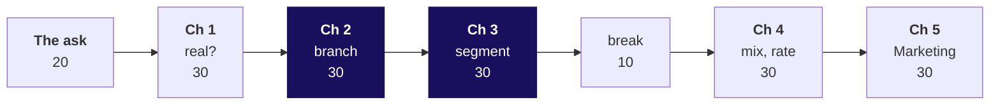
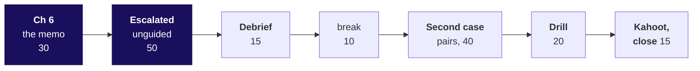

# Day sheet: Week 1, Tuesday. Which branch moved?

**TRAINER ONLY.** Nothing on this page reaches a learner.

Posts to <!-- sync:module:W01/D2 -->Module 1: Foundations of AI and Data<!-- /sync:module:W01/D2 -->, on <!-- sync:day-date:W01/D2 -->Tue 06 Oct 2026<!-- /sync:day-date:W01/D2 -->.

| | |
|---|---|
| **Start from** | Monday's tree and leaf counts, and the retail story in Monday's dossier (`content/W01/D1/study-notes/C2_W01_D01_domain_retail_STUDENT.md`, sections 2, 4 and 5, with its card in `content/W01/D1/cheatsheets/`); point at it, do not retell it. Open on Meera's reply, the Retail-Plus head's forwarded complaint and Marketing's claim, before any code. |
| **Go as far as** | Everyone names the branch and the segment with numbers, says what the rupee fall and the behaviour fall each are, and states the reorder cause as a hypothesis with its ceiling and the evidence that would settle it. |
| **Stop before** | Files (Wednesday), any test of whether a difference is real (Thursday), comprehensions and modules. When a learner asks "is 49 percent significant?", write it on the parking board for Thursday. |
| **Comes later** | Tomorrow's reconciliation changes tonight's numbers. Promise it once, at the close, and do not explain why. |
| **Cut first** | The second routes of chapters 4 and 5 to one sentence each, then percentage-change formalities. Never cut the options slide of a chapter, the chapter 2 bridge, the segment decomposition or the chapter 6 ceiling. |

The case in one line: Q2 fell from Rs 2.10 crore to Rs 1.87 crore; Meera wants the branch, the
Retail-Plus head wants to know if his tier is slipping and blames the reorder button, and Marketing
wants acquisition money.

Every chapter runs in one order: the need and who asks, the real company, the options with their
sizing and the call, the build with predictions, the trap, the second route, Kavya's review.

---

## Morning, 180 minutes

| Part | Slides (half one) | Beside it | What must land | If short of time |
|---|---|---|---|---|
| The ask and the thinking, 20 | S1 to S7 | The board: the ladder of six chapters, then Monday's tree with empty Q1 and Q2 columns | What each branch costs and who owns it; where in the pipeline a fake drop is made; changes multiply | S4 and S5 to one pass |
| Chapter 1, is the drop real, 30 | SECTION 1, S8 to S16 | Notebook `01_is_the_drop_real`; set `ch1_is_the_drop_real` | Four options sized, closed quarters chosen; 13 weeks against 11; minus 11.0 percent; the month route agrees | S15 to one sentence |
| Chapter 2, which branch, 30 | SECTION 2, S17 to S27 | Notebook `02_which_branch`; set `ch2_which_branch`; guided exercise | 69 and 69; the bridge's order changes the size, never the verdict; blank is unknown; bound Rs 12,900 | S18 to one sentence |
| Chapter 3, which segment, 30 | SECTION 3, S28 to S37 | Notebook `03_which_segment`; set `ch3_which_segment` | Copy, function or key sized; `tree_for` and `describe`; the weighted roll-up; the room finds the segment at S36 | Never cut S36 |
| Break, 10 | after S37 | | | |
| Chapter 4, mix or rate, 30 | SECTION 4, S38 to S45 | Notebook `04_mix_or_rate`; set `ch4_mix_or_rate` | 25 of 28 lost orders; no segment rose 18 percent; mix 69 percent | S45 to its table |
| Chapter 5, Marketing's hypothesis, 30 | SECTION 5, S46 to S54 | Notebook `05_marketings_hypothesis`; set `ch5_marketings_hypothesis` | Overlap 69, 0, 0; 18 of 23 who slowed are members; the helper that drops two segments; 93 percent of the consumer fall | S54's subtraction route to one sentence |

Do not run Retail-Plus or Student on the projector in chapter 3. The room runs all four segments in
its your-turn cell at S36 and says the segment aloud; chapter 4 opens by naming what the room found.

## Afternoon, 180 minutes

| Part | Slides (half two) | Beside it | What must land | If short of time |
|---|---|---|---|---|
| Chapter 6, the memo, 30 | SECTION 6, S1 to S10 | Notebook `06_the_memo`; set `ch6_the_memo` | Timing first; July before the break; the ceiling of about 4 orders; season and channel; two hypotheses with evidence | S9 to one sentence |
| Escalated case, 50 | SECTION 7, S11 to S12 | Brief `unguided/..._escalated_case`; notebook `ex1_escalated_case` (TODO twin) | The ladder on delivered orders; the customers branch moves and is fulfilment | Part 5 becomes homework |
| Debrief, 15 | SECTION 8, S13 to S16 | Solution notebook `ex1` released at the end | The four wrong answers with their numbers | S15 to one sentence |
| Break, 10 | | | | |
| Second case, pairs, 40 | SECTION 9, S17 to S18 | Brief `unguided/..._second_case`; notebook `ex2_second_case` | Student is 2 ids; Retail-Core web held; the 7 members; the July change log first | Hear one pair, not two |
| Interview drill, 20 | SECTION 10, S19 to S20 | The answers below | Twelve questions aloud in one breath each | Take 1, 5, 7, 11 and 12 |
| Kahoot and tomorrow, 15 | SECTION 11, S21 to S23 | `kahoot/C2_W01_D02_quiz_STUDENT.md` | The sentence to Meera; the eight crux lines; Anand's question left open | Never cut S21 |

The afternoon deck's chapter openers are numbered 6 to 11 by
`internal/C2_W01_D02_patch_section_numbers_INTERNAL.py`; rerun it after any rebuild of half two.

---

## Each chapter's options, call and second route

| Chapter | Options | The call, and what would switch it | Second route |
|---|---|---|---|
| 1 | Closed quarters; the same 11 weeks; per day; last year's Q2 | Closed quarters; Q2 open means same weeks; the season means last year | Revenue keyed by month adds to the same minus 11.0 |
| 2 | Leaf percentages; bridge in tree order; bridge reversed; symmetric split; customer by customer | Bridge in tree order, stated; symmetric if rebuilt monthly | 28 lost orders times Rs 1,84,211 equals the frequency step |
| 3 | Copy the loop per group; a function; one pass by key | Function; millions of rows and every group at once means one pass | One pass by key agrees with `tree_for` on all 8 groups |
| 4 | Blended change; per-segment rates; mix and rate split; medians | The split; similar order sizes would make the table enough | Rate first: mix 72 percent, same Rs 33,231 total |
| 5 | Counts; id overlap; customer by customer; the CRM | Overlap then per customer; split ids would need joining first | Company fall less Business equals the consumer bridge, Rs 70,280 |
| 6 | Before and after; comparison segment; channel; app logs | A, B and C now, D requested; an earlier break date flips A | The pre-break pace carried forward gives the same 4.1 orders |

## The traps, each with its exact wrong number

| Where | The wrong number | The decision it misleads | The check that catches it | The fix |
|---|---|---|---|---|
| Chapter 1 | Q2 tile to 15 Sep, Rs 1,55,59,950, "revenue fell 25.9 percent" | A crisis read that rushes the Rs 12 crore | First and last order date per window: 13 weeks against 11 | Closed quarters: minus 11.0 percent, Rs 23,00,000; per week minus 12.4 |
| Chapter 2 | Absent discount read as zero: 50.0 percent of Q2 orders carry a discount, 43 of 86 "had none" | Marketing extends the monsoon discount to "the other half" | Split the 43: 17 record Rs 0, 26 carry no field | 71.7 percent where recorded, range 50.0 to 80.2; bound Rs 12,900 |
| Chapter 3 | Average of four segment averages: 1.94 then 1.82, "frequency fell only 6.0 percent" | Frequency dismissed; acquisition back on the table | The roll-up must reproduce 1.65 and 1.25 | Weighted: 1.65 to 1.25, minus 24.6 percent |
| Chapter 4 | Revenue per order "up 18.0 percent, customers pay more" | A price rise on the tier whose orders halved | No segment's own revenue per order rose 18 percent | Mix Rs 22,902 of Rs 33,231, about 69 percent |
| Chapter 5 | `pct_change` prints above 30 percent and returns None: summary {Retail-Core -5.3, Business -15.0}, "Business fell most" | Business accounts first; the tier told it is not in the table | Four segments in, two numbers back | Return every change, flag it in a column: Retail-Plus minus 49.0 |
| Chapter 6 | "The button cost 25 orders, Rs 65,250" | Engineering promised a fix that recovers the tier | Split Q2 at 25 August with each window: 3.92, 2.29, 1.51 a week | Ceiling of about 4.1 orders, about Rs 12,400 |
| Escalated case | Delivered customers 54 to 50, "Marketing was right" | Acquisition funded on a fulfilment problem | Booked overlap 69, 0, 0; all 19 booked again | The branch is cancellations and returns, owned by operations |

The KeyError on `order["discount"]` is a runtime error: two minutes at S23, its last line and the
three ways past it, then S24. It is never the trap.

**Checkpoints, one learner each, under thirty seconds.** After chapter 1: "which comparison would you
send if Q2 were still open?" After chapter 2: "which branch moved, and by how much in rupees?" After
chapter 3: "why can four averages not be averaged?" After chapter 5: "how many segments went in, and
how many came back?" After chapter 6: "what is the most the button can explain?"

---

## The plants, and what to do if nobody finds each

| Planted | Where the room meets it | If nobody finds it |
|---|---|---|
| Customer count flat, 69 and 69 | Chapter 2, S20 to S21, after a Predict | It is your demonstration; ask who predicted "fewer customers" and why |
| Orders per customer falling in Retail-Plus only (2.32 to 1.18 on the file as exported, minus 49.0 percent) | Chapter 3, S36, on the room's own screens | Ask for the four `orders_per_customer` values read aloud in order; the outlier names itself. Never say it first |
| The discount field absent on a subset (32 of 114 Q1 records, 26 of 86 Q2) | The KeyError at S23; the count in notebook 02's empty cell | Ask how many orders `"discount" in order` is False for; let the room say the number |

**Wednesday's plant sits in today's file.** The v1 export carries 14 duplicated Q1 rows: 11
Retail-Plus orders in May (why Retail-Plus May reads 24), 2 Business orders at Rs 9,83,780 in April, 1
Retail-Core in June. They inflate Q1 by Rs 20,00,000 (clean Q1 is Rs 1.90 crore, a real fall of 1.6
percent), shrink the Retail-Plus fall to 35 percent once removed, and account for most of the Business
rupee fall. They also inflate some members' Q1 counts, so the second case's call list of 7 may change
tomorrow. Say none of this. If a learner points at May, write "May, 24?" on the parking board.

## The day's numbers

| Measure | Q1 | Q2 | Change |
|---|---|---|---|
| Revenue, booked | Rs 2,10,00,000 | Rs 1,87,00,000 | minus 11.0 percent |
| Orders | 114 | 86 | minus 24.6 percent |
| Customers | 69 | 69 | 0, the same 69 ids |
| Orders per customer | 1.65 | 1.25 | minus 24.6 percent |
| Revenue per order | Rs 1,84,211 | Rs 2,17,442 | plus 18.0 percent, about 69 percent of it mix |
| Retail-Plus orders per member | 2.32 | 1.18 | minus 49.0 percent, 51 orders to 26 |
| Business revenue | Rs 2,07,71,180 | Rs 1,85,41,460 | minus Rs 22,29,720, 97 percent of the fall, 3 orders |
| Revenue, delivered | Rs 1,45,04,970 | Rs 1,28,64,680 | minus 11.3 percent; customers 54 to 50 |

The tree multiplies back: 1.000 x 0.754 x 1.180 = 0.890. The bridge: customers Rs 0, orders per
customer minus Rs 51,57,895, revenue per order plus Rs 28,57,895. Retail-Plus monthly orders 14, 24,
13, 9, 9, 8; before the break 18 in 55 days, after it 8 in 37 days.

## The interview answers in one breath

1. **[S] Sales dropped 15 percent; investigate.** Confirm on matched windows, decompose along the tree, isolate branch and segment, split mix from rate, then hypothesise and name the evidence.
2. **[S] A rate without a denominator.** "Down 20 percent" of what, over which window and which base is unknown, so nobody can check it or compare it.
3. **[F] Print instead of return.** Print hands back None, so the next step silently drops or crashes on that value; our summary lost two of four segments.
4. **[F] A fair quarter comparison.** Same window length, same definition, same segments, same denominators; the season needs last year.
5. **[D] Marketing says acquisition, data says frequency.** Test their claim in its terms: 69 and 69, overlap 69, 0, 0; then where the fall is; then what would change my mind.
6. **[F] Splitting a revenue change.** A bridge one leaf at a time in a stated order; the order moves frequency between Rs 51.6 and 60.9 lakh and never the verdict.
7. **[F] Revenue per order up 18 percent.** Mostly mix: small Retail-Plus orders vanished; 69 percent of the rise.
8. **[S] Fill a missing field with zero?** Only when absence means zero and someone has written that down; otherwise report it separately and bound it.
9. **[F] Averaging segment rates.** Each segment counts once regardless of size; weight by the denominator and reproduce the total.
10. **[SV] Flat count means nobody left?** No; check the ids: here all 69 bought in both quarters.
11. **[D] Copy, function or group by key.** A function while groups are asked one at a time and definitions change; one pass by key on a large file with every group needed.
12. **[D] Testing a stakeholder's cause.** Timing first, then a comparison segment and the channel it predicts; cap it, here at about 4 orders, and request the logs.

## The practice lab

`exercises/practice/C2_W01_D02_practice_lab_STUDENT.md` with its solution, about an hour, run by a TA
from `trainer/C2_W01_D02_practice_lab_TA_TRAINER.md`, which says where learners stall and the one hint
per problem.

## The take-home, trainer only

`takehome/C2_W01_D02_brief_STUDENT.md` runs on `data/C2_W01_D02_takehome_STUDENT.py`, whose findings
differ from class on purpose: the export was cut on 15 September, so the headline minus 5.4 percent is
a window artefact (per week, up 11.8 percent); Retail-Core loses customers, 34 to 26 with none new;
frequency is flat. A memo that says "frequency in Retail-Plus" was copied from class.

## Which file serves which moment

| Moment | File |
|---|---|
| The whole morning on the projector | `slides/C2_W01_D02_half1_STUDENT.pptx` |
| The whole afternoon | `slides/C2_W01_D02_half2_STUDENT.pptx` |
| Chapters 1 to 6, demonstrated then run | `notebooks/C2_W01_D02_01_is_the_drop_real_STUDENT.ipynb` to `06_the_memo` |
| The escalated case and the second case | `notebooks/C2_W01_D02_ex1_escalated_case_STUDENT.ipynb` and `ex2_second_case`, with executed solutions in `exercises/solutions/` released at the debrief |
| Each chapter's close | `exercises/unguided/C2_W01_D02_ch1_is_the_drop_real_STUDENT.md` to `ch6_the_memo` |
| The debrief and the second case, live | `demos/C2_W01_D02_drop_simulator_STUDENT.html`, from the afternoon only |
| A learner revisiting a decision | `demos/C2_W01_D02_decision_tool_STUDENT.xlsx` |
| Tonight | Study notes, cheat sheet, board work, take-home, and Wednesday's pre-read |
