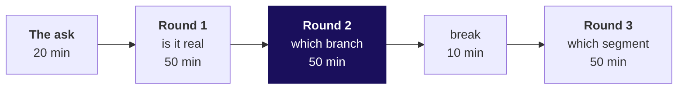
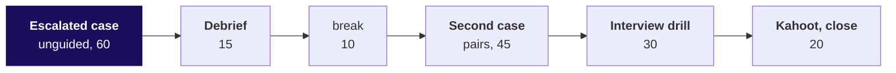

# Day sheet: Week 1, Tuesday. Which branch moved?

**TRAINER ONLY.** Nothing on this page reaches a learner.

Posts to <!-- sync:module:W01/D2 -->Module 1: Foundations of AI and Data<!-- /sync:module:W01/D2 -->, on <!-- sync:day-date:W01/D2 -->Tue 06 Oct 2026<!-- /sync:day-date:W01/D2 -->.

| | |
|---|---|
| **Start from** | Monday's tree and leaf counts. The ladder is new; the arithmetic is not. Open on Meera's reply, the Retail-Plus head's forwarded complaint and Marketing's claim, before any code. |
| **Go as far as** | Everyone names the branch and the segment with numbers, says what the rupee fall and the behaviour fall each are, and states the reorder cause as a hypothesis with the evidence that would settle it. |
| **Stop before** | Files (Wednesday), any test of whether a difference is real (Thursday), comprehensions and modules. When a learner asks "is 49 percent significant?", write it on the parking board for Thursday. |
| **Comes later** | Tomorrow's reconciliation changes tonight's numbers. Promise it once, at the close, and do not explain why. |
| **Cut first** | Percentage-change formalities and the D slides. Never cut the ladder, the round 2 bridge or the segment decomposition. |

The case in one line: Q2 fell from Rs 2.10 crore to Rs 1.87 crore; Meera wants the branch, the Retail-Plus
head wants to know if his tier is slipping, and Marketing wants acquisition money.

---

## Morning, 180 minutes

| Part | Slides (half one) | Beside it | What must land | If short of time |
|---|---|---|---|---|
| The ask, the system and the ladder, 20 | S1 to S7 | The board: the pipeline map, the ladder, then Monday's tree with empty Q1 and Q2 columns | What each branch costs and who owns it; where in the pipeline a fake drop is made; the five rungs and what each needs; changes multiply | S3's outside view to one sentence |
| Round 1, is the drop real, 50 | S8 to S16 | Notebook `C2_W01_D02_01_is_the_drop_real_STUDENT.ipynb`; exercise set round 1 | How retailers keep periods comparable (like-for-like, 4-5-4, year on year); 13 weeks against 11; the fair change is minus 11.0 percent; lumpy revenue makes partial windows jumpy | S14 and S15 to one sentence |
| Round 2, which branch moved, 50 | S17 to S26 | Notebook `02_which_branch`; exercise set round 2 | 69 customers in both quarters; the bridge depends on the order of steps (minus Rs 51.6 lakh or 60.9 lakh, symmetric 55.9); missing is unknown and the discount branch is bounded at Rs 12,900 | S25 becomes the room's variant only if time allows |
| Round 3, every kind of customer, 50 | S27 to S36 | Notebook `03_which_segment`; exercise set round 3 | `tree_for` and `describe` written once and reused; the median against the range and the middle half; the weighted roll-up; the room finds the segment on its own screens at S35 | Never cut S35 |

Do not run Retail-Plus or Student on the projector in round 3. The room runs all four segments at S35
and says the segment aloud; the afternoon deck is the first place it is on a slide.

## Afternoon, 180 minutes

| Part | Slides (half two) | Beside it | What must land | If short of time |
|---|---|---|---|---|
| Escalated case, 60 | S1 to S3 | Brief `exercises/unguided/..._escalated_case`; notebook `04_escalated_case` (TODO twin) | Four segments, both bridges, mix against rate, the helper checked for groups in and out | Parts 4 and 5 become homework |
| Debrief of wrong answers, 15 | S4 to S9 | Solution notebook 04; the companion's experiment cards | The four wrong answers named with the room's own numbers | S8 to one sentence |
| Second case, pairs, 45 | S10 to S16 | Brief `..._second_case`; notebook `05_second_case`; the companion's hypothesis section | 69 of 69 ids in both quarters; the fall began in July; every channel fell; two hypotheses with their data | The channel test to one slide |
| Interview drill, 30 | S17 to S19 | The answers below | Twelve questions answered aloud in under a minute each | Take 1, 5, 7, 10 and 12 |
| Kahoot and tomorrow, 20 | S20 to S23 | `kahoot/C2_W01_D02_quiz_STUDENT.md` | The sentence to Meera; the seven crux lines; Anand's question left open | Never cut S21 |

---

## The traps, each with its exact wrong number

| Where | The wrong number | The decision it misleads | The check that catches it | The fix |
|---|---|---|---|---|
| Round 1 | Q2 tile to 15 Sep, Rs 1,55,59,950, "revenue fell 25.9 percent" | A crisis read that rushes the Rs 12 crore acquisition budget | First and last order date per window: 13 weeks against 11 | Closed quarters: minus 11.0 percent, Rs 23,00,000; or per week, Rs 16,15,385 against Rs 14,14,541, minus 12.4 percent |
| Round 2 | Absent discount read as zero: 42.1 percent of Q1 orders and 50.0 percent of Q2 carry a discount, 43 of 86 Q2 orders "had none" | Marketing extends the monsoon discount to "the other half" of orders | Split the 43 "no discount" Q2 orders: 17 record Rs 0 and 26 carry no field (Q1: 34 and 32) | Blank means unknown, written down: over recorded orders 58.5 percent (48 of 82) then 71.7 percent (43 of 60), range 50.0 to 80.2 percent in Q2; bound in rupees: at most Rs 12,900 against a Rs 23,00,000 fall |
| Round 3 | Average of four segment averages: 1.94 then 1.82, "frequency fell only 6.0 percent" | Frequency dismissed, so Marketing's acquisition story stands | The roll-up must reproduce round 2's 1.65 and 1.25 | Weight by customers: 1.65 to 1.25, minus 24.6 percent |
| Escalated case | `pct_change` prints moves above 30 percent and returns None: summary {Retail-Core -5.3, Business -15.0}, "Business fell most" | Business accounts opened first; the Retail-Plus head told his tier is not in the table | Segments in 4, None back 2 (`None in changes.values()`); falls fixed 3 against broken 2, so the bug dropped Retail-Plus, while Student leaves by the filter because it rose | Return every change and flag big moves in their own column |

The KeyError on `order["discount"]` is a runtime error: two minutes at S21, its last line and the three ways past it, then S22. It is never the trap.

**Checkpoints, one learner each, under thirty seconds.** After round 1: "what has to match before two
quarters compare?" After round 2: "which branch moved, and by how much in rupees?" After round 3: "why can
four averages not be averaged?" After the second case: "what data would prove the reorder cause?"

---

## The plants, and what to do if nobody finds each

| Planted | Where the room meets it | If nobody finds it |
|---|---|---|
| Customer count flat, 69 and 69 | Round 2, S18 to S19, after a Predict | It is your demonstration; ask who predicted "fewer customers" and why |
| Orders per customer falling in Retail-Plus only (2.32 to 1.18 on the file as exported, minus 49.0 percent) | Round 3, S35, on the room's own screens | Ask for the four `orders_per_customer` values read aloud in order; the outlier names itself. Never say it first |
| The discount field absent on a subset (32 of 114 Q1 records, 26 of 86 Q2) | The KeyError at S21; the count in notebook 02's empty cell | Ask how many orders `"discount" in order` is False for; let the room say the number |

**Wednesday's plant sits in today's file.** The v1 export carries 14 duplicated Q1 rows: 11 Retail-Plus
orders in May (why Retail-Plus May reads 24), 2 Business orders at Rs 9,83,780 in April, 1 Retail-Core in
June. They inflate Q1 by Rs 20,00,000 (clean Q1 is Rs 1.90 crore, a real fall of 1.6 percent), shrink the
Retail-Plus fall to 35 percent once removed, and account for most of the Business rupee fall. Say none of
this. If a learner points at May, write "May, 24?" on the parking board for Wednesday.

## The day's numbers

| Measure | Q1 | Q2 | Change |
|---|---|---|---|
| Revenue, booked | Rs 2,10,00,000 | Rs 1,87,00,000 | minus 11.0 percent |
| Orders | 114 | 86 | minus 24.6 percent |
| Customers | 69 | 69 | 0, the same 69 ids |
| Orders per customer | 1.65 | 1.25 | minus 24.6 percent |
| Revenue per order | Rs 1,84,211 | Rs 2,17,442 | plus 18.0 percent, about 69 percent of it mix |
| Retail-Plus orders per member | 2.32 | 1.18 | minus 49.0 percent, 51 orders to 26 |
| Business revenue | Rs 2,07,71,180 | Rs 1,85,41,460 | minus Rs 22,29,720, 97 percent of the fall, 3 orders |

The tree multiplies back: 1.000 x 0.754 x 1.180 = 0.890. The bridge: customers Rs 0, orders per customer
minus Rs 51,57,895, revenue per order plus Rs 28,57,895. Retail-Plus monthly orders 14, 24, 13, 9, 9, 8.

## The interview answers in one breath

1. **[S] Sales dropped 15 percent; investigate.** Confirm it on matched windows, compare like with like, decompose along the tree, isolate branch and segment, then hypothesise and name the evidence.
2. **[S] A rate without a denominator.** "Down 20 percent" of what, over which window and which base is unknown, so nobody can check it or compare it.
3. **[F] Print instead of return.** Print hands back None, so the next step silently drops or crashes on that value; our summary lost two of four segments.
4. **[F] A fair quarter comparison.** Same length of window, same definition of revenue, same segments and the same denominators.
5. **[D] Marketing says acquisition, data says frequency.** Lead with their number: the same 69 customers bought in both quarters, so the fall is how often they buy, and name the test that would change my mind.
6. **[F] Splitting a revenue change.** Revenue is customers times orders per customer times revenue per order; move one factor at a time and read the rupees each cost.
7. **[F] Revenue per order up 18 percent.** Mostly mix: small Retail-Plus orders vanished, so the blend shifted toward Business; within-segment rates explain about a third.
8. **[S] Fill a missing field with zero?** Only when absence means zero and someone has said so; otherwise report it separately and bound its effect.
9. **[F] Averaging segment rates.** Each segment counts once regardless of size, so a two-customer segment weighs as much as thirty-four; weight by the denominator.
10. **[SV] Flat count means nobody left?** No; check the ids: here all 69 bought in both quarters, which a count alone cannot show.
11. **[D] Rupees in one segment, behaviour in another.** Put both in front of the CEO with their sizes: three lumpy Business orders to verify, and a paid tier ordering half as often to act on.
12. **[D] Testing a stakeholder's cause.** Check timing and the channel it predicts with the data you have, then name the data that would settle it, here the app's reorder logs.

## The practice lab

`exercises/practice/C2_W01_D02_practice_lab_STUDENT.md` with its solution, about an hour, run by a TA
from `trainer/C2_W01_D02_practice_lab_TA_TRAINER.md`, which says where learners stall and the one hint per problem.

## The take-home, trainer only

`takehome/C2_W01_D02_brief_STUDENT.md` runs on `data/C2_W01_D02_takehome_STUDENT.py`, whose findings differ
from class on purpose: the export was cut on 15 September, so the headline minus 5.4 percent is a window
artefact (per week, up 11.8 percent); Retail-Core loses customers, 34 to 26 with none new; frequency is
flat. A memo that says "frequency in Retail-Plus" was copied from class.

## Which file serves which moment

| Moment | File |
|---|---|
| The whole morning on the projector | `slides/C2_W01_D02_half1_STUDENT.pptx` |
| The whole afternoon | `slides/C2_W01_D02_half2_STUDENT.pptx` |
| Rounds 1 to 3, demonstrated then run | `notebooks/C2_W01_D02_01_is_the_drop_real_STUDENT.ipynb`, `02_which_branch`, `03_which_segment` |
| The escalated case and the second case | `notebooks/..._04_escalated_case` and `..._05_second_case`, with executed solutions in `exercises/solutions/` released at the debrief |
| The debrief and the second case, live | `demos/C2_W01_D02_drop_simulator_STUDENT.html`, from the afternoon only |
| A learner revisiting a decision | `demos/C2_W01_D02_decision_tool_STUDENT.xlsx` |
| Tonight | Study notes, cheat sheet, board work, take-home, and Wednesday's pre-read |
