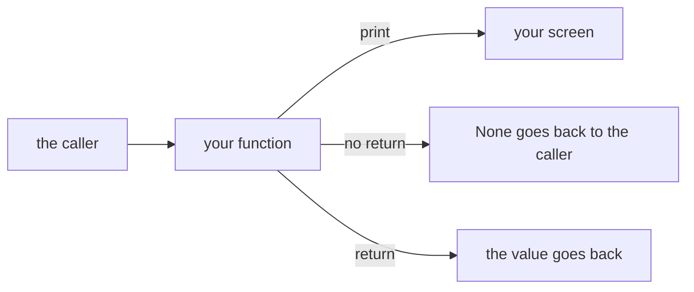
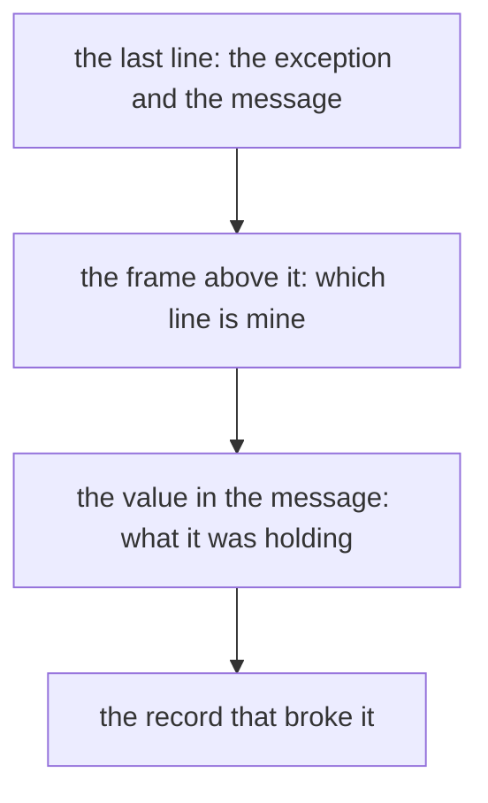
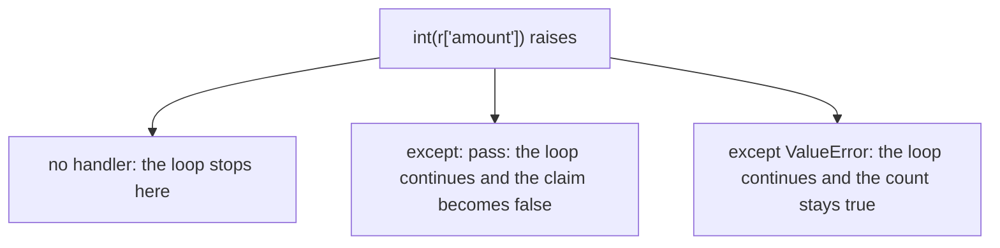
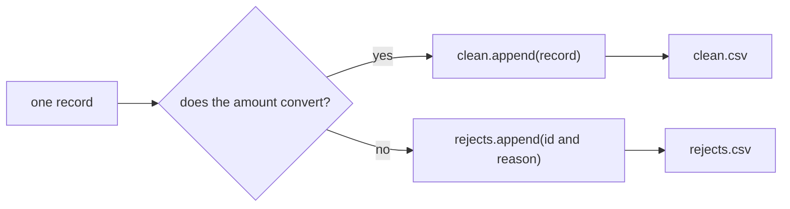
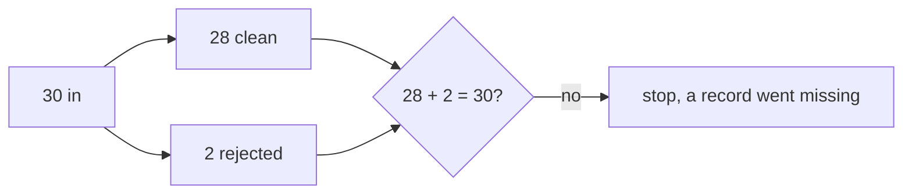
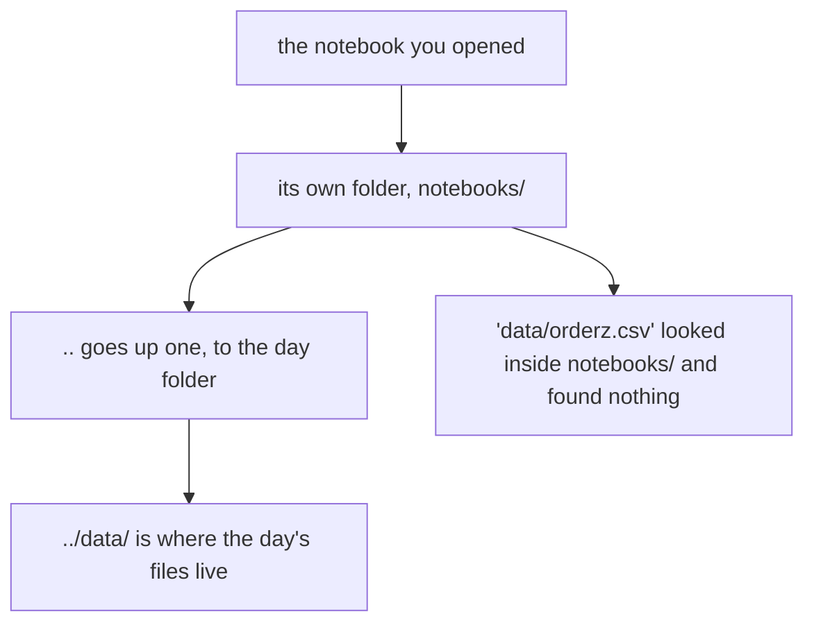
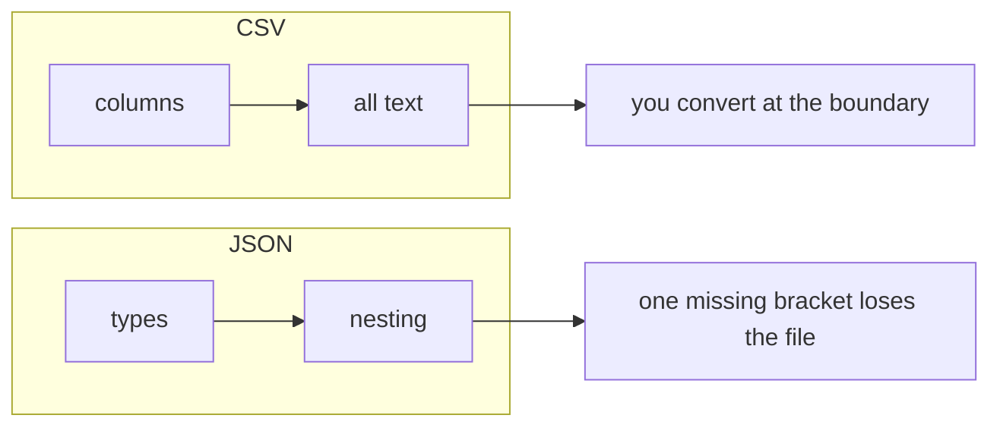
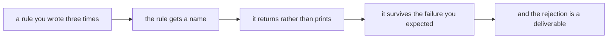

# Board diagrams: Week 1, Day 2

Every diagram the day uses, as a fence a trainer can draw from and a learner can redraw. The same shapes appear on the slides, in the notebooks and on the companion page.

## 1. What a function hands back

## 2. Reading a traceback, bottom up

## 3. The three stances

## 4. Validate early, catch narrowly, log the rejection

## 5. The reconciliation

## 6. Where a relative path is counted from

## 7. Two agreements about structure

## 8. The day, end to end

