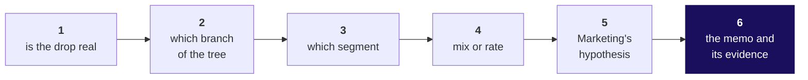
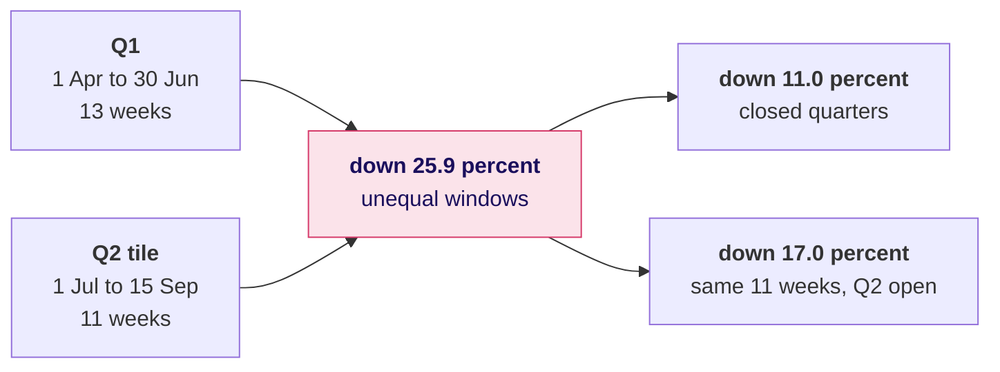
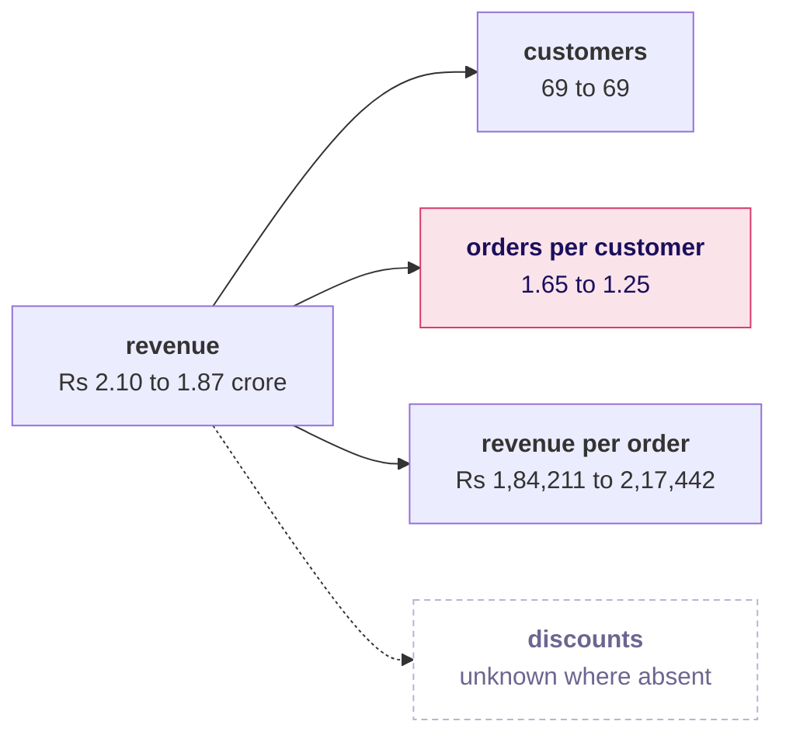
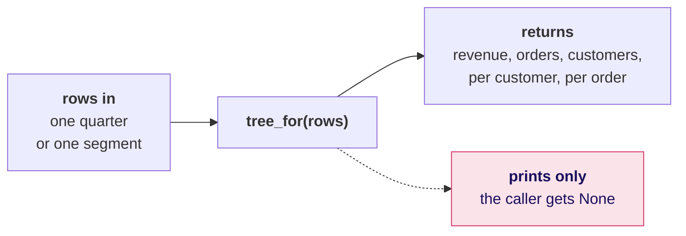
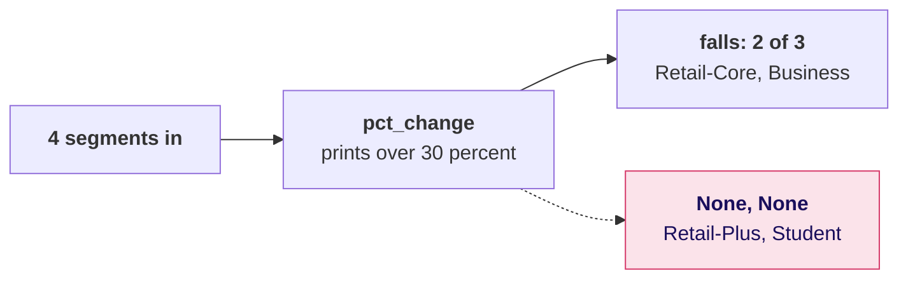
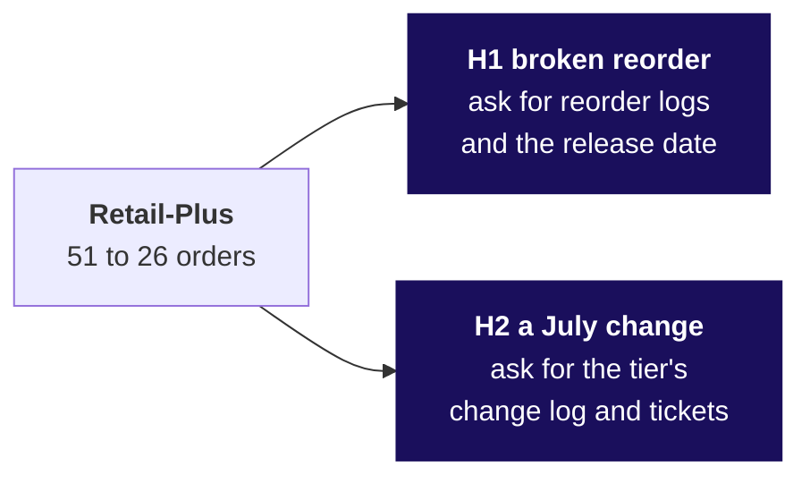

# The investigation ladder, as it goes up on the board

The board work for Week 1, Tuesday, in the order it is drawn. The ladder goes up first and stays up
all day, and every later drawing fills one of its six chapters. Beside each chapter's drawing go
the options it weighed, the one chosen and the second route that proved it. The deck, the notebooks, the companion page
and the cheat sheet carry the same ladder and the same tree.

---

## First drawing: Meera's question, and the ladder

Meera's question goes across the top of the board in her words: **are we losing customers, or are
the ones we have buying less?** Under it go the two answers the tree allows, fewer customers or the
same customers buying less, with Marketing's Rs 12 crore written beside the first.

The ladder goes up on the left, left to right, and stays there until the day ends.

Monday's tree goes up beside it with a Q1 and a Q2 column under every branch, and every box holds a
question mark until a chapter fills it.

---

## Second drawing: two windows, drawn to scale

Chapter 1 draws the two windows as bars of weeks, so the difference in length is visible before any
percentage is said aloud.

The 25.9 is crossed through, and the check goes under it: the first and last order date of each
window, and the weeks each one covers. Beside it: "A closed quarters, chosen; B same weeks if Q2 were
open; D last year for the season", and the second route, by month, minus 11.0 again. Chapter 1
gets its tick.

---

## Third drawing: the tree filled in, and the bridge

Chapter 2 fills the empty boxes. The shaded branch is the one that moved.

Under the tree go the product check, 1.000 times 0.754 times 1.180 is 0.890, and the bridge in
rupees: Rs 2,10,00,000, then Rs 0 for customers, minus Rs 51,57,895 for orders per customer, plus
Rs 28,57,895 for revenue per order, ending at Rs 1,87,00,000.

Beside the discounts box go three invented orders, Rs 100, Rs 0 and one with no field, with the two
shares with a discount they give: 1 of 3, 33 percent, when the absent one is read as zero, and 1 of 2,
50 percent, over the two that recorded it. The bound goes under them: at most Rs 12,900 against a Rs 23,00,000 fall. Beside the bridge: "frequency first, stated; Rs 51.6
to 60.9 lakh by order", and the second route, the symmetric split, frequency minus Rs 55.9 lakh:
the same branch. Chapter 2 gets its
tick.

---

## Fourth drawing: a function, and a roll-up that has to reproduce the total

Chapter 3 weighs three ways to get eight trees, copy, function or one pass by key, and draws the function as a box with rows going in and one dictionary coming out, so that
returning is the arrow out and printing is an arrow to nowhere.

The roll-up goes beside it on invented numbers: 30 customers at 1.1 orders and 2 customers at 3.5.
The plain average is 2.3; 40 orders over 32 customers is 1.25. Under it, the check: the company
figure must come back as 1.65 and 1.25, and the plain average of the segments gives 1.94 and 1.82,
so it fails. The second route, one pass by key, agrees with the function on all eight groups.

The segment is left off the board until the room has found it in its own notebook.

---

## Fifth drawing: the segment split

Once the room has named it at the end of chapter 3, the split goes up under the tree.

| Segment | Orders per customer, Q1 to Q2 | Orders lost or gained |
|---|---|---|
| Retail-Core | 1.12 to 1.06, down 5.3 percent | Two orders were lost. |
| Retail-Plus | 2.32 to 1.18, down 49.0 percent | Twenty-five orders were lost. |
| Business | 1.82 to 1.55, down 15.0 percent | Three orders were lost. |
| Student | 2.50 to 3.50, up 40.0 percent | Two orders were gained. |

Retail-Plus is circled: the same 22 members, 51 orders against 26, and 25 of the 28 orders lost.
Chapter 3 gets its tick.

---

## Sixth drawing: mix against rate, and the table that lost two rows

Chapter 4 adds the mix: revenue per order rose Rs 33,231, and
about 69 percent of the rise is the change of mix, because Retail-Plus fell from 44.7 to 30.2
percent of orders; the envelope, Business's share change times its gap over a consumer order, gives
about Rs 23,000, 69 percent again, and chapter 4 gets its tick. Chapter 5 adds the id
overlap, 69, 0 and 0, and a helper that returned nothing.

The helper is drawn as groups in against the two that came back
as None, with `None in changes.values()` written under it as the one-line check. Beside it goes the
falls table fixed, three rows, against the broken two: the bug cost Retail-Plus, and Student leaves
by the filter because it rose. Under it: Retail-Plus is 93 percent of the consumer fall, and the
second route, each customer's first and last order date, finds none new and none lost again. Chapter
5 gets its tick.

---

## Seventh drawing: two hypotheses, each with its evidence

Chapter 6 puts Retail-Plus orders by month on a line, April to September: 14, 24, 13, then 9,
9, 8. The complaint's six weeks are marked from late August, and the fall is visibly under way in
July, before it.

Beside it go the channel counts, web 24 to 9, store 14 to 9 and app 13 to 8, and the id overlap
and the ceiling: 3.92 orders a week in Q1, 2.29 before the break, 1.51 after, so the button explains
at most about 4 orders; corrected by Retail-Core's own slowing across the same date, about 3.5.
Chapter 6 gets its tick.

---

## What is on the board when the day ends

1. The ladder, all six chapters ticked, each with its chosen option and its second route under it.
2. The tree with Q1 and Q2 in every box, orders per customer shaded, and the bridge in rupees under
   it.
3. The segment split with Retail-Plus circled, and the rupee view beside it: Business is Rs
   22,29,720 of the fall, resting on three orders.
4. The two hypotheses, the button's ceiling, and the data that would settle each.
5. Tomorrow's question, left open in the corner, in Anand Iyer's words: "Your dashboard says Q1 was
   Rs 2.1 crore. Our books say 1.9. Until your numbers match ours, Finance will not act on a drop
   measured from an ERP export. Send me a reconciliation."
