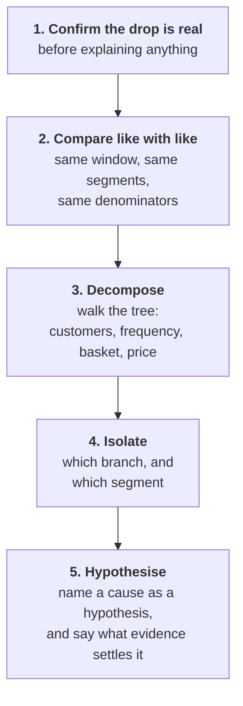
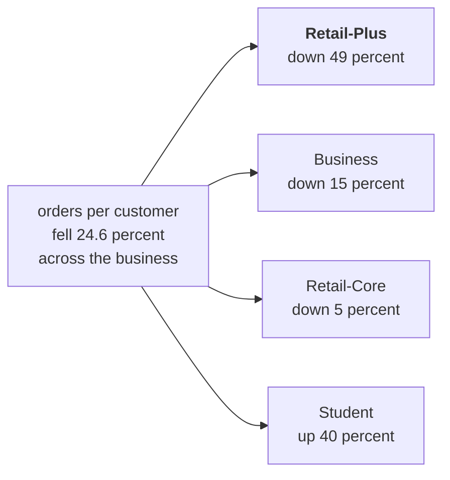

# The sales-drop investigation ladder

The one drawing for Day 2. It is the most-asked analyst case in the Indian market, the order of the
rungs is fixed, and a candidate who climbs them out of order gets the right answer to the wrong
question.

---

## What goes on the board, in the order it goes up

**Step 1. Write the complaint, not the task.**

At the top of the board, in Meera's words:

> "Q2 was Rs 1.9 crore, Q1 was 2.1. Are we losing customers, or are the ones we have buying less?
> Marketing says more customers. Prove it or disprove it."

**Step 2. Before any rung, ask what could make a drop look real when it is not.**

Collect from the room. You want at least four of these before you draw anything:

- The quarters were not the same length.
- One quarter is still open, so its orders have not all arrived.
- A definition changed in a dashboard release.
- A segment was reclassified, so the same customers moved buckets.
- The export was stitched from two systems and something was double counted.

**Step 3. Then the ladder, one rung at a time, bottom to top.**

---

## The ladder



**The rule to say out loud:** you never climb past a rung you have not actually done. Most wrong
answers in this case are somebody starting at rung five because they already have a theory.

---

## What each rung needs from the data

| Rung | The question | What it needs | What goes wrong here |
|---|---|---|---|
| 1. Confirm | Did it actually fall? | Both totals, on the same definition of revenue | Comparing delivered against booked without noticing |
| 2. Like with like | Are these two things comparable? | Equal windows, the same segment definitions, the same denominators | A 13-week quarter against an 11-week one |
| 3. Decompose | Which factor moved? | Customers, orders, revenue, all by quarter | Stopping at the total and calling it a finding |
| 4. Isolate | Where is it concentrated? | The same decomposition per segment | Reporting a blended number that hides the segment |
| 5. Hypothesise | Why? | Something outside the data: a complaint, a release note, a calendar | Stating a cause as a fact |

---

## The second drawing: the decomposition arithmetic

Draw this once the numbers are on the screen. It is the moment the tree becomes an instrument
rather than a picture.

```
REVENUE  =  CUSTOMERS  ×  ORDERS PER CUSTOMER  ×  REVENUE PER ORDER
```

| Factor | Q1 | Q2 | Change |
|---|---|---|---|
| Customers | 69 | 69 | flat |
| Orders per customer | 1.65 | 1.25 | down 24.6 percent |
| Revenue per order | Rs 1,84,211 | Rs 2,17,442 | up 18.0 percent |
| **Revenue** | **Rs 2.10 crore** | **Rs 1.87 crore** | **down 11.0 percent** |

Multiply the three changes: `1.00 × 0.754 × 1.180 = 0.890`. The arithmetic closes, which is how the
room knows the decomposition is complete rather than merely plausible.

**The thing to circle:** revenue per order went **up** while revenue went down. One factor moving
the right way is hiding part of how far the other one fell.

---

## The third drawing: where it is concentrated



One segment carries almost all of it. That is rung four, and it is the rung that turns a finding
into something somebody can act on.

---

## What has to be on the board when the day ends

1. The five rungs, in order, with what each one needs.
2. The three-factor decomposition with the arithmetic closing to the revenue change.
3. The segment split, with Retail-Plus circled.
4. The hypothesis written as a hypothesis, with the evidence that would settle it beside it.

The fourth one is the one rooms skip. Make somebody write the sentence "the reorder feature has
been broken for six weeks" with the word **hypothesis** in front of it, and the test beside it.
