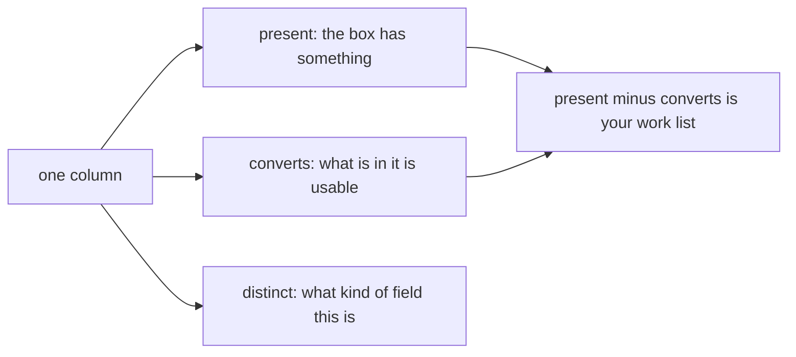

# Cheat sheet, gap variant: profiling and cleaning decisions

Same seven panels with a quarter of the cells blanked. Fill it from memory first, then check.

---

## Panel 1: the three counts



```
______      the box has something in it
______      what is in it is usable
______      how many different values
```

`present` minus `converts` is ____________________.

**Crux:** ________ is the only count that can ________, so it is the only one that can warn you.

---

## Panel 2: reading a profile

| Shape | What it means |
|---|---|
| distinct 3 or 4 on 50 rows | ________________ |
| distinct near the row count | An id or a free value |
| distinct below the row count on an id | ________________________ |
| converts 0 on a text field | ________________ |

**Crux:** you know where the work is before ____________________.

---

## Panel 3: missing is a decision

| Choice | Use when | It costs |
|---|---|---|
| Drop | Required field, value exists nowhere else | ______________ |
| ______________ | Absence means something you can name | Telling absent from equal-to-the-default |
| Keep and flag | ______________________________ | Every downstream reader handles the flag |

**Crux:** a default you did not state is ______________.

---

## Panel 4: the coercion trap

```
              RAW              COERCED
present       48/50            50/50     ______
converts      44/50            50/50     ______
distinct      46               42        ______
```

**Crux:** every count ________ and the dataset ________.

---

## Panel 5: duplicates

```
whole-record comparison   finds only ______________
______________________    finds the rest
```

**Crux:** an identity rule is ____________________, and ______________ decides it.

---

## Panel 6: outliers

```
sorted(amounts)[____]     read the tail
```

**Crux:** an outlier is ____________________ before it is ____________________.

---

## Panel 7: what ships

```
______________     the rows you would compute on
______________     what you set aside, with reasons
______________     field, finding, choice, reason
```

```
input = ____________________
```

**Crux:** the profiled dataset without its ______________ is an opinion.
