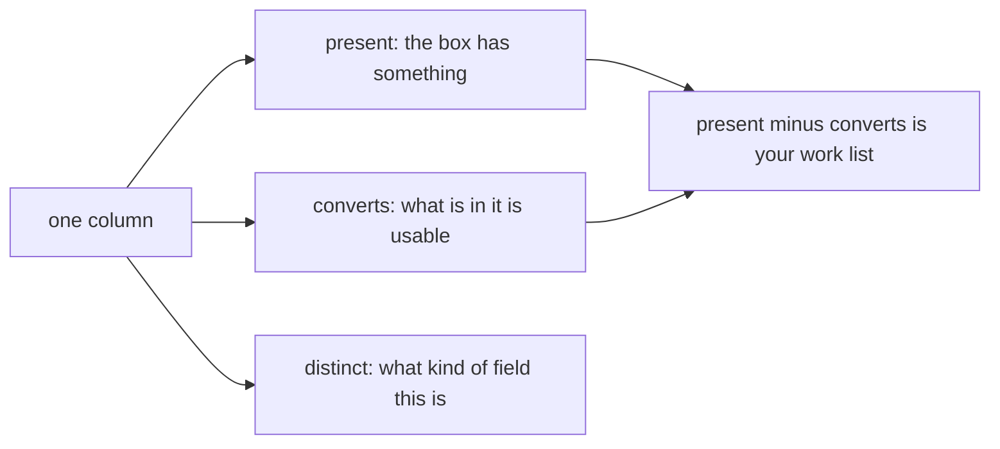
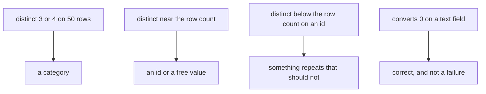
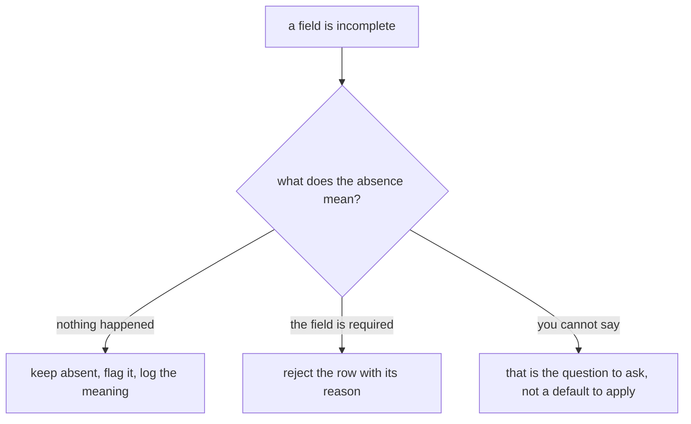
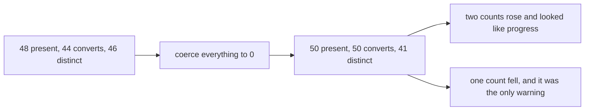
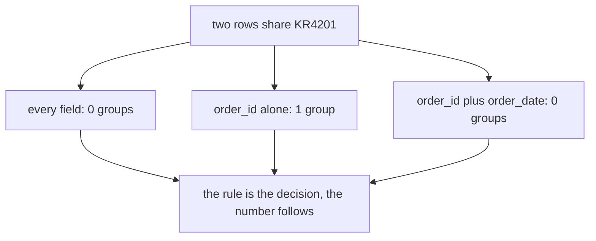
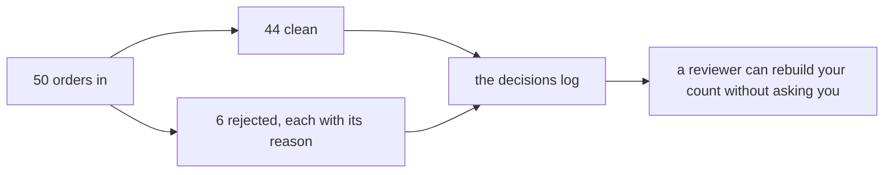

# Visual sheet: profile, decide, record

Week 1, Day 3. Print landscape. Six panels, pictures only. The text sheet beside this one carries the words.

---

## Panel 1: three counts per field

**Crux:** distinct is the only count that can fall, so it is the only count that can warn you.

---

## Panel 2: reading a profile as a shape

**Crux:** you know where the work is before you have touched anything.

---

## Panel 3: missing is a three-way decision

**Crux:** a default you did not state is data you invented.

---

## Panel 4: the coercion trap

**Crux:** a pass that never fails is a pass that destroyed the evidence.

---

## Panel 5: an identity rule is something you state

**Crux:** the data cannot tell you what the same record means, so somebody has to.

---

## Panel 6: what ships

**Crux:** what ships is the data plus every decision taken on it.

---

The landscape PDF of this sheet is deferred. The rendering toolchain the `fde-cheat-sheets` method uses was not installed in the session that built this file, and the markdown with its six panels is the shipped artifact until it is.
