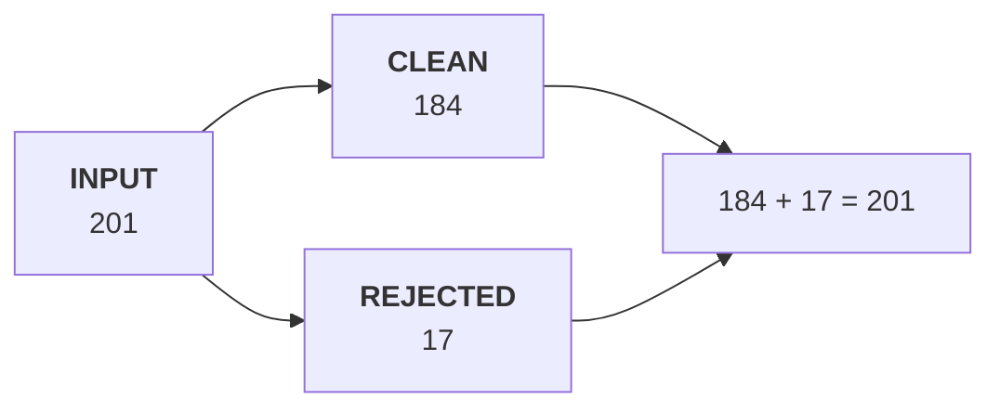

# Profile, decide, reconcile

Week 1 Day 3, Kalpa Retail. Two figures for one quarter, both computable, only one right. This page
is what turns "I cleaned the data" into something an auditor can follow.

## Panel 1: The only equation of the day

**Crux:** A cleaning pass that cannot produce input equals clean plus rejected is a pass nobody can check, and the rejected rows are a deliverable rather than a by-product.

## Panel 2: Profile before you decide

| Count | The question it answers |
|---|---|
| Present | How many records carry the field at all |
| Convertible | How many of those become the type you need |
| Distinct | How many different values there are |

Distinct is the one that catches a migration. 201 rows carrying 186 order ids is a finding before anything is removed.

## Panel 3: Three answers, always

| Choice | What it costs |
|---|---|
| Drop the row | The count changes and revenue falls |
| Default it | The count holds and the value is a guess |
| Keep and flag | Nothing is lost and somebody must look |

**Crux:** There is no free option, so the decision, the reason and the row count go in the log as you make them, because writing the log afterwards means writing it from memory.

## Panel 4: The identity rule

| Same | Different | Verdict |
|---|---|---|
| Every field | Nothing | A duplicate, remove one |
| The order id | The date | One order, twice. Pick, and record which. |
| All but the id | The id | Two real orders. Keep both. |

A duplicate is a row that **is the same order**, not one that looks the same.

## Panel 5: The errors of the day

| Message | What it means |
|---|---|
| `FileNotFoundError` | The path, not the file, is usually wrong |
| `ValueError: invalid literal for int()` | A word where a number belongs |
| `JSONDecodeError: Unterminated string` | The transfer was cut, so ask for the file again |

A truncated file is a complete file that stops early. Patching it invents data.

## Panel 6: The bridge

Rs 2.10 crore as exported, less 15 duplicate ids, less one row with no status, less one amount that will not convert, gives Rs 1.90 crore.

**Crux:** A bridge that does not land on the other system's figure has a step missing, and the missing step is the finding rather than a rounding difference.

## Panel 7: What must not be cleaned

The Rs 4,80,000 corporate order is an outlier and it is real. It survives, and the log records that it was looked at and kept.

Remove every uncomfortable row and you have a dataset that agrees with you. Report it and describe the file with a median.
