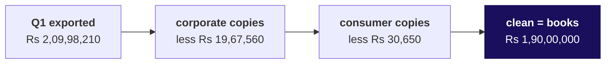

# The reconciliation

Kalpa Retail, Week 1 Wednesday. Two honest totals disagree until a bridge walks one to the other,
one move per cause, each move backed by rows. Every cleaning act on the way is a decision with a
written reason.

## Panel 1: The bridge, and the one rule


```mermaid
flowchart LR
    E["<b>Q1 exported</b><br/>Rs 2,09,98,210"] --> A["<b>corporate copies</b><br/>less Rs 19,67,560"]
    A --> B["<b>consumer copies</b><br/>less Rs 30,650"]
    B --> C["<b>clean = books</b><br/>Rs 1,90,00,000"]
    classDef bet fill:#1A0F5C,stroke:#1A0F5C,color:#FFFFFF
    class C bet
```

Rows: 201 in equals 186 kept plus 15 set aside. Rupees: Q1 as exported less the rupees set aside
equals the books to the rupee.

**Crux:** Reconcile twice, in rows and in rupees, to the books.

## Panel 2: The pass, in order

| Step | What it does | The failure it prevents |
|---|---|---|
| Profile | Present, convertible, distinct per field | A total from an unread file |
| Convert | Value or reason, failures logged | An order worth Rs 0 |
| Identity rule | One row per order_id, the copy that validates | Copies in revenue |
| Keep, drop or flag | One decision per defect, with a reason | A guess that becomes a fact |
| Reconcile | Rows and rupees, to the books | A pass that rounds to right |
| Recompute | Every number already reported | A finding nobody rechecked |

**Crux:** Profile before you total: present, convertible, distinct, for every field.

## Panel 3: Convert on purpose

```python
def convert(value):
    try:
        return int(value), ""
    except (TypeError, ValueError):
        return None, "amount does not convert"
```

Everything read from a CSV is text: `"900" < "1200"` is False. A missing value is `""` in a CSV and
an absent key in JSON.

**Crux:** A failure is logged, never turned into a number; large is not wrong.

## Panel 4: Which copy stays

| The pair | Keep | Log |
|---|---|---|
| Identical | The first | Second copy of the order |
| One amount unreadable | The copy that validates | Its twin carries the value |
| Valid, a field disagrees | The first extract | The field, and a question for the source |

Choose the key before counting: whole record 0, record less line 13, order_id 15, a fuzzy match on customer and
amount within 60 days, 15, with one real Rs 17,71,000 order among them.

**Crux:** Say what makes two rows one order before you count duplicates.

## Panel 5: Keep, drop or flag

| Decision | Revenue | A status count | Use it when |
|---|---|---|---|
| Drop | Moves | Changes its denominator | The record is not an order |
| Default | Unchanged | Invents a value | A stated rule covers it |
| Keep and flag | Unchanged | Leaves it out | The value is unknown |

A large order is a question about its record: a real Business order at Rs 29,45,460 stays, flagged,
and Q2 is shown both ways. Repair a value only from a copy that could not share the error.

**Crux:** Keep the copy that validates, and log every row you set aside.

## Panel 6: The six wrong numbers of the day

| The number | The step | The check |
|---|---|---|
| Largest Q2 order Rs 970 | Sorting amounts as text | Below every Business order |
| 0 duplicates | The file line in the key | 201 rows, 186 order ids |
| 188 orders, Q2 Rs 1,87,03,710 | Record less line; Q1 tied, so stop | Rows against ids |
| 201 of 201 convert, an order at Rs 0 | Failures coerced to 0 | The smallest real order is Rs 680 |
| Q2 Rs 1,57,54,540, a 17.1% fall | The real bulk order fenced out | A known account, valid fields |
| 201 = 185 + 16, Rs 20,00,000 set aside | Keep the first copy, then convert | Rs 1,790 short of the books |

## Panel 7: What changed downstream

| Number | As Tuesday reported | On clean data |
|---|---|---|
| Revenue, Q1 to Q2 | -11.0% | -1.6% |
| Orders per customer, tree branch | x0.754 | x0.860 |
| Retail-Plus orders per customer | -49.0% | -35.0%, 1.82 to 1.18 |

Customers stay at 69, so the fall is in frequency, and smaller.

**Crux:** Recompute what you reported, and say what changed, the smaller number first.
