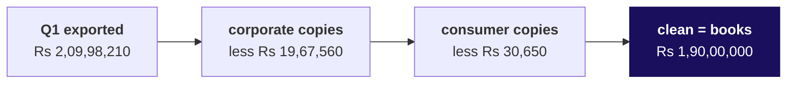

# Week 1 Wednesday: Which Q1 figure is right, and how do we know?

Kalpa Retail's dashboard reads Q1 at Rs 2.1 crore from an orders CSV out of the ERP, the enterprise
resource planning system Finance books orders in, stitched from two extracts, two pulls of rows. The
books, Finance's own record of Q1, say Rs 1.9 crore. Two honest totals disagree until a bridge walks
one to the other, one move per cause, and every cleaning act on the way is a decision with a reason.

## Panel 1: Does the bridge from Rs 2.1 crore close to the books?


```mermaid
flowchart LR
    E["<b>Q1 exported</b><br/>Rs 2,09,98,210"] --> A["<b>corporate copies</b><br/>less Rs 19,67,560"]
    A --> B["<b>consumer copies</b><br/>less Rs 30,650"]
    B --> C["<b>clean = books</b><br/>Rs 1,90,00,000"]
    classDef bet fill:#1A0F5C,stroke:#1A0F5C,color:#FFFFFF
    class C bet
```

Yes, in rows and in rupees. In rows, 201 in equals 186 kept plus 15 set aside, each removed with a
logged reason. In rupees, Q1 as exported less the rupees set aside equals the books to the rupee.

**Crux:** Reconcile twice, in rows and in rupees, to the books.

## Panel 2: In what order does the cleaning pass run?

| Step | What it does | The failure it prevents |
|---|---|---|
| Profile | Present, convertible, distinct per field | A total from an unread file |
| Identity rule | One row per order_id, keeping the copy whose amount converts | Copies in revenue |
| Convert | Value or reason, each failure logged | An order worth Rs 0 |
| Keep, drop or flag | One decision per defect, with a reason | A guess that becomes a fact |
| Reconcile | Rows and rupees, to the books | A pass that rounds to the books |
| Recompute | Every number already reported | A finding nobody rechecked |

**Crux:** Profile before you total: present, convertible, distinct, for every field.

## Panel 3: How do you convert text without inventing a number?

```python
def convert(value):
    try:
        return int(value), ""
    except (TypeError, ValueError):
        return None, "amount does not convert"
```

Everything read from a CSV is text, so `"900" < "1200"` is False. A missing value is `""` in a CSV
and an absent key in JSON.

**Crux:** A failure is logged, never turned into a number; large is not wrong.

## Panel 4: When is a row a repeat, and which copy stays?

| The pair | Keep | Log |
|---|---|---|
| Identical | The first | Second copy of the order |
| One amount unreadable | The copy that validates | Its twin carries the value |
| Valid, a field disagrees | The first extract | The field, and a question for the source |

Choose the key before counting: the whole record flags 0 rows, the record less its file line 13,
order_id 15, and a fuzzy match on customer and amount within 60 days 15, with one real Rs 17,71,000
order among them.

**Crux:** Say what makes two rows one order before you count duplicates.

## Panel 5: What happens to a missing value or a huge order?

| Decision | Revenue | A status count | Use it when |
|---|---|---|---|
| Drop | Moves | Changes its denominator | The record is not an order |
| Default | Unchanged | Invents a value | A stated rule covers it |
| Keep and flag | Unchanged | Leaves it out | The value is unknown |

A large order is a question about its record: a real order at Rs 29,45,460 in the Business segment,
Kalpa's sales to companies, stays, flagged, and Q2 is shown both ways. Repair a value only from a
copy that could not share the error.

**Crux:** Keep the copy that validates, and log every row you set aside.

## Panel 6: What catches each of the day's six wrong numbers?

| The number | The step | The check |
|---|---|---|
| Largest Q2 order Rs 970 | Sorting amounts as text | Below every Business order |
| 0 duplicates | The file line in the key | 201 rows, 186 order ids |
| 188 orders, Q2 Rs 1,87,03,710 | Record less line; Q1 tied, so stop | Rows against ids |
| 201 of 201 convert, an order at Rs 0 | Failures turned into 0 | The smallest real order is Rs 680 |
| Q2 Rs 1,57,54,540, a 17.1% fall | The largest Q2 order removed as an outlier | A known account, valid fields |
| 201 = 185 + 16, Rs 20,00,000 set aside | Keep the first copy, then convert | Rs 1,790 short of the books |

## Panel 7: What did cleaning change in Tuesday's finding?

| Number | As Tuesday reported | On clean data |
|---|---|---|
| Revenue, Q1 to Q2 | -11.0% | -1.6% |
| Orders per customer | x0.754 | x0.860 |
| Orders per customer in Retail-Plus, Kalpa's paid membership tier | -49.0% | -35.0%, 1.82 to 1.18 |

Monday's revenue tree multiplies customers, orders per customer and revenue per order. Customers
stay at 69, so the fall sits in orders per customer, and it is smaller.

**Crux:** Recompute what you reported, and say what changed, the smaller number first.
