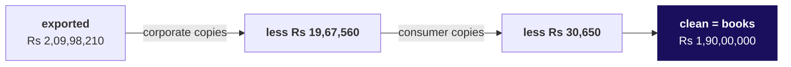

# The reconciliation

Kalpa Retail, Week 1 Wednesday. Two honest totals disagree until a bridge walks one to the other,
one move per cause, each move backed by rows. Every cleaning act on the way is a decision with a
written reason.

## Panel 1: The bridge, and the one rule


```mermaid
flowchart LR
    E["<b>exported</b><br/>Rs 2,09,98,210"] -->|"corporate copies"| A["<b>less Rs 19,67,560</b>"]
    A -->|"consumer copies"| B["<b>less Rs 30,650</b>"]
    B --> C["<b>clean = books</b><br/>Rs 1,90,00,000"]
    classDef bet fill:#1A0F5C,stroke:#1A0F5C,color:#FFFFFF
    class C bet
```

Rows: 201 in equals 186 kept plus 15 set aside. Rupees: Q1 as exported less the rupees set aside
equals the books to the rupee.

**Crux:** Reconcile twice, in rows and in rupees, to the books.

## Panel 2: The pass, in order

| Step | What it does | The failure it prevents |
|---|---|---|
| Profile | Present, convertible, distinct per field | A total from an unread file |
| Convert | Value or reason, failures logged | An order worth Rs 0 |
| Identity rule | One row per order_id, the copy that validates | Copies in revenue |
| Keep, drop or flag | One decision per defect, with a reason | A guess that becomes a fact |
| Reconcile | Rows and rupees, to the books | A pass that rounds to right |
| Recompute | Every number already reported | A finding nobody rechecked |

**Crux:** Profile before you total: present, convertible, distinct, for every field.

## Panel 3: Convert on purpose

```python
def convert(value):
    try:
        return int(value), ""
    except (TypeError, ValueError):
        return None, "amount does not convert"
```

Everything read from a CSV is text: `"900" < "1200"` is False. A missing value is `""` in a CSV and
an absent key in JSON.

**Crux:** A failure is counted and logged, never turned into a number.

## Panel 4: Which copy stays

| The pair | Keep | Log |
|---|---|---|
| Identical | The first | Second copy of the order |
| One amount unreadable | The copy that validates | Its twin carries the value |
| Valid, a field disagrees | The first extract | The field, and a question for the source |

**Crux:** Say what makes two rows one order before you count duplicates.

## Panel 5: Keep, drop or flag

| Decision | Revenue | A status count | Use it when |
|---|---|---|---|
| Drop | Moves | Unchanged | The record is not an order |
| Default | Unchanged | Invents a value | A stated rule covers it |
| Keep and flag | Unchanged | Leaves it out | The value is unknown |

**Crux:** Large is not wrong: check the record, keep it, and show it both ways.

## Panel 6: The four wrong numbers of the day

| The number | The step | The check |
|---|---|---|
| 201 of 201 convert, Q1 Rs 2,09,98,210 | Failures coerced to 0 | An order worth Rs 0 |
| 0 duplicates | The file line in the key | 201 rows, 186 order ids |
| Q2 Rs 1,57,54,540, a 17.1% fall | The real bulk order fenced out | A known account, valid fields |
| Q1 Rs 1,89,98,210, "reconciled" | Keep the first copy, then convert | Rs 1,790 short of the books |

## Panel 7: What changed downstream

Revenue Q1 to Q2: -1.6% on clean data, not -11.0%. Retail-Plus orders per customer: 1.82 to 1.18,
-35.0%, not -49.0%. The finding stands, smaller.

**Crux:** Recompute what you reported, and say what changed, the smaller number first.
