# Profile before you touch: load, clean and defend a real dataset

Week 1, Day 3. Slide source. One idea per slide.

Slides numbered S are the spine and are delivered in order. Slides numbered D go deeper and carry a DEPTH mark. A trainer skips them live when time is short, and you read them afterwards.

The day is one arc applied twice, first to the columns and then to the rows. It does not split into halves, and the crossing point is marked where the columns finish.

Position bar, repeated at every section boundary:
`[profile the columns] > [decide per field] > [find the hidden rows] > [investigate the extremes] > [ship with the log]`

---

## S1. Profile before you touch
Yesterday somebody told you which orders were dirty.

Today nobody tells you.

---

---

## S2. Two profiles, one question
Two printouts of the same Kalpa Retail order book. Which of these would you trust?

```
                 A                              B
amount    present 48/50  converts 44/50   present 50/50  converts 50/50
          distinct 46                     distinct 42
discount  present 11/50                   present 50/50
```

Take thirty seconds. Then say which, and why.

---

---

## S3. The answer
A.

B is A after somebody replaced every failure with a stated default of zero.

---

---

## S4. What B cost
Every count in B moved the way you want counts to move, and the dataset got worse.

Thirty nine orders in B carry a discount that nobody ever recorded.

Six amounts that could not be read are now the number zero, and nothing on the page says which six.

---

---

## S5. The number that tells you
`distinct` is the only count that fell, from 46 to 42.

Five different broken values collapsed into one. Counts that only ever rise are counts that cannot warn you.

---

---

## D1. Why distinct is the count that catches a silent fix
Every other count moves the wrong way when somebody quietly fills a gap.

| Count | After a silent fill | What that looks like to a reader |
|---|---|---|
| present | Rises to 50 of 50 | The field looks complete |
| converts | Rises to 50 of 50 | The field looks clean |
| distinct | Falls, because many different broken values became one value | The only signal in the room, and it is easy to miss |

The direction is the whole point. A metric that only improves when somebody damages the data is a metric that cannot protect you, so the one that falls is the one to read first.

---

---

## S6. Where we are
`**[profile the columns]** > [decide per field] > [find the hidden rows] > [investigate the extremes] > [ship with the log]`

Profiling is what you do before you have permission to change anything.

---

---

## S7. The whole day in one picture
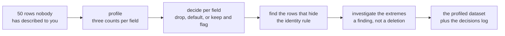

Half one is the first two stops. Half two is the rest.

---

---

## SECTION 1: THE PROFILER
`**[profile the columns]** > [decide per field] > [find the hidden rows] > [investigate the extremes] > [ship with the log]`

---

---

## S8. Monday's counter, grown up
Monday you counted how many orders had a value. That counter is today's profiler with two more questions attached.

---

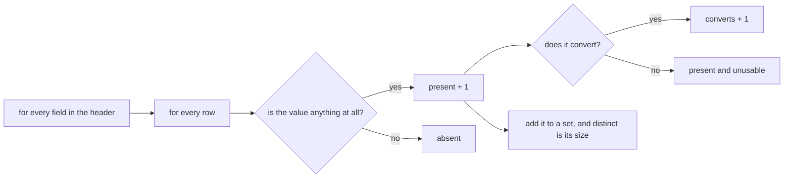

---

## S9. Three counts, per field
```
present     how many have anything at all
converts    how many become the type you need
distinct    how many different values there are
```

Three numbers per column. That is the whole tool.

---

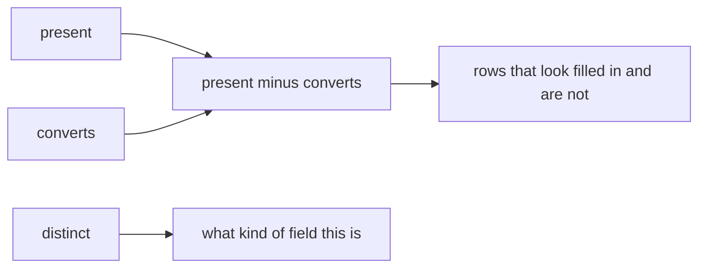

---

## S10. What the profiler is actually doing
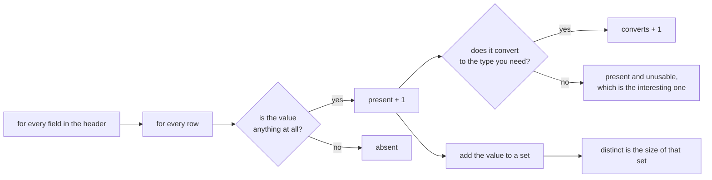

Two nested loops and a set. You wrote the outer one on Monday.

---

---

## S11. What each one catches
| Count | The question it answers |
|---|---|
| present | Is this field being filled in? |
| converts | Is what is filled in usable? |
| distinct | Is this a category, a free text box, or an id? |

`present` minus `converts` is the number of values that look fine and are not.

---

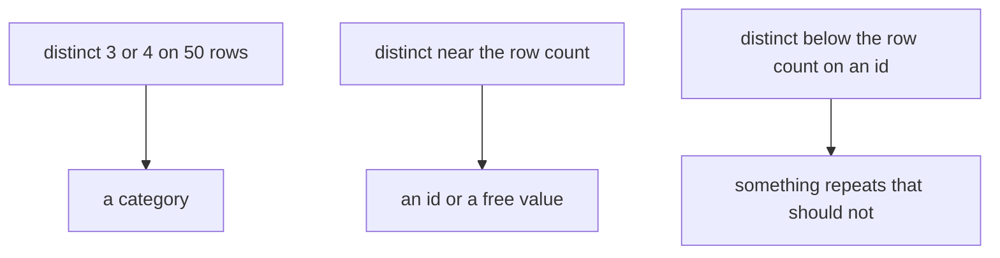

---

## D2. The three counts as rates, so columns can be compared
Counts tell you about one column. Rates let you rank every column in the file by where the work is.

$$\text{presence rate} = \frac{\text{present}}{n} \qquad \text{convertibility rate} = \frac{\text{converts}}{n}$$

$$\text{the trap rate} = \frac{\text{present} - \text{converts}}{n}$$

For `amount` in today's file, with $n = 50$:

$$\frac{48}{50} = 96\% \text{ present} \qquad \frac{44}{50} = 88\% \text{ converts} \qquad \frac{48 - 44}{50} = 8\% \text{ present and unusable}$$

That last 8 percent is the dangerous group. Those rows are not empty, so a presence check passes them, and they are not numbers, so anything downstream that adds them up fails or lies.

---

---

## D3. The whole file, profiled
This is the printout the profiler gives you on today's fifty orders.

| Field | present | converts to int | distinct | What it tells you |
|---|---|---|---|---|
| order_id | 50 of 50 | 0 | 49 | An identifier, and 49 distinct across 50 rows is a problem you meet in half two. |
| customer_id | 50 of 50 | 0 | 47 | An identifier. Some customers ordered more than once, which is expected. |
| segment | 50 of 50 | 0 | 4 | A category with four values, so it can be grouped and counted safely. |
| amount | 48 of 50 | 44 | 46 | A measure. Two absent and four present but unusable. |
| status | 50 of 50 | 0 | 3 | A category with three values. |
| order_date | 50 of 50 | 0 | 20 | Twenty different dates across fifty orders. |
| discount | 11 of 50 | 11 | 9 | Optional. Everything present converts, so the gap here is absence rather than mess. |

The two fields that need a decision are `amount` and `discount`, and the profile named them before you touched anything.

---

---

## S12. Read a real column
```
amount    present 48/50   converts 44/50   distinct 46
```

Two orders have no amount. Four more have something that will not become a number. Forty six different values, so this is not a category.

You have not touched the data and you already know where the work is.

---

---

## D4. The six failures, named, and who fixes each
A count tells you how many. A list tells you what to do about them.

| Order | The value that arrived | What it actually is | Who fixes it |
|---|---|---|---|
| KR4210 | `twelve` | A word where a number belongs, probably typed by a person | Whoever owns data entry upstream |
| KR4214 | empty | The value is absent in the CSV, and the JSON still carries 2840 one level down | Recoverable by you, from the other file |
| KR4237 | empty | Absent in both files, so genuinely lost | Nobody. It is rejected and reported. |
| KR4231 | `12,400` | A number with a thousands separator, so a formatting convention leaked into the data | A parsing rule you can write |
| KR4235 | `24 500` | A number with a space inside it, from a locale that groups that way | The same parsing rule |
| KR4240 | `Rs 8000` | A number with its unit attached | The same parsing rule |

Three different problems hide inside one count of six. Three go to a person, one is recoverable, and three are a parsing decision you own. That distinction never appears in the number 6.

---

---

## D5. What distinct tells you about a field's job
The count of distinct values against the row count tells you what kind of field you are holding, before anybody explains the schema.

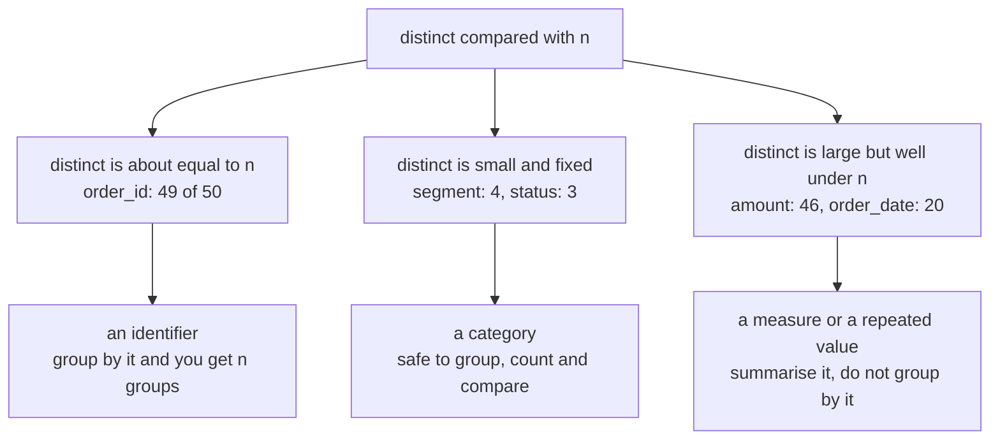

A field with four distinct values across fifty rows is something you can put on an axis. A field with forty six is not.

---

---

## S13. Step card, section 1
1. Profile every field before changing any of them.
2. Three counts: present, converts, distinct.
3. The gap between present and converts is your work list.
4. A count that only rises cannot warn you.

---

---

## SECTION 2: DECIDING PER FIELD
`[profile the columns] > **[decide per field]** > [find the hidden rows] > [investigate the extremes] > [ship with the log]`

---

---

## S14. A missing value is a decision
Not a defect to be removed. A decision, with three defensible answers and one written reason.

---

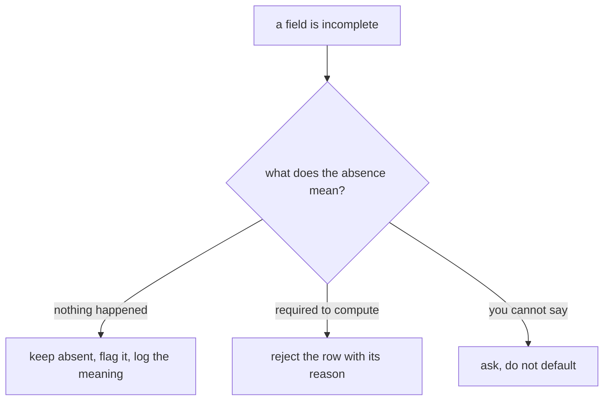

---

## S15. The decision, drawn
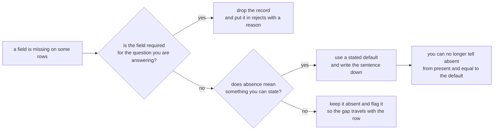

Three branches, and the box at the bottom is the price of the middle one. It is a price worth paying sometimes, and never worth paying by accident.

---

---

## S16. The three
| Choice | Use it when | It costs you |
|---|---|---|
| Drop the record | The field is required and the record is unusable without it | Every other field on that record |
| Use a stated default | Absence genuinely means something, and you can say what | The ability to tell absent from present-and-equal-to-the-default |
| Keep and flag | You need the record and the gap must travel with it | Every downstream reader has to handle the flag |

---

---

## S17. Applied to two real columns
`amount` is required. Two orders have none, so they are set aside with a reason.

`discount` is optional and absent on 39 of 50. Absence there means no discount was applied, which is a fact rather than a gap.

Same dataset, same day, opposite decisions, and both are written down.

---

---

## D6. The same two columns, and what each choice costs
Suppose you took the easy option on both and filled every gap with zero.

| Column | Rows affected | What the number becomes | What you can no longer answer |
|---|---|---|---|
| amount | 6 of 50 | Six orders worth Rs 0, so the order count rises to 50 and the total does not move | How many orders you actually have a value for, which is the denominator of every average you will compute tomorrow |
| discount | 39 of 50 | Thirty nine orders carrying a discount that was never recorded | Whether a discount of zero was a decision or an absence, which is the question a pricing analyst will ask first |

Neither fill corrupts a single existing value. Both destroy a question you will be asked.

---

---

## S18. The one that looks harmless
Filling `discount` with zero is defensible.

It also means you can never again tell an order that had no discount from an order whose discount was zero. That is a decision you are allowed to make once you have said it out loud.

---

---

## S19. Coercion at dataset scale
Yesterday's `clean_record` already handles one bad value correctly. Point it at fifty and it keeps working, because you wrote it to reject rather than to guess.

Nothing in it changes today. That was the promise.

---

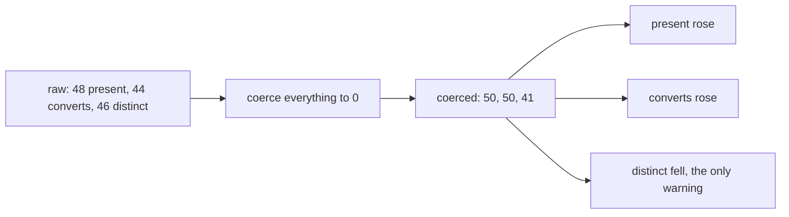

---

## D7. The coerce-everything pass, and what it hides
A single line turns every failure into a number and nothing on screen changes colour.

```
amounts = []
for r in rows:
    try:
        amounts.append(int(r["amount"]))
    except ValueError:
        amounts.append(0)

print(len(amounts), sum(amounts))
```

```
50 561145
```

Fifty amounts, and the total is exactly the same as the honest one, because the six failures each became zero. The count is now a lie and the total is now unauditable, since nothing records which six moved.

The honest version differs by one list:

```
50 rows, 44 usable, 6 rejected, total 561145
```

Same total. One of them can be checked and the other cannot.

---

---

## S20. From the field
HGNC, 2020. About 27 human genes were formally renamed because spreadsheets silently coerced names like SEPT1 into dates.

A 2016 audit had found gene-name errors in roughly a fifth of genetics papers with spreadsheet supplements.

Nobody chose to corrupt anything. A default was applied quietly, at scale, for years.

---

---

## D8. The gene name case, the mechanism
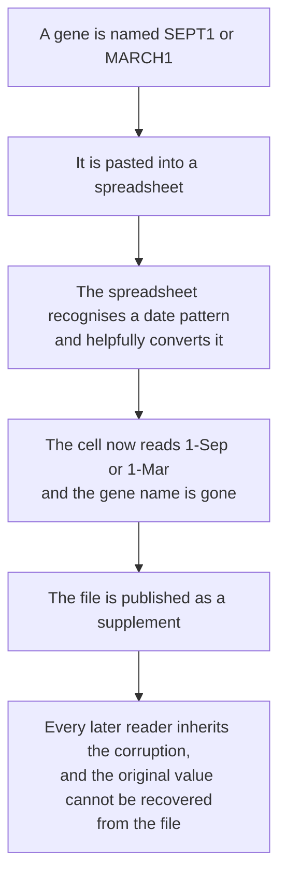

Not one person made a decision here. A default did, silently, at the moment of paste.

---

---

## D9. The gene name case, what it cost and how it was fixed
| Fact | Figure |
|---|---|
| Genes formally renamed | About 27 |
| Examples | SEPT1 became SEPTIN1, and MARCH1 became MARCHF1 |
| The 2016 audit | Roughly a fifth of papers with spreadsheet gene lists carried the corruption |
| The follow-up, 2021 | The rate had not improved |
| Who moved in the end | The naming committee changed the names of the genes, because the spreadsheet would not change its behaviour |

Sources, verified 09 September 2026: the naming guidelines in Nature Genetics volume 52, pages 754 to 758, published 03 August 2020, https://www.nature.com/articles/s41588-020-0669-3 and the 2021 follow-up in PLOS Computational Biology, https://journals.plos.org/ploscompbiol/article?id=10.1371/journal.pcbi.1008984

---

---

## D10. Why that case belongs in a Python session
The lesson is not about spreadsheets. It is about defaults applied by software at the moment data crosses a boundary, with no record that anything happened.

Your `except ValueError: amounts.append(0)` is the same event. It is quiet, it is well meant, it is applied uniformly, and afterwards nothing in the file says which values it touched.

The committee's response is the one worth copying. When the silent conversion could not be stopped, they changed the data so the conversion had nothing to catch. Your version of that is to reject rather than to coerce, and to carry the rejects file alongside the clean one.

---

---

## S21. Step card, section 2
1. Missing is a decision, never a reflex.
2. Drop, default, or keep and flag, each with a written reason.
3. A default you did not state is data you invented.
4. Yesterday's function is today's tool, unchanged.

---

---

## SECTION 3: THE ROWS THAT HIDE
`[profile the columns] > [decide per field] > **[find the hidden rows]** > [investigate the extremes] > [ship with the log]`

---

---

## S22. The check that finds nothing
```
duplicate rows by whole-record comparison: 0
```

Clean dataset. Move on.

---

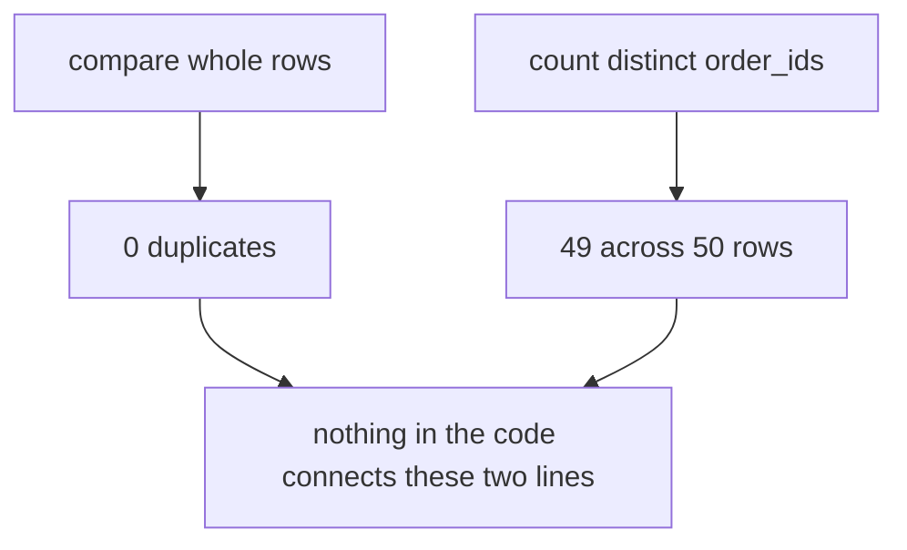

---

## S23. Except
```
distinct order_ids: 49 across 50 rows
```

Nothing raised. Nothing was highlighted. Two numbers on two different lines disagree, and only you can notice.

---

---

## S24. Why the first check missed it
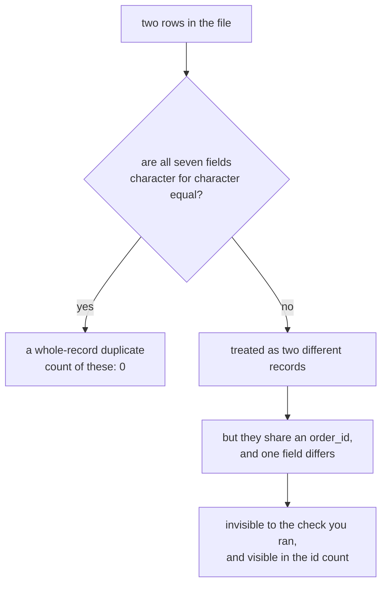

A whole-record check answers "are these the same bytes". The question you actually had was "are these the same order", and nothing in the file knows which fields decide that.

---

---

## S25. The pair
```
KR4201  C1022  Retail-Core  1865  returned  2026-08-03
KR4201  C1022  Retail-Core  1865  returned  2026-09-14
```

Same order id. Same customer. Same amount. Same status. Six weeks apart.

---

---

## S26. So what is it
The same order, exported twice, with the second export stamping the wrong date?

Or a real repeat order that reused an id it should not have?

The data cannot tell you. It never could.

---

---

## D11. The two readings, and what each costs
| If you decide | And you are right | And you are wrong |
|---|---|---|
| They are one order, so drop one | Your count of 50 becomes 49 and the total loses Rs 1,865, both correctly | You have deleted a real order and no downstream reader will ever know a row is missing |
| They are two orders, so keep both | Your figures include a genuine repeat purchase | You are double counting one order, and every total, average and customer-level figure carries it |

Neither error announces itself. That asymmetry is the reason this decision leaves your desk and goes to whoever owns the order book.

---

---

## S27. An identity rule is something you state
"Two rows are the same order when they share an order_id and an order_date."

That is a rule. It can be applied by someone else, argued with, and written into a decisions log.

"They look like duplicates" is not a rule.

---

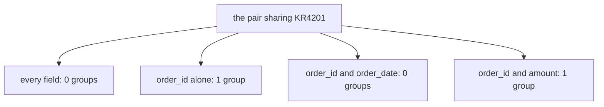

---

## S28. The duplicate ladder, from cheapest to most useful
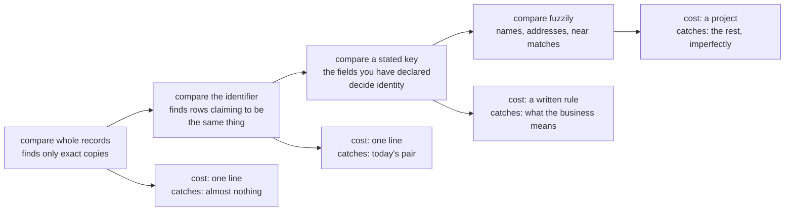

Today you climb to the third rung and stop. The fourth is a whole discipline and it is not Week 1.

---

---

## D12. Writing the two checks so they disagree in public
```
whole = len(rows) - len({tuple(sorted(r.items())) for r in rows})
by_id = len(rows) - len({r["order_id"] for r in rows})
print("whole-record duplicates:", whole)
print("rows sharing an order_id:", by_id)
```

```
whole-record duplicates: 0
rows sharing an order_id: 1
```

Two lines, printed together, on purpose. A single check that returns zero reads as an all clear. Two checks that disagree read as a question, and the question is the finding.

---

---

## S29. And who decides
Not you, on your own, on a Wednesday.

You take the pair to whoever owns the order book, with both rows on screen and your proposed rule underneath. That conversation is the job.

---

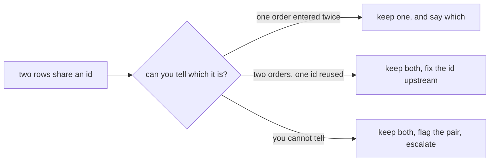

---

## D13. What you actually send, and why it fits in six lines
The message that gets an answer is short, carries the evidence, and proposes a rule so the reply can be a yes.

```
Two rows in the 50 order extract share order_id KR4201.
They match on customer, amount and status, and differ only on order_date
(2026-08-03 and 2026-09-14).

Proposed rule: two rows are the same order when order_id and order_date match,
so these are two orders and both are kept.

If that is wrong, which field decides?
```

The last line is the one that works. It asks for a rule rather than a verdict, so the answer covers every future pair as well as this one.

---

---

## S30. Step card, section 3
1. A whole-record check finds only exact copies.
2. Compare the id count against the row count, every time.
3. Write the identity rule down before you delete anything.
4. Who owns the record decides what counts as the same record.

---

---

## SECTION 4: THE EXTREMES
`[profile the columns] > [decide per field] > [find the hidden rows] > **[investigate the extremes]** > [ship with the log]`

---

---

## S31. Sort the column and look at the end
```
... 2895, 2895, 2930, 2990, 2995, 480000
```

Five ordinary orders and then one that is 160 times the one before it.

---

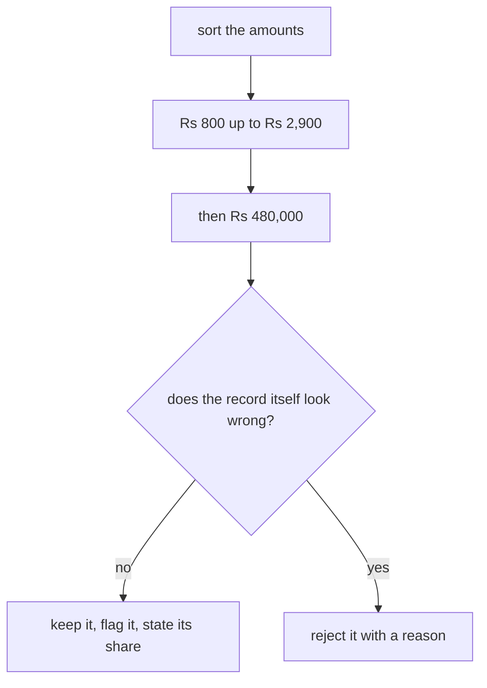

---

## S32. What it does to the total
The order book totals Rs 561,145 across 44 usable orders.

That one order is Rs 480,000 of it, which is 85.5 percent.

Remove it and the total is Rs 81,145.

---

---

## D14. What it does to every number you might report
| Figure | With the order | Without it | What moved |
|---|---|---|---|
| Total | Rs 561,145 | Rs 81,145 | The total is almost entirely one order |
| Mean order value | Rs 12,753.30 | Rs 1,887.09 | The mean is nearly seven times too high |
| Median order value | Rs 1,910 | Rs 1,865 | The median barely notices |
| Usable orders | 44 | 43 | One row |

One row moved the mean by a factor of seven and the median by Rs 45. That contrast is tomorrow's entire lesson and you have already met it.

---

---

## S33. The instinct, and why it is wrong
The instinct is to delete it. It is ruining every number.

An outlier is a finding before it is a row. Rs 480,000 in a business where a typical order is Rs 800 to Rs 3,000 is either the most interesting customer in the file or a data entry error, and those need opposite responses.

---

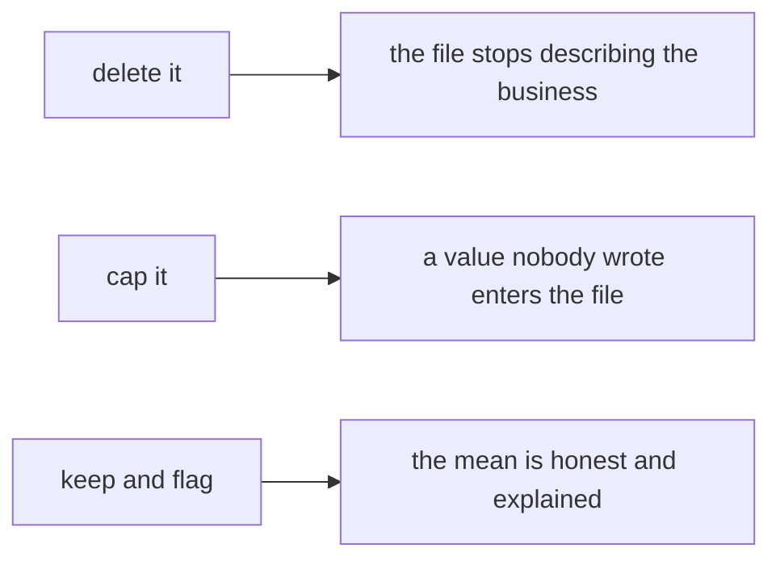

---

## S34. The outlier decision, drawn
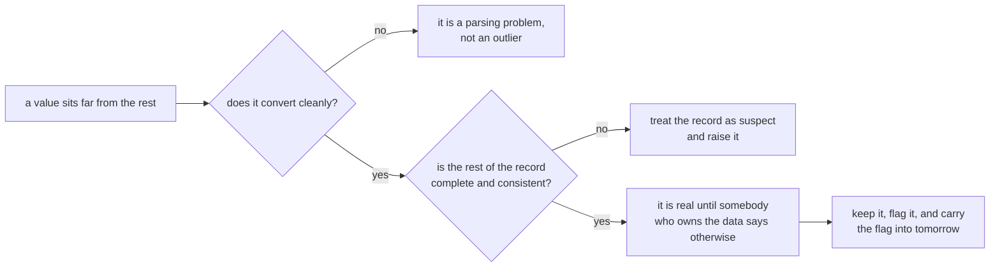

At no point does the tree reach a box that says delete. That is deliberate.

---

---

## S35. A simple fence
A fence is arithmetic that flags a value for a human to look at. It is not a filter.

Today's version is deliberately crude. Take the middle order and multiply it by ten.

$$\text{fence} = 10 \times \text{median} = 10 \times 1910 = 19{,}100$$

Somebody chose the ten, and that somebody is you. Tomorrow you replace it with a threshold built from the spread of the data itself, so that nobody has to choose a number.

---

---

## S36. What the fence catches here
Exactly one value sits above Rs 19,100, and it is the Rs 480,000 order.

The largest ordinary order is Rs 2,995, which is not close to the fence, so nothing borderline is being swept up with it.

The fence found the row you had already spotted by sorting. That agreement is what tells you the number you picked is doing its job on this column.

---

---

## D15. What is wrong with choosing the ten
The fence works and it is still crude, because the ten came from your judgement rather than from the data.

Two consequences you should be able to state.

The first is that the number does not travel. Ten times the median is a sensible fence on order amounts in this business and a useless one on delivery times, on ages, or on a column where the median is near zero. Every new column needs you to choose again, and there is nothing to argue with when somebody disagrees with your choice.

The second is that it moves when the data moves. The median here is Rs 1,910 and the whale is inside the same file, so a fence built from the median is already being pulled by the record it is meant to catch.

Tomorrow's version fixes both. It builds the threshold out of the spread of the middle half of the data, which ignores the tail by construction, and it is the same arithmetic on every column so nobody has to pick a number. Today's fence is the version you can compute in your head, and the point of computing it today is that tomorrow you will know what the better one is better than.

---

---

## D16. Three ways to flag an extreme, and when each is honest
| Method | How it works | When it is the right tool |
|---|---|---|
| Sort and read the tail | You look at the largest and smallest values yourself | Always do this first. It costs nothing and it is the only method that shows you the actual values |
| The IQR fence | Flag anything beyond 1.5 times the interquartile range from the quartiles | When you need a rule somebody else can reproduce, and the column is not wildly skewed |
| A business rule | Flag anything above an amount the business says is implausible | When somebody who owns the domain will give you the number, which is better than any statistic |

The third one beats the other two whenever you can get it. Ask for it before you reach for arithmetic.

---

---

## S37. So you investigate
Order KR4232 converts cleanly. It has a customer, a date, a status and a segment like every other order.

Nothing about it is malformed. It is simply large, so it survives cleaning and goes to Thursday as a question rather than a deletion.

---

---

## D17. What investigating it actually means
You have four questions and the file answers two of them.

| Question | Where the answer is |
|---|---|
| Is the value well formed? | In the file. It converts, so yes. |
| Is the rest of the record consistent? | In the file. Customer C1749, Retail-Core, delivered, 19 August 2026, and nothing is missing. |
| Has this customer ordered like this before? | Not in this extract. It needs the wider order book. |
| Is an order of this size possible in this business? | Not in any file. It needs a person who knows the business. |

Two of four leave your desk. That is normal, and saying so is the difference between an analyst and someone who guesses confidently.

---

---

## S38. Step card, section 4
1. Sort the column and read the tail.
2. An outlier is a finding to investigate.
3. Convertible and extreme means real until someone says otherwise.
4. Record what you kept and why, alongside what you dropped.

---

---

## SECTION 5: WHAT SHIPS
`[profile the columns] > [decide per field] > [find the hidden rows] > [investigate the extremes] > **[ship with the log]**`

---

---

## S39. Two artifacts, not one
```
the profiled dataset     the orders you would compute on
the decisions log        every change, and why you made it
```

The first without the second is an opinion.

---

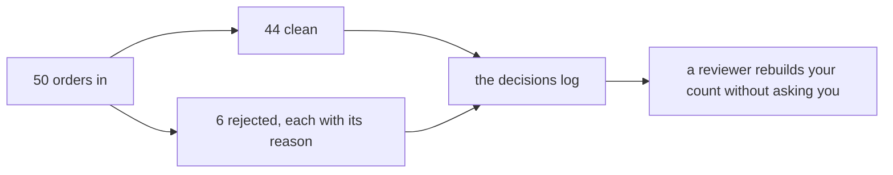

---

## S40. What a log line looks like
```
amount, 2 orders absent      -> rejected, amount is required, ids in rejects file
amount, 4 orders unusable    -> rejected, value present but not a number, ids listed
discount, 39 orders absent   -> kept absent, absence means no discount applied
KR4201, duplicate order_id   -> both kept and flagged, identity rule pending owner
KR4232, 480000               -> kept, converts cleanly, raised with the owner
```

Five lines. A reviewer who was not in the room can follow every one.

---

---

## D18. The fields a decisions log line needs
| Field | Why it is there |
|---|---|
| What was affected | The field name, or the record id when the decision is about one row. |
| How many | The count, so a reader can judge whether the decision was large or small without opening the data. |
| What you did | Dropped, defaulted, kept and flagged, or raised. One of a small set of words, so the log can be scanned. |
| Why | The sentence that makes it defensible. This is the only field that cannot be generated. |
| Where the evidence went | The rejects file, the flag column, or the name of the person it was raised with. |

A log whose entries all read "cleaned" is a log nobody can use. The value is in the fourth column.

---

---

## S41. The reconciliation, one level up
Yesterday it was input equals clean plus rejected.

Today it also has to survive drops, defaults and any dedupe you applied. Same check, more ways to fail it.

```
50 in = clean + rejected + anything you removed on purpose
```

---

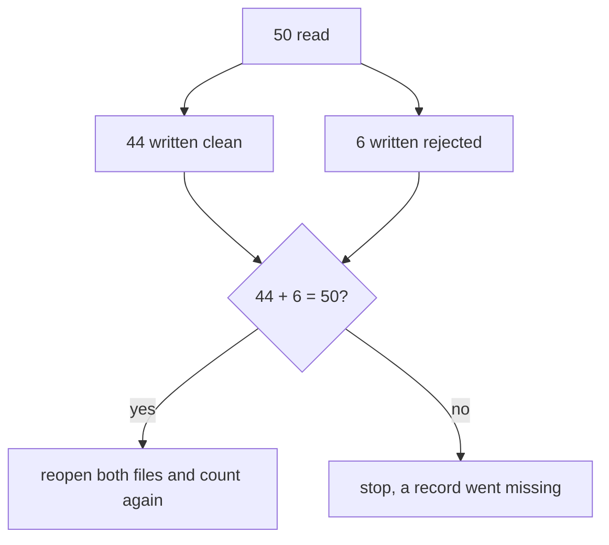

---

## D19. The reconciliation, with today's numbers
$$n_{\text{in}} = n_{\text{clean}} + n_{\text{rejected}} + n_{\text{removed on purpose}}$$

Today, with both duplicate rows kept pending the owner's rule:

$$50 = 44 + 6 + 0$$

The third term is the one that grows as a project matures, and it is the one people forget to print. Every row you remove for a reason belongs in it, and a row removed for no stated reason belongs nowhere, which is the point.

---

---

## D20. The whole day, as one runnable check
```
print("rows in        ", len(rows))
print("clean          ", len(clean))
print("rejected       ", len(rejects))
print("removed        ", len(removed))
assert len(rows) == len(clean) + len(rejects) + len(removed)
print("distinct ids   ", len({r["order_id"] for r in rows}))
print("flagged extremes", len(flagged))
```

```
rows in         50
clean           44
rejected        6
removed         0
distinct ids    49
flagged extremes 1
```

Seven lines. The assertion catches the arithmetic, and the last two lines carry the two findings that no arithmetic would have caught.

---

---

## SECTION 6: THE INTERVIEW BLOCK
`[profile the columns] > [decide per field] > [find the hidden rows] > [investigate the extremes] > **[ship with the log]**`

---

---

## S42. What this section is
The first two questions below are on this week's own question set and will be on Saturday's paper. The rest are asked often enough at this level that this programme puts them in front of you now.

---

---

## S43. What this section is
The first question below is on this week's own question set and will be on Saturday's paper. The rest are asked often enough at this level that this programme puts them in front of you now.

---

---

## S44. Question: zero rejects on a file you know is dirty?
Your pass reports zero rejections. What do you check first?

a) Whether the input file was the one you meant
b) Whether the handler ever appended anything
c) Whether the output folder exists
d) Whether the file had any rows at all

---

## S44a. Answer: whether anything was caught, then reconcile
**The claim.** A bare `except` with a `pass` reports zero rejects by construction, so the first check is whether the handler ever ran.

| Option | Why it does not hold |
|---|---|
| a) The wrong file | Worth checking, and it shows as a low row count rather than as zero rejects. |
| c) The output folder | A missing folder raises on write. |
| d) An empty input | That gives zero clean rows too, which you would have seen. |

Then reconcile all three counts, then check the condition itself, because a condition nothing matches rejects nothing.

**The mental model.** Zero is a number somebody has to earn.

```mermaid
flowchart TB
    A["50 read"] --> B["44 written clean"]
    A --> C["6 written rejected"]
    B --> D{"44 + 6 = 50?"}
    C --> D
    D -->|"yes"| E["reopen both files and count again"]
    D -->|"no"| F["stop, a record went missing"]
```

---

## D21. Zero rejects, one level deeper
Add the direction-of-movement argument, because almost nobody does.

Say that you look at which counts moved and in which direction. A fix that improves every count at once is suspicious, because real cleaning trades one count against another: rejecting bad rows lowers your usable count, and recovering values raises it while lowering your reject count. A run where present, converts and the reject count all improved together did not clean the data, it filled it.

Then name `distinct`, and say it is the only count that falls when values are silently collapsed.

---

---

## S45. Question: what is profiling, and why before cleaning?
Why does the profile come first?

a) It is faster than cleaning
b) It tells you what you are about to change, before you can change it
c) It is required by the style guide
d) It produces the chart the stakeholder wants

---

## S45a. Answer: it is the only record of what the file was
**The claim.** Three counts per field, taken before you have permission to change anything. Once you clean, the file no longer says what it said, and the profile is the only record of what it was.

| Option | Why it does not hold |
|---|---|
| a) Faster | True and irrelevant; speed is not why it goes first. |
| c) The style guide | An appeal to authority, which loses a review. |
| d) A chart | Three integers per field fit in a log. A chart does not. |

**The mental model.** Profiling is what you do before you have permission to change anything.

```mermaid
flowchart LR
    A["for every field in the header"] --> B["for every row"]
    B --> C{"is the value anything at all?"}
    C -->|"yes"| D["present + 1"]
    C -->|"no"| E["absent"]
    D --> F{"does it convert?"}
    F -->|"yes"| G["converts + 1"]
    F -->|"no"| H["present and unusable"]
    D --> I["add it to a set, and distinct is its size"]
```

---

## S46. Question: a column is 40 percent empty. What now?
Forty percent of a column is empty. What is your first move?

a) Fill it with the mean of what is present
b) Ask what the absence means
c) Drop the column
d) Drop the rows

---

## S46a. Answer: ask what the absence means, then choose
**The claim.** The answer depends entirely on whether the absence means something. Kalpa's `discount` is absent on 39 of 50 because no discount ran, and that is a fact rather than a gap.

| Option | Why it does not hold |
|---|---|
| a) The mean | Invents money, and makes absent indistinguishable from a real value. |
| c) Drop the column | Throws away eleven real discounts to avoid a decision. |
| d) Drop the rows | Throws away 39 orders to fix a field nobody required. |

**The mental model.** A default you did not state is data you invented.

```mermaid
flowchart TB
    A["a field is incomplete"] --> B{"what does the absence mean?"}
    B -->|"nothing happened"| C["keep absent, flag it, log the meaning"]
    B -->|"required to compute"| D["reject the row with its reason"]
    B -->|"you cannot say"| E["ask, do not default"]
```

---

## S47. Question: how do you find duplicates in a dataset?
What do you do first?

a) Compare whole rows and count exact copies
b) State the identity rule, then group by it
c) Sort the file and look
d) Drop everything after the first occurrence

---

## S47a. Answer: state the rule, and the number follows
**The claim.** Same record is a rule you state, not a fact the data holds. Four defensible rules on the Kalpa pair give three different answers.

| Option | Why it does not hold |
|---|---|
| a) Whole rows | Finds only exact copies, which is why it reported zero here. |
| c) Sort and look | Works on fifty rows and on nothing larger. |
| d) Drop after the first | Deletes a row before anybody has decided the two are the same record. |

**The mental model.** The rule is the decision and the number follows from it.

```mermaid
flowchart TB
    A["the pair sharing KR4201"] --> B["every field: 0 groups"]
    A --> C["order_id alone: 1 group"]
    A --> D["order_id and order_date: 0 groups"]
    A --> E["order_id and amount: 1 group"]
```

---

## S48. Question: how do you handle an outlier?
One order is Rs 480,000 against a next-largest under Rs 3,000. What do you do?

a) Delete it
b) Cap it at a fence
c) Investigate it first
d) Split it into smaller orders

---

## S48a. Answer: investigate, because it is a finding first
**The claim.** It converts, and it has a customer, a date, a segment and a status like every other order. Nothing about the record is wrong, so it is a finding to investigate before it is a row to delete.

| Option | Why it does not hold |
|---|---|
| a) Delete | Changes the business the file describes, and somebody reconciling revenue will find Rs 480,000 missing. |
| b) Cap | Puts a value nobody wrote into the file, which is the coercion trap in another costume. |
| d) Split | Invents orders that never happened. |

That one order is 86 percent of the money in the file, which is a true fact worth putting on the flag.

**The mental model.** An outlier is a finding, and the fence is a convenience for spotting the tail rather than a test.

```mermaid
flowchart LR
    A["delete it"] --> B["the file stops describing the business"]
    C["cap it"] --> D["a value nobody wrote enters the file"]
    E["keep and flag"] --> F["the mean is honest and explained"]
```

---

## D22. The outlier numbers that make it land
Bring the contrast, not the principle.

```
with the Rs 480,000 order:     mean Rs 12,753.30    median Rs 1,910
without it:                    mean Rs  1,887.09    median Rs 1,865
```

One row moved the mean by nearly seven times and the median by Rs 45. Say those four numbers and you have made the case for investigating rather than deleting, and for reporting a median on a money column, in one breath.

---

---

## S49. Question: what is a decisions log, and why keep one?
What does the log let somebody do that the clean file alone does not?

a) Rerun your code
b) Rebuild your count and argue with your reasoning
c) Find the file faster
d) Skip reading the data

---

## S49a. Answer: rebuild the count and argue with the reasoning
**The claim.** Every cleaning act is a decision, and the log carries the field, the finding, the choice and the reason. That is what makes 44 rather than 50 defensible.

| Option | Why it does not hold |
|---|---|
| a) Rerun the code | The notebook does that, and it says how rather than why. |
| c) Find the file | A locator, not a reason. |
| d) Skip the data | The log is beside the data, never instead of it. |

**The mental model.** What ships is the data plus every decision taken on it.

```mermaid
flowchart LR
    A["50 orders in"] --> B["44 clean"]
    A --> C["6 rejected, each with its reason"]
    B --> D["the decisions log"]
    C --> D
    D --> E["a reviewer rebuilds your count without asking you"]
```

---

## S50. Question: what does it mean to reconcile a load?
What is the identity you assert?

a) The clean file has more rows than the rejects file
b) Input equals clean plus rejected
c) The clean file parses
d) The row count is above zero

---

## S50a. Answer: input equals clean plus rejected, asserted
**The claim.** One line, run every time, and today it runs again against the files reopened from disk.

| Option | Why it does not hold |
|---|---|
| a) More clean than rejects | True of almost every run, and it proves nothing. |
| c) It parses | An empty file parses. |
| d) Above zero | A file with one row is above zero. |

A record in neither file is a record nobody will ever go looking for again.

**The mental model.** Reconciling is the cheapest check in the day and the only one that catches a vanished row.

```mermaid
flowchart TB
    A["50 read"] --> B["44 written clean"]
    A --> C["6 written rejected"]
    B --> D{"44 + 6 = 50?"}
    C --> D
    D -->|"yes"| E["reopen both files and count again"]
    D -->|"no"| F["stop, a record went missing"]
```

---

## S51. Crux
Profiling is what you do before you have permission to change anything.

Every cleaning act is a decision, and a decision nobody wrote down did not happen.

An outlier is a finding to investigate before it is a row to delete, and two checks that disagree are worth more than one check that says zero.

---

---

## S52. Tomorrow
You have a dataset you can defend and a whale you decided to keep.

Tomorrow you compute the average order value and find out what that whale does to it. You have already seen the answer on slide D14, and tomorrow you learn what to say to the person who asked for an average.

---
