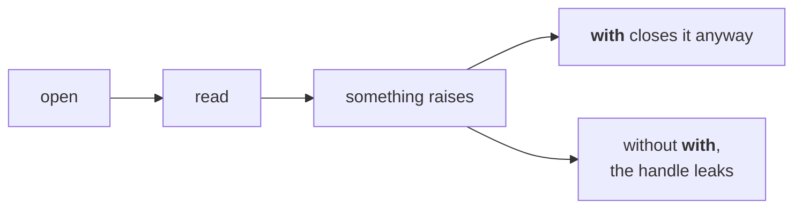
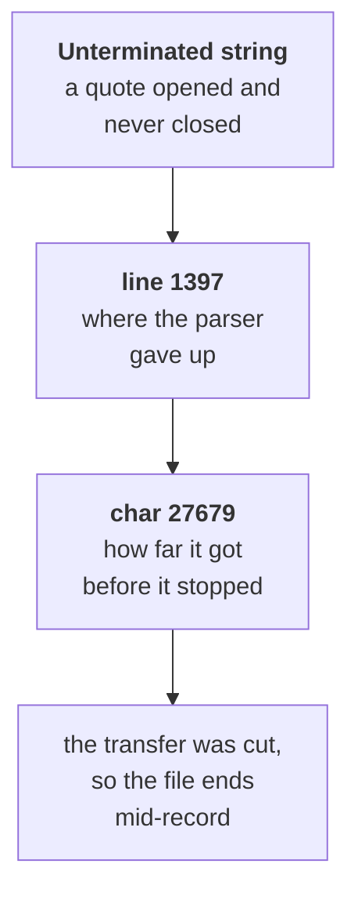
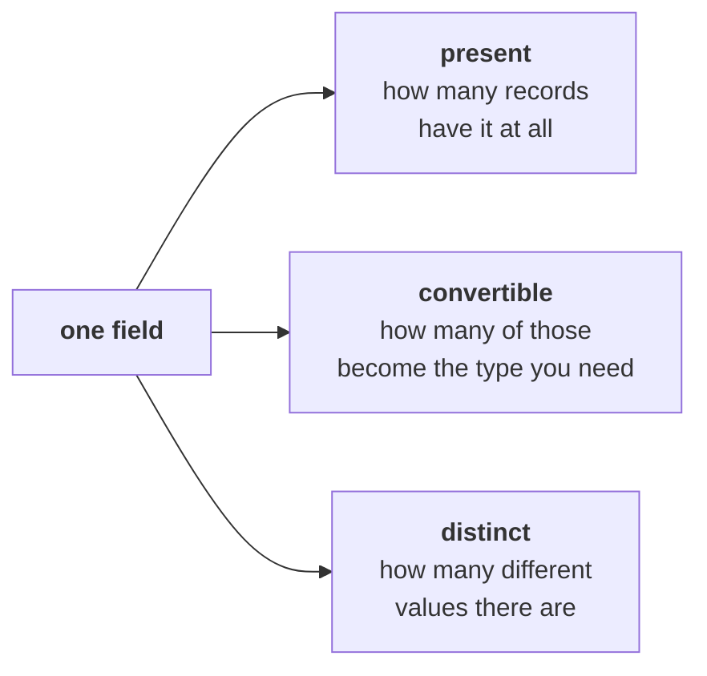
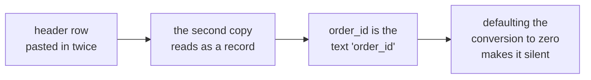

# Half one: two figures, and the file that decides

Week 1, Day 3. Slide source. One idea per slide.

Position bar, repeated at every section boundary:
`[two figures] > [reading a file] > [profiling] > [what the profile found]`

---

## SECTION A. Two figures

---

## S1. Finance will not act on your number
Anand Iyer, replying to the whole leadership group:

> "Your dashboard says Q1 was Rs 2.1 crore. Our books say 1.9. Until your numbers match ours,
> Finance will not act on a drop measured from an ERP export. Send me a reconciliation."

Tuesday's finding is now blocked behind Rs 20 lakh nobody can explain.

---

## S2. What arrived with it
The ERP team sends the raw exports: an orders CSV and the app's JSON feed. The note says the CSV was

> "stitched from two extracts during the Q1 migration."

Marketing is impatient. If the drop is a data problem, a month is lost arguing.

---

## S3. Both figures are computable
| | |
|---|---|
| Dashboard | Rs 2.10 crore |
| Finance | Rs 1.90 crore |
| The gap | Rs 20 lakh |

Neither is a rounding error and neither person is guessing. Somewhere in the file there is Rs 20 lakh that one of them is counting and the other is not.

---

## S4. What an export can do that arithmetic cannot
| Cause | What it does to the total |
|---|---|
| A migration that ran twice | Rows appear more than once |
| Two extracts stitched with an overlap | The overlap is counted twice |
| A header row pasted in again | One row of text becomes a record |
| Cancelled orders in one figure and not the other | Two definitions, one word |

None of these is "the amounts are wrong". That is the insight of the morning.

---

## SECTION B. Reading a file

---

## S5. Everything read from a file is text
```python
import csv
with open("orders.csv", newline="") as f:
    rows = list(csv.DictReader(f))
print(rows[0]["amount"], type(rows[0]["amount"]))
```

```
2200 <class 'str'>
```

It looks like a number and it is not one. Monday's `TypeError` was one row; from a file it is every row.

---

## S6. The `with` block closes the file even when you fail


`with` is not style. It is the difference between a failed run that leaves the system clean and one that leaves a file locked.

---

## S7. The JSON feed does not open
```python
import json
with open("orders.json") as f:
    data = json.load(f)
```

```
json.decoder.JSONDecodeError: Unterminated string starting at: line 1397 column 15 (char 27679)
```

The message gives you the line, the column and the character offset. Open the file at that line before you form a theory.

---

## S8. Reading a parse error


A truncated file is not a corrupt file. It is a complete file that stops early, and the fix is to ask for it again rather than to patch it.

---

## SECTION C. Profiling

---

## S9. Profile before you analyse


| Count | The question it answers |
|---|---|
| Present | How many records have this field at all |
| Convertible | How many of those can become the type you need |
| Distinct | How many different values there are |

Any field where these three disagree with what you expected is a finding.

---

## S10. Distinct is the one that catches migrations
```python
ids = [r["order_id"] for r in rows]
print(len(ids), len(set(ids)))
```

```
201 186
```

Two hundred and one rows carrying one hundred and eighty-six order ids. Fifteen ids appear more than once, and nobody mentioned that in the note.

---

## D11. Is fifteen repeated ids the whole Rs 20 lakh?
**Question.** Fifteen rows out of two hundred is seven percent, and the gap is about nine percent of the quarter. Close enough to stop looking?

---

## D12. Answer: no, and the arithmetic is the check
Seven percent of rows is not nine percent of revenue unless the repeated rows happen to be larger than average.

Total the repeated rows and see. If they come to Rs 20 lakh, you have the answer. If they come to Rs 3 lakh, there is a second cause and you have not found it yet.

---

## SECTION D. What the profile found

---

## S13. The profile, field by field
| Field | Present | Convertible | Distinct |
|---|---|---|---|
| order_id | 201 | n/a | 186 |
| amount | 201 | 200 | many |
| status | 200 | n/a | 3 |
| customer_id | 201 | n/a | 69 |

Three anomalies in one table: repeated ids, one amount that will not convert, one record missing a status.

---

## S14. The companion file that is worse


A header read as a record gives you an order whose id is the text `order_id` and whose amount is the text `amount`. It will not convert, and if you default the conversion to zero it becomes a silent extra row.

---

## S15. What half two does with this
You now have three anomalies and a gap of Rs 20 lakh. Half two decides what to do about each one, records the decision, and produces a bridge that lands on Finance's number.
