# Which Q1 figure is right?

Week 1, Day 3. Half one.

Kicker: WEEK 1  ·  WEDNESDAY  ·  HALF ONE
Quote: Your dashboard says Q1 was Rs 2.1 crore. Our books say 1.9. Until your numbers match ours, Finance will not act on a drop measured from an ERP export.
Who: Anand Iyer, finance controller, Kalpa Retail, replying to all on Tuesday's finding

```notes
LIVE, one minute. Read Anand's reply aloud and leave it on screen. Tuesday's finding went to the
leadership group last night, and this is the first reply. The day is one question climbed in six
chapters: which Q1 figure is right, and can we prove it to an analyst who ties out to the rupee.
Five chapters this block, the sixth after lunch, then the full pass alone and the auditor.
```

---

## S1. Wednesday morning, one reply to all
*Tuesday's finding reached the leadership group, and Finance answered first.*

```cards
icon: landmark | eyebrow: Finance | title: Anand Iyer | body: The finance controller. His books say Q1 was Rs 1.9 crore, and his analyst audits every number that reaches him. | tone: dark
icon: database | eyebrow: The ERP team | title: The raw exports | body: An orders CSV and the app's JSON feed, with a note that the CSV was stitched from two extracts during the Q1 migration.
icon: megaphone | eyebrow: Marketing | title: The marketing lead | body: Impatient: if the drop is a data problem, a month is lost arguing about it.
```

```stats
value: Rs 2.1 cr | label: the dashboard's Q1 | note: from the ERP export
value: Rs 1.9 cr | label: the books' Q1 | note: what Finance booked
value: Rs 20 lakh | label: the gap | note: about 10 percent of Q1
```

```notes
LIVE, 3 minutes. Revenue here is booked value in rupees, every order whatever its status, the
definition Monday set in the retail dossier. Ask: whose number do you trust before looking at
anything? Most say Finance. The honest answer is neither yet: both are computed correctly from
something, and the job is to find what.
```

---

## S2. Four readers, four questions
*One reconciliation has to answer all of them.*

**The client asks.** "Which figure is right, and how do you know? Can my analyst follow every decision you made?"

| Who | Their question | What answers it |
|---|---|---|
| Anand | Which Q1 figure is right, and the proof | A bridge from 2.1 to 1.9, move by move |
| His analyst | Can every row you removed be followed | The logs, and control totals: rows and rupees counted at both ends |
| Marketing | Does Tuesday's finding survive | Tuesday recomputed on the clean file |
| An auditor | Why did you drop any row | Rows that tie, with a reason per row |

```notes
LIVE, 3 minutes. Say when each gets answered: Anand's and Marketing's by the end of this block,
the analyst's and the auditor's after lunch. Watch for learners who want to start coding; hold
them, the next slide is the thinking.
```

---

## S3. Question: what could make an export read high?
*Before the file opens, list every way 2.1 and 1.9 could both be honest arithmetic.*

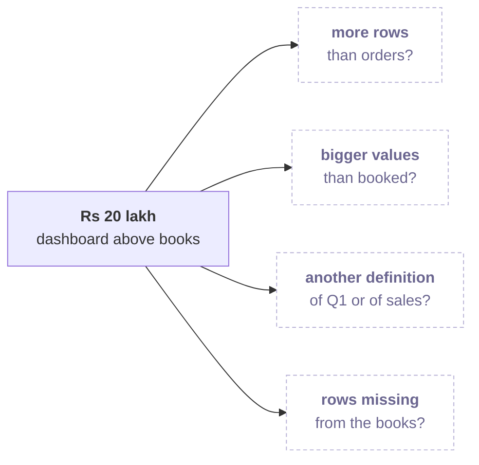
```mermaid
flowchart LR
    G["<b>Rs 20 lakh</b><br/>dashboard above books"] --> U["<b>more rows</b><br/>than orders?"]
    G --> V["<b>bigger values</b><br/>than booked?"]
    G --> D["<b>another definition</b><br/>of Q1 or of sales?"]
    G --> L["<b>rows missing</b><br/>from the books?"]
    classDef unknown fill:#FFFFFF,stroke:#B8B2D6,color:#6B6690,stroke-dasharray:4 3
    class U,V,D,L unknown
```

**Question.** Which branch would you check first, as a letter? a) more rows than orders; b) bigger values than booked; c) another definition; d) rows missing from the books.

```notes
LIVE, 5 minutes. Pairs, three minutes: one way per branch that an ERP export could produce it.
Expect copies from a migration, a text amount read wrongly, returns counted as sales, a window
that differs. The point is the list; the letter comes next.
```

---

## S4. Answer: rows first, because a count is cheapest
*Every branch is possible; the cheapest check goes first.*

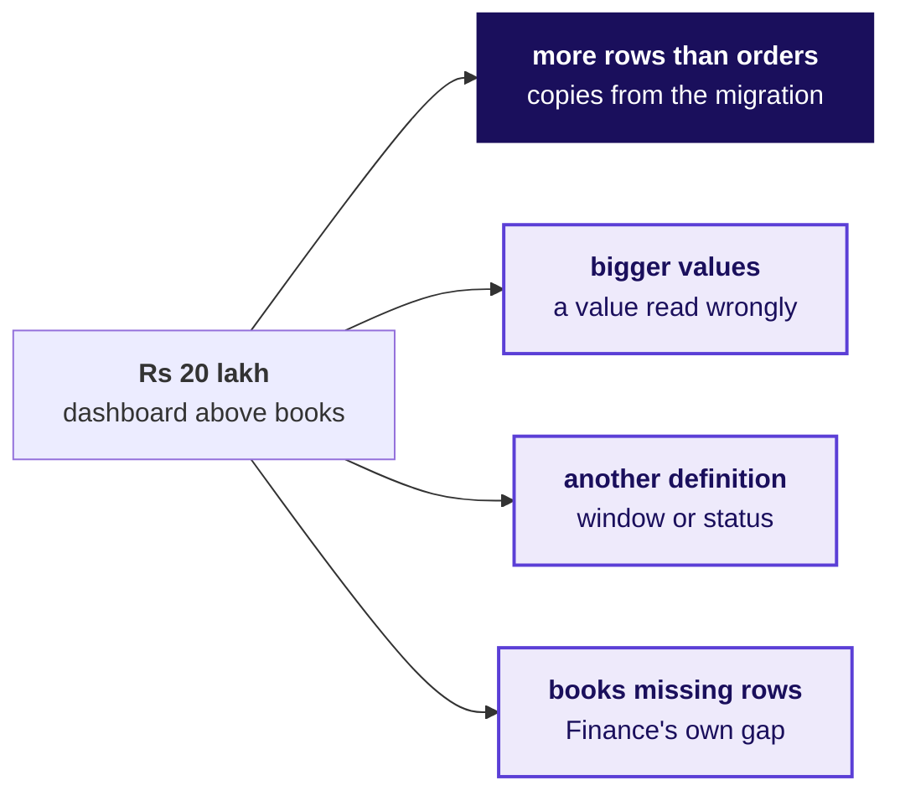
```mermaid
flowchart LR
    G["<b>Rs 20 lakh</b><br/>dashboard above books"] --> U["<b>more rows than orders</b><br/>copies from the migration"]
    G --> V["<b>bigger values</b><br/>a value read wrongly"]
    G --> D["<b>another definition</b><br/>window or status"]
    G --> L["<b>books missing rows</b><br/>Finance's own gap"]
    classDef bet fill:#1A0F5C,stroke:#1A0F5C,color:#FFFFFF
    classDef known fill:#EEEAFB,stroke:#5B3FD6,color:#1A0F5C,stroke-width:2px
    class U bet
    class V,D,L known
```

**Kavya's review.** Rank the checks by cost. Rows against distinct orders takes one line and rules a whole branch in or out; start there and keep the other three on the list.

```notes
LIVE, 2 minutes. The answer is a, for cost more than likelihood, though the ERP note about a
stitched CSV makes it likelier too.
```

---

## S5. The thinking: profile, decide, reconcile, recompute
*Four moves, drawn on the board before any tool opens, and a log written as you go.*

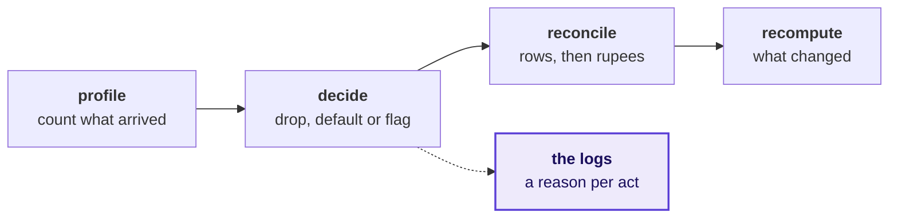
```mermaid
flowchart LR
    P["<b>profile</b><br/>count what arrived"] --> C["<b>decide</b><br/>drop, default or flag"]
    C --> R["<b>reconcile</b><br/>rows, then rupees"]
    R --> T["<b>recompute</b><br/>what changed"]
    C -.-> L["<b>the logs</b><br/>a reason per act"]
    classDef known fill:#EEEAFB,stroke:#5B3FD6,color:#1A0F5C,stroke-width:2px
    class L known
```

Every cleaning act is a decision with a written reason. The reconciliation proves the clean file is the same data: input equals clean plus set aside, in rows and in rupees.

```notes
LIVE, 4 minutes. Draw this with the room and leave it up all day. The dotted arrow is the log,
written as you go and never reconstructed at the end. Tuesday skipped the first box.
```

---

## S6. Six chapters, each a harder question
*Five this morning, the sixth after lunch, each with its own notebook.*

```timeline
label: Chapter 1 | title: What the ERP actually sent | body: The profile: present, convertible, distinct.
label: Chapter 2 | title: The rows that repeat | body: What makes two rows one order.
label: Chapter 3 | title: The copy that stays | body: The identity rule and its preference.
label: Chapter 4 | title: What is missing or malformed | body: Drop, default or flag; coerce, reject or repair.
label: Chapter 5 | title: The bridge to the books | body: The bridge, and Tuesday recomputed.
label: Chapter 6 | title: The log the analyst audits | body: Logs a stranger can replay. | tone: dark
```

```notes
LIVE, 3 minutes. Each chapter runs the same way: the need, the options sized, the build, the trap,
a second route, Kavya's review. Notebook numbers match chapter numbers. Then chapter 1.
```

---

## SECTION 1: What the ERP actually sent
*Count what arrived before totalling anything.*

```notes
LIVE. Thirty minutes. Notebook C2_W01_D03_01_profile is the demonstration.
```

---

## S7. The need: a total needs a file you have profiled
*Anand's metric is Q1 revenue to the rupee, and every later number stands on this one.*

```stats
value: Q1 revenue | label: the metric | note: booked value: every order at its price, whatever its status
value: Anand | label: who asks | note: finance controller
value: a month | label: a wrong number costs | note: Marketing waits, Finance distrusts
```

**The client asks.** "How many records did you receive, and how many can you use?"

```notes
LIVE, 3 minutes. The cost of a wrong answer here is the largest of the day, because every later
chapter is built on this count. If the note says the dashboard is right and it is not, the analyst
finds it and discounts every later number the team sends.
```

---

## S8. Target Canada trusted data nobody had profiled
*It opened in 2013, and in January 2015 announced it would close all 133 stores.*

```stats
value: 133 | label: stores to close | note: announced January 2015, CBC News
value: ~$1 bn | label: first-year loss | note: CBC News
value: ~30% | label: product data accurate | note: Salsify, citing Canadian Business
```

**What breaks.** Data loaded in a hurry during a system change is the kind that needs counting before anyone trusts it. Kalpa's ERP export was stitched during a migration.

```notes
LIVE, 2 minutes. Sources checked 30 Sep 2026: CBC News, 15 January 2015; Salsify's summary of Joe
Castaldo's Canadian Business investigation for the 30 percent figure, against 98 to 99 percent in
the US. Say "about" and name the source aloud; the 30 percent is a secondary summary.
```

---

## S9. Four ways to learn what arrived
*Each option sized on this file: 201 rows, 10 fields.*

| Option | What it reads | Time | What it catches |
|---|---|---|---|
| a) Total and compare | 201 amounts | under a second | stops on an unreadable amount |
| b) Scroll it | 2,010 cells by eye | about 17 minutes | misses repeats far apart |
| c) Sample 20 rows | 20 rows | about 10 minutes | 13% chance to see both copies of a pair |
| d) Profile every field | 2,010 values by code | under a second | every count that does not fit |

**The call.** d, then sample only where the profile points. What would switch it: a file with no field that names an order.

```notes
LIVE, 5 minutes. The minutes for b and c are an illustrative half-second a cell and half a minute a
row. The 13 percent is exact by inclusion and exclusion over the 15 pairs: a repeat is seen only
when both copies are drawn, since one copy alone ties to the books like any order. The
chance of the sample meeting the one unreadable amount is 10 percent.
```

---

## S10. A profile asks three questions of every field
*Present, convertible, distinct: what each field can be trusted for.*

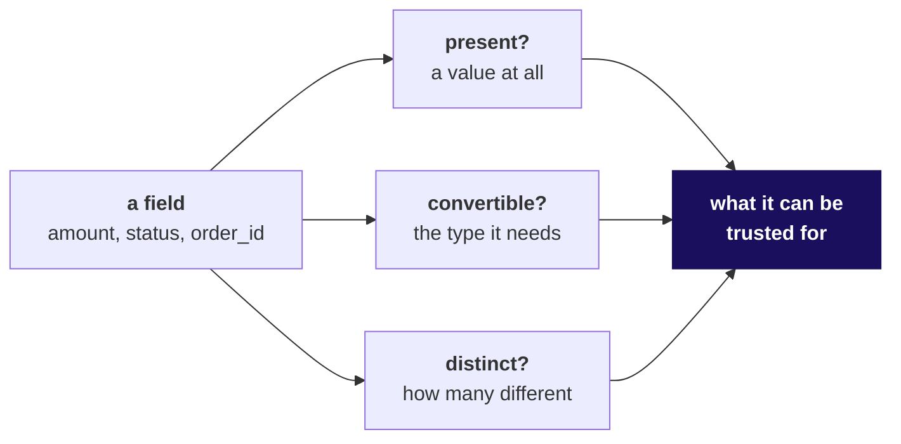
```mermaid
flowchart LR
    F["<b>a field</b><br/>amount, status, order_id"] --> P["<b>present?</b><br/>a value at all"]
    F --> C["<b>convertible?</b><br/>the type it needs"]
    F --> D["<b>distinct?</b><br/>how many different"]
    P --> T["<b>what it can be<br/>trusted for</b>"]
    C --> T
    D --> T
    classDef bet fill:#1A0F5C,stroke:#1A0F5C,color:#FFFFFF
    class T bet
```

```notes
LIVE, 2 minutes. Ask what "distinct" says about order_id that "present" cannot: whether ids
repeat. Then open notebook 01. When open("orders.csv") fails with FileNotFoundError, two minutes
on the last line, which names the folder Python looked in; the exports live in ../data/.
```

---

## S11. Question: which field falls furthest short?
*Everything read from a CSV is text, and the profile counts it field by field.*

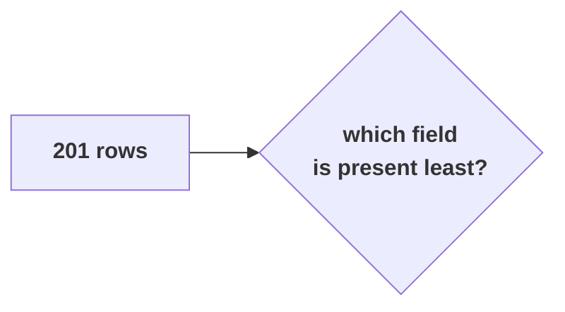
```mermaid
flowchart LR
    R["<b>201 rows</b>"] --> F{"<b>which field<br/>is present least?</b>"}
```

**Question.** Which field shows the biggest gap between present and 201, as a letter? a) amount; b) discount; c) order_id; d) none, an ERP export is complete.

```notes
LIVE, 2 minutes. Letters in chat before the notebook cell runs.
```

---

## S12. Answer: discount, and three smaller gaps matter more
*Three counts do not fit 201, and each is a question for a later chapter.*

| Field | Present | Convertible | Distinct |
|---|---|---|---|
| order_id | 201 | text | 186 |
| amount | 201 | 200 | 161 |
| status | 200 | text | 3 |
| discount | 143 | 143 | 4 |

**What breaks.** Order ids distinct on 186, amounts convertible on 200, status present on 200. Discount is Tuesday's optional field.

```notes
LIVE, 3 minutes. The answer is b. Do not explain the other three yet; name the chapter that
answers each: order_id in chapters 2 and 3, amount and status in chapter 4.
```

---

## S13. The plausible wrong answer: the top three orders
*The analyst audits the largest orders first, and the hurried sort sends three.*

```python
q2 = [r for r in raw if r["quarter"] == "Q2"]
top = sorted(q2, key=lambda r: r["amount"], reverse=True)[:3]
[r["amount"] for r in top]      # ['970', '970', '952000']
```

```stats
value: Rs 970 | label: the largest Q2 order | note: as the hurried sort reports it
value: 0 | label: orders above Rs 10 lakh | note: in the sample sent
```

```notes
LIVE, 3 minutes, notebook 01, section 3. Run it and ask what the analyst would tie out tonight.
Three small orders. The decision it misleads: an audit that passes on the part of the file
that carries the least money.
```

---

## S14. Why it is wrong: text sorts by spelling
*'970' beats '2945460' because 9 comes after 2.*

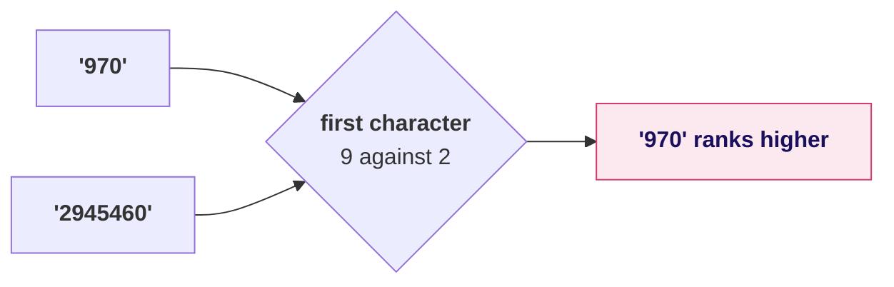
```mermaid
flowchart LR
    A["<b>'970'</b>"] --> C{"<b>first character</b><br/>9 against 2"}
    B["<b>'2945460'</b>"] --> C
    C --> W["<b>'970' ranks higher</b>"]
    classDef bad fill:#FBE9EF,stroke:#D63A6A,color:#1A0F5C
    class W bad
```

**The check.** Can the largest Q2 order be smaller than every Business order, when Business sells in lakhs? The smallest Business order is Rs 2,03,060.

```notes
LIVE, 3 minutes. The check is a business question, which is the habit to build.
```

---

## S15. The fix: convert once, then sort
*The top three move from Rs 9,53,940 to Rs 62,11,460 of the quarter.*

```stats
value: Rs 29,45,460 | label: the largest Q2 order | note: sorted as a number
value: Rs 62,11,460 | label: the top three | note: against Rs 9,53,940 as text
value: 200 + 1 | label: amounts | note: converted, and one in the rejects log
```

**What changed.** The same convert() that fixes the sort logs the one amount that fails, and Q1 over the amounts that convert reads Rs 2,09,98,210: the dashboard's 2.1 crore is honest arithmetic on this file.

```notes
LIVE, 3 minutes. The your-turn cell has the room run int() over every amount and meet the
ValueError: two minutes, read the last line, write the value down. Then convert() runs clean.
Chapter 5 comes back to the Rs 29 lakh order.
```

---

## S16. A second route, and a second witness
*A Counter over ids and the rejects log reach the profile's counts by other code.*

```stats
value: 186 = 186 | label: distinct ids | note: the profile and a Counter
value: 1 = 1 | label: amounts that fail | note: the profile and the rejects log
value: 119 | label: JSON feed records | note: complete, then the file is cut
```

**When to switch.** The profile for a first look; the Counter when one field matters, since it keeps how often each id appears. The JSON feed is a witness to compare against, never a replacement.

```notes
LIVE, 2 minutes. The JSONDecodeError is met in an empty cell: two minutes, open the file at the
line and column it names. A CSV writes a missing value as an empty string and JSON leaves the key
out; profile() uses .get(field, "") so both count the same.
```

---

## S17. Kavya's review of chapter 1
*The profile comes first, and a failure is counted next to the successes.*

**Kavya's review.** Before you total anything, tell me how many records you received, how many are complete, how many convert and how many are distinct.

**In the interview.** [F] Everything read from a CSV is a string; what breaks and where do you convert?

```cards
icon: list-checks | eyebrow: Chapter 1 | title: Established | body: 201 rows, 186 order ids, 200 amounts that convert, 1 logged.
icon: circle-help | eyebrow: Chapter 2 | title: Open | body: Which rows repeat, and what makes two rows one order. | tone: dark
```

```notes
LIVE, 2 minutes. One breath: arithmetic, comparison and sorting break or silently lie on text;
convert once at the boundary in one function that returns the value or the reason; log failures.
```

---

## SECTION 2: The rows that repeat
*Say what makes two rows one order before counting a single duplicate.*

```notes
LIVE. Thirty minutes. Notebook C2_W01_D03_02_duplicates is the demonstration.
```

---

## S18. The need: 186 orders on 201 rows
*If the migration exported orders twice, Q1 revenue and every per-customer rate are inflated.*

```stats
value: 114 for 100 | label: Q1 rows for orders | note: the quarter the migration touched
value: 87 for 86 | label: Q2 rows for orders | note: one extra row
```

**The client asks.** "Which rows did the export count twice, and how do you know they are copies?"

**What breaks.** Every copy left in adds its rupees to Q1 and an extra order to a Retail-Plus rate; every real order removed takes rupees out of Finance's books.

```notes
LIVE, 3 minutes. Q1 holds 114 rows for 100 orders, Q2 87 for 86. The extra rows sit in the quarter
the migration touched. Cost of a wrong answer: keep Rs 20 lakh that was never earned, or delete
real orders from the books.
```

---

## S19. Starbucks billed a million customers twice
*One processing fault, the same purchase recorded twice, about 7,800 stores.*

```stats
value: 22 to 23 May | label: 2009 | note: the fault ran two days
value: ~7,800 | label: stores | note: company-owned, US and Canada
value: ~1 million | label: customers repaid | note: NBC News and AP
```

**What breaks.** A repeated record looks like a second purchase until someone asks what makes two records one.

```notes
LIVE, 2 minutes. Source: NBC News and AP, 10 June 2009, checked 30 Sep 2026. It is a duplicated
charge, the customer's side of the same mistake Kalpa's export makes in its revenue.
```

---

## S20. Four keys, sized on the ERP file
*The same file, four rules for what makes two rows one order.*

| Key | Rows flagged | Q2 after | Copies missed | Real rupees removed |
|---|---|---|---|---|
| a) Whole record | 0 | Rs 1,87,03,710 | 15 | Rs 0 |
| b) Record less line | 13 | Rs 1,87,03,710 | 2 | Rs 0 |
| c) order_id | 15 | Rs 1,87,00,000 | 0 | Rs 0 |
| d) Fuzzy: customer, amount, 60 days | 15 | Rs 1,69,29,000 | 1 | Rs 17,71,000 |

**The call.** c, because the ERP issues one id per order. What would switch it: two systems issuing their own ids, and then the key is the system plus the id.

```notes
LIVE, 5 minutes. The fuzzy match, same customer and amount dated within 60 days, has no key to group on, so it costs 20,100 pair comparisons here against 201 lookups for a key,
and about 200 lakh crore pairs on a file of 2 crore rows. Point at d: same count as c, different rows.
```

---

## S21. The plausible wrong answer: zero duplicates
*Chapter 1 taught the rejects log to carry each row's file line, and the default dedupe runs.*

```python
kept = whole_record_dedupe(raw)   # every field compared
len(raw) - len(kept)              # 0
```

```stats
value: 0 | label: duplicates found | note: the whole-record dedupe
value: Rs 2,09,98,210 | label: Q1 | note: unchanged, the dashboard looks right
```

```notes
LIVE, 3 minutes. Ask what they would do with a dedupe that finds zero; most would report it, since
the function ran without error.
```

---

## S22. Why it is wrong: 201 rows, 186 ids
*Both cannot be true of a file with no repeats.*

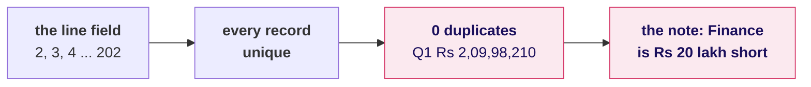
```mermaid
flowchart LR
    L["<b>the line field</b><br/>2, 3, 4 ... 202"] --> U["<b>every record<br/>unique</b>"]
    U --> Z["<b>0 duplicates</b><br/>Q1 Rs 2,09,98,210"]
    Z --> N["<b>the note: Finance<br/>is Rs 20 lakh short</b>"]
    classDef bad fill:#FBE9EF,stroke:#D63A6A,color:#1A0F5C
    class Z,N bad
```

**The check.** Count distinct ids against rows first. The file line is where a row sat, never what the order is; leave it in the key and no two rows can match.

```notes
LIVE, 4 minutes. Show the five invented records in notebook 02: the whole record with the line
finds 0, without it finds 2. The decision it misleads: Finance sent hunting for revenue that
was never earned.
```

---

## S23. The fix: 15 orders appear exactly twice
*Grouped by order_id: 14 pairs in Q1, one in Q2, none three times.*

```stats
value: 171 | label: orders once | note: one row each
value: 15 | label: orders twice | note: one row too many each
value: 14 + 1 | label: by quarter | note: Q1 and Q2
```

**What changed.** A count of nothing became a list of 15 orders, each on two lines, and the second lines sit together at the end of the file.

```notes
LIVE, 4 minutes. Do not read the ids aloud. Ask what the second line numbers have in common:
they sit together at the end of the file, where the second extract was appended.
```

---

## S24. The harder variant: the same count, other rows
*The fuzzy match flags 15 and the order id flags 15; they share 14.*

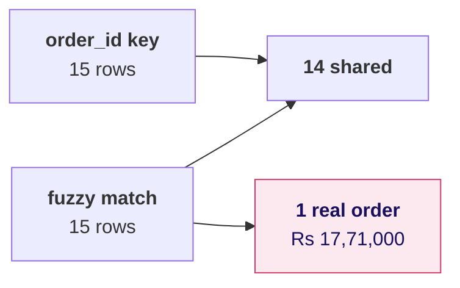
```mermaid
flowchart LR
    O["<b>order_id key</b><br/>15 rows"] --> S["<b>14 shared</b>"]
    F["<b>fuzzy match</b><br/>15 rows"] --> S
    F --> X["<b>1 real order</b><br/>Rs 17,71,000"]
    classDef bad fill:#FBE9EF,stroke:#D63A6A,color:#1A0F5C
    class X bad
```

**What breaks.** A count that matches is not a match. A Business customer spent the same Rs 17,71,000 again within 60 days, and the fuzzy match calls it a copy.

```notes
LIVE, 4 minutes. The decision it misleads: a reviewer comparing counts signs off a pass that
removes a real Q2 order. Always compare the rows, never only their number.
```

---

## S25. A second route: rows less ids, per quarter
*Arithmetic gives how many; only the groups give which.*

```stats
value: 14 + 1 | label: rows less distinct ids | note: Q1 and Q2
value: 15 | label: from the groups | note: sum of size less one
```

**When to switch.** The arithmetic is the one-line check to run first on any file; the groups are the pass, because only they can feed a log.

```notes
LIVE, 3 minutes. Both routes in notebook 02 assert 15.
```

---

## S26. Kavya's review of chapter 2
*A count of duplicates without an identity rule is a count of nothing.*

**Kavya's review.** Tell me what makes two rows the same order before you tell me how many duplicates there are.

**In the interview.** [F] How do you find duplicates, and what makes two records the same?

```cards
icon: list-checks | eyebrow: Chapter 2 | title: Established | body: The order_id is the identity; 15 orders appear twice, 14 in Q1.
icon: circle-help | eyebrow: Chapter 3 | title: Open | body: Which copy of each pair stays, and what that does to Q1. | tone: dark
```

```notes
LIVE, 2 minutes. One breath: the business's identity rule first, rows against distinct keys, and
weigh the copies in money. Then chapter 3.
```

---

## SECTION 3: The copy that stays
*For thirteen pairs it does not matter; for two it moves Q1 and a date.*

```notes
LIVE. Thirty minutes. Notebook C2_W01_D03_03_identity_rule is the demonstration.
```

---

## S27. The need: the analyst ties out to the rupee
*A choice that loses one order's amount turns the reconciliation into a finding against the team.*

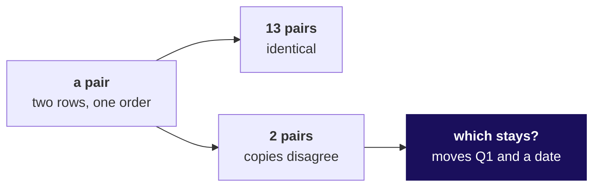
```mermaid
flowchart LR
    P["<b>a pair</b><br/>two rows, one order"] --> E["<b>13 pairs</b><br/>identical"]
    P --> D["<b>2 pairs</b><br/>copies disagree"]
    D --> Q["<b>which stays?</b><br/>moves Q1 and a date"]
    classDef bet fill:#1A0F5C,stroke:#1A0F5C,color:#FFFFFF
    class Q bet
```

**The client asks.** "When two copies disagree, which one did you keep, and why that one?"

**What breaks.** Keeping the wrong copy of one pair costs Rs 1,790 against the books, and the analyst finds it on her first tie-out.

```notes
LIVE, 3 minutes. Anand's analyst is the reader. Every choice is visible to her in the log.
```

---

## S28. India's GST portal writes the identity rule into law
*A business invoice is one invoice per supplier GSTIN, number, type and year.*

```stats
value: 4 fields | label: the identity | note: GSTIN, number, type, year
value: rejected | label: a second copy | note: GSTN e-invoice FAQ
value: Rs 5 crore | label: turnover threshold | note: since 1 August 2023
```

**What breaks.** GSTIN is a business's GST registration number. Without a written rule for what makes two records one, every team chooses its own survivor. Kalpa's Business segment sells to companies and meets this rule on every invoice.

```notes
LIVE, 2 minutes. Sources checked 30 Sep 2026: GSTN e-invoice FAQ version 1.4, question 65, and
Notification 10/2023-Central Tax. The portal hashes the same fields into the invoice reference
number, and a repeat is refused at the door.
```

---

## S29. Four ways to choose the survivor
*Sized on the ERP file: Q1 against the books.*

| Option | Q1 | Against the books | Unreadable kept |
|---|---|---|---|
| a) First in the file | Rs 1,89,98,210 | -Rs 1,790 | 1 |
| b) Last in the file | Rs 1,90,00,000 | Rs 0 | 0 |
| c) The copy that validates | Rs 1,90,00,000 | Rs 0 | 0 |
| d) Escalate all 15 | open | open | 0, after days of waiting |

**The call.** c, and escalate only the pair whose valid copies disagree. Last lands here by file order, which is luck. What would switch it: the ERP team saying the second extract was a corrected re-run.

```notes
LIVE, 5 minutes. Thirteen of the fifteen escalations would carry no question at all.
```

---

## S30. The rule, drawn before the file
*Three kinds of pair, each with its survivor, on invented records.*

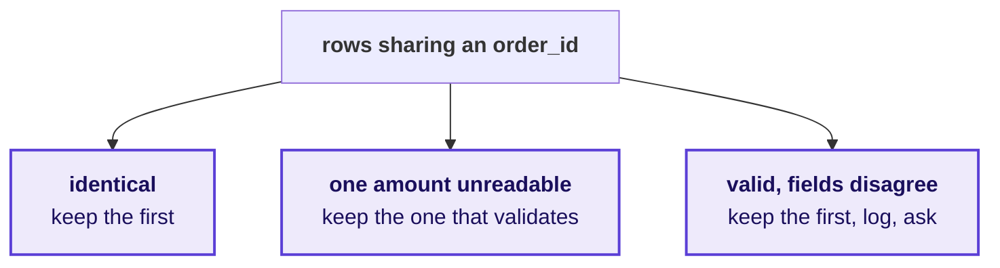
```mermaid
flowchart TD
    G["<b>rows sharing an order_id</b>"] --> A["<b>identical</b><br/>keep the first"]
    G --> B["<b>one amount unreadable</b><br/>keep the one that validates"]
    G --> C["<b>valid, fields disagree</b><br/>keep the first, log, ask"]
    classDef known fill:#EEEAFB,stroke:#5B3FD6,color:#1A0F5C,stroke-width:2px
    class A,B,C known
```

```notes
LIVE, 3 minutes. Invented pairs INV-11 to INV-13 in notebook 03. For the disagreeing pair no rule
inside the file can say which date is true; the rule turns the date into a written question.
```

---

## S31. Question: after the rule, what is Q1?
*186 orders kept, 15 rows set aside, each with a reason.*

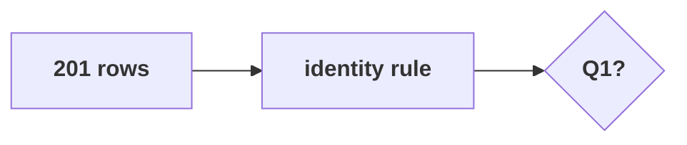
```mermaid
flowchart LR
    R["<b>201 rows</b>"] --> K["<b>identity rule</b>"] --> Q{"<b>Q1?</b>"}
```

**Question.** Q1 after the identity rule, as a letter? a) Rs 2,09,98,210; b) Rs 1,89,98,210; c) Rs 1,90,00,000; d) Rs 2,00,00,000.

```notes
LIVE, 2 minutes. Letters in chat.
```

---

## S32. Answer: Rs 1,90,00,000, the books to the rupee
*Q2 moves to Rs 1,87,00,000, and no revenue left with the unreadable copy.*

```stats
value: Rs 1,90,00,000 | label: Q1 | note: the books, to the rupee
value: Rs 1,87,00,000 | label: Q2 | note: one row per order
value: 186 + 15 | label: rows | note: kept and set aside
```

**What changed.** The amount chapter 1 could not read was one copy of a pair whose twin carries the value. The answer is c.

```notes
LIVE, 3 minutes. The your-turn cell prints the two log rows whose reason says more than "second
copy". Each learner writes the question they would send the ERP team.
```

---

## S33. The plausible wrong answer: Q1 ties, so stop
*The whole record less the line lands Q1 on the books to the rupee.*

```stats
value: Rs 1,90,00,000 | label: Q1 | note: equal to the books
value: 188 | label: orders reported | note: in the clean file
value: Rs 1,87,03,710 | label: Q2 | note: sent on to Marketing
```

```notes
LIVE, 3 minutes, notebook 03, section 3. Ask who would ship this. Most hands go up: Q1 ties.
```

---

## S34. Why it is wrong: a tie in rupees proves no rows
*188 rows for 186 orders: one Q2 order counted twice, one unreadable row kept.*

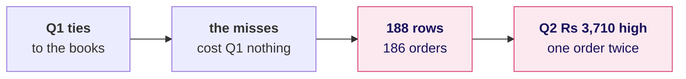
```mermaid
flowchart LR
    T["<b>Q1 ties</b><br/>to the books"] --> H["<b>the misses</b><br/>cost Q1 nothing"]
    H --> R["<b>188 rows</b><br/>186 orders"]
    R --> Q["<b>Q2 Rs 3,710 high</b><br/>one order twice"]
    classDef bad fill:#FBE9EF,stroke:#D63A6A,color:#1A0F5C
    class R,Q bad
```

**The check.** Rows kept against distinct ids, the check chapter 2 taught.

```notes
LIVE, 3 minutes. The two pairs this pass misses cost Q1 nothing: one copy's amount cannot be read,
so it adds nothing to the sum. The decision it misleads: a Q2 order count one too high in
Retail-Plus, the segment Tuesday's finding is about.
```

---

## S35. Rows against rupees: 98 percent in two rows
*Of Rs 19,98,210 set aside in Q1, two Business rows carry Rs 19,67,560.*

| Segment | Rows set aside | Share of rows | Rupees set aside | Share of rupees |
|---|---|---|---|---|
| Business | 2 | 14% | Rs 19,67,560 | 98.5% |
| Retail-Plus | 11 | 79% | Rs 27,760 | 1.4% |
| Retail-Core | 1 | 7% | Rs 2,890 | 0.1% |

**What changed.** Anand's gap is two corporate orders counted twice; Tuesday's rate was measured on eleven extra Retail-Plus rows.

```notes
LIVE, 2 minutes. Rows: 2, 11 and 1 of 14. Rupees: Rs 19,67,560, Rs 27,760 and Rs 2,890. Two
conversations follow: Anand's gap, and Tuesday's finding, which chapter 5 recomputes.
```

---

## S36. A second route: a dict keyed by id
*A dictionary keeps one value per key, so it is an identity rule in one line.*

```python
by_id = {r["order_id"]: r for r in raw if convert(r["amount"])[0] is not None}
len(by_id)     # 186, the same orders at the same amounts
```

**When to switch.** The dict is the fast check that the totals are right. It keeps the last copy silently and logs nothing, so it is never the pass.

```notes
LIVE, 2 minutes. Notebook 03 asserts the same 186 ids and amounts by both routes.
```

---

## S37. Kavya's review of chapter 3
*A preference for the copy that validates, and a reason on every row set aside.*

**Kavya's review.** When Q1 ties to the books, check the rows before you celebrate.

**In the interview.** [F] Two copies of an order disagree; which do you keep, and what did the choice cost?

```cards
icon: list-checks | eyebrow: Chapter 3 | title: Established | body: 186 orders, 15 rows set aside, Q1 on the books.
icon: circle-help | eyebrow: Chapter 4 | title: Open | body: One order has no status, 55 no discount, and the next export will carry an unreadable amount with no twin. | tone: dark
```

```notes
LIVE, 2 minutes. Then the 10-minute break.
```

---

## SECTION 4: What is missing or malformed
*Every defect is a decision with a written claim beside it.*

```notes
LIVE. Thirty minutes. Notebook C2_W01_D03_04_missing_malformed is the demonstration.
```

---

## S38. The need: two decisions the log must carry
*Operations reads the delivered share weekly; Finance reads every rupee.*

```cards
icon: circle-dashed | eyebrow: A missing value | title: One order, no status | body: Revenue counts it; the delivered share needs its fate.
icon: circle-dashed | eyebrow: A missing value | title: 55 orders, no discount | body: Tuesday read the gap as zero.
icon: triangle-alert | eyebrow: A malformed value | title: An amount that will not convert | body: The next export will carry one with no twin. | tone: dark
```

**What breaks.** A default invents a delivery Operations never recorded; a zero invents an order sold for nothing.

```notes
LIVE, 3 minutes. Each choice keeps revenue whole, invents a fact or deletes one.
```

---

## S39. Amazon UK sold stock at 1p for an hour
*A repricing tool's error set hundreds of items to a penny on 12 December 2014.*

```stats
value: 1p | label: the price | note: set by a repricing tool
value: about an hour | label: the window | note: a Friday evening
value: most | label: orders cancelled | note: once Amazon spotted it
```

**What breaks.** A value that falls to a default is still treated as real by everything downstream. A coerced zero in a report does the same.

```notes
LIVE, 2 minutes. Source: BBC News, 15 December 2014, checked 30 Sep 2026. Counts beyond "hundreds
of items" were not verified and stay out.
```

---

## S40. Two decisions, each sized
*The missing status on Q2, and the unreadable amount against the books.*

| Missing status | Q2 revenue | Delivered | Share |
|---|---|---|---|
| a) Drop | Rs 1,86,98,150 | 57 of 85 | 67.1% |
| b) Default delivered | Rs 1,87,00,000 | 58 of 86 | 67.4% |
| c) Impute from last order | Rs 1,87,00,000 | 58 of 86 | 67.4% |
| d) Keep and flag | Rs 1,87,00,000 | 57 of 86 | 66.3% |

**The call.** Status: d. Amount: reject to the log, and repair only from an independent copy. What would switch them: a delivery system to ask, or a second export cut from the same extract.

```notes
LIVE, 5 minutes. The amount options: coerce to zero misses the books by Rs 1,790 and leaves a Rs 0
order; reject leaves the order's rupees out until repaired; reading a word as a number is a guess;
a twin from the other extract repairs it exactly. Walk them from the notebook's second table.
```

---

## S41. Question: what should the missing discount be?
*55 of 186 kept orders carry no discount; revenue does not need the field.*

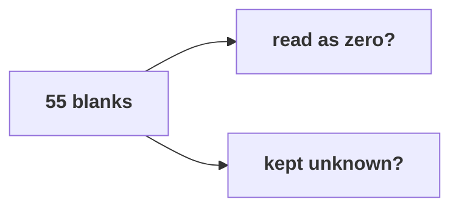
```mermaid
flowchart LR
    D["<b>55 blanks</b>"] --> Z["<b>read as zero?</b>"]
    D --> U["<b>kept unknown?</b>"]
```

**Question.** The average discount with blanks read as zero, against the average over orders that carry one, as a letter? a) the same; b) a few rupees apart; c) about 30 percent lower with zeros; d) higher with zeros.

```notes
LIVE, 2 minutes. This is Tuesday's trap coming back in a new place.
```

---

## S42. Answer: zeros pull it from Rs 67 to Rs 47
*Keep and flag: any discount figure is quoted over the orders that carry one.*

```stats
value: Rs 67 | label: over orders that carry one | note: 131 orders
value: Rs 47 | label: blanks read as zero | note: 186 orders
value: 55 | label: flagged | note: the count beside every figure
```

**What changed.** The answer is c. The field stays blank, the count goes beside the figure, and revenue is untouched.

```notes
LIVE, 3 minutes. Then the day's second spine trap.
```

---

## S43. The plausible wrong answer: failures become zero
*A helper turns anything unreadable into 0, and the first copy wins.*

```python
def to_int(value):
    try:
        return int(value)
    except ValueError:
        return 0              # "so the loop does not crash"
```

```stats
value: 201 of 201 | label: amounts convert | note: the coerced profile
value: 0 | label: rows in the rejects log | note: nothing to explain
value: Rs 1,89,98,210 | label: Q1 after the dedupe | note: rounds to 1.9 crore
```

```notes
LIVE, 3 minutes, notebook 04, section 3. Let the room enjoy it: the loop finishes, the profile is
perfect, and Q1 rounds to the books. Ask who they would now tell the file is clean.
```

---

## S44. Why it is wrong: a zero is a claim
*Once the unreadable copy is worth Rs 0 it passes as valid, and the rule keeps it.*

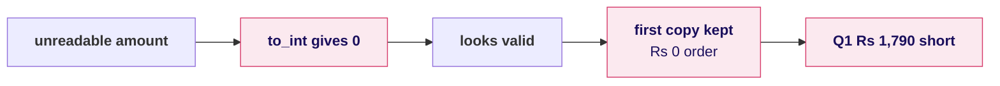
```mermaid
flowchart LR
    A["<b>unreadable amount</b>"] --> Z["<b>to_int gives 0</b>"]
    Z --> V["<b>looks valid</b>"]
    V --> K["<b>first copy kept</b><br/>Rs 0 order"]
    K --> S["<b>Q1 Rs 1,790 short</b>"]
    classDef bad fill:#FBE9EF,stroke:#D63A6A,color:#1A0F5C
    class Z,K,S bad
```

**The check.** Can a Kalpa order be worth nothing? The smallest real order in the export is Rs 680, and the failure count fell from one to zero while nothing was fixed.

```notes
LIVE, 3 minutes. The decision it misleads: a note calling the file clean with an order at Rs 0 in
it, which the analyst finds on her first tie-out.
```

---

## S45. The fix: reject, then repair only from a witness
*The JSON feed repeats the defect; the second extract carried the value.*

```stats
value: 118 of 119 | label: feed amounts agree | note: with the clean file
value: 1 | label: unreadable in the feed | note: a copy of the defect
value: Rs 0 | label: Q1 against the books | note: after reject and the rule
```

**What changed.** The Rs 0 order leaves the clean file, the twin with the value stays, and the profile reports the one failure the export really had.

```notes
LIVE, 3 minutes. Show the invented pair INV-21 too: reading "fourteen" as 14 misses a Rs 1,400
order by Rs 1,386. A word is never an amount.
```

---

## S46. A second route: the profile against the logs
*Aggregate counts and row logs must agree on every defect.*

| Defect | The profile | The logs |
|---|---|---|
| Status missing | 1 | 1 |
| Amount that fails | 0 | 0 |
| Discount missing | 55 | 55 |

**When to switch.** The profile finds defects; the log shows them. Profile the clean file at the end of every pass.

```notes
LIVE, 4 minutes. A defect that slipped past the log would show as a count that disagrees.
```

---

## S47. Kavya's review of chapter 4
*Drop, default, or keep and flag: each is a claim about the business.*

**Kavya's review.** Write the claim beside the decision. And never fill money.

**In the interview.** [S] How do you handle missing data?

```cards
icon: list-checks | eyebrow: Chapter 4 | title: Established | body: Status flagged, discount kept unknown, the unreadable amount rejected and repaired from its twin.
icon: circle-help | eyebrow: Chapter 5 | title: Open | body: The proof for Anand, and whether Tuesday survives. | tone: dark
```

```notes
LIVE, 2 minutes. One breath: measure per field, ask what the absence means, then drop, default or
keep and flag with a reason, sized on what each moves.
```

---

## SECTION 5: The bridge to the books
*From 2.1 to 1.9 move by move, then Tuesday recomputed on the clean file.*

```notes
LIVE. Thirty minutes. Notebook C2_W01_D03_05_bridge is the demonstration.
```

---

## S48. The need: a proof Finance can follow
*Anand wants the proof; Marketing wants to know if the Retail-Plus fall is real.*

```stats
value: Rs 19,98,210 | label: the gap to explain | note: Q1, to the rupee
value: -49.0% | label: Tuesday's Retail-Plus | note: orders per customer
value: -11.0% | label: Tuesday's revenue drop | note: Q1 to Q2
```

**The client asks.** "Which figure is right, and does the Retail-Plus fall still stand?"

```notes
LIVE, 3 minutes. A rescue campaign for Retail-Plus is waiting on the second number.
```

---

## S49. Tesco bridged its gap from GBP 250m to 263m
*In 2014 a retailer's own figure was wrong, and the investigation split it by period.*

```stats
value: GBP 250m | label: first estimate | note: 22 September 2014
value: GBP 263m | label: after investigation | note: 23 October 2014
value: GBP 118m | label: first half alone | note: the rest in earlier years
```

**What breaks.** Supplier income booked early made the reported figure wrong. The fix was a bridge: how much, from which period, for what cause.

```notes
LIVE, 2 minutes. Sources checked 30 Sep 2026: BBC News, 22 September 2014; Tesco interim results
statement, 23 October 2014, which splits GBP 263m into GBP 118m for the first half, about GBP 70m
for 2013/14 and about GBP 75m before.
```

---

## S50. Four ways to prove which figure is right
*Sized on this export.*

| Option | Rows behind it | Closes to the books | Says why |
|---|---|---|---|
| a) Take the books' figure | 0 | no | no |
| b) Difference of the totals | 2 totals | as a total | no |
| c) A bridge by cause | 15 logged rows | to the rupee | yes |
| d) Rebuild from the JSON feed | 119 records | -Rs 1,790 | no |

**The call.** c. What would switch it: a bridge that does not close, and then the gap itself is the finding, perhaps in Finance's books.

```notes
LIVE, 5 minutes. The feed carries the same unreadable amount and holds only 19 of Q2's 86 orders.
```

---

## S51. The bridge from 2.1 to 1.9
*Two moves, each backed by logged rows, land on the books.*

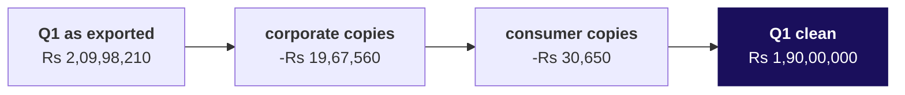
```mermaid
flowchart LR
    E["<b>Q1 as exported</b><br/>Rs 2,09,98,210"] --> C["<b>corporate copies</b><br/>-Rs 19,67,560"]
    C --> K["<b>consumer copies</b><br/>-Rs 30,650"]
    K --> B["<b>Q1 clean</b><br/>Rs 1,90,00,000"]
    classDef bet fill:#1A0F5C,stroke:#1A0F5C,color:#FFFFFF
    class B bet
```

**What changed.** The unreadable amount needs no move: it was never in the exported total, and its twin stayed.

```notes
LIVE, 4 minutes. Predict first: how many moves? Two. Draw the bridge on the board beside the
notebook's chart; the raised axis keeps the Rs 30,650 move visible.
```

---

## S52. Question: does Tuesday's finding survive?
*Retail-Plus orders per customer fell 49 percent on the dirty export.*

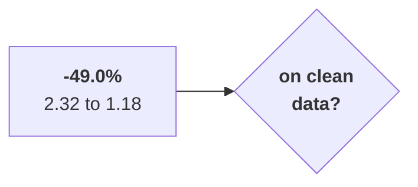
```mermaid
flowchart LR
    T["<b>-49.0%</b><br/>2.32 to 1.18"] --> C{"<b>on clean<br/>data?</b>"}
```

**Question.** On clean data, the Retail-Plus fall, as a letter? a) disappears; b) survives, smaller; c) grows; d) moves to Retail-Core.

```notes
LIVE, 2 minutes. Letters in chat.
```

---

## S53. Answer: it survives, smaller
*-35.0 percent, 1.82 to 1.18, and the revenue drop shrinks from 11.0 to 1.6 percent.*

| Number | As Tuesday reported | On clean data |
|---|---|---|
| Revenue, Q1 to Q2 | -11.0% | -1.6% |
| Retail-Plus orders per customer | 2.32 to 1.18, -49.0% | 1.82 to 1.18, -35.0% |
| Retail-Core orders per customer | -5.3% | -2.7% |

**What changed.** The answer is b. Most copies sat in Retail-Plus in Q1, so Tuesday's Q1 rate was inflated. The smaller number goes first in the note.

```notes
LIVE, 3 minutes. Thursday asks whether -35 percent on 22 members is real or chance.
```

---

## S54. The plausible wrong answer: remove the outlier
*Q2's largest order is 1.66 times the next, so a hurried analyst removes it.*

```stats
value: Rs 1,57,54,540 | label: Q2 without it | note: the hurried figure
value: -17.1% | label: the drop | note: 1.90 crore to 1.58 crore
value: 1.66x | label: the next largest | note: why it looked wrong
```

```notes
LIVE, 3 minutes, notebook 05, section 3. The decision it misleads: Marketing funds a rescue for a
fall that never happened, and Finance rejects the reconciliation because its books hold the order.
```

---

## S55. Why it is wrong: size proves nothing
*A Business order in lakhs is the business doing what it does.*

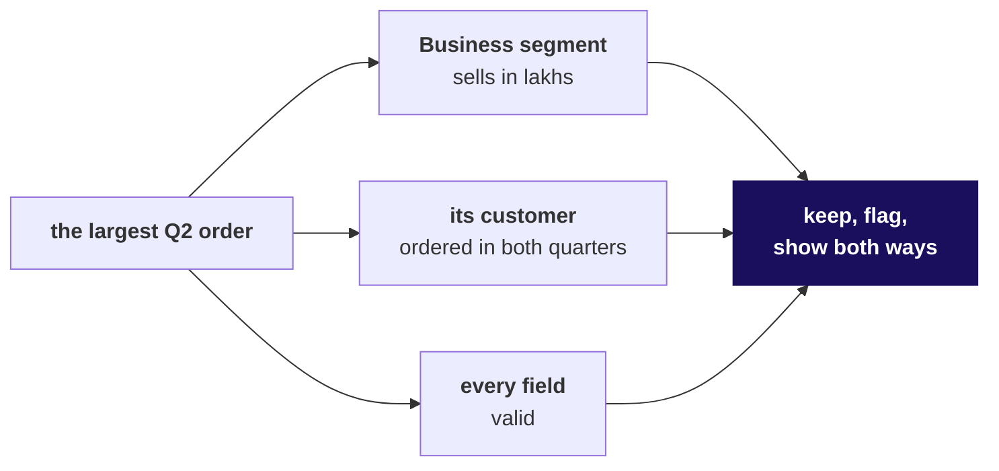
```mermaid
flowchart LR
    B["<b>the largest Q2 order</b>"] --> S["<b>Business segment</b><br/>sells in lakhs"]
    B --> C["<b>its customer</b><br/>ordered in both quarters"]
    B --> F["<b>every field</b><br/>valid"]
    S --> K["<b>keep, flag,<br/>show both ways</b>"]
    C --> K
    F --> K
    classDef bet fill:#1A0F5C,stroke:#1A0F5C,color:#FFFFFF
    class K bet
```

**The check.** Ask whether the record is wrong, never whether it is big. A fence is a cut-off above which values get called outliers; one at three times the median Q2 order flags all 17 Business orders, since the quarter mixes a Rs 2,000 basket with a corporate order.

```notes
LIVE, 3 minutes. The fix: keep it, flag it, show Q2 both ways. Q2 back to Rs 1,87,00,000, the drop
back to 1.6 percent.
```

---

## S56. The fix, the second route, the note
*Keep and flag it: Q2 back to Rs 1,87,00,000 and the drop back to 1.6 percent. Bottom up, the kept orders sum to the bridge's Q1.*

> "Anand, your 1.9 crore is right. The ERP export counted fifteen orders twice, fourteen of them in Q1; copies of two corporate orders carry Rs 19,67,560 of the Rs 19,98,210 difference. Rows and rupees reconcile to your books. On clean data the drop is 1.6 percent against the 11 we reported, and the Retail-Plus fall is 35 percent against 49. It survives, smaller." The GCC data and AI team

```notes
LIVE, 3 minutes. Bottom up is the check anyone can run; top down is the proof, since only the
bridge says what each rupee was. The full note in notebook 05 is under 120 words.
```

---

## S57. Kavya's review of chapter 5
*Two reconciliations, the bridge drawn, and what changed said first.*

**Kavya's review.** Tell me what changed in Tuesday's story, including when it got smaller.

**In the interview.** [S] Finance and your dashboard disagree; what do you do?

```cards
icon: list-checks | eyebrow: Chapter 5 | title: Established | body: Finance's 1.9 crore is right, the bridge closes, Retail-Plus -35.0 percent.
icon: circle-help | eyebrow: Chapter 6 | title: After lunch | body: Can Anand's analyst audit and replay every decision? | tone: dark
```

```notes
LIVE, 2 minutes. One breath: both are correct arithmetic on different inputs; bridge one move per
cause, reconcile rows and rupees, say which is right and recompute what was reported.
```
