# Which Q1 figure is right?

Week 1, Day 3. Half one.

Kicker: WEEK 1  ·  WEDNESDAY  ·  HALF ONE
Quote: Your dashboard says Q1 was Rs 2.1 crore. Our books say 1.9. Until your numbers match ours, Finance will not act on a drop measured from an ERP export.
Who: Anand Iyer, finance controller, Kalpa Retail, replying to all on Tuesday's finding

```notes
LIVE, one minute. Read Anand's reply aloud and leave it on screen. Tuesday's finding went to the
leadership group last night, and this is the first reply. The day is one question climbed in five
rungs: which Q1 figure is right, and can we prove it to an analyst who ties out to the rupee.
Say the shape once: three rounds this block, the full pass alone after lunch, then the auditor.
```

---

## SECTION 1: The ask
*Finance will not act until two numbers agree, and the reconciliation lands on your desk.*

```notes
LIVE. Twenty minutes, no Python. The job of this chapter is to list every way an export could
produce either figure before anybody opens the file, so the room knows what it is looking for.
```

---

## S1. Wednesday morning, one reply to all
*Tuesday's finding reached the leadership group, and Finance answered first.*

```cards
icon: landmark | eyebrow: Finance | title: Anand Iyer | body: The finance controller. His books say Q1 was Rs 1.9 crore, and his analyst audits every number that reaches him. | tone: dark
icon: database | eyebrow: The ERP team | title: The raw exports | body: An orders CSV and the app's JSON feed, with a note that the CSV was stitched from two extracts during the Q1 migration.
icon: megaphone | eyebrow: Marketing | title: The marketing lead | body: Impatient: if the drop is a data problem, a month is lost arguing about it.
```

```stats
value: Rs 2.1 cr | label: the dashboard's Q1 | note: from the ERP export
value: Rs 1.9 cr | label: the books' Q1 | note: what Finance booked
value: Rs 20 lakh | label: the gap | note: about 10 percent of Q1
```

```notes
LIVE, 3 minutes. Kalpa is fictional; the reply is the kind every analyst gets in the first month.
Ask: whose number do you trust before looking at anything? Most say Finance. The honest answer is
neither yet: both are computed correctly from something, and the job is to find what.
```

---

## S2. What Anand will ask, and what the others will ask
*Three people, three questions, one reconciliation that has to answer all of them.*

**The client asks.** "Which figure is right, and how do you know? Can my analyst follow every decision you made?"

| Who | Their question | What answers it |
|---|---|---|
| Anand | Which Q1 figure is right, and the proof | A bridge from 2.1 to 1.9, move by move |
| His analyst | Can every row you removed be followed | A rejects log and a decisions log |
| Marketing | Does Tuesday's finding survive | Tuesday recomputed on the clean file |
| An auditor | Why did you drop any row | Counts that reconcile, with a reason per row |

```notes
LIVE, 3 minutes. A reconciliation has several readers. Separate the four questions now and say
when each gets answered: the first three by the end of this block, the auditor after lunch.
Watch for: learners who want to start coding. Hold them; the next slide is the thinking.
```

---

## S3. Question: what could make an export read high?
*Before the file opens, list every way 2.1 and 1.9 could both be honest arithmetic.*

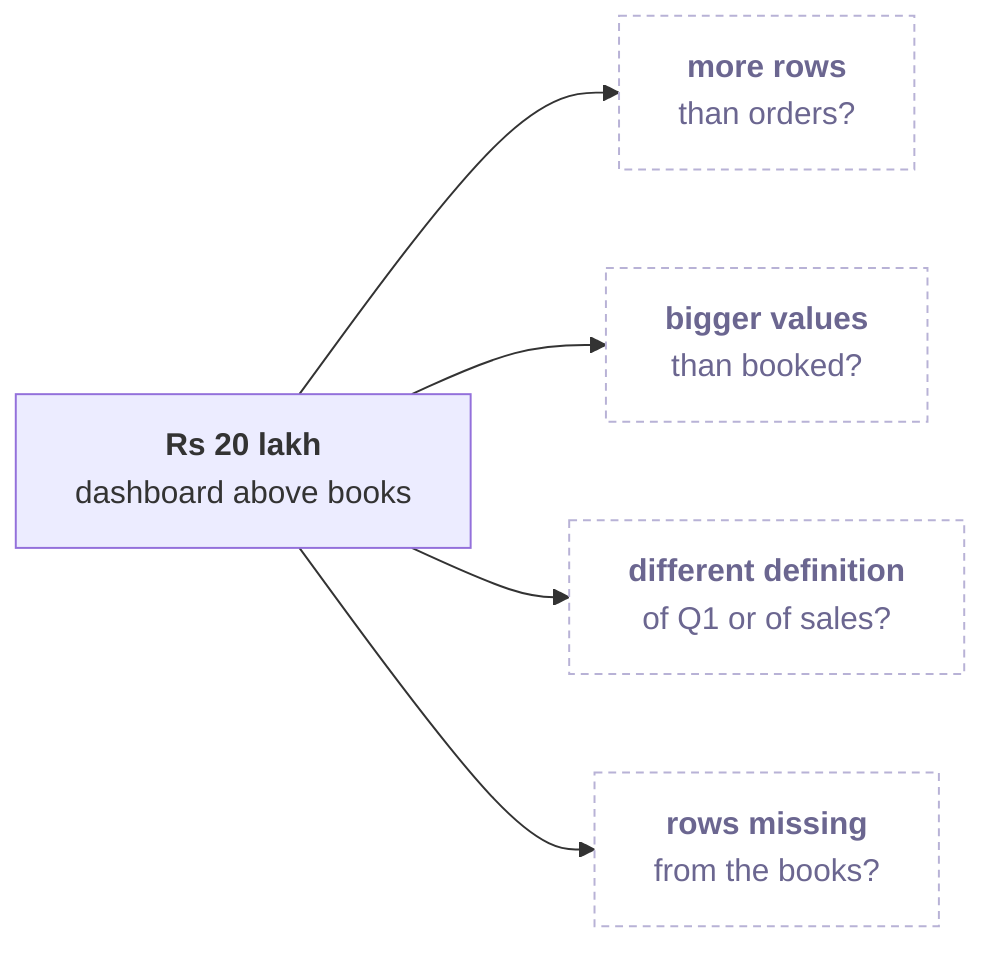
```mermaid
flowchart LR
    G["<b>Rs 20 lakh</b><br/>dashboard above books"] --> U["<b>more rows</b><br/>than orders?"]
    G --> V["<b>bigger values</b><br/>than booked?"]
    G --> D["<b>different definition</b><br/>of Q1 or of sales?"]
    G --> L["<b>rows missing</b><br/>from the books?"]
    classDef unknown fill:#FFFFFF,stroke:#B8B2D6,color:#6B6690,stroke-dasharray:4 3
    class U,V,D,L unknown
```

**Question.** In pairs, three minutes: under each branch, write one way an ERP export could produce it. Which branch would you check first, as a letter? a) more rows than orders; b) bigger values than booked; c) a different definition; d) rows missing from the books.

```notes
LIVE, 5 minutes. Collect a way per branch from the room before the answer slide. Expect
duplicates from a migration, a text amount read as something else, returns counted as sales,
and a date window that differs. The point is the list, not the letter.
```

---

## S4. Answer: rows first, because a count is cheapest
*Every branch is possible; the cheapest check goes first, and a count is the cheapest.*

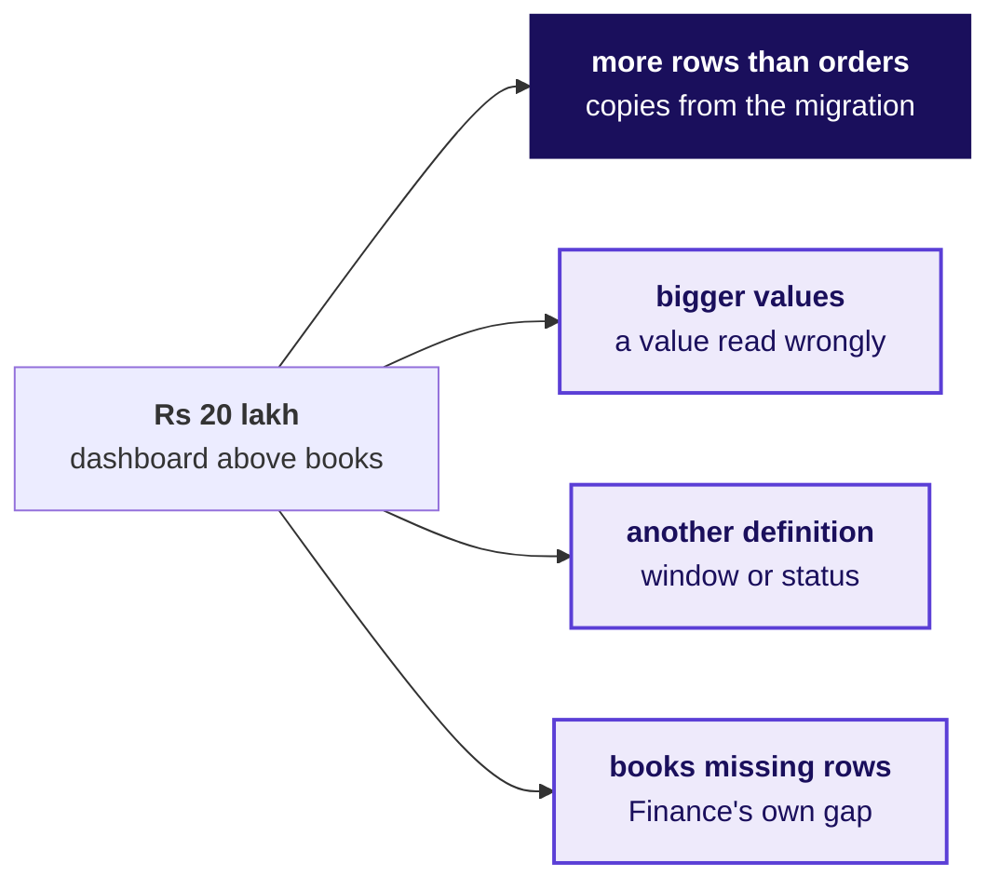
```mermaid
flowchart LR
    G["<b>Rs 20 lakh</b><br/>dashboard above books"] --> U["<b>more rows than orders</b><br/>copies from the migration"]
    G --> V["<b>bigger values</b><br/>a value read wrongly"]
    G --> D["<b>another definition</b><br/>window or status"]
    G --> L["<b>books missing rows</b><br/>Finance's own gap"]
    classDef bet fill:#1A0F5C,stroke:#1A0F5C,color:#FFFFFF
    classDef known fill:#EEEAFB,stroke:#5B3FD6,color:#1A0F5C,stroke-width:2px
    class U bet
    class V,D,L known
```

**Kavya's review.** Rank the checks by cost. Counting rows against distinct orders takes one line and rules a whole branch in or out; start there, and keep the other three on the list.

```notes
LIVE, 2 minutes. The answer is a, for cost rather than likelihood. Say that the ERP note about a
stitched CSV makes branch a more likely too, but the reason to go first is that it is cheap.
Transition: every one of these checks needs the file profiled first.
```

---

## S5. The thinking: profile, decide, reconcile, recompute
*Four moves, drawn on the board before any tool opens.*

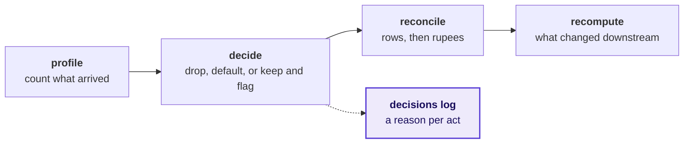
```mermaid
flowchart LR
    P["<b>profile</b><br/>count what arrived"] --> C["<b>decide</b><br/>drop, default, or keep and flag"]
    C --> R["<b>reconcile</b><br/>rows, then rupees"]
    R --> T["<b>recompute</b><br/>what changed downstream"]
    C -.-> L["<b>decisions log</b><br/>a reason per act"]
    classDef known fill:#EEEAFB,stroke:#5B3FD6,color:#1A0F5C,stroke-width:2px
    class L known
```

Every cleaning act is a decision with a written reason. The reconciliation proves the clean file is the same data: input equals clean plus rejected, in rows and in rupees.

```notes
LIVE, 4 minutes. Draw this on the board with the room and leave it up all day. The decisions log
is the dotted arrow: it is written as you go, never reconstructed at the end.
Say: Tuesday skipped the first box, and today we find out what that cost.
```

---

## S6. Five rungs, each a harder question
*The morning climbs three of them in rounds; the afternoon runs all five alone.*

```timeline
label: Rung 1 | title: The profile | body: What did the ERP send: records, complete, convertible, distinct.
label: Rung 2 | title: The copies | body: Do some orders appear more than once, and where.
label: Rung 3 | title: The identity rule | body: What makes two rows one order, and which copy stays.
label: Rung 4 | title: Missing and malformed | body: Keep, drop or flag each defect, with a reason.
label: Rung 5 | title: The bridge | body: From 2.1 to 1.9 in rupees, and Tuesday recomputed. | tone: dark
```

```notes
LIVE, 3 minutes. Round 1 is rung 1, round 2 is rungs 2 and 3, round 3 is rungs 4 and 5. The
escalated case after lunch runs all five alone on the same file.
```

---

## SECTION 2: Round 1, the profile
*Count what arrived before totalling anything, and let no failure turn into a number.*

```notes
LIVE. Fifty minutes: the question and its picture (5), the demonstration (15), the trap (10),
the room's harder variant (15), Kavya's review (5). Notebook 01_profile is the demonstration.
```

---

## S7. First, count what the ERP actually sent
*A profile asks three questions of every field before any total.*

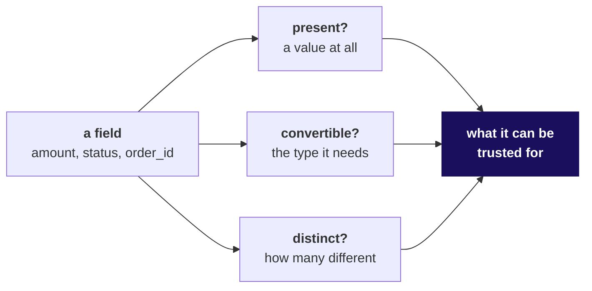
```mermaid
flowchart LR
    F["<b>a field</b><br/>amount, status, order_id"] --> P["<b>present?</b><br/>a value at all"]
    F --> C["<b>convertible?</b><br/>the type it needs"]
    F --> D["<b>distinct?</b><br/>how many different"]
    P --> T["<b>what it can be<br/>trusted for</b>"]
    C --> T
    D --> T
    classDef bet fill:#1A0F5C,stroke:#1A0F5C,color:#FFFFFF
    class T bet
```

**The client asks.** "How many records did you receive, and how many can you use?"

```notes
LIVE, 3 minutes. The three counts per field are the whole of profiling at this level. Ask what
"distinct" tells you about order_id that "present" cannot. Someone will say: whether ids repeat.
```

---

## S8. Everything read from a file is text
*The first amount arrives as the text '2200', and nothing converts it for you.*

```python
with open(DATA / "C2_W01_D03_orders_STUDENT.csv", newline="") as f:
    raw = list(csv.DictReader(f))
len(raw)                  # 201
raw[0]["amount"]          # '2200', a str
```

```stats
value: 201 | label: rows read | note: the orders CSV
value: str | label: every value | note: until converted on purpose
value: 2 min | label: FileNotFoundError | note: the wrong folder, read the last line
```

```notes
LIVE, 8 minutes, notebook 01, section 1. Type open("orders.csv") first and let it fail: two
minutes on the last line, which names the path Python looked in. The exports live in ../data/.
Then run the real read. Ask: what does "900" < "1200" give? False, because text compares by
character. That is why conversion is a decision.
```

---

## S9. The profile, field by field
*Three counts per field; three of them already disagree with the row count.*

| Field | Present | Convertible | Distinct |
|---|---|---|---|
| order_id | 201 | text | 186 |
| customer_id | 201 | text | 69 |
| amount | 201 | 200 | 161 |
| status | 200 | text | 4 |
| discount | 143 | 143 | 5 |

**What breaks.** Three counts do not fit 201: order ids distinct on 186, amounts convertible on 200, status present on 200. Each is a question for a later rung.

```notes
LIVE, 7 minutes, notebook 01, section 2. Read the table row by row. The discount gap is Tuesday's
optional field and is expected. The other three are today's. Do not explain any of them yet.
When the room runs int() over the amounts, the loop stops with a ValueError: two minutes, read
the last line aloud, write the value down, and move on. That is an error, not the lesson.
```

---

## S10. Values present per field
*Two fields fall short of 201, and only one of them was expected.*

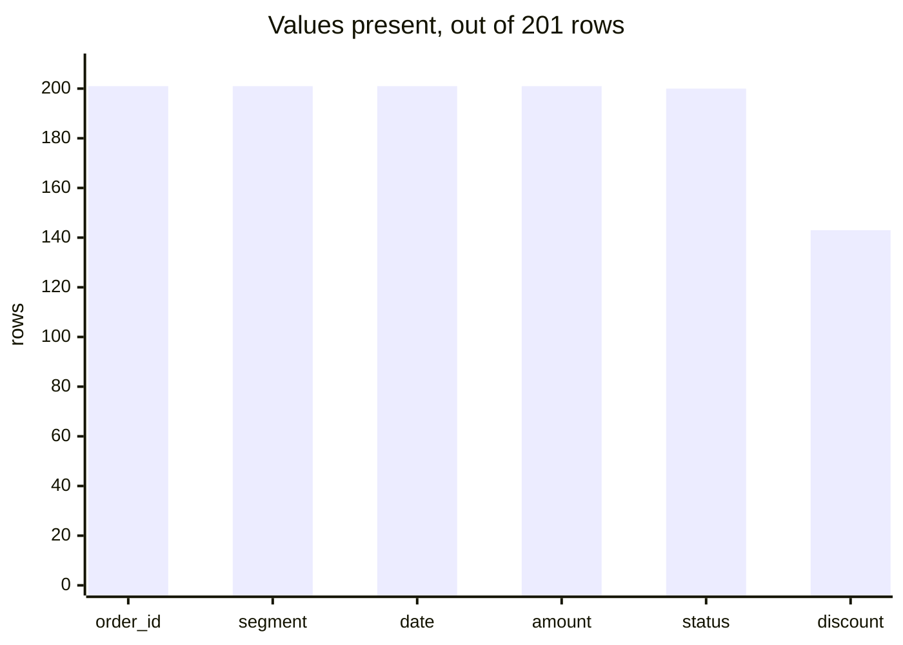
```mermaid
xychart-beta
    title "Values present, out of 201 rows"
    x-axis ["order_id", "segment", "date", "amount", "status", "discount"]
    y-axis "rows" 0 --> 210
    bar [201, 201, 201, 201, 200, 143]
```

```notes
SELF-STUDY, 1 minute. The same counts as a picture. Presence alone hides the two biggest
problems, which is why a profile carries three counts, not one.
```

---

## S11. Question: 201 rows, 186 order ids. So what?
*One count against another, before any total is computed.*

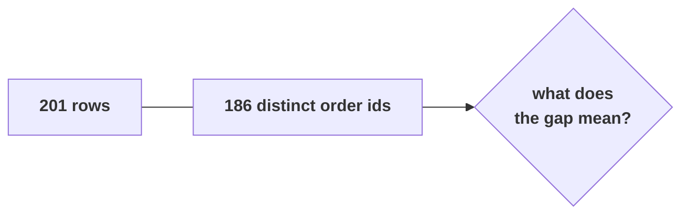
```mermaid
flowchart LR
    R["<b>201 rows</b>"] --- I["<b>186 distinct order ids</b>"]
    I --> Q{"<b>what does<br/>the gap mean?</b>"}
```

**Question.** What do 201 rows and 186 distinct order ids tell you, as a letter? a) 15 orders are missing from the file; b) some orders appear on more than one row; c) 15 rows have no order id; d) nothing until the amounts are converted.

```notes
LIVE, 2 minutes. Letters in chat. Option a is the common slip, reading the gap the wrong way.
```

---

## S12. Answer: some orders sit on more than one row
*Fifteen rows beyond one per order: a lead for Anand's gap, not yet a proof.*

```stats
value: 201 | label: rows | note: every line after the header
value: 186 | label: orders | note: distinct order ids
value: 15 | label: extra rows | note: beyond one per order
```

**Kavya's review.** A gap between rows and keys is where a reconciliation starts. Write it down now; round 2 finds out what it carries in rupees.

```notes
LIVE, 2 minutes. The answer is b. Option c is ruled out by the profile: order_id is present on
all 201. Option d waits for something the count already told us. Transition: before rupees,
the amounts have to convert, and there is a tempting way to make them.
```

---

## S13. The plausible wrong answer: failures become zero
*The ValueError stops the pass, so a helper turns anything unreadable into 0.*

```python
def to_int(value):
    try:
        return int(value)
    except ValueError:
        return 0              # "so the loop does not crash"
```

```stats
value: 201 of 201 | label: amounts convert | note: as the coerced profile reports it
value: Rs 2,09,98,210 | label: Q1 revenue | note: reads as the dashboard's 2.1 crore
value: 0 | label: failures logged | note: nothing anywhere says so
```

```notes
LIVE, 5 minutes, notebook 01, section 3. Run it and let the room enjoy it: the loop finishes,
the profile is perfect, and Q1 matches the dashboard. Ask: who would you now tell that Finance is
wrong? Then turn the slide.
```

---

## S14. Why it is wrong: a zero is a claim
*The coerced file now holds an order worth nothing, and the evidence is gone.*

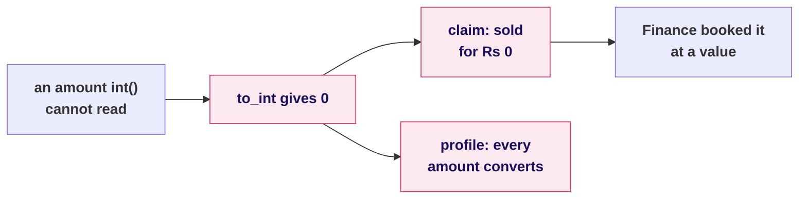
```mermaid
flowchart LR
    A["<b>an amount int()<br/>cannot read</b>"] --> Z["<b>to_int gives 0</b>"]
    Z --> C["<b>claim: sold<br/>for Rs 0</b>"]
    C --> B["<b>Finance booked it<br/>at a value</b>"]
    Z --> P["<b>profile: every<br/>amount converts</b>"]
    classDef bad fill:#FBE9EF,stroke:#D63A6A,color:#1A0F5C
    class Z,C,P bad
```

**The check.** Ask the result a business question: can a Kalpa order be worth nothing? The coerced file holds one order at Rs 0, and the smallest real amount in the export is Rs 400.

```notes
LIVE, 5 minutes. The decision it would have misled: a note telling Anand that every amount
converts and his books are behind. His analyst ties out to the rupee and finds a Rs 0 order in a
file you called clean. The check is a question about the business, not about Python.
```

---

## S15. The fix: convert on purpose, and log the failure
*A conversion returns the number or the reason, and the row is set aside where anyone can read it.*

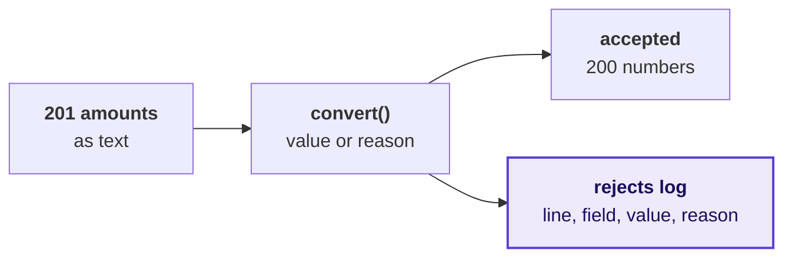
```mermaid
flowchart LR
    T["<b>201 amounts</b><br/>as text"] --> C["<b>convert()</b><br/>value or reason"]
    C --> A["<b>accepted</b><br/>200 numbers"]
    C --> L["<b>rejects log</b><br/>line, field, value, reason"]
    classDef known fill:#EEEAFB,stroke:#5B3FD6,color:#1A0F5C,stroke-width:2px
    class L known
```

**What changed.** The rupees did not move: Q1 over the amounts that convert is still Rs 2,09,98,210. One order moved from "sold for Rs 0" to "amount unreadable, set aside on the line the log names", and the profile now reports one failure instead of none.

```notes
LIVE, 5 minutes. Show the rejects log as a count, then have every learner print it in the empty
your-turn cell and open the CSV at the line it names. Ask: what would you need to know to give
that order its real amount? Leave the question open; round 2 answers it.
```

---

## S16. The room's variant: two more files
*A second source is worth having only once it is profiled too.*

```cards
icon: file-json | eyebrow: The app's feed | title: The JSON feed | body: json.load stops with a JSONDecodeError that names a line and a column. Read it for two minutes, open the file there, then recover the complete records one at a time.
icon: files | eyebrow: The vendor | title: A short copy of the CSV | body: Profile it with the same function before using a row. Which counts do not fit 39 orders in two segments?
icon: scale | eyebrow: The comparison | title: Two formats, one question | body: A CSV writes a missing value as an empty string; JSON leaves the key out. Does your profile count both the same way? | tone: dark
```

```notes
LIVE, 15 minutes, notebook 01, section 4. Pairs. The feed yields 119 complete records, all of
them orders the CSV holds. The vendor copy reads 40 rows, 39 amounts convert, and three
distinct segments where two were expected. Let pairs find why in the empty cell; do not say it.
```

---

## S17. Kavya's review of round 1
*The profile comes first, and a failure is counted next to the successes.*

**Kavya's review.** A conversion that never fails is a conversion that lies. Show me the count of failures next to the count of successes, and the log that names each one.

**In the interview.** [F] Everything read from a CSV is a string; what breaks and where do you convert?

```cards
icon: list-checks | eyebrow: Round 1 | title: Established | body: 201 rows, 186 orders, 200 amounts that convert and 1 in the rejects log.
icon: circle-help | eyebrow: Round 2 | title: Open | body: Why 15 rows beyond one per order, and what they carry in rupees. | tone: dark
```

```notes
LIVE, 5 minutes. The interview answer in one breath: arithmetic, comparison and sorting break or
silently lie on text; convert once at the boundary in one function that returns the value or
the reason; count and log the failures; never default a failure without writing it down.
```

---

## SECTION 3: Round 2, the copies
*Say what makes two rows one order before counting any duplicates.*

```notes
LIVE. Fifty minutes. Notebook 02_duplicates is the demonstration. The trap in this round is
the one most analysts meet in their first month.
```

---

## S18. The extra rows sit in the migration quarter
*If the migration copied rows, the quarter it touched carries the extra rupees.*

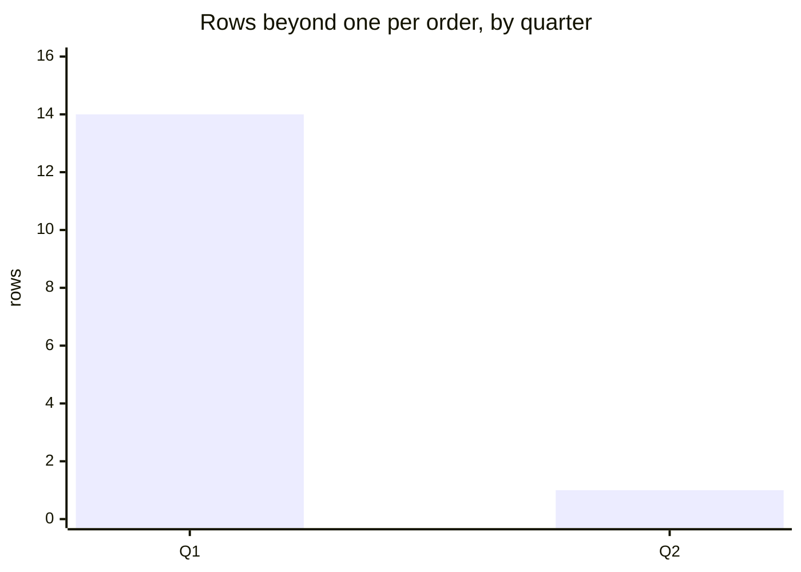
```mermaid
xychart-beta
    title "Rows beyond one per order, by quarter"
    x-axis ["Q1", "Q2"]
    y-axis "rows" 0 --> 16
    bar [14, 1]
```

**The client asks.** "Which Q1 figure is right? My analyst will want to see every row you removed."

```notes
LIVE, 5 minutes, notebook 02, section 1. Q1 holds 114 rows for 100 orders and Q2 holds 87 for
86. Ask: what does that tell you about where Anand's Rs 20 lakh sits? In Q1, the migration's
quarter. A lead, not a proof, until the rows are removed.
```

---

## S19. The plausible wrong answer: zero duplicates
*The rows carry their file line for the rejects log, and a whole-record dedupe finds nothing.*

```python
seen, kept = set(), []
for r in accepted:                       # each r carries r["line"]
    key = tuple(sorted(r.items()))       # the whole record
    if key not in seen:
        seen.add(key); kept.append(r)
len(accepted) - len(kept)                # 0
```

```stats
value: 0 | label: duplicates found | note: the whole-record dedupe
value: Rs 2,09,98,210 | label: Q1 | note: unchanged
value: Rs 20 lakh | label: sent back to Finance | note: as their problem
```

```notes
LIVE, 5 minutes. The dedupe runs clean and reports zero. The decision it would mislead: telling
Anand there are no duplicates and his books are Rs 20 lakh short, which sends Finance hunting for
revenue that was never earned. Ask: which line of round 1 contradicts this result?
```

---

## S20. Why it is wrong: the line makes every row unique
*Two copies of one order sit on different lines, so a whole-record key can never match.*

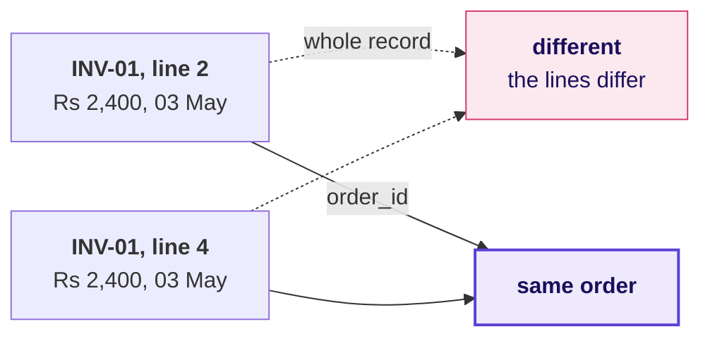
```mermaid
flowchart LR
    A["<b>INV-01, line 2</b><br/>Rs 2,400, 03 May"] -.->|"whole record"| X["<b>different</b><br/>the lines differ"]
    B["<b>INV-01, line 4</b><br/>Rs 2,400, 03 May"] -.-> X
    A -->|"order_id"| S["<b>same order</b>"]
    B --> S
    classDef bad fill:#FBE9EF,stroke:#D63A6A,color:#1A0F5C
    classDef known fill:#EEEAFB,stroke:#5B3FD6,color:#1A0F5C,stroke-width:2px
    class X bad
    class S known
```

**The check.** 201 rows and 186 distinct order ids cannot both hold in a file with zero duplicates. The count from round 1 contradicts the dedupe, so the dedupe compared the wrong thing.

```notes
LIVE, 5 minutes. The records on this slide are invented. The file line is where a row sat, not
what the order is. The same failure appears with a load timestamp or a surrogate key in any
warehouse. Say that once; it comes back in Week 2.
```

---

## S21. The identity rule: say what makes two rows one
*The ERP issues one order_id per order, so order_id is the identity.*

| Candidate key | What it would say | Verdict |
|---|---|---|
| Every field, line included | Nothing is ever a duplicate | Wrong: bookkeeping is not identity |
| Every field, line excluded | Only exact copies match | Misses copies that differ in one field |
| customer_id and date | Two real orders on one day merge | Wrong: loses revenue |
| order_id | One row per order the ERP issued | The identity rule |

```stats
value: 186 | label: orders kept | note: one row per order_id
value: 15 | label: rows set aside | note: each with a reason
```

```notes
LIVE, 5 minutes. Walk the four keys. The third is the dangerous one in retail: a loyal customer
places two orders on the same day. The rule is written in the decisions log before it is run.
```

---

## S22. Question: which copy of a pair stays?
*Three invented pairs, each sharing an order id.*

| Pair | Copy one | Copy two |
|---|---|---|
| INV-11 | Rs 1,800, 02 May, line 12 | Rs 1,800, 02 May, line 90 |
| INV-12 | amount "n/a", 14 May, line 20 | Rs 2,600, 14 May, line 95 |
| INV-13 | Rs 3,100, 21 Aug, line 40 | Rs 3,100, 30 Jul, line 99 |

**Question.** For INV-12, which copy stays, as a letter? a) the first, since the first extract is the original; b) the one whose amount converts; c) both, until Finance decides; d) neither, since the pair disagrees.

```notes
LIVE, 3 minutes. These records are invented. Take letters, then ask the same question for INV-13,
where both copies are valid and disagree on the date.
```

---

## S23. Answer: the copy that validates, and a logged doubt
*Keeping the first copy would keep the one that cannot be summed.*

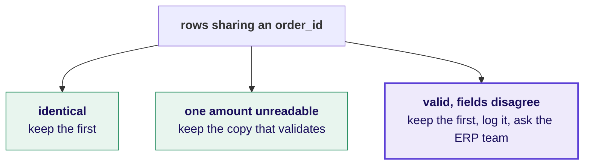
```mermaid
flowchart TB
    K["<b>rows sharing an order_id</b>"] --> I["<b>identical</b><br/>keep the first"]
    K --> U["<b>one amount unreadable</b><br/>keep the copy that validates"]
    K --> D["<b>valid, fields disagree</b><br/>keep the first, log it, ask the ERP team"]
    classDef good fill:#E8F5EE,stroke:#1F8A5B,color:#1A0F5C
    classDef known fill:#EEEAFB,stroke:#5B3FD6,color:#1A0F5C,stroke-width:2px
    class I,U good
    class D known
```

**Kavya's review.** A rule you can say in one sentence, a preference for the copy that validates, and a reason on every row set aside. A doubt the file cannot settle goes to the people who own the source.

```notes
LIVE, 4 minutes. The answer is b. For INV-13, no rule inside the file can say which date is true:
keep the first extract, log the disagreement, and write the question for the ERP team. Then have
every learner run the rule on the real file and print, in the your-turn cell, the rows whose
reason says the copies differ.
```

---

## S24. What changed: Q1 lands on the books
*One row per order takes Q1 from the dashboard's figure to Finance's.*

```stats
value: Rs 2,09,98,210 | label: Q1 as exported | note: amounts that convert
value: Rs 1,90,00,000 | label: Q1, one row per order | note: Anand's 1.9 crore
value: 14 of 15 | label: rows set aside in Q1 | note: the migration's quarter
```

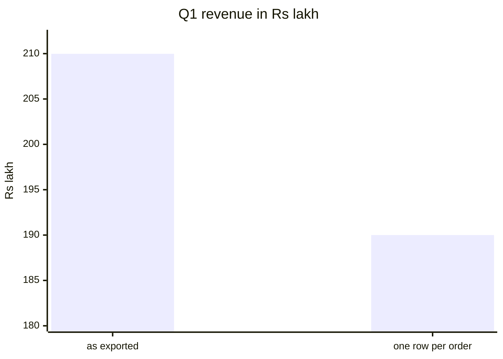
```mermaid
xychart-beta
    title "Q1 revenue in Rs lakh"
    x-axis ["as exported", "one row per order"]
    y-axis "Rs lakh" 180 --> 212
    bar [209.98, 190.00]
```

```notes
LIVE, 4 minutes. The unreadable amount from round 1 turns out to be a copy whose twin carries the
value, so no revenue left with it. Ask: is this the proof Anand asked for? Not yet: it is a
total. The proof is the bridge in round 3.
```

---

## S25. The room's variant: count the rows, weigh the rupees
*Fifteen rows sound like one problem; the rupees say it is two.*

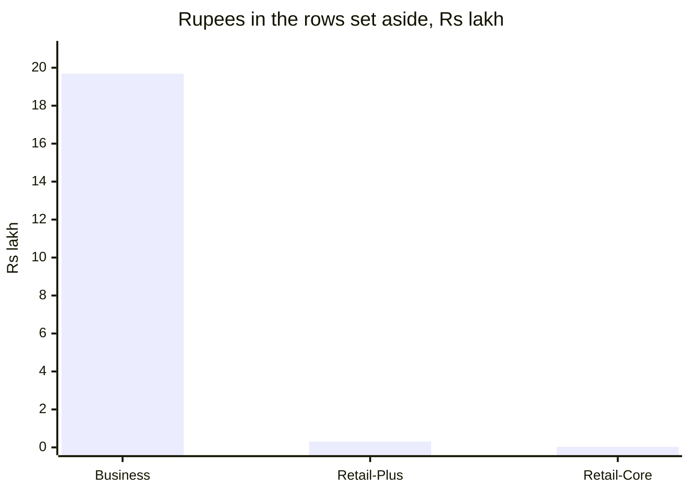
```mermaid
xychart-beta
    title "Rupees in the rows set aside, Rs lakh"
    x-axis ["Business", "Retail-Plus", "Retail-Core"]
    y-axis "Rs lakh" 0 --> 21
    bar [19.68, 0.31, 0.03]
```

**Question for pairs.** Of the Rs 19,98,210 removed from Q1, what share did the Business rows carry, given they are 2 of the 14 rows? Compute it in the notebook, then say which conversation each group of rows belongs to.

```notes
LIVE, 15 minutes, notebook 02, section 4. Two Business rows carry about 98 percent of the
rupees; most of the rows sit in Retail-Plus in Q1. That split decides two conversations: Anand's
gap is two corporate orders counted twice, and Tuesday's Retail-Plus finding was measured on
inflated Q1 counts. Round 3 recomputes it.
```

---

## S26. Kavya's review of round 2
*An identity rule first, a reason per row, and the rupees each group carried.*

**Kavya's review.** Tell me what makes two rows the same order before you tell me how many duplicates there are. A count of duplicates without an identity rule is a count of nothing.

**In the interview.** [F] How do you find duplicates, and what makes two records the same?

```cards
icon: list-checks | eyebrow: Round 2 | title: Established | body: 186 orders by order_id, 15 rows set aside with reasons, Q1 at Rs 1,90,00,000.
icon: circle-help | eyebrow: Round 3 | title: Open | body: Two decisions left, the proof in rupees, and what this does to Tuesday. | tone: dark
```

```notes
LIVE, 4 minutes. One-breath answer: start with the identity rule the business gives you, count
rows against distinct keys, keep one row per key by a stated preference, log every row set
aside, and weigh them in money as well as rows. Then the 10-minute break.
```

---

## SECTION 4: Round 3, the proof
*Keep what is real, reconcile twice, and say what changed downstream.*

```notes
LIVE. Fifty minutes, after the break. Notebook 03_bridge is the demonstration. Two traps in
this round, and the second is the one that costs trust.
```

---

## S27. The proof Anand asked for, in four moves
*Two decisions are still open, and the proof has to satisfy an analyst who ties out to the rupee.*

**The client asks.** "Which figure is right, how do you know, and can my analyst follow every decision? And tell Marketing whether Tuesday's finding survives."

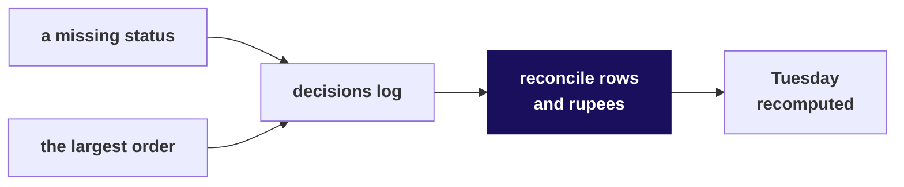
```mermaid
flowchart LR
    M["<b>a missing status</b>"] --> D["<b>decisions log</b>"]
    B["<b>the largest order</b>"] --> D
    D --> R["<b>reconcile rows<br/>and rupees</b>"]
    R --> T["<b>Tuesday<br/>recomputed</b>"]
    classDef bet fill:#1A0F5C,stroke:#1A0F5C,color:#FFFFFF
    class R bet
```

```notes
LIVE, 3 minutes. Say the round's order: one missing value, one large value, the proof, the
recompute. Revenue here is booked value, every order whatever its status, which is how both the
dashboard and the books count a quarter, and how Monday defined booked revenue.
```

---

## S28. Question: one order has no status
*Three decisions are available, and each moves a different number.*

| Decision | Q2 revenue | Q2 delivered orders |
|---|---|---|
| Drop the order | falls by its amount | unchanged |
| Default to delivered | unchanged | one more |
| Keep and flag | unchanged | unchanged |

**Question.** Which decision leaves both numbers honest, as a letter? a) drop the order; b) default the status to delivered; c) keep the order and flag the status as unknown; d) default the status to cancelled.

```notes
LIVE, 3 minutes, notebook 03, section 1. Letters in chat.
```

---

## S29. Answer: keep and flag
*Revenue stays whole, and the order stays out of every count that needs its fate.*

```cards
icon: trash-2 | eyebrow: Drop | title: The order never happened | body: Removes a booked order Finance has in its books.
icon: pencil | eyebrow: Default | title: A fact nobody recorded | body: Adds a delivery, or a cancellation, that the data cannot support.
icon: flag | eyebrow: Keep and flag | title: It happened; its fate is unknown | body: Q2 stays at Rs 1,87,00,000, and one line in the log says which order, which field and why. | tone: dark
```

**Kavya's review.** Every cleaning act is drop, default, or keep and flag, and every one gets a line in the log with its reason.

```notes
LIVE, 2 minutes. The answer is c. Imputation beyond a stated default is out of scope today;
the three-way decision is the whole of it.
```

---

## S30. The plausible wrong answer: the bulk order removed
*One Q2 order sits 1.66 times above the next, and a hurried fence takes it out.*

```stats
value: Rs 1,57,54,540 | label: Q2 without it | note: the hurried figure
value: 17.1% | label: the drop | note: Q1 1.90 crore to Q2 1.58
value: 1.6% | label: the drop with it kept | note: Q1 1.90 crore to Q2 1.87
```

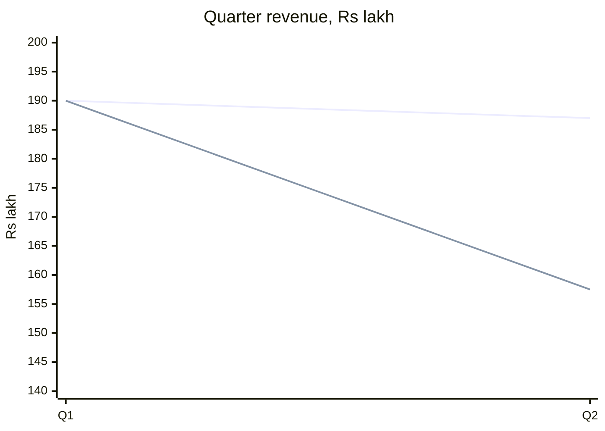
```mermaid
xychart-beta
    title "Quarter revenue, Rs lakh"
    x-axis ["Q1", "Q2"]
    y-axis "Rs lakh" 140 --> 200
    line [190, 187]
    line [190, 157.5]
```

```notes
LIVE, 5 minutes, notebook 03, section 2. The upper line keeps every order; the lower removes the
largest. The decision it would mislead: Marketing funds a rescue for a 17 percent collapse that
never happened, and Finance, whose books hold that order, rejects the whole reconciliation.
```

---

## S31. Why it is wrong: large is not wrong
*Check the record, not its size: a valid id, a known buyer, every field converting.*

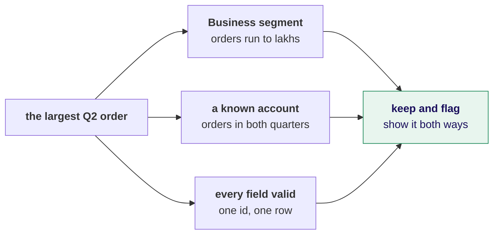
```mermaid
flowchart LR
    O["<b>the largest Q2 order</b>"] --> S["<b>Business segment</b><br/>orders run to lakhs"]
    O --> C["<b>a known account</b><br/>orders in both quarters"]
    O --> F["<b>every field valid</b><br/>one id, one row"]
    S --> K["<b>keep and flag</b><br/>show it both ways"]
    C --> K
    F --> K
    classDef good fill:#E8F5EE,stroke:#1F8A5B,color:#1A0F5C
    class K good
```

**What changed.** Q2 goes back from Rs 1,57,54,540 to Rs 1,87,00,000, and the drop from 17.1 percent to 1.6 percent. The note shows the quarter with and without the order, so nobody has to trust a removal they cannot see.

```notes
LIVE, 5 minutes. Kalpa sells in bulk to corporate buyers; the smallest Business order in the
file is above Rs 2 lakh. Have the room sort Q2 and find the order themselves. Kavya's line: an
outlier is a question about a record, never a reason to delete it.
```

---

## S32. The plausible wrong answer: counts that reconcile
*Remove duplicate ids first, keep the first copy, then convert: the rows tie out perfectly.*

```python
first_copy = keep_first_by_order_id(raw)          # 186 rows
clean = [r for r in first_copy if converts(r)]    # 185 rows
len(raw) == len(clean) + 16                       # True
```

```stats
value: 201 = 185 + 16 | label: rows reconcile | note: input equals clean plus rejected
value: Rs 1,89,98,210 | label: Q1 | note: rounds to Finance's 1.9 crore
value: ship it | label: the hurried verdict | note: "reconciled"
```

```notes
LIVE, 5 minutes, notebook 03, section 3. This is the pass most people would write, in the order
that feels natural. Ask: is this reconciled? Most of the room says yes.
```

---

## S33. Why it is wrong: Rs 1,790 short of the books
*Keeping the first copy kept the unreadable one and set aside the twin that carried the value.*

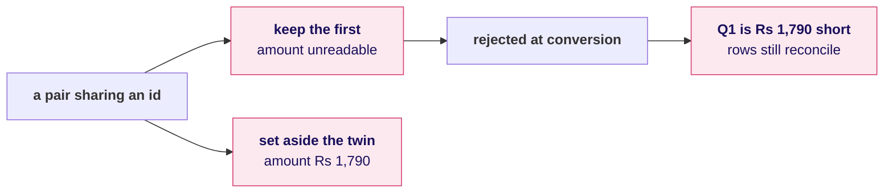
```mermaid
flowchart LR
    P["<b>a pair sharing an id</b>"] --> F["<b>keep the first</b><br/>amount unreadable"]
    P --> T["<b>set aside the twin</b><br/>amount Rs 1,790"]
    F --> R["<b>rejected at conversion</b>"]
    R --> G["<b>Q1 is Rs 1,790 short</b><br/>rows still reconcile"]
    classDef bad fill:#FBE9EF,stroke:#D63A6A,color:#1A0F5C
    class F,T,G bad
```

**The check.** A second reconciliation, in rupees, against the books to the rupee: Rs 1,90,00,000 less Rs 1,89,98,210 is Rs 1,790. A count reconciliation proves no row vanished; it cannot prove the right rows stayed.

```notes
LIVE, 5 minutes. The decision it misleads: a note that says "reconciled with Finance", and an
analyst who finds a booked order missing from it and stops trusting every other line in the log.
Rounded to the crore, the mistake is invisible, which is what makes it dangerous.
```

---

## S34. The fix: convert first, then reconcile twice
*Rows in equal rows kept plus set aside; rupees in less rupees set aside equal the books.*

| Reconciliation | In | Kept | Set aside | Holds |
|---|---|---|---|---|
| Rows, whole file | 201 | 186 | 15 | Yes |
| Rupees, Q1 | Rs 2,09,98,210 | Rs 1,90,00,000 | Rs 19,98,210 | Yes, to the rupee |

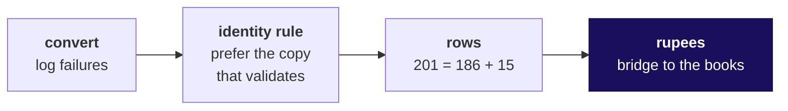
```mermaid
flowchart LR
    C["<b>convert</b><br/>log failures"] --> I["<b>identity rule</b><br/>prefer the copy<br/>that validates"] --> R1["<b>rows</b><br/>201 = 186 + 15"] --> R2["<b>rupees</b><br/>bridge to the books"]
    classDef bet fill:#1A0F5C,stroke:#1A0F5C,color:#FFFFFF
    class R2 bet
```

```notes
LIVE, 4 minutes. Order matters: converting first lets the identity rule see which copy
validates. What changed against the hurried pass: one Retail-Plus order and its Rs 1,790 are
back, and both reconciliations hold.
```

---

## S35. The bridge from 2.1 to 1.9
*Two moves take the exported Q1 to the books, and each move is backed by the rows that carry it.*

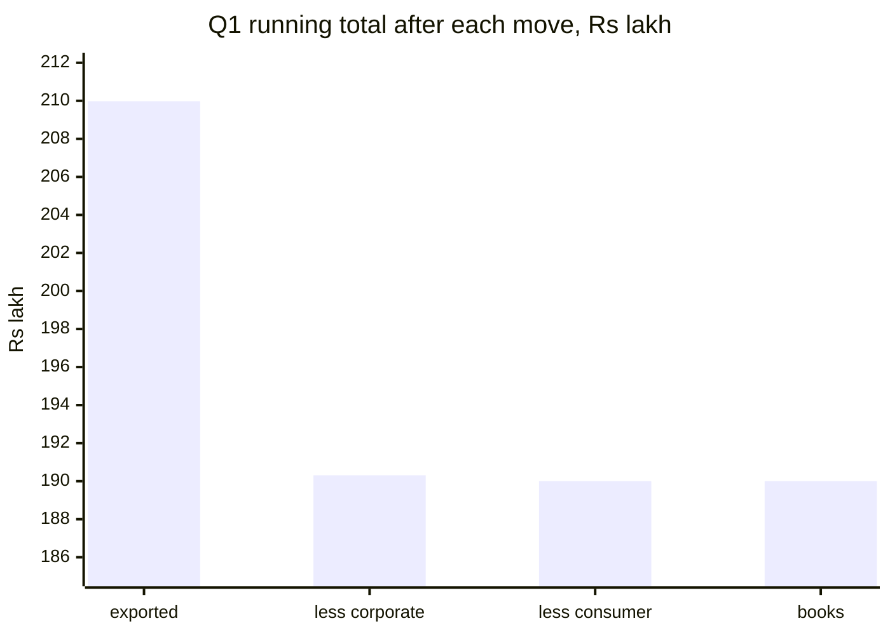
```mermaid
xychart-beta
    title "Q1 running total after each move, Rs lakh"
    x-axis ["exported", "less corporate", "less consumer", "books"]
    y-axis "Rs lakh" 185 --> 212
    bar [209.98, 190.31, 190.00, 190.00]
```

**The moves.** Rs 2,09,98,210 as exported, less Rs 19,67,560 in copies of two corporate orders, less Rs 30,650 in copies of consumer orders, lands on Rs 1,90,00,000, the books to the rupee.

```notes
LIVE, 6 minutes. The notebook draws this as a bridge with kit.bridge; the slide shows the running
total after each move. The unreadable amount needs no move: it was never in the exported total,
and its twin, which was, stayed. This is the page Anand's analyst checks first.
```

---

## S36. Question: does Tuesday's finding survive?
*Tuesday reported an 11 percent fall and a 49 percent drop in Retail-Plus frequency.*

| Measure | As Tuesday reported | On clean data |
|---|---|---|
| Revenue, Q1 to Q2 | -11.0% | ? |
| Retail-Plus orders per customer | 2.32 to 1.18, -49.0% | ? |

**Question.** On clean data, what happens to the Retail-Plus finding, as a letter? a) it disappears, since the copies caused it; b) it survives, smaller; c) it grows, since clean data sharpens it; d) it moves to Retail-Core.

```notes
LIVE, 3 minutes, notebook 03, section 4. Pairs compute it before the answer slide.
```

---

## S37. Answer: it survives, smaller
*Most of the copies sat in Retail-Plus in Q1, so the fall was overstated rather than invented.*

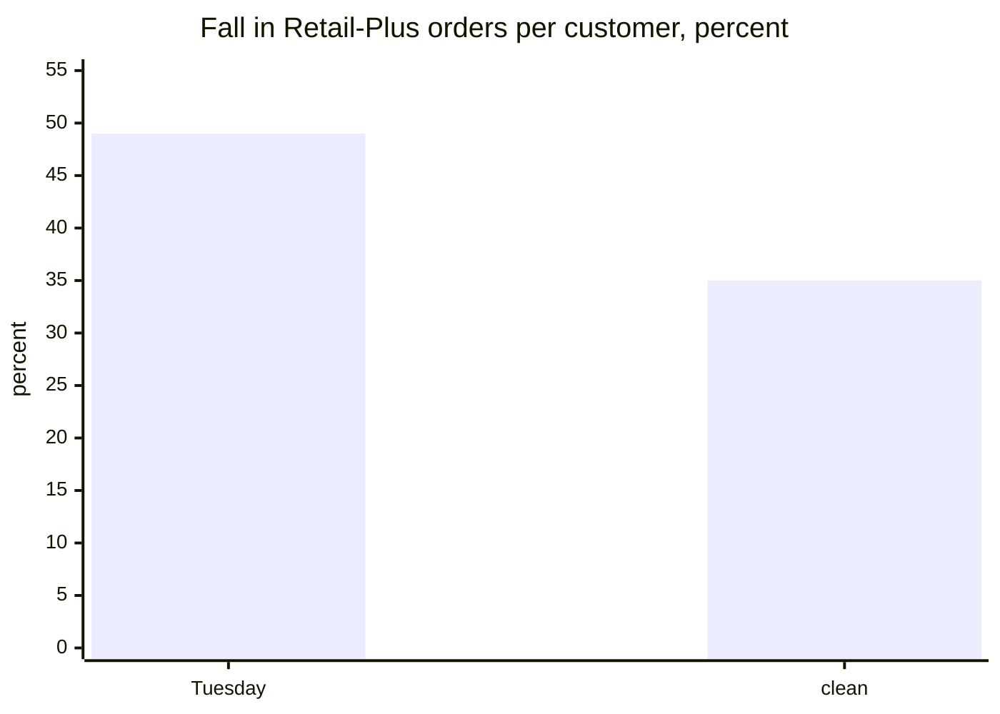
```mermaid
xychart-beta
    title "Fall in Retail-Plus orders per customer, percent"
    x-axis ["Tuesday", "clean"]
    y-axis "percent" 0 --> 55
    bar [49.0, 35.0]
```

**What changed.** Revenue falls 1.6 percent from Q1 to Q2, not 11.0; Retail-Plus orders per customer fall from 1.82 to 1.18, 35.0 percent, not 49.0.

```notes
LIVE, 5 minutes. The answer is b. Say the honest sentence: the finding stands and is smaller than
we first reported. Report the smaller numbers first. A finding that shrank and was reported
honestly is worth more to Marketing than one that was never checked. Thursday asks whether a
35 percent fall on 22 members is real or noise.
```

---

## S38. The note to Finance
*Numbers first, under 120 words, and the finding that shrank.*

> "Anand, your 1.9 crore is right. The ERP export counted fifteen rows twice, fourteen of them in Q1; copies of two corporate orders carry Rs 19,67,560 of the Rs 19,98,210 difference. Rows and rupees both reconcile to your books exactly, and every row set aside is in the attached log. We kept and flagged one Q2 order with no status and the largest Q2 order, a real Business account. On clean data the drop is 1.6 percent, not 11, and the Retail-Plus frequency fall is 35 percent, not 49." The GCC data and AI team

```notes
LIVE, 4 minutes. Read it aloud and count the words with the room. It leads with which figure is
right, then the proof, then the flags, then what changed downstream.
```

---

## S39. Kavya's review of round 3
*Two reconciliations, a reason for every act, and the smaller number reported first.*

**Kavya's review.** Two reconciliations, not one: the rows and the rupees. Input equals clean plus rejected, in both. Then tell me what changed in Tuesday's story, including if it got smaller.

**In the interview.** [S] Finance and your dashboard disagree; what do you do?

```mermaid
flowchart LR
    P["<b>profile</b>"] --> C["<b>convert,<br/>log failures</b>"] --> I["<b>identity rule</b>"] --> K["<b>keep, drop<br/>or flag</b>"] --> R["<b>reconcile<br/>rows and rupees</b>"] --> T["<b>recompute</b>"]
    classDef bet fill:#1A0F5C,stroke:#1A0F5C,color:#FFFFFF
    class R bet
```

```notes
LIVE, 4 minutes. One-breath answer: assume both numbers are honest arithmetic on different
inputs, get Finance's figure to the rupee with its definition, profile the source, build a bridge
with one move per cause backed by rows, reconcile in rows and rupees, then say which is right,
fix the source and recompute what was reported. Transition to lunch: after it, the full pass alone.
```

---

## D40. Depth: why reconcile in both units
*Each reconciliation catches what the other cannot.*

| Pass | Rows reconcile | Rupees reconcile | What it hides |
|---|---|---|---|
| Keep the first copy, then convert | Yes | No, Rs 1,790 short | A booked order swapped for an unreadable one |
| Swap one kept order for another of equal value | No | Yes | The wrong order in the clean file |
| Convert, prefer the valid copy | Yes | Yes | Nothing the two checks can see |

```notes
SELF-STUDY, 3 minutes. Finance teams reconcile control totals in counts and in money for exactly
this reason. The second row is a thought experiment, not something in today's file.
```
