# Which Q1 figure is right?

Week 1, Day 3. Half one.

Kicker: WEEK 1  ·  WEDNESDAY  ·  HALF ONE
Quote: Your dashboard says Q1 was Rs 2.1 crore. Our books say 1.9. Until your numbers match ours, Finance will not act on a drop measured from an ERP export.
Who: Anand Iyer, finance controller, Kalpa Retail, replying to all on Tuesday's finding

```notes
LIVE, one minute. Read Anand's reply aloud and leave it on screen. Tuesday's finding went to the
leadership group last night, and this is the first reply. The ERP is the enterprise resource
planning system Finance books orders in. The day asks one question and climbs it in six chapters:
which Q1 figure is right, and how do we prove it to an analyst who ties out, matching every figure
to the books line by line? Five chapters this block and the sixth after lunch. Then the ladder.
```

---

## S1. Six chapters, each asking what the last answer raised
*Which Q1 figure is right, the dashboard's Rs 2.1 crore or the books' Rs 1.9 crore, and how do we know?*

```timeline
label: Chapter 1 | title: What did the ERP send? | body: And does Rs 2.1 crore follow from it?
label: Chapter 2 | title: Which rows repeat? | body: What makes two rows one order?
label: Chapter 3 | title: Which copy stays? | body: And does Q1 land on the books?
label: Chapter 4 | title: Drop, fill or flag? | body: A value missing or unreadable
label: Chapter 5 | title: Can we prove the 1.9? | body: And does Tuesday survive?
label: Chapter 6 | title: Can the analyst replay it? | body: Every decision, from the log | tone: dark
```

```notes
LIVE, 2 minutes. Read the day's question, then the six chapter questions in order: each is the
question the answer before it raises, and each chapter closes on its own answer with a number.
Chapter 6 runs after lunch. Leave the question up while you set the scene. Then the reply to all.
```

---

## S2. Finance's books sit Rs 20 lakh below the dashboard
*Who is asking, and how far apart are the two figures?*

```cards
icon: landmark | eyebrow: Finance | title: Anand Iyer | body: The finance controller. His books say Rs 1.9 crore, and his analyst ties out every number: she matches it to the books, line by line. | tone: dark
icon: database | eyebrow: The ERP team | title: The raw exports | body: The ERP is the enterprise resource planning system Finance books orders in. Its team sent a CSV stitched from two extracts, two pulls of rows, during Q1's migration to a new system, and the app's JSON feed.
icon: megaphone | eyebrow: Marketing | title: The marketing lead | body: Impatient: if the drop is a data problem, a month is lost arguing about it.
```

```stats
value: Rs 2.1 cr | label: the dashboard's Q1 | note: from the ERP export
value: Rs 1.9 cr | label: the books' Q1 | note: what Finance booked
value: Rs 20 lakh | label: the gap | note: about 10 percent of Q1
```

```notes
LIVE, 3 minutes. Revenue here is booked value in rupees: every order at the price charged, whatever
its status, which is how both of Anand's figures count it. A migration is the move of the order data
from one system to another, and an extract is one pull of rows out of the ERP. Ask: whose number do
you trust before looking at anything? Most say Finance. The honest answer is neither yet: both are
computed correctly from something, and the job is to find what. Then the four readers.
```

---

## S3. Four readers need four answers from one reconciliation
*Who reads the reconciliation, and what does each need from it?*

**The client asks.** "Which figure is right, and how do you know? Can my analyst follow every decision you made?"

| Who | Their question | What answers it |
|---|---|---|
| Anand | Which Q1 figure is right, and the proof | A bridge from 2.1 to 1.9, move by move |
| His analyst | Can every row you removed be followed | The logs, and control totals: rows and rupees counted at both ends |
| Marketing | Does Tuesday's finding survive | Tuesday recomputed on the clean file |
| An auditor | Why did you drop any row | Rows that tie, with a reason per row |

```notes
LIVE, 3 minutes. Say when each gets answered: Anand's and Marketing's by the end of this block, the
analyst's and the auditor's after lunch. Watch for learners who want to start coding and hold them,
since the thinking comes first. Then the question on the next slide.
```

---

## S4. Question: which branch would you check first?
*Where could Rs 20 lakh between two honest figures come from?*

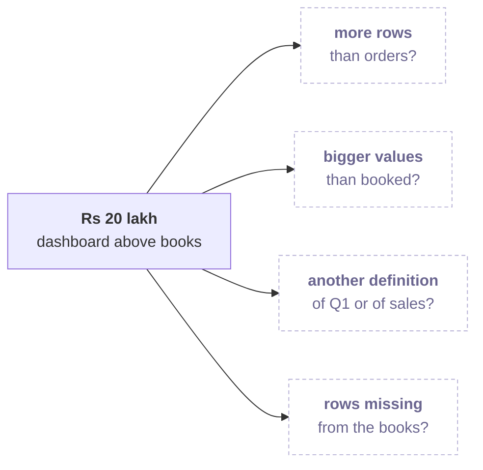
```mermaid
flowchart LR
    G["<b>Rs 20 lakh</b><br/>dashboard above books"] --> U["<b>more rows</b><br/>than orders?"]
    G --> V["<b>bigger values</b><br/>than booked?"]
    G --> D["<b>another definition</b><br/>of Q1 or of sales?"]
    G --> L["<b>rows missing</b><br/>from the books?"]
    classDef unknown fill:#FFFFFF,stroke:#B8B2D6,color:#6B6690,stroke-dasharray:4 3
    class U,V,D,L unknown
```

**Question.** Which branch would you check first, as a letter? a) more rows than orders; b) bigger values than booked; c) another definition; d) rows missing from the books.

```notes
LIVE, 4 minutes. Pairs, three minutes: one way per branch that an ERP export could produce it.
Expect copies from a migration, a text amount read wrongly, returns counted as sales, a window that
differs. The point is the list; the letter comes next. Then the answer.
```

---

## S5. Answer: rows first, because a count is cheapest
*Where could Rs 20 lakh between two honest figures come from?*

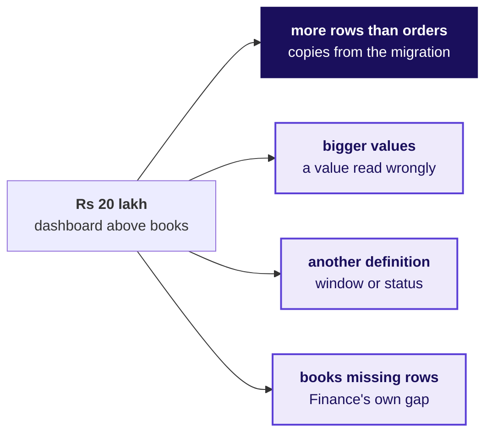
```mermaid
flowchart LR
    G["<b>Rs 20 lakh</b><br/>dashboard above books"] --> U["<b>more rows than orders</b><br/>copies from the migration"]
    G --> V["<b>bigger values</b><br/>a value read wrongly"]
    G --> D["<b>another definition</b><br/>window or status"]
    G --> L["<b>books missing rows</b><br/>Finance's own gap"]
    classDef bet fill:#1A0F5C,stroke:#1A0F5C,color:#FFFFFF
    classDef known fill:#EEEAFB,stroke:#5B3FD6,color:#1A0F5C,stroke-width:2px
    class U bet
    class V,D,L known
```

**The call.** Rank the checks by cost. Rows against distinct orders takes one line and rules a whole branch in or out, so start there and keep the other three on the list.

```notes
LIVE, 3 minutes. The answer is a, chosen for cost more than likelihood, though the ERP note about a
stitched CSV makes it likelier too. Then the four moves of the day.
```

---

## S6. Profile, decide, reconcile, recompute, with a log
*What four moves turn two figures into one we can prove?*

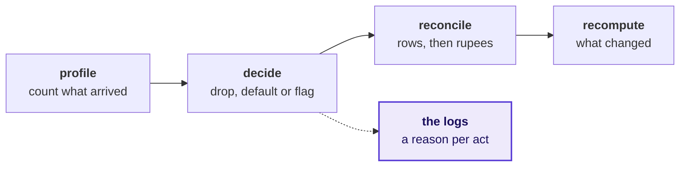
```mermaid
flowchart LR
    P["<b>profile</b><br/>count what arrived"] --> C["<b>decide</b><br/>drop, default or flag"]
    C --> R["<b>reconcile</b><br/>rows, then rupees"]
    R --> T["<b>recompute</b><br/>what changed"]
    C -.-> L["<b>the logs</b><br/>a reason per act"]
    classDef known fill:#EEEAFB,stroke:#5B3FD6,color:#1A0F5C,stroke-width:2px
    class L known
```

Every cleaning act is a decision with a written reason. The reconciliation proves the clean file is the same data: input equals clean plus set aside, in rows and in rupees.

```notes
LIVE, 4 minutes. Draw this with the room and leave it up all day. The dotted arrow is the log,
written as you go and never reconstructed at the end. Tuesday skipped the first box. Then chapter 1.
```

---

## SECTION 1: What did the ERP send?
*What did the ERP actually send, and does the dashboard's Rs 2.1 crore follow from it?*

```notes
LIVE. Thirty minutes. Notebook C2_W01_D03_01_profile is the demonstration, and its six numbered
sections are the six questions on the next slide.
```

---

## S7. Answering it for Anand: six questions on the way
*Who needs this answer, and which questions lead to it?*

**Who needs the answer.** Anand Iyer decides whether Finance acts on Tuesday's drop at all, and his analyst ties out every figure tonight. A wrong count here costs the most of the day, since every later number stands on it.

```timeline
label: 1 | title: Which way, at what cost? | body: Four ways to learn what arrived
label: 2 | title: What does the file hold? | body: Field by field, three counts
label: 3 | title: Which order is largest? | body: The sort an audit starts from
label: 4 | title: Does 2.1 crore follow? | body: Q1 over what converts
label: 5 | title: What can the feed tell? | body: The app's copy of the orders
label: 6 | title: Do other methods agree? | body: The same counts, other code | tone: dark
```

```notes
LIVE, 1 minute. Read the six questions. Each gets its answer before the next is asked, and the
chapter's last slide answers all six in a line each. Then the need.
```

---

## S8. Anand needs Q1 to the rupee before Finance acts
*What does Anand need before he acts, and what does a wrong count cost?*

```stats
value: Q1 revenue | label: the metric | note: booked value: every order at its price, whatever its status
value: Anand | label: who asks | note: finance controller
value: a month | label: a wrong number costs | note: Marketing waits, Finance distrusts
```

**The client asks.** "How many records did you receive, and how many can you use?"

```notes
LIVE, 2 minutes. The cost of a wrong answer here is the largest of the day, because every later
chapter is built on this count. If the note says the dashboard is right and it is not, the analyst
finds it and discounts every later number the team sends. Then a retailer that skipped this step.
```

---

## S9. Target Canada's new system ran on bad data
*Has a real retailer paid for data nobody counted before trusting it?*

```stats
value: 133 | label: stores to close | note: announced January 2015, CBC News
value: ~$1 bn | label: first-year loss | note: CBC News
value: ~30% | label: product data accurate | note: Salsify, citing Canadian Business
```

**What breaks.** Target Canada launched in March 2013 on a new system loaded in a hurry. Data loaded during a system change is the kind that needs counting before anyone trusts it, and Kalpa's ERP export was stitched during a migration.

```notes
LIVE, 2 minutes. Sources checked 30 Sep 2026: CBC News, 15 January 2015; Salsify's summary of Joe
Castaldo's Canadian Business investigation for the 30 percent figure, against 98 to 99 percent in the
US. Say "about" and name the source aloud, since the 30 percent is a secondary summary. Then the
options.
```

---

## S10. Profile every field: 2,010 values in under a second
*How could we learn what arrived, and what would each way cost on 201 rows?*

| Option | What it reads | Time | What it catches |
|---|---|---|---|
| a) Total and compare | 201 amounts | under a second | stops on an unreadable amount |
| b) Scroll it | 2,010 cells by eye | about 17 minutes | misses repeats far apart |
| c) Sample 20 rows | 20 rows | about 10 minutes | the 20 it reads, nothing of the other 181 |
| d) Profile every field | 2,010 values by code | under a second | every count that does not fit |

**The call.** d, then sample only where the profile points. What would switch it: a profile too slow for the deadline; then profile order_id and amount first.

```notes
LIVE, 4 minutes. The minutes for b and c are an illustrative half-second a cell and half a minute a
row. A sample reads the rows it draws and says nothing about the rest; on a file of crores of rows
due in an hour, even the profile can be too slow, and then the key and the money fields go first.
Then the picture of a profile.
```

---

## S11. A profile asks every field three questions
*What does a profile ask of each field before any total?*

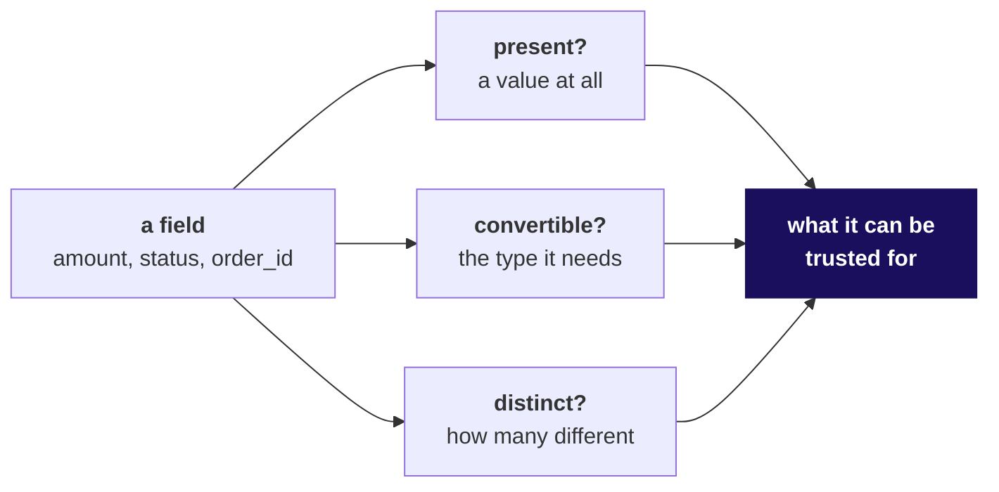
```mermaid
flowchart LR
    F["<b>a field</b><br/>amount, status, order_id"] --> P["<b>present?</b><br/>a value at all"]
    F --> C["<b>convertible?</b><br/>the type it needs"]
    F --> D["<b>distinct?</b><br/>how many different"]
    P --> T["<b>what it can be<br/>trusted for</b>"]
    C --> T
    D --> T
    classDef bet fill:#1A0F5C,stroke:#1A0F5C,color:#FFFFFF
    class T bet
```

```notes
LIVE, 1 minute. Ask what "distinct" says about order_id that "present" cannot: whether ids repeat.
Then open notebook 01. When open("orders.csv") fails with FileNotFoundError, give it two minutes on
the last line, which names the folder Python looked in; the exports live in ../data/. Then predict.
```

---

## S12. Question: which field falls furthest short of 201?
*What does the file hold, field by field?*

```python
raw = read_orders()        # 201 rows, each value as the file wrote it
raw[0]["amount"]           # '2200': text, until converted on purpose
prof = profile(raw)        # present, convertible, distinct per field
```

**Question.** Which field shows the biggest gap between present and the 201 rows, as a letter? a) amount; b) discount; c) order_id; d) none, since an ERP export is complete.

```notes
LIVE, 2 minutes. Letters in chat before the notebook cell runs. Point at the second line: every
value a CSV gives back is text, so every sum, sort and comparison depends on a conversion somebody
chose. Then the answer.
```

---

## S13. Answer: discount, and three smaller gaps matter more
*What does the file hold, field by field?*

| Field | Present | Convertible | Distinct |
|---|---|---|---|
| order_id | 201 | text | 186 |
| amount | 201 | 200 | 161 |
| status | 200 | text | 3 |
| discount | 143 | 143 | 4 |

**The check.** Three counts do not fit 201 rows: order ids distinct on 186, amounts convertible on 200, status present on 200. Discount on 143 is Tuesday's optional field and expected.

```notes
LIVE, 2 minutes. The answer is b. Do not explain the other three yet; name the chapter that answers
each: order_id in chapters 2 and 3, amount and status in chapter 4. Then the sort an audit starts
from.
```

---

## S14. The plausible wrong answer: Rs 970 on top
*Which Q2 order does a hurried sort put on top?*

```python
q2 = [r for r in raw if r["quarter"] == "Q2"]
top = sorted(q2, key=lambda r: r["amount"], reverse=True)[:3]
[r["amount"] for r in top]      # ['970', '970', '952000']
```

```stats
value: Rs 970 | label: the largest Q2 order | note: as the hurried sort reports it
value: 0 | label: orders above Rs 10 lakh | note: in the three sent
```

```notes
LIVE, 2 minutes, notebook 01, section 3. Anand's analyst audits the largest orders first, since one
of them can carry more money than a hundred small ones. Run it and ask what she would tie out
tonight: three small orders. The decision it misleads is an audit that passes on the part of the
file that carries the least money. Then why.
```

---

## S15. Why it is wrong: text sorts by spelling
*Why does the text sort put Rs 970 above Rs 29 lakh?*

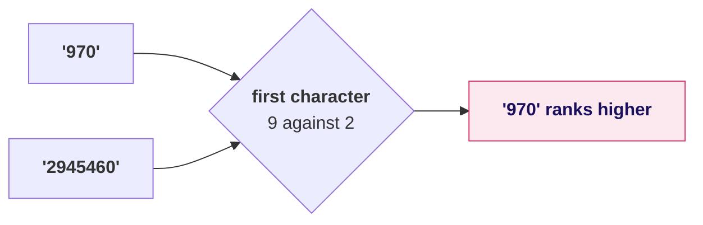
```mermaid
flowchart LR
    A["<b>'970'</b>"] --> C{"<b>first character</b><br/>9 against 2"}
    B["<b>'2945460'</b>"] --> C
    C --> W["<b>'970' ranks higher</b>"]
    classDef bad fill:#FBE9EF,stroke:#D63A6A,color:#1A0F5C
    class W bad
```

**The check.** Can the largest Q2 order be smaller than every Business order, when Kalpa's Business segment sells to companies in lakhs? The smallest Business order is Rs 2,03,060.

```notes
LIVE, 2 minutes. The check is a business question, which is the habit to build: a number that
contradicts what the business does is wrong before any code is read. Then the fix.
```

---

## S16. The fix: converted, Rs 29,45,460 tops Q2
*Which Q2 order is the largest?*

```stats
value: Rs 29,45,460 | label: the largest Q2 order | note: sorted as a number
value: Rs 62,11,460 | label: the top three | note: against Rs 9,53,940 as text
```

**What changed.** Converted once, at the door, the sort puts the quarter's money first, and the analyst's audit starts on the orders that carry it. Chapter 5 comes back to the Rs 29 lakh order.

```notes
LIVE, 2 minutes. Convert before any sort, max or comparison on an amount. The same conversion that
fixes the sort also has to say what it does with an amount that will not convert, which is the next
question. Then predict Q1.
```

---

## S17. Question: what is Q1 over the amounts that convert?
*Does the dashboard's Rs 2.1 crore follow from this file?*

```python
accepted, rejects = [], []
for r in raw:
    value, reason = convert(r["amount"])     # rupees, or why it failed
    if value is None:
        rejects.append({"line": r["line"], "reason": reason})
    else:
        accepted.append(dict(r, amount=value))
```

**Question.** Q1 over the amounts that convert, as a letter? a) Rs 1,90,00,000, the books; b) Rs 2,09,98,210; c) zero, since one failure stops the total; d) somewhere between the two figures.

```notes
LIVE, 2 minutes. First the your-turn cell: the room runs int() over every amount and meets the
ValueError. Two minutes: read the last line, write the value down, and move on; it is an error met
on the way, and the lesson is this cell. Letters in chat, then the answer.
```

---

## S18. Answer: Rs 2,09,98,210, the dashboard's 2.1 crore
*Does the dashboard's Rs 2.1 crore follow from this file?*

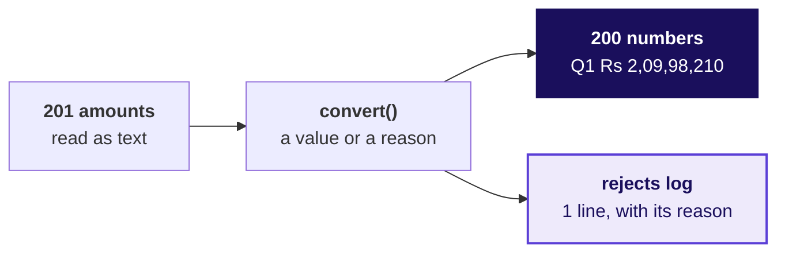
```mermaid
flowchart LR
    A["<b>201 amounts</b><br/>read as text"] --> C["<b>convert()</b><br/>a value or a reason"]
    C --> N["<b>200 numbers</b><br/>Q1 Rs 2,09,98,210"]
    C --> R["<b>rejects log</b><br/>1 line, with its reason"]
    classDef bet fill:#1A0F5C,stroke:#1A0F5C,color:#FFFFFF
    classDef known fill:#EEEAFB,stroke:#5B3FD6,color:#1A0F5C,stroke-width:2px
    class N bet
    class R known
```

**The check.** Accepted plus rejected is every row, 200 + 1 = 201. The gap to the books, Rs 19,98,210, is a hundred times any one Retail order, so one unreadable amount cannot explain it; the 15 rows beyond one per order can.

```notes
LIVE, 2 minutes. The answer is b. The dashboard's 2.1 crore is honest arithmetic on this file, so
both of Anand's figures are honest: the question is what the extra rows are. Then the app's feed.
```

---

## S19. The JSON feed shows what the extract held
*What can the app's JSON feed tell us about the CSV?*

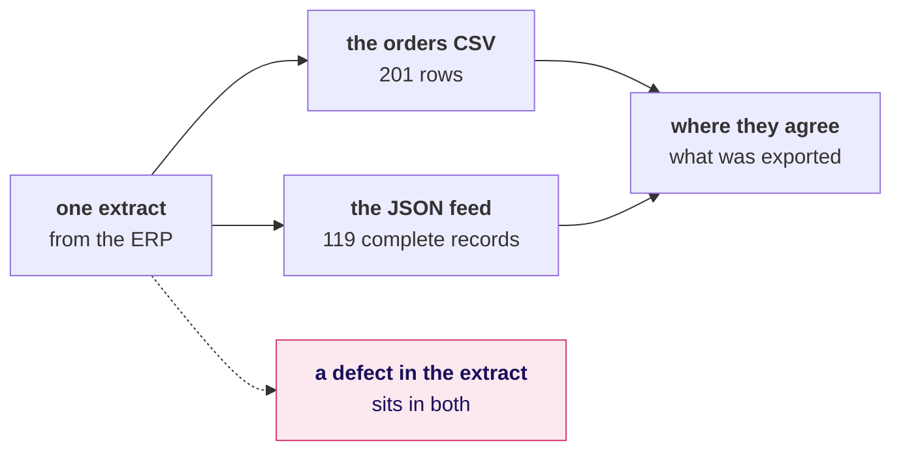
```mermaid
flowchart LR
    X["<b>one extract</b><br/>from the ERP"] --> C["<b>the orders CSV</b><br/>201 rows"]
    X --> J["<b>the JSON feed</b><br/>119 complete records"]
    C --> A["<b>where they agree</b><br/>what was exported"]
    J --> A
    X -.-> D["<b>a defect in the extract</b><br/>sits in both"]
    classDef bad fill:#FBE9EF,stroke:#D63A6A,color:#1A0F5C
    class D bad
```

**What breaks.** Two copies of one extract agree on its mistakes too, so the feed witnesses what the extract held, never whether a value is right. A CSV writes a missing value as an empty string and JSON leaves the key out, so the profile reads both the same way.

```notes
LIVE, 2 minutes, and the first thing to cut if the chapter runs long. json.load stops with a
JSONDecodeError, met in an empty cell: two minutes, open the file at the line and column the last
line names. The notebook reads the feed one complete record at a time: 119 records, all of them
orders the CSV holds, before the cut. Then a second route to the profile's counts.
```

---

## S20. A second route: sorted ids and a pattern agree
*Do two other methods reach the same counts?*

```python
ids = sorted(r["order_id"] for r in raw)
1 + sum(1 for a, b in zip(ids, ids[1:]) if a != b)                # 186
sum(1 for r in raw if not re.fullmatch(r"[0-9]+", r["amount"]))   # 1
```

```stats
value: 186 = 186 | label: distinct ids | note: the profile and the sorted ids
value: 1 = 1 | label: amounts that fail | note: the profile and a digit pattern
```

**When to switch.** The profile for a first look; the sort and the pattern when the profile's own code is in doubt, since they share none of it.

```notes
LIVE, 2 minutes. A slip in convert() or in a set cannot move either count, which is what makes it a
second route. Then the chapter's answers.
```

---

## S21. 201 rows for 186 orders, and 2.1 is honest arithmetic
*So what did the ERP send, and does the dashboard's Rs 2.1 crore follow from it?*

| The question on the way | The answer |
|---|---|
| 1. Which way, at what cost? | Profile every field: 2,010 values in under a second |
| 2. What does the file hold? | Text; 186 ids, 200 amounts that convert, status on 200 |
| 3. Which order is largest? | Rs 29,45,460 as a number, where text said Rs 970 |
| 4. Does 2.1 crore follow? | Yes: Rs 2,09,98,210 over the 200 that convert |
| 5. What can the feed tell? | What the extract held: 119 records, never a value's truth |
| 6. Do other methods agree? | Yes: 186 ids and one failure, by other code |

**Kavya's review.** Kavya Nair, the senior analyst who checks every number before it leaves the team: "Before you total anything, tell me how many records you received, how many are complete, how many convert and how many are distinct."

**In the interview.** [F] Everything read from a CSV is a string; what breaks and where do you convert?

```notes
LIVE, 2 minutes. One breath for the interview: arithmetic, comparison and sorting break or silently
lie on text; convert once at the boundary in one function that returns the value or the reason, and
log the failures. The answer raises chapter 2's question: 201 rows for 186 orders, so which rows
repeat? Then chapter 2.
```

---

## SECTION 2: Which rows repeat?
*The file holds 201 rows for 186 orders: which rows did the export count twice, and what makes two rows one order?*

```notes
LIVE. Thirty minutes. Notebook C2_W01_D03_02_duplicates is the demonstration, and its six numbered
sections are the six questions on the next slide.
```

---

## S22. Answering it for Anand: six questions on the way
*Who needs this answer, and which questions lead to it?*

**Who needs the answer.** Anand needs to know whether his books are short or the export is high. A wrong answer keeps Rs 20 lakh that was never earned or deletes real orders from his books, and every rate Tuesday reported moves with the same rows.

```timeline
label: 1 | title: Which rule decides? | body: Four keys for one order
label: 2 | title: Where are the extra rows? | body: Rows against ids, by quarter
label: 3 | title: Why does dedupe find none? | body: The default tool, today
label: 4 | title: How many orders twice? | body: Grouped by the order id
label: 5 | title: Same count, same rows? | body: A rule that flags as many
label: 6 | title: Does a pairwise count agree? | body: Every row against the rest | tone: dark
```

```notes
LIVE, 1 minute. Read the six questions. Then what a wrong answer costs.
```

---

## S23. Every copy left in adds rupees nobody earned
*What does a wrong answer about repeated rows cost Anand?*

```stats
value: 201 for 186 | label: rows for orders | note: chapter 1's profile
value: Rs 19,98,210 | label: Q1 above the books | note: as exported
```

**The client asks.** "Which rows did the export count twice, and how do you know they are copies?"

**What breaks.** Every copy left in adds its rupees to Q1 and an extra order to the rate of Retail-Plus, Kalpa's paid membership tier; every real order removed takes rupees out of Finance's books.

```notes
LIVE, 2 minutes. The cost runs both ways: keep Rs 20 lakh that was never earned, or delete real
orders from the books. Then a company that counted one purchase twice.
```

---

## S24. Starbucks billed about a million customers twice
*Has a real company counted one purchase twice?*

```stats
value: 22 to 23 May | label: 2009 | note: the fault ran two days
value: ~7,800 | label: stores | note: company-owned, US and Canada
value: ~1 million | label: customers repaid | note: NBC News and AP
```

**What breaks.** A repeated record looks like a second purchase until someone asks what makes two records one.

```notes
LIVE, 2 minutes. Source: NBC News and AP, 10 June 2009, checked 30 Sep 2026. It is a duplicated
charge, the customer's side of the same mistake Kalpa's export makes in its revenue. Then the four
rules.
```

---

## S25. Four keys sized: the order_id flags the right 15
*Which rules could decide that two rows are one order, and what does each flag here?*

| Key | Rows flagged | Copies missed | Real rupees removed | Work |
|---|---|---|---|---|
| a) Whole record | 0 | 15 | Rs 0 | 201 lookups |
| b) Record less line | 13 | 2 | Rs 0 | 201 lookups |
| c) order_id | 15 | 0 | Rs 0 | 201 lookups |
| d) Fuzzy: customer, amount, 60 days | 15 | 1 | Rs 17,71,000 | 20,100 pairs |

**The call.** c, because the ERP issues one id per order. What would switch it: two systems issuing their own ids, and then the key is the system plus the id.

```notes
LIVE, 4 minutes. The fuzzy match, same customer and same amount dated within 60 days, has no key to
group on, so it costs 20,100 pair comparisons here against 201 lookups for a key, and about 200 lakh
crore pairs on a file of 2 crore rows. Point at d: the same count as c, and other rows. Then the
rule drawn as a picture.
```

---

## S26. The identity rule says what one order is
*What has to be written down before a single duplicate is counted?*

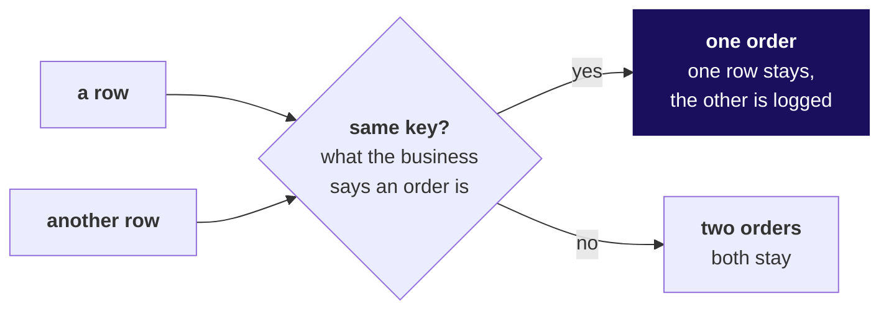
```mermaid
flowchart LR
    A["<b>a row</b>"] --> K{"<b>same key?</b><br/>what the business<br/>says an order is"}
    B["<b>another row</b>"] --> K
    K -->|"yes"| O["<b>one order</b><br/>one row stays,<br/>the other is logged"]
    K -->|"no"| T["<b>two orders</b><br/>both stay"]
    classDef bet fill:#1A0F5C,stroke:#1A0F5C,color:#FFFFFF
    class O bet
```

**The rule.** The identity rule is what the business says makes two records one thing. For an order it is the id the ERP issues, and it is written down before anything is counted.

```notes
LIVE, 2 minutes. This is the chapter's one new idea. A duplicate only exists relative to a rule, so
the count comes after the rule. Then predict where the extra rows sit.
```

---

## S27. Question: in which quarter do the extra rows sit?
*Where do rows outnumber orders?*

```python
for q in ("Q1", "Q2"):
    rows_q = [r for r in raw if r["quarter"] == q]
    print(q, len(rows_q), len({r["order_id"] for r in rows_q}))
```

**Question.** Where do rows and distinct ids part company, as a letter? a) evenly across the two quarters; b) mostly in Q1, the quarter of the migration; c) mostly in Q2; d) nowhere, since the ids were counted over both quarters.

```notes
LIVE, 2 minutes. Letters in chat. Then the answer.
```

---

## S28. Answer: Q1 holds 114 rows for 100 orders
*Where do rows outnumber orders?*

```stats
value: 114 for 100 | label: Q1 rows for orders | note: the quarter the migration touched
value: 87 for 86 | label: Q2 rows for orders | note: one extra row
```

**The check.** 14 + 1 = 15 rows beyond one per order, the same 15 that 201 rows less 186 ids gives. The extra rows sit where the dashboard and the books disagree.

```notes
LIVE, 2 minutes. The answer is b. That is a lead, and the next step is to remove the copies, which is
where a hurried analyst reaches for the default tool. Then the plausible wrong answer.
```

---

## S29. The plausible wrong answer: zero duplicates
*What does the default dedupe report on today's records?*

```python
kept = whole_record_dedupe(raw)   # every field compared
len(raw) - len(kept)              # 0
```

```stats
value: 0 | label: duplicates found | note: the whole-record dedupe
value: Rs 2,09,98,210 | label: Q1 | note: unchanged, the dashboard looks right
```

```notes
LIVE, 2 minutes, notebook 02, section 3. Chapter 1's rejects log cited a file line, so every record
now carries one. Ask what they would do with a dedupe that finds zero; most would report it, since
the function ran without error. The note would tell Anand his books are Rs 20 lakh short. Then why.
```

---

## S30. Why it is wrong: the file line makes rows unique
*Why does a dedupe of every field find nothing?*

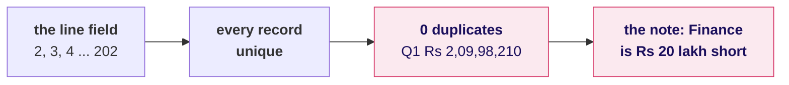
```mermaid
flowchart LR
    L["<b>the line field</b><br/>2, 3, 4 ... 202"] --> U["<b>every record<br/>unique</b>"]
    U --> Z["<b>0 duplicates</b><br/>Q1 Rs 2,09,98,210"]
    Z --> N["<b>the note: Finance<br/>is Rs 20 lakh short</b>"]
    classDef bad fill:#FBE9EF,stroke:#D63A6A,color:#1A0F5C
    class Z,N bad
```

**The check.** Count distinct ids against rows first: 201 rows and 186 ids cannot both be true of a file with no repeats. The file line records where a row sat and says nothing about which order it is; on five invented records with two orders twice, every field with the line finds 0 repeats and every field without it finds 2.

```notes
LIVE, 3 minutes. The invented five are in notebook 02, labelled invented. The decision it misleads:
Finance sent hunting for revenue that was never earned. Then the fix.
```

---

## S31. The fix: 15 orders appear twice, 14 in Q1
*How many orders appear twice under the order id?*

```stats
value: 171 | label: orders once | note: one row each
value: 15 | label: orders twice | note: one row too many each
value: 14 + 1 | label: by quarter | note: Q1 and Q2
```

**What changed.** A count of nothing became a list of 15 orders, each on two lines, and none on three. Where the second lines sit is the room's to find.

```notes
LIVE, 3 minutes. Do not read the ids aloud. The your-turn cell prints both lines of each order; ask
what the second line numbers have in common and what that says about the migration, and let the room
say it. Then a rule that flags as many rows.
```

---

## S32. The fuzzy match shares 14 and removes a real order
*Does a rule that flags as many rows flag the same rows?*

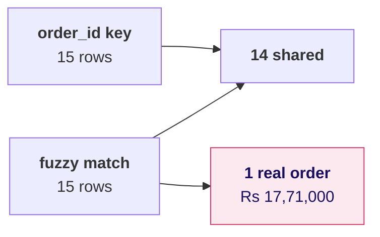
```mermaid
flowchart LR
    O["<b>order_id key</b><br/>15 rows"] --> S["<b>14 shared</b>"]
    F["<b>fuzzy match</b><br/>15 rows"] --> S
    F --> X["<b>1 real order</b><br/>Rs 17,71,000"]
    classDef bad fill:#FBE9EF,stroke:#D63A6A,color:#1A0F5C
    class X bad
```

**What breaks.** Fifteen against fifteen hides a difference in the rows: a Business customer spent the same Rs 17,71,000 again within 60 days, and the fuzzy match calls the second order a copy while it misses a pair whose amounts differ.

```notes
LIVE, 3 minutes. The decision it misleads: a reviewer comparing counts signs off a pass that removes
a real Q2 order. Compare the rows, never only their number. Then a count that needs no dictionary.
```

---

## S33. A second route: pairwise, 14 + 1 pairs share an id
*Does a count with no dictionary agree with the groups?*

```python
pairs = sum(1 for i, a in enumerate(raw) for b in raw[i + 1:]
            if a["order_id"] == b["order_id"])       # 15
```

```stats
value: 14 + 1 | label: pairs sharing an id | note: Q1 and Q2, compared pairwise
value: 20,100 | label: comparisons | note: against 201 lookups for the groups
```

**When to switch.** The pairwise count checks the grouping code on a small file. Its cost grows with the square of the rows, so on anything large the groups are the pass, and only they say which rows.

```notes
LIVE, 2 minutes. Both routes assert 15 and agree quarter by quarter. With no id on three rows, each
pair sharing an id is one extra row. Then the chapter's answers.
```

---

## S34. The order_id is the rule: 15 orders twice, 14 in Q1
*So which rows repeat, and what makes two rows one order?*

| The question on the way | The answer |
|---|---|
| 1. Which rule decides? | The order_id: 15 rows, where the whole record finds 0 |
| 2. Where are the extra rows? | Q1, 114 rows for 100 orders; Q2 87 for 86 |
| 3. Why does dedupe find none? | The file line makes every row unique: 0 found |
| 4. How many orders twice? | 15, 14 in Q1 and 1 in Q2 |
| 5. Same count, same rows? | No: 14 shared, and a real Rs 17,71,000 order removed |
| 6. Does a pairwise count agree? | Yes: 14 + 1 pairs in 20,100 comparisons |

**Kavya's review.** "Tell me what makes two rows the same order before you tell me how many duplicates there are."

**In the interview.** [F] How do you find duplicates, and what makes two records the same?

```notes
LIVE, 2 minutes. One breath: the business's identity rule first, rows against distinct keys, and
weigh the copies in money. The answer raises chapter 3's question: of each pair, which copy stays?
Then chapter 3.
```

---

## SECTION 3: Which copy stays?
*When an order appears twice, which copy stays, and does Q1 then land on the books?*

```notes
LIVE. Thirty minutes. Notebook C2_W01_D03_03_identity_rule is the demonstration, and its six
numbered sections are the six questions on the next slide.
```

---

## S35. Answering it for Anand's analyst: six questions
*Who needs this answer, and which questions lead to it?*

**Who needs the answer.** Anand's analyst ties out to the rupee, so a choice of copy that loses one order's amount turns the reconciliation into a finding against the team.

```timeline
label: 1 | title: Which copy could stay? | body: Four choices, against the books
label: 2 | title: Which stays if copies differ? | body: Three pairs, invented
label: 3 | title: What is Q1 after the rule? | body: The rule on the ERP file
label: 4 | title: If Q1 ties, is it right? | body: A pass on the books
label: 5 | title: Which rows carry the rupees? | body: Rows against rupees
label: 6 | title: Does a dict agree? | body: One line of code, no log | tone: dark
```

```notes
LIVE, 1 minute. Read the six questions. Then what the analyst loses to the wrong copy.
```

---

## S36. One wrong copy costs the analyst's tie-out Rs 1,790
*What does the analyst lose if the wrong copy of a pair stays?*

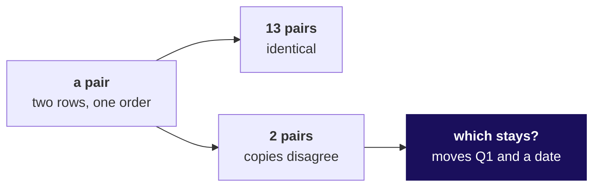
```mermaid
flowchart LR
    P["<b>a pair</b><br/>two rows, one order"] --> E["<b>13 pairs</b><br/>identical"]
    P --> D["<b>2 pairs</b><br/>copies disagree"]
    D --> Q["<b>which stays?</b><br/>moves Q1 and a date"]
    classDef bet fill:#1A0F5C,stroke:#1A0F5C,color:#FFFFFF
    class Q bet
```

**The client asks.** "When two copies disagree, which one did you keep, and why that one?"

**What breaks.** Keeping the wrong copy of one pair costs Rs 1,790 against the books, and the analyst finds it on her first tie-out.

```notes
LIVE, 2 minutes. Thirteen of the fifteen pairs are identical, and either row may stay. Anand's
analyst is the reader, and every choice is visible to her in the log. Then a system that wrote the
rule into law.
```

---

## S37. India's GST portal writes the identity rule into law
*Has a real system had to decide what makes two records one?*

```stats
value: 4 fields | label: the identity | note: GSTIN, number, type, year
value: rejected | label: a second copy | note: GSTN e-invoice FAQ
value: Rs 5 crore | label: seller's turnover | note: invoices to businesses, since 1 August 2023
```

**What breaks.** GSTIN is a business's GST registration number. Without a written rule for what makes two records one, every team chooses its own survivor. The rule binds the invoices a seller like Kalpa writes to the companies in its Business segment.

```notes
LIVE, 2 minutes. Sources checked 30 Sep 2026: GSTN e-invoice FAQ version 1.4, questions 9, 17 and
65, and Notification 10/2023-Central Tax. The portal hashes the same fields into the invoice
reference number, and a repeat is refused at the door. The rule covers invoices to registered
businesses from sellers above Rs 5 crore of aggregate turnover, and some sectors, such as banks and
insurers, are exempt. Then the four ways to choose.
```

---

## S38. The copy that validates lands Q1 on the books
*Which copy of a pair could stay, and what does each choice do to Q1?*

| Option | Q1 | Against the books | Unreadable kept |
|---|---|---|---|
| a) First in the file | Rs 1,89,98,210 | -Rs 1,790 | 1 |
| b) Last in the file | Rs 1,90,00,000 | Rs 0 | 0 |
| c) The copy that validates | Rs 1,90,00,000 | Rs 0 | 0 |
| d) Escalate all 15 | open | open | 0, after days of waiting |

**The call.** c, and escalate only the pair whose valid copies disagree. Last lands here by file order, which is luck. What would switch it: the ERP team saying the second extract was a corrected re-run.

```notes
LIVE, 4 minutes. Thirteen of the fifteen escalations would carry no question at all. Then three
kinds of pair on invented records.
```

---

## S39. Question: which copy of pair C stays?
*Which copy stays when the two copies differ?*

| Pair, invented | First copy | Second copy |
|---|---|---|
| A, INV-11 | Rs 1,800, 2 May | Rs 1,800, 2 May |
| B, INV-12 | amount "n/a" | Rs 2,600 |
| C, INV-13 | Rs 3,100, 21 August | Rs 3,100, 30 July |

**Question.** Pair C's copies are both valid and disagree on the date. Which copy stays, as a letter? a) the first, logged, with the date asked of the ERP team; b) the later date; c) neither; d) both.

```notes
LIVE, 2 minutes. The three pairs are invented, one of each kind. Pair A is easy and pair B has one
answer that can be summed. Letters in chat for pair C. Then the rule.
```

---

## S40. Answer: the first, logged, with a question for the ERP
*Which copy stays when the two copies differ?*

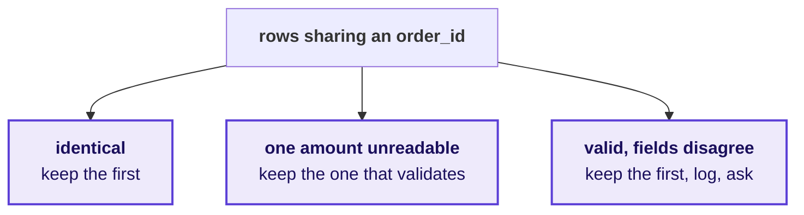
```mermaid
flowchart TD
    G["<b>rows sharing an order_id</b>"] --> A["<b>identical</b><br/>keep the first"]
    G --> B["<b>one amount unreadable</b><br/>keep the one that validates"]
    G --> C["<b>valid, fields disagree</b><br/>keep the first, log, ask"]
    classDef known fill:#EEEAFB,stroke:#5B3FD6,color:#1A0F5C,stroke-width:2px
    class A,B,C known
```

**The rule.** No rule inside the file can say which date is true, so the rule keeps the first extract's row and turns the date into a written question. For pair B, the copy that can be summed stays.

```notes
LIVE, 2 minutes. The answer is a. Keeping the first copy of pair B would keep a row that cannot be
summed, which is why the rule prefers the copy that validates. Then the rule on the ERP file.
```

---

## S41. Question: after the rule, what is Q1?
*What is Q1 once the rule runs on the ERP file?*

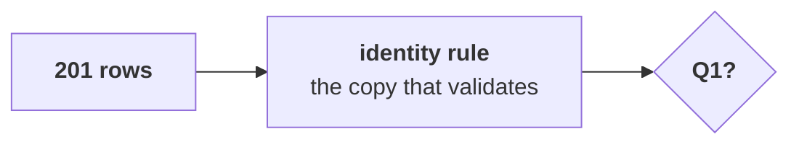
```mermaid
flowchart LR
    R["<b>201 rows</b>"] --> K["<b>identity rule</b><br/>the copy that validates"] --> Q{"<b>Q1?</b>"}
```

**Question.** Q1 after the identity rule, as a letter? a) Rs 2,09,98,210; b) Rs 1,89,98,210; c) Rs 1,90,00,000; d) Rs 2,00,00,000.

```notes
LIVE, 2 minutes. Letters in chat. Then the answer.
```

---

## S42. Answer: Rs 1,90,00,000, the books to the rupee
*What is Q1 once the rule runs on the ERP file?*

```stats
value: Rs 1,90,00,000 | label: Q1 | note: the books, to the rupee
value: Rs 1,87,00,000 | label: Q2 | note: one row per order
value: 186 + 15 | label: rows | note: kept and set aside
```

**What changed.** The answer is c. Two of the 15 rows set aside carry a longer reason than "second copy of the order", and those two are where the rule made a choice.

```notes
LIVE, 2 minutes. The your-turn cell prints the two log rows whose reason says more than "second
copy". Each learner says what the reasons show, where the amount chapter 1 could not read went and
which field a pair disagrees on, then writes the question they would send the ERP team. Then a pass
that ties Q1 by another route.
```

---

## S43. The plausible wrong answer: Q1 ties, so stop
*If Q1 ties to the books, is the pass right?*

```stats
value: Rs 1,90,00,000 | label: Q1 | note: equal to the books
value: 188 | label: orders reported | note: in the clean file
value: Rs 1,87,03,710 | label: Q2 | note: sent on to Marketing
```

```notes
LIVE, 2 minutes, notebook 03, section 4. This pass drops the file line and dedupes on the rest of
the record. Ask who would ship it. Most hands go up, since Q1 ties. Then why.
```

---

## S44. Why it is wrong: 188 rows for 186 orders
*Why can Q1 tie while the rows are wrong?*

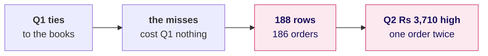
```mermaid
flowchart LR
    T["<b>Q1 ties</b><br/>to the books"] --> H["<b>the misses</b><br/>cost Q1 nothing"]
    H --> R["<b>188 rows</b><br/>186 orders"]
    R --> Q["<b>Q2 Rs 3,710 high</b><br/>one order twice"]
    classDef bad fill:#FBE9EF,stroke:#D63A6A,color:#1A0F5C
    class R,Q bad
```

**The check.** Rows kept against distinct ids, the check chapter 2 taught. A tie in rupees on one quarter proves that quarter's rupees and nothing about its rows.

```notes
LIVE, 2 minutes. The two pairs this pass misses cost Q1 nothing: one copy's amount cannot be read,
so it adds nothing to the sum. The decision it misleads: a Q2 order count one too high in
Retail-Plus, the segment Tuesday's finding is about. Then the fix.
```

---

## S45. The fix: the rule keeps 186, and Q2 drops Rs 3,710
*What does the identity rule change against that pass?*

```stats
value: 186 for 186 | label: rows for orders | note: the identity rule
value: Rs 1,87,00,000 | label: Q2 | note: down Rs 3,710
value: 1 | label: question to the ERP team | note: a date that disagrees
```

**What changed.** One Q2 order stops being counted twice, the unreadable row leaves the clean file with its reason, and one date goes to the ERP team as a written question.

```notes
LIVE, 2 minutes. Then weigh the rows the rule set aside.
```

---

## S46. Two Business rows carry 98.5 percent of the rupees
*Which rows carry the rupees set aside?*

| Segment | Rows set aside | Share of rows | Rupees set aside | Share of rupees |
|---|---|---|---|---|
| Business | 2 | 14% | Rs 19,67,560 | 98.5% |
| Retail-Plus | 11 | 79% | Rs 27,760 | 1.4% |
| Retail-Core | 1 | 7% | Rs 2,890 | 0.1% |

**What changed.** Anand's gap is two corporate orders counted twice; Tuesday's rate was measured on eleven extra Retail-Plus rows in Q1.

```notes
LIVE, 3 minutes. Rows: 2, 11 and 1 of 14. Rupees: Rs 19,67,560, Rs 27,760 and Rs 2,890 of
Rs 19,98,210. Two conversations follow: Anand's gap, and Tuesday's finding, which chapter 5
recomputes. Then a second route.
```

---

## S47. A second route: a dict keeps the same 186 orders
*Does a dictionary keyed by id keep the same orders?*

```python
valid = [r for r in raw if convert(r["amount"])[0] is not None]
by_id = {r["order_id"]: r for r in valid}
len(by_id)                 # 186
```

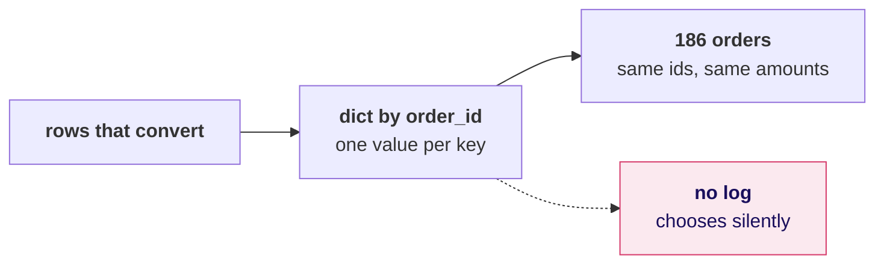
```mermaid
flowchart LR
    R["<b>rows that convert</b>"] --> D["<b>dict by order_id</b><br/>one value per key"]
    D --> S["<b>186 orders</b><br/>same ids, same amounts"]
    D -.-> N["<b>no log</b><br/>chooses silently"]
    classDef bad fill:#FBE9EF,stroke:#D63A6A,color:#1A0F5C
    class N bad
```

**When to switch.** The dict is the fast check that the totals are right. It keeps the last copy silently and logs nothing, so it is never the pass.

```notes
LIVE, 2 minutes. Notebook 03 asserts the same 186 ids and amounts by both routes. Then the chapter's
answers.
```

---

## S48. The copy that validates stays: Q1 on the books
*So which copy stays, and does Q1 then land on the books?*

| The question on the way | The answer |
|---|---|
| 1. Which copy could stay? | The copy that validates; first misses by Rs 1,790 |
| 2. Which stays if copies differ? | The one that converts; if both do, the first, logged |
| 3. What is Q1 after the rule? | Rs 1,90,00,000, the books: 186 kept, 15 set aside |
| 4. If Q1 ties, is it right? | Not alone: 188 rows for 186 orders, Q2 Rs 3,710 high |
| 5. Which rows carry the rupees? | Two Business rows, Rs 19,67,560, 98.5 percent |
| 6. Does a dict agree? | Yes: the same 186 orders, and no log |

**Kavya's review.** "When Q1 ties to the books, check the rows before you celebrate."

**In the interview.** [D] Design. Two copies of an order disagree: first copy, last copy or the copy that validates?

```notes
LIVE, 2 minutes. The answer raises chapter 4's question: the kept orders still carry a missing
status, missing discounts, and next time an unreadable amount with no twin. Then the 10-minute
break.
```

---

## SECTION 4: Drop, fill or flag?
*What should the pass do with a value that is missing or cannot be read, so that no decision invents or deletes a fact?*

```notes
LIVE. Thirty minutes. Notebook C2_W01_D03_04_missing_malformed is the demonstration, and its six
numbered sections are the six questions on the next slide.
```

---

## S49. Answering it for Operations and Finance: six questions
*Who needs this answer, and which questions lead to it?*

**Who needs the answer.** Operations reads the delivered share every week and Finance reads every rupee. A default invents a delivery nobody recorded, a zero invents an order sold for nothing, and a drop deletes a booked order.

```timeline
label: 1 | title: What could the pass do? | body: Each choice, sized
label: 2 | title: The order with no status? | body: Revenue and deliveries
label: 3 | title: Is a blank discount zero? | body: The average, two ways
label: 4 | title: What if failures become 0? | body: So the loop keeps running
label: 5 | title: Where can a repair come from? | body: A source for the value
label: 6 | title: Do profile and logs agree? | body: Defect by defect | tone: dark
```

```notes
LIVE, 1 minute. Read the six questions. Then the values still open.
```

---

## S50. One status, 55 discounts and a policy for bad amounts
*Which values are still missing or unreadable in the 186 kept orders?*

```cards
icon: circle-dashed | eyebrow: A missing value | title: One order, no status | body: Revenue counts it; the delivered share needs its fate.
icon: circle-dashed | eyebrow: A missing value | title: 55 orders, no discount | body: Tuesday read the gap as zero.
icon: triangle-alert | eyebrow: A malformed value | title: An amount that will not convert | body: The next export will carry one with no twin. | tone: dark
```

**What breaks.** A default invents a delivery Operations never recorded, and a zero invents an order sold for nothing.

```notes
LIVE, 2 minutes. Each choice keeps revenue whole, invents a fact or deletes one, and the analyst
reads every choice in the log. Then a business that sold on a value nobody questioned.
```

---

## S51. Sellers' stock went for 1p on Amazon UK
*Has a real business sold on a value nobody questioned?*

```stats
value: 1p | label: the price | note: set by sellers' repricing tool
value: about an hour | label: the window | note: a Friday evening
value: most | label: orders cancelled | note: once Amazon spotted it
```

**What breaks.** A repricing tool used by third-party sellers priced hundreds of items at a penny on 12 December 2014, and a wrong value that nothing questioned sold the sellers' real stock. A coerced zero in a report is treated as real in the same way.

```notes
LIVE, 2 minutes. Source: BBC News, 15 December 2014, checked 30 Sep 2026: the tool was Repricer
Express, and the orders were placed on Amazon's Marketplace, where third-party sellers trade. Counts
beyond "hundreds of items" were not verified and stay out. Then the options.
```

---

## S52. Flag the status; reject the amount, repair from a copy
*What could the pass do with a missing status or an unreadable amount, and what does each choice claim?*

| Missing status | Q2 revenue | Delivered | Share |
|---|---|---|---|
| a) Drop | Rs 1,86,98,150 | 57 of 85 | 67.1% |
| b) Default delivered | Rs 1,87,00,000 | 58 of 86 | 67.4% |
| c) Impute from last order | Rs 1,87,00,000 | 58 of 86 | 67.4% |
| d) Keep and flag | Rs 1,87,00,000 | 57 of 86 | 66.3% |

| Unreadable amount | Q1 against the books | What it leaves |
|---|---|---|
| a) Coerce to zero | -Rs 1,790 | an order at Rs 0 |
| b) Reject to the log | Rs 0 here | the order out until repaired |
| c) Read the word | a guess | Rs 14 for "fourteen" |
| d) Repair from a copy | Rs 0 | needs an independent copy |

**The call.** Status: d. Amount: reject to the log, and repair only from an independent copy. What would switch them: a delivery system to ask turns the flag into a lookup; an independent copy turns the reject into a repair.

```notes
LIVE, 4 minutes. Impute means filling a value from other records, here the customer's last order,
which was delivered. The amount options: coerce to zero misses the books by Rs 1,790 and leaves a
Rs 0 order; reject leaves the order's rupees out until repaired; reading a word as a number is a
guess; a twin from the other extract repairs it exactly. Then the claims drawn as a picture.
```

---

## S53. Each decision is a claim about the order
*What does each choice say about the order with no status?*

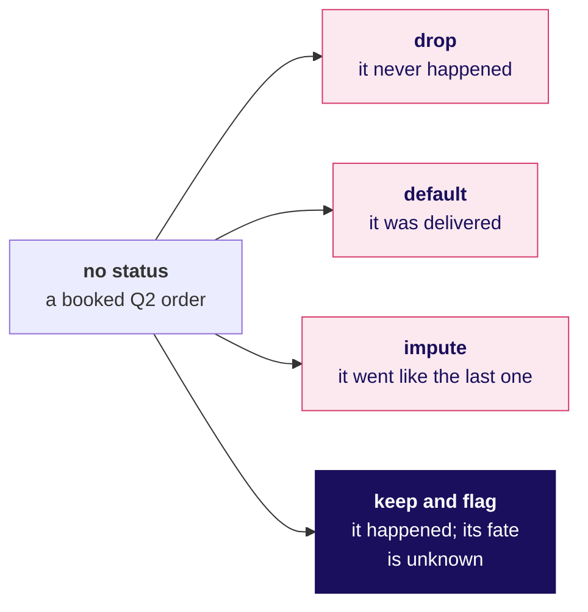
```mermaid
flowchart LR
    M["<b>no status</b><br/>a booked Q2 order"] --> D["<b>drop</b><br/>it never happened"]
    M --> F["<b>default</b><br/>it was delivered"]
    M --> I["<b>impute</b><br/>it went like the last one"]
    M --> K["<b>keep and flag</b><br/>it happened; its fate<br/>is unknown"]
    classDef bad fill:#FBE9EF,stroke:#D63A6A,color:#1A0F5C
    classDef bet fill:#1A0F5C,stroke:#1A0F5C,color:#FFFFFF
    class D,F,I bad
    class K bet
```

**The rule.** Revenue is booked value whatever the status, so the order stays in revenue; only the flag says what is known about its delivery.

```notes
LIVE, 1 minute. Three of the four claims invent or delete a fact. Then predict which keeps both
numbers honest.
```

---

## S54. Question: which choice keeps both numbers honest?
*What happens to the order with no status?*

```python
q2 = [r for r in clean if r["quarter"] == "Q2"]
no_status = [r for r in q2 if not r["status"]]      # one kept order
```

**Question.** Which decision keeps Q2 revenue and the delivered share both honest, as a letter? a) drop the order; b) default it to delivered; c) impute it from the customer's last order; d) keep it and flag it.

```notes
LIVE, 2 minutes. Letters in chat. Then the answer.
```

---

## S55. Answer: keep and flag, 57 of 86 delivered
*What happens to the order with no status?*

```stats
value: Rs 1,87,00,000 | label: Q2 revenue | note: the order stays in
value: 57 of 86 | label: delivered | note: 66.3 percent
value: 1 | label: line in the flags log | note: its fate unknown
```

**The check.** A default and this imputation each lift delivered to 58 of 86, 67.4 percent, a delivery nobody recorded; dropping takes a booked order out of Q2 revenue.

```notes
LIVE, 2 minutes. The answer is d. Then the discount, Tuesday's trap in a new place.
```

---

## S56. Question: what should the missing discount be?
*Is a missing discount a zero?*

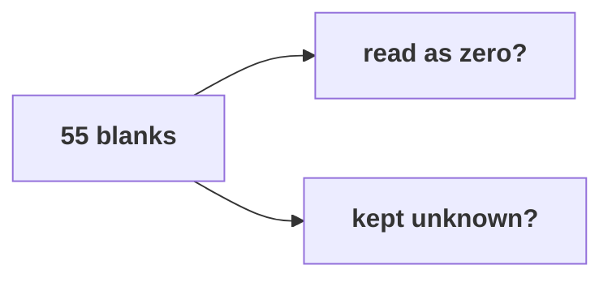
```mermaid
flowchart LR
    D["<b>55 blanks</b>"] --> Z["<b>read as zero?</b>"]
    D --> U["<b>kept unknown?</b>"]
```

**Question.** The average discount with blanks read as zero, against the average over orders that carry one, as a letter? a) the same, since blanks add nothing; b) a few rupees apart, within rounding; c) about 30 percent lower with zeros; d) higher, since zeros shrink the spread.

```notes
LIVE, 2 minutes. 55 of 186 kept orders carry no discount; revenue does not need the field. This is
Tuesday's trap coming back in a new place. Then the answer.
```

---

## S57. Answer: zeros pull it from Rs 67 to Rs 47
*Is a missing discount a zero?*

```stats
value: Rs 67 | label: over orders that carry one | note: 131 orders
value: Rs 47 | label: blanks read as zero | note: 186 orders
value: 55 | label: flagged | note: the count beside every figure
```

**What changed.** The answer is c. The field stays blank, the count goes beside any discount figure, and revenue is untouched.

```notes
LIVE, 2 minutes. Then the day's second spine trap.
```

---

## S58. The plausible wrong answer: failures become zero
*What if every failure is turned into zero?*

```python
def to_int(value):
    try:
        return int(value)
    except ValueError:
        return 0              # "so the loop does not crash"
```

```stats
value: 201 of 201 | label: amounts convert | note: the coerced profile
value: 0 | label: rows in the rejects log | note: nothing to explain
value: 186 orders | label: in the clean file | note: one per order id, all numbers
```

```notes
LIVE, 2 minutes, notebook 04, section 4. Let the room enjoy it: the loop finishes, the profile is
perfect, and every order id appears once. Ask who they would now tell the file is clean. Then why.
```

---

## S59. Why it is wrong: a zero claims a sale for nothing
*Why does a clean-looking profile hide a loss?*

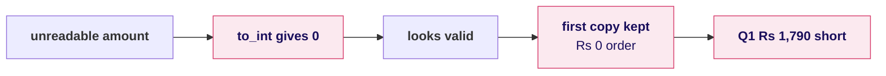
```mermaid
flowchart LR
    A["<b>unreadable amount</b>"] --> Z["<b>to_int gives 0</b>"]
    Z --> V["<b>looks valid</b>"]
    V --> K["<b>first copy kept</b><br/>Rs 0 order"]
    K --> S["<b>Q1 Rs 1,790 short</b>"]
    classDef bad fill:#FBE9EF,stroke:#D63A6A,color:#1A0F5C
    class Z,K,S bad
```

**The check.** Can a Kalpa order be worth nothing? The smallest real order in the export is Rs 680, and the failure count fell from one to zero while nothing was fixed.

```notes
LIVE, 2 minutes. Once the unreadable copy is worth Rs 0 it passes as valid, the identity rule can
no longer tell it from its twin, and the first copy wins. The decision it misleads: a note calling
the file clean with an order at Rs 0 in it, which the analyst finds on her first tie-out. Then the
fix.
```

---

## S60. The fix: the rule first, then conversion
*How does the pass keep the unreadable copy out of revenue?*

```stats
value: Rs 0 | label: Q1 against the books | note: the rule, then conversion
value: 0 | label: rejects after the rule | note: the twin carried the value
value: 1 | label: failure in the export's profile | note: the truth about the export
```

**What changed.** The identity rule keeps the copy whose amount converts, so the unreadable copy goes to the set-aside log with its twin named, and conversion after it rejects nothing. The Rs 0 order never exists.

```notes
LIVE, 2 minutes. The profile of the export still reports its one failure, which is the truth about
the export; the empty rejects log is the truth about the clean file. Then where a repair may come
from.
```

---

## S61. Repair only from a source that cannot share the error
*Where can an unreadable amount be repaired from?*

```stats
value: 118 of 119 | label: feed amounts agree | note: with the clean file
value: 1 | label: unreadable in the feed | note: the same text as the CSV
value: Rs 1,386 | label: short, reading "fourteen" | note: an invented Rs 1,400 order
```

**The rule.** The feed was cut from the same extract, so it witnesses what the extract held, never whether a value is right, and it can confirm and never repair. The CSV's second extract carried the value, and the identity rule already used it.

```notes
LIVE, 2 minutes. The invented pair INV-21 shows the other tempting repair: reading "fourteen" as 14
misses a Rs 1,400 order by Rs 1,386. Repair comes only from a source that could not have copied the
error, and the log names it. Then a second route.
```

---

## S62. A second route: the profile agrees with the logs
*Do the profile and the logs agree on every defect?*

| Defect | The profile | The logs |
|---|---|---|
| Status missing | 1 | 1 |
| Amount that fails | 0 | 0 |
| Discount missing | 55 | 55 |

**When to switch.** The profile finds defects and the log shows them. Profile the clean file at the end of every pass, and a defect that slipped past the log shows as a count that disagrees.

```notes
LIVE, 2 minutes. The counts come from different code: the profile of the clean file against the
flags, rejects and discount logs the decisions wrote. Then the chapter's answers.
```

---

## S63. Flag, keep unknown, reject: no fact invented
*So what does the pass do with a missing or unreadable value?*

| The question on the way | The answer |
|---|---|
| 1. What could the pass do? | Flag the status; reject the amount, repair from a copy |
| 2. The order with no status? | Kept and flagged: 57 of 86 delivered, 66.3 percent |
| 3. Is a blank discount zero? | No: about Rs 67 over 131 orders, never Rs 47 |
| 4. What if failures become 0? | 201 of 201 convert, an order at Rs 0, Rs 1,790 short |
| 5. Where can a repair come from? | Only a source that cannot share the error |
| 6. Do profile and logs agree? | Yes: 1 status, 0 amounts, 55 discounts |

**Kavya's review.** "Drop, default, or keep and flag: each is a claim about the business. Write the claim beside the decision, and never fill in money."

**In the interview.** [S] How do you handle missing data?

```notes
LIVE, 2 minutes. One breath: measure per field, ask what the absence means, then drop, default or
keep and flag with a reason, sized on what each moves. The answer raises chapter 5's question: the
clean file is decided, so can we prove the 1.9 to Anand? Then chapter 5.
```

---

## SECTION 5: Can we prove the 1.9?
*Can we prove to Anand, one cause at a time, that his Rs 1.9 crore is right, and does Tuesday's finding survive the clean file?*

```notes
LIVE. Thirty minutes. Notebook C2_W01_D03_05_bridge is the demonstration, and its six numbered
sections are the six questions on the next slide.
```

---

## S64. Answering it for Anand and Marketing: six questions
*Who needs this answer, and which questions lead to it?*

**Who needs the answer.** Anand wants a proof his analyst can follow, and Marketing's rescue campaign for Retail-Plus waits on whether Tuesday's finding survives. A proof Finance cannot follow costs his trust, and a finding nobody recomputes sends Marketing after a fall smaller than reported.

```timeline
label: 1 | title: How could we prove it? | body: Four proofs, sized
label: 2 | title: Which moves close it? | body: One cause per move
label: 3 | title: Does Tuesday survive? | body: The tree and the segment
label: 4 | title: Should the bulk order go? | body: 1.66 times the next
label: 5 | title: What does the note say? | body: Under 120 words
label: 6 | title: Does a bottom-up sum agree? | body: The kept orders, added | tone: dark
```

```notes
LIVE, 1 minute. Read the six questions. Then who is waiting.
```

---

## S65. Anand wants the proof; Marketing wants Tuesday
*Who is waiting on this chapter, and for what?*

```stats
value: Rs 19,98,210 | label: the gap to explain | note: Q1, to the rupee
value: -49.0% | label: Tuesday's Retail-Plus | note: orders per customer
value: -11.0% | label: Tuesday's revenue drop | note: Q1 to Q2
```

**The client asks.** "Which figure is right, and does the Retail-Plus fall still stand?"

```notes
LIVE, 2 minutes. A rescue campaign for Retail-Plus, Kalpa's paid membership tier, is waiting on the
second number. Then a retailer whose own figure was wrong.
```

---

## S66. Tesco's gap grew from GBP 250m to GBP 263m
*Has a retailer had to explain its own figure, cause by cause?*

```stats
value: GBP 250m | label: first estimate | note: 22 September 2014
value: GBP 263m | label: after investigation | note: 23 October 2014
value: GBP 118m | label: first half alone | note: the rest in earlier years
```

**What breaks.** Supplier income, the money suppliers pay the retailer, was booked before the activity it paid for took place, and the reported figure was wrong. The fix was a bridge: how much, from which period, for what cause.

```notes
LIVE, 2 minutes. Sources checked 30 Sep 2026: BBC News, 22 September 2014, which quotes Tesco on the
accelerated recognition of commercial income, payments from suppliers booked in the wrong period;
Tesco interim results statement, 23 October 2014, which splits GBP 263m into GBP 118m for the first
half, about GBP 70m for 2013/14 and about GBP 75m before. Then the four proofs.
```

---

## S67. A bridge by cause closes to the rupee and says why
*How could we prove which figure is right, and what does each proof cost?*

| Option | Rows behind it | Closes to the books | Says why |
|---|---|---|---|
| a) Take the books' figure | 0 | no | no |
| b) Difference of the totals | 2 totals | as a total | no |
| c) A bridge by cause | 15 logged rows | to the rupee | yes |
| d) Rebuild from the JSON feed | 119 records | -Rs 1,790 | no |

**The call.** c. What would switch it: a second source independent of the export and complete for the quarter; a rebuild from it proves the figure, and the bridge checks it.

```notes
LIVE, 4 minutes. A bridge walks one total to another, one move per cause, each backed by logged
rows. The feed is neither independent nor complete: it was cut from the same extract, carries the
same unreadable amount and holds only 19 of Q2's 86 orders. Then predict the moves.
```

---

## S68. Question: how many moves does the bridge need?
*Which moves walk Rs 2.1 crore down to the books?*

```python
q1_aside = [e for e in set_aside if e["quarter"] == "Q1"]
rupees = lambda e: convert(e["amount"])[0] or 0      # 0 where unreadable
corporate = -sum(rupees(e) for e in q1_aside if e["segment"] == "Business")
consumer = -sum(rupees(e) for e in q1_aside if e["segment"] != "Business")
```

**Question.** How many moves land the bridge on the books, as a letter? a) one, the copies; b) two, the corporate copies and the consumer copies; c) three, adding the unreadable amount; d) none, since 2.1 rounds close enough.

```notes
LIVE, 2 minutes. The set-aside log holds the 15 rows the identity rule set aside, 14 of them in Q1,
each with its segment. Take letters in chat, then show the bridge.
```

---

## S69. Answer: two moves walk Rs 2.1 crore to the books
*Which moves walk Rs 2.1 crore down to the books?*

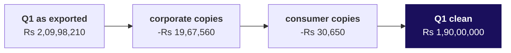
```mermaid
flowchart LR
    E["<b>Q1 as exported</b><br/>Rs 2,09,98,210"] --> C["<b>corporate copies</b><br/>-Rs 19,67,560"]
    C --> K["<b>consumer copies</b><br/>-Rs 30,650"]
    K --> B["<b>Q1 clean</b><br/>Rs 1,90,00,000"]
    classDef bet fill:#1A0F5C,stroke:#1A0F5C,color:#FFFFFF
    class B bet
```

**What changed.** The answer is b. The unreadable amount needs no move: it was never in the exported total, and its twin stayed.

```notes
LIVE, 2 minutes. Draw the bridge on the board beside the notebook's chart; the raised axis keeps the
Rs 30,650 move visible. Then Monday's tree, to test Tuesday's finding.
```

---

## S70. Monday's tree splits revenue into three branches
*How did Tuesday read the Q1 to Q2 change?*

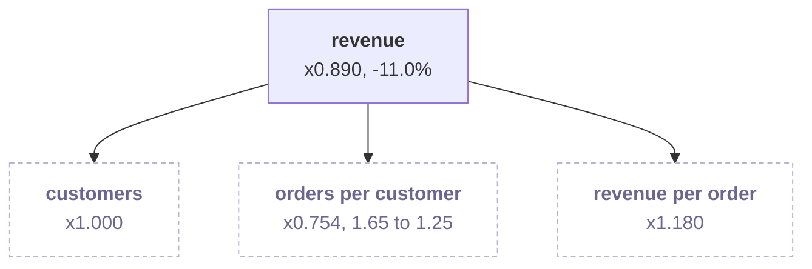
```mermaid
flowchart TD
    R["<b>revenue</b><br/>x0.890, -11.0%"] --> C["<b>customers</b><br/>x1.000"]
    R --> F["<b>orders per customer</b><br/>x0.754, 1.65 to 1.25"]
    R --> V["<b>revenue per order</b><br/>x1.180"]
    classDef unknown fill:#FFFFFF,stroke:#B8B2D6,color:#6B6690,stroke-dasharray:4 3
    class C,F,V unknown
```

**The rule.** Revenue is customers times orders per customer times revenue per order, so each branch is read as Q2's multiple of Q1, and the three multiply back to revenue's: 1.000 x 0.754 x 1.180 = 0.890. Tuesday read these on the export as delivered.

```notes
LIVE, 2 minutes. The dashed boxes are Tuesday's reading, before any cleaning. The copies were Q1
rows, so at least one branch has to move. Then predict what survives.
```

---

## S71. Question: does Tuesday's finding survive?
*Does Tuesday's finding survive the clean file?*

```mermaid
flowchart LR
    T["<b>Retail-Plus -49.0%</b><br/>orders per customer,<br/>2.32 to 1.18"] --> C{"<b>on clean<br/>data?</b>"}
```

**Question.** On clean data, the Retail-Plus fall in orders per customer, as a letter? a) disappears; b) survives, smaller; c) grows; d) moves to Retail-Core.

```notes
LIVE, 2 minutes. Letters in chat. Then the recomputed tree.
```

---

## S72. Answer: it survives, smaller, at -35.0 percent
*Does Tuesday's finding survive the clean file?*

| Q2 against Q1 | As Tuesday reported | On clean data |
|---|---|---|
| Customers | 69 to 69, x1.000 | 69 to 69, x1.000 |
| Orders per customer | 1.65 to 1.25, x0.754 | 1.449 to 1.246, x0.860 |
| Revenue per order | x1.180 | Rs 1,90,000 to Rs 2,17,442, x1.144 |
| Revenue | x0.890, -11.0% | Rs 1,90,00,000 to Rs 1,87,00,000, x0.984, -1.6% |
| Retail-Plus orders per customer | 2.32 to 1.18, -49.0% | 1.82 to 1.18, -35.0% |

**What changed.** The answer is b. The copies were Q1 orders, most of them Retail-Plus, so Tuesday's Q1 frequency was inflated; the three branches multiply back to revenue, 1.000 x 0.860 x 1.144 = 0.984.

```notes
LIVE, 2 minutes. Read the tree down: customers never moved, frequency carries the correction and now
falls by about 14 percent where Tuesday read 25, and revenue per order moves a little. Retail-Core
moves from -5.3 to -2.7 percent if asked. Thursday asks whether -35 percent is real or chance. Then
the largest Q2 order.
```

---

## S73. The plausible wrong answer: remove the bulk order
*Should the largest Q2 order come out?*

```stats
value: Rs 1,57,54,540 | label: Q2 without it | note: the hurried figure
value: -17.1% | label: the drop | note: 1.90 crore to 1.58 crore
value: 1.66x | label: the next largest | note: why it looked wrong
```

```notes
LIVE, 2 minutes, notebook 05, section 4. The decision it misleads: Marketing funds a rescue for a
fall that never happened, and Finance rejects the reconciliation because its books hold the order.
Then why.
```

---

## S74. Why it is wrong: size proves nothing about a record
*Why is a Rs 29 lakh order not an error?*

```mermaid
flowchart LR
    B["<b>the largest Q2 order</b>"] --> S["<b>Business segment</b><br/>sells in lakhs"]
    B --> C["<b>its customer</b><br/>ordered in both quarters"]
    B --> F["<b>every field</b><br/>valid"]
    S --> K["<b>keep, flag,<br/>show both ways</b>"]
    C --> K
    F --> K
    classDef bet fill:#1A0F5C,stroke:#1A0F5C,color:#FFFFFF
    class K bet
```

**The check.** Ask whether anything about the record is wrong; its size alone proves nothing. A fence, a cut-off above which values get called outliers, at three times the median Q2 order flags all 17 Business orders, since the quarter mixes a Rs 2,000 basket with a corporate order.

```notes
LIVE, 2 minutes. Kalpa's Business segment sells in bulk to corporate buyers, every order in lakhs,
so a Business order at Rs 29 lakh is the business doing what it does. Then the fix.
```

---

## S75. The fix: keep it, flag it, show Q2 both ways
*What does the note show for Q2?*

```stats
value: Rs 1,87,00,000 | label: Q2, the order kept | note: flagged, shown both ways
value: -1.6% | label: the drop | note: back from -17.1%
value: Rs 1,57,54,540 | label: Q2 without it | note: printed beside, labelled
```

**What changed.** Q2 goes back to Rs 1,87,00,000 and the drop to 1.6 percent. The figure without the order sits beside it for anyone planning from it, labelled.

```notes
LIVE, 2 minutes. Keep and flag is a decision in the log, with its reason: a real Business account,
shown both ways. Then the note.
```

---

## S76. The note leads with the answer: the 1.9 is right
*What does the note to Anand say first?*

> "Anand, your 1.9 crore is right. The ERP export counted fifteen orders twice, fourteen of them in Q1; copies of two corporate orders carry Rs 19,67,560 of the Rs 19,98,210 difference. Rows and rupees reconcile to your books. On clean data the drop is 1.6 percent against the 11 we reported, and the Retail-Plus fall is 35 percent against 49. It survives, smaller." The GCC data and AI team

```mermaid
flowchart LR
    R["<b>which is right</b><br/>1.9"] --> P["<b>the proof</b><br/>rows and rupees"] --> C["<b>what changed</b><br/>1.6 and 35 percent"]
```

```notes
LIVE, 2 minutes. Anand asked which figure is right, so that leads, then the proof, then what
changed, the smaller numbers first. The full note in notebook 05 also names the two flags and stays
under 120 words. Then a second route to Q1.
```

---

## S77. A second route: bottom up, Q1 is Rs 1,90,00,000
*Does a bottom-up sum reach the same Q1?*

```python
bottom_up = sum(r["amount"] for r in clean if r["quarter"] == "Q1")
bottom_up == exported_q1 + corporate + consumer == BOOKS_Q1     # True
```

```stats
value: Rs 1,90,00,000 | label: Q1 bottom up | note: equal to the bridge, top down
value: 1.82 and 1.18 | label: Retail-Plus rate | note: counted again with a dictionary
```

**When to switch.** Bottom up is the check anyone can run; top down is the proof, since only the bridge says what each rupee of the gap was.

```notes
LIVE, 1 minute. Then the chapter's answers.
```

---

## S78. The 1.9 is proved, and Tuesday survives, smaller
*So can we prove the 1.9, and does Tuesday's finding survive?*

| The question on the way | The answer |
|---|---|
| 1. How could we prove it? | A bridge by cause: 15 logged rows, to the rupee |
| 2. Which moves close it? | Two: -Rs 19,67,560 corporate, -Rs 30,650 consumer |
| 3. Does Tuesday survive? | Yes, smaller: revenue -1.6%, Retail-Plus -35.0% |
| 4. Should the bulk order go? | No: kept, flagged, Q2 shown both ways |
| 5. What does the note say? | That 1.9 is right, then the proof, then what changed |
| 6. Does a bottom-up sum agree? | Yes: Rs 1,90,00,000 |

**Kavya's review.** "Tell me what changed in Tuesday's story, including when it got smaller."

**In the interview.** [S] Finance and your dashboard disagree; what do you do?

```notes
LIVE, 2 minutes. One breath: both are correct arithmetic on different inputs; bridge one move per
cause, reconcile rows and rupees, say which is right and recompute what was reported. The answer
raises chapter 6's question, after lunch: can Anand's analyst audit every decision and rebuild the
clean file from the log alone?
```
