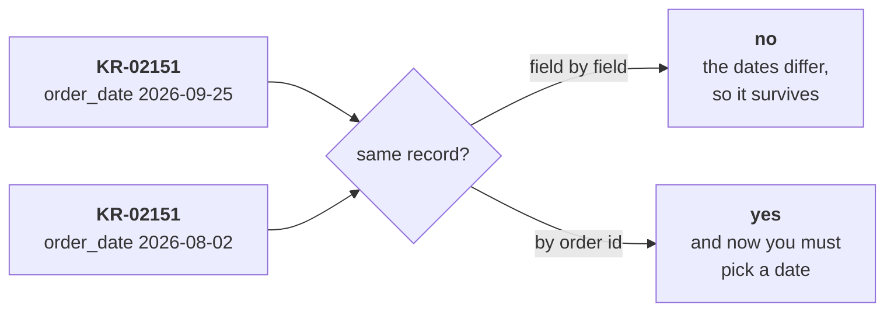
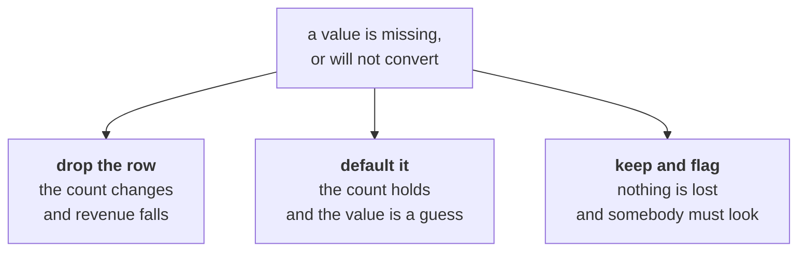
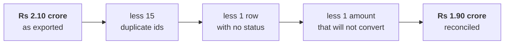
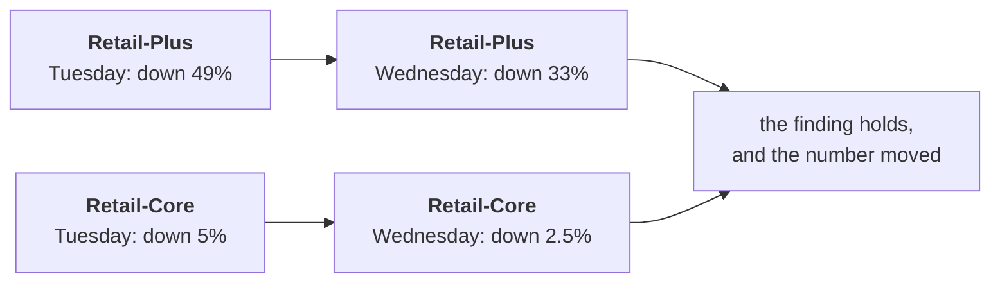

# Half two: decide, record, reconcile, recompute

Week 1, Day 3. Slide source. One idea per slide.

Position bar, repeated at every section boundary:
`[the identity rule] > [three decisions] > [the bridge] > [what changed]`

---

## SECTION A. The identity rule

---

## S1. A duplicate is not a row that looks the same
It is a row that **is the same order**. Those are different claims, and you have to say which fields decide it before you remove anything.

---

## S2. Three ways two rows can match
| Same | Different | Verdict |
|---|---|---|
| Every field | Nothing | A duplicate, and a whole-record check finds it |
| The order id | The order date | The hard one. Same order, two versions. |
| Everything but the id | The id | Probably two real orders. Keep both. |

Row two is where the judgment lives, and this file has exactly one of them.

---

## S3. The pair that breaks a whole-record check


Deduplicating on the whole record leaves it in. Deduplicating on the id removes one, and somebody has to say which.

---

## SECTION B. Three decisions

---

## S4. Every missing value has exactly three answers


There is no free option. Pick one, write the reason, count the rows it applies to.

---

## S5. The decisions log is the deliverable
| Field | Issue | Rows | Decision | Reason |
|---|---|---|---|---|
| order_id | Repeated | 15 | Drop later occurrences | Migration re-ran a batch |
| status | Absent | 1 | Reject the row | Cannot classify the order without it |
| amount | `twelve` | 1 | Reject the row | Guessing a value invents revenue |

An auditor reads this table, not your code. Write it as you go, because writing it afterwards means writing it from memory.

---

## S6. The one that must not be cleaned
The Rs 4,80,000 corporate order is an outlier and it is **real**.

It survives the pass, and the log records that it was looked at and kept. Remove every uncomfortable row and you end up with a dataset that agrees with you.

---

## D7. Which of these is cleaning, and which is deciding?
**Question.** Dropping a header row read as a record, against dropping an order that is four times larger than any other. Same action, same effect on the total. Are they the same kind of move?

---

## D8. Answer: one is a parse fix, one is a judgment
The header row was never an order. Removing it corrects a reading error and needs a line in the log.

The corporate order is an order. Removing it is a claim about which customers count, and it needs a reason somebody outside the team would accept. There is rarely one.

---

## SECTION C. The bridge

---

## S9. The only equation of the day
```
INPUT = CLEAN + REJECTED
```

| Term | Today |
|---|---|
| Input | 201 rows, as the export arrived |
| Clean | 184 rows, what the analysis runs on |
| Rejected | 17 rows, each with a written reason |

184 plus 17 is 201. A pass that cannot produce this is a pass nobody can check.

---

## S10. The revenue bridge


It lands on Finance's number. **Anand was right**, and the dashboard was counting a migration twice.

---

## S11. What the note to Finance says
> "Your 1.9 is correct. The export carried 201 rows against 186 distinct orders, because the Q1
> migration re-ran a batch. Removing the repeats, one row with no status and one amount that will
> not convert gives Rs 1.90 crore against your books. The decisions log is attached, and the one
> outlier in the file is a real corporate order which I have kept."

Numbers first, the cause, the reconciliation, what you kept and why.

---

## SECTION D. What changed

---

## S12. Tuesday's numbers, recomputed
| | Tuesday, as exported | Wednesday, reconciled |
|---|---|---|
| Q1 revenue | Rs 2.10 crore | Rs 1.90 crore |
| Q2 revenue | Rs 1.87 crore | Rs 1.87 crore |
| Revenue change | down 11.0 percent | down 1.6 percent |
| Orders per customer | down 24.6 percent | down 12.9 percent |

The headline drop was mostly a migration. Saying that out loud is the job.

---

## S13. The finding, before and after the clean pass


Retail-Plus still falls more than ten times as hard as Retail-Core. The finding survives, smaller.

---

## S14. What an honest analyst does next
| Do | Do not |
|---|---|
| Send the corrected numbers unprompted | Wait to be asked |
| Say which of Tuesday's sentences moved | Quietly reuse the old slide |
| Keep the finding, with its new number | Abandon it because the headline shrank |
| Note that the fall is now smaller than reported | Let the bigger number stand because it helped |

The reputational risk is never the wrong number. It is the wrong number that stayed up after you knew.

---

## S15. What this makes you ready for
Two figures disagreed, and you can now say which was right and prove it in four lines.

That is the most-asked trust question in an analyst interview, and you have an answer with a bridge attached.
