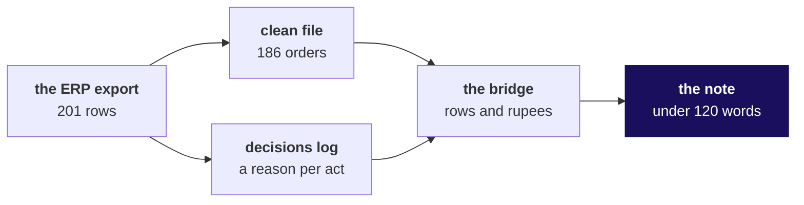
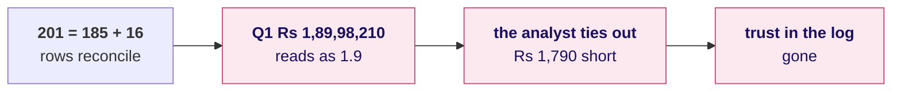
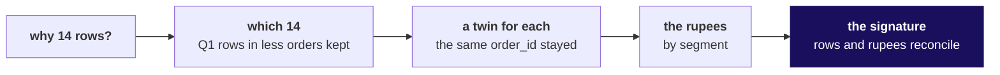
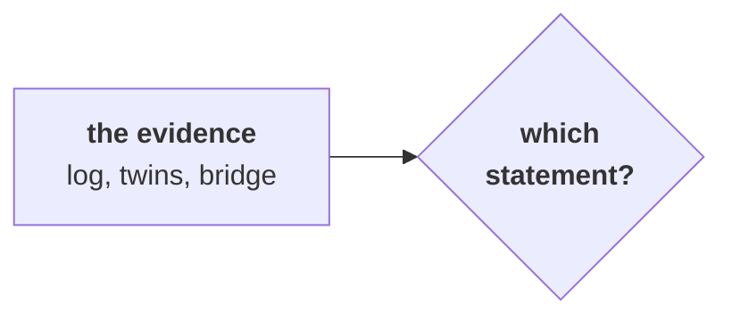
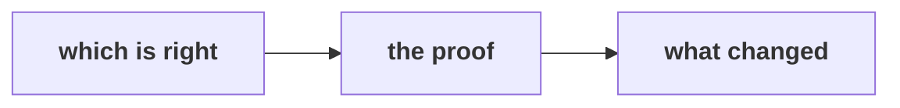
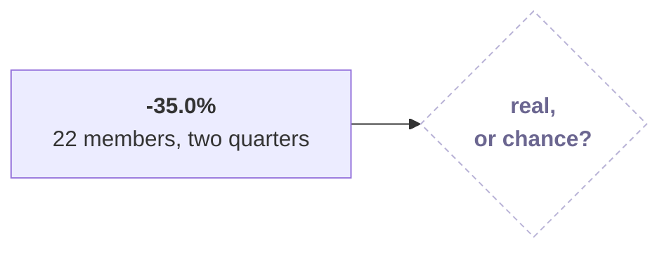

# The reconciliation Anand can audit

Week 1, Day 3. Half two.

Kicker: WEEK 1  ·  WEDNESDAY  ·  HALF TWO
Quote: Send the reconciliation and the log by five. My analyst checks it tonight.
Who: Anand Iyer, finance controller, Kalpa Retail

```notes
LIVE, one minute. The afternoon runs the whole pass alone, then answers an auditor from the log,
then drills the day's interview questions aloud. Nothing new is taught after lunch.
```

---

## SECTION 1: The escalated case
*The full pass, alone: every rung of the morning, on the same file, with nobody driving.*

```notes
LIVE. Sixty minutes unguided, then fifteen minutes debriefing the wrong answers the room produced.
The notebook is hands_on, a TODO twin with eight lettered choices.
```

---

## S1. Anand's deadline, and what goes with it
*Five parts, one file, and a log that has to stand up tonight.*

```timeline
label: Part 1 | title: Read and profile | body: Rows, distinct orders, and the three counts for every field.
label: Part 2 | title: Convert with a log | body: Every amount that fails, set aside with its line and reason.
label: Part 3 | title: The identity rule | body: One row per order, and the copy that validates stays.
label: Part 4 | title: Two decisions | body: The missing status and the largest order, each with a reason.
label: Part 5 | title: Reconcile and recompute | body: Rows and rupees to the books, the bridge, Tuesday recomputed, the note. | tone: dark
```

**The client asks.** "Which figure is right, the proof in rows and in rupees, and every decision in a log my analyst can follow."

```notes
LIVE, 3 minutes. The brief is in exercises/unguided as the case brief, and the notebook is
notebooks/hands_on. Answers are eight letters plus the note in under 120 words.
```

---

## S2. What a finished pass hands over
*Four artifacts, each answering one of the morning's four readers.*


```mermaid
flowchart LR
    F["<b>the ERP export</b><br/>201 rows"] --> C["<b>clean file</b><br/>186 orders"]
    F --> L["<b>decisions log</b><br/>a reason per act"]
    C --> B["<b>the bridge</b><br/>rows and rupees"]
    L --> B
    B --> N["<b>the note</b><br/>under 120 words"]
    classDef bet fill:#1A0F5C,stroke:#1A0F5C,color:#FFFFFF
    class N bet
```

```notes
LIVE, 2 minutes. Then 55 minutes of work. Circulate and watch for three things: rows totalled before
profiling, a first-copy dedupe, and a bridge that closes to 1.9 only after rounding.
```

---

## S3. The checks you post with your letters
*Every check in the notebook passes before the letters go into chat.*

```stats
value: 186 + 15 | label: rows | note: kept and set aside, of 201
value: Rs 1,90,00,000 | label: Q1 clean | note: the books, to the rupee
value: Rs 1,87,00,000 | label: Q2 clean | note: every real order kept
value: -35.0% | label: Retail-Plus | note: orders per customer, clean
```

```notes
SELF-STUDY, reference while working. A learner whose Q1 reads Rs 1,89,98,210 kept the wrong copy;
one whose Q2 reads Rs 1,57,54,540 removed the bulk order. Both are debriefed next.
```

---

## SECTION 2: The room's wrong answers
*Fifteen minutes on the numbers the room actually produced, each traced to the step that made it.*

```notes
LIVE. Put the most common wrong number on the screen first. Name no learner; name the step.
```

---

## S4. Four wrong numbers, four steps
*Every wrong Q1 or Q2 the room produces comes from one of four steps.*

| The number on the screen | The step that made it | The check that catches it |
|---|---|---|
| Q1 Rs 2,09,98,210, "every amount converts" | Failures coerced to zero | A Kalpa order worth Rs 0 |
| Q1 Rs 2,09,98,210, "zero duplicates" | A whole-record dedupe with the line attached | 201 rows against 186 order ids |
| Q2 Rs 1,57,54,540, "a 17 percent drop" | The real bulk order fenced out | A known Business account, every field valid |
| Q1 Rs 1,89,98,210, "reconciled" | Keep the first copy, then convert | Rs 1,790 short of the books |

```notes
LIVE, 8 minutes. Walk the table row by row. For each, ask one pair that produced it to say which
line of code made it. The point is that each wrong number was plausible and one check away.
```

---

## S5. The one most rooms miss
*The pass that reconciles in rows and still misses the books.*


```mermaid
flowchart LR
    R["<b>201 = 185 + 16</b><br/>rows reconcile"] --> Q["<b>Q1 Rs 1,89,98,210</b><br/>reads as 1.9"]
    Q --> A["<b>the analyst ties out</b><br/>Rs 1,790 short"]
    A --> T["<b>trust in the log</b><br/>gone"]
    classDef bad fill:#FBE9EF,stroke:#D63A6A,color:#1A0F5C
    class Q,A,T bad
```

**Kavya's review.** Rounding is where reconciliations go to hide. Compare to the rupee, then round for the note.

```notes
LIVE, 5 minutes. If nobody in the room produced this one, show it from the morning's round 3. Then
the 10-minute break.
```

---

## SECTION 3: The second case, in pairs
*The auditor asks why 14 rows were dropped, and the answer comes from the log.*

```notes
LIVE. Forty-five minutes in pairs: one drives the notebook ex2_auditor, the other plays the auditor
and asks the next question only when the check passes. Swap halfway.
```

---

## S6. The auditor's question
*"Your log says 14 Q1 rows were dropped. Why those 14, and how do I know nothing else went with them?"*


```mermaid
flowchart LR
    Q["<b>why 14 rows?</b>"] --> W["<b>which 14</b><br/>Q1 rows in less orders kept"]
    W --> T["<b>a twin for each</b><br/>the same order_id stayed"]
    T --> R["<b>the rupees</b><br/>by segment"]
    R --> S["<b>the signature</b><br/>rows and rupees reconcile"]
    classDef bet fill:#1A0F5C,stroke:#1A0F5C,color:#FFFFFF
    class S bet
```

```notes
LIVE, 3 minutes. The auditor's words are deliberate: "dropped" is the word to correct. Rows were
set aside with reasons, and the log shows each one.
```

---

## S7. Question: which statement does the auditor sign?
*Four statements, one supported by the evidence.*

**Question.** Which statement does the evidence support, as a letter? a) 14 Q1 rows were deleted as errors; b) the dashboard was right and the books are short; c) 14 Q1 rows are second copies set aside by the order_id rule, and rows and rupees reconcile; d) the 14 rows were outliers.


```mermaid
flowchart LR
    E["<b>the evidence</b><br/>log, twins, bridge"] --> S{"<b>which<br/>statement?</b>"}
```

```notes
LIVE, 2 minutes, after pairs finish question 5 in the notebook.
```

---

## S8. Answer: copies set aside, both reconciliations hold
*The statement names the rule, the evidence and both reconciliations.*

```stats
value: 114 = 100 + 14 | label: Q1 rows | note: in, kept, set aside
value: 14 of 14 | label: with a kept twin | note: same order_id
value: Rs 19,98,210 | label: set-aside rupees | note: 98% in two corporate rows
```

**Kavya's review.** "Dropped" is the auditor's word; "set aside with a reason" is yours. Say it the second way, then show the log.

```notes
LIVE, 3 minutes. The answer is c. Option a says deleted and errors; they were neither. Option d
confuses copies with outliers, which were a separate decision.
```

---

## SECTION 4: The interview drill
*Twelve questions aloud, each in under ninety seconds, from the day's own numbers.*

```notes
LIVE. Thirty minutes. Pairs: one asks, one answers aloud, the asker times it and names the one
number the answer should have used. Swap every three questions.
```

---

## S9. The row's five, asked everywhere
*The questions analytics screens ask of anyone who has cleaned a file.*

| Tag | Question |
|---|---|
| [S] | How do you handle missing data? |
| [S] | Finance and your dashboard disagree; what do you do? |
| [F] | How do you find duplicates, and what makes two records the same? |
| [F] | Everything read from a CSV is a string; what breaks and where do you convert? |
| [D] | An auditor asks why you dropped 14 rows; walk them through it. |

```notes
LIVE, 15 minutes. The shape of every answer is on the slide: the rule, today's number, the check.
Tags: [S] staple, [F] frequent in GCC and product screens, [SV] service-major opener, [D]
differentiator. The full answers are in the study notes.
```

---

## S10. Seven follow-ups, the way an interviewer pushes
*Each follow-up is the trap from a round, asked as a case.*

| Tag | Question |
|---|---|
| [F] | A dedupe returns zero duplicates. Do you believe it? |
| [S] | The largest order is 1.66 times the next. Do you remove it? |
| [F] | Your row counts reconcile. Are you done? |
| [F] | A JSON file fails to parse at a named line. What do you do? |
| [SV] | Walk me through how you clean a file you have never seen. |
| [D] | Cleaning shrank the finding you reported yesterday. What do you tell the stakeholder? |
| [D] | How do you know Finance's number is the right one, and not yours? |

```notes
LIVE, 15 minutes. The last question is the sharpest: the answer is that nobody's number is right
by rank; the bridge closes to the books because every move is backed by rows, and if it had not
closed, the gap would be a question for Finance.
```

---

## SECTION 5: The close
*The sentence to Anand, the lines worth keeping, and tomorrow's question.*

```notes
LIVE. Twenty minutes: the Kahoot, then this chapter.
```

---

## S11. The sentence to Anand
*Which figure is right, the proof, and what changed downstream.*

> "Your 1.9 crore is right: the export counted fifteen rows twice, and the bridge from 2.1 closes to your books in rows and in rupees. On clean data the drop is 1.6 percent and the Retail-Plus fall is 35 percent, smaller than we reported." The GCC data and AI team


```mermaid
flowchart LR
    R["<b>which is right</b>"] --> P["<b>the proof</b>"] --> C["<b>what changed</b>"]
```

```notes
LIVE, 2 minutes. Read it aloud once. It is the short form of the note every learner wrote.
```

---

## S12. The six lines worth keeping
*The cheat sheet prints these word for word.*

| | The line |
|---|---|
| 1 | Profile before you total: present, convertible, distinct, for every field. |
| 2 | A failure is counted and logged, never turned into a number. |
| 3 | Say what makes two rows one order before you count duplicates. |
| 4 | Large is not wrong: check the record, keep it, and show it both ways. |
| 5 | Reconcile twice, in rows and in rupees, to the books. |
| 6 | Recompute what you reported, and say what changed, the smaller number first. |

```notes
LIVE, 3 minutes. Have the room read them aloud once. Tonight's take-home tests every line on an
export nobody in the room has seen.
```

---

## S13. Tomorrow's question, left open
*The Retail-Plus fall survived cleaning. Is it real, or the wobble every quarter shows?*

**The client asks.** "Retail-Plus is down, smaller than first reported. Real, or the wobble we see every quarter?" Meera Raghavan, CEO, Kalpa Retail


```mermaid
flowchart LR
    F["<b>-35.0%</b><br/>22 members, two quarters"] --> Q{"<b>real,<br/>or chance?</b>"}
    classDef unknown fill:#FFFFFF,stroke:#B8B2D6,color:#6B6690,stroke-dasharray:4 3
    class Q unknown
```

```notes
LIVE, 2 minutes. Do not answer it. Thursday builds the chance reference with a shuffle. The
pre-read ships tonight.
```

---

## D14. Depth: the reconciliation in other trades
*The same two checks run wherever money moves between systems.*

| Where | Rows | Money |
|---|---|---|
| Bank statement against the ledger | Transactions matched | Balance to the paisa |
| Payment gateway against orders | Settlements per order | Collected against booked |
| Warehouse load against the source | Row counts per table | Control totals per column |

```notes
SELF-STUDY, 3 minutes. Week 2 Tuesday meets the gateway case, where one order carries two payment
rows and the rupees double.
```
