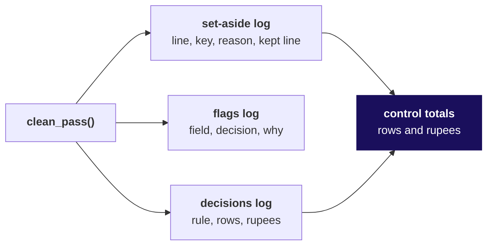
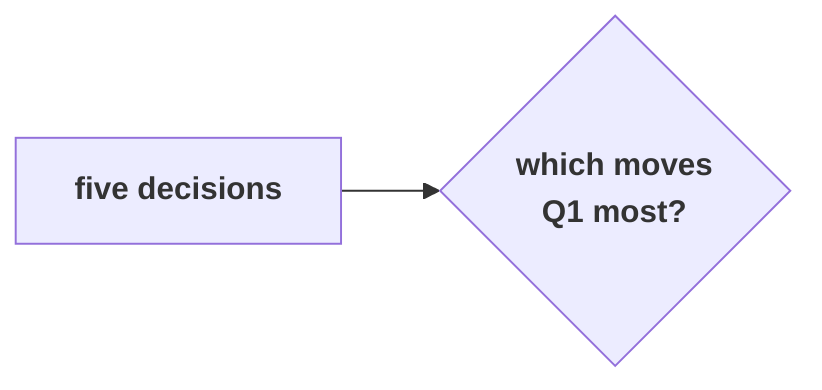
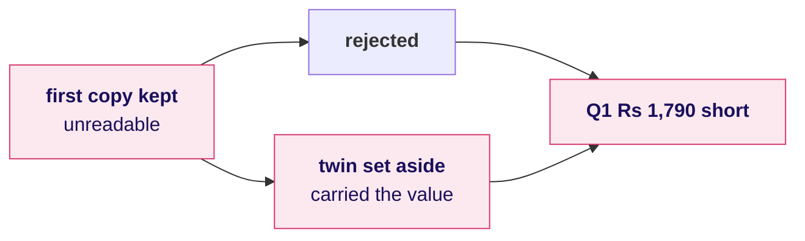
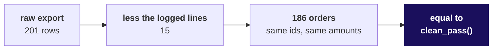
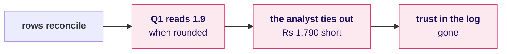
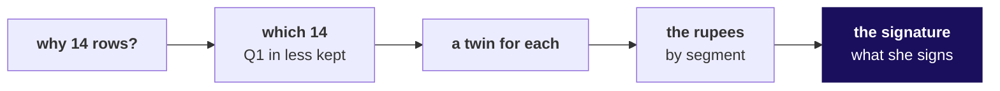
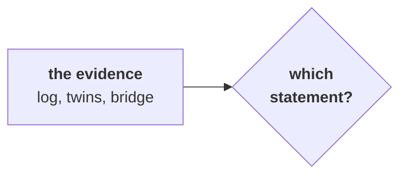
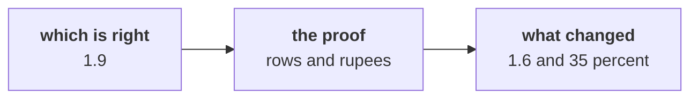
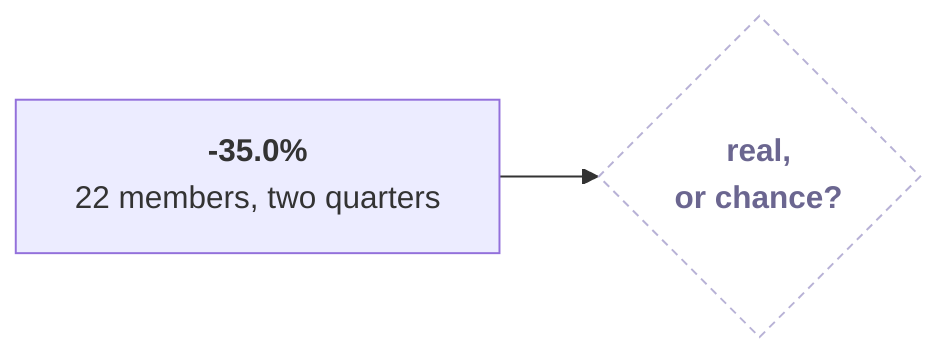

# Can Anand's analyst audit it tonight?

Week 1, Day 3. Half two.

Kicker: WEEK 1  ·  WEDNESDAY  ·  HALF TWO
Quote: Send the reconciliation and the log before the day closes. My analyst checks it tonight.
Who: Anand Iyer, finance controller, Kalpa Retail

```notes
LIVE, one minute. Chapter 6 first, then the full pass alone, the debrief of the room's wrong
answers, the auditor in pairs, the interview drill and the close. The next slide restates what the
morning settled for anyone who missed it. Then that slide.
```

---

## S1. The morning proved the 1.9, and the log is still open
*What did the morning settle, and what does Anand still need before tonight?*

| The morning's question | What it found |
|---|---|
| What did the ERP send? | 201 rows for 186 orders; Q1 over the amounts that convert is Rs 2,09,98,210 |
| Which rows repeat? | 15 orders twice under the order_id, 14 of them in Q1 |
| Which copy stays? | The copy whose amount converts: 186 kept, 15 set aside, Q1 Rs 1,90,00,000 |
| Drop, fill or flag? | Status flagged, discount kept unknown, bad amounts rejected, never zeroed |
| Can we prove the 1.9? | Yes, by a two-move bridge; revenue -1.6%, Retail-Plus -35.0% |

The ERP is the enterprise resource planning system Finance books orders in; its CSV was stitched from two extracts, two pulls of rows, during Q1's migration of the order data to a new system. The books are Finance's own record of Q1, and Anand's analyst ties out: she matches every figure to them, line by line.

```notes
LIVE, 1 minute. A set-aside row is one removed from the clean file with a logged reason and the line
of the row that stayed. The identity rule says what makes two rows one order, here the order_id; the
rejects log lists every row whose value would not convert, with its line and reason; Retail-Plus is
Kalpa's paid membership tier; the Business segment is Kalpa's sales to companies; a twin is the
other copy of the same order; and the bulk order is Q2's largest, a real Business order at Rs
29,45,460, kept and flagged. Everything on this slide was proved this morning. What is left is the
analyst's question. Then chapter 6.
```

---

## SECTION 6: Can the analyst replay it?
*Can Anand's analyst audit every decision tonight and rebuild the clean file from the log alone?*

```notes
LIVE. Thirty minutes. Notebook C2_W01_D03_06_audit_logs is the demonstration, and its six numbered
sections are the six questions on the next slide.
```

---

## S2. Answering it for the analyst: six questions
*Who needs this answer, and which questions lead to it?*

**Who needs the answer.** Anand's analyst checks the logs tonight, and an auditor may ask next quarter why any row went. A log she cannot follow costs a week of questions, and one that ties in rows and misses in rupees costs the team her trust in everything else it sends.

```timeline
label: 1 | title: What could she receive? | body: Four hand-overs, sized
label: 2 | title: Which decision moved most? | body: Rupees per decision
label: 3 | title: Do the files hold it? | body: Written, then read back
label: 4 | title: If rows tie, is it right? | body: A colleague's log
label: 5 | title: Why those 14 rows? | body: The auditor's question
label: 6 | title: Can a stranger rebuild it? | body: The log, replayed | tone: dark
```

```notes
LIVE, 1 minute. Read the six questions. Then what the analyst needs.
```

---

## S3. The analyst needs rows and rupees, and a reason each
*What does the analyst need, and what does a log she cannot follow cost?*

```stats
value: rows and rupees | label: the metric | note: control totals: a count and a sum at both ends, compared
value: the analyst | label: who asks | note: for Anand, tonight
value: a week | label: a log she cannot follow | note: of questions, and her trust
```

**The client asks.** "Can my analyst follow every decision you made, and rebuild your file from it?"

```notes
LIVE, 2 minutes. Control totals tie the export to the clean file to the books, and every row that
left has to trace to a rule. Then an auditor who could not trace a number.
```

---

## S4. Patisserie Valerie's auditor missed the red flags
*Has an auditor paid for numbers nobody could trace to their rows?*

```stats
value: GBP 94m | label: the hole | note: administrators, March 2019
value: GBP 4m | label: FRC fine | note: reduced to GBP 2.34m
value: 3 years | label: of audits | note: sanctioned in September 2021
```

**What breaks.** At a UK cafe chain the accounting hole reached GBP 94 million, and the Financial Reporting Council fined its former auditor for missing red flags across three years of audits.

```notes
LIVE, 2 minutes. Sources checked 30 Sep 2026: BBC News, 15 March 2019; FRC, 27 September 2021.
Name no person. Then the four hand-overs.
```

---

## S5. Logs and control totals: 24 lines, 12 minutes
*What could the analyst receive, and how long would each take her to check?*

| Option | Lines | Ties rows | Ties rupees | Replayable |
|---|---|---|---|---|
| a) The clean file, read against the raw | 387 | by hand | no | no |
| b) The file and a count | 1 | yes | no | no |
| c) Logs and control totals | 24 | yes | yes | yes |
| d) A full diff | 201 | yes | by hand | no |

**The call.** c. What would switch it: an external auditor who must re-derive every row, and then d goes beside c.

```notes
LIVE, 3 minutes. Lines are read at an illustrative 30 seconds each. The 387 are the 201 raw rows and
the 186 clean ones read against each other. The 24 are 15 set-aside rows, 2 flags (the status and
the bulk order), 5 decisions, 2 control totals and an empty rejects log. Options a and d cost over an
hour and still say nothing about why. Then what the logs carry.
```

---

## S6. Three logs and two totals, written as the pass runs
*What does each log carry, and which totals tie them?*


```mermaid
flowchart LR
    P["<b>clean_pass()</b>"] --> S["<b>set-aside log</b><br/>line, key, reason, kept line"]
    P --> F["<b>flags log</b><br/>field, decision, why"]
    P --> D["<b>decisions log</b><br/>rule, rows, rupees"]
    S --> T["<b>control totals</b><br/>rows and rupees"]
    D --> T
    classDef bet fill:#1A0F5C,stroke:#1A0F5C,color:#FFFFFF
    class T bet
```

**The rule.** The rejects log sits beside these three and is empty on this export, since the one unreadable amount was a copy set aside with its twin named.

```notes
LIVE, 2 minutes. clean_pass() is the day's pass in one function: the identity rule first, keeping
the copy whose amount converts, then conversion with a rejects log, then the flags. Then predict.
```

---

## S7. Question: which decision moves the most rupees?
*Which decision moved the most rupees?*


```mermaid
flowchart LR
    D["<b>five decisions</b>"] --> Q{"<b>which moves<br/>Q1 most?</b>"}
```

**Question.** As a letter? a) the identity rule; b) the missing status; c) the bulk order; d) the missing discount.

```notes
LIVE, 2 minutes. Letters in chat. Then the answer.
```

---

## S8. Answer: the identity rule moves all of it
*Which decision moved the most rupees?*

```stats
value: -Rs 19,98,210 | label: the identity rule | note: 15 rows
value: Rs 0 | label: the other four | note: 57 rows flagged or kept
```

**What changed.** The answer is a. Four decisions move no Q1 rupees, and each still gets its line, because an analyst who finds one unlogged decision stops trusting the logged ones.

```notes
LIVE, 2 minutes. The four: an unreadable amount rejected (no rows on this file), the status kept
and flagged (1), the discount kept unknown (55) and the bulk order kept and flagged (1). Then the
logs on disk.
```

---

## S9. Read back from disk, the log holds 15 rows as text
*Do the logs on disk hold what the notebook holds?*

```python
with open(out / "set_aside_log.csv", "w", newline="", encoding="utf-8") as f:
    w = csv.DictWriter(f, fieldnames=list(set_aside[0]))
    w.writeheader()
    w.writerows(set_aside)
back = list(csv.DictReader(open(out / "set_aside_log.csv")))     # 15 rows
```

```stats
value: 15 | label: set-aside rows | note: read back from the CSV
value: 5 | label: decisions | note: read back with json.load
```

**The check.** The rupees in the file equal the rupees in the notebook once the amounts are converted again, since they come back as text: chapter 1's rule holds for your own files too.

```notes
LIVE, 2 minutes. A log that lives only in a notebook reaches nobody. The decisions go out with
json.dump. read_orders() would overwrite the log's own line column, so the log is read back with a
plain DictReader; point that out if a learner trips on it. Then a colleague's log.
```

---

## S10. The plausible wrong answer: a perfect-looking log
*If the rows reconcile, is the log right?*

```python
for r in raw:                     # repeated ids out first, the first copy kept
    (aside if r["order_id"] in seen else first).append(r)
    seen.add(r["order_id"])
clean = [r for r in first if convert(r["amount"])[0] is not None]   # then convert
```

```stats
value: 201 = 185 + 16 | label: rows reconcile | note: in equals kept plus logged
value: Rs 20,00,000 | label: Q1 set aside | note: Anand's gap, to the lakh
value: Rs 1.90 crore | label: Q1 clean | note: as the note rounds it
```

```notes
LIVE, 2 minutes, notebook 06, section 4. A colleague built the pass in the order that feels natural.
Ask whether the room would send this log. Round Rs 20 lakh set aside feels like proof. Then why.
```

---

## S11. Why it is wrong: rows tie, rupees miss Rs 1,790
*Why can a log tie in rows and still be wrong?*


```mermaid
flowchart LR
    F["<b>first copy kept</b><br/>unreadable"] --> R["<b>rejected</b>"]
    F --> A["<b>twin set aside</b><br/>carried the value"]
    R --> S["<b>Q1 Rs 1,790 short</b>"]
    A --> S
    classDef bad fill:#FBE9EF,stroke:#D63A6A,color:#1A0F5C
    class F,A,S bad
```

**The check.** Compare the clean Q1 with the books, and look for a rejected order whose twin sits in the set-aside log with a value.

```notes
LIVE, 2 minutes. A row reconciliation proves nothing vanished; it cannot prove the right rows
stayed. The colleague's bridge closes on its own file and misses the books. Then the fix.
```

---

## S12. The fix: the rule first, and both totals tie
*What does the pass's own order change?*

```stats
value: 201 = 186 + 15 | label: rows | note: in, kept, set aside
value: 0 | label: lines in the rejects log | note: the twin carried the value
value: Rs 0 | label: Q1 against the books | note: the rupees tie
```

**What changed.** The Rs 1,790 order is back, and the unreadable copy sits in the set-aside log with its twin named, so the rejects log is empty.

```notes
LIVE, 2 minutes. The identity rule first, keeping the copy whose amount converts, then conversion.
Then the auditor's first question.
```

---

## S13. Each of the 14 has a kept twin, and Q1 ties
*Why were 14 Q1 rows set aside, and how do we know nothing else went?*

```stats
value: 114 = 100 + 14 | label: Q1 rows | note: in, kept, set aside
value: 14 of 14 | label: with a kept twin | note: same order_id
value: Rs 0 | label: against the books | note: Q1 clean
```

**The rule.** "Set aside with a reason" replaces "dropped": every line names the row that stayed, and Q1 ties in rows and in rupees.

```notes
LIVE, 2 minutes. The second case after the break walks this in pairs, with the auditor asking. Then
the strongest test of a log.
```

---

## S14. A second route: the log replays to the clean file
*Can the clean file be rebuilt from the raw export and the log alone?*

```python
gone = {int(r["line"]) for r in back}                  # the logged lines
replayed = [r for r in raw if r["line"] not in gone]   # 186 orders
```


```mermaid
flowchart LR
    R["<b>raw export</b><br/>201 rows"] --> M["<b>less the logged lines</b><br/>15"]
    M --> C["<b>186 orders</b><br/>same ids, same amounts"]
    C --> E["<b>equal to<br/>clean_pass()</b>"]
    classDef bet fill:#1A0F5C,stroke:#1A0F5C,color:#FFFFFF
    class E bet
```

**When to switch.** Control totals are the quick test; the replay is for an auditor who trusts nothing, and it runs before any log leaves the team.

```notes
LIVE, 2 minutes. The replay shares no code with the pass: if the raw export less the logged lines
equals the clean file, nothing left without a line. Notebook 06 asserts it. Then the chapter's
answers.
```

---

## S15. Yes: 24 lines, both totals tied, and a replay
*So can the analyst audit every decision and rebuild the clean file from the log?*

| The question on the way | The answer |
|---|---|
| 1. What could she receive? | Logs and control totals: 24 lines, about 12 minutes |
| 2. Which decision moved most? | The identity rule, all Rs 19,98,210 |
| 3. Do the files hold it? | Yes: 15 rows and 5 decisions, amounts back as text |
| 4. If rows tie, is it right? | No: 201 = 185 + 16 missed the books by Rs 1,790 |
| 5. Why those 14 rows? | Each has a kept twin; 114 = 100 + 14, and the rupees tie |
| 6. Can a stranger rebuild it? | Yes: 201 rows less 15 logged lines give the same 186 |

**Kavya's review.** Kavya Nair, the senior analyst who checks every number before it leaves the team: "A log is finished when a stranger can replay it."

**In the interview.** [D] An auditor asks why you dropped 14 rows; walk them through it.

```notes
LIVE, 2 minutes. One breath: set aside with a reason, never dropped; the rule, the twin, the rupees
by segment; both totals tie and the log replays. Then the full pass, alone.
```

---

## SECTION 7: Can you run the pass alone?
*Can you run the whole pass alone on the same file and send Anand a reconciliation his analyst can audit tonight?*

```notes
LIVE. Fifty minutes unguided. The notebook is ex1_escalated_case, with a blank to fill at each step
and nine lettered choices in all; the brief with its ten items is in exercises/unguided.
```

---

## S16. Answer: Anand needs five answers and a log tonight
*What does Anand need from the full pass by tonight?*

```timeline
label: Part 1 | title: What can you tell Anand yet? | body: Rows against orders, and the amount that will not convert
label: Part 2 | title: How are repeats treated? | body: Yours this time: the key, and when a later copy takes the kept one's place
label: Part 3 | title: How is each odd case decided? | body: The rejects log, the missing status and the largest order
label: Part 4 | title: Where did every row go? | body: A rupee test that fails the colleague's pass, then the bridge
label: Part 5 | title: What does Anand read first? | body: Monday's tree on the clean file, Tuesday's segment, the note | tone: dark
```

**The client asks.** "Tell me which figure is right, with the proof in rows and in rupees and every decision in a log my analyst can follow."

```notes
LIVE, 3 minutes. Monday's revenue tree is revenue = customers x orders per customer x revenue per
order, each branch read as Q2's multiple of Q1. Nine notebook letters, ten brief letters, then the
note in under 120 words. Watch for rows totalled before profiling, a first-copy rule, a rupee test
that rounds, and a tree whose customers are rows. Then the checks.
```

---

## D17. Four checks pass before your letters go in
*Which checks must pass before you post your letters?*

| The check | It passes when |
|---|---|
| Rows | The rows kept plus the rows set aside equal the 201 rows the ERP sent. |
| Q1 | Q1 on the kept rows equals the books, Rs 1,90,00,000, to the rupee. |
| Your rupee test | It passes on your pass and fails on the colleague's, which kept the first copy. |
| Monday's tree | Its three branches multiply back to revenue's change, Q2 over Q1. |

```notes
SELF-STUDY, 2 minutes, a reference while working. Each check recomputes its step another way, so the
numbers are the learner's to reach. A Q1 Rs 1,790 short kept the wrong copy; a Q2 Rs 29,45,460 light
removed the bulk order. Both are debriefed next.
```

---

## SECTION 8: Where did our numbers go wrong?
*Which wrong numbers did the room produce, which step made each, and which check catches it?*

```notes
LIVE. Fifteen minutes. Put the most common wrong number on the screen first. Name no learner; name
the step.
```

---

## S18. Answer: six wrong numbers, six steps that made them
*Which step made each wrong number, and which check catches it?*

| The number on the screen | The step that made it | The check |
|---|---|---|
| Largest Q2 order Rs 970 | Sorting amounts as text | Below every Business order |
| 0 duplicates | The line in the whole-record key | 201 rows, 186 ids |
| 188 orders, Q2 Rs 1,87,03,710 | The record less its line ties Q1, and the pass stops | Rows against ids |
| 201 of 201 convert | Failures turned into zero | An order worth Rs 0 |
| Q2 Rs 1,57,54,540, -17.1% | The largest Q2 order removed as an outlier | A real Business account |
| 201 = 185 + 16, Rs 20,00,000 set aside | Keep first, then convert | Rs 1,790 short of the books |

```notes
LIVE, 10 minutes. For each, ask a pair that produced it which line of code made it. Each wrong
number was plausible and one check away. Then the one most rooms miss.
```

---

## S19. Rows that tie and a Q1 read as 1.9 hide Rs 1,790
*Which wrong number do most rooms miss?*


```mermaid
flowchart LR
    R["<b>rows reconcile</b>"] --> Q["<b>Q1 reads 1.9</b><br/>when rounded"]
    Q --> A["<b>the analyst ties out</b><br/>Rs 1,790 short"]
    A --> T["<b>trust in the log</b><br/>gone"]
    classDef bad fill:#FBE9EF,stroke:#D63A6A,color:#1A0F5C
    class Q,A,T bad
```

**The rule.** Compare to the rupee, then round for the note.

```notes
LIVE, 5 minutes. If nobody produced it, show it from chapter 6. Then the 10-minute break.
```

---

## SECTION 9: Why were 14 rows set aside?
*The auditor asks why 14 Q1 rows were dropped: can you answer her from the log, one question at a time?*

```notes
LIVE. Forty minutes in pairs: one drives ex2_auditor, the other plays the auditor and asks the next
question only when the check passes. Swap halfway.
```

---

## S20. Answer: why 14, which 14, then the rupees
*What does the auditor ask, and in what order?*

> "Your log says 14 Q1 rows were dropped. Why those 14, and how do I know nothing else went?" The internal auditor, Kalpa Retail finance


```mermaid
flowchart LR
    Q["<b>why 14 rows?</b>"] --> W["<b>which 14</b><br/>Q1 in less kept"]
    W --> T["<b>a twin for each</b>"]
    T --> R["<b>the rupees</b><br/>by segment"]
    R --> S["<b>the signature</b><br/>what she signs"]
    classDef bet fill:#1A0F5C,stroke:#1A0F5C,color:#FFFFFF
    class S bet
```

```notes
LIVE, 3 minutes. "Dropped" is the word to correct. Then the pairs work, and the room comes back for
the statement she signs.
```

---

## S21. Question: which statement does the auditor sign?
*Which statement does the evidence support?*

**Question.** As a letter? a) 14 Q1 rows were deleted as errors after the migration was checked; b) the dashboard was right all along, and the books are short; c) 14 Q1 rows are copies of kept orders, set aside; both totals tie; d) the 14 rows were outliers removed to keep Q1 in line with Q2.


```mermaid
flowchart LR
    E["<b>the evidence</b><br/>log, twins, bridge"] --> S{"<b>which<br/>statement?</b>"}
```

```notes
LIVE, 2 minutes, after pairs finish question 5. Then the answer.
```

---

## S22. Answer: copies set aside, and both totals tie
*Which statement does the evidence support?*

```stats
value: 114 = 100 + 14 | label: Q1 rows | note: in, kept, set aside
value: 14 of 14 | label: with a kept twin | note: same order_id
value: Rs 19,98,210 | label: set-aside rupees | note: 98.5% in two corporate rows
```

**The rule.** "Dropped" is the auditor's word; "set aside with a reason" is yours.

```notes
LIVE, 3 minutes. The answer is c. Then the interview drill.
```

---

## SECTION 10: Can you answer in 90 seconds?
*Can you answer each of the day's 12 interview questions in under ninety seconds, with the rule, today's number and the check?*

```notes
LIVE. Twenty minutes. Pairs: one asks, one answers, the asker times it and names the one number the
answer should have used. Swap every three questions.
```

---

## S23. Answer: every screen asks these five first
*Which five questions does every analytics screen ask of someone who has cleaned a file?*

| Tag | Question |
|---|---|
| [S] | How do you handle missing data? |
| [S] | Finance and your dashboard disagree; what do you do? |
| [F] | How do you find duplicates, and what makes two records the same? |
| [F] | Everything read from a CSV is a string; what breaks and where do you convert? |
| [D] | An auditor asks why you dropped 14 rows; walk them through it. |

```notes
LIVE, 10 minutes. The shape of every answer: the rule, today's number, the check. Tags: [S] staple
asked everywhere, [F] frequent in screens at global capability centres (GCCs) and product
companies, [D] differentiator. Full answers are in
the study notes and in each notebook's interview section. Then the follow-ups.
```

---

## S24. Seven follow-ups, five of them design questions
*Which follow-ups push a candidate past the first answer?*

| Tag | Question |
|---|---|
| [F] | Your row counts reconcile. Are you done? |
| [S] | The largest order is 1.66 times the next. Do you remove it? |
| [D] | Design: 2 crore rows. Profile everything, or sample? |
| [D] | Design: order id, whole record or fuzzy, for customers from two apps? |
| [D] | Design: two copies disagree. First, last, or the copy that validates? |
| [D] | Design: coerce, reject or repair a malformed amount? |
| [D] | Design: prove a figure with a bridge, or rebuild it from a second source? |

```notes
LIVE, 10 minutes. The design questions want a choice, a sizing and the fact that would change it.
These five and the seven follow-ups are the day's 12, the same 12 the study notes answer. Then the
Kahoot and the close.
```

---

## D25. The same two checks run wherever money moves
*Where else do rows and money get reconciled?*

| Where | Rows | Money |
|---|---|---|
| Bank statement against the ledger | Transactions matched | Balance to the paisa |
| Payment gateway against orders | Settlements per order | Collected against booked |
| Warehouse load against the source | Row counts per table | Control totals per column |

```notes
SELF-STUDY, 3 minutes. Each trade runs the same two checks: rows prove nothing vanished, and money
proves the right rows stayed.
```

---

## SECTION 11: What do we tell Anand?
*Which Q1 figure is right, the dashboard's Rs 2.1 crore or the books' Rs 1.9 crore, and how do we know?*

```notes
LIVE. Fifteen minutes: the Kahoot, then this chapter.
```

---

## S26. Answer: the 1.9 is right, proved in rows and rupees
*Which Q1 figure is right, and how do we know?*

> "Your 1.9 crore is right: the export counted fifteen orders twice, and the bridge from 2.1 closes to your books in rows and in rupees. On clean data the drop is 1.6 percent and the Retail-Plus fall is 35 percent, smaller than we reported." The data and AI team at Kalpa's Global Capability Centre


```mermaid
flowchart LR
    R["<b>which is right</b><br/>1.9"] --> P["<b>the proof</b><br/>rows and rupees"] --> C["<b>what changed</b><br/>1.6 and 35 percent"]
```

```notes
LIVE, 2 minutes. This answers the day's question. Read it aloud once. Then the six lines.
```

---

## S27. Six lines, one per chapter, worth keeping
*What should you keep from each chapter?*

| | The line |
|---|---|
| 1 | Profile before you total: present, convertible, distinct, for every field. |
| 2 | Say what makes two rows one order before you count duplicates. |
| 3 | Keep the copy that validates, and log every row you set aside. |
| 4 | A failure is logged, never turned into a number. |
| 5 | Recompute what you reported, and say what changed, the smaller number first. |
| 6 | Reconcile twice, in rows and in rupees, to the books, and hand over a log a stranger can replay. |

```notes
LIVE, 3 minutes. One line per chapter, the lines the cheat sheet prints. Tonight's take-home tests
every line on an export nobody in the room has seen. Then tomorrow's question.
```

---

## S28. Tomorrow asks whether -35.0 percent is real or chance
*The Retail-Plus fall survived cleaning: is it real, or the wobble every quarter shows?*

**The client asks.** "Retail-Plus is down, smaller than first reported. Real, or the wobble we see every quarter?" Meera Raghavan, CEO, Kalpa Retail


```mermaid
flowchart LR
    F["<b>-35.0%</b><br/>22 members, two quarters"] --> Q{"<b>real,<br/>or chance?</b>"}
    classDef unknown fill:#FFFFFF,stroke:#B8B2D6,color:#6B6690,stroke-dasharray:4 3
    class Q unknown
```

```notes
LIVE, 2 minutes. Do not answer it. Thursday builds the answer.
```

