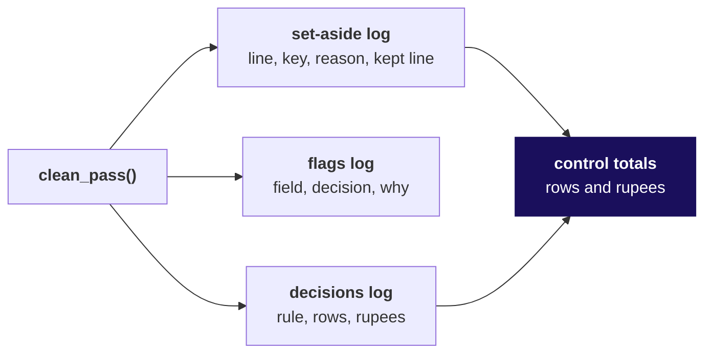
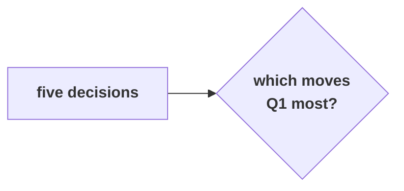
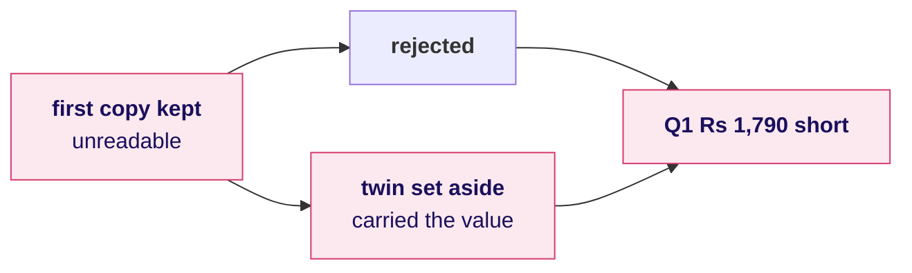
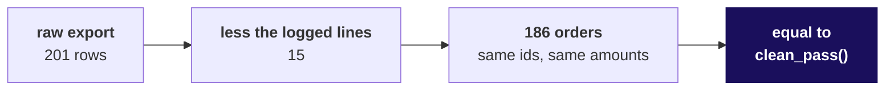
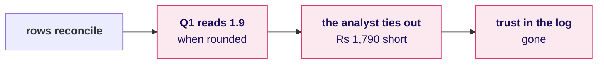
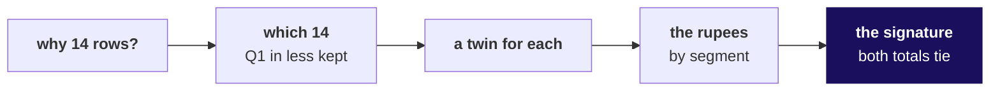
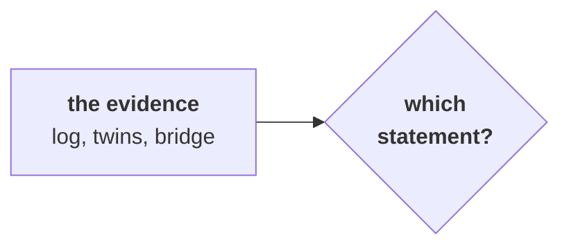
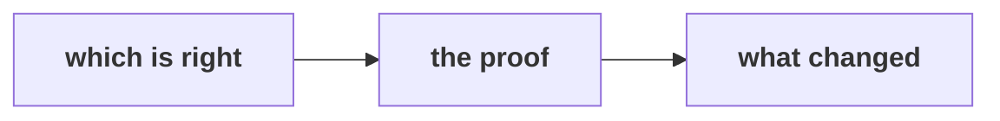
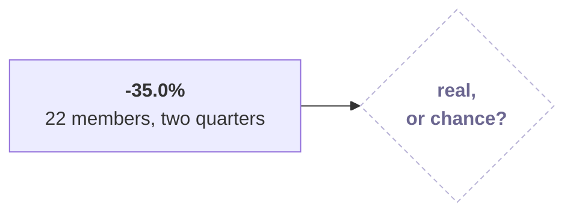

# The reconciliation Anand can audit

Week 1, Day 3. Half two.

Kicker: WEEK 1  ·  WEDNESDAY  ·  HALF TWO
Quote: Send the reconciliation and the log before the day closes. My analyst checks it tonight.
Who: Anand Iyer, finance controller, Kalpa Retail

```notes
LIVE, one minute. Chapter 6 first, then the full pass alone, the debrief of the room's wrong
answers, the auditor in pairs, the interview drill and the close.
```

---

## SECTION 6: The log the analyst audits
*A log is finished when a stranger can replay it.*

```notes
LIVE. Thirty minutes. Notebook C2_W01_D03_06_audit_logs is the demonstration. Say it is chapter 6:
the numeral on screen reads 01 because it opens this deck.
```

---

## S1. The need: control totals and a reason per row
*The analyst checks tonight; an auditor may ask next quarter.*

```stats
value: rows and rupees | label: the metric | note: control totals: counts and sums at both ends
value: the analyst | label: who asks | note: for Anand
value: a week | label: a log she cannot follow | note: of questions, and her trust
```

**The client asks.** "Can my analyst follow every decision you made, and rebuild your file from it?"

```notes
LIVE, 3 minutes. A log that ties in rows and misses in rupees costs the team her trust in
everything else it sends.
```

---

## S2. Patisserie Valerie's auditor missed the red flags
*A UK cafe chain's accounting hole reached GBP 94m; the auditor was fined.*

```stats
value: GBP 94m | label: the hole | note: administrators, March 2019
value: GBP 4m | label: FRC fine | note: reduced to GBP 2.34m
value: 3 years | label: of audits | note: sanctioned in September 2021
```

**What breaks.** An auditor who cannot trace a number to its rows signs off on it anyway, and pays for it later.

```notes
LIVE, 2 minutes. Sources checked 30 Sep 2026: BBC News, 15 March 2019; FRC, 27 September 2021. The
criminal case against individuals is unresolved, so name no person and say nobody was convicted.
```

---

## S3. Four hand-overs, sized for the analyst
*Lines to read at an illustrative 30 seconds a line.*

| Option | Lines | Ties rows | Ties rupees | Replayable |
|---|---|---|---|---|
| a) The clean file, read against the raw | 387 | by hand | no | no |
| b) The file and a count | 1 | yes | no | no |
| c) Logs and control totals | 24 | yes | yes | yes |
| d) A full diff | 201 | yes | by hand | no |

**The call.** c. What would switch it: an external auditor who must re-derive every row, and then d goes beside c.

```notes
LIVE, 5 minutes. 24 lines: 15 set-aside rows, 2 flags (the status and the bulk order), 5 decisions, 2 control totals, and an empty
rejects log. Options a and d cost over an hour and still say nothing about why.
```

---

## S4. What the logs carry
*Three logs and two totals, written as the pass runs.*


```mermaid
flowchart LR
    P["<b>clean_pass()</b>"] --> S["<b>set-aside log</b><br/>line, key, reason, kept line"]
    P --> F["<b>flags log</b><br/>field, decision, why"]
    P --> D["<b>decisions log</b><br/>rule, rows, rupees"]
    S --> T["<b>control totals</b><br/>rows and rupees"]
    D --> T
    classDef bet fill:#1A0F5C,stroke:#1A0F5C,color:#FFFFFF
    class T bet
```

```notes
LIVE, 2 minutes. The decisions log has five lines; only the identity rule moves Q1 rupees, all
Rs 19,98,210, and every other decision still gets its line.
```

---

## S5. Question: which decision moves the most rupees?
*Five decisions in the log, one line each.*


```mermaid
flowchart LR
    D["<b>five decisions</b>"] --> Q{"<b>which moves<br/>Q1 most?</b>"}
```

**Question.** As a letter? a) the identity rule; b) the missing status; c) the bulk order; d) the missing discount.

```notes
LIVE, 2 minutes. Letters in chat.
```

---

## S6. Answer: the identity rule moves all of it
*Four decisions move no Q1 rupees, and each still gets a line.*

```stats
value: -Rs 19,98,210 | label: the identity rule | note: 15 rows
value: Rs 0 | label: the other four | note: 58 rows flagged or kept
```

**What changed.** The answer is a. The logs are written with csv.DictWriter and json.dump, then read back and compared, because a log that lives only in a notebook reaches nobody.

```notes
LIVE, 3 minutes. In the notebook, read_orders() would overwrite the log's own line column, so the
log is read back with a plain DictReader. Point that out if a learner trips on it.
```

---

## S7. The plausible wrong answer: a perfect-looking log
*A colleague removed repeated ids first, keeping the first copy, then converted.*

```stats
value: 201 = 185 + 16 | label: rows reconcile | note: in equals kept plus logged
value: Rs 20,00,000 | label: Q1 set aside | note: Anand's gap, to the lakh
value: Rs 1,89,98,210 | label: Q1 clean | note: 1.90 crore when rounded
```

```notes
LIVE, 3 minutes, notebook 06, section 3. Ask whether the room would send this. Round Rs 20 lakh
set aside feels like proof.
```

---

## S8. Why it is wrong: rows tie, rupees do not
*Rs 1,790 short of the books: the valued copy set aside, the unreadable one rejected.*


```mermaid
flowchart LR
    F["<b>first copy kept</b><br/>unreadable"] --> R["<b>rejected</b>"]
    F --> A["<b>twin set aside</b><br/>carried the value"]
    R --> S["<b>Q1 Rs 1,790 short</b>"]
    A --> S
    classDef bad fill:#FBE9EF,stroke:#D63A6A,color:#1A0F5C
    class F,A,S bad
```

**The check.** The books against the clean Q1, and a rejected order whose twin sits in the set-aside log with a value.

```notes
LIVE, 3 minutes. A row reconciliation proves nothing vanished; it cannot prove the right rows
stayed. The colleague's bridge closes on its own file and misses the books.
```

---

## S9. The fix, and the auditor's 14
*Convert inside the identity rule; then every Q1 row set aside has a kept twin.*

```stats
value: 114 = 100 + 14 | label: Q1 rows | note: in, kept, set aside
value: 14 of 14 | label: with a kept twin | note: same order_id
value: Rs 0 | label: against the books | note: Q1 clean
```

**What changed.** The Rs 1,790 order is back, the rejects log is empty, and "set aside with a reason" replaces "dropped".

```notes
LIVE, 3 minutes. The second case after the break walks this in pairs.
```

---

## S10. A second route: replay the log
*The raw export less the logged lines rebuilds the clean file exactly.*


```mermaid
flowchart LR
    R["<b>raw export</b><br/>201 rows"] --> M["<b>less the logged lines</b><br/>15"]
    M --> C["<b>186 orders</b><br/>same ids, same amounts"]
    C --> E["<b>equal to<br/>clean_pass()</b>"]
    classDef bet fill:#1A0F5C,stroke:#1A0F5C,color:#FFFFFF
    class E bet
```

**When to switch.** Control totals are the quick test; the replay is for an auditor who trusts nothing, and it runs before any log leaves the team.

```notes
LIVE, 2 minutes. Notebook 06 asserts the replay equals the clean file.
```

---

## S11. Kavya's review of chapter 6
*Rows and rupees both tie, a reason on every line, the twin named for every copy.*

**Kavya's review.** A log is finished when a stranger can replay it.

**In the interview.** [D] An auditor asks why you dropped 14 rows; walk them through it.

```cards
icon: list-checks | eyebrow: Chapter 6 | title: Established | body: Logs that tie in rows and rupees and replay to the clean file.
icon: circle-help | eyebrow: The escalated case | title: Next | body: The whole pass, alone. | tone: dark
```

```notes
LIVE, 2 minutes. One breath: set aside with a reason, never dropped; the rule, the twin, the rupees by segment,
both totals tie and the log replays.
```

---

## SECTION 7: The escalated case
*The full pass, alone: every chapter, on the same file, with nobody driving.*

```notes
LIVE. Fifty minutes unguided. The notebook is ex1_escalated_case, a TODO twin with eight lettered
choices; the brief is in exercises/unguided.
```

---

## S12. Anand's deadline, and what goes with it
*Five parts, one file, and a log that has to stand up tonight.*

```timeline
label: Part 1 | title: Read and profile | body: Rows, distinct orders, and the three counts for every field.
label: Part 2 | title: Convert with a log | body: Every amount that fails, set aside with its line and reason.
label: Part 3 | title: The identity rule | body: One row per order, and the copy that validates stays.
label: Part 4 | title: Two decisions | body: The missing status and the largest order, each with a reason.
label: Part 5 | title: Reconcile and recompute | body: Rows and rupees to the books, the bridge, Tuesday, the note. | tone: dark
```

**The client asks.** "Which figure is right, the proof in rows and in rupees, and every decision in a log my analyst can follow."

```notes
LIVE, 3 minutes. Eight notebook letters, ten brief letters, then the note in under 120 words.
Watch for rows totalled before profiling, a first-copy dedupe, and a bridge that closes to 1.9
only after rounding.
```

---

## D13. The checks you post with your letters
*Every check in the notebook passes before the letters go into chat.*

```stats
value: 186 + 15 | label: rows | note: kept and set aside, of 201
value: Rs 1,90,00,000 | label: Q1 clean | note: the books, to the rupee
value: Rs 1,87,00,000 | label: Q2 clean | note: every real order kept
value: -35.0% | label: Retail-Plus | note: orders per customer, clean
```

```notes
SELF-STUDY, reference while working. A Q1 of Rs 1,89,98,210 kept the wrong copy; a Q2 of
Rs 1,57,54,540 removed the bulk order. Both are debriefed next.
```

---

## SECTION 8: The room's wrong answers
*Every wrong number traced to the step that made it and the check that catches it.*

```notes
LIVE. Put the most common wrong number on the screen first. Name no learner; name the step.
```

---

## S14. Six wrong numbers, six steps
*Every wrong figure the room produces comes from one of the day's traps.*

| The number on the screen | The step that made it | The check |
|---|---|---|
| Largest Q2 order Rs 970 | Sorting amounts as text | Below every Business order |
| 0 duplicates | The line in the whole-record key | 201 rows, 186 ids |
| 188 orders, Q2 Rs 1,87,03,710 | Record less line; Q1 tied, so stop | Rows against ids |
| 201 of 201 convert | Failures coerced to zero | An order worth Rs 0 |
| Q2 Rs 1,57,54,540, -17.1% | The bulk order fenced out | A real Business account |
| 201 = 185 + 16, Q1 Rs 1,89,98,210 | Keep first, then convert | Rs 1,790 short of the books |

```notes
LIVE, 10 minutes. For each, ask a pair that produced it which line of code made it. Each wrong
number was plausible and one check away.
```

---

## S15. The one most rooms miss
*Rounding is where reconciliations go to hide.*


```mermaid
flowchart LR
    R["<b>rows reconcile</b>"] --> Q["<b>Q1 reads 1.9</b><br/>when rounded"]
    Q --> A["<b>the analyst ties out</b><br/>Rs 1,790 short"]
    A --> T["<b>trust in the log</b><br/>gone"]
    classDef bad fill:#FBE9EF,stroke:#D63A6A,color:#1A0F5C
    class Q,A,T bad
```

**The rule.** Compare to the rupee, then round for the note.

```notes
LIVE, 5 minutes. If nobody produced it, show it from chapter 6. Then the 10-minute break.
```

---

## SECTION 9: The second case, in pairs
*The auditor asks why 14 rows were dropped, and the answer comes from the log.*

```notes
LIVE. Forty minutes in pairs: one drives ex2_auditor, the other plays the auditor and asks the next
question only when the check passes. Swap halfway.
```

---

## S16. The auditor's question
*"Your log says 14 Q1 rows were dropped. Why those 14, and how do I know nothing else went?"*


```mermaid
flowchart LR
    Q["<b>why 14 rows?</b>"] --> W["<b>which 14</b><br/>Q1 in less kept"]
    W --> T["<b>a twin for each</b>"]
    T --> R["<b>the rupees</b><br/>by segment"]
    R --> S["<b>the signature</b><br/>both totals tie"]
    classDef bet fill:#1A0F5C,stroke:#1A0F5C,color:#FFFFFF
    class S bet
```

```notes
LIVE, 3 minutes. "Dropped" is the word to correct.
```

---

## S17. Question: which statement does the auditor sign?
*Four statements, one supported by the evidence.*

**Question.** As a letter? a) 14 Q1 rows were deleted as errors after the migration was checked; b) the dashboard was right all along, and the books are short; c) 14 Q1 rows are copies of kept orders, set aside by rule; both totals tie; d) the 14 rows were outliers removed to keep Q1 in line with Q2.


```mermaid
flowchart LR
    E["<b>the evidence</b><br/>log, twins, bridge"] --> S{"<b>which<br/>statement?</b>"}
```

```notes
LIVE, 2 minutes, after pairs finish question 5.
```

---

## S18. Answer: copies set aside, both totals tie
*The statement names the rule, the evidence and both reconciliations.*

```stats
value: 114 = 100 + 14 | label: Q1 rows | note: in, kept, set aside
value: 14 of 14 | label: with a kept twin | note: same order_id
value: Rs 19,98,210 | label: set-aside rupees | note: 98% in two corporate rows
```

**The rule.** "Dropped" is the auditor's word; "set aside with a reason" is yours.

```notes
LIVE, 3 minutes. The answer is c.
```

---

## SECTION 10: The interview drill
*Twelve questions aloud, the design question among them, each in under ninety seconds.*

```notes
LIVE. Twenty minutes. Pairs: one asks, one answers, the asker times it and names the one number
the answer should have used. Swap every three questions.
```

---

## S19. The row's five, asked everywhere
*The questions analytics screens ask of anyone who has cleaned a file.*

| Tag | Question |
|---|---|
| [S] | How do you handle missing data? |
| [S] | Finance and your dashboard disagree; what do you do? |
| [F] | How do you find duplicates, and what makes two records the same? |
| [F] | Everything read from a CSV is a string; what breaks and where do you convert? |
| [D] | An auditor asks why you dropped 14 rows; walk them through it. |

```notes
LIVE, 10 minutes. The shape of every answer: the rule, today's number, the check. Full answers in
the study notes and the notebooks' In the interview sections.
```

---

## S20. Seven follow-ups, the design questions among them
*Each is a chapter's trap or its options, asked as a case.*

| Tag | Question |
|---|---|
| [F] | A dedupe returns zero. Do you believe it? |
| [F] | Your row counts reconcile. Are you done? |
| [S] | The largest order is 1.66 times the next. Remove it? |
| [D] | Order id, whole record or fuzzy, for customers from two apps? |
| [D] | Coerce, reject or repair a malformed amount, and what would switch you? |
| [D] | Bridge or rebuild from a second source to prove a figure? |
| [SV] | Walk me through cleaning a file you have never seen. |

```notes
LIVE, 10 minutes. The design questions want a choice, a sizing and the fact that would change it.
```

---

## SECTION 11: The close
*The sentence to Anand, the lines worth keeping, and tomorrow's question.*

```notes
LIVE. Fifteen minutes: the Kahoot, then this chapter.
```

---

## S21. The sentence to Anand
*Which figure is right, the proof, and what changed downstream.*

> "Your 1.9 crore is right: the export counted fifteen orders twice, and the bridge from 2.1 closes to your books in rows and in rupees. On clean data the drop is 1.6 percent and the Retail-Plus fall is 35 percent, smaller than we reported." The GCC data and AI team


```mermaid
flowchart LR
    R["<b>which is right</b>"] --> P["<b>the proof</b>"] --> C["<b>what changed</b>"]
```

```notes
LIVE, 2 minutes. Read it aloud once.
```

---

## S22. The six lines worth keeping
*The cheat sheet prints these word for word.*

| | The line |
|---|---|
| 1 | Profile before you total: present, convertible, distinct, for every field. |
| 2 | Say what makes two rows one order before you count duplicates. |
| 3 | Keep the copy that validates, and log every row you set aside. |
| 4 | A failure is logged, never turned into a number; large is not wrong. |
| 5 | Reconcile twice, in rows and in rupees, to the books. |
| 6 | Recompute what you reported, and say what changed, the smaller number first. |

```notes
LIVE, 3 minutes. One line per chapter. Tonight's take-home tests every line on an export nobody
in the room has seen.
```

---

## S23. Tomorrow's question, left open
*The Retail-Plus fall survived cleaning. Is it real, or the wobble every quarter shows?*

**The client asks.** "Retail-Plus is down, smaller than first reported. Real, or the wobble we see every quarter?" Meera Raghavan, CEO, Kalpa Retail


```mermaid
flowchart LR
    F["<b>-35.0%</b><br/>22 members, two quarters"] --> Q{"<b>real,<br/>or chance?</b>"}
    classDef unknown fill:#FFFFFF,stroke:#B8B2D6,color:#6B6690,stroke-dasharray:4 3
    class Q unknown
```

```notes
LIVE, 2 minutes. Do not answer it. Thursday builds the chance reference with a shuffle.
```

---

## D24. Depth: the reconciliation in other trades
*The same two checks run wherever money moves between systems.*

| Where | Rows | Money |
|---|---|---|
| Bank statement against the ledger | Transactions matched | Balance to the paisa |
| Payment gateway against orders | Settlements per order | Collected against booked |
| Warehouse load against the source | Row counts per table | Control totals per column |

```notes
SELF-STUDY, 3 minutes. Week 2 Tuesday meets the gateway case, where one order carries two payment
rows and the rupees double.
```
