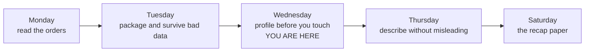
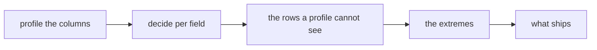

# Study notes: profile before you touch

Week 1, Day 3. Read these after the session, with your notebooks open beside them.

Written from the planned session and revised against the recording when it arrives.

---

## 1. The one sentence

Tuesday you cleaned orders someone had told you were dirty. Today nobody told you, so you profiled before touching anything, and every change you made became a line a reviewer can follow.

## 2. The map, and where today sat on it

The week's terrain, filling up one column per teaching day.



Today's own five stops:



| Where it sits | What Wednesday covered | Status |
|---|---|---|
| Phase 1, read and clean data | Profiling, missingness, coercion at scale, duplicates, identity rules, outliers, the decisions log, reconciliation | Worked, with your own hands on the keys |
| Phase 1, read and clean data | Descriptive statistics on the cleaned output | Named as coming tomorrow, not touched |
| Phase 2 onwards | The same pass in pandas: `isna`, `duplicated`, `to_numeric` | Mentioned once, so you know the pass returns |

The coverage line: Wednesday worked all seven subtopics on its row, and the outlier fence was given as a convenience for spotting the tail rather than as a test.

**The outcome tie.** Today is the first portfolio-grade act in the programme. Handed a file nobody prepared, you produced a cleaned dataset, a rejects file and a log a reviewer could follow, which is the moment the terminal outcome actually turns on.

**What was left out.** Imputation beyond a stated default, statistical outlier theory and standard deviation arithmetic. The nearest thing today did not cover is how to describe the cleaned data honestly, and that is tomorrow.

## 3. The profiler

Three counts, per field, before you change anything.

| Count | The question it answers | What it catches |
|---|---|---|
| present | Is this field being filled in? | An upstream system that quietly stopped sending it |
| converts | Is what is filled in usable? | Values that look fine and are not |
| distinct | Is this a category, a free text field, or an id? | An id column that repeats when it should not |

`present` minus `converts` is your work list. On the day's file that gap was four: four orders had an amount that looked filled in and would not become a number.

The three counts on the real file:

```
  field          present  converts  distinct
  order_id            50         0        49
  customer_id         50         0        47
  segment             50         0         4
  amount              48        44        46
  status              50         0         3
  order_date          50         0        20
  discount            11        11         9
```

`converts` reading zero on a text field is correct and not a failure. `segment` at 4 distinct and `status` at 3 tell you both are categories. `order_id` at 49 across 50 rows is the thing nothing else on this printout explains.

## 4. The deliberate failure that does not raise

Both of today's failures print a number and look fine. Neither one produces an error message, which is why today is harder than yesterday.

**The coerce-everything pass.** Replace every failure with a stated default of zero and the profile improves:

```
              RAW                          COERCED
amount    present 48  converts 44      present 50  converts 50
          distinct 46                  distinct 42
discount  present 11                   present 50
```

Thirty nine orders gained a discount nobody recorded. Six unreadable amounts became the number zero, and none of those orders had ever been zero.

**The count that tells you.** `distinct` fell from 46 to 42, because five different broken values collapsed into one. It is the only one of the three counts that can fall, so it is the only one that can carry bad news. A count that can only rise cannot warn you.

## 5. Missing is a decision

Three defensible answers, each with a written reason.

| Choice | Use when | It costs |
|---|---|---|
| Drop the record | The field is required and the value exists nowhere else | Every other field on that record |
| Use a stated default | Absence genuinely means something and you can say what | The ability to tell absent from present-and-equal-to-the-default |
| Keep and flag | You need the record and the gap must travel with it | Every downstream reader has to handle the flag |

On the same file, same day: `amount` was rejected when unusable because it is required, and `discount` was kept absent because absence means no discount was applied. Opposite treatment, both written down.

Filling `discount` with zero would have been defensible too. It costs you the ability to ever tell an order with no discount from one whose discount was zero. You are allowed to make that trade. You are not allowed to make it silently.

## 6. The rows a profile cannot see

The obvious duplicate check compares whole rows:

```
duplicate rows by whole-record comparison: 0
distinct order_ids: 49 across 50 rows
```

Nothing raised. Two numbers on two lines disagree, and only a person comparing them notices.

The pair:

```
KR4201  Retail-Core  1865  returned  2026-08-03
KR4201  Retail-Core  1865  returned  2026-09-14
```

Same id, same amount, same status, six weeks apart. One order exported twice with a wrong date, or a genuine repeat order reusing an id? The file cannot tell you and never could.

**An identity rule is something you state.** "Two rows are the same order when they share an order_id and an order_date" can be applied by somebody else, argued with, and written into a log. "They look like duplicates" cannot.

Four rules, three answers, on the same file:

| Rule | Groups | Rows it removes |
|---|---|---|
| order_id | 1 | 1 |
| order_id and order_date | 0 | 0 |
| order_id, amount, status | 1 | 1 |
| the whole row | 0 | 0 |

The rule is the decision and the number follows from it.

**Who decides.** Whoever owns the order book, with both rows on screen and your proposed rule underneath. Until then the pair is flagged, and the flag is a decision too.

## 7. Extremes

Sort the column and read the tail. That is the technique and it needs no arithmetic.

```
... 2895, 2930, 2990, 2995, 480000
```

One order is Rs 480,000 out of a Rs 561,145 total, which is 86 percent of the money in the file and over 160 times the next largest order.

It converts cleanly. It has a customer, a date, a segment and a status like every other order. Nothing about it is malformed, so it survives cleaning and goes forward as a question.

An outlier is a finding to investigate before it is a row to delete. In a business where a typical order is Rs 800 to Rs 3,000, an order of Rs 480,000 is either the most interesting customer in the file or a data entry error, and those need opposite responses.

## 8. What ships

```
the profiled dataset     the orders you would compute on
the rejects file         what you set aside, each with its reason
the decisions log        every decision, and why you made it
```

The first without the third is an opinion.

A log line that passes review:

```
field       finding                                  choice                    reason
amount      48/50 present, 44/50 convertible         reject the 6 unusable     amount is required
discount    11/50 present                            keep absent as absent     absence means no discount
order_id    1 id on two rows (KR4201)                keep both, flag the pair  owner decides the rule
amount      one order at Rs 480,000, 86% of total    keep, raise with owner    converts cleanly
```

**The reconciliation, one level up.** Tuesday it was input equals clean plus rejected. Today it also has to survive drops, defaults and any dedupe applied: `50 in = 44 profiled + 6 rejected`.

## 9. From the field

**HGNC, 2020.** About 27 human genes were formally renamed because spreadsheets silently coerced names like SEPT1 into dates. A 2016 audit had found gene-name errors in roughly a fifth of genetics papers with spreadsheet supplements.

Nobody chose to corrupt anything. A default was applied quietly, at scale, for years, and the damage was that it was invisible.

## 10. Model answers to today's interview questions

**"What do you look at first when a dataset arrives?"**

Three counts per field before changing anything: how many are present, how many convert to the type I need, and how many distinct values there are. The gap between present and converts is the work list, and distinct is the only one that can fall, so it is the one that warns me.

**"You coerced every failure to a default and the dataset looks clean. What did you lose?"**

The evidence. How many values failed, which ones, and the ability to tell a real zero from a rescued one. Present and converts both rise, distinct falls, and nothing left in the file says which rows I edited.

**"Two records share an id and disagree in one field. What do you do, and who decides?"**

State an identity rule that somebody else could apply, flag the pair rather than delete either row, and take it to whoever owns the data. Deleting one because it looked like a duplicate is the answer that gets me rejected.

**"The whale survived cleaning. Why?"**

Because cleaning removes what cannot be read, and that order reads perfectly in every field. Removing it would be an analysis decision wearing a cleaning decision's clothes, and it would be a decision I made alone about 86 percent of the revenue in the file.

**"40 records were dropped. Where does that fact live?"**

In the decisions log, with the count and the reason. The rejects file holds the rows. The log holds the decision, which is what somebody needs six months later.

## 11. The crux lines

Profiling is what you do before you have permission to change anything.

A count that only rises cannot warn you.

An identity rule is something you state, and whoever owns the data decides it.

An outlier is a finding to investigate before it is a row to delete.

The profiled dataset without its decisions log is an opinion.

## 12. Check yourself, with nothing to write

Eight questions. No notebook, no notes. Anything you cannot say in ten seconds names the section to re-read.

1. Name the three counts the profiler reports per field, and say which one can fall. (Section 3)
2. `amount` reads present 48, converts 44 on 50 rows. How many rows will the pass reject, and why is it not four? (Section 3)
3. Somebody coerces every failure to zero. Which two counts rise and which one falls? (Section 4)
4. `discount` is absent on 39 of 50 and `amount` on 2 of 50. Why do they get opposite treatment? (Section 5)
5. The dedupe says zero and the distinct id count says 49 of 50. What happened? (Section 6)
6. Four identity rules give three answers. What does that tell you about the rule? (Section 6)
7. One order is 86 percent of the money in the file. What do you do with it, and what goes in the log? (Section 7)
8. What ships at the close of today, and what could a reviewer do with it? (Section 8)

## 13. Read next, in this order

| What | Why it is next | Time |
|---|---|---|
| Khan Academy, mean, median and mode (verified 03 Sep 2026): https://www.khanacademy.org/math/statistics-probability/summarizing-quantitative-data/mean-median-basics/v/mean-median-and-mode | Tomorrow opens on it, and the whale you kept today is what makes it matter | About 10 minutes |
| Real Python, the csv module reference (verified 03 Sep 2026): https://realpython.com/ref/stdlib/csv | `DictWriter` and the field-name contract, which is what the companion file broke | About 15 minutes |
| LearnPython, 15 Python questions for data analysts (verified 03 Sep 2026): https://learnpython.com/blog/python-interview-questions-for-data-analyst/ | The cleaning and missing-value items, attempted before you look at the answers | About 30 minutes |

## 14. The words, and where each one starts mattering

| Term | What it means | Where it first bit |
|---|---|---|
| Profile | Three counts per field, taken before you change anything | The first file nobody prepared for you |
| present | How many rows hold anything at all in this field | `amount` at 48 of 50 |
| converts | How many of those become the type you need | The same column at 44 |
| distinct | How many different values the field holds, and the only count that can fall | 46 falling to 41 after the coercion |
| Present and unusable | present minus converts, the rows a presence check passes and arithmetic fails on | The separator, the space and the currency prefix |
| Identity rule | The fields you decided make two rows the same record | The pair sharing KR4201 |
| Decisions log | Field, finding, choice and reason, one line per cleaning act | The moment somebody asked why 44 and not 50 |
| Outlier | A value far from the rest, and a finding before it is a row to delete | The Rs 480,000 order |
| Reconciliation | Input equals clean plus rejected, asserted, and today also against the files on disk | The end of the pass |
