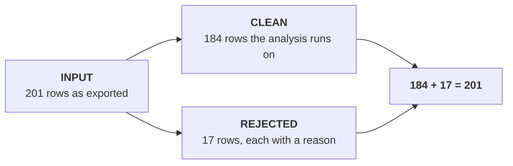
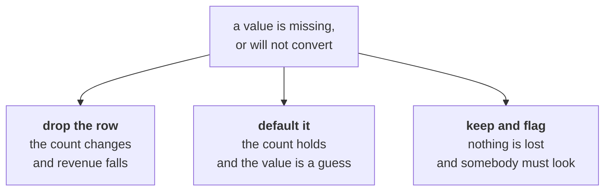
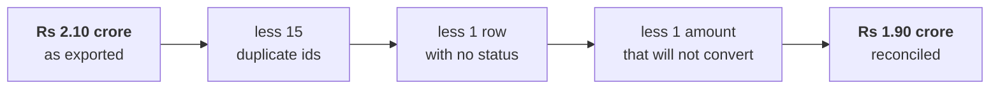

# Day 3: can we trust the numbers?

Kalpa Retail, Week 1 Wednesday. Read this after the session.

---

## The situation

Tuesday's finding reached the leadership group and Anand Iyer, the finance controller, replied to
all: "Your dashboard says Q1 was Rs 2.1 crore. Our books say 1.9. Until your numbers match ours,
Finance will not act on a drop measured from an ERP export. Send me a reconciliation."

The ERP team sent the raw exports with a note that the CSV was **stitched from two extracts during
the Q1 migration**. Marketing was impatient: if the drop is a data problem, a month is lost arguing.

**Both figures are computable from data somebody has.** The job is not to decide who is more senior.
It is to find the Rs 20 lakh.

---

## The mental model: input equals clean plus rejected



It is the only equation of the day and it is what makes a pass checkable. The rejected rows are a
deliverable and not a by-product, because an auditor asks about them by name.

---

## Profiling, before any decision

Three counts per field. Anything that disagrees with what you expected is a finding.

| Count | Question |
|---|---|
| Present | How many records carry the field at all |
| Convertible | How many of those become the type you need |
| Distinct | How many different values there are |

On Wednesday's export:

| Field | Present | Convertible | Distinct |
|---|---|---|---|
| `order_id` | 201 | not applicable | **186** |
| `amount` | 201 | **200** | many |
| `status` | **200** | not applicable | 3 |
| `customer_id` | 201 | not applicable | 69 |

Three anomalies in one table: fifteen ids appear more than once, one amount will not convert, one
record has no status. Nobody mentioned any of them in the note that came with the file.

---

## The three failures, and how to read them

### The file that is not there

```
FileNotFoundError: [Errno 2] No such file or directory: 'orders.csv'
```

Almost always the path rather than the file. The message quotes exactly what it looked for.

### The word where a number belongs

```
ValueError: invalid literal for int() with base 10: 'twelve'
```

One row in two hundred. Over a file, stopping on the first one means never learning how many there
are, so the conversion goes inside a `try` and the failures get counted.

### The transfer that was cut

```
json.decoder.JSONDecodeError: Unterminated string starting at: line 1397 column 15 (char 27679)
```

A quote opened and never closed. The line, column and character offset say exactly where the parser
gave up, so **open the file at that point before forming a theory**. The file ends mid-record: it
is not corrupt, it is complete and it stops early. You ask for it again rather than patching it.

---

## The identity rule

A duplicate is not a row that looks the same. It is a row that **is the same order**, and you say
which fields decide that before removing anything.

| Same | Different | Verdict |
|---|---|---|
| Every field | Nothing | A duplicate, and a whole-record check finds it |
| The order id | The order date | One order, twice. Somebody must pick a date. |
| Everything but the id | The id | Probably two real orders. Keep both. |

This file has exactly one of the middle kind, `KR-02151`, dated 25 September in one row and 2 August
in the other. A whole-record check leaves it in; a check on the id removes one and makes you choose.
That choice belongs in the log rather than in the code.

---

## Three answers to every missing value



There is no free option. The decisions log is what an auditor reads, and it is not your code.

| Field | Issue | Rows | Decision | Reason |
|---|---|---|---|---|
| `order_id` | Repeated | 14 | Drop the later occurrence | The migration re-ran a batch and every field on the pairs matches |
| `order_id` | Repeated, dates differ | 1 | Keep one, record which | One order recorded twice in the migration window |
| `status` | Empty | 1 | Reject | An order with no status fits none of the four readings of sales |
| `amount` | `twelve` | 1 | Reject | Any substitute value would be invented revenue |
| `amount` | Rs 4,80,000 | 1 | **Keep**, flagged | A real corporate order |

**The last row is the one an auditor asks about.** A log with only rejections is a log from a pass
that never made a judgment.

---

## The bridge



It lands on Finance's number. **Anand was right**, and the dashboard was counting a migration twice.

A bridge that does not land has a step missing, and the missing step is the finding. Adjusting a
figure so two systems agree is the difference between reconciling and fabricating.

---

## What moved, and the sentence that says so

| Measure | Tuesday, as exported | Wednesday, reconciled |
|---|---|---|
| Q1 revenue | Rs 2.10 crore | Rs 1.90 crore |
| Revenue change | down 11.0 percent | **down 1.6 percent** |
| Orders per customer | down 24.6 percent | down 12.9 percent |
| Retail-Plus | down 49.0 percent | **down 33.3 percent** |
| Retail-Core | down 5.3 percent | down 2.5 percent |

The headline drop was mostly the migration. **The finding survives and its number got smaller.**
Retail-Plus still falls more than ten times as hard as Retail-Core.

> "Your 1.9 is correct. The export carried 201 rows against 186 distinct orders, because the Q1
> migration re-ran a batch. Removing the repeats, one row with no status and one amount that will
> not convert gives Rs 1.90 crore against your books. Tuesday's finding moves with it: the revenue
> drop falls from 11 percent to 1.6, and the Retail-Plus frequency problem survives at 33 percent
> against Retail-Core's 2.5, which is smaller than I reported and still the thing to act on."

**The reputational risk is never the wrong number. It is the wrong number that stayed up after you
knew.**

---

## Glossary

| Term | What it means here |
|---|---|
| Profiling | Counting present, convertible and distinct per field, before any decision |
| Reconciliation | Showing how one system's figure becomes another's, step by step |
| Revenue bridge | That reconciliation drawn as steps, each carrying its own number |
| Rejects log | Every row removed, with the reason it was removed |
| Decisions log | Every choice made during cleaning, with its reason and row count |
| Identity rule | The fields that decide whether two rows are the same order |
| Near-duplicate | Two rows sharing an id and differing on something else |
| Truncated file | A complete file that stops early, usually a cut transfer |
| Outlier | A value far from the rest, which may be entirely real |
| Default | A value substituted for a missing one, and a decision to defend |

---

## The questions this day now makes answerable

- How do you handle missing data?
- Finance and your dashboard disagree. What do you do?
- How do you find duplicates, and what makes two records the same?
- Everything read from a CSV is a string. What breaks, and where do you convert?
- An auditor asks why you dropped 14 rows. Walk them through it.

---

## What tomorrow does with this

You now have clean numbers and a gap of 33 percent in Retail-Plus. Tomorrow Meera asks whether that
gap is real at all, or the kind of difference that turns up between any two quarters by chance.

---

## Reading, if you want it

- Real Python, Reading and Writing CSV Files (verified 03 Sep 2026): https://realpython.com/python-csv/
- Corey Schafer, Working with JSON data (verified 05 Sep 2026):
  https://www.youtube.com/watch?v=9N6a-VLBa2I
- Python docs, `json` and `JSONDecodeError` (verified 03 Sep 2026):
  https://docs.python.org/3/library/json.html
- Real Python, LBYL against EAFP (verified 03 Sep 2026): https://realpython.com/python-lbyl-vs-eafp/
