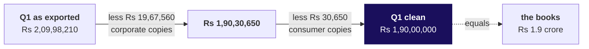

# Which Q1 figure is right?

**Week 1, Wednesday. Study notes, read after the session.** Profile before you total, log every
failure, say what makes two rows one order, keep what is real, reconcile in rows and in rupees, and
recompute what you reported. Reading time: about 30 minutes.

---

## What you can now do

1. You can read a CSV and a JSON feed, and say why every value that arrives is text until you
   convert it on purpose.
2. You can profile a file field by field, present, convertible and distinct, and read each count
   as a business fact.
3. You can convert with a rejects log, so a failure is counted and kept and never turned into a
   number.
4. You can state an identity rule, find the rows that break it, and choose which copy of a pair
   stays.
5. You can make the three-way decision for a missing value, drop, default, or keep and flag, and
   defend keeping a large order that is real.
6. For each of those techniques, you can lay out two to four ways a team could answer the question,
   size them on the file, choose one and name the fact that would change your choice.
7. You can reconcile a cleaning pass in rows and in rupees, draw the revenue bridge from one total
   to another, and say what cleaning changed in a finding you had already reported.

---

## Where this sits

**What the session covered.** Six chapters, each a harder form of Anand's question, each with its
own notebook: what the ERP sent, the rows that repeat, the copy that stays, what is missing or
malformed, the bridge to the books with Tuesday recomputed, and the log the analyst audits. Each
chapter set out two to four ways to answer its question, sized them on the export, chose one and
reached the same number a second way. Met in
passing and given two minutes each: `FileNotFoundError`, the `ValueError` from `int()`, and the
`JSONDecodeError` from a feed cut part way through. Left for later: statistics beyond counts and the
median, imputation beyond a stated default, and pandas.

**Where the week is.** Monday drew the revenue tree on thirty orders. Tuesday split two quarters by
segment and found the fall in Retail-Plus frequency. Today asked whether the numbers under that
finding could be trusted. What revenue is, who Anand is and why Finance and Marketing pull in
different directions are in the retail dossier,
`content/W01/D1/study-notes/C2_W01_D01_domain_retail_STUDENT.md`, which these notes assume. One
point from it matters today: the dossier's net revenue subtracts cancellations and returns, while
both of Anand's figures in this case count booked value, every order whatever its status. The two
figures share a definition and disagree on rows, and checking the definition first was part of the
ask. Thursday asks whether the finding that survived is real or the wobble every quarter shows, and Week 2 runs this whole pass again in SQL and in pandas.

```mermaid
flowchart LR
    M["<b>Mon</b><br/>the tree"] --> T["<b>Tue</b><br/>which branch moved"]
    T --> W["<b>Wed</b><br/>can we trust it"]
    W --> H["<b>Thu</b><br/>is it real"]
    H --> F["<b>Fri</b><br/>rebuild it alone"]
    classDef bet fill:#1A0F5C,stroke:#1A0F5C,color:#FFFFFF
    class W bet
```

---

## The picture to remember: the bridge

A reconciliation is a walk from one total to another, one move per cause, each move backed by the
rows that carry it. Today's walked from the export to the books.

| Step | Rupees | What carries it |
|---|---|---|
| Q1 as exported, every amount that converts | Rs 2,09,98,210 | 114 Q1 rows, the dashboard's 2.1 crore |
| Less copies of corporate orders | -Rs 19,67,560 | Two rows |
| Less copies of consumer orders | -Rs 30,650 | Eleven rows, plus one copy whose amount never converted |
| Q1 clean | Rs 1,90,00,000 | 100 orders, the books to the rupee |

```mermaid
flowchart LR
    E["<b>Q1 as exported</b><br/>Rs 2,09,98,210"] -->|"less Rs 19,67,560<br/>corporate copies"| A["<b>Rs 1,90,30,650</b>"]
    A -->|"less Rs 30,650<br/>consumer copies"| B["<b>Q1 clean</b><br/>Rs 1,90,00,000"]
    B -.->|"equals"| K["<b>the books</b><br/>Rs 1.9 crore"]
    classDef bet fill:#1A0F5C,stroke:#1A0F5C,color:#FFFFFF
    class B bet
```

The two numbers on either side of the bridge were both honest arithmetic. The dashboard added every
row the export held; the books counted every order once. The bridge is the argument that turns "we
disagree" into "here is exactly why".

---

## Chapter 1, worked: what the ERP actually sent

**The need.** Anand's metric is Q1 revenue to the rupee, and every later number stands on the count
of what arrived. If the note to him says the dashboard is right and it is not, his analyst finds it
and discounts everything else the team sends. Target Canada is the public version of skipping this
step: it launched in March 2013, lost almost a billion dollars in its first year and in January
2015 announced it would close all 133
stores (CBC News,
15 January 2015). Salsify's summary of the Canadian Business investigation puts the accuracy of that
product data at about 30 percent (both checked 30 September 2026).

**The options, sized on the export.**

| Option | What it reads | Time | What it catches |
|---|---|---|---|
| Total and compare | 201 amounts | under a second | stops on an unreadable amount, and says nothing about why |
| Scroll it | 2,010 cells by eye | about 17 minutes, at half a second a cell | misses a repeat a hundred rows from its twin |
| Sample 20 rows | 20 rows | about 10 minutes of tying out | a 13 percent chance to draw both copies of a pair, the only way a repeat shows, and 10 percent to meet the bad amount |
| Profile every field | 2,010 values by code | under a second | every count that does not fit |

The minutes are illustrative; the chances are exact, since 15 of 201 rows are repeats and one amount
is unreadable. **The call:** profile every field, then read only the rows it points at. **What would
switch it:** a file with no field that names an order, where nothing can be counted distinct.

**The build.** `csv.DictReader` hands back every value as text, so the first amount is `'2200'`, the
string. The profile asks three questions of every field: is a value present, does it convert to the
type the field needs, how many distinct values does it hold. Three counts do not fit 201 rows:
`order_id` is distinct on 186, `amount` converts on 200, and `status` is present on 200. The
`discount` field is present on 143, which is Tuesday's optional field and expected.

**The trap: the largest order, sorted as text.** Anand's analyst audits the largest orders first,
since one of them can carry more money than a hundred small ones. A hurried sort of Q2 by the amount
as read returns `'970', '970', '952000'`, and the note names Rs 970 as the largest Q2 order. Text
sorts character by character, so `'970'` beats `'2945460'` because 9 comes after 2. The check is a
business question: can the largest Q2 order be smaller than the smallest Business order, Rs 2,03,060,
when Business sells in lakhs? The fix is to convert once, at the door, with `convert()`, which returns
the number or the reason it failed. Sorted as numbers, the top three carry Rs 62,11,460 instead of
Rs 9,53,940, and the rejects log holds the one amount that fails. Over the amounts that convert, Q1
reads Rs 2,09,98,210: the dashboard's 2.1 crore is honest arithmetic on this file.

**The second route.** A `Counter` over the order ids finds the same 186 distinct ids and 15 rows
beyond one per id, and the length of the rejects log equals the profile's one failure. The profile
is the route for a first look; the `Counter` keeps how often each id appears, which is where
chapter 2 starts. The JSON feed yields 119 complete records before the cut and is a witness to
compare against, never a replacement.

---

## Chapter 2, worked: the rows that repeat

**The need.** The ERP team's note said the CSV was stitched from two extracts during the Q1
migration. If orders were exported twice, Q1 revenue is inflated, and so is every per-customer rate
Tuesday computed. A wrong answer either keeps Rs 20 lakh that was never earned or deletes real
orders from Finance's books. Starbucks met the customer's side of the same mistake on 22 and 23 May
2009, when a processing fault billed some card customers twice across about 7,800 stores and the
company repaid about one million customers (NBC News and AP, 10 June 2009, checked 30 September 2026).

**The options, sized on the export.**

| Key | Rows flagged | Q2 after | Copies missed | Real rupees removed |
|---|---|---|---|---|
| Whole record, as loaded | 0 | Rs 1,87,03,710 | 15 | Rs 0 |
| Whole record less the line | 13 | Rs 1,87,03,710 | 2 | Rs 0 |
| order_id | 15 | Rs 1,87,00,000 | 0 | Rs 0 |
| Fuzzy: same customer and amount, within 60 days | 15 | Rs 1,69,29,000 | 1 | Rs 17,71,000 |

**The call:** the order id, because the ERP issues one per order and never reuses it. **What would
switch it:** two systems issuing their own ids. The key would then be the system plus the id. The
fuzzy match also costs the most: without a key to group on, every row is compared with every other,
20,100 pairs here and about 200 lakh crore on a file of 2 crore rows, which is why record linkage
blocks by a field such as city before it compares anything.

**The build.** Q1 holds 114 rows for 100 orders and Q2 holds 87 for 86. Grouped by `order_id`, 15
orders appear exactly twice, 14 of them in Q1, and none three times. The second copies sit together
at the end of the file, where the second extract was appended.

**The trap: a dedupe that reports zero.** Chapter 1 taught the rejects log to cite a file line, so
every record carries one. A whole-record dedupe on those records reports 0 duplicates and leaves Q1
at Rs 2,09,98,210, and the note would tell Anand his books are Rs 20 lakh short. The file line is
where a row sat, never what the order is, so leaving it in the key makes every row unique. The check
is chapter 1's: 201 rows and 186 ids cannot both be true of a file with no repeats. The fix is the
business key.

**The harder form.** The fuzzy match flags 15 rows, as many as the order id, and the two sets share
only 14. The fuzzy match calls a real Business order a copy because the same customer spent the same
Rs 17,71,000 again within 60 days, and it misses a pair whose amounts differ. A count that matches
is not a match.

**The second route.** Rows less distinct ids, per quarter, gives 14 and 1, the same 15 the groups
gave. The arithmetic says how many in one line; only the groups say which, and only they can feed a
log.

---

## Chapter 3, worked: the copy that stays

**The need.** Thirteen of the fifteen pairs are identical, and either row may stay. Two are not: one
pair's first copy has an amount that does not convert, and one pair's copies disagree on the date.
Anand's analyst ties out to the rupee, so a choice that loses one order's amount turns the
reconciliation into a finding against the team. India's GST system writes an identity rule into
law for business invoices: the Invoice Registration Portal rejects an invoice already reported
under the same supplier GSTIN, invoice number, document type and financial year (GSTN e-invoice FAQ,
version 1.4), and since 1 August 2023 that applies to every business above Rs 5 crore of turnover
(Notification 10/2023-Central Tax), which includes a seller like Kalpa's Business segment (both
checked 30 September 2026).

**The options, sized against the books.**

| Survivor | Q1 | Against the books | Unreadable orders kept |
|---|---|---|---|
| First in the file | Rs 1,89,98,210 | -Rs 1,790 | 1 |
| Last in the file | Rs 1,90,00,000 | Rs 0 | 0 |
| The copy that validates, then the first | Rs 1,90,00,000 | Rs 0 | 0 |
| Keep both, escalate every pair | open | open | 15 questions to the ERP team |

**The call:** the copy that validates, then the first, and escalate only the pair whose valid copies
disagree. Last lands on the books here because of the order the migration appended its rows, which
is luck. **What would switch it:** the ERP team saying the second extract was a corrected re-run;
then last is the rule, for a reason.

**The build.** The rule groups rows by `order_id`, keeps the first copy whose amount converts, and
logs every other row with its line, the rule, the reason and the line of the row that stayed. On the
export it keeps 186 orders and sets 15 rows aside. Q1 moves to Rs 1,90,00,000, the books to the
rupee, and Q2 to Rs 1,87,00,000. The amount chapter 1 could not read was one copy of a pair whose
twin carries the value, so no revenue left with it.

**The trap: Q1 ties, so the pass must be right.** The whole record less the line lands Q1 on
Rs 1,90,00,000, equal to the books. It still keeps 188 rows for 186 orders: one Q2 order is counted
twice, so Q2 reads Rs 1,87,03,710 and the Retail-Plus Q2 order count is one too many, and an order
with an unreadable amount sits in the clean file as an order. Q1 ties only because the two pairs it
misses cost Q1 nothing. The check is rows kept against distinct ids. A tie in rupees on one quarter
proves that quarter's rupees and nothing about its rows.

**Rows against rupees.** Of the Rs 19,98,210 set aside in Q1, two Business rows carry Rs 19,67,560,
about 98 percent, while eleven Retail-Plus rows carry Rs 27,760. Anand's gap is two corporate orders
counted twice. Tuesday's finding is another conversation: most extra rows sit in Retail-Plus in Q1,
the segment and quarter Tuesday compared.

**The second route.** A dictionary keyed by id, built from the rows whose amounts convert, keeps the
same 186 orders at the same amounts. It chooses silently and logs nothing, so it is the check on the
rule's totals and never the pass.

---

## Chapter 4, worked: what is missing or malformed

**The need.** One kept order has no status, and Operations reads the delivered share of orders every
week. Fifty-five kept orders have no discount. And the pass needs a policy for an amount that does
not convert, because the next export will carry one with no twin. On 12 December 2014 a repricing
tool set hundreds of Amazon UK items to 1p for about an hour, and Amazon said most orders were
cancelled once the error was spotted (BBC News, 15 December 2014, checked 30 September 2026): a value
that fell to a default was treated as real by everything downstream.

**The options for the missing status, sized on Q2.**

| Decision | Q2 revenue | Delivered | Delivered share | What it claims |
|---|---|---|---|---|
| Drop the order | Rs 1,86,98,150 | 57 of 85 | 67.1% | the order never happened |
| Default to delivered | Rs 1,87,00,000 | 58 of 86 | 67.4% | the order reached the customer |
| Impute from the customer's last order | Rs 1,87,00,000 | 58 of 86 | 67.4% | history decides this order |
| Keep and flag | Rs 1,87,00,000 | 57 of 86 | 66.3% | it happened; its fate is unknown |

**The options for an unreadable amount.** Coercing it to zero misses the books by Rs 1,790 and
leaves an order at Rs 0 in the clean file. Rejecting it to the log leaves that order's rupees out of
revenue until someone repairs it. Reading the text as a number is a guess: on an invented pair whose
first copy says `fourteen` and whose twin says 1,400, the word reads as Rs 14, Rs 1,386 short.
Repairing it from an independent copy is exact.

**The calls:** keep and flag the status; reject the amount to the log by default and repair it only
from a source that could not have copied the error. **What would switch them:** a delivery system
that can be asked, which turns the flag into a lookup; and an independent source carrying the value,
which turns the reject into a repair. A second export cut from the same extract never counts, since it
copies the defect.

**The build.** Keep and flag leaves Q2 at Rs 1,87,00,000 and the delivered share at 66.3 percent, and
writes one line in the flags log. For the discount, reading 55 blanks as zero pulls the average from
about Rs 67 over the 131 orders that carry one to about Rs 47 over all 186. Revenue does not need
the field, so it stays blank, and any discount figure is quoted over the orders that carry one, with
the count beside it. This was Tuesday's trap, met again in a new place.

**The trap: coerce every failure to zero.** The `ValueError` stops the loop, so a helper turns
anything unreadable into 0. The profile then reports 201 of 201 amounts convertible, the rejects log
is empty, and after the first-copy dedupe Q1 reads Rs 1,89,98,210, which rounds to 1.9 crore. A zero
is a claim that Kalpa sold that order for nothing. Once the unreadable copy is worth Rs 0 it passes
as valid, the identity rule can no longer tell it from its twin, and the first copy wins. The check:
can a Kalpa order be worth nothing, when the smallest real order in the export is Rs 680? And the
failure count fell from one to zero while nothing was fixed.

**The harder form: repair only from a witness.** The JSON feed agrees with the clean file on 118 of
its 119 amounts. The one it does not confirm is unreadable in the feed as well, because the feed was
cut from the same extract. The CSV's second extract carried the value, and the identity rule already
used it.

**The second route.** Profile the clean file and compare with the logs: one status missing in both,
no amount that fails in either, 55 discounts missing in both. The profile finds defects; the log
shows them.

---

## Chapter 5, worked: the bridge to the books

**The need.** Anand asked which Q1 figure is right and how the team knows. Marketing asks whether
Tuesday's finding survives, because a rescue campaign for Retail-Plus is waiting on it. In 2014
Tesco said it had overstated half-year profit guidance by about GBP 250 million, mainly by
recognising supplier income early; its investigation then bridged the figure to GBP 263 million,
split by period, GBP 118 million of it in the first half (BBC News, 22 September 2014; Tesco interim
results, 23 October 2014; both checked 30 September 2026). A retailer's own number was wrong, and
the fix was a bridge: how much, from which period, for what cause.

**The options, sized on the export.**

| Proof | Rows behind it | Closes to the books | Says why |
|---|---|---|---|
| Take the books' figure | none | no | no |
| The difference of the totals | two totals | as a total | no |
| A bridge by cause | 15 logged rows | to the rupee | yes |
| Rebuild from the JSON feed | 119 records | Rs 1,790 short | no |

**The call:** the bridge. The feed carries the same unreadable amount and holds only 19 of Q2's 86
orders. **What would switch it:** a bridge that does not close. Then the gap itself is the finding,
and it may sit in Finance's books.

**The build.** The bridge starts at Q1 as exported, Rs 2,09,98,210, takes away the copies of two
corporate orders, Rs 19,67,560, and the copies of consumer orders, Rs 30,650, and lands on
Rs 1,90,00,000. The unreadable amount needs no move, since it was never in the exported total and its
twin stayed. The notebook draws it with the axis starting at Rs 1.88 crore, so the Rs 30,650 move
stays visible; the caption says so.

**Tuesday recomputed.**

| Number | As Tuesday reported | On clean data |
|---|---|---|
| Revenue, Q1 to Q2 | -11.0% | -1.6% |
| Retail-Plus orders per customer | 2.32 to 1.18, -49.0% | 1.82 to 1.18, -35.0% |
| Retail-Core orders per customer | -5.3% | -2.7% |

The finding stands, smaller, because most copies sat in Retail-Plus in Q1. The smaller number goes
first in the note.

**The trap: the real bulk order removed as an outlier.** Sorted as numbers, Q2's largest order is
Rs 29,45,460, 1.66 times the next. Removing it gives Q2 Rs 1,57,54,540 and a 17.1 percent drop, and
Marketing would fund a rescue for a fall that never happened while Finance, whose books hold that
order, rejected the reconciliation. Size alone proves nothing about this record: it is a Business order, its customer ordered
in both quarters, every field is valid. A fence over the whole quarter would flag all 17 Business
orders, since it mixes a Rs 2,000 basket with a corporate order. The fix is to keep it, flag it and
show Q2 both ways.

**The second route.** Summing the kept Q1 orders reaches Rs 1,90,00,000 from the bottom, the same
number the bridge reached from the top, and counting Retail-Plus orders per customer with a
dictionary gives 1.82 and 1.18 again. Bottom up is the check anyone can run; top down is the proof,
since only the bridge says what each rupee of the gap was.

---

## Chapter 6, worked: the log the analyst audits

**The need.** Anand's analyst checks the reconciliation tonight, and an auditor may ask next quarter
why any row was dropped. The metric is a pair of control totals, rows and rupees, tying the export
to the clean file to the books, with every row that left traceable to a rule. At Patisserie Valerie,
a UK cafe chain, the administrators put the accounting hole at GBP 94 million in March 2019, and in
September 2021 the Financial Reporting Council fined its former auditor GBP 4 million, reduced to
GBP 2.34 million, for missing red flags across three years of audits (BBC News, 15 March 2019; FRC,
27 September 2021; both checked 30 September 2026).

**The options, sized for the analyst at an illustrative 30 seconds a line.**

| Hand-over | Lines | Ties rows | Ties rupees | Replayable |
|---|---|---|---|---|
| The clean file alone, read against the 201 raw rows | 387 | no | no | no |
| The file and a count | 1 | yes | no | no |
| Logs, decisions and control totals | 23 | yes | yes | yes |
| A full diff | 201 | yes | only by hand | no |

**The call:** the logs with the control totals, about twelve minutes of reading. **What would switch
it:** an external auditor who must re-derive every row, and then the diff goes beside the logs.

**The build.** Five decisions go in the decisions log, one line each with the rows it touched and the
Q1 rupees it moved: the identity rule, which moves all Rs 19,98,210; rejecting an unreadable amount;
the flagged status; the discount kept unknown; the bulk order kept and flagged. The set-aside log is
written with `csv.DictWriter` and the decisions with `json.dump`, then both are read back and
compared, because a log that lives only in a notebook reaches nobody.

**The trap: rows tie, rupees do not.** A colleague removes repeated ids first, keeping the first
copy, then converts and rejects what fails. The log looks perfect: 201 = 185 + 16, Rs 20,00,000 set
aside in Q1, which reads like Anand's gap, and a clean Q1 of Rs 1,89,98,210 that rounds to 1.9.
To the rupee it is Rs 1,790 short, because keeping the first copy kept the unreadable one, rejected
it, and set aside the twin that carried the value. A row reconciliation proves nothing vanished; it
cannot prove the right rows stayed. Two checks catch it: the books against the clean Q1, and a
rejected order whose twin sits in the set-aside log with a value.

**The auditor's 14.** Fourteen Q1 rows are set aside, every one with a kept twin under the same id,
and Q1 ties in rows, 114 = 100 + 14, and in rupees, the bridge. "Set aside with a reason" replaces
"dropped".

**The second route.** Replay the log: the raw export less the logged lines rebuilds the clean file
exactly, 186 orders at the same amounts. The control totals are the quick test; the replay is the
test for an auditor who trusts nothing.

---

## The six lines worth keeping

1. Profile before you total: present, convertible, distinct, for every field.
2. Say what makes two rows one order before you count duplicates.
3. Keep the copy that validates, and log every row you set aside.
4. A failure is logged, never turned into a number; large is not wrong.
5. Reconcile twice, in rows and in rupees, to the books.
6. Recompute what you reported, and say what changed, the smaller number first.

---

## Where this shows up in the work

- **Month-end close.** Finance reconciles the sales system against the ledger every month, in counts
  and in money. The first question from any controller is the one Anand asked.
- **Migrations.** Moving data between systems re-runs batches, stitches extracts and adds load
  columns. Every migration plan that is taken seriously has a reconciliation step, and it runs on the
  business key.
- **Payments.** A gateway retries a payment and posts it twice. Week 2 meets this in a join, where a
  duplicate key multiplies rows instead of adding them.
- **Dashboards.** A dashboard is a total nobody reconciled until somebody does. The analyst who can
  build the bridge is the one Finance calls next time.

---

## Try this yourself

Five questions, no writing needed; answer each in your head, then check against the sections above.

1. An export reports 400 of 400 amounts convertible and the sorted amounts start `0, 0, 350`. What do
   you ask first?
2. A dedupe on a table with a `loaded_at` column reports 0 duplicates. What do you count next?
3. Two rows share an order id; one amount reads `n/a`, the other Rs 2,600. Which stays, and what goes
   in the log?
4. Rows reconcile and rupees are Rs 900 short of the books. Where is the Rs 900 most likely to be?
5. Cleaning shrank a finding from -40 percent to -25 percent. What leads the note?
6. A customer table arrives from two apps that each number customers from one. Which identity rule
   do you choose, and what would make you switch?

---

## Where this gets tested

Fifteen questions: the row's five, seven follow-ups an interviewer uses to push, and three design
questions that ask for a choice, a sizing and the fact that would change it. Tags: [S] staple
asked everywhere, [F] frequent in GCC and product screens, [SV] service-major screen opener, [D]
differentiator. This programme's own calibration for 0 to 3 year Indian-market candidates.

**[S] How do you handle missing data?** "First I measure it per field: present, convertible,
distinct. Then I ask what the absence means, because a blank discount may mean no discount or a
discount nobody recorded, and a missing status means we do not know the order's fate. Then one of
three decisions, each written down with its reason and sized on what it moves: drop the record, fill
a stated default, or keep it and flag it. Imputation, filling a value from other records, belongs
to model features, with a column saying which values were filled; it never fills booked money. Today reading 55 blank discounts as zero pulled the average
from about Rs 67 to Rs 47, so they stayed unknown. For money I never fill, since the books either
have a value or they do not." Tested: whether you
treat missingness as a decision. Weak answer: "I fill with the mean."

**[S] Finance and your dashboard disagree; what do you do?** "I assume both numbers are honest
arithmetic on different inputs, so I find the difference rather than pick a side. I get Finance's
figure to the rupee with its definition, profile my source, and build a bridge from my number to
theirs, one move per cause, each backed by the rows that carry it. I reconcile twice, in rows and in
rupees. When the bridge closes I say which figure is right and why, fix the source, and recompute
anything that was reported from the wrong number." Weak answer: "Finance is always right."

**[F] How do you find duplicates, and what makes two records the same?** "The identity rule first:
what the business says makes two records one thing. For an order it is the id the system issues. I
count rows against distinct keys, keep one row per key by a stated preference, usually the copy whose
fields validate, and log every row set aside with its reason. Then I weigh them in money as well as
rows, because two rows can carry more than a hundred." Weak answer: "drop_duplicates()."

**[F] Everything read from a CSV is a string; what breaks and where do you convert?** "Arithmetic,
comparison and sorting all break or silently do the wrong thing: `'900' < '1200'` is False and `max`
on text amounts returns the wrong order. I convert once, at the boundary, in one function that returns
the value or the reason it failed, and I count and log failures. I never turn a failure into a
default without writing that decision down."

**[D] An auditor asks why you dropped 14 rows; walk them through it.** "They were set aside, not
dropped, and each is in the log. Fourteen Q1 rows share an order id with a row that stayed. The
identity rule is the order id, because the ERP issues one per order. For each pair I kept the copy
whose fields validate. Two corporate copies carry Rs 19,67,560 and the rest Rs 30,650. The rows
reconcile, 114 Q1 rows in and 100 kept, and the rupees bridge to your books exactly."

**[F] A dedupe returns zero duplicates. Do you believe it?** "Only after I count distinct business
keys against rows. If they disagree, the dedupe compared on something that makes every row unique: a
load timestamp, a surrogate key or a line number."

**[S] The largest order is 1.66 times the next. Do you remove it?** "I check the record before its size.
A valid id, a real account with other orders and fields that convert make it revenue. I keep it, flag
it, and show the result with and without it. Today, removing it would have turned a 1.6 percent dip
into a 17.1 percent fall."

**[F] Your row counts reconcile. Are you done?** "No. Rows prove nothing vanished; rupees prove the
right rows stayed. Today a pass reconciled 201 rows and was Rs 1,790 short of the books, because it
kept an unreadable copy and set aside the one that carried the value."

**[F] A JSON file fails to parse at a named line. What do you do?** "Read the last line of the error,
open the file at that line and column, and say what is there: a cut transfer, a stray character, two
documents merged. Then decide whether the complete part is usable as evidence, and ask for a resend
of the rest. I never skip the file silently."

**[SV] Walk me through how you clean a file you have never seen.** "Profile every field, convert with
a rejects log, apply the identity rule, make the drop, default or flag decision for each remaining
defect with a reason, reconcile rows and money against a trusted total, and recompute anything that
was reported from the raw file."

**[D] Cleaning shrank the finding you reported yesterday. What do you tell the stakeholder?** "The
smaller number first, what changed and why, and whether the decision it supported still holds. Today
the Retail-Plus fall went from 49 to 35 percent: still the largest fall, which Thursday tests for chance, and
now on numbers Finance agrees with."

**[D] How do you know Finance's number is right, and not yours?** "Neither is right by rank. The bridge
closes to the books because every move is backed by rows I can show. If it had not closed, the gap
would itself be a finding to put in front of Finance's analyst, with the rows and without an accusation."

**[D] Design. Order id, whole record or fuzzy, for customers from two apps?** "Neither app's id
identifies a person across both, and two systems rarely write a record identically, so the id and the
whole record are out. I would clean phone and email the same way on both sides and match on those,
block by city so each record is compared only within its own city, which across six cities cuts the pairs to about a sixth, and send every match nobody has confirmed to
a person. On Kalpa's orders a fuzzy match on customer and amount within 60 days flagged as many rows as the order id
and merged a real Rs 17,71,000 order, which is why I would not trust it unreviewed. What would switch
me back to a key is one customer id issued by one system."

**[D] Design. Coerce, reject or repair a malformed amount?** "Reject it to a log by default. A coerced
zero is a false value, and it hides the defect from every later check: on Kalpa's export it let the
unreadable copy pass as valid and cost Rs 1,790 against the books. I repair only from a source that
could not have copied the error, and I name the source in the log. I would switch to a repair rule
only for a known format problem, such as a thousands separator, where the rule is exact and tested."

**[D] Design. Prove a figure with a bridge, or rebuild it from a second source?** "A bridge, when a
log backs each move, because it says why as well as how much. A rebuild is worth running only when
the second source is independent and complete; Kalpa's JSON feed was cut from the same extract,
carried the same unreadable amount and held 19 of Q2's 86 orders, so it could confirm and never
prove. If a bridge does not close, the gap is the finding, and it may sit in Finance's books."

---

## Glossary

| Term | What it means here | Where it appeared | Example |
|---|---|---|---|
| Profile | Three counts per field before any total: present, convertible, distinct | Chapter 1; notebook 01 | order_id present on 201 rows, distinct on 186 |
| Rejects log | Every row whose value failed, with its line, field and reason | Chapter 1; notebooks 01 and 04 | One amount that would not convert |
| Identity rule | What makes two rows the same thing | Chapter 2; notebook 02 | order_id, the ERP's key |
| Keep and flag | Keep a record whose value is unknown, marked, out of counts that need it | Chapter 4; notebook 04 | A Q2 order with no status |
| Coercion | Turning a value that fails into a default; a claim, never a fix | Chapter 4; notebook 04 | An order at Rs 0 |
| Fence | A cut-off that marks a value to question, never to delete | Chapter 5; notebook 05 | Three times the median Q2 order |
| Control totals | A count and a sum computed at both ends of a transfer and compared | Chapter 6; notebook 06 | 201 rows and Rs 2,09,98,210 in |
| Revenue bridge | One total walked to another, one move per cause | Chapter 5; notebook 05 | Rs 2,09,98,210 to Rs 1,90,00,000 |
| Duplicate | A second row for the same thing under the identity rule | Chapter 2; notebook 02 | 15 rows beyond one per order |
| Survivor rule | Which copy of a repeated record stays | Chapter 3; notebook 03 | The copy that validates, then the first |
| Outlier | A value far from the rest; a question about its record | Chapter 5; notebook 05 | The largest Q2 order |
| Reconciliation | Proof the clean data is the same data, in rows and in rupees | Chapters 5 and 6; notebooks 05 and 06 | 201 = 186 + 15 |
| Decisions log | Every cleaning rule with the rows and rupees it moved | Chapter 6; notebook 06 | Missing status: keep and flag |
| Replay | Rebuilding the clean file from the raw export and the log alone | Chapter 6; notebook 06 | 186 orders at the same amounts |
| Booked value | Every order at its price, whatever its status, before returns and cancellations | The ask; chapter 5 | Both Rs 2.1 crore and Rs 1.9 crore |
| Set aside | Removed from the clean file with a logged reason and the line of the row that stayed | Chapters 3 and 6 | 15 rows |

---

## Go deeper

| Order | What | Time | Why this one |
|---|---|---|---|
| 1 | Real Python, Reading and Writing CSV Files, https://realpython.com/python-csv/ (verified 03 Sep 2026) | 30 minutes | The csv module and DictReader, which read everything as text |
| 2 | Corey Schafer, Working with JSON data, https://www.youtube.com/watch?v=9N6a-VLBa2I (verified 30 Sep 2026) | 20 minutes | Loading and writing JSON, and what the parser expects |
| 3 | Python documentation, the json module and JSONDecodeError, https://docs.python.org/3/library/json.html (verified 30 Sep 2026) | 15 minutes | What the error's line and column mean |
| 4 | Real Python, LBYL against EAFP, https://realpython.com/python-lbyl-vs-eafp/ (verified 03 Sep 2026) | 15 minutes | Why `convert()` tries the conversion and handles the failure |
| 5 | Automate the Boring Stuff with Python, 3rd edition, chapters 10 and 18, https://automatetheboringstuff.com/3e/ (verified 30 Sep 2026) | 45 minutes | Files and the CSV and JSON chapters, worked slowly |
