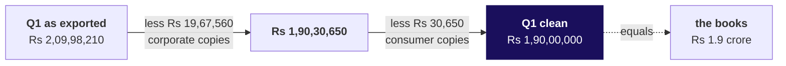

# Which Q1 figure is right, the dashboard's Rs 2.1 crore or the books' Rs 1.9 crore, and how do we know?

**Week 1, Wednesday. Study notes, read after the session.** Reading time: about 30 minutes.

---

## What can you do now that you could not this morning?

1. You can say why every value read from a CSV or a JSON feed is text, and convert it with a rejects
   log that never turns a failure into a number.
2. You can profile a file, present, convertible and distinct per field, and read each count as a
   business fact.
3. You can state an identity rule, choose which copy of a pair stays, decide what a missing value
   gets, and keep a large order that is real.
4. For each technique, you can size two to four ways to answer its question and name the fact that
   would change your choice.
5. You can reconcile a cleaning pass in rows and in rupees, draw the bridge between two totals, and
   say what cleaning changed in a reported finding.

---

## Where does today sit in the week, and what do both figures count?

Monday drew the revenue tree, revenue = customers x orders per customer x revenue per order, and
Tuesday found orders per customer falling in Retail-Plus, Kalpa's paid membership tier. Anand Iyer,
Kalpa's finance controller, answered that his books, Finance's own record of Q1, say Rs 1.9 crore,
and Finance will not act on a drop measured from the export until the dashboard's Rs 2.1 crore
matches them. The export is an orders CSV from the ERP, the enterprise resource planning system
Finance books orders in, stitched from two extracts, two pulls of rows, during the Q1 migration, the
move of the order data from one system to another. Anand's analyst ties out to the rupee: she
matches every figure to the books, line by line, so a rupee's difference is a finding.

Both of Anand's figures count booked value, which the retail dossier,
`content/W01/D1/study-notes/C2_W01_D01_domain_retail_STUDENT.md`, calls GMV: every order at the
price charged, before cancellations and returns come out. The export does not state whether GST is
inside, which is a question an analyst asks Anand.

Statistics beyond counts and the median and imputation beyond a stated default come later: Thursday
asks whether the finding that survived is real or the wobble every quarter shows, and Week 2 runs
this pass again in SQL and pandas.

```mermaid
flowchart LR
    M["<b>Mon</b><br/>the tree"] --> T["<b>Tue</b><br/>which branch moved"]
    T --> W["<b>Wed</b><br/>can we trust it"]
    W --> H["<b>Thu</b><br/>is it real"]
    H --> F["<b>Fri</b><br/>rebuild it alone"]
    classDef bet fill:#1A0F5C,stroke:#1A0F5C,color:#FFFFFF
    class W bet
```

---

## Which picture should you be able to redraw?

The bridge. A reconciliation is a walk from one total to another, one move per cause, each move
backed by the rows that carry it, and today's walked from the export to the books.

| Step | Rupees | What carries it |
|---|---|---|
| Q1 as exported, every amount that converts | Rs 2,09,98,210 | 114 Q1 rows, the dashboard's 2.1 crore |
| Less copies of corporate orders | -Rs 19,67,560 | Two rows |
| Less copies of consumer orders | -Rs 30,650 | Eleven rows, plus one copy whose amount never converted |
| Q1 clean | Rs 1,90,00,000 | 100 orders, the books to the rupee |

```mermaid
flowchart LR
    E["<b>Q1 as exported</b><br/>Rs 2,09,98,210"] -->|"less Rs 19,67,560<br/>corporate copies"| A["<b>Rs 1,90,30,650</b>"]
    A -->|"less Rs 30,650<br/>consumer copies"| B["<b>Q1 clean</b><br/>Rs 1,90,00,000"]
    B -.->|"equals"| K["<b>the books</b><br/>Rs 1.9 crore"]
    classDef bet fill:#1A0F5C,stroke:#1A0F5C,color:#FFFFFF
    class B bet
```

---

## Chapter 1. What did the ERP actually send, and does the dashboard's Rs 2.1 crore follow from it?

**Who needs the answer.** Anand decides whether Finance acts on Tuesday's drop at all, and his
analyst ties out every figure tonight. His metric is Q1 revenue to the rupee, and every later number
stands on the count of what arrived: a note that calls the dashboard right when it is not makes the
analyst discount everything the team sends, and Marketing loses a month.

**The questions on the way.**

1. How could we learn what arrived, and what would each way cost on 201 rows?
2. What does the file hold, field by field?
3. Which Q2 order is the largest?
4. Does the dashboard's Rs 2.1 crore follow from this file?
5. What can the app's JSON feed tell us?
6. Do two other methods reach the same counts?

**Who else faces it.** Target Canada skipped this step: it launched in March 2013, lost almost a
billion dollars in its first year and in January 2015 announced it would close all 133 stores (CBC
News, 15 January 2015). Salsify's summary of the Canadian Business investigation puts the accuracy
of its product data at about 30 percent (both checked 30 September 2026).

### How could we learn what arrived, and what would each way cost on 201 rows?

| Option | What it reads | Time | What it catches |
|---|---|---|---|
| Total and compare | 201 amounts | under a second | stops on an unreadable amount, and says nothing about why |
| Scroll it | 2,010 cells by eye | about 17 minutes, at half a second a cell | misses a repeat a hundred rows from its twin |
| Sample 20 rows | 20 rows | about 10 minutes of tying out | the 20 rows it reads, and nothing about the other 181 |
| Profile every field | 2,010 values by code | under a second | every count that does not fit |

The minutes are illustrative. **The call:** profile every field, then read only the rows it points
at. **What would switch it:** a profile too slow for the deadline, as on crores of rows due in an
hour, and then the key and the money fields go first, `order_id` and `amount`.

### What does the file hold, field by field?

201 rows, every value text: `csv.DictReader` hands back the first amount as `'2200'`, the string.
Three counts do not fit: `order_id` is distinct on 186, `amount` converts on 200 and `status` is
present on 200, while `discount`, Tuesday's optional field, is present on 143 as expected.

### Which Q2 order is the largest?

Rs 29,45,460, once the amounts are numbers. Text compares character by character, so `'970'` beats
`'2945460'` because 9 comes after 2, and a hurried sort names Rs 970, with `'970', '970', '952000'`
on top. The check: can Q2's largest order be smaller than the smallest order in the Business
segment, Kalpa's sales to companies, Rs 2,03,060? The fix is to convert once, at the door, with
`convert()`, which returns the number or the reason it failed and writes each failure to a rejects
log with its line. The top three then carry Rs 62,11,460, where the text sort showed Rs 9,53,940.

### Does the dashboard's Rs 2.1 crore follow from this file?

Yes. Q1 over the 200 amounts that convert is Rs 2,09,98,210, and the one that fails sits in the
rejects log.

### What can the app's JSON feed tell us?

What the extract held, never whether a value is right: the feed, a second file drawn from the same
extract, yields 119 complete records before it is cut off, all of them orders the CSV holds.

### Do two other methods reach the same counts?

Yes. Counting each place a sorted id differs from the one before it finds the same 186 ids, and a
digit pattern with no `int()` finds the same one failure, and neither shares code with the profile.

The ERP sent 201 rows for 186 order ids, from which the dashboard's Rs 2,09,98,210 follows, and the
15 extra rows are the lead.

---

## Chapter 2. The file holds 201 rows for 186 orders: which rows did the export count twice, and what makes two rows one order?

**Who needs the answer.** Anand needs to know whether his books are short or the export is high. A
wrong answer either keeps Rs 20 lakh that was never earned or deletes real orders from his books,
and every per-customer rate Tuesday reported moves with the same rows.

**The questions on the way.**

1. Which rules could decide that two rows are one order, and what does each flag here?
2. Where do rows outnumber orders?
3. Why does the default dedupe find no duplicates?
4. How many orders appear twice under the order id?
5. Does a rule that flags as many rows flag the same rows?
6. Does a count with no dictionary agree?

**Who else faces it.** Starbucks met the customer's side of the same mistake on 22 and 23 May 2009,
when a processing fault billed some card customers twice across about 7,800 stores and the company
repaid about one million customers (NBC News and AP, 10 June 2009, checked 30 September 2026).

### Which rules could decide that two rows are one order, and what does each flag here?

Every record also carries its file line, which the rejects log cites.

| Key | Rows flagged | Copies missed | Real rupees removed | Work |
|---|---|---|---|---|
| Whole record, as loaded | 0 | 15 | Rs 0 | 201 lookups |
| Whole record less the line | 13 | 2 | Rs 0 | 201 lookups |
| order_id | 15 | 0 | Rs 0 | 201 lookups |
| Fuzzy: same customer and amount, within 60 days | 15 | 1 | Rs 17,71,000 | 20,100 pairs |

**The call:** the order id, since the ERP issues one per order and never reuses it. **What would
switch it:** two systems issuing their own ids, and then the key becomes the system plus the id.

### Where do rows outnumber orders?

In Q1, 114 rows for 100 orders, while Q2 holds 87 for 86.

### Why does the default dedupe find no duplicates?

It compares the file line too, and the line makes every row unique: a whole-record dedupe, which
drops a row only when every field matches another, reports 0 duplicates, leaves Q1 at Rs 2,09,98,210
and would tell Anand his books are Rs 20 lakh short. The check is chapter 1's, 201 rows against 186
ids, and the fix is the business key, since the file line is where a row sat, never what the order
is.

### How many orders appear twice under the order id?

Fifteen, 14 in Q1 and 1 in Q2, and none three times.

### Does a rule that flags as many rows flag the same rows?

No. The fuzzy match flags 15 rows and shares only 14 with the order id: it calls a real Business
order a copy because the same customer spent the same Rs 17,71,000 again within 60 days, and it
misses a pair whose amounts differ.

### Does a count with no dictionary agree?

Yes. Comparing every row with every later row and counting the pairs that share an order id finds 14
in Q1 and 1 in Q2 in 20,100 comparisons, a cost that suits only a small file, and only the groups
can feed a log.

The order id makes two rows one order, and the export counted 15 orders twice, 14 in Q1.

---

## Chapter 3. When an order appears twice, which copy stays, and does Q1 then land on the books?

**Who needs the answer.** Anand's analyst ties out to the rupee, so a choice of copy that loses one
order's amount, Rs 1,790 on this file, turns the reconciliation into a finding against the team.

**The questions on the way.**

1. Which copy of a pair could stay, and what does each choice do to Q1?
2. Which copy stays when the two copies differ?
3. What is Q1 once the rule runs?
4. If Q1 ties to the books, is the pass right?
5. Which rows carry the rupees set aside?
6. Does a dictionary keyed by id keep the same orders?

**Who else faces it.** India's GST system writes an identity rule into law for invoices between
businesses: the Invoice Registration Portal rejects an invoice already reported under the same
supplier GSTIN, the seller's GST registration number, invoice number, document type and financial
year (GSTN e-invoice FAQ, version 1.4). Since 1 August 2023 the rule binds sellers above Rs 5 crore
of aggregate turnover on their invoices to registered businesses, with some sectors, such as banks
and insurers, exempt (Notification 10/2023-Central Tax and the same FAQ, questions 9 and 17; both
checked 30 September 2026). Those are the invoices a seller like Kalpa writes to the companies in
its Business segment.

### Which copy of a pair could stay, and what does each choice do to Q1?

| Survivor | Q1 | Against the books | Unreadable orders kept |
|---|---|---|---|
| First in the file | Rs 1,89,98,210 | -Rs 1,790 | 1 |
| Last in the file | Rs 1,90,00,000 | Rs 0 | 0 |
| The copy that validates, then the first | Rs 1,90,00,000 | Rs 0 | 0 |
| Keep both, escalate every pair | open | open | 15 questions to the ERP team |

**The call:** the copy that validates, then the first, and escalate only the pair whose valid copies
disagree. Last lands on the books here only because of the order the migration appended its rows,
which is luck. **What would switch it:** the ERP team saying the second extract was a corrected
re-run, and then last is the rule, for a reason.

### Which copy stays when the two copies differ?

Thirteen of the fifteen pairs are identical, so either row may stay. In one pair the first copy's
amount does not convert, so its twin stays; in the other both convert and disagree on a field, so
the first extract's row stays and the log asks the ERP team which is right.

### What is Q1 once the rule runs?

Rs 1,90,00,000, the books to the rupee. Grouping by `order_id`, the rule keeps the first copy whose
amount converts and writes every other row to a set-aside log with its reason and the line of the
row that stayed: 186 orders kept, 15 rows set aside, and Q2 at Rs 1,87,00,000.

### If Q1 ties to the books, is the pass right?

Not by itself. The whole record less the line lands Q1 on Rs 1,90,00,000 yet keeps 188 rows for 186
orders: one Q2 order counted twice puts Q2 at Rs 1,87,03,710, and an order with an unreadable amount
sits in the clean file. Q1 ties only because the two pairs it misses cost Q1 nothing, so the check
is rows kept against distinct ids.

### Which rows carry the rupees set aside?

Two Business rows carry Rs 19,67,560 of the Rs 19,98,210 set aside in Q1, about 98 percent, and
eleven Retail-Plus rows carry Rs 27,760: Anand's gap is two corporate orders counted twice.

### Does a dictionary keyed by id keep the same orders?

Yes: built from the rows whose amounts convert, it keeps the same 186 orders at the same amounts. It
chooses silently and logs nothing, so it checks the rule's totals and is never the pass.

The copy whose amount converts stays, then the first, and Q1 lands on the books at Rs 1,90,00,000.

---

## Chapter 4. What should the pass do with a value that is missing or cannot be read, so that no decision invents or deletes a fact?

**Who needs the answer.** Operations reads the delivered share every week and Finance reads every
rupee. A default invents a delivery nobody recorded, a zero invents an order sold for nothing, and a
drop deletes a booked order, and the analyst reads every choice in the log.

**The questions on the way.**

1. What could the pass do with a missing status or an unreadable amount, and what does each choice
   claim?
2. What happens to the order with no status?
3. Is a missing discount a zero?
4. What if every failure is turned into zero?
5. Where can an unreadable amount be repaired from?
6. Do the profile and the logs agree on every defect?

**Who else faces it.** On 12 December 2014 a fault in Repricer Express, a repricing tool that
third-party sellers on Amazon's UK Marketplace used, priced hundreds of their items at 1p for about
an hour, and Amazon said most orders were cancelled once the error was spotted (BBC News, 15
December 2014, checked 30 September 2026): a value that nothing questioned sold the sellers' real
stock.

### What could the pass do with a missing status or an unreadable amount, and what does each choice claim?

For the missing status, sized on Q2:

| Decision | Q2 revenue | Delivered | Delivered share | What it claims |
|---|---|---|---|---|
| Drop the order | Rs 1,86,98,150 | 57 of 85 | 67.1% | the order never happened |
| Default to delivered | Rs 1,87,00,000 | 58 of 86 | 67.4% | the order reached the customer |
| Impute from the customer's last order | Rs 1,87,00,000 | 58 of 86 | 67.4% | history decides this order; the earlier order here was delivered |
| Keep and flag | Rs 1,87,00,000 | 57 of 86 | 66.3% | it happened; its fate is unknown |

For an unreadable amount, which the next export will carry with no twin, a coerced zero misses the
books by Rs 1,790, a reject leaves the order's rupees out until someone repairs them, and a repair
from an independent copy is exact.

**The calls:** keep and flag the status; reject the amount by default and repair it only from a
source that could not have copied the error. **What would switch them:** a delivery system that can
be asked, which turns the flag into a lookup, and an independent source carrying the value, which
turns the reject into a repair.

### What happens to the order with no status?

It is kept and flagged: Q2 stays at Rs 1,87,00,000 with 57 of 86 orders delivered, 66.3 percent, and
the flags log carries one line.

### Is a missing discount a zero?

No. Read as zero, the 55 blanks pull the average discount from about Rs 67 over the 131 orders that
carry one to about Rs 47 over all 186, so the field stays blank and any discount figure is quoted
over the orders that carry one, with the count. This was Tuesday's trap, met again in a new place.

### What if every failure is turned into zero?

The file looks clean and Q1 lands Rs 1,790 short of the books: 201 of 201 amounts convert and the
rejects log is empty, while the unreadable copy, now worth Rs 0, passes as valid, so the identity
rule cannot tell it from its twin and the first copy wins. Two checks catch it: a Kalpa order worth
nothing when the smallest real order is Rs 680, and a failure count that fell from one to zero with
nothing fixed. The fix is the pass's own order, the identity rule before conversion, so the
unreadable copy is set aside with its twin named.

### Where can an unreadable amount be repaired from?

Only from a source that could not have copied the error, which the JSON feed is not: it agrees with
the clean file on 118 of its 119 amounts, and the one it misses is unreadable there too, since the
feed was cut from the same extract. The CSV's second extract carried the value, and the identity
rule already used it.

### Do the profile and the logs agree on every defect?

Yes: a profile of the clean file finds 1 status, 0 amounts and 55 discounts at fault, and the logs
hold one flag, an empty rejects log and 55 discounts kept as unknown.

Keep and flag the status, 66.3 percent delivered; keep the discount unknown, about Rs 67 over 131
orders; and reject an unreadable amount until an independent source repairs it, where a zero would
cost Rs 1,790.

---

## Chapter 5. Can we prove to Anand, one cause at a time, that his Rs 1.9 crore is right, and does Tuesday's finding survive the clean file?

**Who needs the answer.** Anand wants a proof his analyst can follow, and Marketing's rescue
campaign for Retail-Plus waits on whether Tuesday's finding survives. A proof Finance cannot follow
costs his trust, and a finding nobody recomputes sends Marketing after a fall that is smaller than
reported.

**The questions on the way.**

1. How could we prove which figure is right, and what does each proof cost?
2. Which moves walk Rs 2.1 crore down to the books?
3. Does Tuesday's finding survive the clean file?
4. Should the largest Q2 order come out?
5. What does the note to Anand say first?
6. Does a bottom-up sum reach the same Q1?

**Who else faces it.** In 2014 Tesco said it had overstated half-year profit guidance by about GBP
250 million, mainly by booking supplier income, the money its suppliers pay it, in a period before
the activity that money paid for took place; its investigation then confirmed the figure at GBP 263
million, split by period, GBP 118 million of it in the first half (BBC News, 22 September 2014;
Tesco interim results, 23 October 2014; both checked 30 September 2026).

### How could we prove which figure is right, and what does each proof cost?

| Proof | Rows behind it | Closes to the books | Says why |
|---|---|---|---|
| Take the books' figure | none | no | no |
| The difference of the totals | two totals | as a total | no |
| A bridge by cause | 15 logged rows | to the rupee | yes |
| Rebuild from the JSON feed | 119 records | Rs 1,790 short | no |

**The call:** the bridge, since the feed carries the same unreadable amount and holds only 19 of
Q2's 86 orders. **What would switch it:** a second source independent of the export and complete for
the quarter.

### Which moves walk Rs 2.1 crore down to the books?

Two: the copies of two corporate orders, Rs 19,67,560, and the copies of consumer orders, Rs 30,650,
take Q1 from Rs 2,09,98,210 to Rs 1,90,00,000. The unreadable amount needs no move, since it was
never in the exported total and its twin stayed.

### Does Tuesday's finding survive the clean file?

Yes, smaller. Each row is Q2's multiple of Q1, the way Monday's tree multiplies back to revenue.

| Q2 against Q1 | As Tuesday reported | On clean data |
|---|---|---|
| Customers | 69 to 69, x1.000 | 69 to 69, x1.000 |
| Orders per customer | 1.65 to 1.25, x0.754 | 1.449 to 1.246, x0.860 |
| Revenue per order | x1.180 | Rs 1,90,000 to Rs 2,17,442, x1.144 |
| Revenue | x0.890, -11.0% | x0.984, -1.6% |
| Retail-Plus orders per customer | 2.32 to 1.18, -49.0% | 1.82 to 1.18, -35.0% |
| Retail-Core orders per customer | -5.3% | -2.7% |

The customers never moved, so the copies sat in the frequency branch, orders per customer, which now
falls about 14 percent where Tuesday read 25, and 1.000 x 0.860 x 1.144 = 0.984. Most copies sat in
Retail-Plus in Q1, the segment and quarter Tuesday compared.

### Should the largest Q2 order come out?

No. Q2's largest order, Rs 29,45,460, is 1.66 times the next, and removing it as an outlier reports
Q2 at Rs 1,57,54,540, a 17.1 percent drop: Marketing would fund a rescue for a fall that never
happened, and Finance, whose books hold the order, would reject the reconciliation. The record is
valid, a Business order from a customer who ordered in both quarters, and a fence, a cut-off above
which values get called outliers, set over the whole quarter flags all 17 Business orders, since it
mixes a Rs 2,000 basket with a corporate order. The order stays, flagged, Q2 is Rs 1,87,00,000, and
the note shows Q2 both ways.

### What does the note to Anand say first?

That his Rs 1.9 crore is right, then the proof in rows and in rupees, then what changed, the smaller
numbers first: revenue falls 1.6 percent where Tuesday reported 11, and Retail-Plus orders per
customer 35 percent where Tuesday reported 49.

### Does a bottom-up sum reach the same Q1?

Yes. The kept Q1 orders sum to Rs 1,90,00,000, and a dictionary count gives Retail-Plus 1.82 and
1.18 again. The sum is a check anyone can run, and only the bridge says what each rupee of the gap
was.

Yes: two moves bridge Rs 2,09,98,210 to Rs 1,90,00,000, and Tuesday's finding survives, smaller,
with revenue down 1.6 percent and Retail-Plus orders per customer down 35.0 percent.

---

## Chapter 6. Can Anand's analyst audit every decision tonight and rebuild the clean file from the log alone?

**Who needs the answer.** Anand's analyst checks the logs tonight, and an auditor may ask next
quarter why any row went. She reads control totals, a count and a sum computed at both ends of a
transfer and compared: here rows and rupees, from the export to the clean file to the books. A log
she cannot follow costs a week of questions, and one that ties in rows and misses in rupees costs
the team her trust in everything else it sends.

**The questions on the way.**

1. What could the analyst receive, and how long would each take her to check?
2. Which decision moved the most rupees?
3. Do the logs on disk hold what the notebook holds?
4. If the rows reconcile, is the log right?
5. Why were 14 Q1 rows set aside, and how do we know nothing else went?
6. Can the clean file be rebuilt from the raw export and the log alone?

**Who else faces it.** At Patisserie Valerie, a UK cafe chain, the administrators put the accounting
hole at GBP 94 million in March 2019, and in September 2021 the Financial Reporting Council fined
its former auditor GBP 4 million, reduced to GBP 2.34 million, for missing red flags across three
years of audits (BBC News, 15 March 2019; FRC, 27 September 2021; both checked 30 September 2026).

### What could the analyst receive, and how long would each take her to check?

Sized at an illustrative 30 seconds a line:

| Hand-over | Lines | Ties rows | Ties rupees | Replayable |
|---|---|---|---|---|
| The clean file alone, read against the 201 raw rows | 387 | by hand | no | no |
| The file and a count | 1 | yes | no | no |
| Logs, decisions and control totals | 24 | yes | yes | yes |
| A full diff | 201 | yes | only by hand | no |

**The call:** the logs with the control totals, 24 lines and about 12 minutes of reading. **What
would switch it:** an external auditor who must re-derive every row, and then the diff goes beside
the logs.

### Which decision moved the most rupees?

The identity rule, all Rs 19,98,210. The decisions log gives each of five decisions a line with the
rows it touched and the Q1 rupees it moved, and the other four, rejecting an unreadable amount, the
flagged status, the discount kept unknown and the bulk order kept and flagged, move none.

### Do the logs on disk hold what the notebook holds?

Yes. Written with `csv.DictWriter` and `json.dump`, they read back as 15 set-aside rows and 5
decisions, with every amount back as text.

### If the rows reconcile, is the log right?

No: rows that reconcile prove nothing vanished and cannot prove the right rows stayed. A colleague
who removes repeated ids first, keeping the first copy, then converts and rejects what fails, shows
a perfect log: 201 = 185 + 16, Rs 20,00,000 set aside in Q1, which reads like Anand's gap, and a
clean Q1 that rounds to 1.9 crore. To the rupee it is Rs 1,790 short: keeping the first copy kept
the unreadable one, which was then rejected, and set aside the twin that carried the value. The
books against the clean Q1 catch it, as does a rejected order whose twin sits in the set-aside log
with a value. The fix is the pass's order, the rule before conversion: 201 = 186 + 15, the rejects
log empty, Q1 on the books.

### Why were 14 Q1 rows set aside, and how do we know nothing else went?

Each has a kept twin under the same order id, and Q1 ties in rows, 114 = 100 + 14, and in rupees,
through the bridge. "Set aside with a reason" replaces "dropped".

### Can the clean file be rebuilt from the raw export and the log alone?

Yes: the 201 raw rows less the 15 logged lines give the same 186 orders at the same amounts. The
control totals are the quick test, and the replay is the test for an auditor who trusts nothing.

She can: 24 lines of logs tie rows, 201 = 186 + 15, and rupees to the books, and their replay
rebuilds the 186 orders.

---

## So which Q1 figure is right, and which six lines are worth keeping?

Anand's Rs 1.9 crore is right. The ERP export counted 15 orders twice, 14 of them in Q1, and copies
of two corporate orders carry Rs 19,67,560 of the Rs 19,98,210 gap. Rows, 201 = 186 + 15, and rupees
reconcile to the books, and the log replays. On clean data revenue falls 1.6 percent where Tuesday
reported 11, and the Retail-Plus fall is 35.0 percent where Tuesday read 49.0, so the finding
survives, smaller.

1. Profile before you total: present, convertible, distinct, for every field.
2. Say what makes two rows one order before you count duplicates.
3. Keep the copy that validates, and log every row you set aside.
4. A failure is logged, never turned into a number; large is not wrong.
5. Reconcile twice, in rows and in rupees, to the books.
6. Recompute what you reported, and say what changed, the smaller number first.

---

## Where does this decide something at work?

- At month-end close, Finance reconciles the sales system against the ledger in counts and in money,
  and the first question from any controller is the one Anand asked.
- A migration re-runs batches, stitches extracts and adds load columns, and every serious migration
  plan has a reconciliation step, run on the business key.
- An internal or statutory auditor asks of any pipeline that removes rows: why those rows, and how
  do I know nothing else went? A log with a reason per row and two reconciliations answers it.

---

## Can you answer these six without writing anything?

Check each answer against the chapters above.

1. An export reports 400 of 400 amounts convertible and the sorted amounts start `0, 0, 350`. What
   do you ask first?
2. A dedupe on a table with a `loaded_at` column reports 0 duplicates. What do you count next?
3. Two rows share an order id; one amount reads `n/a`, the other Rs 2,600. Which stays, and what
   goes in the log?
4. Rows reconcile and rupees are Rs 900 short of the books. Where is the Rs 900 most likely to be?
5. Cleaning shrank a finding from -40 percent to -25 percent. What leads the note?
6. A customer table arrives from two apps that each number customers from one. Which identity rule
   do you choose, and what would make you switch?

---

## What will an interviewer ask, and what does a strong answer sound like?

The afternoon drill asks these 12 aloud, and each Design question asks for a choice, a sizing and
the fact that would change it. The tags are this programme's own calibration for 0 to 3 year
Indian-market candidates: [S] a staple asked everywhere, [F] frequent in GCC and product screens,
[D] a differentiator.

**[S] How do you handle missing data?** "I measure it per field, present, convertible and distinct,
and ask what each absence means: a blank discount may be no discount or one nobody recorded, and a
missing status is an unknown fate. Then I drop, default, or keep and flag, writing down why and what
it moves. Imputation, filling a value from other records, belongs to model features, with a column
marking what was filled, never to booked money. Today, blank discounts read as zero pulled the
average from about Rs 67 to Rs 47, so they stayed unknown." Weak answer: "I fill with the mean."

**[S] Finance and your dashboard disagree; what do you do?** "I assume both are honest arithmetic on
different inputs and look for the difference before I pick a side. I get Finance's figure to the
rupee with its definition, profile my source, and bridge my number to theirs one move per cause,
each backed by its rows, reconciling in rows and in rupees. When the bridge closes I say which
figure is right and why, fix the source, and recompute whatever the wrong number fed." Weak answer:
"Finance is always right."

**[F] How do you find duplicates, and what makes two records the same?** "The identity rule first:
what the business says makes two records one thing, which for an order is the id the system issues.
I count rows against distinct keys, keep one row per key by a stated preference, usually the copy
whose fields validate, log every row set aside with its reason, and weigh them in money as well as
rows: two corporate copies carried Rs 19,67,560 of Rs 19,98,210 today." Weak answer:
"drop_duplicates()."

**[F] Everything read from a CSV is a string; what breaks and where do you convert?** "Arithmetic,
comparison and sorting break or silently go wrong: `'900' < '1200'` is False, and `max` on text
amounts returns the wrong order. I convert once, at the boundary, in one function that returns the
value or the reason it failed, count and log the failures, and never turn one into a default without
writing that down."

**[D] An auditor asks why you dropped 14 rows; walk them through it.** "They were set aside, not
dropped, and each is in the log with its source line, key, rule, reason, value and the line of the
row that stayed. Each shares an order id, which the ERP issues once per order, with a kept row whose
fields validate. Two corporate copies carry Rs 19,67,560 and the rest Rs 30,650. Rows reconcile, 114
Q1 rows in and 100 kept, the rupees bridge to your books exactly, and replaying the log on the raw
export rebuilds my clean file."

**[F] Your row counts reconcile. Are you done?** "No. Rows prove nothing vanished; rupees prove the
right rows stayed. Today a pass reconciled 201 rows and was Rs 1,790 short of the books, because it
kept an unreadable copy and set aside the one that carried the value."

**[S] The largest order is 1.66 times the next. Do you remove it?** "I check the record before its
size: a valid id, a real account with other orders and fields that convert make it revenue, so I
keep it, flag it and show the result both ways. Today, removing it would have turned a 1.6 percent
dip into a 17.1 percent fall. For a model trained on the data I might cap or transform a long tail,
and any fence I use sits inside one segment."

**[D] Design. A new export has 2 crore rows. Profile everything, or sample?** "Profile everything:
three counts per field take a few minutes of machine time and find a defect wherever it sits, while
a sample of 1,000 rows reads one row in 20,000 and says nothing about the rest. I sample only to
read rows the profile has pointed at. A profile too slow for the deadline would switch me, and then
the key and the money fields go first, since a repeated key or an unreadable amount is what moves
the total." Weak answer: "I would sample, it is faster."

**[D] Design. Order id, whole record or fuzzy, for customers from two apps?** "Neither app's id
spans both, and two systems rarely write a record identically, so the id and the whole record are
out. I would clean phone and email the same way on both sides and match on them, blocking by city so
records meet only within a city, which across six cities cuts the pairs to about a sixth and never
compares a person whose two records carry different cities, and send every unconfirmed match to a
person. On Kalpa's orders a fuzzy match on customer and amount within 60 days flagged as many rows
as the order id and merged a real Rs 17,71,000 order, so I would not trust one unreviewed. One
customer id from one system would switch me back to a key."

**[D] Design. Two copies of an order disagree: first copy, last copy or the copy that validates?**
"The copy whose fields validate; if both do, the one the business calls the original, here the first
extract, with the disagreement logged and a question to the source's owner. On Kalpa's export the
first copy would have cost Rs 1,790 against the books, and the last landed on them only by file
order. If the ERP team called the second extract a corrected re-run, I would switch to the last copy
and log that reason." Weak answer: "Keep the latest one."

**[D] Design. Coerce, reject or repair a malformed amount?** "Reject it to a log by default. A
coerced zero is a false value that hides the defect from every later check: on Kalpa's export it let
the unreadable copy pass as valid and cost Rs 1,790 against the books. I repair only from a source
that could not have copied the error, named in the log, and would switch to a repair rule only for a
known format problem, such as a thousands separator, where the rule is exact and tested."

**[D] Design. Prove a figure with a bridge, or rebuild it from a second source?** "A bridge, when a
log backs each move, because it says why as well as how much. A rebuild is worth running only from a
second source independent of the export and complete for the quarter; Kalpa's JSON feed was cut from
the same extract, carried the same unreadable amount and held 19 of Q2's 86 orders, so it could
confirm and never prove. If a bridge does not close, the gap is the finding, and it may sit in
Finance's books."

---

## Which words did the day use, and what does each mean?

| Term | What it means here | Where it appeared | Example |
|---|---|---|---|
| Profile | Three counts per field before any total: present, convertible, distinct | Chapter 1 | order_id present on 201 rows, distinct on 186 |
| Rejects log | Every row whose value failed, with its line, field and reason | Chapters 1 and 4 | One amount on the raw export; empty after the identity rule |
| Identity rule | What makes two rows the same thing | Chapter 2 | order_id, the ERP's key |
| Keep and flag | Keep a record whose value is unknown, marked, out of counts that need it | Chapter 4 | A Q2 order with no status |
| Coercion | Turning a value that fails into a default; a claim, never a fix | Chapter 4 | An order at Rs 0 |
| Fence | A cut-off that flags a value to question, never to delete | Chapter 5 | Three times the median Q2 order |
| Control totals | A count and a sum computed at both ends of a transfer and compared | Chapter 6 | 201 rows and Rs 2,09,98,210 in |
| Revenue bridge | One total walked to another, one move per cause | Chapter 5 | Rs 2,09,98,210 to Rs 1,90,00,000 |
| Duplicate | A second row for the same thing under the identity rule | Chapter 2 | 15 rows beyond one per order |
| Survivor rule | Which copy of a repeated record stays | Chapter 3 | The copy that validates, then the first |
| Outlier | A value far from the rest; a question about its record | Chapter 5 | The largest Q2 order |
| Reconciliation | Proof the clean data is the same data, in rows and in rupees | Chapters 5 and 6 | 201 = 186 + 15 |
| Decisions log | Every cleaning rule with the rows and rupees it moved | Chapter 6 | Missing status: keep and flag |
| Replay | Rebuilding the clean file from the raw export and the log alone | Chapter 6 | 186 orders at the same amounts |
| Booked value | Every order at the price charged, whatever its status, before cancellations and returns come out; the dossier's GMV | The ask; chapter 5 | Both Rs 2.1 crore and Rs 1.9 crore |
| Set aside | Removed from the clean file with a logged reason and the line of the row that stayed | Chapters 3 and 6 | 15 rows |
| ERP | The enterprise resource planning system Finance books orders in | The ask; chapter 1 | The source of the CSV and the JSON feed |
| Extract | One pull of rows out of the ERP | Chapters 2 and 3 | The CSV was stitched from two |
| Migration | The move of data from one system to another | Chapter 2 | Q1's, when the CSV was stitched |
| Tie out | Match a figure to the books line by line, to the rupee | Chapters 3 and 6 | Anand's analyst, tonight |
| Supplier income | Money a retailer's suppliers pay it, as Tesco's case used the term | Chapter 5 | Booked before the activity it paid for |

---

## What should you read next, and in what order?

| Order | What | Time | Why this one |
|---|---|---|---|
| 1 | Real Python, Reading and Writing CSV Files, https://realpython.com/python-csv/ (verified 03 Sep 2026) | 30 minutes | The csv module and DictReader, which read everything as text |
| 2 | Corey Schafer, Working with JSON data, https://www.youtube.com/watch?v=9N6a-VLBa2I (verified 30 Sep 2026) | 20 minutes | Loading and writing JSON, and what the parser expects |
| 3 | Python documentation, the json module and JSONDecodeError, https://docs.python.org/3/library/json.html (verified 30 Sep 2026) | 15 minutes | What the error's line and column mean |
| 4 | Real Python, LBYL against EAFP, https://realpython.com/python-lbyl-vs-eafp/ (verified 03 Sep 2026) | 15 minutes | Why `convert()` tries the conversion and handles the failure |
| 5 | Automate the Boring Stuff with Python, 3rd edition, chapters 10 and 18, https://automatetheboringstuff.com/3e/ (verified 30 Sep 2026) | 45 minutes | Files and the CSV and JSON chapters, worked slowly |
