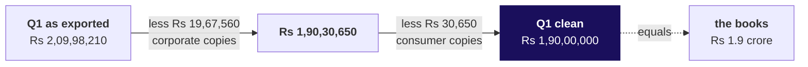

# Which Q1 figure is right?

**Week 1, Wednesday. Study notes, read after the session.** Profile before you total, log every
failure, say what makes two rows one order, keep what is real, reconcile in rows and in rupees, and
recompute what you reported. Reading time: about 25 minutes.

---

## What you can now do

1. You can read a CSV and a JSON feed, and say why every value that arrives is text until you
   convert it on purpose.
2. You can profile a file field by field, present, convertible and distinct, and read each count
   as a business fact.
3. You can convert with a rejects log, so a failure is counted and kept and never turned into a
   number.
4. You can state an identity rule, find the rows that break it, and choose which copy of a pair
   stays.
5. You can make the three-way decision for a missing value, drop, default, or keep and flag, and
   defend keeping a large order that is real.
6. You can reconcile a cleaning pass in rows and in rupees, draw the revenue bridge from one total
   to another, and say what cleaning changed in a finding you had already reported.

---

## Where this sits

**What the session covered.** Worked in full: Anand's two figures and the four ways an export could
produce either; the profile of the ERP export; the conversion that hides its failures; the
whole-record dedupe that finds nothing; the identity rule and which copy stays; the missing status;
the large order a fence would remove; the count reconciliation that misses the books; the bridge
from Rs 2,09,98,210 to Rs 1,90,00,000; and Tuesday's finding recomputed on clean data. Met in
passing and given two minutes each: `FileNotFoundError`, the `ValueError` from `int()`, and the
`JSONDecodeError` from a feed cut part way through. Left for later: statistics beyond counts and the
median, imputation beyond a stated default, and pandas.

**Where the week is.** Monday drew the revenue tree on thirty orders. Tuesday split two quarters by
segment and found the fall in Retail-Plus frequency. Today asked whether the numbers under that
finding could be trusted. Thursday asks whether the finding that survived is real or the wobble every
quarter shows, and Week 2 runs this whole pass again in SQL and in pandas.

```mermaid
flowchart LR
    M["<b>Mon</b><br/>the tree"] --> T["<b>Tue</b><br/>which branch moved"]
    T --> W["<b>Wed</b><br/>can we trust it"]
    W --> H["<b>Thu</b><br/>is it real"]
    H --> F["<b>Fri</b><br/>rebuild it alone"]
    classDef bet fill:#1A0F5C,stroke:#1A0F5C,color:#FFFFFF
    class W bet
```

---

## The picture to remember: the bridge

A reconciliation is a walk from one total to another, one move per cause, each move backed by the
rows that carry it. Today's walked from the export to the books.

| Step | Rupees | What carries it |
|---|---|---|
| Q1 as exported, every amount that converts | Rs 2,09,98,210 | 114 Q1 rows, the dashboard's 2.1 crore |
| Less copies of corporate orders | -Rs 19,67,560 | Two rows |
| Less copies of consumer orders | -Rs 30,650 | Eleven rows, plus one copy whose amount never converted |
| Q1 clean | Rs 1,90,00,000 | 100 orders, the books to the rupee |

```mermaid
flowchart LR
    E["<b>Q1 as exported</b><br/>Rs 2,09,98,210"] -->|"less Rs 19,67,560<br/>corporate copies"| A["<b>Rs 1,90,30,650</b>"]
    A -->|"less Rs 30,650<br/>consumer copies"| B["<b>Q1 clean</b><br/>Rs 1,90,00,000"]
    B -.->|"equals"| K["<b>the books</b><br/>Rs 1.9 crore"]
    classDef bet fill:#1A0F5C,stroke:#1A0F5C,color:#FFFFFF
    class B bet
```

The two numbers on either side of the bridge were both honest arithmetic. The dashboard added every
row the export held; the books counted every order once. The bridge is the argument that turns "we
disagree" into "here is exactly why".

---

## Round 1, worked: what did the ERP send?

**The question.** Before any total, how many records arrived, and how many can be used?

**Everything read is text.** `csv.DictReader` returns every value as a string. The first amount in
the export is `'2200'`, not 2200. That matters because text still supports the operations that look
like arithmetic: `"900" < "1200"` is False, since text compares one character at a time and "9"
comes after "1", and `max()` over a list of text amounts returns the one that starts with the
highest digit. Nothing crashes, and every answer is wrong. So conversion is a decision, made once,
at the boundary, in one function.

**The profile.** Three counts per field say what the field can be trusted for:

| Field | Present | Convertible | Distinct | What it says |
|---|---|---|---|---|
| order_id | 201 | text | 186 | Some orders sit on more than one row |
| amount | 201 | 200 | 161 | One amount will not convert |
| status | 200 | text | 4 | One order's fate is unknown |
| discount | 143 | 143 | 5 | Tuesday's optional field, as expected |

None of those is a total yet; each is a question for a later rung.

**The trap.** A `ValueError` stops the first loop that sums with `int()`. The hurried fix is a helper
that returns 0 when conversion fails. The loop runs, the profile reports 201 of 201 amounts
convertible, and Q1 comes out at Rs 2,09,98,210, which reads as the dashboard's 2.1 crore and as proof
that Finance is behind.

**Why it is wrong.** A zero is a claim that Kalpa sold an order for nothing. Finance booked that order
at a value, so the coerced file now carries an order the books do not, and the profile has destroyed
the one piece of evidence that anything was wrong. The check asks the result a business question: can
a Kalpa order be worth nothing? The coerced file holds one order at Rs 0, and the smallest real amount
in the export is Rs 400.

**The fix, and what changed.** `convert()` returns the value or the reason it failed, and every
failure goes to a rejects log with its line, field, value and reason. The rupees did not move, since
the failed amount was never going to add anything, but the claim did: one order went from "sold for
Rs 0" to "amount unreadable, set aside on the line the log names".

**The second source.** The app's JSON feed fails to parse part way through, and the error names a line
and a column. Reading it one complete record at a time recovers 119 records, all of them orders the
CSV also holds. The feed is a witness that can confirm the CSV field by field; it can never replace
it. One more lesson sits in the formats: a CSV writes a missing value as an empty string, while JSON
leaves the key out, so `record["status"]` returns `""` on one and raises `KeyError` on the other. A
profile that reads with `.get(field, "")` counts both the same way.

> **Kavya's review.** A conversion that never fails is a conversion that lies. Show me the count of
> failures next to the count of successes, and the log that names each one.

---

## Round 2, worked: where do the extra rupees come from?

**The question.** 201 rows hold 186 orders, and Anand's gap is Rs 20 lakh in Q1. Where do the extra
rows sit, and what do they carry?

**Rows against orders, by quarter.** Q1 holds 114 rows for 100 orders; Q2 holds 87 for 86. Almost all
the extra rows sit in the quarter the migration touched, which is the quarter where the figures
disagree. That is a lead, not a proof.

**The trap.** Round 1 taught the rejects log to cite a file line, so every record now carries one. A
whole-record dedupe, the default in most tools, reports 0 duplicates, Q1 stays at Rs 2,09,98,210, and
the note would tell Anand his books are Rs 20 lakh short.

**Why it is wrong.** The file line is where a row sat, not what the order is. Two copies of one order
sit on different lines, so every record is unique by construction and the dedupe can never find
anything. The check is one line from round 1: 201 rows and 186 distinct order ids cannot both be true
of a file with no duplicates. The same failure appears with a load timestamp, a batch id or a
surrogate key in any pipeline.

**The fix: the identity rule.** Say what makes two rows one order before counting anything. Kalpa's
ERP issues one order_id per order and never reuses it, so order_id is the identity. The alternatives
each fail in a way worth knowing:

| Candidate key | What it does |
|---|---|
| Every field, line included | Finds nothing, ever |
| Every field, line excluded | Finds only exact copies and misses a copy that differs in one field |
| customer_id and date | Merges two real orders a loyal member places on one day |
| order_id | One row per order the ERP issued |

**Which copy stays.** A pair is not always two identical rows. If one copy's amount will not convert
and the other's does, keep the one that validates, because keeping the first would keep the one that
cannot be summed and throw away the order's value. If both copies are valid and disagree on one field,
no rule inside the file can say which is true: keep the first extract's row, log the disagreement, and
write the question for the ERP team.

**What changed.** One row per order sets aside 15 rows, 14 of them in Q1, and brings Q1 to
Rs 1,90,00,000, Finance's figure. The one amount round 1 could not read turned out to belong to a copy
whose twin carries the order's value, so nothing was lost with it.

**Count the rows, weigh the rupees.** The 14 Q1 rows are not one problem. Two Business rows carry
Rs 19,67,560 of the Rs 19,98,210 removed, about 98 percent, while most of the rows sit in Retail-Plus
and carry a sliver. That split is two conversations: Anand's gap is two corporate orders counted twice,
and Tuesday's Retail-Plus finding was measured on inflated Q1 counts.

> **Kavya's review.** Tell me what makes two rows the same order before you tell me how many
> duplicates there are. A count of duplicates without an identity rule is a count of nothing.

---

## Round 3, worked: which figure is right, and the proof

**The question.** Which figure is right, can Anand's analyst follow every decision, and does
Tuesday's finding survive?

**A missing status.** One Q2 order has no status. Revenue here is booked value, every order whatever
its status, which is how both the dashboard and the books count a quarter. Three decisions are
available, and each moves a different number:

| Decision | Q2 revenue | Q2 delivered orders | What it claims |
|---|---|---|---|
| Drop the order | Falls by its amount | Unchanged | The order never happened |
| Default to delivered | Unchanged | One more | A delivery nobody recorded |
| Keep and flag | Unchanged | Unchanged | It happened; its fate is unknown |

Keep and flag, and one line in the decisions log.

**The trap: the real bulk order.** Sorted, Q2's largest order sits 1.66 times above the next. A
hurried fence removes it, and Q2 reads Rs 1,57,54,540: the drop from Q1 becomes 17.1 percent instead
of 1.6. Marketing would fund a rescue for a collapse that never happened, and Finance, whose books
hold that order, would reject the reconciliation on sight.

**Why it is wrong.** Large is not wrong. Kalpa sells in bulk through the Business segment, where the
smallest order in the file is above Rs 2 lakh. The check is on the record: a Business account with
orders in both quarters, every field valid, one id and one row. The fix is to keep it, flag it, and
show the quarter both ways so nobody has to trust a removal they cannot see.

**The trap: counts that reconcile.** A second analyst removes duplicate ids first, keeping the first
copy, then converts. The rows tie out, 201 = 185 + 16, and Q1 comes to Rs 1,89,98,210, which rounds to
Finance's 1.9 crore.

**Why it is wrong.** To the rupee it is Rs 1,790 short of the books. Keeping the first copy kept the
one whose amount could not be read, and set aside the twin that carried the value. A count
reconciliation proves no row vanished; it cannot prove the right rows stayed. The analyst who ties out
finds a booked order missing from a file you called reconciled, and stops trusting every other line in
the log.

**The fix.** Convert first, so the rule can see which copy validates; apply the identity rule; then
reconcile twice.

| Reconciliation | In | Kept | Set aside | Holds |
|---|---|---|---|---|
| Rows, whole file | 201 | 186 | 15 | Yes |
| Rupees, Q1 | Rs 2,09,98,210 | Rs 1,90,00,000 | Rs 19,98,210 | Yes, to the rupee |

**Tuesday recomputed.** Tuesday reported that revenue fell about 11 percent from Q1 to Q2 and that
Retail-Plus orders per customer fell 49 percent, from 2.32 to 1.18. On clean data:

| Measure | As Tuesday reported | On clean data |
|---|---|---|
| Revenue, Q1 to Q2 | -11.0% | -1.6% |
| Retail-Plus orders per customer | 2.32 to 1.18, -49.0% | 1.82 to 1.18, -35.0% |
| Retail-Core orders per customer | -5.3% | -2.7% |

The finding survives, smaller, because most of the migration's copies sat in Retail-Plus in Q1. The
honest note reports the smaller numbers first. A finding that shrank and was reported openly is worth
more to Marketing than one nobody checked.

**The note to Finance, in under 120 words.** "Anand, your 1.9 crore is right. The ERP export counted
fifteen rows twice, fourteen of them in Q1; copies of two corporate orders carry Rs 19,67,560 of the
Rs 19,98,210 difference. Rows and rupees both reconcile to your books exactly, and every row set aside
is in the attached log. We kept and flagged one Q2 order with no status and the largest Q2 order, a
real Business account. On clean data the drop is 1.6 percent, not 11, and the Retail-Plus frequency
fall is 35 percent, not 49."

> **Kavya's review.** Two reconciliations, not one: the rows and the rupees. Input equals clean plus
> rejected, in both. Then tell me what changed in Tuesday's story, including if it got smaller.

---

## The six lines worth keeping

1. Profile before you total: present, convertible, distinct, for every field.
2. A failure is counted and logged, never turned into a number.
3. Say what makes two rows one order before you count duplicates.
4. Large is not wrong: check the record, keep it, and show it both ways.
5. Reconcile twice, in rows and in rupees, to the books.
6. Recompute what you reported, and say what changed, the smaller number first.

---

## Where this shows up in the work

- **Month-end close.** Finance reconciles the sales system against the ledger every month, in counts
  and in money. The first question from any controller is the one Anand asked.
- **Migrations.** Moving data between systems re-runs batches, stitches extracts and adds load
  columns. Every migration plan that is taken seriously has a reconciliation step, and it runs on the
  business key.
- **Payments.** A gateway retries a payment and posts it twice. Week 2 meets this in a join, where a
  duplicate key multiplies rows instead of adding them.
- **Dashboards.** A dashboard is a total nobody reconciled until somebody does. The analyst who can
  build the bridge is the one Finance calls next time.

---

## Try this yourself

Five questions, no writing needed; answer each in your head, then check against the sections above.

1. An export reports 400 of 400 amounts convertible and the sorted amounts start `0, 0, 350`. What do
   you ask first?
2. A dedupe on a table with a `loaded_at` column reports 0 duplicates. What do you count next?
3. Two rows share an order id; one amount reads `n/a`, the other Rs 2,600. Which stays, and what goes
   in the log?
4. Rows reconcile and rupees are Rs 900 short of the books. Where is the Rs 900 most likely to be?
5. Cleaning shrank a finding from -40 percent to -25 percent. What leads the note?

---

## Where this gets tested

Twelve questions, the row's five and seven follow-ups an interviewer uses to push. Tags: [S] staple
asked everywhere, [F] frequent in GCC and product screens, [SV] service-major screen opener, [D]
differentiator. This programme's own calibration for 0 to 3 year Indian-market candidates.

**[S] How do you handle missing data?** "First I measure it per field: present, convertible,
distinct. Then I ask what the absence means, because an optional discount that is absent means no
discount, while a missing status means we do not know the order's fate. Then one of three decisions,
each written down with its reason: drop the record, fill a stated default, or keep it and flag it. For
money I almost never fill, since the books either have a value or they do not." Tested: whether you
treat missingness as a decision. Weak answer: "I fill with the mean."

**[S] Finance and your dashboard disagree; what do you do?** "I assume both numbers are honest
arithmetic on different inputs, so I find the difference rather than pick a side. I get Finance's
figure to the rupee with its definition, profile my source, and build a bridge from my number to
theirs, one move per cause, each backed by the rows that carry it. I reconcile twice, in rows and in
rupees. When the bridge closes I say which figure is right and why, fix the source, and recompute
anything that was reported from the wrong number." Weak answer: "Finance is always right."

**[F] How do you find duplicates, and what makes two records the same?** "The identity rule first:
what the business says makes two records one thing. For an order it is the id the system issues. I
count rows against distinct keys, keep one row per key by a stated preference, usually the copy whose
fields validate, and log every row set aside with its reason. Then I weigh them in money as well as
rows, because two rows can carry more than a hundred." Weak answer: "drop_duplicates()."

**[F] Everything read from a CSV is a string; what breaks and where do you convert?** "Arithmetic,
comparison and sorting all break or silently do the wrong thing: `'900' < '1200'` is False and `max`
on text amounts returns the wrong order. I convert once, at the boundary, in one function that returns
the value or the reason it failed, and I count and log failures. I never turn a failure into a
default without writing that decision down."

**[D] An auditor asks why you dropped 14 rows; walk them through it.** "They were set aside, not
dropped, and each is in the log. Fourteen Q1 rows share an order id with a row that stayed. The
identity rule is the order id, because the ERP issues one per order. For each pair I kept the copy
whose fields validate. Two corporate copies carry Rs 19,67,560 and the rest Rs 30,650. The rows
reconcile, 114 Q1 rows in and 100 kept, and the rupees bridge to your books exactly."

**[F] A dedupe returns zero duplicates. Do you believe it?** "Only after I count distinct business
keys against rows. If they disagree, the dedupe compared on something that makes every row unique: a
load timestamp, a surrogate key or a line number."

**[S] The largest order is 1.66 times the next. Do you remove it?** "I check the record, not its size.
A valid id, a real account with other orders and fields that convert make it revenue. I keep it, flag
it, and show the result with and without it. Today, removing it would have turned a 1.6 percent dip
into a 17.1 percent fall."

**[F] Your row counts reconcile. Are you done?** "No. Rows prove nothing vanished; rupees prove the
right rows stayed. Today a pass reconciled 201 rows and was Rs 1,790 short of the books, because it
kept an unreadable copy and set aside the one that carried the value."

**[F] A JSON file fails to parse at a named line. What do you do?** "Read the last line of the error,
open the file at that line and column, and say what is there: a cut transfer, a stray character, two
documents merged. Then decide whether the complete part is usable as evidence, and ask for a resend
of the rest. I never skip the file silently."

**[SV] Walk me through how you clean a file you have never seen.** "Profile every field, convert with
a rejects log, apply the identity rule, make the drop, default or flag decision for each remaining
defect with a reason, reconcile rows and money against a trusted total, and recompute anything that
was reported from the raw file."

**[D] Cleaning shrank the finding you reported yesterday. What do you tell the stakeholder?** "The
smaller number first, what changed and why, and whether the decision it supported still holds. Today
the Retail-Plus fall went from 49 to 35 percent: still the largest fall, still worth acting on, and
now on numbers Finance agrees with."

**[D] How do you know Finance's number is right, and not yours?** "Neither is right by rank. The bridge
closes to the books because every move is backed by rows I can show. If it had not closed, the gap
would itself be a finding to put in front of Finance's analyst, with the rows, not an accusation."

---

## Glossary

| Term | What it means here | Where it appeared | Example |
|---|---|---|---|
| Profile | Three counts per field before any total: present, convertible, distinct | Half one, S7 to S10; notebook 01 | order_id present on 201 rows, distinct on 186 |
| Rejects log | Every row set aside, with its line, field, value and reason | Half one, S15; notebook 01 | One amount that would not convert |
| Decisions log | Every cleaning act with its reason | Half one, S29; notebook 03 | Missing status: keep and flag |
| Identity rule | What makes two rows the same thing | Half one, S21; notebook 02 | order_id, the ERP's key |
| Duplicate | A second row for the same thing under the identity rule | Half one, S19 to S24; notebook 02 | 15 rows beyond one per order |
| Keep and flag | Keep a record whose value is unknown, marked, out of counts that need it | Half one, S29; notebook 03 | A Q2 order with no status |
| Outlier | A value far from the rest; a question about a record, never a reason to delete it | Half one, S30 and S31; notebook 03 | The largest Q2 order |
| Reconciliation | Proof the clean data is the same data, in rows and in rupees | Half one, S32 to S34; notebook 03 | 201 = 186 + 15 |
| Revenue bridge | One total walked to another, one move per cause | Half one, S35; notebook 03 | Rs 2,09,98,210 to Rs 1,90,00,000 |

---

## Go deeper

| Order | What | Time | Why this one |
|---|---|---|---|
| 1 | Real Python, Reading and Writing CSV Files, https://realpython.com/python-csv/ (verified 03 Sep 2026) | 30 minutes | The csv module and DictReader, which read everything as text |
| 2 | Corey Schafer, Working with JSON data, https://www.youtube.com/watch?v=9N6a-VLBa2I (verified 05 Sep 2026) | 20 minutes | Loading and writing JSON, and what the parser expects |
| 3 | Python documentation, the json module and JSONDecodeError, https://docs.python.org/3/library/json.html (verified 03 Sep 2026) | 15 minutes | What the error's line and column mean |
| 4 | Real Python, LBYL against EAFP, https://realpython.com/python-lbyl-vs-eafp/ (verified 03 Sep 2026) | 15 minutes | Why `convert()` tries the conversion and handles the failure |
| 5 | Automate the Boring Stuff with Python, 3rd edition, chapters 10 and 18, https://automatetheboringstuff.com/3e/ (verified 03 Sep 2026) | 45 minutes | Files and the CSV and JSON chapters, worked slowly |
