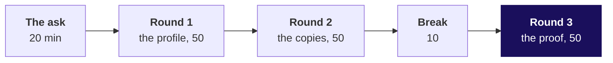
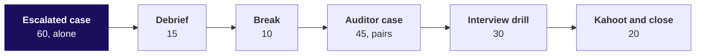

# Day sheet: Week 1, Wednesday. Which Q1 figure is right?

**TRAINER ONLY.** Nothing on this page reaches a learner.

Posts to <!-- sync:module:W01/D3 -->Module 1: Foundations of AI and Data<!-- /sync:module:W01/D3 -->, on <!-- sync:day-date:W01/D3 -->Wed 07 Oct 2026<!-- /sync:day-date:W01/D3 -->.

No IITGN faculty block on this day.

| | |
|---|---|
| **Start from** | Tuesday's functions and Tuesday's finding, Retail-Plus orders per customer 2.32 to 1.18, down 49 percent, measured on the export as delivered. Today re-runs it on the ERP exports, and the number moves. |
| **Go as far as** | Everyone ships a cleaned file, a decisions log, reconciled rows and rupees, the bridge from 2.1 to 1.9, Tuesday recomputed and the note to Finance. |
| **Stop before** | Statistics beyond counts and the median, imputation beyond a stated default, pandas. Say once that pandas and SQL re-run this pass in Week 2. |
| **Comes later** | Thursday asks whether the clean Retail-Plus fall is real or chance. Week 2 re-expresses the pass in SQL and pandas. |
| **Cut first** | `json.dump`, then the vendor copy in round 1's variant. Never the reconciliation, never the recompute. |

---

## Morning block, 180 minutes



| Part | Slides, half one | Beside it | What must land | If short of time |
|---|---|---|---|---|
| The ask, 20 | S1 to S6 | Board, drawings one and two | Four ways an export could produce either figure; rows first because a count is cheapest; profile, decide, reconcile, recompute on the board | S2's table read, not discussed |
| Round 1, 50 | S7 to S17 | Notebook 01_profile; guided carve; round 1 set after | Everything read is text; the three counts; the coerced profile and its Rs 0 order; the rejects log | The vendor copy in S16 to five minutes |
| Round 2, 50 | S18 to S26 | Notebook 02_duplicates; round 2 set after | The dedupe that finds nothing; the identity rule; the copy that validates; 98 percent of the rupees in two rows | S25's variant to the chart alone |
| Break, 10 | | | | |
| Round 3, 50 | S27 to S39, D40 self-study | Notebook 03_bridge; round 3 set after | Keep and flag; the bulk order kept; counts that reconcile and miss by Rs 1,790; the bridge; Tuesday smaller | Never cut S32 to S37 |

## Afternoon block, 180 minutes



| Part | Slides, half two | Beside it | What must land | If short of time |
|---|---|---|---|---|
| Escalated case, 60 | S1 to S3 | `notebooks/hands_on` and `exercises/unguided/escalated_case` | The full pass alone; eight notebook letters and ten brief letters; the note | Part 5's note becomes homework |
| Debrief, 15 | S4, S5 | The room's own numbers | Each wrong number traced to its step | S5 if nobody produced it |
| Auditor case, 45 | S6 to S8 | `notebooks/ex2_auditor` and `exercises/unguided/auditor_question` | "Set aside with a reason", never "dropped"; rows and rupees by segment | Items 3 and 4 aloud only |
| Interview drill, 30 | S9, S10 | Study notes, "Where this gets tested" | Rule, today's number, the check, in under ninety seconds | The seven follow-ups to four |
| Kahoot and close, 20 | S11 to S13, D14 self-study | `kahoot/quiz` | The sentence to Anand; the six lines; tomorrow's question left open | Never cut S13 |

---

## The traps, each with its exact wrong number

| Round | The wrong number | The decision it would mislead | The check that catches it | The fix and what changed |
|---|---|---|---|---|
| 1 | 201 of 201 amounts convertible; Q1 Rs 2,09,98,210 | Tell Anand the dashboard is right and his books are behind | The coerced file holds one order at Rs 0; the smallest real amount is Rs 400 | Convert with a rejects log; rupees unchanged, one order moves from "sold for Rs 0" to "unreadable, logged" |
| 2 | 0 duplicates; Q1 stays Rs 2,09,98,210 | Tell Anand his books are Rs 20 lakh short | 201 rows against 186 distinct order ids | The identity rule on order_id, the copy that validates; 15 rows set aside, Q1 Rs 1,90,00,000 |
| 3 | Q2 Rs 1,57,54,540; the drop 17.1 percent | Marketing funds a rescue; Finance rejects the pass | The order is Business, its buyer ordered in both quarters, every field valid | Keep and flag, show both; Q2 Rs 1,87,00,000, the drop 1.6 percent |
| 3 | Rows 201 = 185 + 16; Q1 Rs 1,89,98,210, "1.9 crore" | A note that says "reconciled" and fails the rupee tie-out | Books less clean Q1 is Rs 1,790 | Convert first, prefer the copy that validates; 201 = 186 + 15, Q1 equals the books |

The runtime errors are met, read and left in two minutes each; none is a trap.

```text
FileNotFoundError: [Errno 2] No such file or directory: 'orders.csv'
ValueError: invalid literal for int() with base 10: 'twelve'
JSONDecodeError: Unterminated string starting at: line 1397 column 15 (char 27679)
```

For the trainer's own reference: a whole-record dedupe with the line left out finds 13 exact copies
and leaves two pairs; it lands Q1 on Rs 1,90,00,000 only if the unreadable amount was coerced to 0,
while still counting one Q2 order twice. If a learner reaches 1,90,00,000 with 187 rows, that is the
path, and the row reconciliation catches it.

---

## Checkpoints

| When | Every learner has | If not |
|---|---|---|
| End of round 1 | The profile table and a rejects log of one | Pair them with a neighbour for the round 2 opening |
| End of round 2 | 186 orders and 15 rows set aside, Q1 Rs 1,90,00,000 | Point at the copy-preference cell of notebook 02 |
| End of round 3 | The bridge closing to the books; Retail-Plus -35.0 percent | The escalated case notebook re-runs the pass; start them there |
| End of the escalated case | Eight letters 1b 2c 3d 4b 5a 6c 7b 8d; ten letters 1b 2d 3a 4c 5b 6a 7d 8c 9a 10b | Release the solution twin at the debrief |
| End of the auditor case | Five and five letters: notebook 1b 2a 3b 4b 5c, brief 1c 2a 3d 4b 5c | Walk items 3 and 4 aloud |

---

## What is planted, and what the room should find

Data version v2 from `data/generate_client_zero.py`, client zero v2.2 section 7. The row's plants,
where each is met, and what to do if nobody finds it. Name none of them to the room before it finds it.

| Plant | Where the room meets it | What to do if nobody finds it |
|---|---|---|
| 14 duplicated Q1 rows carrying Rs 19,98,210 (12 consumer, 2 corporate at Rs 9,83,780 each) | Round 1's distinct count, round 2's rows-against-ids, the bridge | Ask for rows and distinct ids per quarter; never say "duplicates" first |
| One amount spelled `twelve`, order KR-02063, line 64, whose migration copy on line 197 carries Rs 1,790 | Round 1's ValueError and rejects log; round 3's Rs 1,790 | Ask them to print the rejects log and open the CSV at the line |
| One record missing `status`, order KR-02119, Q2, Rs 1,850, line 120 | Round 1's profile; round 3's three-way decision | Ask which field is present on 200 rows |
| A near-duplicate pair on KR-02151, both Q2 at Rs 3,710, dated 25 September and 2 August | Round 2's your-turn cell listing pairs that differ | Ask which pair's copies disagree, and on what |
| A truncated JSON line, the feed cut inside the 120th record's order id | Round 1's variant; the practice lab | Ask them to open the file at the line and column the error names |
| A companion file with the header duplicated, the vendor copy | Round 1's variant; the practice lab, problems 2 and 4 | Ask them to print the rows whose amount fails |

Not a v2 plant, and discoverable by sorting: the largest Q2 order, KR-02186, Business, customer
C-4004, Rs 29,45,460, 1.66 times the next. C-4004 ordered in both quarters.

The take-home export, `C2_W01_D03_takehome_STUDENT.csv`, carries its own: the header row pasted in at
line 46, a refund posted as a negative amount of Rs 2,400 (KR-02018), a date in the other format
`12/05/2026` (KR-02030), an empty status (KR-02052), and 6 exact copies, four Retail-Core and two
Retail-Plus, carrying Rs 14,210. A correct pass reads 97 rows, keeps 90 orders and sets aside 7; Q1 is
Rs 80,53,330 with the refund flagged outside revenue, or Rs 80,50,930 netted.

---

## The numbers, so you are never caught out

| Number | Value |
|---|---|
| Rows in the CSV / distinct order ids | 201 / 186 |
| Q1 rows / Q1 orders; Q2 rows / Q2 orders | 114 / 100; 87 / 86 |
| Q1 as exported, amounts that convert | Rs 2,09,98,210 |
| Q1 clean, the books | Rs 1,90,00,000 |
| Q2 clean | Rs 1,87,00,000 |
| Rupees set aside in Q1: corporate copies / consumer copies | Rs 19,67,560 / Rs 30,650 |
| Revenue change Q1 to Q2: as Tuesday reported / clean | -11.0% / -1.6% |
| Retail-Plus orders per customer: Tuesday / clean | 2.32 to 1.18, -49.0% / 1.82 to 1.18, -35.0% |
| Retail-Core orders per customer: Tuesday / clean | -5.3% / -2.7% (1.09 to 1.06) |
| Customers per quarter | 69 and 69; Retail-Plus 22 and 22 |
| JSON feed: complete records / Q1 among them | 119 / 100 |
| Vendor copy: rows read / orders / total | 40 / 39 / Rs 81,890 |
| Smallest Business order | Rs 2,03,060 |

---

## The interview questions, answered in one breath

| Tag | Question | One breath |
|---|---|---|
| [S] | How do you handle missing data? | Measure it per field, ask what the absence means, then drop, default or keep and flag with a written reason; never fill money. |
| [S] | Finance and your dashboard disagree; what do you do? | Both are honest arithmetic on different inputs: get Finance's figure to the rupee, profile the source, bridge one move per cause, reconcile rows and rupees, then fix and recompute. |
| [F] | How do you find duplicates, and what makes two records the same? | The business's identity rule first, rows against distinct keys, one row per key preferring the copy that validates, a reason per row, weighed in money. |
| [F] | Everything read from a CSV is a string; what breaks and where do you convert? | Arithmetic, comparison and sorting; convert once at the boundary in one function that returns a value or a reason, and log failures. |
| [D] | An auditor asks why you dropped 14 rows. | Set aside, not dropped: 14 Q1 copies by the order_id rule, the valid copy kept, Rs 19,67,560 in two corporate rows, 114 = 100 + 14 and the rupees tie to the books. |
| [F] | A dedupe returns zero. Believe it? | Only after counting distinct business keys against rows; a timestamp or line in the key makes every row unique. |
| [S] | The largest order is 1.66 times the next. Remove it? | Check the record, not the size; keep, flag, show both; removing it here turns 1.6 percent into 17.1. |
| [F] | Row counts reconcile. Done? | No: rows prove nothing vanished, rupees prove the right rows stayed; today's first-copy pass was Rs 1,790 short. |
| [F] | A JSON file fails at a named line. | Read the line and column, open the file there, say what it is, use the complete part as evidence, ask for the rest. |
| [SV] | Clean a file you have never seen. | Profile, convert with a log, identity rule, decide each defect with a reason, reconcile twice, recompute. |
| [D] | Cleaning shrank yesterday's finding. | The smaller number first, what changed and why, and whether the decision still holds. |
| [D] | Why is Finance's number right, not yours? | Neither by rank; the bridge closes because each move is backed by rows, and a bridge that did not close would be the finding. |

---

## The practice lab

The TA runs it from `exercises/practice/C2_W01_D03_lab_STUDENT.md` with the note in
`trainer/C2_W01_D03_lab_note_TRAINER.md`: four problems, about an hour, key 1b 2c 3b 4c 5a 6a 7d 8b 9d
10a 11b.

## Which file for which moment

| Moment | File |
|---|---|
| Morning, on the projector | `slides/C2_W01_D03_half1_STUDENT.pptx` |
| Rounds 1 to 3, demonstration | `notebooks/C2_W01_D03_01_profile_STUDENT.ipynb`, `02_duplicates`, `03_bridge` |
| Round 1, built together | `exercises/guided/C2_W01_D03_profile_pass_STUDENT.md` |
| After each round | `exercises/unguided/` read_the_profile, the_copies, decide_and_defend |
| Any time a decision needs to move on screen | `demos/C2_W01_D03_reconciliation_STUDENT.html` |
| For learners to keep | `demos/C2_W01_D03_decision_tool_STUDENT.xlsx` |
| Afternoon, on the projector | `slides/C2_W01_D03_half2_STUDENT.pptx` |
| Escalated case and auditor case | `notebooks/C2_W01_D03_hands_on_STUDENT.ipynb`, `notebooks/C2_W01_D03_ex2_auditor_STUDENT.ipynb` |
| Close | `kahoot/C2_W01_D03_quiz_STUDENT.md` |
| Tonight | `takehome/`, `preread/`, `study-notes/`, `cheatsheets/` |
