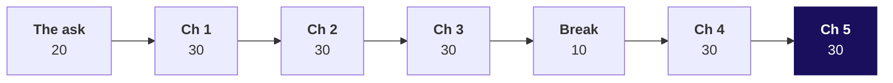
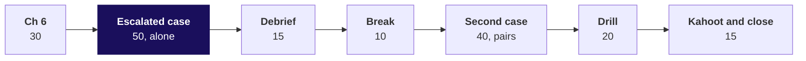

# Which Q1 figure is right, the dashboard's Rs 2.1 crore or the books' Rs 1.9 crore, and how do we know?

**Day sheet, Week 1 Wednesday. TRAINER ONLY.** Nothing on this page reaches a learner.

Posts to <!-- sync:module:W01/D3 -->Module 1: Foundations of AI and Data<!-- /sync:module:W01/D3 -->, on <!-- sync:day-date:W01/D3 -->Wed 07 Oct 2026<!-- /sync:day-date:W01/D3 -->.

No IITGN faculty block on this day. The domain is retail, whose story Monday told; the dossier is
`content/W01/D1/study-notes/C2_W01_D01_domain_retail_STUDENT.md`, and today's files point to it for
depth only. Say once, in the ask, that both of Anand's figures count booked value, which is what the
retail dossier calls GMV: every order at the price charged, before cancellations and returns come
out. The export does not state whether GST is inside, which is a question an analyst asks Anand; say
nothing more about GST, since the client-zero lock is silent on it. The words the room meets first
today: the ERP is the enterprise resource planning system Finance books orders in; its orders CSV was
stitched from two extracts, two pulls of rows out of the ERP, during Q1's migration, the move of the
order data to a new system; Anand's analyst ties out, matching every figure to the books line by
line; and in chapter 5, Tesco's supplier income is the money its suppliers pay it.

---

## Which questions does the day ask, in the order the room meets them?

Ask each question aloud before its answer is shown. Each chapter's question is the one the previous
answer raised; the short form is the chapter opener's title, and the full form is its promise, the
notebook's title, the notes' chapter heading and the scenario set's title.

**The day.** Which Q1 figure is right, the dashboard's Rs 2.1 crore or the books' Rs 1.9 crore, and how
do we know? *Answered at half two, S25:* Anand's 1.9 crore is right; fifteen orders were counted
twice, fourteen in Q1, and the bridge closes to his books in rows and rupees; revenue falls 1.6
percent, not 11, and Retail-Plus 35 percent, not 49.

**Chapter 1. What did the ERP send?** What did the ERP actually send, and does the dashboard's
Rs 2.1 crore follow from it? *Answer:* 201 rows for 186 orders, one unreadable amount, one missing
status; Q1 over what converts is Rs 2,09,98,210, so 2.1 is honest arithmetic on this file.
1. How could we learn what arrived, and what would each way cost on 201 rows? Profile every field: 2,010 values in under a second.
2. What does the file hold, field by field? Text; order_id distinct on 186, amount converts on 200, status present on 200, discount on 143.
3. Which Q2 order is the largest? Rs 29,45,460 as a number; the text sort's Rs 970 is the trap.
4. Does the dashboard's Rs 2.1 crore follow from this file? Yes, Rs 2,09,98,210, with one failure logged.
5. What can the app's JSON feed tell us? What the extract held, 119 complete records, never whether a value is right.
6. Do two other methods reach the same counts? Yes: sorted ids 186, a digit pattern 1 failure.

**Chapter 2. Which rows repeat?** The file holds 201 rows for 186 orders: which rows did the export
count twice, and what makes two rows one order? *Answer:* the order_id; 15 orders twice, 14 in Q1.
1. Which rules could decide that two rows are one order, and what does each flag here? Whole record 0, record less line 13, order_id 15, fuzzy 15 with a real Rs 17,71,000 order.
2. Where do rows outnumber orders? Q1, 114 rows for 100 orders; Q2 87 for 86.
3. Why does the default dedupe find no duplicates? The file line makes every row unique: 0, Q1 still Rs 2,09,98,210.
4. How many orders appear twice under the order id? 15, 14 in Q1 and 1 in Q2.
5. Does a rule that flags as many rows flag the same rows? No: 14 shared, one real order removed.
6. Does a count with no dictionary agree? Yes: 14 + 1 pairs in 20,100 comparisons.

**Chapter 3. Which copy stays?** When an order appears twice, which copy stays, and does Q1 then land
on the books? *Answer:* the copy whose amount converts, then the first; Q1 Rs 1,90,00,000.
1. Which copy of a pair could stay, and what does each choice do to Q1? First -Rs 1,790; last on the books by file order; the copy that validates on the books.
2. Which copy stays when the two copies differ? The one that converts; if both do, the first, logged, with a question.
3. What is Q1 once the rule runs? Rs 1,90,00,000: 186 kept, 15 set aside.
4. If Q1 ties to the books, is the pass right? Not alone: 188 rows for 186 orders, Q2 Rs 3,710 high.
5. Which rows carry the rupees set aside? Two Business rows, Rs 19,67,560, 98.5 percent.
6. Does a dictionary keyed by id keep the same orders? Yes, the same 186, and no log.

**Chapter 4. Drop, fill or flag?** What should the pass do with a value that is missing or cannot be
read, so that no decision invents or deletes a fact? *Answer:* flag the status, keep the discount
unknown, reject an unreadable amount and repair it only from an independent source.
1. What could the pass do with a missing status or an unreadable amount, and what does each choice claim? Status: keep and flag; amount: reject, repair from an independent copy.
2. What happens to the order with no status? Kept and flagged: Q2 Rs 1,87,00,000, 57 of 86 delivered.
3. Is a missing discount a zero? No: about Rs 67 over 131 orders, never Rs 47 over 186.
4. What if every failure is turned into zero? 201 of 201 convert, an order at Rs 0, Q1 Rs 1,790 short.
5. Where can an unreadable amount be repaired from? Only a source that could not copy the error; the feed repairs nothing.
6. Do the profile and the logs agree on every defect? Yes: 1, 0 and 55.

**Chapter 5. Can we prove the 1.9?** Can we prove to Anand, one cause at a time, that his Rs 1.9 crore
is right, and does Tuesday's finding survive the clean file? *Answer:* two moves bridge
Rs 2,09,98,210 to Rs 1,90,00,000; revenue -1.6 percent, Retail-Plus -35.0 percent.
1. How could we prove which figure is right, and what does each proof cost? A bridge by cause, 15 logged rows, to the rupee.
2. Which moves walk Rs 2.1 crore down to the books? Corporate copies -Rs 19,67,560, consumer copies -Rs 30,650.
3. Does Tuesday's finding survive the clean file? Yes, smaller: x0.860 against x0.754; Retail-Plus -35.0 against -49.0 percent.
4. Should the largest Q2 order come out? No: removing it reports Q2 at Rs 1,57,54,540 and -17.1 percent.
5. What does the note to Anand say first? That his 1.9 is right, then the proof, then what changed.
6. Does a bottom-up sum reach the same Q1? Yes, Rs 1,90,00,000.

**Chapter 6. Can the analyst replay it?** Can Anand's analyst audit every decision tonight and
rebuild the clean file from the log alone? *Answer:* 24 lines, rows and rupees tied, and the replay
rebuilds the 186 orders.
1. What could the analyst receive, and how long would each take her to check? Logs and control totals, 24 lines, about 12 minutes.
2. Which decision moved the most rupees? The identity rule, all Rs 19,98,210.
3. Do the logs on disk hold what the notebook holds? Yes: 15 rows and 5 decisions, amounts back as text.
4. If the rows reconcile, is the log right? No: 201 = 185 + 16 misses the books by Rs 1,790.
5. Why were 14 Q1 rows set aside, and how do we know nothing else went? Each has a kept twin; 114 = 100 + 14, and the rupees tie.
6. Can the clean file be rebuilt from the raw export and the log alone? Yes: the same 186 orders.

---

## What does the room start from, and where does the day stop?

| | |
|---|---|
| **Start from** | Tuesday's functions and Tuesday's finding, Retail-Plus orders per customer 2.32 to 1.18, down 49 percent, measured on the export as delivered. Today re-runs it on the ERP exports, and the number moves. |
| **Go as far as** | Everyone ships a cleaned file, the logs, reconciled rows and rupees, the bridge from 2.1 to 1.9, Tuesday recomputed and the note to Finance, and can say for each technique which options were weighed and why this one. |
| **Stop before** | Statistics beyond counts and the median, imputation beyond a stated default, pandas. Say once that pandas and SQL re-run this pass in Week 2. |
| **Comes later** | Thursday asks whether the clean Retail-Plus fall is real or chance. Week 2 re-expresses the pass in SQL and pandas. |
| **Cut first** | `json.dump` in chapter 6 (show the read-back only, half two S9), then the JSON feed in chapter 1 (half one S19). Never the reconciliation, never the recompute, never a chapter's options slide. |

---

## How do the morning's 180 minutes run?



Every chapter runs thirty minutes over about fifteen slides: the opener asks the chapter's question,
the map slide shows who needs the answer and the six questions on the way (1), the need and the real
company follow (4), then the options sized (4), then each build step as a predict slide and its answer,
the trap in three slides (the plausible wrong answer, why it is wrong, the fix), the second route, and
a close that answers the six questions in a line each beside Kavya's review (2). Each slide's italic
subtitle is the question it answers, and its title is the answer. The options slide closes on
**The call**, so Kavya's review stays the chapter's last beat. The minutes per slide are in each
slide's notes.

| Part | Slides, half one | Beside it | What must land | If short of time |
|---|---|---|---|---|
| The ask, 20 | Cover, S1 to S6 | Board, drawings one and two | The day's question and the six chapter questions; four ways an export could produce either figure; rows first because a count is cheapest; profile, decide, reconcile, recompute on the board | S3's table read, not discussed |
| Chapter 1, what did the ERP send, 30 | S7 to S21 | Notebook 01_profile; guided profile pass | Everything read is text; the three counts; the text sort that names Rs 970; convert with a log; Q1 over the amounts that convert is 2.1 | S19, the JSON feed, to one sentence |
| Chapter 2, which rows repeat, 30 | S22 to S34 | Notebook 02_duplicates; ch2 set after | The identity rule before any count; four keys sized; the dedupe that finds nothing; 15 orders twice; same count, other rows | S33 to one sentence |
| Chapter 3, which copy stays, 30 | S35 to S48 | Notebook 03_identity_rule; ch3 set after | Four survivors sized; the rule on invented pairs; Q1 on the books; the tie in rupees that proves no rows; 98.5 percent in two rows | S47 to one sentence |
| Break, 10 | | | | |
| Chapter 4, drop, fill or flag, 30 | S49 to S63 | Notebook 04_missing_malformed; ch4 set after | Two decisions sized; each a claim; keep and flag; discount unknown, never zero; the coerced zero; repair only from an independent source | S56 and S57 to the answer alone |
| Chapter 5, can we prove the 1.9, 30 | S64 to S78 | Notebook 05_bridge; ch5 set after | Four proofs sized; the bridge; Monday's tree recomputed; Tuesday smaller; the bulk order kept; the note | Never cut S68 to S75 |

The ch1 set runs after chapter 1 if the room is ahead, or in the practice lab if not; the same holds
for every chapter set.

## How do the afternoon's 180 minutes run?



| Part | Slides, half two | Beside it | What must land | If short of time |
|---|---|---|---|---|
| Chapter 6, can the analyst replay it, 30 | Cover, S1 (the morning restated), S2 to S15 | Notebook 06_audit_logs; ch6 set after | Four hand-overs sized; the decisions log; the logs read back; rows tie while rupees do not; the auditor's 14; the replay | `json.dump` shown as read-back only, S9 |
| Escalated case, 50 | S16, D17 | `notebooks/ex1_escalated_case` and `exercises/unguided/escalated_case` | The full pass alone, with the identity rule and the tree built by the learner; nine notebook letters and ten brief letters; the note | Part 5's note becomes homework |
| Debrief, 15 | S18, S19 | The room's own numbers | Each wrong number traced to its step | S19 if nobody produced it |
| Break, 10 | | | | |
| Second case, 40 | S20 to S22 | `notebooks/ex2_auditor` and `exercises/unguided/auditor_question` | "Set aside with a reason", never "dropped"; rows and rupees by segment | Items 3 and 4 aloud only |
| Interview drill, 20 | S23, S24 | Study notes, the interview section | Rule, today's number, the check, in under ninety seconds; the five design questions with a sizing each | The follow-ups to four, keeping two design questions |
| Kahoot and close, 15 | S25 to S27, D28 self-study | `kahoot/quiz` | The day's answer to Anand; the six lines; tomorrow's question left open | Never cut S25 or S27 |

---

## What does each chapter weigh, choose and check a second way?

| Chapter | The options | The best-fit call, and what would switch it | The second route |
|---|---|---|---|
| 1 | Total and compare; scroll; sample 20; profile every field | Profile, then read the rows it flags; a profile too slow for the deadline, and then order_id and amount first | Sorted ids counted at each change, and a digit pattern for the failures |
| 2 | Whole record; record less line; order_id; a fuzzy match on customer and amount within 60 days | order_id; two systems issuing their own ids | Every row against every later row, pairs sharing an id |
| 3 | First; last; the copy that validates; escalate all | The copy that validates, then the first; the ERP team calling the second extract a fix | A dict keyed by id over valid rows |
| 4 | Status: drop, default, impute, flag. Amount: coerce, reject, read the word, repair from a copy | Flag; reject, repair only from an independent copy; a delivery system to ask; an independent copy to repair from | The profile of the clean file against the logs |
| 5 | Take the books; difference of totals; bridge by cause; rebuild from the feed | The bridge; a second source independent of the export and complete for the quarter | Bottom up: the kept orders summed |
| 6 | Clean file alone; file and a count; logs and control totals; a full diff | Logs and totals; an external auditor re-deriving every row | Replay the log on the raw export |

## Which real company faces each chapter's question?

Every fact was checked on 30 September 2026; the provenance holds the URLs.

| Chapter | Company | The fact on the slide |
|---|---|---|
| 1 | Target Canada | Launched March 2013, almost a billion dollars lost in year one, announced in January 2015 it would close all 133 stores (CBC News); product data about 30 percent accurate (Salsify's summary of Canadian Business) |
| 2 | Starbucks | 22 and 23 May 2009, about 7,800 stores, about a million customers billed twice and repaid (NBC News and AP) |
| 3 | India's GST e-invoice portal | One invoice per supplier GSTIN, number, type and year; a repeat is rejected (GSTN FAQ 1.4); from 1 August 2023 for invoices to registered businesses from sellers above Rs 5 crore of aggregate turnover, some sectors exempt (Notification 10/2023; FAQ questions 9 and 17). Kalpa sells to its Business segment, never the other way round |
| 4 | Amazon UK | Third-party sellers' items at 1p for about an hour on 12 December 2014 after a fault in their repricing tool; most orders cancelled (BBC News) |
| 5 | Tesco | GBP 250 million first estimate, bridged to GBP 263 million, GBP 118 million of it in the first half (BBC News; Tesco interim results) |
| 6 | Patisserie Valerie | GBP 94 million hole (BBC News); auditor fined GBP 4 million, reduced to GBP 2.34 million (FRC, 27 September 2021). Name no person. |

---

## Which wrong number does each trap produce, and what catches it?

| Chapter | The wrong number | The decision it would mislead | The check that catches it | The fix and what changed |
|---|---|---|---|---|
| 1 | Largest Q2 order Rs 970; top three `'970', '970', '952000'` | The analyst audits three small orders and skips the quarter's money | Rs 970 sits below the smallest Business order, Rs 2,03,060 | Convert, then sort: Rs 29,45,460 on top; top three Rs 62,11,460 against Rs 9,53,940 |
| 2 | 0 duplicates; Q1 stays Rs 2,09,98,210 | Tell Anand his books are Rs 20 lakh short | 201 rows against 186 distinct order ids | The order_id key: 15 orders twice, 14 in Q1 |
| 3 | Q1 Rs 1,90,00,000 "ties", 188 orders, Q2 Rs 1,87,03,710 | Ship a file that counts one Q2 Retail-Plus order twice | 188 rows kept against 186 ids | The identity rule: 186 orders, Q2 down Rs 3,710 |
| 4 | 201 of 201 convert, 0 rejects, 186 orders one per id, one of them at Rs 0; Q1 Rs 1,790 short | Call the file clean | An order worth Rs 0 when the smallest real one is Rs 680; failures went from 1 to 0 with nothing fixed | The rule first, keeping the copy that converts, then conversion: Q1 on the books, the rejects log empty |
| 5 | Q2 Rs 1,57,54,540; the drop 17.1 percent | Marketing funds a rescue; Finance rejects the pass | A Business order, a customer with orders in both quarters, every field valid | Keep and flag, show both: Q2 Rs 1,87,00,000, the drop 1.6 percent |
| 6 | 201 = 185 + 16; Rs 20,00,000 set aside; Q1 rounds to 1.90 crore | A note that says "reconciled" and fails the rupee tie-out | Books less clean Q1 is Rs 1,790; a rejected order has a valued twin in the set-aside log | The rule first, then conversion: 201 = 186 + 15, the rejects log empty, Q1 equal to the books |

Chapters 2, 4, 5 and 6 carry the spine's four traps. Chapters 1 and 3 carry traps this build added so
every chapter has one; the provenance records both.

Tuesday's dashboard read Q1 as Rs 2,10,00,000 because Tuesday's v1 file carried both copies of the
unreadable order at a value; today's export has one copy unreadable, so Q1 as exported reads
Rs 2,09,98,210. Both round to 2.1 crore. If a learner asks, that is the answer: the number moves
because the export moved, and today's bridge starts from today's file.

The runtime errors are met, read and left in two minutes each; none is a trap.

```text
FileNotFoundError: [Errno 2] No such file or directory: 'orders.csv'
ValueError: invalid literal for int() with base 10: 'twelve'
JSONDecodeError: Unterminated string starting at: line 1397 column 15 (char 27679)
```

---

## What should every learner have at each checkpoint?

| When | Every learner has | If not |
|---|---|---|
| End of chapter 1 | The profile table and a rejects log of one | Pair them with a neighbour for chapter 2's opening |
| End of chapter 3 | 186 orders and 15 rows set aside, Q1 Rs 1,90,00,000 | Point at `identity_rule()` in notebook 03 |
| End of chapter 5 | The bridge closing to the books; Retail-Plus -35.0 percent | The escalated case re-runs the pass; start them there |
| End of chapter 6 | A replay that rebuilds the clean file | Show the replay cell and move on |
| End of the escalated case | Nine letters 1c 2a 3d 4c 5b 6d 7b 8a 9c; ten letters 1d 2b 3c 4c 5a 6d 7a 8c 9b 10a | Release the solution twin at the debrief |
| End of the second case | Five and five letters: notebook 1c 2d 3b 4a 5c, brief 1b 2c 3a 4d 5c | Walk items 3 and 4 aloud |

Chapter set keys: ch1 1c 2b 3a 4d; ch2 1a 2c 3b 4d; ch3 1a 2c 3d 4b; ch4 1b 2a 3d 4c; ch5 1d 2b 3c 4a 5c;
ch6 1c 2a 3d 4b. The day carries 40 lettered items, 20 of them design.

---

## What is planted, and what if nobody finds it?

Data version v2 from `data/generate_client_zero.py`, client zero v2.2 section 7. Name none of them to
the room before it finds it.

| Plant | Where the room meets it | What to do if nobody finds it |
|---|---|---|
| 14 duplicated Q1 rows carrying Rs 19,98,210 (12 consumer, 2 corporate at Rs 9,83,780 each) | Chapter 1's distinct count, chapter 2's groups, chapter 5's bridge | Ask for rows and distinct ids per quarter; never say "duplicates" first |
| One amount spelled `twelve`, order KR-02063, line 64, whose migration copy on line 197 carries Rs 1,790 | Chapter 1's ValueError and rejects log; chapter 3's survivor; chapter 4's coerced zero; chapter 6's colleague | Ask them to print the rejects log and open the CSV at the line |
| One record missing `status`, order KR-02119, Q2, Rs 1,850, line 120 | Chapter 1's profile; chapter 4's decision | Ask which field is present on 200 rows |
| A near-duplicate pair on KR-02151, both Q2 at Rs 3,710, dated 25 September and 2 August | Chapter 3's your-turn cell and its trap, Q2 Rs 3,710 high | Ask which pair's copies disagree, and on what |
| A truncated JSON line, the feed cut inside the 120th record's order id | Chapter 1's feed; chapter 4's repair; the practice lab | Ask them to open the file at the line and column the error names |
| A companion file with the header duplicated, the vendor copy | The practice lab, problems 2 and 4 | Ask them to print the rows whose amount fails |

Not a v2 plant, and found by sorting: the largest Q2 order, KR-02186, Business, customer C-4004,
Rs 29,45,460, 1.66 times the next. C-4004 ordered in both quarters. Also not a plant: KR-02087 in Q1
and KR-02185 in Q2, both C-4001 at Rs 17,71,000, the real pair the fuzzy match merges in chapter 2.

The take-home export, `C2_W01_D03_takehome_STUDENT.csv`, carries its own: the header row pasted in at
line 46, a refund posted as a negative amount of Rs 2,400 (KR-02018), a date in the other format
`12/05/2026` (KR-02030), an empty status (KR-02052), and 6 exact copies, four Retail-Core and two
Retail-Plus, carrying Rs 14,210. A correct pass reads 97 rows, keeps 90 orders and sets aside 7; Q1 is
Rs 80,53,330 with the refund flagged outside revenue, or Rs 80,50,930 netted.

---

## Which numbers must the trainer have to hand?

| Number | Value |
|---|---|
| Rows in the CSV / distinct order ids | 201 / 186 |
| Q1 rows / Q1 orders; Q2 rows / Q2 orders | 114 / 100; 87 / 86 |
| Q1 as exported, amounts that convert; Q2 as exported | Rs 2,09,98,210; Rs 1,87,03,710 |
| Q1 clean, the books; Q2 clean | Rs 1,90,00,000; Rs 1,87,00,000 |
| Rupees set aside in Q1: corporate copies / consumer copies | Rs 19,67,560 / Rs 30,650 |
| Revenue change Q1 to Q2: as Tuesday reported / clean | -11.0% / -1.6% |
| Monday's tree, Q2 over Q1: as Tuesday read it / clean | customers x1.000 / x1.000; orders per customer x0.754 / x0.860 (1.449 to 1.246); revenue per order x1.180 / x1.144 (Rs 1,90,000 to Rs 2,17,442); revenue x0.890 / x0.984 (Rs 1,90,00,000 to Rs 1,87,00,000) |
| Q1 and Q2 delivered share over orders with a status, for tomorrow's pre-read check | 67 of 100, 67.0% / 57 of 85, 67.1% |
| Retail-Plus orders per customer: Tuesday / clean | 2.32 to 1.18, -49.0% / 1.82 to 1.18, -35.0% |
| Retail-Core orders per customer: Tuesday / clean | -5.3% / -2.7% (1.09 to 1.06) |
| Q2 delivered share: keep and flag / default or impute / drop | 57 of 86, 66.3% / 58 of 86, 67.4% / 57 of 85, 67.1% |
| Average discount: over 131 orders that carry one / blanks as zero | about Rs 67 / about Rs 47 |
| Fuzzy match: rows flagged / shared with order_id / real rupees removed / pairs compared | 15 / 14 / Rs 17,71,000 / 20,100 |
| JSON feed: complete records / Q1 among them / amounts agreeing with clean | 119 / 100 / 118 |
| Hand-over lines: logs and totals / full diff / clean file read against the raw | 24 / 201 / 387 |
| Decisions log: rows each decision touched | identity rule 15; rejects 0; status 1; discount 55; bulk order 1 (57 beside the rule) |
| Smallest real order; smallest Business order | Rs 680; Rs 2,03,060 |

---

## How is each interview question answered in one breath?

The day's one set of 12: the row's five, two follow-ups and five design questions. The drill asks
them aloud (half two, S23 and S24), the study notes answer them in full, and each chapter's notebook
answers its own.

| Tag | Question | One breath |
|---|---|---|
| [S] | How do you handle missing data? | Measure it per field, ask what the absence means, then drop, default or keep and flag with a written reason, sized on what each moves; never fill money. |
| [S] | Finance and your dashboard disagree; what do you do? | Both are honest arithmetic on different inputs: get Finance's figure to the rupee, profile the source, bridge one move per cause, reconcile rows and rupees, then fix and recompute. |
| [F] | How do you find duplicates, and what makes two records the same? | The business's identity rule first, rows against distinct keys, one row per key preferring the copy that validates, a reason per row, weighed in money. |
| [F] | Everything read from a CSV is a string; what breaks and where do you convert? | Arithmetic, comparison and sorting; convert once at the boundary in one function that returns a value or a reason, and log failures. |
| [D] | An auditor asks why you dropped 14 rows. | Set aside with a reason, never dropped: 14 Q1 copies by the order_id rule, the valid copy kept and named on each line, Rs 19,67,560 in two corporate rows, 114 = 100 + 14, the rupees tie and the log replays. |
| [F] | Row counts reconcile. Done? | No: rows prove nothing vanished, rupees prove the right rows stayed; today's colleague was Rs 1,790 short. |
| [S] | The largest order is 1.66 times the next. Remove it? | Check the record before the size; keep, flag, show both; removing it turns 1.6 percent into 17.1. |
| [D] | Design: 2 crore rows. Profile everything, or sample? | Profile: three counts per field in minutes, a defect found wherever it sits; switch to the key and money fields first when the full profile misses the deadline. |
| [D] | Design: order id, whole record or fuzzy, for customers from two apps? | Clean phone and email, block by city, review doubtful pairs; the fuzzy match merged a real Rs 17,71,000 order today; switch back to a key when one system issues it. |
| [D] | Design: two copies disagree. First, last or the copy that validates? | The copy that validates, then the first, and ask the source; first cost Rs 1,790 today, last landed on the books by file order; switch to last if the second extract was a corrected re-run. |
| [D] | Design: coerce, reject or repair a malformed amount? | Reject to a log; repair only from an independent source; a zero cost Rs 1,790 today; switch to a rule only for an exact format fix. |
| [D] | Design: bridge or rebuild from a second source? | Bridge when a log backs each move; rebuild when a source is independent of the export and complete for the quarter, which the feed was not. |

---

## Who runs the practice lab, and from what?

The TA runs it from `exercises/practice/C2_W01_D03_lab_STUDENT.md` with the note in
`trainer/C2_W01_D03_lab_note_TRAINER.md`: four problems, about an hour, key 1b 2c 3b 4c 5a 6a 7d 8b 9d
10a 11b. A learner who did not finish a chapter set in class starts the lab with it.

## Which file serves which moment?

| Moment | File |
|---|---|
| Morning, on the projector | `slides/C2_W01_D03_half1_STUDENT.pptx` |
| Chapters 1 to 6, demonstration | `notebooks/C2_W01_D03_01_profile_STUDENT.ipynb`, `02_duplicates`, `03_identity_rule`, `04_missing_malformed`, `05_bridge`, `06_audit_logs` |
| Chapter 1, built together | `exercises/guided/C2_W01_D03_profile_pass_STUDENT.md` |
| After each chapter | `exercises/unguided/` ch1_profile to ch6_audit |
| Any time a decision needs to move on screen | `demos/C2_W01_D03_reconciliation_STUDENT.html` |
| For learners to keep | `demos/C2_W01_D03_decision_tool_STUDENT.xlsx` |
| Afternoon, on the projector | `slides/C2_W01_D03_half2_STUDENT.pptx` |
| Escalated case and second case | `notebooks/C2_W01_D03_ex1_escalated_case_STUDENT.ipynb`, `notebooks/C2_W01_D03_ex2_auditor_STUDENT.ipynb` |
| Close | `kahoot/C2_W01_D03_quiz_STUDENT.md` |
| Tonight | `takehome/`, `preread/`, `study-notes/`, `cheatsheets/` |
