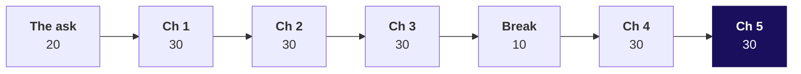
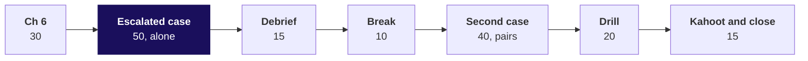

# Day sheet: Week 1, Wednesday. Which Q1 figure is right?

**TRAINER ONLY.** Nothing on this page reaches a learner.

Posts to <!-- sync:module:W01/D3 -->Module 1: Foundations of AI and Data<!-- /sync:module:W01/D3 -->, on <!-- sync:day-date:W01/D3 -->Wed 07 Oct 2026<!-- /sync:day-date:W01/D3 -->.

No IITGN faculty block on this day. The domain is retail, whose story Monday told; the dossier is
`content/W01/D1/study-notes/C2_W01_D01_domain_retail_STUDENT.md`, and today links to it rather than
re-telling it. Say once, in the ask, that both of Anand's figures count booked value, every order
whatever its status; the dossier's net revenue after cancellations and returns is a different number.

| | |
|---|---|
| **Start from** | Tuesday's functions and Tuesday's finding, Retail-Plus orders per customer 2.32 to 1.18, down 49 percent, measured on the export as delivered. Today re-runs it on the ERP exports, and the number moves. |
| **Go as far as** | Everyone ships a cleaned file, the logs, reconciled rows and rupees, the bridge from 2.1 to 1.9, Tuesday recomputed and the note to Finance, and can say for each technique which options were weighed and why this one. |
| **Stop before** | Statistics beyond counts and the median, imputation beyond a stated default, pandas. Say once that pandas and SQL re-run this pass in Week 2. |
| **Comes later** | Thursday asks whether the clean Retail-Plus fall is real or chance. Week 2 re-expresses the pass in SQL and pandas. |
| **Cut first** | `json.dump` in chapter 6 (show the read-back only), then the JSON feed in chapter 1. Never the reconciliation, never the recompute, never a chapter's options slide. |

---

## Morning block, 180 minutes



Every chapter runs the same thirty minutes: the need (3), the real company (2), the options sized
(5), the picture or the predict pair (4), the build (4), the trap (6), the fix and the second route
(4), Kavya's review (2). The options slide closes on **The call**, so Kavya's review stays the chapter's last beat.

| Part | Slides, half one | Beside it | What must land | If short of time |
|---|---|---|---|---|
| The ask, 20 | S1 to S6 | Board, drawings one and two | Four ways an export could produce either figure; rows first because a count is cheapest; profile, decide, reconcile, recompute on the board | S2's table read, not discussed |
| Chapter 1, what the ERP sent, 30 | S7 to S17 | Notebook 01_profile; guided profile pass | Everything read is text; the three counts; the text sort that names Rs 970; convert with a log; Q1 over amounts that convert is 2.1 | S16's feed to one sentence |
| Chapter 2, the rows that repeat, 30 | S18 to S26 | Notebook 02_duplicates; ch2 set after | Four keys sized; the dedupe that finds nothing; 15 orders twice; same count, other rows | S25 to one sentence |
| Chapter 3, the copy that stays, 30 | S27 to S37 | Notebook 03_identity_rule; ch3 set after | Four survivors sized; the rule; Q1 on the books; the tie in rupees that proves no rows; 98 percent in two rows | S36 to one sentence |
| Break, 10 | | | | |
| Chapter 4, missing or malformed, 30 | S38 to S47 | Notebook 04_missing_malformed; ch4 set after | Two decisions sized; keep and flag; discount unknown, never zero; the coerced zero; repair only from a witness | S41 and S42 to the answer alone |
| Chapter 5, the bridge to the books, 30 | S48 to S57 | Notebook 05_bridge; ch5 set after | Four proofs sized; the bridge; Tuesday smaller; the bulk order kept; the note | Never cut S51 to S55 |

The ch1 set runs after chapter 1 if the room is ahead, or in the practice lab if not; the same holds
for every chapter set.

## Afternoon block, 180 minutes



| Part | Slides, half two | Beside it | What must land | If short of time |
|---|---|---|---|---|
| Chapter 6, the log the analyst audits, 30 | S1 to S11 | Notebook 06_audit_logs; ch6 set after | Four hand-overs sized; the decisions log; rows tie while rupees do not; the replay | `json.dump` shown as read-back only |
| Escalated case, 50 | S12, S13 | `notebooks/ex1_escalated_case` and `exercises/unguided/escalated_case` | The full pass alone; eight notebook letters and ten brief letters; the note | Part 5's note becomes homework |
| Debrief, 15 | S14, S15 | The room's own numbers | Each wrong number traced to its step | S15 if nobody produced it |
| Break, 10 | | | | |
| Second case, 40 | S16 to S18 | `notebooks/ex2_auditor` and `exercises/unguided/auditor_question` | "Set aside with a reason", never "dropped"; rows and rupees by segment | Items 3 and 4 aloud only |
| Interview drill, 20 | S19, S20 | Study notes, "Where this gets tested" | Rule, today's number, the check, in under ninety seconds; the three design questions with a sizing each | The follow-ups to four, keeping two design questions |
| Kahoot and close, 15 | S21 to S23, D24 self-study | `kahoot/quiz` | The sentence to Anand; the six lines; tomorrow's question left open | Never cut S23 |

---

## Each chapter's options, call and second route

| Chapter | The options | The best-fit call, and what would switch it | The second route |
|---|---|---|---|
| 1 | Total and compare; scroll; sample 20; profile every field | Profile, then read the rows it flags; a file with no order key | A Counter over ids and the rejects log's length |
| 2 | Whole record; record less line; order_id; a fuzzy match on customer and amount within 60 days | order_id; two systems issuing their own ids | Rows less distinct ids, per quarter |
| 3 | First; last; the copy that validates; escalate all | The copy that validates, then the first; the ERP team calling the second extract a fix | A dict keyed by id over valid rows |
| 4 | Status: drop, default, impute, flag. Amount: coerce, reject, read the word, repair from a copy | Flag; reject, repair only from an independent copy; a delivery system to ask, or a same-extract copy | The profile of the clean file against the logs |
| 5 | Take the books; difference of totals; bridge by cause; rebuild from the feed | The bridge; a bridge that does not close | Bottom up: the kept orders summed |
| 6 | Clean file alone; file and a count; logs and control totals; a full diff | Logs and totals; an external auditor re-deriving every row | Replay the log on the raw export |

## The real company in each chapter

Every fact was checked on 30 September 2026; the provenance holds the URLs.

| Chapter | Company | The fact on the slide |
|---|---|---|
| 1 | Target Canada | Launched March 2013, almost a billion dollars lost in year one, announced in January 2015 it would close all 133 stores (CBC News); product data about 30 percent accurate (Salsify's summary of Canadian Business) |
| 2 | Starbucks | 22 and 23 May 2009, about 7,800 stores, about a million customers billed twice and repaid (NBC News and AP) |
| 3 | India's GST e-invoice portal | One invoice per supplier GSTIN, number, type and year; a repeat is rejected (GSTN FAQ 1.4); Rs 5 crore threshold from 1 August 2023 (Notification 10/2023) |
| 4 | Amazon UK | Hundreds of items at 1p for about an hour on 12 December 2014; most orders cancelled (BBC News) |
| 5 | Tesco | GBP 250 million first estimate, bridged to GBP 263 million, GBP 118 million of it in the first half (BBC News; Tesco interim results) |
| 6 | Patisserie Valerie | GBP 94 million hole (BBC News); auditor fined GBP 4 million, reduced to GBP 2.34 million (FRC, 27 September 2021). The criminal case is unresolved: name no person. |

---

## The traps, each with its exact wrong number

| Chapter | The wrong number | The decision it would mislead | The check that catches it | The fix and what changed |
|---|---|---|---|---|
| 1 | Largest Q2 order Rs 970; top three `'970', '970', '952000'` | The analyst audits three small orders and skips the quarter's money | Rs 970 sits below the smallest Business order, Rs 2,03,060 | Convert, then sort: Rs 29,45,460 on top; top three Rs 62,11,460 against Rs 9,53,940 |
| 2 | 0 duplicates; Q1 stays Rs 2,09,98,210 | Tell Anand his books are Rs 20 lakh short | 201 rows against 186 distinct order ids | The order_id key: 15 orders twice, 14 in Q1 |
| 3 | Q1 Rs 1,90,00,000 "ties", 188 orders, Q2 Rs 1,87,03,710 | Ship a file that counts one Q2 Retail-Plus order twice | 188 rows kept against 186 ids | The identity rule: 186 orders, Q2 down Rs 3,710 |
| 4 | 201 of 201 convert, 0 rejects, Q1 Rs 1,89,98,210 with an order at Rs 0 | Call the file clean | An order worth Rs 0 when the smallest real one is Rs 680; failures went from 1 to 0 with nothing fixed | Reject, then prefer the copy that validates: Q1 on the books |
| 5 | Q2 Rs 1,57,54,540; the drop 17.1 percent | Marketing funds a rescue; Finance rejects the pass | A Business order, a customer with orders in both quarters, every field valid | Keep and flag, show both: Q2 Rs 1,87,00,000, the drop 1.6 percent |
| 6 | 201 = 185 + 16; Rs 20,00,000 set aside; Q1 Rs 1,89,98,210 | A note that says "reconciled" and fails the rupee tie-out | Books less clean Q1 is Rs 1,790; a rejected order has a valued twin in the set-aside log | Convert inside the rule: 201 = 186 + 15, Q1 equal to the books |

Chapters 2, 4, 5 and 6 carry the spine's four traps. Chapters 1 and 3 carry traps this build added so
every chapter has one; the provenance records both.

Tuesday's dashboard read Q1 as Rs 2,10,00,000 because Tuesday's v1 file carried both copies of the
unreadable order at a value; today's export has one copy unreadable, so Q1 as exported reads
Rs 2,09,98,210. Both round to 2.1 crore. If a learner asks, that is the answer: the number moves
because the export moved, and today's bridge starts from today's file.

The runtime errors are met, read and left in two minutes each; none is a trap.

```text
FileNotFoundError: [Errno 2] No such file or directory: 'orders.csv'
ValueError: invalid literal for int() with base 10: 'twelve'
JSONDecodeError: Unterminated string starting at: line 1397 column 15 (char 27679)
```

---

## Checkpoints

| When | Every learner has | If not |
|---|---|---|
| End of chapter 1 | The profile table and a rejects log of one | Pair them with a neighbour for chapter 2's opening |
| End of chapter 3 | 186 orders and 15 rows set aside, Q1 Rs 1,90,00,000 | Point at `identity_rule()` in notebook 03 |
| End of chapter 5 | The bridge closing to the books; Retail-Plus -35.0 percent | The escalated case re-runs the pass; start them there |
| End of chapter 6 | A replay that rebuilds the clean file | Show the replay cell and move on |
| End of the escalated case | Eight letters 1b 2c 3d 4b 5a 6c 7b 8d; ten letters 1b 2d 3a 4c 5b 6a 7d 8c 9a 10b | Release the solution twin at the debrief |
| End of the second case | Five and five letters: notebook 1b 2a 3b 4b 5c, brief 1c 2a 3d 4b 5c | Walk items 3 and 4 aloud |

Chapter set keys: ch1 1c 2a 3d 4b 5d 6c; ch2 1b 2c 3a 4d 5c 6d; ch3 1d 2a 3b 4c 5c; ch4 1c 2a 3d 4b 5d;
ch5 1c 2b 3d 4a 5c; ch6 1c 2a 3b 4d 5c.

---

## What is planted, and what the room should find

Data version v2 from `data/generate_client_zero.py`, client zero v2.2 section 7. Name none of them to
the room before it finds it.

| Plant | Where the room meets it | What to do if nobody finds it |
|---|---|---|
| 14 duplicated Q1 rows carrying Rs 19,98,210 (12 consumer, 2 corporate at Rs 9,83,780 each) | Chapter 1's distinct count, chapter 2's groups, chapter 5's bridge | Ask for rows and distinct ids per quarter; never say "duplicates" first |
| One amount spelled `twelve`, order KR-02063, line 64, whose migration copy on line 197 carries Rs 1,790 | Chapter 1's ValueError and rejects log; chapter 3's survivor; chapter 4's coerced zero; chapter 6's colleague | Ask them to print the rejects log and open the CSV at the line |
| One record missing `status`, order KR-02119, Q2, Rs 1,850, line 120 | Chapter 1's profile; chapter 4's decision | Ask which field is present on 200 rows |
| A near-duplicate pair on KR-02151, both Q2 at Rs 3,710, dated 25 September and 2 August | Chapter 3's your-turn cell and its trap, Q2 Rs 3,710 high | Ask which pair's copies disagree, and on what |
| A truncated JSON line, the feed cut inside the 120th record's order id | Chapter 1's second witness; chapter 4's repair; the practice lab | Ask them to open the file at the line and column the error names |
| A companion file with the header duplicated, the vendor copy | The practice lab, problems 2 and 4 | Ask them to print the rows whose amount fails |

Not a v2 plant, and found by sorting: the largest Q2 order, KR-02186, Business, customer C-4004,
Rs 29,45,460, 1.66 times the next. C-4004 ordered in both quarters. Also not a plant: KR-02087 in Q1
and KR-02185 in Q2, both C-4001 at Rs 17,71,000, the real pair the fuzzy match merges in chapter 2.

The take-home export, `C2_W01_D03_takehome_STUDENT.csv`, carries its own: the header row pasted in at
line 46, a refund posted as a negative amount of Rs 2,400 (KR-02018), a date in the other format
`12/05/2026` (KR-02030), an empty status (KR-02052), and 6 exact copies, four Retail-Core and two
Retail-Plus, carrying Rs 14,210. A correct pass reads 97 rows, keeps 90 orders and sets aside 7; Q1 is
Rs 80,53,330 with the refund flagged outside revenue, or Rs 80,50,930 netted.

---

## The numbers, so you are never caught out

| Number | Value |
|---|---|
| Rows in the CSV / distinct order ids | 201 / 186 |
| Q1 rows / Q1 orders; Q2 rows / Q2 orders | 114 / 100; 87 / 86 |
| Q1 as exported, amounts that convert; Q2 as exported | Rs 2,09,98,210; Rs 1,87,03,710 |
| Q1 clean, the books; Q2 clean | Rs 1,90,00,000; Rs 1,87,00,000 |
| Rupees set aside in Q1: corporate copies / consumer copies | Rs 19,67,560 / Rs 30,650 |
| Revenue change Q1 to Q2: as Tuesday reported / clean | -11.0% / -1.6% |
| Retail-Plus orders per customer: Tuesday / clean | 2.32 to 1.18, -49.0% / 1.82 to 1.18, -35.0% |
| Retail-Core orders per customer: Tuesday / clean | -5.3% / -2.7% (1.09 to 1.06) |
| Q2 delivered share: keep and flag / default or impute / drop | 57 of 86, 66.3% / 58 of 86, 67.4% / 57 of 85, 67.1% |
| Average discount: over 131 orders that carry one / blanks as zero | about Rs 67 / about Rs 47 |
| Fuzzy match: rows flagged / shared with order_id / real rupees removed / pairs compared | 15 / 14 / Rs 17,71,000 / 20,100 |
| Sampling 20 of 201 rows: chance to draw both copies of a pair / the bad amount | 13% / 10% |
| JSON feed: complete records / Q1 among them / amounts agreeing with clean | 119 / 100 / 118 |
| Hand-over lines: logs and totals / full diff / clean file read against the raw | 23 / 201 / 387 |
| Smallest real order; smallest Business order | Rs 680; Rs 2,03,060 |

---

## The interview questions, answered in one breath

| Tag | Question | One breath |
|---|---|---|
| [S] | How do you handle missing data? | Measure it per field, ask what the absence means, then drop, default or keep and flag with a written reason, sized on what each moves; never fill money. |
| [S] | Finance and your dashboard disagree; what do you do? | Both are honest arithmetic on different inputs: get Finance's figure to the rupee, profile the source, bridge one move per cause, reconcile rows and rupees, then fix and recompute. |
| [F] | How do you find duplicates, and what makes two records the same? | The business's identity rule first, rows against distinct keys, one row per key preferring the copy that validates, a reason per row, weighed in money. |
| [F] | Everything read from a CSV is a string; what breaks and where do you convert? | Arithmetic, comparison and sorting; convert once at the boundary in one function that returns a value or a reason, and log failures. |
| [D] | An auditor asks why you dropped 14 rows. | Set aside, not dropped: 14 Q1 copies by the order_id rule, the valid copy kept, Rs 19,67,560 in two corporate rows, 114 = 100 + 14, the rupees tie and the log replays. |
| [F] | A dedupe returns zero. Believe it? | Only after counting distinct business keys against rows; a timestamp or line in the key makes every row unique. |
| [F] | Row counts reconcile. Done? | No: rows prove nothing vanished, rupees prove the right rows stayed; today's colleague was Rs 1,790 short. |
| [S] | The largest order is 1.66 times the next. Remove it? | Check the record before the size; keep, flag, show both; removing it turns 1.6 percent into 17.1. |
| [D] | Order id, whole record or fuzzy, for customers from two apps? | Clean phone and email, block by city, review doubtful pairs; the fuzzy match merged a real Rs 17,71,000 order today; switch back to a key when one system issues it. |
| [D] | Coerce, reject or repair a malformed amount? | Reject to a log; repair only from an independent source; a zero cost Rs 1,790 today; switch to a rule only for an exact format fix. |
| [D] | Bridge or rebuild from a second source? | Bridge when a log backs each move; rebuild only from an independent, complete source, which the feed was not. |
| [SV] | Clean a file you have never seen. | Profile, convert with a log, identity rule, decide each defect with a reason, reconcile twice, recompute. |
| [D] | Cleaning shrank yesterday's finding. | The smaller number first, what changed and why, and whether the decision still holds. |

---

## The practice lab

The TA runs it from `exercises/practice/C2_W01_D03_lab_STUDENT.md` with the note in
`trainer/C2_W01_D03_lab_note_TRAINER.md`: four problems, about an hour, key 1b 2c 3b 4c 5a 6a 7d 8b 9d
10a 11b. A learner who did not finish a chapter set in class starts the lab with it.

## Which file for which moment

| Moment | File |
|---|---|
| Morning, on the projector | `slides/C2_W01_D03_half1_STUDENT.pptx` |
| Chapters 1 to 6, demonstration | `notebooks/C2_W01_D03_01_profile_STUDENT.ipynb`, `02_duplicates`, `03_identity_rule`, `04_missing_malformed`, `05_bridge`, `06_audit_logs` |
| Chapter 1, built together | `exercises/guided/C2_W01_D03_profile_pass_STUDENT.md` |
| After each chapter | `exercises/unguided/` ch1_profile to ch6_audit |
| Any time a decision needs to move on screen | `demos/C2_W01_D03_reconciliation_STUDENT.html` |
| For learners to keep | `demos/C2_W01_D03_decision_tool_STUDENT.xlsx` |
| Afternoon, on the projector | `slides/C2_W01_D03_half2_STUDENT.pptx` |
| Escalated case and second case | `notebooks/C2_W01_D03_ex1_escalated_case_STUDENT.ipynb`, `notebooks/C2_W01_D03_ex2_auditor_STUDENT.ipynb` |
| Close | `kahoot/C2_W01_D03_quiz_STUDENT.md` |
| Tonight | `takehome/`, `preread/`, `study-notes/`, `cheatsheets/` |
