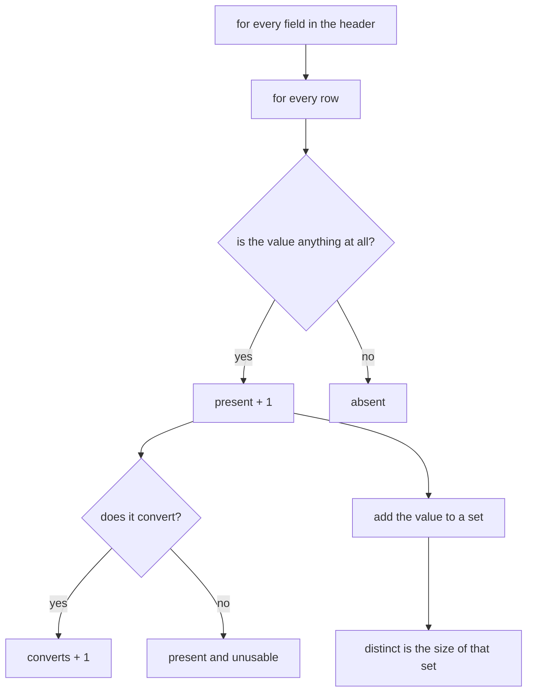
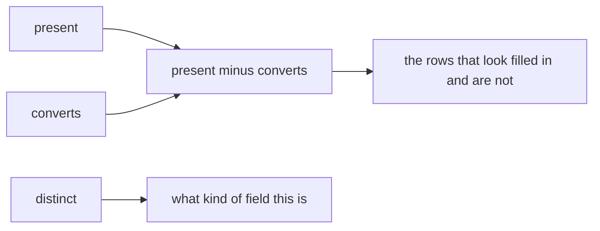
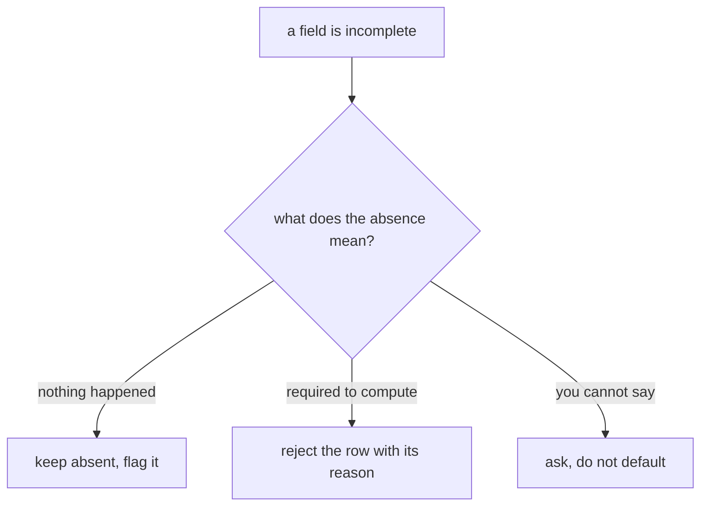
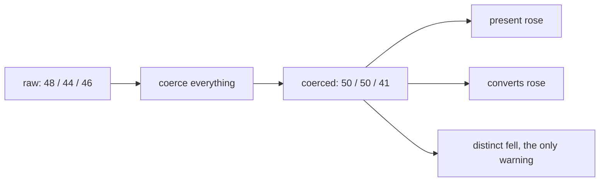
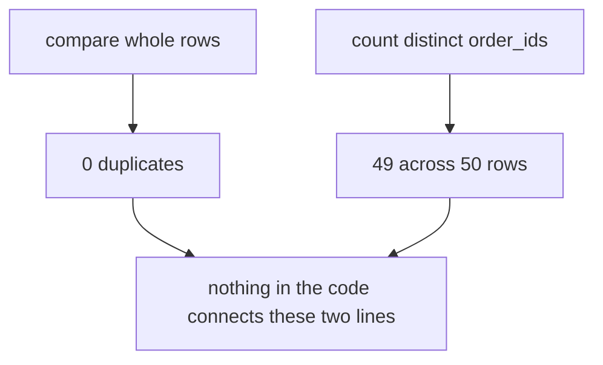
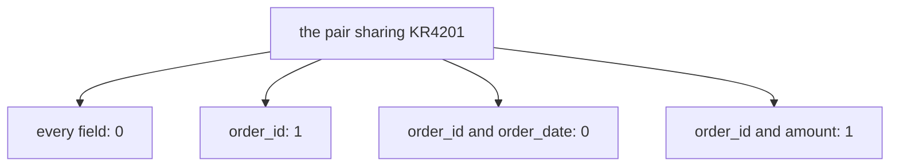
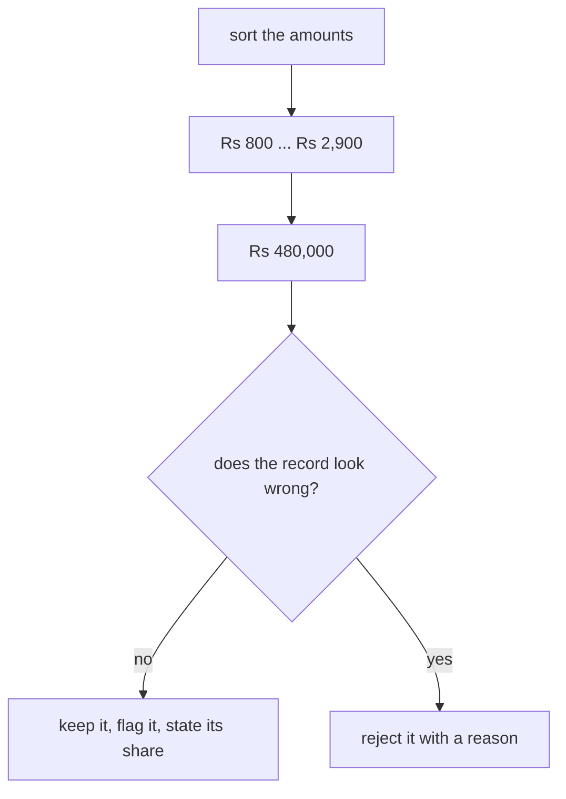
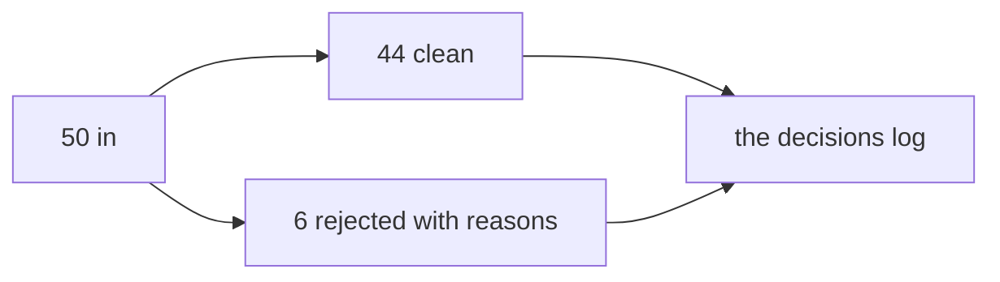

# Board diagrams: Week 1, Day 3

Every diagram the day uses, as a fence a trainer can draw from and a learner can redraw.

## 1. The profiler, as two loops and a set

## 2. The three counts as a work list

## 3. Missing is a three-way decision

## 4. The coercion trap

## 5. Two numbers that disagree

## 6. Four identity rules, three answers

## 7. The order at the end of the column

## 8. What ships

