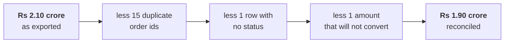
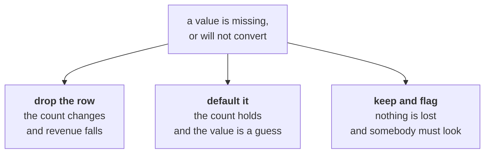

# The reconciliation bridge

The one drawing for Day 3. Two figures for the same quarter, both computable, only one right. The
drawing is what turns "I cleaned the data" into something an auditor can follow.

---

## What goes on the board, in the order it goes up

**Step 1. Write both numbers, and refuse to pick yet.**

```
DASHBOARD  Rs 2.10 crore        FINANCE  Rs 1.90 crore
```

Underneath: **both are computable from data somebody has.** The job is not to decide who is more
senior. It is to find the Rs 20 lakh.

**Step 2. Ask what an export can do that arithmetic cannot.**

Collect from the room before drawing anything. You want at least four:

- Rows duplicated by a migration that ran twice.
- Two extracts stitched together with an overlap.
- A row counted in both a header and a body.
- Cancelled orders included in one figure and not the other.
- A currency or unit difference nobody wrote down.

Notice that none of them is "the amounts are wrong". That is the insight of the morning.

---

## The identity equation

```
INPUT  =  CLEAN  +  REJECTED
```

Write it large. It is the only equation of the day, and every cleaning pass that cannot produce it
is a pass nobody can check.

| Term | On Wednesday's file |
|---|---|
| Input | 201 rows, as the export arrived |
| Clean | 184 rows, which is what the analysis runs on |
| Rejected | 17 rows, each with a written reason |
| Reconciles? | 184 + 17 = 201 ✓ |

**The rejected rows are a deliverable, not a by-product.** An auditor asks about them by name.

---

## The revenue bridge



Draw it left to right with the number written at each step. A bridge that does not land on
Finance's figure is a bridge with a step missing, and the missing step is the finding.

---

## The three-way decision, and it is always three



There is no free option. Write the choice, the reason and the count in the decisions log, because
that log is what an auditor reads.

---

## The identity rule

Two rows can be the same order in three different ways, and they need different answers.

| What is the same | What differs | Is it a duplicate? |
|---|---|---|
| Every field | Nothing | Yes, and a whole-record check finds it |
| The order id | The order date | **This is the hard one.** Same order, two versions. Which date is right? |
| Everything except the id | The id | Probably two real orders that look alike. Keep both. |

**The sentence to get out of the room:** a duplicate is not "a row that looks the same", it is "a row
that is the same order", and you have to say which fields decide that before you dedupe anything.

---

## The thing that must not be cleaned

The Rs 4,80,000 corporate order is an outlier and it is **real**. It survives the pass, and the
decisions log records that it was looked at and kept.

Cleaning is not making the data look tidy. Remove every uncomfortable row and you have a dataset
that agrees with you.

---

## What has to be on the board when the day ends

1. Both of Anand's figures, with the Rs 20 lakh gap between them named.
2. `INPUT = CLEAN + REJECTED`, with today's three numbers filling it.
3. The revenue bridge, landing on Rs 1.90 crore.
4. The recomputed Tuesday finding, smaller, with the number that changed circled.

The fourth one is the honest one. Tuesday said Retail-Plus fell 49 percent; on clean data it fell
33. The finding survives and the number moved, and saying so is the job.
