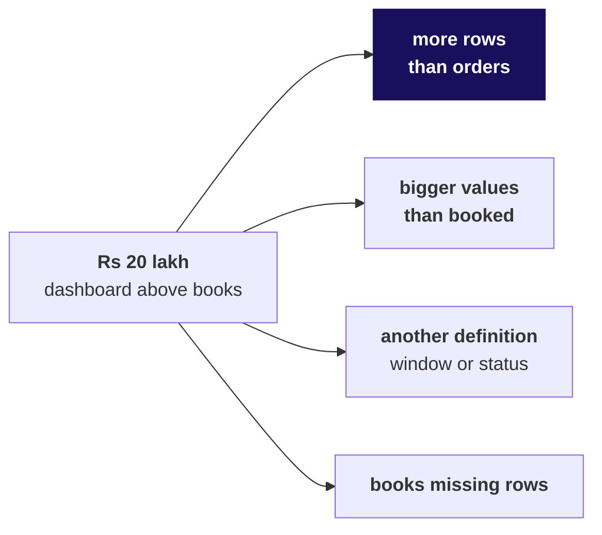
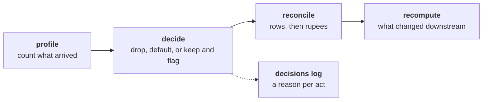
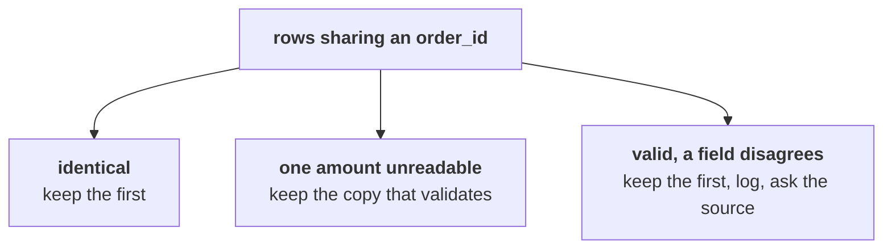
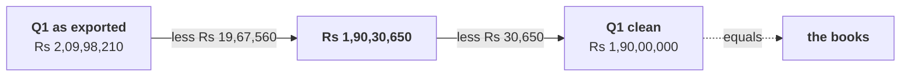
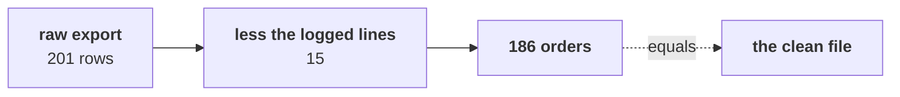

# Which Q1 figure is right, drawn on the board one question at a time?

Week 1, Wednesday. Seven drawings, in the order they go up, each drawn with the room before the
screen shows the same thing, and each headed by the question it answers. Kalpa's dashboard reads Q1
at Rs 2.1 crore from an orders CSV out of the ERP, the enterprise resource planning system Finance
books orders in; the books, Finance's own record, say Rs 1.9 crore. The last section is what the
board holds when the day ends.

## How could an export read Rs 20 lakh above the books?

The first drawing, made in the first twenty minutes, before any file is opened.

```mermaid
flowchart LR
    G["<b>Rs 20 lakh</b><br/>dashboard above books"] --> U["<b>more rows<br/>than orders</b>"]
    G --> V["<b>bigger values<br/>than booked</b>"]
    G --> D["<b>another definition</b><br/>window or status"]
    G --> L["<b>books missing rows</b>"]
    classDef bet fill:#1A0F5C,stroke:#1A0F5C,color:#FFFFFF
    class U bet
```

The room adds one way per branch. The lit branch goes first because a count is the cheapest check.

## Which four moves does the day make, and in what order?

The second drawing, which stays up all day, since every chapter points back at one of its boxes.

```mermaid
flowchart LR
    P["<b>profile</b><br/>count what arrived"] --> C["<b>decide</b><br/>drop, default, or keep and flag"]
    C --> R["<b>reconcile</b><br/>rows, then rupees"]
    R --> T["<b>recompute</b><br/>what changed downstream"]
    C -.-> L["<b>decisions log</b><br/>a reason per act"]
```

## Which of the profile's counts do not fit 201 rows?

The third drawing: three counts per field, present, convertible and distinct.

| Field | Present | Convertible | Distinct |
|---|---|---|---|
| order_id | 201 | text | 186 |
| amount | 201 | 200 | 161 |
| status | 200 | text | 3 |

Drawn in chapter 1. The three counts that do not fit 201 are order_id's 186 distinct, amount's 200
convertible and status's 200 present; circle them. Each is a question for a later chapter, written
beside the table and ticked off as it is answered.

## Which key says two rows are one order without removing a real one?

The fourth drawing, made in chapter 2 as a table the room fills in before the notebook sizes it. The
order_id is the answer: 15 rows, and no real order removed.

| Key | Rows flagged | Real orders removed |
|---|---|---|
| Whole record, line included | 0 | none |
| Whole record less the line | 13 | none |
| order_id | 15 | none |
| Fuzzy: customer and amount, 60 days | 15 | one, Rs 17,71,000 |

Beside it: "same count, other rows".

## When two rows share an order_id, which copy stays?

The fifth drawing, made in chapter 3 beside the words "the file line is where a row sat, not what the
order is".

```mermaid
flowchart TB
    K["<b>rows sharing an order_id</b>"] --> I["<b>identical</b><br/>keep the first"]
    K --> U["<b>one amount unreadable</b><br/>keep the copy that validates"]
    K --> D["<b>valid, a field disagrees</b><br/>keep the first, log, ask the source"]
```

## Which moves walk Q1 from Rs 2,09,98,210 down to the books?

The sixth drawing, the bridge: a walk from one total to another, one move per cause.

```mermaid
flowchart LR
    E["<b>Q1 as exported</b><br/>Rs 2,09,98,210"] -->|"less Rs 19,67,560"| A["<b>Rs 1,90,30,650</b>"]
    A -->|"less Rs 30,650"| B["<b>Q1 clean</b><br/>Rs 1,90,00,000"]
    B -.->|"equals"| K["<b>the books</b>"]
```

Drawn in chapter 5. Under it, the two equations: rows 201 = 186 + 15, and rupees 2,09,98,210 less
19,98,210 = 1,90,00,000. Beside it, Monday's tree recomputed as Q2's multiple of Q1: customers
x1.000, orders per customer x0.860, revenue per order x1.144, revenue x0.984, with Tuesday's x1.000,
x0.754, x1.180 and x0.890 written above and crossed through.

## Can the clean file be rebuilt from the raw export and the log alone?

The seventh drawing, made in chapter 6, after lunch. Yes: 201 rows less the 15 logged lines give the
186 orders.

```mermaid
flowchart LR
    R["<b>raw export</b><br/>201 rows"] --> M["<b>less the logged lines</b><br/>15"]
    M --> C["<b>186 orders</b>"]
    C -.->|"equals"| P["<b>the clean file</b>"]
```

Beside it: "a log is finished when a stranger can replay it".

## What is on the board when the day ends?

The four moves across the top; the profile table with its three circled counts, each ticked; the
four keys; the copy tree; the bridge with its two equations; the replay; and in the corner, Tuesday's
numbers crossed through and replaced: revenue -11.0% becomes -1.6%, orders per customer x0.754
becomes x0.860, and Retail-Plus -49.0% becomes -35.0%. Tomorrow's question is written under them,
unanswered: is the -35.0% fall real, or chance?
