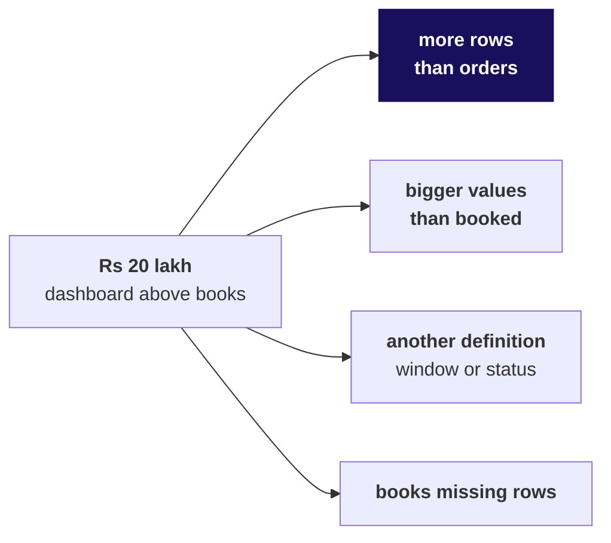
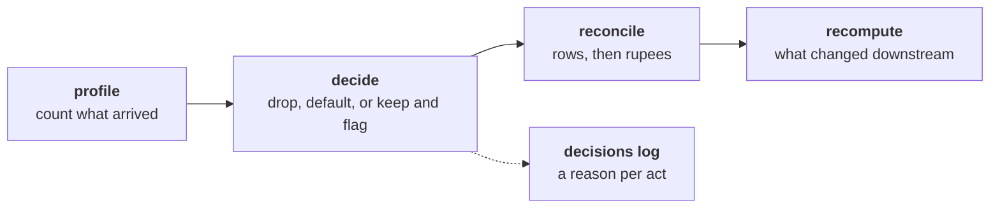
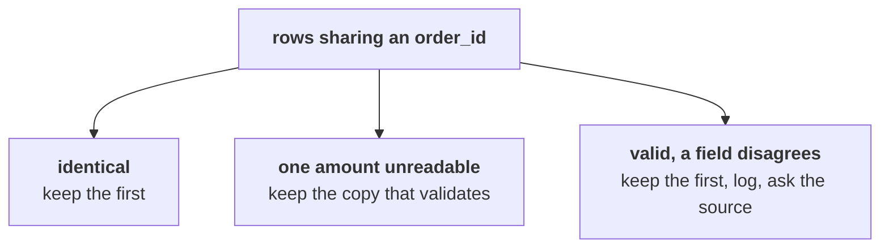
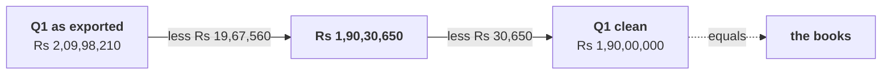

# The reconciliation, as it goes up on the board

Week 1, Wednesday. Five drawings, in the order they go up, each drawn with the room before the
screen shows the same thing. The last section is what the board holds when the day ends.

## First drawing: two figures, and four ways an export could produce either

Drawn in the first twenty minutes, before any file is opened.

```mermaid
flowchart LR
    G["<b>Rs 20 lakh</b><br/>dashboard above books"] --> U["<b>more rows<br/>than orders</b>"]
    G --> V["<b>bigger values<br/>than booked</b>"]
    G --> D["<b>another definition</b><br/>window or status"]
    G --> L["<b>books missing rows</b>"]
    classDef bet fill:#1A0F5C,stroke:#1A0F5C,color:#FFFFFF
    class U bet
```

The room adds one way per branch. The lit branch goes first because a count is the cheapest check.

## Second drawing: the four moves of the day

```mermaid
flowchart LR
    P["<b>profile</b><br/>count what arrived"] --> C["<b>decide</b><br/>drop, default, or keep and flag"]
    C --> R["<b>reconcile</b><br/>rows, then rupees"]
    R --> T["<b>recompute</b><br/>what changed downstream"]
    C -.-> L["<b>decisions log</b><br/>a reason per act"]
```

This one stays up all day. Every round points back at one of its boxes.

## Third drawing: the profile, three counts per field

| Field | Present | Convertible | Distinct |
|---|---|---|---|
| order_id | 201 | text | 186 |
| amount | 201 | 200 | 161 |
| status | 200 | text | 4 |

Circle the three counts that do not fit 201. Each is a question for a later rung, written beside the
table and ticked off as it is answered.

## Fourth drawing: what makes two rows one order

```mermaid
flowchart TB
    K["<b>rows sharing an order_id</b>"] --> I["<b>identical</b><br/>keep the first"]
    K --> U["<b>one amount unreadable</b><br/>keep the copy that validates"]
    K --> D["<b>valid, a field disagrees</b><br/>keep the first, log, ask the source"]
```

Drawn after the dedupe that found nothing, beside the words "the file line is where a row sat, not
what the order is".

## Fifth drawing: the bridge

```mermaid
flowchart LR
    E["<b>Q1 as exported</b><br/>Rs 2,09,98,210"] -->|"less Rs 19,67,560"| A["<b>Rs 1,90,30,650</b>"]
    A -->|"less Rs 30,650"| B["<b>Q1 clean</b><br/>Rs 1,90,00,000"]
    B -.->|"equals"| K["<b>the books</b>"]
```

Under it, the two equations: rows 201 = 186 + 15, and rupees 2,09,98,210 less 19,98,210 = 1,90,00,000.

## What is on the board when the day ends

The four moves across the top; the profile table with its three circled counts, each ticked; the
copy tree; the bridge with its two equations; and in the corner, Tuesday's two numbers crossed
through and replaced: revenue -11.0% becomes -1.6%, and Retail-Plus -49.0% becomes -35.0%. Tomorrow's
question is written under them, unanswered: is -35.0% on 22 members real, or chance?
