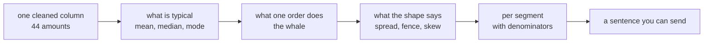
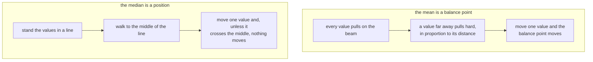
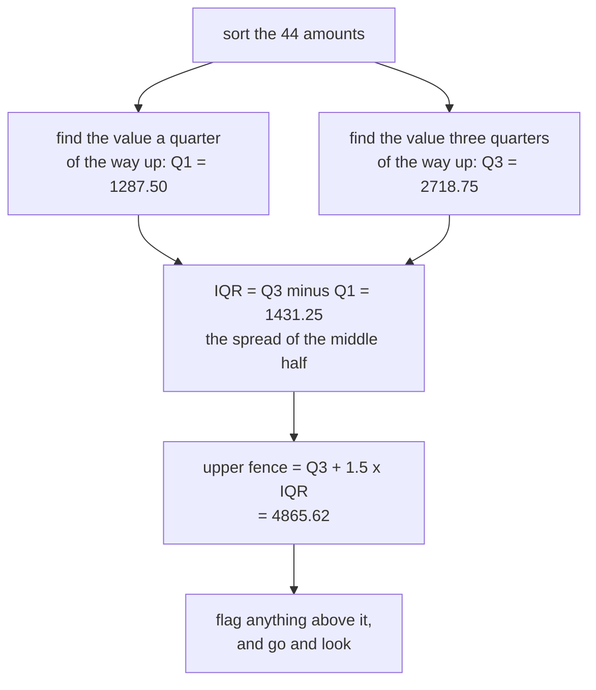

# Half one: describe without misleading

Week 1, Day 4. Slide source. One idea per slide.

Slides numbered S are the spine and are delivered in order. Slides numbered D go deeper and carry a DEPTH mark. A trainer skips them live when time is short, and you read them afterwards.

Position bar, repeated at every section boundary:
`[one column] > [what is typical] > [what one order does] > [what the shape says] > [per segment, with denominators]`

---

## S1. Describe without misleading

Yesterday you decided which of Kalpa's fifty orders were usable. Today somebody asks what they say.

The three questions this half answers: what is a typical order, what does one strange order do to that answer, and what shape is hiding behind the number you are about to send.

---

## S2. Where we are

`[one column] > [what is typical] > [what one order does] > [what the shape says] > [per segment, with denominators]`

You own a profiled file and a decisions log. Every number today comes off that file and nothing else. Describing data you have not cleaned is yesterday's mistake, and this room already made it once on purpose.

Two things you inherited and should keep in view: `KR4201` still appears twice, because you chose to keep both rows and flag the pair. Student held twelve orders in the raw file and holds ten now, because two failed conversion.

---

## S2b. Where this is going

Two true statements about the same 44 orders:

```
The average Kalpa order is Rs 12,753.30.
Forty-three of the forty-four orders are below Rs 3,000.
```

Both are correct. One of them would get you removed from the account.

By the end of this half you will know which number to send and what sentence has to go with it.

---

## S3. The anchor

Somebody outside your team asks a question you have heard a hundred times:

> What is our average order value?

It sounds like a request for one number. It is a request for a description of a shape, and the shape is what nobody has looked at yet.

---

## S3b. The whole day in one picture



Half one is the first four stops. Half two is the last one, and it is the one that decides whether anybody should act on your number.

---

## SECTION 1: WHAT IS TYPICAL

`[one column] > **[what is typical]** > [what one order does] > [what the shape says] > [per segment, with denominators]`

---

## S4. Seven orders, on paper

The first seven orders in your profiled file, amount column only:

```
1280   1865   2270   2835   1310   1145   1030
```

Pens down on the keyboard. This one is done by hand.

---

## S5. Mean: add them up, share them out

```
1280 + 1865 + 2270 + 2835 + 1310 + 1145 + 1030 = 11735
11735 / 7 = 1676.43
```

The mean is Rs 1,676.43. It is the value every order would carry if the total were shared out equally.

It uses every order, which is its strength and the whole of its weakness.

---

## S6. Median: stand them in a line, take the middle one

```
1030   1145   1280   [1310]   1865   2270   2835
                       ^
                  4th of 7
```

The median is Rs 1,310. Half the orders sit at or below it, half at or above it.

It uses the order of the records and almost nothing about their size.

---

## S7. Now swap one order

Keep the same seven. Replace the largest, Rs 2,835, with the largest order in the real file: Rs 480,000.

| Statistic | Before | After |
|---|---|---|
| Mean | Rs 1,676.43 | Rs 69,842.86 |
| Median | Rs 1,310 | Rs 1,310 |

One order moved the mean by nearly forty-two times. The median did not move at all.

That is the entire day in one table.

---

## D1. The three, written as arithmetic

Sorted values are written $x_1 \le x_2 \le \dots \le x_n$.

$$\text{mean} = \bar{x} = \frac{1}{n}\sum_{i=1}^{n} x_i$$

$$\text{median} = \begin{cases} x_{(n+1)/2} & n \text{ odd} \\[4pt] \dfrac{x_{n/2} + x_{n/2+1}}{2} & n \text{ even} \end{cases}$$

$$\text{mode} = \text{the value } x \text{ occurring most often}$$

Read the mean formula and notice that every $x_i$ appears in it exactly once, with equal weight. Read the median formula and notice that almost none of them appear at all. That difference is not a detail, it is the whole of today.

---

## D2. Mean and median as two different machines



The mean asks how much. The median asks how many are on each side. That is why one of them can be dragged by a single record and the other cannot.

---

## S8. Mode: the value that shows up most

In your 44 orders, the most repeated amount appears **twice**.

Twice out of forty-four. It describes four percent of the file and nothing else.

Mode earns its keep on categories, where "the most common segment" or "the most common status" is a real answer. On a money column it is close to useless, and knowing why is more valuable than knowing the definition.

---

## D3. How wrong can the data be before the statistic is wrong

Ask of any summary: how many records would have to be corrupted before the number stops describing the file.

| Statistic | Records that must be wrong | As a share of today's 44 |
|---|---|---|
| Mean | One is enough, if it is extreme enough | 2.3 percent |
| Median | Half the file, because the middle position cannot be moved from one side alone | 50 percent |
| Mode | Enough repeats of one value to overtake the current winner, so it depends entirely on the data | Not fixed |

This is the reason a median is the safer default on a column you have not fully audited. It is not that the median is more accurate. It is that it is harder to break.

---

## S9. Three answers, three questions

| Statistic | The question it actually answers |
|---|---|
| Mean | If the total were shared equally, what would each order carry |
| Median | What does the order in the middle of the queue look like |
| Mode | Which exact value repeats most often |

Nobody is right. They answer different questions, and the asker rarely says which one they meant.

---

## SECTION 2: WHAT ONE ORDER DOES

`[one column] > [what is typical] > **[what one order does]** > [what the shape says] > [per segment, with denominators]`

---

## S10. The same code, on the real column

You just did this by hand on seven orders. Here it is on all 44.

```
mean amount over 44 orders: Rs 12,753.30
```

The code is correct. Check it if you like. Add them, divide by 44, you get Rs 12,753.30.

---

## S11. Two more lines, and the number falls apart

```
mean amount over 44 orders: Rs 12,753.30
orders at or above Rs 12,753.30: 1
orders below Rs 12,753.30: 43
```

The average describes one order out of forty-four.

Forty-three of Kalpa's customers are below the number you were about to call typical.

---

## S12. Sort the column and look at the tail

```
... 2,855   2,895   2,895   2,930   2,990   2,995   480,000
```

There it is.

The second largest order in the entire file is Rs 2,995. The largest is Rs 480,000, which is a hundred and sixty times the one below it.

---

## S13. The whale

```
KR4232   C1749   Retail-Core   480000   delivered   2026-08-19
```

One order. It carries **85.5 percent of every rupee in the file**.

It is not a typo, not a text value, not a duplicate. Yesterday's pass looked at it and kept it, and the decisions log says why: it converts cleanly and is well formed, so it is real until somebody says otherwise, and it was raised with the order book owner.

An order can be correct and still wreck every summary it touches.

---

## S14. What it costs, in two rows

| Column | With the whale | Without it |
|---|---|---|
| All orders, mean | Rs 12,753.30 | Rs 1,887.09 |
| All orders, median | Rs 1,910.00 | Rs 1,865.00 |

Take one order out of forty-four and the mean falls by a factor of nearly seven, landing within Rs 22 of the median. The median moves by Rs 45.

**That is the tell.** When removing a single record makes the mean and the median agree, the mean was describing that record rather than the business.

---

## S15. So delete it?

No.

Deleting a real order to make a number look nicer is how a report becomes fiction. Yesterday you wrote a decisions log precisely so that nobody could do this quietly.

The order stays. The statistic changes.

---

## D4. Which statistic survives a wrong record, on this file

Suppose exactly one amount in the file is wrong, and you do not know which.

| What is wrong | What happens to the mean | What happens to the median |
|---|---|---|
| The Rs 480,000 order should have been Rs 4,800 | Falls from Rs 12,753.30 to Rs 1,953.30 | Stays at Rs 1,910 |
| An ordinary Rs 1,865 order should have been Rs 1,900 | Rises by 80 paise | Moves to Rs 1,927.50 |
| A Rs 2,995 order is a duplicate and should not be there | Rises by Rs 226.94, because the whale is now shared among 43 | Falls to Rs 1,865 |

One row in the first line does more damage to the mean than every other error you are likely to have, put together. That is what the breakdown table above means in practice.

Read the third line twice. Removing an ordinary order made the mean go up by Rs 226.94, because the whale is now divided among forty three orders instead of forty four. On a column with a tail, even the direction of a change stops being intuitive.

---

## S16. The rule for money columns

> On any money column, report the median and say so.

This is not this programme's opinion. Statistical agencies report median household income rather than mean household income, because a small number of very large incomes drag the mean away from anything a household would recognise.

Order values behave the same way. So do salaries, claim sizes, invoice amounts and basket totals.

---

## SECTION 3: WHAT THE SPREAD SAYS

`[one column] > [what is typical] > [what one order does] > **[what the shape says]** > [per segment, with denominators]`

---

## S17. Three numbers you get for free

```
min:    Rs      800
max:    Rs  480,000
range:  Rs  479,200
```

The range is one subtraction and the least stable number on this slide. It is built from exactly two orders out of forty-four, and one of them is the whale.

A statistic computed from two orders out of forty-four tells you about those two orders.

---

## S18. The fence, done properly

Yesterday you flagged the whale with a fence at ten times the middle order. That worked and it was deliberately crude, because somebody chose the ten.

Here is the standard version, built from the spread of the middle half rather than from a number anybody picked.

```
Q1 (a quarter of the way up):        Rs  1,287.50
Q3 (three quarters of the way up):   Rs  2,718.75
IQR = Q3 - Q1 =                      Rs  1,431.25
upper fence = Q3 + 1.5 x IQR =       Rs  4,865.62
```

---

## D5. How the fence is built, step by step



The middle half is what makes this better than yesterday's fence. Q1 and Q3 are positions, so the whale cannot pull on them, which means the threshold that catches the whale is built from data the whale did not touch.

---

## S19. What the fence catches here

```
orders above Rs 4,865.62: 1
```

One order. The whale, and nothing else. The largest ordinary order at Rs 2,995 sits comfortably inside the fence.

Two rules, built differently, agreeing on the same single record. That agreement is worth more than either rule alone.

---

## S20. A fence is a flag, never a delete key

The fence says "look at this order". It does not say "remove this order".

Yesterday's language holds: an outlier is a finding to investigate before it is a row to delete. The fence just finds it faster, on a file too large to eyeball.

---

## SECTION 4: THE SHAPE BEHIND THE NUMBER

`[one column] > [what is typical] > [what one order does] > **[what the shape says]** > [per segment, with denominators]`

---

## D6. What today deliberately does not compute, and why

You could put a number on the lopsidedness. There is a standard one, and it needs the standard deviation, which needs the squared distance of every value from the mean.

That is not on today's list, and the reason is worth saying out loud rather than hiding.

Every one of those distances is measured from the mean, and you have just spent an hour establishing that the mean of this column is Rs 12,753.30 and describes one order out of forty four. A number built on top of it inherits the same problem and hides it under a Greek letter.

So today you read the shape off sorted values, which needs no assumption at all. The formal version arrives when the distribution behind it does, and you will meet it knowing exactly what it is compensating for.

---

## S21. Skew, without a formula

Sort the column. Stand on the median. Look both ways.

```
 min      median                                            max
  800      1,910                                        480,000
   |---------|-----------------------------------------------|
    1,110 down                478,090 up
```

The distance up is 431 times the distance down. That lopsidedness is the skew, and you read it off sorted values with no arithmetic beyond one subtraction each way.

---

## S22. The tell you can use in any interview

> If the mean is much larger than the median, something large is pulling on the right.
> If the mean is much smaller, something small is pulling on the left.
> If they sit close together, the shape is roughly even and either one describes it.

On this file: mean Rs 12,753.30, median Rs 1,910.00. The mean is 6.68 times the median, so you already know there is a tail before you look at a single order.

---

## S23. Anscombe's quartet, 1973

Frank Anscombe built four datasets that share almost identical means, variances and correlations, and look nothing alike when drawn.

The lesson he was making has not aged: a summary statistic is a compression, and compression discards. Two datasets can hand you the same numbers and describe two different worlds.

You have no charting library until Week 2, so today the sorted list is your picture. Look at it before you trust the summary.

---

## D7. Anscombe's quartet, what he actually built

Four datasets of eleven points each, constructed so that the summaries agree and the pictures do not.

| What is shared across all four | What differs |
|---|---|
| The mean of x, and the mean of y | One is roughly linear, one is a clean curve, one is linear with a single outlier dragging the line, and one is a vertical stack with a single point setting the whole slope |
| The variance of x, and the variance of y | |
| The correlation between x and y, and the fitted straight line | |

Anscombe published them in The American Statistician in 1973 under the title "Graphs in Statistical Analysis", volume 27, number 1, pages 17 to 21, to argue that computation should not replace looking.

Reference, verified 09 September 2026: https://en.wikipedia.org/wiki/Anscombe%27s_quartet

---

## D8. The tell, applied to columns you have not met yet

The mean against median comparison is a two second test and it works on any numeric column.

| Column | What you would expect | What it would mean if the mean sat far above the median |
|---|---|---|
| Order amounts | Mean above median, because money has a floor at zero and no ceiling | Normal, and a reason to send the median |
| Delivery times in hours | Mean slightly above median | A tail of very late deliveries worth naming separately |
| Customer age | Mean and median close together | Somebody's date of birth is stored as a default such as 1900 |
| Discount amounts | Close together | A few very large discounts that somebody approved individually |

The test never tells you the answer. It tells you whether to go and look, which is all a two second test should ever do.

---

## S24. The decision card

| The column looks like | Send | Say alongside |
|---|---|---|
| Money, or anything with a long tail | Median | The count it rests on |
| Roughly even, no extreme values | Mean is fine | The count it rests on |
| A category, such as segment or status | Mode, as "the most common" | The count it rests on |
| You have not sorted it yet | Nothing | Sort it first |

The right-hand column is the same in every row. That is half two's subject.

---

## S25. The failure you will meet again

Not a crash. Correct code, correct arithmetic, and a description that misleads a person who trusted you.

Nothing in a traceback catches this. The only thing that catches it is looking at the shape before you send the number.

---

## SECTION 5: THE INTERVIEW BLOCK

`[one column] > [what is typical] > [what one order does] > [what the shape says] > [per segment, with denominators]`

---

## S25b. What this section is

The first question below is on this week's own question set and will be on Saturday's paper. It is tagged as a service-major screen opener, which means it is often the first technical thing you are asked. The rest are asked often enough at this level that this programme puts them in front of you now.

---

## S25c. Question 1: mean or median for a money field, and why

This is on the week's question set.

**What it is really testing.** Whether you know that the two answer different questions, and whether you will name evidence rather than a rule.

**The answer, in three beats.** The median, on any money column, and I would say that is what I sent. Money has a floor at zero and no ceiling, so a few very large values sit in a long tail and drag the mean away from anything a typical record looks like. On today's file the mean order value is Rs 12,753.30 and the median is Rs 1,910, and exactly one order out of forty four sits at or above the mean. The mean is arithmetically correct and it describes one customer.

**The follow-up.** "When would you send the mean?" When the column has no long tail, or when the total genuinely matters, because the mean is the total divided by the count and sometimes the total is the question. If somebody asks what an order is worth, that is the median. If somebody asks what the orders came to, that is the total.

---

## D9. Question 1, the version that separates you from the room

Add the breakdown argument, because it turns a preference into a property.

Say that the mean can be moved arbitrarily far by one record, so its breakdown point is one record out of $n$, while the median cannot be moved at all until half the data changes side. Then say you check the two against each other as a habit: when the mean sits far above the median, something large is pulling on the right and you go and look at the sorted tail before you send anything.

Finish with the number, not the principle: remove one order from this file and the mean falls from Rs 12,753.30 to Rs 1,887.09, landing within Rs 22 of the median. When removing one record makes the two agree, the mean was describing that record.

---

## S25d. Question 2: what is an outlier and what do you do with one

**The answer.** A value far enough from the rest that it changes the summaries, and the first thing I do is check whether it is even an outlier rather than a parsing failure wearing one. If it converts cleanly and the rest of the record is complete, it is real until somebody who owns the data says otherwise, so it is kept, flagged and raised. I change the statistic rather than the data.

**The follow-up.** "How do you find them?" Sort and read the tail first, because that is the only method that shows me actual values. Then a fence built from the interquartile range when I need a rule somebody else can reproduce, and I say the multiplier out loud because it is a convention.

---

## S25e. Question 3: why not just remove the outlier so the average looks sensible

This programme's own calibration, and it is asked to see whether you will defend the data or the number.

**The answer.** Because the order is real, and deleting a real record to improve a number is how a report becomes fiction. The problem is not the record, it is that the mean was the wrong summary for a column with a tail. So the record stays and the statistic changes, and both facts go in the decisions log where a reviewer can see them.

**The follow-up.** "What if your manager asks you to remove it?" Then I show them the median next to the mean and the count each rests on, and ask which question they are answering. Usually they wanted a typical order value, which is the median, and the disagreement disappears.

---

## S25f. Question 4: what does the range tell you

**The answer.** Very little on its own, because it is built from exactly two records out of the whole file. On today's column the range is Rs 479,200 and it describes the smallest order and the whale, and nothing about the forty two orders in between. I use the interquartile range instead when I want a spread that survives a tail, because it is built from positions rather than from the extremes.

**The follow-up.** "So when is the range useful?" When the extremes are the point, such as a service level where the worst case is what somebody is accountable for.

---

## S26. Crux

> The mean was right and the description was wrong.
> On a money column, send the median, and say that is what you sent.

And never send a number without the count it rests on.

Half two: the count it rests on.
