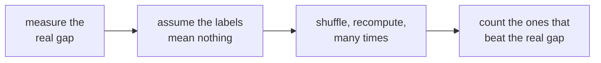

# Real or noise, cause or coincidence

Week 1 Day 4, Kalpa Retail. Three questions that look alike and need three different habits. The
page to keep for every interview that asks whether a number means anything.

## Panel 1: The shuffle, in one picture

That count, over how many worlds you made, is the p-value. Ten playing cards do it; the code does it five thousand times.

**Crux:** The unit you shuffle is the customer and not the order, because a customer's orders belong together and splitting them builds a world that could not exist.

## Panel 2: What a p-value is not

| It is | It is not |
|---|---|
| The share of chance-only worlds at least this extreme | The chance the finding is wrong |
| A statement about the null world | The chance that chance caused it |
| Silent about size | A measure of how big the effect is |

The first wrong reading is the one said aloud in meetings, and it reverses the meaning.

## Panel 3: Never write p equals zero

Five thousand shuffles resolve to one in five thousand. Write `p < 0.0002`.

The number you report is the resolution of your own simulation, not a certainty your method cannot produce.

## Panel 4: Two results, opposite verdicts

| | Retail-Plus | Student |
|---|---|---|
| Seen | a 32.3 point gap | 5 orders then 7 |
| Extreme shuffles | 0 of 5,000 | 1,914 of 5,000 |
| Reported as | p < 0.0002 | p = 0.383 |
| Reads as | chance does not do this | chance does this two in five |

**Crux:** Distrust any rate on fewer than about thirty observations, and say it is a rule of thumb rather than a law when you use it.

## Panel 5: Three separate calls

| Question | Answered by |
|---|---|
| Could chance have done this? | The p-value |
| Is it big? | The size of the effect |
| Is it worth acting on? | The cost against the gain |

Only the first comes from the data. A tiny p-value on a tiny effect is a precise measurement of something that does not matter.

## Panel 6: A fair comparison

A group that did **not** get the thing, that is **like** the group that did, in the ways that matter.

Targeting breaks the second half on purpose. The monsoon sale went to Retail-Plus, who already spend two and a half times more, so the exposed group was richer before the discount did anything.

**Crux:** When a comparison reverses once you split the groups, the aggregate was being driven by the mix rather than by the thing you changed.

## Panel 7: The note, four parts

| Part | Carries |
|---|---|
| Claim | One sentence, with the number and its denominator |
| Evidence | What you computed, and on how many |
| Caveat | The thing that would change the claim |
| Action | What to do, and what it costs |

The sentence you are paid for: **"We do not know yet, and here is what would tell us."**
