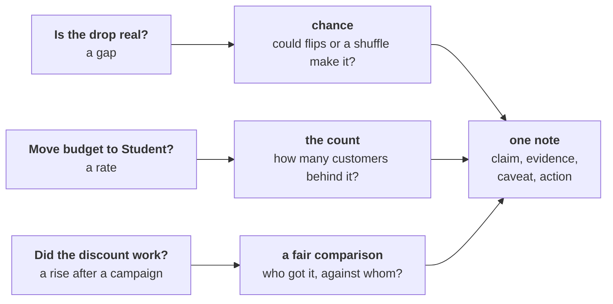

# Week 1 Thursday: Which of Meera's three numbers is real?

Kalpa Retail's CEO asks before Monday's review: is the Retail-Plus fall real, is Student's 40 percent
rise worth budget, and did the monsoon sale work?

## Panel 1: Which check does each of Meera's three questions need?



Meera Raghavan's three numbers are a fall per member in Retail-Plus, Kalpa's paid membership tier;
Student's 40 percent rise in orders; and Marketing's 6 percent lift from the monsoon sale. A gap gets
a chance reference that fits how the data was collected, a rate gets the count behind it, and a
campaign gets a fair comparison. Every check ends as one line of her one-page note, which may say
"not yet".

**Crux:** A p-value is a share of chance-only worlds; it is never the chance the finding is wrong.

## Panel 2: Which route fits each of the six questions?

| Question | Best fit here | Second route | Switch when |
|---|---|---|---|
| Real or wobble? | Flip each member's pair | Exact count; textbook paired test | Different customers: shuffle labels |
| Worth acting on? | Rupees against company and cost | Members' own falls, redrawn | A known recovery rate |
| Trust a rate? | Coin flips on its count | Every deal counted | A cheap way to reach customers |
| Did a discount work? | Split inside each segment | One mix: does the mix explain it? | Groups chosen by a coin |
| What goes to the CEO? | Four-part note, under 200 words | The day's rules, applied again | The same review every week |
| Did the sale cause it? | Random hold-back, next time | The test on months with no sale | A hold-back is refused |

## Panel 3: Flip or shuffle, and what does the share let you say?

The same members measured twice: flip each member's own pair. Different customers in each group:
shuffle the group labels.

```python
d = [a - b for a, b in zip(q1, q2)]
gaps = [mean([x if random.random() < .5 else -x
              for x in d]) for _ in range(5000)]
one_way = sum(g >= real for g in gaps) / 5000
either = sum(abs(g) >= abs(real) for g in gaps) / 5000
```

| Draft | Survives Kavya |
|---|---|
| "A 3 percent chance we are wrong." | "If nothing had changed, a fall this large turns up in about 3 of 100 flips, 6 either way." |
| "p = 0.72 proves nothing changed." | "The gap sits inside the usual wobble." |

## Panel 4: Is a gap that beats chance worth acting on?

A small share says a gap beats chance and nothing about its size: with enough orders even Rs 20
comes back significant. Size it against the company's quarter, then against the cost: an assumed
Rs 11,000 offer on a Rs 24,420 fall pays only above 45 percent recovery. If the range dips below the
cost, test on part of the group first.

**Crux:** Real and worth acting on are two separate calls: a chance reference answers the first, rupees against cost answer the second.

## Panel 5: When is a rate only a lead?

| Behind the rate | One more moves it by |
|---|---|
| 10 | 10 points |
| 30 | 3.3 points |
| 100 | 1 point |
| 400 | 0.25 points |

Count the customers as well as the orders: thirty orders from three customers are three customers'
habits. Flip a coin per order, thousands of times, and see how often chance alone makes the rise.

**Crux:** Count what a rate stands on, in customers as well as orders, before you repeat it; under thirty customers, it is a lead.

## Panel 6: How can a blend rise while every segment falls?

It happens when the group that got the campaign holds more of the segment that spends more anyway.
Compare inside each segment, state the two groups' mix, and put both on one mix for a one-line
answer. At 15 percent off, volume must rise 17.6 percent for revenue to stand still.

**Crux:** Split an aggregate by segment before you credit a campaign, and name who got it.

## Panel 7: What goes in the note to Meera, and how is it audited?

Claim: one sentence she can act on. Evidence: the number with its base and its count. Caveat: what
would change the claim. Action: what to do next and what it costs. Audit each line for a base, a
count or chance, and a caveat.

**Crux:** The note is claim, evidence, caveat, action, and "not yet, and here is what would tell us" is a complete answer.

## Panel 8: What makes a comparison fair enough to credit a campaign?

Before and after credits the campaign with the month. Put an untargeted segment beside it, count
the orders under each month, run the same test on months with no sale, and decide the next
campaign's groups with a coin, inside each segment, before it starts.

**Crux:** A fair comparison asks who got it, who did not, and what else changed; only a coin makes the two groups alike.
