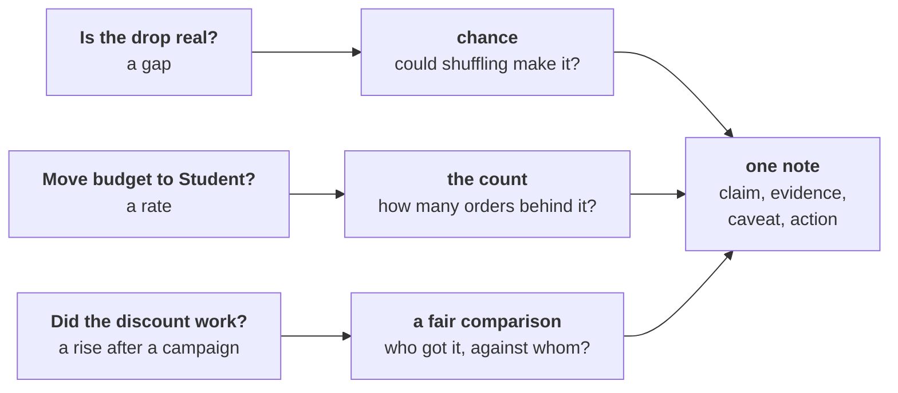

# Real, worth it, and caused?

Kalpa Retail, Week 1 Thursday. Three questions from Meera, six chapters, three checks before any
number reaches her note, and one page that may say "not yet".

## Panel 1: Three questions, three checks, one note



A gap gets a chance reference, a rate gets its count, and a campaign gets a fair comparison. Every
check ends as one line of the same note.

**Crux:** A p-value is a share of chance-only worlds; it is never the chance the finding is wrong.

## Panel 2: Choosing the route, chapter by chapter

| Question | Best fit here | Second route | Switch when |
|---|---|---|---|
| Real or wobble? | Shuffle test | Textbook two-sample test | Thousands of well-behaved rows |
| Worth acting on? | Rupees against company and cost | Bootstrap range | A known recovery rate |
| Trust a rate? | Coin flips on its count | Count every deal | A cheap way to buy more orders |
| Did a discount work? | Split inside each segment | Both groups on one mix | Groups chosen by a coin |
| What goes to the CEO? | Four-part note, under 200 words | Trace every figure back | The same review every week |
| Did the sale cause it? | Random hold-back, next time | Chapter 4's split | A hold-back is impossible |

## Panel 3: The shuffle test, and the sentence it supports

```python
random.seed(2026)
for _ in range(5000):
    random.shuffle(pool)
    gaps.append(mean(pool[:k]) - mean(pool[k:]))
share = sum(1 for g in gaps if g >= real_gap) / len(gaps)
```

| Draft | Survives Kavya |
|---|---|
| "A 3 percent chance we are wrong." | "If nothing had changed, a gap this large turns up in about 3 of every 100 shuffles." |
| "p = 0.34 proves nothing changed." | "The gap sits inside the usual wobble." |

## Panel 4: Real, then worth it

A small share says a gap beats chance, never that it is big: with enough orders even Rs 20 comes back
significant. Size it per member, for the segment and against the company's quarter, then against the
cost of acting: a fix that costs C against a fall of F pays only if it wins back more than C over F.
A bootstrap range that dips below the cost means test on part of the group first.

**Crux:** Real and worth acting on are two separate calls: the shuffle answers the first, rupees against cost answer the second.

## Panel 5: The count behind a rate

| Orders behind the rate | One order moves it by |
|---|---|
| 10 | 10 points |
| 30 | 3.3 points |
| 100 | 1 point |
| 400 | 0.25 points |

Flip a coin per order, thousands of times, and see how often chance alone makes the rise.

**Crux:** Count what a rate stands on before you repeat it; under thirty, it is a lead.

## Panel 6: Who got it, against whom

A blend can rise while every segment falls, when the group that got the campaign holds more of the
segment that spends more anyway. Compare inside each segment, state the mix of the two groups, and
put both groups on one mix for a one-line answer. A discount of d needs volume to rise by
1 / (1 minus d), less one, just to stand still: 17.6 percent at 15 percent off.

**Crux:** Split an aggregate by segment before you credit a campaign, and name who got it.

## Panel 7: The note to Meera

Claim: one sentence she can act on. Evidence: the number with its base and its count. Caveat: what
would change the claim. Action: what to do next and what it costs. Audit each line: a base, a count
or chance, a caveat.

**Crux:** The note is claim, evidence, caveat, action, and "not yet, and here is what would tell us" is a complete answer.

## Panel 8: The fair comparison

Before and after credits the campaign with the month. Put an untargeted segment beside it, count
the orders under each month, and decide the next campaign's groups with a coin, inside each
segment, before it starts.

**Crux:** A fair comparison asks who got it, who did not, and what else changed; only a coin makes the two groups alike.
