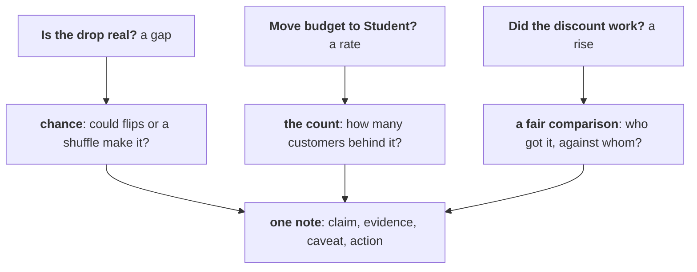

# Real, worth it, and caused?

Kalpa Retail, Week 1 Thursday. Three questions from Meera, six chapters, three checks before any
number reaches her note, and one page that may say "not yet".

## Panel 1: Three questions, three checks, one note



A gap gets a chance reference that fits its design, a rate gets its count, and a campaign gets a
fair comparison. Every check ends as one line of the same note.

**Crux:** A p-value is a share of chance-only worlds; it is never the chance the finding is wrong.

## Panel 2: Choosing the route, chapter by chapter

| Question | Best fit here | Second route | Switch when |
|---|---|---|---|
| Real or wobble? | Flip each member's pair | Exact count; textbook paired test | Different customers: shuffle labels |
| Worth acting on? | Rupees against company and cost | Bootstrap on members' differences | A known recovery rate |
| Trust a rate? | Coin flips on its count | Every deal counted | A cheap way to reach customers |
| Did a discount work? | Split inside each segment | One mix: does the mix explain it? | Groups chosen by a coin |
| What goes to the CEO? | Four-part note, under 200 words | The day's rules, applied again | The same review every week |
| Did the sale cause it? | Random hold-back, next time | The test on months with no sale | A hold-back is refused |

## Panel 3: Flip or shuffle, and the sentence it supports

The same members measured twice: flip each member's own pair. Different customers in each group:
shuffle the group labels.

```python
d = [a - b for a, b in zip(q1, q2)]
gaps = [mean([x if random.random() < .5 else -x
              for x in d]) for _ in range(5000)]
one_way = sum(g >= real for g in gaps) / 5000
either = sum(abs(g) >= abs(real) for g in gaps) / 5000
```

| Draft | Survives Kavya |
|---|---|
| "A 3 percent chance we are wrong." | "If nothing had changed, a fall this large turns up in about 3 of 100 flips, 6 either way." |
| "p = 0.72 proves nothing changed." | "The gap sits inside the usual wobble." |

## Panel 4: Real, then worth it

A small share says a gap beats chance and nothing about its size: with enough orders even Rs 20
comes back significant. Size it against the company's quarter, then against the cost: the offer
pays only if it wins back more of the fall than it costs, 45 percent here. A range that dips below
the cost means test on part of the group first.

**Crux:** Real and worth acting on are two separate calls: a chance reference answers the first, rupees against cost answer the second.

## Panel 5: The count behind a rate

| Behind the rate | One more moves it by |
|---|---|
| 10 | 10 points |
| 30 | 3.3 points |
| 100 | 1 point |
| 400 | 0.25 points |

Count the customers as well as the orders: thirty orders from three customers are three customers'
habits. Flip a coin per order, thousands of times, and see how often chance alone makes the rise.

**Crux:** Count what a rate stands on, in customers as well as orders, before you repeat it; under thirty customers, it is a lead.

## Panel 6: Who got it, against whom

A blend can rise while every segment falls, when the group that got the campaign holds more of the
segment that spends more anyway. Compare inside each segment, state the mix of the two groups, and
put both groups on one mix for a one-line answer. At 15 percent off, volume must rise 17.6 percent
just for revenue to stand still.

**Crux:** Split an aggregate by segment before you credit a campaign, and name who got it.

## Panel 7: The note to Meera

Claim: one sentence she can act on. Evidence: the number with its base and its count. Caveat: what
would change the claim. Action: what to do next and what it costs. Audit each line: a base, a count
or chance, a caveat.

**Crux:** The note is claim, evidence, caveat, action, and "not yet, and here is what would tell us" is a complete answer.

## Panel 8: The fair comparison

Before and after credits the campaign with the month. Put an untargeted segment beside it, count
the orders under each month, run the same test on months with no sale, and decide the next
campaign's groups with a coin, inside each segment, before it starts.

**Crux:** A fair comparison asks who got it, who did not, and what else changed; only a coin makes the two groups alike.
