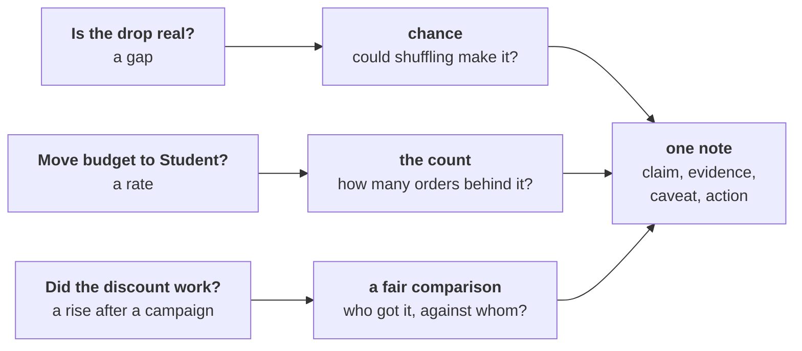

# Real, worth it, and caused?

Kalpa Retail, Week 1 Thursday. Three questions from Meera, three checks before any number reaches her
note, and one page that may say "not yet".

## Panel 1: Three questions, three checks, one note



A gap gets a chance reference, a rate gets its count, and a campaign gets a fair comparison. Every
check ends as one line of the same note.

**Crux:** A p-value is a share of chance-only worlds; it is never the chance the finding is wrong.

## Panel 2: The shuffle test, in five moves

| Move | What it does |
|---|---|
| The real gap | Q1 mean less Q2 mean, per member |
| Shuffle | Pool both quarters and deal the labels at random |
| Recompute | The gap in this chance-only world |
| Repeat | Thousands of times, with a fixed seed |
| Count | The share at least as large as the real gap |

```python
random.seed(2026)
for _ in range(5000):
    random.shuffle(pool)
    gaps.append(mean(pool[:k]) - mean(pool[k:]))
share = sum(1 for g in gaps if g >= real_gap) / len(gaps)
```

## Panel 3: The sentence a share supports

| Draft | Survives Kavya |
|---|---|
| "A 3 percent chance we are wrong." | "If nothing had changed, a gap this large turns up in about 3 of every 100 shuffles." |
| "97 percent certain." | "Chance rarely makes a gap this large, so we treat it as real." |
| "p = 0.34 proves nothing changed." | "The gap sits inside the usual wobble." |

Counting falls only answers "a drop this big"; counting rises too roughly doubles the share.

## Panel 4: Real, then worth it

A small share says a gap beats chance, never that it is big: with enough orders even Rs 20 on a
basket of about Rs 2,200 comes back significant. Size it three ways: per member, for the segment, against the
company's quarter. Then set it against the cost of acting: a fix that costs C against a fall of F pays
only if it wins back more than C over F.

**Crux:** Real and worth acting on are two separate calls: the shuffle answers the first, rupees against cost answer the second.

## Panel 5: The count behind a rate

| Orders behind the rate | One order moves it | Chance of a 40% rise from coin flips |
|---|---|---|
| 10 | 10 points | about 38 in 100 |
| 30 | 3.3 points | about 18 in 100 |
| 100 | 1 point | about 4 in 100 |
| 400 | 0.25 points | under 1 in 1,000 |

**Crux:** Count what a rate stands on before you repeat it; under thirty, it is a lead.

## Panel 6: Who got it, against whom

A blend can rise while every segment falls, when the group that got the campaign holds more of the
segment that spends more anyway. Compare inside each segment, state the mix of the two groups, and
settle it next time with a random held-back slice of each segment. A discount of d needs volume to
rise by 1 / (1 minus d), less one, just to stand still: 17.6 percent at 15 percent off.

**Crux:** Split an aggregate by segment before you credit a campaign, and name who got it.

## Panel 7: The note to Meera

Claim: one sentence she can act on. Evidence: the number with its count and how it was checked.
Caveat: what would change the claim. Action: what to do next and what it costs, including "wait and
measure".

**Crux:** The note is claim, evidence, caveat, action, and "not yet, and here is what would tell us" is a complete answer.
